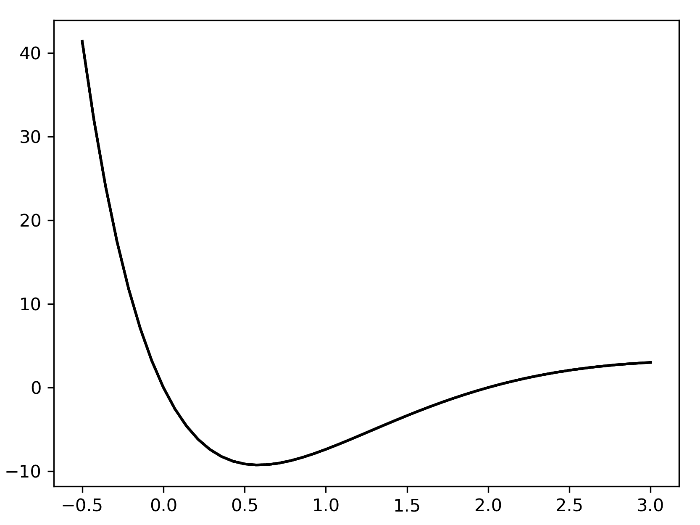
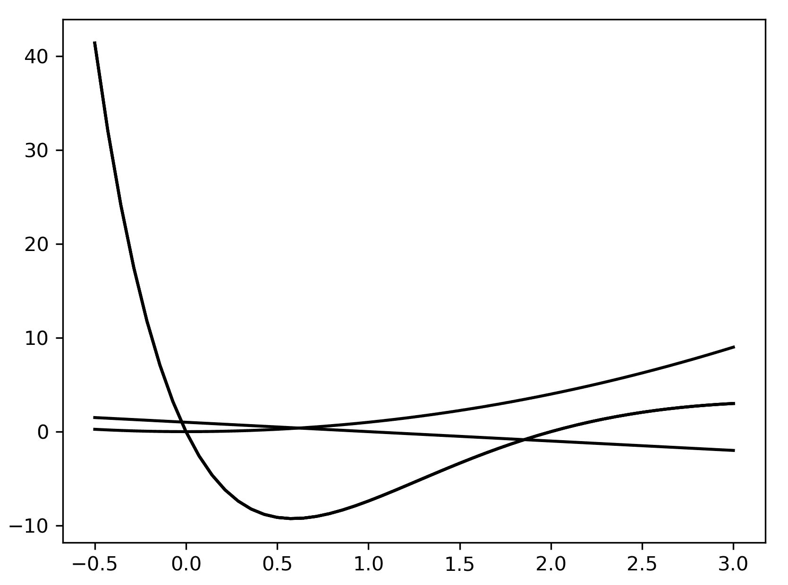
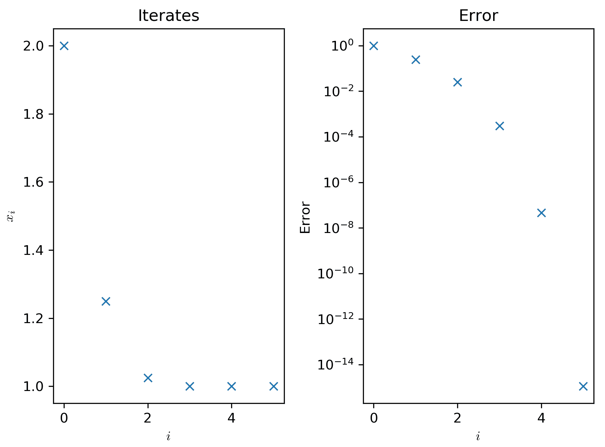
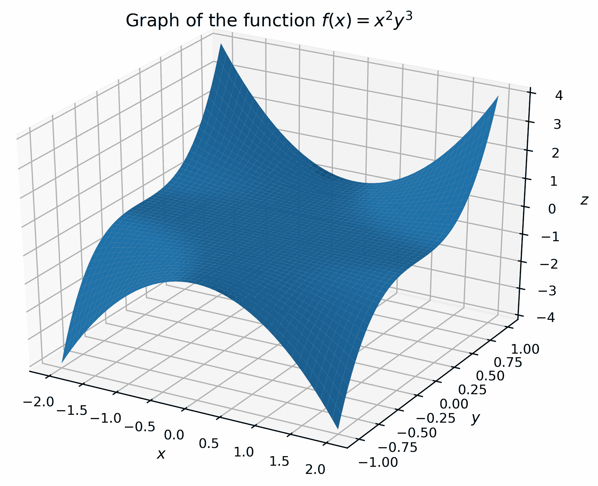
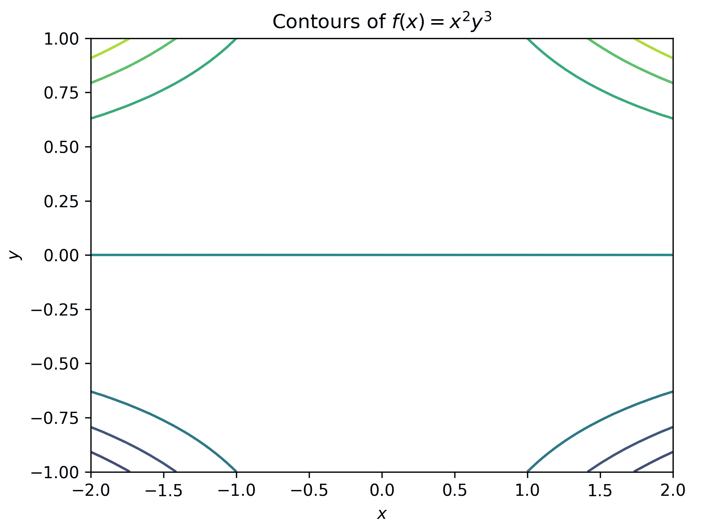
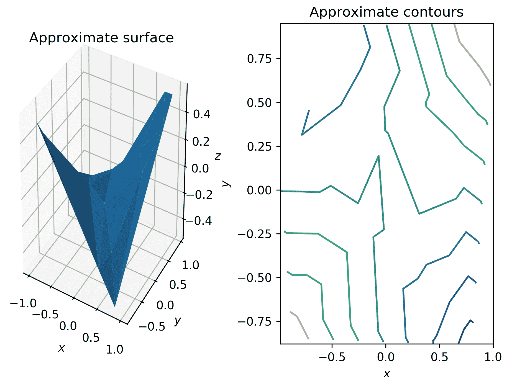
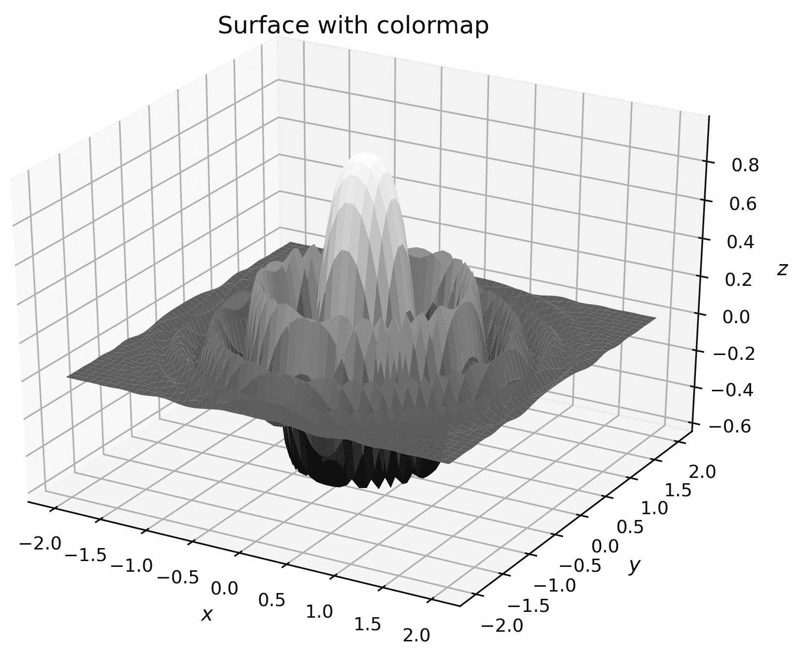
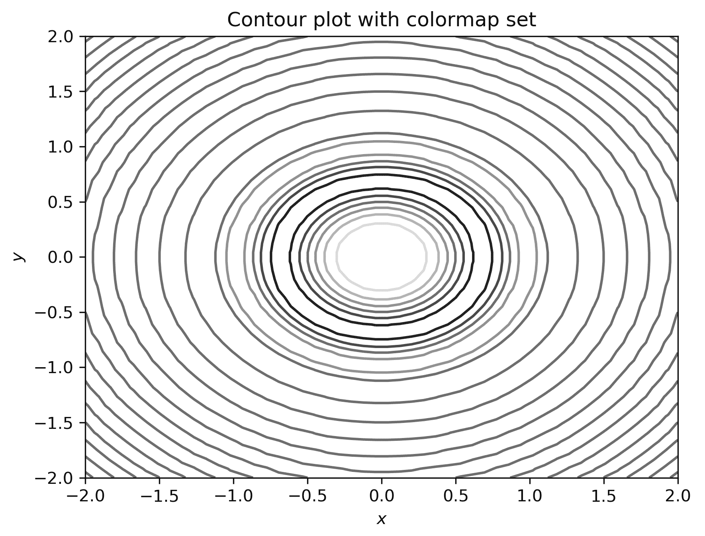

# 二、Matplotlib 数学绘图

绘图是所有数学中的基本工具。一个好的情节可以揭示隐藏的细节，建议未来的方向，验证结果，或者强化论点。因此，毫不奇怪，scientific Python 堆栈具有一个强大而灵活的绘图库 Matplotlib。

在本章中，我们将以各种样式绘制函数和数据，并创建完全标记和注释的图形。我们将创建三维绘图，自定义图形的外观，使用子绘图创建包含多个绘图的图形，并将图形直接保存到非交互式环境中运行的应用程序的文件中。

在本章中，我们将介绍以下配方：

*   使用 Matplotlib 进行基本打印
*   更改打印样式
*   向绘图添加标签和图例
*   添加子地块
*   保存 Matplotlib 图形
*   表面和等高线图
*   自定义三维绘图

# 技术要求

Python 的主绘图软件包是 Matplotlib，可以使用您喜爱的软件包管理器安装，如`pip`：

```py
          python3.8 -m pip install matplotlib

```

这将安装 Matplotlib 的最新版本，在编写本书时，该版本为 3.2.1 版。

Matplotlib 包含许多子包，但主要用户界面是`matplotlib.pyplot`包，按照惯例，它是以`plt`别名导入的。这是通过使用以下导入语句实现的：

```py
import matplotlib.pyplot as plt
```

本章中的许多食谱也需要 NumPy，与往常一样，NumPy 是以`np`别名进口的。

本章的代码可以在 GitHub 存储库的[的`Chapter 02`文件夹中找到 https://github.com/PacktPublishing/Applying-Math-with-Python/tree/master/Chapter%2002](https://github.com/PacktPublishing/Applying-Math-with-Python/tree/master/Chapter%2002) 。

查看以下视频以查看代码的运行：[https://bit.ly/2ZOSuhs](https://bit.ly/2ZOSuhs) 。

# 使用 Matplotlib 进行基本打印

策划是理解行为的重要部分。通过简单地绘制一个原本会隐藏的函数或数据，可以学到很多东西。在本配方中，我们将介绍如何使用 Matplotlib 绘制简单函数或数据。

Matplotlib 是一个功能非常强大的绘图库，这意味着使用它执行简单的任务可能会非常困难。对于习惯于使用 MATLAB 和其他数学软件包的用户，有一个基于状态的接口称为`pyplot`。还有一个面向对象的界面，它可能更适合于更复杂的绘图。`pyplot`界面是创建基本对象的便捷方式。

## 准备

最常见的情况是，您希望绘制的数据将存储在两个单独的 NumPy 数组中，为了清晰起见，我们将其标记为`x`和`y`（尽管这种命名在实践中并不重要）。我们将演示如何绘制函数图，因此我们将生成一个包含`x`值的数组，并使用该函数生成相应的`y`值。我们将绘制的函数定义如下：

```py
def f(x):
    return x*(x - 2)*np.exp(3 - x)
```

## 怎么做。。。

在绘制函数之前，必须生成要绘制的`x`和`y`数据。如果正在打印现有数据，可以跳过这些命令。我们需要创建一组覆盖所需范围的`x`值，然后使用函数创建`y`值：

1.  NumPy 的`linspace`例程非常适合创建用于绘图的数字数组。默认情况下，它将在指定参数之间创建 50 个等距点。点数可以通过提供附加参数进行自定义，但对于大多数情况，50 就足够了：

```py
x = np.linspace(-0.5, 3.0)  # 100 values between -0.5 and 3.0
```

2.  一旦我们创建了`x`值，我们就可以生成`y`值：

```py
y = f(x)  # evaluate f on the x points
```

3.  为了绘制数据，我们只需要从`pyplot`接口调用`plot`函数，该接口在`plt`别名下导入。第一个参数是`x`*数据，第二个参数是`y`数据。该函数返回打印数据的轴对象的句柄：*

```py
plt.plot(x, y)
```

4.  这将根据新图形上的`x`值绘制`y`值。如果您在 IPython 内工作或使用 Jupyter 笔记本，则此时应自动显示绘图；否则，您可能需要调用`plt.show`函数来显示绘图：

```py
plt.show()
```

如果您使用`plt.show`，该图形应显示在新窗口中。结果图应该类似于*图 2.1*中的图。默认打印颜色在打印上可能不同。为使本书具有较高的可见性，已对其进行了更改：



Figure 2.1: Plot of a function produced using Matplotlib without any additional styling parameters

在本章中，我们不会将此命令添加到任何进一步的配方中，但您应该知道，如果您不是在绘图将自动渲染的环境中工作，例如 IPython 控制台或 Jupyter 笔记本，则需要使用此命令。

## 它是如何工作的。。。

如果当前没有`Figure`或`Axes`对象，`plt.plot`例程将创建一个新的`Figure`对象，将一个新的`Axes`对象添加到图形中，并用打印数据填充该`Axes`对象。将返回打印线的句柄列表。每个手柄都是一个`Lines2D`对象。在本例中，此列表将包含单个`Lines2D`对象。稍后我们可以使用此`Lines2D`对象自定义线条的外观（请参见*更改打印样式*配方）。

Matplotlib 的对象层与较低级别的*后端*交互，完成了生成图形打印的繁重工作。`plt.show`函数向后端发出指令以呈现当前图形。有许多后端可与 Matplotlib 一起使用，可通过设置`MPLBACKEND`环境变量、修改`matplotlibrc`文件或从 Python 中调用`matplotlib.use`以替代后端的名称进行自定义。

The `plt.show` function does more than simply call the `show` method on a figure. It also hooks into an event loop to correctly display the figure. The `plt.show` routine should be used to display a figure, rather than the `show` method on a `Figure` object.

## 还有更多。。。

有时，在调用`plot`例程之前手动实例化`Figure`对象是很有用的，例如，强制创建一个新图形。此配方中的代码可以编写如下：

```py
fig = plt.figure()  # manually create a figure
lines = plt.plot(x, y)  # plot data
```

`plt.plot`例程接受数量可变的位置输入。在前面的代码中，我们提供了两个位置参数，它们被解释为`x`值和`y`值（按顺序）。如果我们只提供一个数组，`plot`例程将根据它们在数组中的位置绘制值；即，`x`值被取为`0`、`1`、`2`等。我们还可以提供多对阵列，在同一轴上绘制多组数据：

```py
x = np.linspace(-0.5, 3.0)
lines = plt.plot(x, f(x), x, x**2, x, 1 - x)
```

上述代码的输出如下所示：



Figure 2.2: Multiple plots on a single figure, produced using a single call to the plot routine in Matplotlib

有时，创建一个新图形并在此图形中显式创建一组新轴非常有用。最好的方法是使用`pyplot`接口中的`subplots`例程（参见*添加子批次*配方）。此例程返回一对，其中第一个对象是`Figure`，第二个对象是`Axes`对象：

```py
fig, ax = plt.subplots()
l1 = ax.plot(x, f(x))
l2 = ax.plot(x, x**2)
l3 = ax.plot(x, 1 - x)
```

此命令序列产生与*图 2.2*中显示的前一个相同的绘图。

Matplotlib 除了这里描述的`plot`例程之外，还有许多其他绘图例程。例如，有对轴使用不同比例的绘图方法，包括对数*x*或*y*轴单独（`semilogx`或`semilogy`分别）或一起（`loglog`）。Matplotlib 文档中对此进行了解释。

# 更改打印样式

Matplotlib 绘图的基本样式适用于按顺序打印函数或数据，但不适用于打印未按任何顺序显示的离散数据。为了防止 Matplotlib 在每个数据点之间绘制直线，我们可以将打印样式更改为“关闭”直线绘制。在这个方法中，我们将通过向`plot`方法添加一个格式字符串参数来定制轴上每条线的打印样式。

## 准备

您需要将数据存储在成对的数组中。在本演示中，我们将定义以下数据：

```py
y1 = np.array([1.0, 2.0, 3.0, 4.0, 5.0])
y2 = np.array([1.2, 1.6, 3.1, 4.2, 4.8])
y3 = np.array([3.2, 1.1, 2.0, 4.9, 2.5])
```

我们将根据这些点在阵列中的位置绘制这些点（即，对于每个阵列，*x*坐标分别为`0`、`1`、`2`、`3`或`4`）。

## 怎么做。。。

控制绘图样式的最简单方法是使用**格式字符串**，该字符串作为`plot`命令中*x-y*对或`y`*数据后的可选参数提供。打印多组数据时，可以为每组参数提供不同的格式字符串。以下步骤给出了创建新地物和在此地物上打印数据的一般过程：*

 *1.  我们首先使用`pyplot`中的`subplots`例程显式创建`Figure`和`Axes`对象：

```py
fig, ax = plt.subplots()
```

2.  现在我们已经创建了`Figure`和`Axes`对象，我们可以使用`plot`方法在`Axes`对象上绘制数据。此方法采用与`pyplot`中的`plot`例程相同的参数：

```py
lines = ax.plot(y1, 'o', y2, 'x', y3, '*')
```

这将使用圆形标记绘制第一个数据集（`y1`），使用`x`标记绘制第二个数据集（`y2`），使用星形标记绘制第三个数据集（`y3`）。此命令的输出如*图 2.3*所示。格式字符串可以指定许多不同的标记线和颜色样式。如果我们使用`pyplot`接口的绘图例程，则同样适用，该接口具有与`plot`方法相同的调用签名：


Figure 2.3: Plot of three sets of data, each plotted using a different marker style

## 它是如何工作的。。。

格式字符串有三个可选部分，每个部分由一个或多个字符组成。第一部分控制标记样式，即在每个数据点打印的符号；第二个控制连接数据点的线的样式；第三个控制绘图的颜色。在此配方中，我们只指定了标记样式，这意味着相邻数据点之间没有绘制连接线。这对于绘制不需要点间插值的离散数据非常有用。有四个线型参数可用：实线（`-`）；虚线（`--`）；点划线（`-.`）；或虚线（`:`）。格式字符串中只能指定有限数量的颜色；它们是红色、绿色、蓝色、青色、黄色、洋红、黑色和白色。格式字符串中使用的字符是每种颜色的第一个字母（黑色除外），因此对应的字符分别为`r`、`g`、`b`、`c`、`y`、`m`、`k`和`w`。

例如，如果我们只想将标记样式更改为加号，就像我们在本配方中所做的那样，我们将使用`"+"`格式字符串。如果我们还想将线条样式更改为点划线，我们将使用`"+-."`格式字符串。最后，如果我们还希望将标记的颜色更改为红色，我们将使用`"+-.r"`格式字符串。这些说明符也可以在其他配置中提供，例如在标记样式之前指定颜色，但这可能会导致 Matplotlib 解析格式字符串的方式出现歧义。

If you are using a Jupyter notebook and the `subplots` command, you must include the call to `subplots` within the same cell as the plotting commands or the figure will not be produced.

## 还有更多。。。

`plot`方法还接受许多关键字参数，这些参数也可用于控制绘图样式。关键字参数优先于格式字符串参数（如果两者都存在），并且它们应用于调用绘制的所有数据集。控制标记样式的关键字为`marker`，线条样式的关键字为`linestyle`，颜色的关键字为`color`。`color`关键字参数接受多种不同的格式来指定颜色，其中包括作为`(r, g, b)`元组的 RGB 值，其中每个字符是介于`0`和`1`之间的浮点或十六进制字符串。可以使用`linewidth`关键字控制绘制的线条宽度，该关键字应提供`float`值。还有许多其他关键字参数可以传递给`plot`；Matplotlib 文档中给出了一个列表。其中许多关键字参数的版本较短，例如`color`的`c`和`linewidth`的`lw`。

例如，我们可以使用以下命令在调用`plot`时使用`color`关键字参数来设置配方中所有标记的颜色：

```py
ax.plot(y1, 'o', y2, 'x', y3, '*', color="k")
```

调用`plot`方法（或`plt.plot`例程）返回的`Line2D`对象也可用于定制每组数据的外观。例如，可以使用`Line2D`对象中的`set_linestyle`方法，使用适当的线条样式格式字符串来设置线条样式。

可以使用`Axes`对象上的方法自定义绘图的其他方面。可以使用`Axes`对象上的`set_xticks`和`set_yticks`方法修改轴刻度，并且可以使用`grid`方法配置网格外观。`pyplot`界面中还有一些方便的方法可以将这些修改应用于当前轴（如果存在）。

例如，我们修改轴限制，在*x*和*y*方向上，将刻度设置为`0.5`的每一个倍数，并使用以下命令将网格添加到绘图中：

```py
ax.axis([-0.5, 5.5, 0, 5.5]) # set axes
ax.set_xticks([0.5*i for i in range(9)])  # set xticks
ax.set_yticks([0.5*i for i in range(11)] # set yticks
ax.grid()  # add a grid
```

请注意，我们如何将限制设置为略大于绘图范围。这是为了避免在打印窗口的边界上放置标记。

如果您希望在轴上绘制离散数据，而无需将点与线连接，则`scatter`绘图例程可能会更好。这样可以更好地控制标记的样式。例如，可以根据一些附加信息缩放标记。

# 向绘图添加标签和图例

每个绘图都应该有一个标题，轴应该正确标记。对于显示多组数据的绘图，图例是帮助读者快速识别不同数据集的标记、线条和颜色的好方法。在此配方中，我们将向绘图添加轴标签和标题，然后添加图例以帮助区分不同的数据集。为了保持代码简单，我们将绘制上一个配方中的数据。

## 怎么做。。。

按照以下步骤向绘图中添加标签和图例，以帮助区分它们所代表的数据集：

1.  我们首先使用以下`plot`命令从上一个配方重新创建绘图：

```py
fig, ax = plt.subplots()
ax = ax.plot(y1, "o-", y2, "x--", y3, "*-.")
```

2.  现在，我们有一个对`Axes`对象的引用，我们的数据被绘制在这个对象上，因此我们可以通过添加标签和标题来定制这些轴。通过使用`subplots`例程创建的`ax`对象上的`set_title`、`set_xlabel`和`set_ylabel`方法，可以将标题和轴标签添加到图形中。在每种情况下，参数都是一个字符串，其中包含要显示的文本：

```py
ax.set_title("Plot of the data y1, y2, and y3")
ax.set_xlabel("x axis label")
ax.set_ylabel("y axis label")
```

在这里，我们以不同的方式绘制三个数据集。标记样式与上一个配方中的相同，但我们为第一个数据集添加了实线，第二个数据集添加了虚线，第三个数据集添加了虚线。

3.  为了添加图例，我们在`ax`对象上调用`legend`方法。参数应该是一个元组或列表，其中包含要放置在图例中的每一组数据的描述：

```py
ax.legend(("data y1", "data y2", "data y3"))
```

上述命令序列的结果如下所示：


Figure 2.4: A plot with axes labels, a title, and a legend produced using Matplotlib

## 它是如何工作的。。。

`set_title`、`set_xlabel`和`set_ylabel`方法只是将文本参数添加到`Axes`对象的相应位置。前面代码中调用的`legend`方法按照标签添加到图中的顺序将标签添加到数据集，在本例中依次为`y1`、`y2`和`y3`。

有许多关键字参数可以提供给`set_title`、`set_xlabel`和`set_ylabel`例程来控制文本的样式。例如，`fontsize`关键字可用于在通常的`pt`点度量中指定标签字体的大小。文本参数也可以通过向例程提供`usetex=True`来使用 TeX 进行额外格式化。标签的 TeX 格式如*图 2.5*所示。如果标题或轴标签包含数学公式，则此选项特别有用。不幸的是，如果系统上没有安装 TeX，`usetex`关键字参数将无法使用，在这种情况下，它将导致错误。但是，仍然可以使用 TeX 语法格式化标签中的数学文本，但这将由 Matplotlib 而不是 TeX 进行排版。

我们可以通过使用`fontfamily`关键字使用不同的字体，该关键字的值可以是字体的名称，也可以是`serif`、`sans-serif`或`monospace`，这将选择合适的内置字体。在`matplotlib.text.Text`类的 Matplotlib 文档中可以找到修饰符的完整列表。

要向绘图添加单独的文本注释，可以在`Axes`对象上使用`annotate`方法。此例程接受两个参数：要显示为字符串的文本和应放置注释的点的坐标。此例程还接受前面提到的样式化关键字参数。

# 添加子地块

有时，将多个相关绘图并排放置在同一图形中但不在同一轴上是有用的。子图允许我们在单个图形中生成单个绘图的网格。在本配方中，我们将了解如何使用子图在单个图形上并排创建两个绘图。

## 准备

您需要在每个子地块上绘制数据。作为示例，我们将绘制牛顿方法应用于*f*（*x*）=*x<sup>2</sup>-1*函数*的前五次迭代，第一个子批次的初始值为*x<sub>0</sub>=2*，第二个子批次的初始值为*x<sub>0</sub>=2*，我们将绘制迭代的错误。我们首先定义一个生成器函数来获取迭代：*

```py
def generate_newton_iters(x0, number):
    iterates = [x0]
    errors = [abs(x0 - 1.)]
    for _ in range(number):
        x0 = x0 - (x0*x0 - 1.)/(2*x0)
        iterates.append(x0)
        errors.append(abs(x0 - 1.))
    return iterates, errors
```

此例程生成两个列表。第一个列表包含应用于函数的牛顿方法的迭代，第二个列表包含近似中的错误：

```py
iterates, errors = generate_newton_iters(2.0, 5)
```

## 怎么做。。。

以下步骤显示如何创建包含多个子地块的地物：

1.  我们使用`subplots`例程创建一个新图形，并引用每个子地块中的所有`Axes`对象，这些对象排列在一行两列的网格中。我们还将`tight_layout`关键字参数设置为`True`，以修复结果图的布局。严格来说，这不是必需的，但在本例中，这是因为它比默认值产生更好的结果：

```py
fig, (ax1, ax2) = plt.subplots(1, 2, tight_layout=True) # 1 row, 2 columns
```

2.  一旦创建了`Figure`和`Axes`对象，我们就可以通过调用每个`Axes`对象上的相关绘图方法来填充图形。对于第一个绘图（显示在左侧），我们在`ax1`对象上使用`plot`方法，该方法与标准`plt.plot`例程具有相同的签名。然后我们可以调用`ax1`上的`set_title`、`set_xlabel`和`set_ylabel`方法来设置标题以及`x`和`y`*标签。我们还通过提供`usetex`关键字参数为轴标签使用 TeX 格式；如果系统上未安装 TeX，则可以忽略此项：*

```py
ax1.plot(iterates, "x")
ax1.set_title("Iterates")
ax1.set_xlabel("$i$", usetex=True)
ax1.set_ylabel("$x_i$", usetex=True)
```

3.  现在，我们可以使用`ax2`对象在第二个图（显示在右侧）上绘制错误值。我们使用另一种绘图方法，在*y*轴上使用对数刻度，称为`semilogy`。此方法的签名与标准`plot`方法相同。同样，我们设置轴标签和标题。同样，如果您没有安装 TeX，则可以省略使用`usetex`：

```py
ax2.semilogy(errors, "x") # plot y on logarithmic scale
ax2.set_title("Error")
ax2.set_xlabel("$i$", usetex=True)
ax2.set_ylabel("Error")
```

此命令序列的结果如下所示：



Figure 2.5: Matplotlib subplots

左侧绘制牛顿方法的前五次迭代，右侧绘制对数标度上的近似误差。

## 它是如何工作的。。。

Matplotlib 中的`Figure`对象只是特定大小的打印元素（如`Axes`）的容器。一个`Figure`对象通常只包含一个`Axes`对象，它占据了整个图形区域，但它可以在同一区域包含任意数量的`Axes`对象。`subplots`例行程序做了几件事。它首先创建一个新地物，然后在地物区域中创建具有指定形状的栅格。然后，一个新的`Axes`对象被添加到网格的每个位置。然后将新的`Figure`对象和一个或多个`Axes`对象返回给用户。如果请求单个子批（一行一列，没有参数），则返回一个普通的`Axes`对象。若请求一行或一列（分别包含多个列或行），则返回一个`Axes`对象列表。若请求了多个行和列，则将返回一个列表列表，其中的行由填充有`Axes`对象的内部列表表示。然后，我们可以在每个`Axes`对象上使用绘图方法，用所需的绘图填充图形。

在这个配方中，我们使用标准的`plot`方法绘制左侧图，正如我们在前面的配方中看到的那样。然而，对于右侧图，我们使用了一个图，其中*y-*轴已更改为对数刻度。这意味着*y*轴上的每个单位表示 10 的幂的变化，而不是一个单位的变化，因此`0`表示 10<sup>0</sup>=1，`1`表示 10，`2`表示 100，依此类推。轴标签将自动更改，以反映此比例更改。当值改变一个数量级（例如近似值中的误差）时，这种类型的缩放非常有用，因为我们使用越来越多的迭代。我们也可以仅使用`semilogx`方法以对数比例绘制*x*，或者使用`loglog`方法以对数比例绘制两个轴。

## 还有更多。。。

有几种方法可以在 Matplotlib 中创建子地块。如果您已经创建了一个`Figure`对象，那么可以使用`Figure`对象的`add_subplot`方法添加子批次。或者，您可以使用`matplotlib.pyplot`中的`subplot`例程将子地块添加到当前图形中。如果还不存在子地块，则将在调用此例程时创建子地块。`subplot`例程是`Figure`对象上`add_subplot`方法的方便包装器。

要创建具有一个或多个子地块的新地物，您还可以使用`pyplot`界面中的`subplots`例程，正如我们在*更改绘图样式*配方中看到的那样，该配方返回一个新地物对象和一个`Axes`对象数组，每个位置一个。这三种方法都需要子批次矩阵的行数和列数。`add_subplot`方法和`subplot`例程还需要第三个参数，即要修改的子批次的索引。返回当前子批次的`Axes`对象。

在前面的示例中，我们创建了两个具有不同比例的*y-*轴的图。这说明了子地块的许多可能用途之一。另一个常见用途是在矩阵中绘制数据，其中列有一个共同的`x`标签，行有一个共同的`y`标签，这在调查不同数据集之间的相关性时，在多元统计中尤其常见。用于创建子批次的`plt.subplots`例程接受`sharex`和`sharey`关键字参数，这允许在所有子批次之间或在行或列之间共享轴。此设置影响轴的比例和刻度。

## 另见

Matplotlib 通过向`subplots`例程提供`gridspec_kw`关键字参数来支持更高级的布局。更多信息请参见`matplotlib.gridspec`文档。

# 保存 Matplotlib 图形

当您在交互式环境中工作时，例如 IPython 控制台或 Jupyter 笔记本，在运行时显示图形是完全正常的。然而，在很多情况下，将图形直接存储到文件中比在屏幕上渲染更合适。在这个配方中，我们将看到如何将图形直接保存到文件中，而不是在屏幕上显示。

## 准备

您需要打印数据以及要在其中存储输出的路径或文件对象。我们将结果存储在当前目录的`savingfigs.png`中。在本例中，我们将绘制以下数据：

```py
x = np.arange(1, 5, 0.1)
y = x*x
```

## 怎么做。。。

以下步骤说明如何将 Matplotlib 打印直接保存到文件中：

1.  第一步是像往常一样创建图形，并添加任何必要的标签、标题和注释。图形将以其当前状态写入文件，因此在保存之前应对图形进行任何更改：

```py
fig, ax = plt.subplots()
ax.plot(x, y)
ax.set_title("Graph of $y = x^2$", usetex=True)
ax.set_xlabel("$x$", usetex=True)
ax.set_ylabel("$y$", usetex=True)
```

2.  然后，我们使用`fig`上的`savefig`方法将该图保存到一个文件中。唯一需要的参数是图形可以写入的输出路径或类似文件的对象。我们可以通过提供适当的关键字参数来调整输出格式的各种设置，例如分辨率。我们将输出图形的**点/英寸**（**DPI**设置为`300`，这对于大多数应用来说是一个合理的分辨率：

```py
fig.savefig("savingfigs.png", dpi=300)
```

Matplotlib 将根据给定文件的扩展名推断我们希望以**便携式网络图形**（**PNG**格式）保存图像。或者，可以显式提供一种格式作为关键字参数（通过使用`format`关键字），或者从配置文件返回默认格式。

## 它是如何工作的。。。

`savefig`方法为输出格式选择适当的后端，然后以该格式呈现当前图形。生成的图像数据将写入指定的路径或类似文件的对象。如果您手动创建了一个`Figure`实例，那么对该实例调用`savefig`方法也可以达到同样的效果。

## 还有更多。。。

`savefig`例程采用许多额外的可选关键字参数来定制输出图像。例如，可以使用`dpi`关键字指定图像的分辨率。本章中的绘图是通过将 Matplotlib 图形保存到文件中生成的。

可用的输出格式包括 PNG、**可缩放矢量图形**（**SVG**）、**PostScript**（**PS**）、**封装 PostScript**（**EPS**）和**便携文档格式**（**PDF**）。如果安装了 Pillow 软件包，也可以保存为 JPEG 格式，但 Matplotlib 自 3.1 版起不支持本机保存。JPEG 图像还有其他自定义关键字参数，如`quality`和`optimize`。可以将图像元数据字典传递给`metadata`关键字，保存时作为图像元数据写入。

## 另见

Matplotlib 网站上的示例库包括使用几种常见 Python GUI 框架将 Matplotlib 图形嵌入到**图形用户界面**（**GUI**应用程序中的示例。

# 表面和等高线图

Matplotlib 还可以以多种方式绘制三维数据。显示此类数据的两种常见选择是使用**曲面图**或**等高线图**（想想地图上的等高线）。在本配方中，我们将看到一种从三维数据绘制曲面的方法，以及如何绘制三维数据的轮廓。

## 准备

要绘制三维数据，需要将其排列成二维阵列，用于*x*、*y*和*z*组件，其中*x*和*y*组件必须与*z*组件具有相同的形状。为了便于演示，我们将绘制*f*（*x*、*y*=*x*<sup xmlns:epub="http://www.idpf.org/2007/ops">2</sup>*y*3 函数对应的曲面。

## 怎么做。。。

我们想在-2 上绘制*f*（*x*、*y*=*x*<sup xmlns:epub="http://www.idpf.org/2007/ops">2</sup>y<sup xmlns:epub="http://www.idpf.org/2007/ops">3</sup>函数≤ *x*≤ 2 和-1≤ *y≤* 1 范围。第一项任务是创建一个合适的（*x*、*y*对网格，在该网格上评估该函数：

1.  我们首先使用`np.linspace`在这些范围内生成合理数量的点：

```py
X = np.linspace(-2, 2)
Y = np.linspace(-1, 1)
```

2.  现在，我们需要创建一个网格来创建我们的*z*值。为此，我们使用`np.meshgrid`例程：

```py
x, y = np.meshgrid(X, Y)
```

3.  现在，我们可以创建要绘制的*z*值，该值保存每个网格点处的函数值：

```py
z = x**2 * y**3
```

4.  要绘制三维曲面，我们需要加载 Matplotlib 包附带的 Matplotlib 工具箱`mplot3d`。这不会在代码中明确使用，但在幕后，它使 Matplotlib 可以使用三维打印实用程序：

```py
from mpl_toolkits import mplot3d
```

5.  接下来，我们为该图形创建一个新图形和一组三维轴：

```py
fig = plt.figure()
ax = fig.add_subplot(projection="3d")  # declare 3d plot
```

6.  现在，我们可以在这些轴上调用`plot_surface`方法来绘制数据：

```py
ax.plot_surface(x, y, z)
```

7.  将轴标签添加到三维绘图中尤为重要，因为可能不清楚显示的绘图上的轴：

```py
ax.set_xlabel("$x$")
ax.set_ylabel("$y$")
ax.set_zlabel("$z$")
```

8.  我们也应该在这个阶段设定一个标题：

```py
ax.set_title("Graph of the function $f(x) = x^2y^3$)
```

您可以使用`plt.show`例程在新窗口中显示图形（如果您以交互方式使用 Python，而不是在 Jupyter 笔记本或 IPython 控制台上），或者`plt.savefig`将图形保存到文件中。上述顺序的结果如下所示：



Figure 2.6: A three-dimensional surface plot produced with Matplotlib using the default settings

9.  等高线图不需要`mplot3d`工具包，`pyplot`界面中有`contour`例程生成等高线图。然而，与通常的（二维）绘图例程不同，`contour`例程需要与`plot_surface`方法相同的参数。我们使用以下顺序生成绘图：

```py
fig = plt.figure()  # Force a new figure
plt.contour(x, y, z)
plt.title("Contours of $f(x) = x^2y^3$")
plt.xlabel("$x$")
plt.ylabel("$y$")
```

结果如下图所示：



Figure 2.7: Contour plot produced using Matplotlib with the default settings

## 它是如何工作的。。。

`mplot3d`工具包提供了一个`Axes3D`对象，它是核心 Matplotlib 包中`Axes`对象的三维版本。当给出`projection="3d"`关键字参数时，`Figure`对象上的`axes`方法可以使用此选项。曲面图是通过在三维投影中绘制相邻点之间的四边形获得的，其方式与二维曲线通过连接相邻点的直线近似的方式相同。

`plot_surface`方法需要将*z*值作为二维数组提供，该数组将*z*值编码在（*x*、*y*对）网格上。我们创建了我们感兴趣的*x*和*y*值的范围，但是如果我们简单地在这些数组中的对应值对上评估我们的函数，我们将沿着直线而不是网格得到*z*值。相反，我们使用`meshgrid`例程，该例程获取两个`X`和`Y`数组，并从中创建一个由`X`和`Y`中所有可能的值组合组成的网格。输出是一对二维数组，我们可以在其上评估函数。然后我们可以将这三个二维阵列全部提供给`plot_surface`方法。

## 还有更多。。。

上一节中描述的例程`contour`和`plot_contour`仅适用于高度结构化的数据，其中*x*、*y*和*z*组件被排列成网格。不幸的是，现实生活中的数据很少如此结构化。在这种情况下，需要在已知点之间执行某种插值，以近似统一网格上的值，然后可以绘制该值。执行此插值的常用方法是对（*x*、*y*对）集合进行三角剖分，然后使用每个三角形顶点上的函数值来估计网格点上的值。幸运的是，Matplotlib 有一个方法可以完成所有这些步骤，然后绘制结果，这就是`plot_trisurf`例程。我们在此简要说明如何使用此功能：

1.  为了说明`plot_trisurf`的使用，我们将根据以下数据绘制曲面和等高线：

```py
x = np.array([ 0.19, -0.82, 0.8 , 0.95, 0.46, 0.71, 
     -0.86, -0.55,   0.75,-0.98, 0.55, -0.17, -0.89,
         -0.4 , 0.48, -0.09, 1., -0.03, -0.87, -0.43])
y = np.array([-0.25, -0.71, -0.88, 0.55, -0.88, 0.23, 
      0.18,-0.06, 0.95, 0.04, -0.59, -0.21, 0.14, 0.94, 
          0.51, 0.47, 0.79, 0.33, -0.85, 0.19])
z = np.array([-0.04, 0.44, -0.53, 0.4, -0.31, 0.13, 
      -0.12, 0.03, 0.53, -0.03, -0.25, 0.03, -0.1 , 
          -0.29, 0.19, -0.03, 0.58, -0.01, 0.55, -0.06])
```

2.  这一次，我们将在同一个图形上绘制曲面和轮廓（近似值），作为两个单独的子地块。为此，我们将`projection="3d"`关键字参数提供给包含曲面的子地块。我们在三维轴上使用`plot_trisurf`方法绘制近似曲面，在二维轴上使用`tricontour`方法绘制近似轮廓：

```py
fig = plt.figure(tight_layout=True)  # force new figure
ax1 = fig.add_subplot(1, 2, 1, projection="3d")  # 3d axes
ax1.plot_trisurf(x, y, z)
ax1.set_xlabel("$x$")
ax1.set_ylabel("$y$")
ax1.set_zlabel("$z$")
ax1.set_title("Approximate surface")
```

3.  现在，我们可以使用以下命令绘制三角化曲面的轮廓：

```py
ax2 = fig.add_subplot(1, 2, 2)  # 2d axes
ax2.tricontour(x, y, z)
ax2.set_xlabel("$x$")
ax2.set_ylabel("$y$")
ax2.set_title("Approximate contours")
```

我们在图中包含了`tight_layout=True`关键字参数，以便稍后保存对`plt.tight_layout`例程的调用。结果如下所示：



Figure 2.8: Approximate surface and contour plots generated from unstructured data using triangulation

除了曲面打印例程之外，`Axes3D`对象还有一个用于简单三维打印的`plot`（或`plot3D`例程，其工作原理与通常的`plot`例程完全相同，但在三维轴上。此方法也可用于在其中一个轴上绘制二维数据。

# 自定义三维绘图

等高线图可以隐藏它们所表示的曲面的某些细节，因为它们只显示“高度”相似的位置，而不显示值是什么，即使是相对于周围的值。在地图上，可以通过将高度打印到特定等高线上来解决此问题。曲面图更能说明问题，但将三维对象投影到二维以在屏幕上显示的问题本身会掩盖一些细节。为了解决这些问题，我们可以自定义三维绘图（或等高线图）的外观，以增强绘图效果，并确保要突出显示的细节清晰可见。最简单的方法是更改绘图的颜色贴图。

在这个配方中，我们将使用`binary`颜色映射的反面。

## 准备

我们将为以下函数生成曲面图：


我们按照上一个配方生成绘制点：

```py
X = np.linspace(-2, 2)
Y = np.linspace(-2, 2)
x, y = np.meshgrid(X, Y)
t = x**2 + y**2  # small efficiency
z = np.cos(2*np.pi*t)*np.exp(-t)
```

## 怎么做。。。

Matplotlib 有许多内置的颜色映射，可以应用于打印。默认情况下，曲面图使用单一颜色绘制，该颜色根据光源进行着色（请参见本配方的*还有更多…*部分）。彩色贴图可以显著改善绘图效果。以下步骤显示如何将颜色贴图添加到曲面和等高线图：

1.  首先，我们只需应用一个内置的颜色映射`binary_r`，这是通过向`plot_surface`例程提供`cmap="binary_r"`关键字参数来完成的：

```py
fig = plt.figure()
ax = fig.add_subplot(projection="3d")
ax.plot_surface(x, y, z, cmap="binary_r")
ax.set_title("Surface with colormap")
ax.set_xlabel("$x$")
ax.set_ylabel("$y$")
ax.set_zlabel("$z$")
```

结果是一个图（*图*2.9），其中表面根据其值进行着色，在这种情况下，颜色贴图两端的极值最大，*z*值越大，灰色阴影越浅。请注意，下图中曲线的锯齿状是由于网格中相对较少的点造成的：



Figure 2.9: A surface plot with a grayscale colormap applied

除曲面打印外，颜色贴图还应用于其他打印类型。特别是，彩色地图可以应用于等高线图，这有助于区分代表较高值的等高线和代表较低值的等高线。

2.  对于等高线图，更改颜色贴图的方法相同；我们只需为`cmap`关键字参数指定一个值：

```py
fig = plt.figure()
plt.contour(x, y, z, cmap="binary_r")
plt.xlabel("$x$")
plt.ylabel("$y$")
plt.title("Contour plot with colormap set")
```

上述代码的结果如下所示：



Figure 2.10: A contour plot with an alternative colormap set

图中较深的灰色对应较低的 z 值。

## 它是如何工作的。。。

颜色映射通过根据**颜色映射**的比例分配 RGB 值来工作。首先，对值进行规范化，使其位于`0`和`1`之间，这通常通过线性变换完成，将最小值转换为`0`，将最大值转换为`1`。然后将适当的颜色应用于曲面图（或其他类型图中的线）的每个面。

Matplotlib 附带了许多内置的颜色映射，只需将名称传递给`cmap`关键字参数即可应用这些颜色映射。文档（[中给出了这些颜色映射的列表 https://matplotlib.org/tutorials/colors/colormaps.html](https://matplotlib.org/tutorials/colors/colormaps.html) ），还附带了一个反向变体，该变体通过在所选颜色映射的名称中添加`_r`后缀获得。

## 还有更多。。。

应用颜色贴图的规范化步骤由从`Normalize`类派生的对象执行。Matplotlib 提供了许多标准规范化例程，包括`LogNorm`和`PowerNorm`。当然，您也可以创建自己的`Normalize`子类来执行规范化。可使用`plot_surface`的`norm`关键字或其他绘图功能添加替代`Normalize`子类。

对于更高级的用途，Matplotlib 提供了一个使用光源创建自定义着色的界面。这是通过从`matplotlib.colors`包导入`LightSource`类来完成的，然后使用该类的实例根据*z*值对表面元素进行着色。这是使用`LightSource`对象上的`shade`方法完成的：

```py
from matplotlib.colors import LightSource
light_source = LightSource(0, 45)  # angles of lightsource
cmap = plt.get_cmap("binary_r")
vals = light_source.shade(z, cmap)
surf = ax.plot_surface(x, y, z, facecolors=vals)
```

如果您希望了解更多有关其工作原理的信息，Matplotlib 库中会显示完整的示例。

# 进一步阅读

Matplotlib 包非常广泛，我们很难在这么短的时间内做到公正。该文档包含的详细信息远远超过此处提供的内容。此外，还有一个大型画廊（[https://matplotlib.org/gallery/index.html#](https://matplotlib.org/gallery/index.html#) 中的示例涵盖了比本书中更多的软件包功能。

在 Matplotlib 之上构建的其他软件包为特定应用程序提供高级绘图方法。例如，Seaborn 库提供了可视化数据的例程（[https://seaborn.pydata.org/](https://seaborn.pydata.org/) ）。****