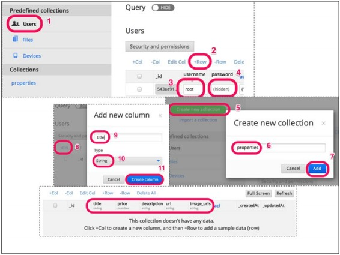
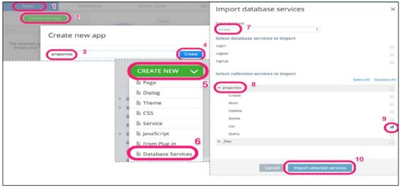
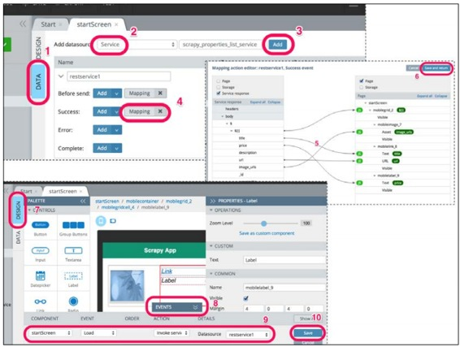
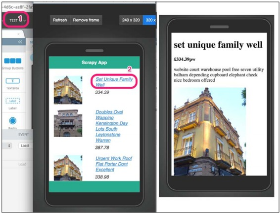

# 四、从Scrapy到移动应用

* * *

[序言](https://www.jianshu.com/p/6c9baeb60044)
[第1章 Scrapy介绍](https://www.jianshu.com/p/b807653e97bb)
[第2章 理解HTML和XPath](https://www.jianshu.com/p/90c2c25f0c41)
[第3章 爬虫基础](https://www.jianshu.com/p/6ebb898841bc)
第4章 从Scrapy到移动应用
[第5章 快速构建爬虫](https://www.jianshu.com/p/9d1e00dc40e4)
[第6章 Scrapinghub部署](https://www.jianshu.com/p/441fa74d7aad)
[第7章 配置和管理](https://www.jianshu.com/p/674de4eacf15)
[第8章 Scrapy编程](https://www.jianshu.com/p/545d07702e7f)
[第9章 使用Pipeline](https://www.jianshu.com/p/e0287e773d28)
[第10章 理解Scrapy的性能](https://www.jianshu.com/p/e9710002cb4e)
[第11章（完） Scrapyd分布式抓取和实时分析](https://www.jianshu.com/p/cfca4b7e62f4)

* * *

有人问，移动app开发平台Appery.io和Scrapy有什么关系？眼见为实。在几年前，用Excel向别人展示数据才可以让人印象深刻。现在，除非你的受众分布很窄，他们彼此之间是非常不同的。接下来几页，你会看到一个快速构建的移动应用，一个最小可行产品。它可以向别人清楚的展示你抓取的数据的力量，为源网站搭建的生态系统带来回报。

我尽量让这个挖掘数据价值的例子简短。要是你自己就有一个使用数据的应用，你可以跳过本章。本章就是告诉你如何用现在最流行的方式，移动应用，让你的数据面向公众。

## 选择移动应用框架

使用适当的工具向移动应用导入数据是相当容易的。跨平台开发移动应用的框架很多，例如PhoneGap、Appcelerator和Appcelerator云服务、jQuery Mobile和Sencha Touch。

本章会使用Appery.io，因为它可以让我们用PhoneGap和jQuery Mobile快速开发iOS、Android、Windows Phone、HTML5移动应用。我并不是要为Appery.io代言，我鼓励你自己去调研下它是否符合你的需求。Appery.io是一个付费服务，但有14天的试用期。在我看来，即使是外行也可以用Appery.io快速创建一个应用。我选择它的原因是，它提供了移动和后端两个服务，所以我们不用配置数据库、写REST APIs、或在服务器和移动端使用不同的语言。你将看到，我们根本不用写任何代码！我们会使用它的在线工具，你可以随时下载app作为PhoneGap项目，使用PhoneGap的全部特性。

使用Appery.io，你需要连接网络。另外，因为它的网站可能会发生改变，如果和截图不同不要惊讶。

## 创建数据库和集合

第一步是注册Appery.io，并选择试用。提供名字、Emai密码之后，你的账户就创立了。登录Appery.io工作台，你就可以创建数据库和集合了：


步骤如下：
1.点击Databases标签（1）。
2.然后点击绿色的Create new database按钮（2）。将新数据库命名为scrapy（3）。
3.现在点击Create按钮（4）。自动打开Scrapy数据库工作台，在工作台上可以新建集合。

在Appery.io中，数据库是集合的整合。粗略的讲，一个应用使用一个数据库，这个数据库中有许多集合，例如用户、特性、信息等等。Appery.io已经有了一个Users集合，用来存储用户名和密码（Appery.io有许多内建的功能）。



让我们添加一个用户，用户名是root，密码是pass。显然，密码可以更复杂。在侧边栏点击Users（1），然后点击+Row（2）添加user/row。在弹出的界面中输入用户名和密码（3,4）。

再为Scrapy抓取的数据创建一个集合，命名为properties。点击Create new collection绿色按钮（5），命名为properties（6），点击Add按钮（7）。现在，我们需要自定义这个集合。点击+Col添加列（8）。列有一些数据类型可以帮助确认值。大多数要填入的是字符串，除了价格是个数字。点击+Col（8）再添加几列，填入列的名字（9）、数据类型（10），然后点击Create column按钮（11）。重复五次这个步骤以创建下表：


创建好所有列之后，就可以导入数据了。

## **用Scrapy导入数据**

首先，我们需要API key，在Settings中可以找到（1）。复制它（2），然后点击Collections标签返回集合（3）：


现在，修改一下上一章的代码，以导入数据。我们把名字是easy.py的爬虫中的代码复制到名字是tomobile.py的爬虫中：

```py
$ ls
properties  scrapy.cfg
$ cat properties/spiders/tomobile.py
...
class ToMobileSpider(CrawlSpider):
    name = 'tomobile'
    allowed_domains = ["scrapybook.s3.amazonaws.com"]
    # Start on the first index page
    start_URL = (
        'http://scrapybook.s3.amazonaws.com/properties/'
        'index_00000.html',
    )
... 
```

你可能注意到了，我们没有使用网络服务器[http://web:9312](https://link.jianshu.com?t=http://web:9312)。我们用的是我托管在[http://scrapybook.s3.amazonaws.com](https://link.jianshu.com?t=http://scrapybook.s3.amazonaws.com)上的副本。使用它，我们的图片和URL所有人都可以访问，更易分享我们的app。

我们使用Appery.io pipline导入数据。Scrapy的pipelines是后处理的、简洁的、可以存储items的很小的Python类。第8章中会详细讲解两者。现在，你可以用easy_install或pip安装，但如果你用Vagrant开发机，因为已经都安装好了，你就不用再安装了：

```py
$ sudo easy_install -U scrapyapperyio 
```

或

```py
$ sudo pip install --upgrade scrapyapperyio 
```

这时，要在Scrapy的设置文件中添加API key。更多关于设置的内容会在第7章中介绍。现在，我们只需在在properties/settings.py文件后面加入如下代码：

```py
ITEM_PIPELINES = {'scrapyapperyio.ApperyIoPipeline': 300}
APPERYIO_DB_ID = '<<Your API KEY here>>'
APPERYIO_USERNAME = 'root'
APPERYIO_PASSWORD = 'pass'
APPERYIO_COLLECTION_NAME = 'properties' 
```

别忘了将APPERYIO_DB_ID替换为API key。还要确认你的设置有和Appery.io相同的用户名和密码。要进行向Appery.io注入数据，像之前一样用Scrapy抓取：

```py
$ scrapy crawl tomobile -s CLOSESPIDER_ITEMCOUNT=90
INFO: Scrapy 1.0.3 started (bot: properties)
...
INFO: Enabled item pipelines: ApperyIoPipeline
INFO: Spider opened
...
DEBUG: Crawled (200) <GET https://api.appery.io/rest/1/db/login?username=
root&password=pass>
...
DEBUG: Crawled (200) <POST https://api.appery.io/rest/1/db/collections/
properties>
...
INFO: Dumping Scrapy stats:
  {'downloader/response_count': 215,
   'item_scraped_count': 105,
  ...}
INFO: Spider closed (closespider_itemcount) 
```

输出的结果略有不用。你可以看到代码的前几行运行了ApperyIoPipeline的项目pipeline；更显著的是，大概抓取了100个项目，有约200个请求/响应。这是因为Appery.io pipeline为写入每个项目，都额外的做了一次请求。这些请求也出现在日志中，带有api.appery.io URL。


如果返回Appery.io，我们可以properties集合（1）中填入了数据（2）。

## **创建移动应用**

创建移动应用有点繁琐。点击Apps标签（1），然后点击Create new app（2）。将这个应用命名为properties（3），再点击Create按钮（4）：



## **创建数据库接入服务**

创建应用的选项很多。使用Appery.io应用编辑器可以编写复杂应用，但我们的应用力求简单。让我们的应用连接Scrapy数据库，点击CREATE NEW按钮（5），选择Datebase Services（6）。弹出一个界面让我们选择连接的对象。我们选择scrapy数据库（7）。点击properties栏（8），选择List（9）。这些操作可以让我们爬到的数据可用于数据库。最后点击Import selected services完成导入（10）。

设定用户界面
接下来创建app的界面。我们在DESIGN标签下工作：


在左侧栏中点开Pages文件夹（1），然后点击startScreen（2）。UI编辑器会打开一个页面，我们在上面添加空间。先修改标题。点击标题栏，在右侧的属性栏修改标题为Scrapy App。同时，标题栏会更新。

然后，我们添加格栅组件。从左侧的控制板中拖动Grid组件（5）。这个组件有两行，而我们只要一行。选择这个格栅组件，选中的时候，它在路径中会变为灰色（6）。选中之后，在右侧的属性栏中编辑Rows为1，然后点击Apply（7,8）。现在，格栅就只有一行了。

最后，再向格栅中拖进一些组件。先在左边添加一个图片组件（9），然后在右侧添加一个链接（10）。最后，在链接下添加一个标签（11）。

排版结束。接下来将数据从数据库导入用户界面。

## **将数据映射到用户界面**

截止目前，我们只是在DESIGN标签下设置界面。为了连接数据和组件，我们切换到DATA标签（1）：



我们用Service（2）作为数据源类型，它会自动选择我们之前建立的唯一可用数据。点击Add按钮（3）。点击Add之后，可以在下方看到一系列事件，例如Before send和Success。点击Success后面的Mapping可以调用服务，我们现在对它进行设置。

打开Mapping action editor，在上面进行连线。编辑器有两个部分。左边是服务的可用响应，右边是UI组件的属性。两边都有一个Expand all，展开所有的项，以查看可用的。接下来按照下表，用从左到右拖动的方式完成五个映射（5）：


## **映射数据字段和用户组件**

前面列表中的数字可能在你的例子中是不同的，但是因为每种组件的类型都是唯一的，所以连线出错的可能性很小。通过映射，我们告诉Appery.io当数据库查询成功时载入数据。然后点击Save and return（6）。

返回DATA标签。我们需要返回UI编辑器，点击DESIGN标签（7）。屏幕下方，你会看到EVENTS区域（8）被展开了。利用EVENTS，我们让Appery.io响应UI时间。下面是最后一步，就是加载UI时调用服务取回数据。我们打开startScreen作为组件，事件的默认选项是Load。然后选择Invoke service作为action，然后用Datasource作为默认的restservice1选项（9）。点击Save（10），保存这个移动应用。

## **测试、分享、生成app**

现在准备测试app。我们要做的是点击UI上方的TEST按钮（1）：



这个应用直接在浏览器中运行。链接（2）是启动的，可以进行跳转。你可以设置分辨率和屏幕的横竖。你还可以点击View on Phone，创建一个二维码，用手机扫描，然后在手机上看。你刚刚创建了一个链接，别人也可以在他们的浏览器中查看。

只需几次点击，我们就用一个移动应用展示了Scrapy抓取的数据。你可以在这个网页，[http://devcenter.appery.io/tutorials/](https://link.jianshu.com?t=http://devcenter.appery.io/tutorials/)学习[Appery.io](https://link.jianshu.com?t=http://Appery.io)教程，继续定制这个应用。当你准备好之后，可以点击EXPORT按钮输出这个app：


你可以输出文档到你喜爱的IDE继续开发，或是生成在各个平台都能运行的app。

## **总结**

使用Scrapy和Appery.io两个工具，我们创建了一个爬虫、抓取了一个网站，并将数据存到数据库之中。我们还创建了RESTful API和一个简单的移动端应用。对于更高级的特点和进一步开发，你可以进一步探究这个平台，或将这个应用用于实际或科研。现在，用最少的代码，你就可以用一个小产品展示网络抓取的应用了。

鉴于这么短的开发时间，我们的app就有不错的效果。它有真实的数据，而不是Lorem Ipsum占字符，所有的链接运行良好。我们成功地制作了一个最小可行产品，它可以融合进源网站的生态，提高流量。

接下来学习在更加复杂的情况下，如何使用Scrapy爬虫提取信息。

* * *

[序言](https://www.jianshu.com/p/6c9baeb60044)
[第1章 Scrapy介绍](https://www.jianshu.com/p/b807653e97bb)
[第2章 理解HTML和XPath](https://www.jianshu.com/p/90c2c25f0c41)
[第3章 爬虫基础](https://www.jianshu.com/p/6ebb898841bc)
第4章 从Scrapy到移动应用
[第5章 快速构建爬虫](https://www.jianshu.com/p/9d1e00dc40e4)
[第6章 Scrapinghub部署](https://www.jianshu.com/p/441fa74d7aad)
[第7章 配置和管理](https://www.jianshu.com/p/674de4eacf15)
[第8章 Scrapy编程](https://www.jianshu.com/p/545d07702e7f)
[第9章 使用Pipeline](https://www.jianshu.com/p/e0287e773d28)
[第10章 理解Scrapy的性能](https://www.jianshu.com/p/e9710002cb4e)
[第11章（完） Scrapyd分布式抓取和实时分析](https://www.jianshu.com/p/cfca4b7e62f4)

* * *