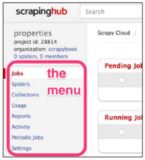
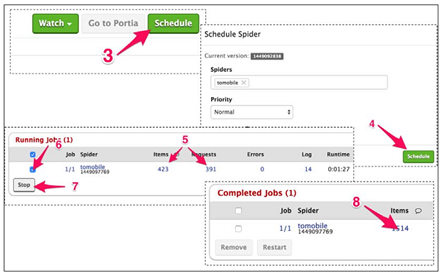
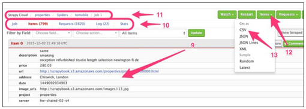

# 六、Scrapinghub部署

* * *

[序言](https://www.jianshu.com/p/6c9baeb60044)
[第1章 Scrapy介绍](https://www.jianshu.com/p/b807653e97bb)
[第2章 理解HTML和XPath](https://www.jianshu.com/p/90c2c25f0c41)
[第3章 爬虫基础](https://www.jianshu.com/p/6ebb898841bc)
[第4章 从Scrapy到移动应用](https://www.jianshu.com/p/4156e757557f)
[第5章 快速构建爬虫](https://www.jianshu.com/p/9d1e00dc40e4)
第6章 Scrapinghub部署
[第7章 配置和管理](https://www.jianshu.com/p/674de4eacf15)
[第8章 Scrapy编程](https://www.jianshu.com/p/545d07702e7f)
[第9章 使用Pipeline](https://www.jianshu.com/p/e0287e773d28)
[第10章 理解Scrapy的性能](https://www.jianshu.com/p/e9710002cb4e)
[第11章（完） Scrapyd分布式抓取和实时分析](https://www.jianshu.com/p/cfca4b7e62f4)

* * *

前面几章中，我们学习了如何编写爬虫。编写好爬虫之后，我们有两个选择。如果是做单次抓取，让爬虫在开发机上运行一段时间就行了。或者，我们往往需要周期性的进行抓取。我们可以用Amazon、RackSpace等服务商的云主机，但这需要一些设置、配置和维护。这时候就需要Scrapinghub了。

Scrapinghub是Scrapy高级开发者托管在Amazon上面的云架构。这是一个付费服务，但提供免费使用。如果想短时间内让爬虫运行在专业、有维护的平台上，本章内容很适合你。

**注册、登录、创建项目**

第一步是在[http://scrapinghub.com/](https://link.jianshu.com?t=http://scrapinghub.com/)注册一个账户，只需电子邮件地址和密码。点击确认邮件的链接之后，就登录了。首先看到的是工作台，目前还没有任何项目，点击+Service按钮（1）创建一个：


将项目命名为properties（2），点击Create按钮（3）。然后点击链接new（4）打开这个项目。



项目的工作台是最重要的界面。左侧栏中可以看到一些标签。Jobs和Spiders提供运行和爬虫的信息。Periodic Jobs可以制定周期抓取。其它四项，现在对我们不重要。


进入Settings（1）。和许多网站的设置不同，Scrapinghub提供许多非常有用的设置项。

现在，先关注下Scrapy Deploy（2）。

**部署爬虫并制定计划**

我们从开发机直接部署。将Scrapy Deploy页上的url复制到我们项目的scrapy.cfg中，替换原有的[depoly]部分。不必设置密码。我们用第4章中的properties爬虫作例子。我们使用这个爬虫的原因是，目标数据可以从网页访问，访问的方式和第4章中一样。开始之前，我们先恢复原有的settings.py，去除和Appery.io pipeline有关的内容：

> 提示：代码位于目录ch06。这个例子在ch06/properties中。

```py
$ pwd
/root/book/ch06/properties
$ ls
properties  scrapy.cfg
$ cat scrapy.cfg
...
[settings]
default = properties.settings
# Project: properties
[deploy]
url = http://dash.scrapinghub.com/api/scrapyd/
username = 180128bc7a0.....50e8290dbf3b0
password = 
project = 28814 
```

为了部署爬虫，我们使用Scrapinghub提供的shub工具，可以用pip install shub安装。我们的开发机中已经有了。我们shub login登录Scrapinghub，如下所示：

```py
$ shub login
Insert your Scrapinghub API key : 180128bc7a0.....50e8290dbf3b0
Success. 
```

我们已经在scrapy.cfg文件中复制了API key，我们还可以点击Scrapinghub右上角的用户名找到API key。弄好API key之后，就可以使用shub deploy部署爬虫了：

```py
$ shub deploy
Packing version 1449092838
Deploying to project "28814"in {"status": "ok", "project": 28814,
"version":"1449092838", "spiders": 1}
Run your spiders at: https://dash.scrapinghub.com/p/28814/ 
```

Scrapy打包了所有爬虫文件，并上传到了Scrapinghub。我们可以看到两个新目录和一个文件，可以选择删除或不删除。

```py
$ ls
build project.egg-info properties scrapy.cfgsetup.py
$ rm -rf build project.egg-info setup.py 
```

现在，如果我们在Scrapinghub点击Spiders栏（1），我们可以看到上传的tomobile爬虫：


如果我们点击它（2），可以转到爬虫的工作台。里面的信息很多，但我们要做的是点击右上角的Schedule按钮（3），在弹出的界面中再点击Schedule（4）。



几秒钟之后，Running Jobs栏会出现新的一行，再过一会儿，Requests和Items的数量开始增加。

> 提示：你或许不会限制抓取速度。Scrapinghub使用算法估算在不被封的情况下，你每秒的最大请求数。

运行一段时间后，勾选这个任务（6），点击Stop（7）。

几秒之后，可以在Completed Jobs看到抓取结束。要查看抓取文件，可以点击文件数（8）。

**访问文件**
来到任务的工作台。这里，可以查看文件（9），确认它们是否合格。我们还可以用上面的条件过滤结果。当我们向下翻动时，更多的文件被加载进来。



如果有错的话，我们可以在Items的上方找到有用的关于Requests和Log的信息（10）。用上方的面包屑路径（11）可以返回爬虫或项目主页。当然，可以点击左上的Items按钮（12）下载文件，选择合适的选项（13），保存格式可以是CSV、JSON和JSON Lines。

另一种访问文件的方法是通过Scrapinghub的Items API。我们要做的是查看任务页或文件页的URL。应该看起来和下面很像：
[https://dash.scrapinghub.com/p/28814/job/1/1/](https://link.jianshu.com?t=https://dash.scrapinghub.com/p/28814/job/1/1/)

在这个URL中，28814是项目编号（scrapy.cfg中也设置了它），第一个1是爬虫“tomobile”的ID编号，第二个1是任务编号。按顺序使用这三个数字，我们可以在控制台中用curl取回文件，请求发送到[https://storage.scrapinghub.com/items/](https://link.jianshu.com?t=https://storage.scrapinghub.com/items/)<project id>/<spider id>/<job id>，并使用用户名/API key验证，如下所示：

```py
$ curl -u 180128bc7a0.....50e8290dbf3b0: https://storage.scrapinghub.com/items/28814/1/1
{"_type":"PropertiesItem","description":["same\r\nsmoking\r\nr...
{"_type":"PropertiesItem","description":["british bit keep eve...
... 
```

如果询问密码的话，可以不填。用程序取回文件的话，可以使用Scrapinghub当做数据存储后端。存储的时间取决于订阅套餐的时间（免费试用是七天）。

**制定周期抓取**


只需要点击Periodic Jobs栏（1），点击Add（2），设定爬虫（3），调整抓取频率（4），最后点击Save（5）。

**总结**
本章中，我们首次接触了将Scrapy项目部署到Scrapinghub。定时抓取数千条信息，并可以用API方便浏览和提取。后面的章节中，我们继续学习设置一个类似Scrapinghub的小型服务器。下一章先学习配置和管理。

* * *

[序言](https://www.jianshu.com/p/6c9baeb60044)
[第1章 Scrapy介绍](https://www.jianshu.com/p/b807653e97bb)
[第2章 理解HTML和XPath](https://www.jianshu.com/p/90c2c25f0c41)
[第3章 爬虫基础](https://www.jianshu.com/p/6ebb898841bc)
[第4章 从Scrapy到移动应用](https://www.jianshu.com/p/4156e757557f)
[第5章 快速构建爬虫](https://www.jianshu.com/p/9d1e00dc40e4)
第6章 Scrapinghub部署
[第7章 配置和管理](https://www.jianshu.com/p/674de4eacf15)
[第8章 Scrapy编程](https://www.jianshu.com/p/545d07702e7f)
[第9章 使用Pipeline](https://www.jianshu.com/p/e0287e773d28)
[第10章 理解Scrapy的性能](https://www.jianshu.com/p/e9710002cb4e)
[第11章（完） Scrapyd分布式抓取和实时分析](https://www.jianshu.com/p/cfca4b7e62f4)

* * *