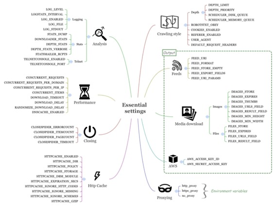

# 七、配置和管理


我们已经学过了用Scrapy写一个抓取网络信息的简单爬虫是多么容易。通过进行设置，Scrapy还有许多用途和功能。对于许多软件框架，用设置调节系统的运行，很让人头痛。对于Scrapy，设置是最基础的知识，除了调节和配置，它还可以扩展框架的功能。这里只是补充官方Scrapy文档，让你可以尽快对设置有所了解，并找到能对你有用的东西。在做出修改时，还请查阅文档。

**使用Scrapy设置**
在Scrapy的设置中，你可以按照五个等级进行设置。第一级是默认设置，你不必进行修改，但是scrapy/settings/default_settings.py文件还是值得一读的。默认设置可以在命令级进行优化。一般来讲，除非你要插入自定义命令，否则不必修改。更经常的，我们只是修改自己项目的settings.py文件。这些设置只对当前项目管用。这么做很方便，因为当我们把项目部署到云主机时，可以连带设置文件一起打包，并且因为它是文件，可以用文字编辑器进行编辑。下一级是每个爬虫的设置。通过在爬虫中使用custom_settings属性，我们可以自定义每个爬虫的设置。例如，这可以让我们打开或关闭某个特定蜘蛛的Pipelines。最后，要做最后的修改时，我们可以在命令行中使用-s参数。我们做过这样的设置，例如-s CLOSESPIDER_PAGECOUNT=3，这可以限制爬虫的抓取范围。在这一级，我们可以设置API、密码等等。不要在settings.py文件中保存这些设置，因为不想让它们在公共仓库中失效。

这一章，我们会学习一些非常重要且常用的设置。在任意项目中输入以下命令，可以了解设置都有多少类型：

```py
$ scrapy settings --get CONCURRENT_REQUESTS
16 
```

你得到的是默认值。修改这个项目的settings.py文件的CONCURRENT_REQUESTS的值，比如，14。上面命令行的结果也会变为14，别忘了将设置改回去。在命令行中设置参数的话：

```py
$ scrapy settings --get CONCURRENT_REQUESTS -s CONCURRENT_REQUESTS=19
19 
```

这个结果暗示scrapy crawl和scrapy settings都是命令。每个命令都使用这样的方法加载设置。再举一个例子：

```py
$ scrapy shell -s CONCURRENT_REQUESTS=19
>>> settings.getint('CONCURRENT_REQUESTS')
19 
```

当你想确认设置文件中的值时，你就可以才用以上几种方法。下面详细学习Scrapy的设置。

**基本设置**
Scrapy的设置太多，将其分类很有必要。我们从下图的基本设置开始，它可以让你明白重要的系统特性，你可能会频繁使用。



**分析**
通过这些设置，可以调节Scrapy的性能、调试信息的日志、统计、远程登录设备。

**日志**
Scrapy有不同的日志等级：DEBUG（最低），INFO，WARNING，ERROR，和CRITICAL（最高）。除此之外，还有一个SILENT级，没有日志输出。Scrapy的有用扩展之一是Log Stats，它可以打印出每分钟抓取的文件数和页数。LOGSTATS_INTERVAL设置日志频率，默认值是60秒。这个间隔偏长。我习惯于将其设置为5秒，因为许多运行都很短。LOG_FILE设置将日志写入文件。除非进行设定，输出会一直持续到发生标准错误，将LOG_ENABLED设定为False，就不会这样了。最后，通过设定LOG_STDOUT为True，你可以让Scrapy在日志中记录所有的输出（比如print）。

**统计**
STATS_DUMP是默认开启的，当爬虫运行完毕时，它把统计收集器（Stats Collector）中的值转移到日志。设定DOWNLOADER_STATS，可以决定是否记录统计信息。通过DEPTH_STATS，可以设定是否记录网站抓取深度的信息。若要记录更详细的深度信息，将DEPTH_STATS_VERBOSE设定为True。STATSMAILER_RCPTS是一个当爬虫结束时，发送email的列表。你不用经常设置它，但有时调试时会用到它。

**远程登录**
Scrapy包括一个内建的远程登录控制台，你可以在上面用Python控制Scrapy。TELNETCONSOLE_ENABLED是默认开启的，TELNETCONSOLE_PORT决定连接端口。在发生冲突时，可以对其修改。

**案例1——使用远程登录**
有时，你想查看Scrapy运行时的内部状态。让我们来看看如何用远程登录来做：

> 笔记：本章代码位于ch07。这个例子位于ch07/properties文件夹中。

```py
$ pwd
/root/book/ch07/properties
$ ls
properties  scrapy.cfg
Start a crawl as follows:
$ scrapy crawl fast
...
[scrapy] DEBUG: Telnet console listening on 127.0.0.1:6023:6023 
```

这段信息是说远程登录被激活，监听端口是6023。然后在另一台电脑，使用远程登录的命令连接：

```py
$ telnet localhost 6023
>>> 
```

现在，这台终端会给你一个在Scrapy中的Python控制台。你可以查看某些组件，例如用engine变量查看引擎，可以用est()进行快速查看：

```py
>>> est()
Execution engine status
time()-engine.start_time                        : 5.73892092705
engine.has_capacity()                           : False
len(engine.downloader.active)                   : 8
...
len(engine.slot.inprogress)                     : 10
...
len(engine.scraper.slot.active)                 : 2 
```

我们在第10章中会继续学习里面的参数。接着输入以下命令：

```py
>>> import time
>>> time.sleep(1) # Don't do this! 
```

你会注意到，另一台电脑有一个短暂停。你还可以进行暂停、继续、停止爬虫。使用远程机器时，使用远程登录的功能非常有用：

```py
>>> engine.pause()
>>> engine.unpause()
>>> engine.stop()
Connection closed by foreign host. 
```

**性能**
第10章会详细介绍这些设置，这里只是一个概括。性能设定可以让你根据具体的工作调节爬虫的性能。CONCURRENT_REQUESTS设置了并发请求的最大数。这是为了当你抓取很多不同的网站（域名/IPs）时，保护你的服务器性能。不是这样的话，你会发现CONCURRENT_REQUESTS_PER_DOMAIN和CONCURRENT_REQUESTS_PER_IP更多是限制性的。这两项分别通过限制每一个域名或IP地址的并发请求数，保护远程服务器。如果CONCURRENT_REQUESTS_PER_IP是非零的，CONCURRENT_REQUESTS_PER_DOMAIN则被忽略。这些设置不是按照每秒。如果CONCURRENT_REQUESTS = 16，请求平均消耗四分之一秒，最大极限则为每秒16/0.25 = 64次请求。CONCURRENT_ITEMS设定每次请求并发处理的最大文件数。你可能会觉得这个设置没什么用，因为每个页面通常只有一个抓取项。它的默认值是100。如果降低到，例如10或1，你可能会觉得性能提升了，取决于每次请求抓取多少项和pipelines的复杂度。你还会注意到，当这个值是关于每次请求的，如果CONCURRENT_REQUESTS = 16，CONCURRENT_ITEMS = 100意味每秒有1600个文件同时要写入数据库。我一般把这个值设的比较小。

对于下载，DOWNLOADS_TIMEOUT决定了取消请求前，下载器的等待时间。默认是180秒，这个时间太长，并发请求是16时，每秒的下载数是5页。我建议设为10秒。默认情况下，各个下载间的间隔是0，以提高抓取速度。你可以设置DOWNLOADS_DELAY改变下载速度。有的网站会测量请求频率以判定是否是机器人行为。设定DOWNLOADS_DELAY的同时，还会有±50%的随机延迟。你可以设定RANDOMIZE_DOWNLOAD_DELAY为False。

最后，若要使用更快的DNS查找，可以设定DNSCACHE_ENABLED打开内存DNS缓存。

**提早结束抓取**
Scrapy的CloseSpider扩展可以在条件达成时，自动结束抓取。你可以用CLOSESPIDER_TIMEOUT(in seconds)， CLOSESPIDER_ITEMCOUNT， CLOSESPIDER_PAGECOUNT，和CLOSESPIDER_ERRORCOUNT分别设置在一段时间、抓取一定数量的文件、发出一定数量请求、发生一定数量错误时，提前关闭爬虫。你会在运行爬虫时频繁地做出这类设置：

```py
$ scrapy crawl fast -s CLOSESPIDER_ITEMCOUNT=10
$ scrapy crawl fast -s CLOSESPIDER_PAGECOUNT=10
$ scrapy crawl fast -s CLOSESPIDER_TIMEOUT=10 
```

**HTTP缓存和脱机工作**
Scrapy的HttpCacheMiddleware中间件（默认关闭）提供了一个低级的HTTP请求响应缓存。如果打开的话，缓存会存储每次请求和对应的响应。通过设定HTTPCACHE_POLICY为scrapy.contrib.httpcache.RFC2616Policy，我们可以使用一个更为复杂的、按照RFC2616遵循网站提示的缓存策略。打开这项功能，设定HTTPCACHE_ENABLED为True，HTTPCACHE_DIR指向一个磁盘路径（使用相对路径的话，会存在当前文件夹内）。

你可以为缓存文件指定数据库后端，通过设定HTTPCACHE_STORAGE为scrapy.contrib.httpcache.DbmCacheStorage，还可以选择调整HTTPCACHE_DBM_MODULE。（默认为anydbm）还有其它微调缓存的设置，但按照默认设置就可以了。

**案例2——用缓存离线工作**
运行以下代码：

```py
$ scrapy crawl fast -s LOG_LEVEL=INFO -s CLOSESPIDER_ITEMCOUNT=5000 
```

一分钟之后才结束。如果你无法联网，就无法进行任何抓取。用下面的代码再次进行抓取：

```py
$ scrapy crawl fast -s LOG_LEVEL=INFO -s CLOSESPIDER_ITEMCOUNT=5000 -s HTTPCACHE_ENABLED=1
...
INFO: Enabled downloader middlewares:...*HttpCacheMiddleware* 
```

你会看到启用了HttpCacheMiddleware，如果你查看当前目录，会发现一个隐藏文件夹，如下所示：

```py
$ tree .scrapy | head
.scrapy
└── httpcache
    └── easy
        ├── 00
        │     ├── 002054968919f13763a7292c1907caf06d5a4810
        │     │     ├── meta
        │     │     ├── pickled_meta
        │     │     ├── request_body
        │     │     ├── request_headers
        │     │     ├── response_body
... 
```

当你再次运行不能联网的爬虫时，抓取稍少的文件，你会发现运行变快了：

```py
$ scrapy crawl fast -s LOG_LEVEL=INFO -s CLOSESPIDER_ITEMCOUNT=4500 -s 
HTTPCACHE_ENABLED=1 
```

抓取稍少的文件，是因为使用CLOSESPIDER_ITEMCOUNT结束爬虫时，爬虫实际上会多抓取几页，我们不想抓取不在缓存中的内容。清理缓存的话，只需删除缓存目录：

```py
$ rm -rf .scrapy 
```

**抓取方式**
Scrapy允许你设置从哪一页开始爬。设置DEPTH_LIMIT，可以设置最大深度，0代表没有限制。根据深度，通过DEPTH_PRIORITY，可以给请求设置优先级。将其设为正值，可以让你实现广度优先抓取，并在LIFO和FIFO间切换：

```py
DEPTH_PRIORITY = 1
SCHEDULER_DISK_QUEUE = 'scrapy.squeue.PickleFifoDiskQueue'
SCHEDULER_MEMORY_QUEUE = 'scrapy.squeue.FifoMemoryQueue' 
```

这个功能十分有用，例如，当你抓取一个新闻网站，先抓取离首页近的最近的新闻，然后再是其它页面。默认的Scrapy方式是顺着第一条新闻抓取到最深，然后再进行下一条。广度优先可以先抓取层级最高的新闻，再往深抓取，当设定DEPTH_LIMIT为3时，就可以让你快速查看最近的新闻。

有的网站在根目录中用一个网络标准文件robots.txt规定了爬虫的规则。当设定ROBOTSTXT_OBEY为True时，Scrapy会参考这个文件。设定为True之后，记得调试的时候碰到意外的错误时，可能是这个原因。

CookiesMiddleware负责所有cookie相关的操作，开启session跟踪的话，可以实现登录。如果你想进行秘密抓取，可以设置COOKIES_ENABLED为False。使cookies无效减少了带宽，一定程度上可以加快抓取。相似的，REFERER_ENABLED默认是True，可使RefererMiddleware生效，用它填充Referer headers。你可以用DEFAULT_REQUEST_HEADERS自定义headers。你会发现当有些奇怪的网站要求特定的请求头时，这个特别有用。最后，自动生成的settings.py文件建议我们设定USER_AGENT。默认也可以，但我们应该修改它，以便网站所有者可以联系我们。

**Feeds**
Feeds可以让你导出用Scrapy抓取的数据到本地或到服务器。存储路径取决于FEED_URI.FEED_URI，其中可能包括参数。例如scrapy crawl fast -o "%(name)s_%(time)s.jl，可以自动将时间和名字填入到输出文件。如果你需要你个自定义参数，例如%(foo)s, feed输出器希望在爬虫中提供一个叫做foo的属性。数据的存储，例如S3、FTP或本地，也是在URI中定义。例如，FEED_URI='[s3://mybucket/file.json'](https://link.jianshu.com?t=s3://mybucket/file.json')可以使用你的Amazon证书（AWS_ACCESS_KEY_ID和AWS_SECRET_ACCESS_KEY），将你的文件存储到Amazon S3。存储的格式，JSON、JSON Lines、CSV和XML，取决于FEED_FORMAT。如果没有指定的话，Scrapy会根据FEED_URI的后缀猜测。你可以选择输出为空，通过设定FEED_STORE_EMPTY为True。你还可以选择输出指定字段，通过设定FEED_EXPORT_FIELDS。这对.csv文件特别有用，可以固定header的列数。最后FEED_URI_PARAMS用于定义一个函数，对传递给FEED_URI的参数进行后处理。

**下载媒体文件**
Scrapy可以用Image Pipeline下载媒体文件，它还可以将图片转换成不同的格式、生成面包屑路径、或根据图片大小进行过滤。

IMAGES_STORE设置了图片存储的路径（选用相对路径的话，会存储在项目的根目录）。每个图片的URL存在各自的image_URL字段（它可以被IMAGES_URL_FIELD设置覆盖），下载下来的图片的文件名会存在一个新的image字段（它可以被IMAGES_RESULT_FIELD设置覆盖）。你可以通过IMAGES_MIN_WIDTH和IMAGES_MIN_HEIGHT筛选出小图片。IMAGES_EXPIRES可以决定图片在缓存中存储的天数。IMAGES_THUMBS可以设置一个或多个缩略图，还可以设置缩略图的大小。例如，你可以让Scrapy生成一个图标大小的缩略图或为每个图片生成一个中等的缩略图。

**其它媒体文件**
你可以使用Files Pipelines下载其它媒体文件。与图片相同FILES_STORE决定了存储地址，FILES_EXPIRES决定存储时间。FILES_URL_FIELD和FILES_
RESULT_FIELD的作用与之前图片的相似。文件和图片的pipelines可以同时工作。

**案例3——下载图片**
为了使用图片功能，我们必须安装图片包，命令是pip install image。我们的开发机已经安装好了。要启动Image Pipeline，你需要编辑settings.py加入一些设置。首先在ITEM_PIPELINES添加scrapy.pipelines.images.ImagesPipeline。然后，将IMAGES_STORE设为相对路径"images"，通过设置IMAGES_THUMBS，添加缩略图的描述，如下所示：

```py
ITEM_PIPELINES = {
...
    'scrapy.pipelines.images.ImagesPipeline': 1,
}
IMAGES_STORE = 'images'
IMAGES_THUMBS = { 'small': (30, 30) } 
```

我们已经为Item安排了image_URL字段，然后如下运行：

```py
$ scrapy crawl fast -s CLOSESPIDER_ITEMCOUNT=90
...
DEBUG: Scraped from <200 http://http://web:9312/.../index_00003.html/
property_000001.html>{
   'image_URL': [u'http://web:93img/i02.jpg'],
   'images': [{'checksum': 'c5b29f4b223218e5b5beece79fe31510',
               'path': 'full/705a3112e67...a1f.jpg',
               'url': 'http://web:93img/i02.jpg'}],
...
$ tree images 
images
├── full
│   ├── 0abf072604df23b3be3ac51c9509999fa92ea311.jpg
│   ├── 1520131b5cc5f656bc683ddf5eab9b63e12c45b2.jpg
...
└── thumbs
    └── small
        ├── 0abf072604df23b3be3ac51c9509999fa92ea311.jpg
        ├── 1520131b5cc5f656bc683ddf5eab9b63e12c45b2.jpg
... 
```

我们看到图片成功下载下来，病生成了缩略图。Images文件夹中存储了jpg文件。缩略图的路径可以很容易推测出来。删掉图片，可以使用命令rm -rf images。

**亚马逊网络服务**
Scrapy內建支持亚马逊服务。你可以将AWS的access key存储到AWS_ACCESS_KEY_ID，将secret key存到AWS_SECRET_ACCESS_KEY。这两个设置默认都是空的。使用方法如下：

*   当你用开头是s3://（注意不是http://）下载URL时
*   当你用media pipelines在s3://路径存储文件或缩略图时
*   当你在s3://目录存储输出文件时，不要在[settings.py](https://link.jianshu.com?t=http://settings.py)中存储这些设置，以免有一天这个文件要公开。

**使用代理和爬虫**
Scrapy的HttpProxyMiddleware组件可以让你使用代理，它包括http_proxy、https_proxy和no_proxy环境变量。代理功能默认是开启的。

**案例4——使用代理和Crawlera的智慧代理**
DynDNS提供了一个免费检查你的IP地址的服务。使用Scrapy shell，我们向checkip.dyndns.org发送一个请求，检查响应确定当前的IP 地址：

```py
$ scrapy shell http://checkip.dyndns.org
>>> response.body
'<html><head><title>Current IP Check</title></head><body>Current IP 
Address: xxx.xxx.xxx.xxx</body></html>\r\n'
>>> exit() 
```

要使用代理请求，退出shell，然后使用export命令设置一个新代理。你可以通过搜索HMA的公共代理列表（[http://proxylist.hidemyass.com/](https://link.jianshu.com?t=http://proxylist.hidemyass.com/)）测试一个免费代理。例如，假设我们选择一个代理IP是10.10.1.1，端口是80（替换成你的），如下运行：

```py
$ # First check if you already use a proxy
$ env | grep http_proxy
$ # We should have nothing. Now let's set a proxy
$ export http_proxy=http://10.10.1.1:80 
```

再次运行Scrapy shell，你可以看到这次请求使用了不同的IP。代理很慢，有时还会失败，这时可以选择另一个IP。要关闭代理，可以退出Scrapy shell，并使用unset http_proxy。

Crawlera是Scrapinghub的一个服务。除了使用一个大的IP池，它还能调整延迟并退出坏的请求，让连接变得快速稳定。这是爬虫工程师梦寐以求的产品。使用它，只需设置http_proxy的环境变量为：

```py
$ export http_proxy=myusername:mypassword@proxy.crawlera.com:8010 
```

除了HTTP代理，还可以通过它给Scrapy设计的中间件使用Crawlera。

**更多的设置**
接下来看一些Scrapy不常用的设置和Scrapy的扩展设置，后者在后面的章节会详细介绍。


**和项目相关的设定**
这个小标题下，介绍和具体项目相关的设置，例如BOT_NAME、SPIDER_MODULES等等。最好在文档中查看一下，因为它们在某些具体情况下可以提高效率。但是通常来讲，Scrapy的startproject和genspider命令的默认设置已经是合理的了，所以就不必另行设置了。和邮件相关的设置，例如MAIL_FROM，可以让你配置MailSender类，它被用来发送统计数据（还可以查看STATSMAILER_RCPTS）和内存使用（还可以查看MEMUSAGE_NOTIFY_MAIL）。还有两个环境变量SCRAPY_SETTINGS_MODULE和SCRAPY_PROJECT，它们可以让你微调Scrapy项目的整合，例如，整合一个Django项目。scrapy.cfg还可以让你修改设置模块的名字。

**扩展Scrapy设置**
这些设定允许你扩展和修改Scrapy的几乎每个方面。最重要的就是ITEM_PIPELINES。它允许你在项目中使用Item Processing Pipelines。我们会在第9章中看到更多的例子。除了pipelines，还可以用多种方式扩展Scrapy，第8章总结了一些方式。COMMANDS_MODULE允许我们设置自定义命令。例如，假设我们添加了一个properties/hi.py文件：

```py
from scrapy.commands import ScrapyCommand
class Command(ScrapyCommand):
    default_settings = {'LOG_ENABLED': False}
    def run(self, args, opts):
        print("hello") 
```

一旦我们在settings.py加入了COMMANDS_MODULE='properties.hi'，就可以在Scrapy的help中运行hi查看。在命令行的default_settings中定义的设置会与项目的设置合并，但是与settings.py文件的优先级比起来，它的优先级偏低。

Scrapy使用-_BASE字典（例如，FEED_EXPORTERS_BASE）来存储不同扩展框架的默认值，然后我们可以在settings.py文件和命令行中设置non-_BASE版本进行切换（例如，FEED_EXPORTERS）。

最后，Scrapy使用设置，例如DOWNLOADER或SCHEDULER，保管系统基本组件的包和类的名。我们可以继承默认的下载器（scrapy.core.downloader.Downloader），加载一些方法，在DOWNLOADER设置中自定义我们的类。这可以让开发者试验新特性、简化自动检测，但是只推荐专业人士这么做。

**微调下载**
RETRY_*, REDIRECT_*和METAREFRESH_*设置分别配置了Retry、Redirect、Meta-Refresh中间件。例如，REDIRECT_PRIORITY_设为2，意味着每次有重定向时，都会在没有重定向请求之后，预约一个新的请求。REDIRECT_MAX_TIMES设为20意味着，在20次重定向之后，下载器不会再进行重定向，并返回现有值。当你抓取一些有问题的网站时，知道这些设置是很有用的，但是默认设置在大多数情况下就能应付了。HTTPERROR_ALLOWED_CODES和URLLENGTH_LIMIT也类似。

**自动限定扩展设置**
AUTOTHROTTLE_*设置可以自动限定扩展。看起来有用，但在实际中，我发现很难用它进行调节。它使用下载延迟，并根据加载和指向服务器，调节下载器的延迟。如果你不能确定DOWNLOAD_DELAY（默认是0）的值，这个模块会派上用场。

**内存使用扩展设置**
MEMUSAGE_*设置可以配置内存使用扩展。当超出内存上限时，它会关闭爬虫。在共享环境中这会很有用，因为抓取过程要尽量小心。更多时候，你会将MEMUSAGE_LIMIT_MB设为0，将自动关闭爬虫的功能取消，只接收警告email。这个扩展只在类Unix平台有。

MEMDEBUG_ENABLED和MEMDEBUG_NOTIFY可以配置内存调试扩展，可以在爬虫关闭时实时打印出参考的个数。阅读用trackref调试内存泄漏的文档，更重要的，我建议抓取过程最好简短、分批次，并匹配服务器的能力。我认为，每批次最好一千个网页、不超过几分钟。

**登录和调试**
最后，还有一些登录和调试的设置。LOG_ENCODING，LOG_DATEFORMAT和LOG_FORMAT可以让你微调登录的方式，当你使用登录管理，比如Splunk、Logstash和Kibana时，你会觉得它很好用。DUPEFILTER_DEBUG和COOKIES_DEBUG可以帮助你调试相对复杂的状况，比如，当你的请求数比预期少，或丢失session时。

**总结**
通过阅读本章，你一定会赞叹比起以前手写的爬虫，Scrapy的功能更具深度和广度。如果你想微调或扩展Scrapy的功能，可以有大量的方法，见下面几章。

