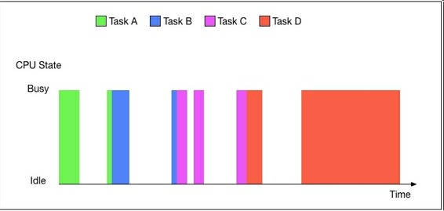

# 二、异步编程 （Distributed Computing with Python）


从本章开始，终于开始写代码了！本书中所有的代码都适用于Python 3.5及以上版本。当模块、语句或语法结构不适用于以前的版本时（比如Python 2.7），会在本章中指出。进行一些修改，本书代码也可以运行在Python 2.x版本上。

先回顾下上一章的知识。我们已经学到，改变算法的结构可以让其运行在本地计算机，或运行在集群上。即使是在一台计算机上运行，我们也可以使用多线程或多进程，让子程序运行在多个CPU上。

现在暂时不考虑多CPU，先看一下单线程/进程。与传统的同步编程相比，异步编程或非阻塞编程，可以使性能获得极大提高。

任何包含多任务的程序，它的每个每个任务都在执行一个操作。我们可以把这些任务当做功能或方法，也可以把几个任务合并看做一个功能。例如，将总任务细分、在屏幕打印内容、或从网络抓取信息，等等。

看一下传统程序中的这些任务是如何使用一个CPU的。考虑一个原生的实例，它有四个任务：A、B、C、D。这些任务具体是做什么在这里不重要。我们可以假设这四个任务是关于计算和I/O操作的。安排这四个任务的最直观的方式是序列化。下图展示了这四个任务对CPU的使用：



我们看到，当每个任务都执行I/O操作时，CPU处于空闲状态，等待任务进行计算。这使得CPU大部分时间处于闲置状态。

重点是，从不同组件，例如硬盘、内存和网络，向CPU传递数据的速度相差极大（几个数量级）。

这就会造成任何进行大量I/O操作（访问硬盘、网络通讯等等）的代码都极有可能造成CPU大部分时间闲置，如上图所示。

理想的状态应该是安排一下任务，当一个任务等待I/O时，它处于悬停状态，就让另一个任务接管CPU。这就是异步（也称为事件驱动）编程。

下图生动地展示了用异步编程的方式安排四个任务：


任务仍然是序列的，但是不再各自占用CPU直到任务结束，任务不需要计算时，它们会自发地放弃CPU。尽管CPU仍有闲置，程序的总运行时间明显缩短了。

使用多线程在不同的线程并行运行，也可以达到同样的效果。但是，有一个显著的不同：使用多线程时，是由操作系统决定哪个线程处于运行或悬停。然而，在异步编程中，每个任务可以自己决定是否放弃CPU。

另外，单单使用异步编程，我们不能做出真正的并发：同一时间仅仅有一个任务在运行，消除了竞争条件。当然，我们可以混合使用多线程/多进程和异步编程。

另一点要注意的是，异步编程更善于处理I/O密集型任务，而不是CPU密集型任务（暂停任务不会使性能提高）。

## 协程

在Python中，让一个功能中途暂停的关键是使用协程。为了理解协程，先要理解生成器generator，要理解生成器，先要理解迭代器iterator。

大部分Python开发者都熟悉对类进行迭代（例如，字符串、列表、元组、文件对象等等）：

```py
>>> for i in range(3):
...     print(i)
...
1
2
>>> for line in open('exchange_rates_v1.py'):
...     print(line, end='')
... 
#!/usr/bin/env python3
import itertools
import time
import urllib.request
… 
```

我们可以将各种对象（不仅仅是列表和字符串）进行迭代的原因是**迭代协议**。迭代协议定义了迭代的标准格式：一个执行`__iter__`和`__next__`（或Python 2.x中的 `__iter__`和`next`）的对象就是一个迭代器，可以进行迭代操作，如下所示：

```py
class MyIterator(object):
    def __init__(self, xs):
        self.xs = xs

    def __iter__(self):
        return self

    def __next__(self):
        if self.xs:
            return self.xs.pop(0)
        else:
            raise StopIteration

for i in MyIterator([0, 1, 2]):
    print(i) 
```

结果如下所示：

```py
1
2
3 
```

我们能对`MyIterator`中的实例进行循环的原因是，它用`__iter__`和`__next__`方法，运行了迭代协议：前者返回了迭代的对象，后者逐个返回了序列中的元素。

为了进一步理解协议是如何工作的，我们手动分解这个循环，如下所示：

```py
itrtr = MyIterator([3, 4, 5, 6])

print(next(itrtr))
print(next(itrtr))
print(next(itrtr))
print(next(itrtr))

print(next(itrtr)) 
```

运行结果如下：

```py
3
4
5
6
Traceback (most recent call last):
  File "iteration.py", line 32, in <module>
    print(next(itrtr))
  File "iteration.py", line 19, in __next__
  raise StopIteration
StopIteration 
```

我们实例化了`MyIterator`，然后为了获取它的值，我们多次调用了`next()`。当序列到头时，`next()`会抛出异常`StopIteration`。Python中的`for`循环使用了同样的机制，它调用迭代器的`next()`，通过获取异常`StopIteration`得知何时停止。

生成器就是一个callable，它生成一个结果序列，而不是返回结果。这是通过产生（通过`yield`关键字）值而不是返回值，见下面的例子（generators.py）：

```py
def mygenerator(n):
    while n:
        n -= 1
        yield n

if __name__ == '__main__':
    for i in mygenerator(3):
        print(i) 
```

结果如下：

```py
2
1
0 
```

这是一个使用`yield`使`mygenerator`成为生成器的简单例子，它的功能并不简单。调用`generator`函数并不开始生成序列，只是产生一个`generator`对象，见如下shell语句：

```py
>>> from generators import mygenerator
>>> mygenerator(5)
<generator object mygenerator at 0x101267b48> 
```

为了激活`generator`对象，需要调用`next()`，见如下代码：

```py
>>> g = mygenerator(2)
>>> next(g)
1
>>> next(g)
0
>>> next(g)
Traceback (most recent call last):
  File "<stdin>", line 1, in <module>
StopIteration 
```

每个`next()`从生成的序列产生一个值，直到序列为空，也就是获得异常`StopIteration`时。迭代器的行为也是类似的。本质上，生成器是简化的迭代器，免去了定义类中`__iter__`和`__next__`的方法。

另外，生成器是一次性操作，不能重复生成的序列。若要重复序列，必须再次调用`generator`函数。

用来在`generator`函数中产生序列值的`yield`表达式，还可以在等号右边使用，以消除值。这样就可以得到协程。协程就是一类函数，它可以通过`yield`，在指定位置暂停或继续任务。

需要注意，尽管协程是强化的生成器，在概念意义上并不等于生成器。原因是，协程与迭代无关。另一不同点，生成器产生值，而协程消除值。

让我们做一些协程，看看如何使用。协程有三种主要的结构，如下所示：

*   `yield()`： 用来暂停协程的执行
*   `send()`： 用来向协程传递数据（以让协程继续执行）
*   `close()`：用来关闭协程

下面代码展示了协程的使用（coroutines.py）：

```py
def complain_about(substring):
    print('Please talk to me!')
    try:
        while True:
            text = (yield)
            if substring in text:
                print('Oh no: I found a %s again!'
                      % (substring))
    except GeneratorExit:
        print('Ok, ok: I am quitting.') 
```

我们先定义个一个协程，它就是一个函数，名字是`complain_about`，它有一个参数：一个字符串。打印一句话之后，进入一个无限循环，由`try except`控制退出，即只有通过异常才能退出。利用异常`GeneratorExit`，当获得这个异常时就会退出。

循环的主体十分简单，使用`yield`来获取数据，存储在变量`text`中。然后，我们检测`substring`是否在`text`中。如果在的话，弹出一条新语句。

下面代码展示了在shell中如何使用这个协程：

```py
>>> from coroutines import complain_about
>>> c = complain_about('Ruby')
>>> next(c)
Please talk to me!
>>> c.send('Test data')
>>> c.send('Some more random text')
>>> c.send('Test data with Ruby somewhere in it')
Oh no: I found a Ruby again!
>>> c.send('Stop complaining about Ruby or else!')
Oh no: I found a Ruby again!
>>> c.close()
Ok, ok: I am quitting. 
```

执行`complain_about('Ruby')`产生了协程。为了使用新建的协程，我们用`next()`调用它，与在生成器中所做的相同。只有调用`next()`之后，才在屏幕上看到**Please talk to me!**。

这时，协程到达了`text = (yield)`，意味着它暂停了执行。控制点返回了shell，我们就可以向协程发送数据了。我们使用`send()`方法发送数据，如下所示：

```py
>>> c.send('Test data')
>>> c.send('Some more random text')
>>> c.send('Test data with Ruby somewhere in it')
Oh no: I found a Ruby again! 
```

每次调用`send()`方法都使代码到达下一个yield。在我们的例子中，到达`while`循环的下一次迭代，返回`text = (yield)`。这里，控制点返回shell。

我们可以调用`close()`方法停止协程，它可以在协程内部抛出异常`GeneratorExit`。此时，协程唯一能做的就是清理数据并退出。下面的代码展示了如何结束协程：

```py
>>> c.close()
Ok, ok: I am quitting. 
```

如果将`try except`部分注释掉，就不会获得`GeneratorExit`异常。但是协程还是会停止，如下所示：

```py
>>> def complain_about2(substring):
...     print('Please talk to me!')
...     while True:
...         text = (yield)
...         if substring in text:
...             print('Oh no: I found a %s again!'
...                   % (substring))
... 
>>> c = complain_about2('Ruby')
>>> next(c)
Please talk to me!
>>> c.close()
>>> c.send('This will crash')
Traceback (most recent call last):
  File "<stdin>", line 1, in <module>
StopIteration
>>> next(c)
Traceback (most recent call last):
  File "<stdin>", line 1, in <module>
StopIteration 
```

我们看到，一旦关闭协程，对象仍会保持，但是用途为零：不能向它发送数据，也不能调用`next()`使用它。

当使用协程时，许多人觉得必须要用`next()`很繁琐，转而使用装饰器，避免多余的调用，如下所示：

```py
>>> def coroutine(fn):
...     def wrapper(*args, **kwargs):
...         c = fn(*args, **kwargs)
...         next(c)
...         return c
...     return wrapper
... 
>>> @coroutine
... def complain_about2(substring):
...     print('Please talk to me!')
...     while True:
...         text = (yield)
...         if substring in text:
...             print('Oh no: I found a %s again!'
...                   % (substring))
... 
>>> c = complain_about2('JavaScript')
Please talk to me!
>>> c.send('Test data with JavaScript somewhere in it')
Oh no: I found a JavaScript again!
>>> c.close() 
```

协程的层级结构可以很复杂，可以让一个协程向其它多个协程发送数据，或从多个源接收数据。这在网络集群编程和系统编程中很有用（为了提高性能），可以用纯Python高效代替大多数Unix工具。

## 一个异步实例

为了简单又有趣，让我们写一个工具，可以对指定的文件，统计某个词的出现次数。使用之前的协程做基础，再添加一些功能。

在Linux和Mac OS X上，可以使用`grep`命令获得同样的结果。我们先下载一个大的文本文件，用作输入的数据。我们选择的是Project Gutenberg上列夫托尔斯泰所写的《战争与和平》，它的地址是[http://www.gutenberg.org/cache/epub/2600/pg2600.txt](https://link.jianshu.com?t=http://www.gutenberg.org/cache/epub/2600/pg2600.txt)。

下面代码展示了如何下载（译者注：win上使用Git Bash）：

```py
$ curl -sO http://www.gutenberg.org/cache/epub/2600/pg2600.txt
$ wc pg2600.txt
   65007  566320 3291648 pg2600.txt 
```

接下来，我们统计love一词出现的次数，忽略大小写，如下所示（译者注：会有编码问题）：

```py
$ time (grep -io love pg2600.txt | wc -l)
677
(grep -io love pg2600.txt) 0.11s user 0.00s system 98% cpu 0.116 total 
```

现在使用Python的协程来做（grep.py）：

```py
def coroutine(fn):
    def wrapper(*args, **kwargs):
        c = fn(*args, **kwargs)
        next(c)
        return c
    return wrapper

def cat(f, case_insensitive, child):
    if case_insensitive:
        line_processor = lambda l: l.lower()
    else:
        line_processor = lambda l: l

    for line in f:
        child.send(line_processor(line))

@coroutine
def grep(substring, case_insensitive, child):
    if case_insensitive:
        substring = substring.lower()
    while True:
        text = (yield)
        child.send(text.count(substring))

@coroutine
def count(substring):
    n = 0
    try:
        while True:
            n += (yield)
    except GeneratorExit:
        print(substring, n)

if __name__ == '__main__':
    import argparse

    parser = argparse.ArgumentParser()
    parser.add_argument('-i', action='store_true',
                        dest='case_insensitive')
    parser.add_argument('pattern', type=str)
    parser.add_argument('infile', type=argparse.FileType('r'))

    args = parser.parse_args()

    cat(args.infile, args.case_insensitive,
        grep(args.pattern, args.case_insensitive,
             count(args.pattern))) 
```

分析代码之前，我们先运行一下，和`grep`进行比较：

```py
$ time python3.5 grep.py -i love pg2600.txt
love 677
python3.5 grep.py -i love pg2600.txt  0.09s user 0.01s system 97% cpu 0.097 total 
```

可以看到，使用协程的纯Python版本与使用`grep`和`wc`命令的Unix相比，十分具有竞争力。当然，Unix的`grep`命令远比Python版本强大。不能简单宣称Python比C语言快！但是，Python的结果也是让人满意的。

来分析下代码。首先，再次执行`coroutine`的装饰器。之后，将总任务分解成三块：

*   逐行读取文件（通过`cat`函数）
*   统计每行中`substring`的出现次数（`grep`协程）
*   求和并打印数据（`count`协程）

在脚本文件的主体部分，我们解析命令行选项，将`cat`结果传给`grep`，将`grep`结果传给`count`，就像操作普通的Unix工具。

实现这个链条极其简单。我们将接收数据的协程当做参数（前面例子的`child`），传递给产生数据的函数或协程。然后，在数据源中，调用协程的`send`方法。

第一个函数`cat`，作为整个函数的数据源，它逐行读取文件，将每行发送给`grep`
（`child.send(line)`）。如果匹配是大小写不敏感的，不需要进行转换；如果大小写敏感，则都转化为小写。

`grep`命令是我们的第一个协程。这里，进入一个无限循环，持续获取数据（`text = (yield)`），统计`substring`在`text`中的出现次数，，将次数发送给写一个协程（即`count`）：`child.send(text.count(substring)))`。

`count`协程用总次数`n`，从`grep`获取数据，对总次数进行求和，`n += (yield)`。它捕获发送给各个协程关闭时的`GeneratorExit`异常（在我们的例子中，到达文件最后就会出现异常），以判断何时打印这个`substring`和`n`。

当把协程组织为更复杂的结构时，会更有趣。比如，我们可以统计多个单词出现的次数。

下面的代码展示了一种这样做的方法，通过一个额外的协程负责广播，将输入数据发送给任意数目的子协程（`mgrep.py`）：

```py
def coroutine(fn):
    def wrapper(*args, **kwargs):
        c = fn(*args, **kwargs)
        next(c)
        return c
    return wrapper

def cat(f, case_insensitive, child):
    if case_insensitive:
        line_processor = lambda l: l.lower()
    else:
        line_processor = lambda l: l

    for line in f:
        child.send(line_processor(line))

@coroutine
def grep(substring, case_insensitive, child):
    if case_insensitive:
        substring = substring.lower()
    while True:
        text = (yield)
        child.send(text.count(substring))

@coroutine
def count(substring):
    n = 0
    try:
        while True:
            n += (yield)
    except GeneratorExit:
        print(substring, n)

@coroutine
def fanout(children):
    while True:
        data = (yield)
        for child in children:
            child.send(data)

if __name__ == '__main__':
    import argparse

    parser = argparse.ArgumentParser()
    parser.add_argument('-i', action='store_true', dest='case_insensitive')
    parser.add_argument('patterns', type=str, nargs='+',)
    parser.add_argument('infile', type=argparse.FileType('r'))

    args = parser.parse_args()

    cat(args.infile, args.case_insensitive,
        fanout([grep(p, args.case_insensitive,
                     count(p)) for p in args.patterns])) 
```

代码看上去和之前的例子差不多。让我们分析一下差别。我们定义了一个广播器：`fanout`。`fanout()`协程使用一列协程作为输入，自身位于一个无限循环中。当收到数据后（`data = (yield)`），便将数据分发给注册的协程（`for child in children: child.send(data)`）。

不用修改`cat`、`grep`、`count`的代码，我们就可以利用原有的代码来搜索任意个数的字符串了！

它的性能依旧很好，如下所示：

```py
$ time python3.5 mgrep.py -i love hate hope pg2600.txt
hate 103
love 677
hope 158
python3.5 mgrep.py -i love hate hope pg2600.txt  0.16s user 0.01s system 98% cpu 0.166 total 
```

## 总结

Python从1.5.2版本之后引入了`asyncore`和`asynchat`模块，开始支持异步编程。2.5版本引入了`yield`，可以向协程传递数据，简化了代码、加强了性能。Python 3.4 引入了一个新的库进行异步I/O，称作`asyncio`。

Python 3.5通过`async def`和`await`，引入了真正的协程类型。感兴趣的读者可以继续研究Python的新扩展。一句警告：异步编程是一个强大的工具，可以极大地提高I/O密集型代码的性能。但是异步编程也是存在问题的，而且还相当复杂。

任何异步代码都要精心选择非阻塞的库，以防使用阻塞代码。并且要运行一个协程规划期（因为OS不能像规划线程一样规划协程），包括写一个事件循环和其它事务。读异步代码会有一定困难，即使我们的最简单的例子也很难一眼看懂。所以，一定要小心！

