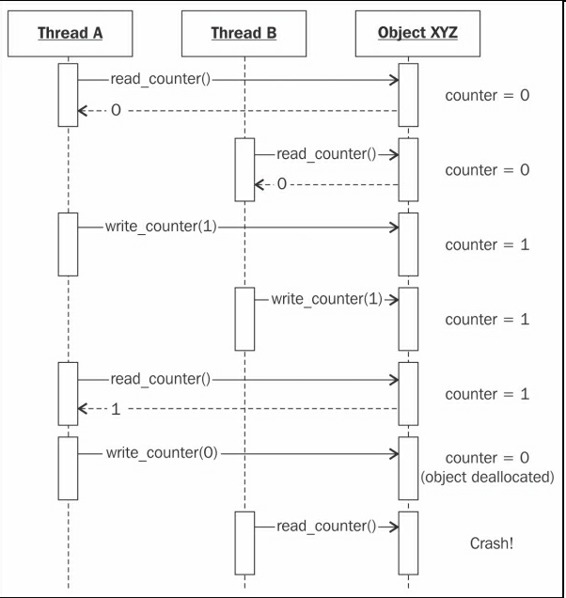
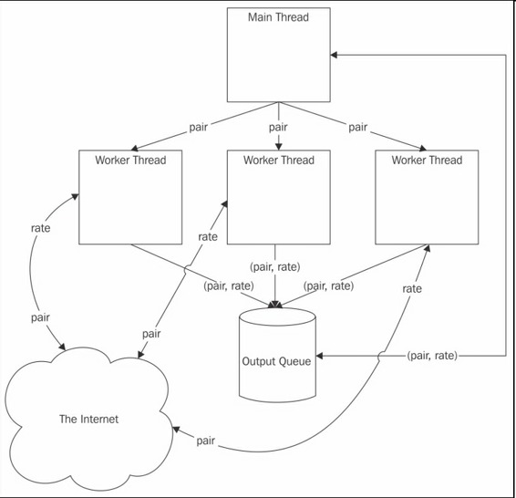

# 三、Python的并行计算 （Distributed Computing with Python）

* * *

[序言](https://www.jianshu.com/p/ad10480c89d9)
[第1章 并行和分布式计算介绍](https://www.jianshu.com/p/a8ec42f6cb4e)
[第2章 异步编程](https://www.jianshu.com/p/02893376bfe8)
第3章 Python的并行计算
[第4章 Celery分布式应用](https://www.jianshu.com/p/ee14ed9e4989)
[第5章 云平台部署Python](https://www.jianshu.com/p/84dde3009782)
[第6章 超级计算机群使用Python](https://www.jianshu.com/p/59471509d3d9)
[第7章 测试和调试分布式应用](https://www.jianshu.com/p/c92721ff5f3c)
[第8章 继续学习](https://www.jianshu.com/p/de89c55f8e8a)

* * *

我们在前两章提到了线程、进程，还有并发编程。我们在很高的层次，用抽象的名词，讲了如何组织代码，已让其部分并发运行，在多个CPU上或在多台机器上。

本章中，我们会更细致的学习Python是如何使用多个CPU进行并发编程的。具体目标是加速CPU密集型任务，提高I/O密集型任务的反馈性。

好消息是，使用Python的标准库就可以进行并发编程。这不是说不用第三方的库或工具。只是本章中的代码仅仅利用到了Python的标准库。

本章介绍如下内容：

*   多线程
*   多进程
*   多进程队列

## 多线程

Python从1.4版本开始就支持多线程了。它在`threading`模块中还提供了一个高级界面给系统本地（Linux和Mac OS X中的**POSIX**）线程，本章的例子会使用`threading`。

要注意在单CPU系统中，使用多线程并不是真正的并发，在给定时间只有一个线程在运行。只有在多CPU计算机上，线程才是并发的。本章假设使用的计算机是多处理器的。

让我们写一个简单的例子，使用多线程从网络下载数据。使用你的编辑器，新建一个Python文件，`currency.py`，代码如下：

```py
from threading import Thread
from queue import Queue
import urllib.request

URL = 'http://finance.yahoo.com/d/quotes.csv?s={}=X&f=p'
def get_rate(pair, outq, url_tmplt=URL):
    with urllib.request.urlopen(url_tmplt.format(pair)) as res:
        body = res.read()
    outq.put((pair, float(body.strip())))

if __name__ == '__main__':
    import argparse

    parser = argparse.ArgumentParser()
    parser.add_argument('pairs', type=str, nargs='+')
    args = parser.parse_args()

    outputq = Queue()
    for pair in args.pairs:
        t = Thread(target=get_rate,
                   kwargs={'pair': pair,
                           'outq': outputq})
        t.daemon = True
        t.start()

    for _ in args.pairs:
        pair, rate = outputq.get()
        print(pair, rate)
        outputq.task_done()
    outputq.join() 
```

这段代码十分简单。我们先从标准库引入需要的模块（`threading`、`queue`、`urllib.request`）。然后定义一个简单的函数`get_rate`，用以得到货币对（即EURUSD代表欧元兑美元，CHFAUS代表瑞士法郎兑澳元），和一个线程安全型队列（即，一个Python的`queue`模块`Queue`实例），用以链接Yahoo!Finance，并下载最新的汇率。

调用Yahoo!Finance API会返回包括数字的白文本（或者一个包含信息的CSV文件）。这意味着，我们不必解析HTML，直接可以在文本中找到需要的汇率。

此段代码使用了`argparse`模块，解析命令行参数。然后构造了一个队列（`outputq`），来保存各个线程下载的汇率的数据。一旦有了输出队列，我们就可以为每个汇率对新建一个工作线程。每个线程运行`get_rate`函数，使用汇率对和输出队列作为参数。

因为这些线程只是`fire`和`forget`线程，可以将它们做成守护进程，也就是说，Python主程序退出时不会等待它们退出（进程术语`join`）。

正确理解最后的守护进程和队列是十分重要的。使用线程的最大难点是，我们无法判断某个线程何时进行读取或写入与其它线程共享的数据。

这就会造成所谓的**竞争条件**。一方面，系统的正确执行取决于某些动作按顺序执行；另一方面，不能保证这些动作按照这些动作按照设计的顺序执行。

竞争条件的一个简单例子是引用计数算法。引用计数中，垃圾回收解释器如**CPython**（Python的标准解释器），每个对象都有一个计数器，用于跟踪引用的次数。

每一次引用一个对象时，对应的计数器增加1。每一次删除一个引用时，计数器减1。当计数器为0时，对象就被删除了。尝试使用被删除的对象，会发生语法错误。

这意味着，我们必须强制给计数器的增加和减少添加一个顺序。设想两个线程获取一个对象的引用一段时间，然后删除。如果两个线程在同一时间访问同一个引用计数器，它们就会复写值，如下图所示：



解决此类同步问题的方法之一是使用锁。线程安全队列是一个简易的使用锁数据结构的例子，使用它可以组织数据的访问。

因为每个线程都向同一个输出队列写入，我们最好监督队列，好知道何时有了结果，进而退出。在前面的代码中，我们的实现方法是从每个汇率对的队列取出一个结果（`args.pairs`循环），等待队列来加入（`outputq。join()`），即取得多有数据之后（更准确的，当每个`get()`方法之后都调用`task_done()`）。这样，就可以保证程序不提前退出。

尽管这个代码只是示例，没有进行查错、重试、处理缺省值或无效数值，它仍然是一个有用的、以队列为基础的架构。但是，要记住，使用锁的队列控制数据访问、避免竞争条件，取决于应用，可能花费很高。

下图展示了这个例子的架构，有三个工作线程，用以获取三个汇率值的数据，并将名字和数值存储到输出队列：



当然，我们可以不用线程，依次调用`get_rate()`函数取得每个汇率值。打开Python shell，我们可以如下实现：

```py
>>> from currency import get_rate
>>> import queue
>>> from time import time
>>> q = queue.Queue()
>>> pairs = ('EURUSD', 'GBPUSD', 'CHFEUR')
>>> t0 = time(); [get_rate(p, q) for p in pairs]; dt = time() - t0
[None, None, None]
>>> dt
1.1785249710083008
>>> [q.get() for p in pairs]
[('EURUSD', 1.1042), ('GBPUSD', 1.5309), ('CHFEUR', 0.9176)] 
```

每次使用一个请求，取得三个汇率，耗时1.2秒。

让我们运行下使用线程的例子：

```py
$ time python3.5 currency.py EURUSD GBPUSD CHFEUR
EURUSD 1.1042
GBPUSD 1.5309
CHFEUR 0.9176
python3.5 currency.py EURUSD GBPUSD CHFEUR  0.08s user 0.02s system 26% cpu 0.380 total 
```

后者总耗时0.4秒，为什么它的速度是前者的三倍呢？原因是，使用线程，可以并行运行三个请求。当然，还有一个主线程和队列（根据阿姆达尔定律，它们都属于序列分量），但是通过并发，还是使性能得到了极大提高。另外，我们可以像上一章一样，在单CPU上使用协程和非阻塞socket。

让我们看另一个例子，虽然使用了线程，性能却没有提高。用下面的代码新建一个文件（`fib.py`）：

```py
from threading import Thread

def fib(n):
    if n <= 2:
        return 1
    elif n == 0:
        return 0
    elif n < 0:
        raise Exception('fib(n) is undefined for n < 0')
    return fib(n - 1) + fib(n - 2)

if __name__ == '__main__':
    import argparse

    parser = argparse.ArgumentParser()
    parser.add_argument('-n', type=int, default=1)
    parser.add_argument('number', type=int, nargs='?', default=34)
    args = parser.parse_args()

    assert args.n >= 1, 'The number of threads has to be > 1'
    for i in range(args.n):
        t = Thread(target=fib, args=(args.number,))
        t.start() 
```

这段代码很好理解。先引入线程模块，然后让每个线程计算斐波那契额数`args.number`。我们并不关心斐波那契额数（不进行存储），只是想进行一些CPU密集型计算，计算菲波那切数列是一个很好的例子。

用不同并发程度，运行这个例子，如下所示：

```py
$ time python3.5 ./fib.py -n 1 34
python3.5 ./fib.py -n 1 34  2.00s user 0.01s system 99% cpu 2.013 total
$ time python3.5 ./fib.py -n 2 34
python3.5 ./fib.py -n 2 34  4.38s user 0.04s system 100% cpu 4.414 total
$ time python3.5 ./fib.py -n 3 34
python3.5 ./fib.py -n 3 34  6.28s user 0.08s system 100% cpu 6.354 total
$ time python3.5 ./fib.py -n 4 34
python3.5 ./fib.py -n 4 34  8.47s user 0.11s yousystem 100% cpu 8.541 total 
```

有趣的是，当用两个线程计算前34个斐波那契数时，耗时是单线程的两倍。增加线程的数目，会线性的增加耗时。很明显，并行运行的线程发生了错误。

Python底层有个东西影响着我们的CPU制约型进程，它就是全局锁（Global Interpreter Lock）。正如它的名字，全局锁控制引用计数始终合理。尽管Python的线程是OS原生的，全局锁却使特定时间只有一个是运行的。

有人会说Python是单线程的，这并不正确。但也不全部错误。刚刚我们看到的，和之前的协程很像。在协程的例子中，在给定时间只有一段代码才能运行，当一个协程或进程等待I/O时，让另一个运行CPU，也可以达到并发的效果。当一个任务需要占用CPU大量时间时，就像菲波那切数列这个CPU制约型任务，就不会有多大提高。

与协程很像，在Python中使用线程是可取的。并行I/O可以极大提高性能，无论是对多线程还是协程。GUI应用也可以从使用线程受益，一个线程可以处理更新GUI，另一个在后台运行，而不必使前台死机。只需要注意全局锁，做好应对。另外，并不是所有Python解释器都有全局锁，**Jython**就没有。

## 多进程

传统上，Python开发者为了避免全局锁对CPU制约型线程的影响，使用的是多进程而不是多线程。多进程有一些缺点，它必须启动Python的多个实例，启动时间长，耗费内存多。

同时，使用多进程并行运行任务，有一些极好的优点。

多进程有它们各自的内存空间，使用的是无共享架构，数据访问十分清晰。也更容易移植到分布式系统中。

Python的标准库中有两个模块，可以用来实现并行进程，两个模块都很优秀。其中之一是`multiprocessing`，另一个是`concurrent.futures`。`concurrent.futures`模块构建在`multiprocessing`和`threading`模块之上，提供更优的功能。

我们在下一个例子中使用的是`concurrent.futures`。Python 2.x用户可以用外部包的方式安装，即`futures`。

我们还是使用之前的菲波那切数列例子，这次使用多进程。同时，会快速介绍`concurrent.futures`模块。

使用下面代码新建一个文件（`mpfib.py`）：

```py
import concurrent.futures as cf

def fib(n):
    if n <= 2:
        return 1
    elif n == 0:
        return 0
    elif n < 0:
        raise Exception('fib(n) is undefined for n < 0')
    return fib(n - 1) + fib(n - 2)

if __name__ == '__main__':
    import argparse

    parser = argparse.ArgumentParser()
    parser.add_argument('-n', type=int, default=1)
    parser.add_argument('number', type=int, nargs='?', default=34)
    args = parser.parse_args()

    assert args.n >= 1, 'The number of threads has to be > 1'
    with cf.ProcessPoolExecutor(max_workers=args.n) as pool:
        results = pool.map(fib, [args.number] * args.n) 
```

这段代码很紧凑，也很易读。看一下它与多线程的不同，我们得到命令行参数之后，创建了一个`ProcessPoolExecutor`实例，调用它的`map()`方法进行并行计算。

根据直觉，我们建立了一个工作进程池`args.n`，使用这个进程池对每个输入（`args.number`重复`args.n`次）执行`fib`函数，以并行方式运行（取决于CPU的数目）。

（在一个四处理器的计算机上）运行这段代码，结果如下：

```py
$ time python3.5 ./mpfib.py -n 1 34
python3.5 ./mpfib.py -n 1 34  1.89s user 0.02s system 99% cpu 1.910 total
$ time python3.5 ./mpfib.py -n 2 34
python3.5 ./mpfib.py -n 2 34  3.76s user 0.02s system 196% cpu 1.928 total
$ time python3.5 ./mpfib.py -n 3 34
python3.5 ./mpfib.py -n 3 34  5.70s user 0.03s system 291% cpu 1.964 total
$ time python3.5 ./mpfib.py -n 4 34
python3.5 ./mpfib.py -n 4 34  7.71s user 0.03s system 386% cpu 2.006 total 
```

我们看到，在四处理器的计算机上运行时，可以实现真正的并行，运行一次到四次，时间差不多。

进程数比处理器数目多时，性能会急剧下降，如下所示：

```py
$ time python3.5 ./mpfib.py -n 8 34
python3.5 ./mpfib.py -n 8 34  30.23s user 0.06s system 755% cpu 4.011 total
$ time python3.5 ./mpfib.py -n 16 34
python3.5 ./mpfib.py -n 16 34  63.78s user 0.13s system 758% cpu 8.424 total 
```

再看一下代码的最后两行，这里的内容不少。首先，使用`concurrent.futures`模块导出的`ProcessPoolExecutor`类。它是被导出的两个类之一，另一个是`ThreadPoolExecutor`，用它来建立线程池，而不是进程池。

`ProcessPoolExecutor`和`ThreadPoolExecutor`有相同的API（实际上，二者都是同一个类的子类），它们有三个主要方法，如下：

*   `submit(f, *args, **kwargs)`：用来规划异步调用`f(*args, **kwargs)`，并返回一个`Future`实例作为结果占位符。
*   `map(f, *arglist, timeout=None, chunksize=1)`：它等价于内建的`(f, *arglist)`方法，它返回的是一个列表的`Future`对象，而不是`map`那样的结果。

第三种方法`shutdown(wait=True)`用来当所有`Executor`对象运行完毕时，释放资源。之前，则一直在等待（`if wait=True`）。运行这个方法之后再使用`Executor`对象，会抛出`RuntimeError`异常。

`Executor`对象还可以用来当做上下文管理（context manager），正如例子中，使用`cf.ProcessPoolExecutor(max_workers=args.n)`构建`pool`。上下文管理退出时，会默认阻塞调用`Executor shutdown`方法。这意味着，一旦上下文管理退出，我们访问`results`列表只会得到一些整数而不是`Future`实例。

`Future`实例是`concurrent.futures`包导出的另一个主要的类，它是异步调用的结果占位符。我们可以用它检测是否调用仍在运行，是否抛出异常，等等。我们调用一个`Future`实例的`result()`方法，来访问它的值。

不用上下文管理，再来运行一下这个例子。这样，就可以观察运行的`Future`类。结果如下：

```py
>>> from mpfib import fib
>>> from concurrent.futures import ProcessPoolExecutor
>>> pool = ProcessPoolExecutor(max_workers=1)
>>> fut = pool.submit(fib, 38)
>>> fut
<Future at 0x101b74128 state=running>
>>> fut.running()
True
>>> fut.done()
False
>>> fut.result(timeout=0)
Traceback (most recent call last):
  File "<stdin>", line 1, in <module>
  File "/Library/Frameworks/Python.framework/Versions/3.5/lib/python3.5/concurrent/futures/_base.py", line 407, in result
    raise TimeoutError()
concurrent.futures._base.TimeoutError
>>> fut.result(timeout=None)
39088169
>>> fut
<Future at 0x101b74128 state=finished returned int>
>>> fut.done()
True
>>> fut.running()
False
>>> fut.cancelled()
False
>>> fut.exception() 
```

这里，我们看到如何使用`concurrent.futures`包创建工作池（使用`ProcessPoolExecutor`类），并给它分配工作（`pool.submit(fib, 38)`）。正如所料，`submit`返回了一个`Future`对象（代码中的`fut`），它是还没产生结果时的占位符。

我们检测`fut`以确认它的状态，运行（`fut.running()`），完毕（`fut.done()`），取消（`fut.cancelled()`）。如果没有产生结果（`fut.result(timeout=0)`），就检测，会抛出异常`TimeoutError`。意味着，我们必须要么等待`Future`对象可用，或不设置超时的情况下，询问它的值。这就是我们做的，`fut.result(timeout=None)`，它会一直等待`Future`对象。因为代码没有错误，`fut.exception()`返回的是`None`。

我们可以只修改一行多进程的例子代码，就将它编程多线程的，将`ProcessPoolExecutor`换成`ThreadPoolExecutor`。快速写一个例子，将之前的例子（`mpfib.py`），更换下行：

```py
with cf. ProcessPoolExecutor (max_workers=args.n) as pool: 
```

为：

```py
with cf.ThreadPoolExecutor(max_workers=args.n) as pool: 
```

新文件（`mtfib.py`）的性能和之前的`fib.py`的性能差不多，如下所示：

```py
$ time python3.5 ./mtfib.py -n 1 34 
python3.5 ./mtfib.py -n 1 34  2.04s user 0.01s system 99% cpu 2.059 total
$ time python3.5 ./mtfib.py -n 2 34
python3.5 ./mtfib.py -n 2 34  4.43s user 0.04s system 100% cpu 4.467 total
$ time python3.5 ./mtfib.py -n 3 34
python3.5 ./mtfib.py -n 3 34  6.69s user 0.06s system 100% cpu 6.720 total
$ time python3.5 ./mtfib.py -n 4 34
python3.5 ./mtfib.py -n 4 34  8.98s user 0.10s system 100% cpu 9.022 total 
```

## 多进程队列

多进程要解决的问题是，如何在工作进程之间交换数据。`multiprocessing`模块提供的方法是队列和管道。接下来，我们来看多进程队列。

`multiprocessing.Queue` 类是按照`queue.Queue`类建模的，不同之处是多进程队列中的items要求是可选取的。为了展示如何使用队列，新建一个文件（`queues.py`），它的代码如下：

```py
import multiprocessing as mp

def fib(n):
    if n <= 2:
        return 1
    elif n == 0:
        return 0
    elif n < 0:
        raise Exception('fib(n) is undefined for n < 0')
    return fib(n - 1) + fib(n - 2)

def worker(inq, outq):
    while True:
        data = inq.get()
        if data is None:
            return
        fn, arg = data
        outq.put(fn(arg))

if __name__ == '__main__':
    import argparse

    parser = argparse.ArgumentParser()
    parser.add_argument('-n', type=int, default=1)
    parser.add_argument('number', type=int, nargs='?', default=34)
    args = parser.parse_args()

    assert args.n >= 1, 'The number of threads has to be > 1'

    tasks = mp.Queue()
    results = mp.Queue()
    for i in range(args.n):
        tasks.put((fib, args.number))

    for i in range(args.n):
        mp.Process(target=worker, args=(tasks, results)).start()

    for i in range(args.n):
        print(results.get())

    for i in range(args.n):
        tasks.put(None) 
```

到这里，你应该对代码很熟悉了。我们还是用递归方法计算计算菲波那切数列。我们使用两个队列的架构，一个队列运行任务（调用函数和参数），另一个队列保存结果（整数）。

在任务队列中使用一个哨兵值（`None`），给工作进程发消息，好让其退出。工作进程是一个简单的`multiprocessing.Process`实例，它的目标是`worker`函数。

这个队列的例子的性能和无队列例子（`mpfib.py`）的性能相同，如下所示：

```py
$ time python3.5 ./queues.py -n 1 34
5702887
python3.5 ./queues.py -n 1 34  1.87s user 0.02s system 99% cpu 1.890 total
$ time python3.5 ./queues.py -n 4 34
5702887 (repeated 4 times)
python3.5 ./queues.py -n 4 34  7.66s user 0.03s system 383% cpu 2.005 total
$ time python3.5 ./queues.py -n 8 34
5702887 (repeated 8 times)
python3.5 ./queues.py -n 8 34  30.46s user 0.06s system 762% cpu 4.003 total 
```

对于我们的例子，添加几个队列不会产生明显的性能下降。

## 一些思考

开发并行应用的主要难点就是控制数据访问，避免竞争条件或篡改共享数据。有时，发生异常很容易发现错误。其他时候，就不容易发现，程序持续运行，但结果都是错的。

检测程序和内部函数是很重要的。对于并行应用，检测更为重要，因为想要建立一个逻辑图十分困难。

并行开发的另一难点是，要明确何时停止。阿姆达尔定律指出，并行开发是收益递减的。并行化可能耗时巨大。一定要知道，哪段代码是需要并行化的，理论加速上限又是多少。

只有这样，我们才能知道何时该停止继续投入。其它时候，使用现存的并行库（如Numpy），可以提供更好的收益。

另外，避免收益递减的方法是增加任务量，因为计算机的性能是不断提高的。

当然，随着任务量增大，创建、协调、清洗的贡献就变小了。这是古斯塔夫森定律的核心。

## 总结

我们学习了一些可以让Python加速运行或是在多个CPU上运行的方法。其一是使用多线程，另一个是多进程。这两个都是Python的标准库支持的。

我们学习了三个模块：开发多线程应用的`threading`，开发并行多进程的`multiprocessing`，还有更高级的异步模块`concurrent.futures`。

随着技术的发展，Python中开发并行应用不仅只有这三个模块。其它的包封装了并行策略，可以解放开发者。可能，最有名的就是NumPy，Python处理array和matrix标准包。依赖BLAS库，NumPy可以用多线程加速运行复杂运算（比如矩阵的点乘）。

`multiprocessing`模块可以让Python运行在计算机集群上。特别的，它有几个`Manager`类（即`BaseManager`和`SyncManager`）。它使用socket服务器管理数据和队列，并在网络中共享。感兴趣的读者可以继续阅读多进程模块的文档[https://docs.python.org/3/library/multiprocessing.html#managers](https://link.jianshu.com?t=https://docs.python.org/3/library/multiprocessing.html#managers)。

另一个值得关注的是Cython，一个类似Python的原因，它可以建立`C`模块，现在非常流行。Cython对**OpenMP**（一个基于指令的C、C++、Fortran的API）支持很好，可以让开发者方便地使用多线程。

* * *

[序言](https://www.jianshu.com/p/ad10480c89d9)
[第1章 并行和分布式计算介绍](https://www.jianshu.com/p/a8ec42f6cb4e)
[第2章 异步编程](https://www.jianshu.com/p/02893376bfe8)
第3章 Python的并行计算
[第4章 Celery分布式应用](https://www.jianshu.com/p/ee14ed9e4989)
[第5章 云平台部署Python](https://www.jianshu.com/p/84dde3009782)
[第6章 超级计算机群使用Python](https://www.jianshu.com/p/59471509d3d9)
[第7章 测试和调试分布式应用](https://www.jianshu.com/p/c92721ff5f3c)
[第8章 继续学习](https://www.jianshu.com/p/de89c55f8e8a)

* * *