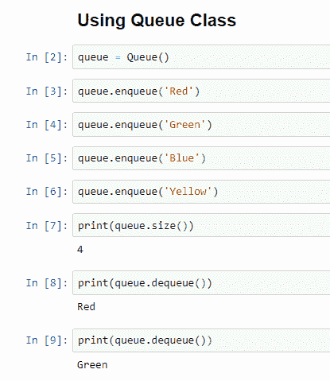
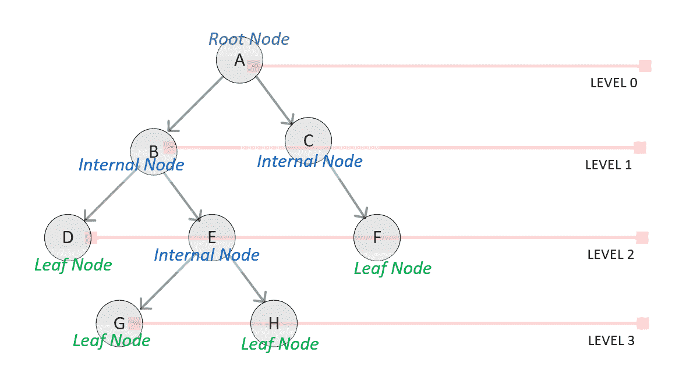
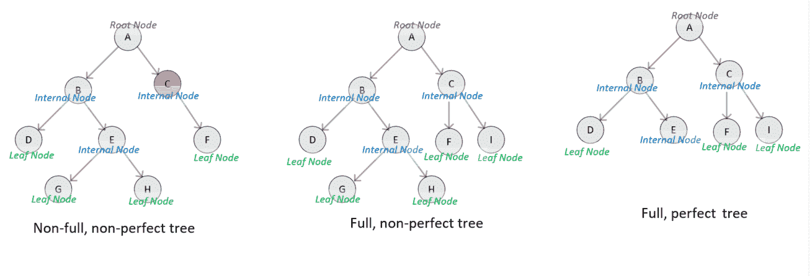

# 算法中使用的数据结构

算法需要在执行时能够保存临时数据的内存数据结构。选择正确的数据结构对于算法的有效实现至关重要。某些类别的算法在逻辑上是递归或迭代的，需要专门为它们设计的数据结构。例如，如果使用嵌套数据结构，递归算法可能更容易实现，表现出更好的性能。在本章中，将在算法的上下文中讨论数据结构。本书中我们使用 Python，本章重点介绍 Python 数据结构，但是本章中给出的概念可以用于其他语言，如 java 和 C++。

在本章结束时，您应该能够理解 Python 如何处理复杂的数据结构，以及哪些数据结构应该用于特定类型的数据。

因此，本章讨论的要点如下：

*   在 Python 中探索数据结构
*   探索抽象数据类型
*   堆栈和队列
*   树

# 在 Python 中探索数据结构

在任何语言中，数据结构都用于存储和操作复杂数据。在 Python 中，数据结构是以高效方式管理、组织和搜索数据的存储容器。它们用于存储一组称为*集合*的数据元素，这些数据元素需要一起存储和处理。在 Python 中，有五种不同的数据结构可用于存储集合：

*   **列表**：元素的有序可变序列
*   **元组**：元素的有序不可变序列
*   **套**：无序元素袋
*   **字典**：无序的键值对包
*   **数据帧**：用于存储二维数据的二维结构

让我们在接下来的小节中更详细地了解它们。

# 列表

在 Python 中，列表是用于存储可变元素序列的主要数据结构。列表中存储的数据元素序列不必是相同的类型。

要创建列表，数据元素需要包含在[]中，并且需要用逗号分隔。例如，以下代码一起创建了四个不同类型的数据元素：

```py
>>> aList = ["John", 33,"Toronto", True]
>>> print(aList)
*['John', 33, 'Toronto', True]Ex*
```

在 Python 中，列表是创建一维可写数据结构的便捷方法，尤其是在算法的不同内部阶段。

# 使用列表

数据结构中的实用功能使它们非常有用，因为它们可以用来管理列表中的数据。

让我们看看如何使用它们：

*   **列表索引**：由于元素在列表中的位置是确定的，因此可以使用索引获取特定位置的元素。以下代码演示了该概念：

```py
>>> bin_colors=['Red','Green','Blue','Yellow']
>>> bin_colors[1]
*'Green'*
```

此代码创建的四元素列表显示在以下屏幕截图中：


注意索引从 0 开始，因此第二个元素**绿色**由索引**1**检索，即`bin_color[1]`。

*   **列表切片**：通过指定索引范围来检索列表元素的子集称为**切片**。以下代码可用于创建列表的一部分：

```py
>>> bin_colors=['Red','Green','Blue','Yellow']
>>> bin_colors[0:2] *['Red', 'Green']*
```

请注意，列表是 Python 中最流行的一维数据结构之一。

While slicing a list, the range is indicated as follows: the first number (inclusive) and the second number (exclusive). For example, `bin_colors[0:2]` will include `bin_color[0]` and `bin_color[1]` but not `bin_color[2]`. While using lists, this should be kept in mind as some users of the Python language complain that this is not very intuitive.  

让我们看一下以下代码片段：

```py
>>> bin_colors=['Red','Green','Blue','Yellow'] >>> bin_colors[2:]
*['Blue', 'Yellow']*
>>> bin_colors[:2]
*['Red', 'Green']*
```

如果未指定起始索引，则表示列表的开始；如果未指定结束索引，则表示列表的结束。前面的代码实际上演示了这个概念。

*   **负索引**：在 Python 中，我们也有负索引，从列表末尾开始计数。以下代码演示了这一点：

```py
>>> bin_colors=['Red','Green','Blue','Yellow'] >>> bin_colors[:-1]
*['Red', 'Green', 'Blue']*
>>> bin_colors[:-2]
*['Red', 'Green']*
>>> bin_colors[-2:-1]
*['Blue']*
```

请注意，当我们希望使用最后一个元素作为参考点而不是第一个元素时，负索引特别有用。

*   **嵌套**：列表中的元素可以是简单数据类型，也可以是复杂数据类型。这允许在列表中嵌套。对于迭代和递归算法，这提供了重要的功能

让我们看一下下面的代码，这是一个列表中的列表示例（嵌套）：

```py
>>> a = [1,2,[100,200,300],6]
>>> max(a[2])
*300*
>>> a[2][1]
*200*
```

*   **迭代**：Python 允许使用`for`循环对列表中的每个元素进行迭代。下面的示例演示了这一点：

```py
>>> bin_colors=['Red','Green','Blue','Yellow']
>>> for aColor in bin_colors:
        print(aColor + " Square") Red Square
*Green Square
Blue Square
Yellow Square*
```

注意，前面的代码遍历列表并打印每个元素。

# 匿名函数

有一组 lambda 函数可用于列表。它们在算法上下文中特别重要，并提供动态创建函数的能力。有时，在文献中，它们也被称为*匿名函数*。本节演示了它们的用途：

*   **过滤数据**：为了过滤数据，我们首先定义一个谓词，它是一个输入单个参数并返回布尔值的函数。下面的代码演示了它的用法：

```py
>>> list(filter(lambda x: x > 100, [-5, 200, 300, -10, 10, 1000]))
*[200, 300, 1000]*
```

注意，在这段代码中，我们使用`lambda`函数过滤列表，该函数指定过滤条件。过滤器功能用于根据定义的标准从序列中过滤元素。Python 中的 filter 函数通常与`lambda`一起使用。除了列表之外，它还可以用来过滤元组或集合中的元素。对于上述代码，定义的标准为`x > 100`。代码将遍历列表中的所有元素，并过滤掉不符合此条件的元素

*   **数据转换**：`map()`函数可以使用 lambda 函数进行数据转换。例如：

```py
>>> list(map(lambda x: x ** 2, [11, 22, 33, 44,55]))
*[121, 484, 1089, 1936, 3025]*
```

将`map`函数与`lambda`函数结合使用提供了非常强大的功能。当与`map`函数一起使用时，`lambda`函数可用于指定变换给定序列的每个元素的变压器。在前面的代码中，转换器是 2 的乘法。因此，我们使用`map`函数将列表中的每个元素乘以 2。

*   **数据聚合**：对于数据聚合，可以使用`reduce()`函数，递归运行一个函数，对列表中每个元素的值对进行聚合：

```py
from functools import reduce
def doSum(x1,x2):
    return x1+x2
x = reduce(doSum, [100, 122, 33, 4, 5, 6])
```

注意，`reduce`函数需要定义一个数据聚合函数。前面代码中的数据聚合函数为`functools`。它定义如何聚合给定列表中的项。聚合将从前两个元素开始，结果将替换前两个元素。这个缩减过程重复进行，直到我们到达终点，结果是一个聚合数字。`doSum`函数中的`x1`和`x2`表示每个迭代中的两个数字，`doSum`表示它们的聚合标准。

前面的代码块产生一个值（即`270`）。

# 距离函数

`range`功能可用于轻松生成大量数字列表。它用于自动填充列表中的数字序列。

`range`功能使用简单。我们可以通过指定列表中所需的元素数量来使用它。默认情况下，它从零开始，递增 1：

```py
>>> x = range(6)
>>> x
[0,1,2,3,4,5]
```

我们还可以指定结束编号和步骤：

```py
>>> oddNum = range(3,29,2)
>>> oddNum
*[3, 5, 7, 9, 11, 13, 15, 17, 19, 21, 23, 25, 27]*
```

前面的范围函数将给出从`3`到`29`的奇数。

# 列表的时间复杂性

使用大 O 表示法，列表中各种函数的时间复杂度可总结如下：

| **不同的方法** | **时间复杂度** |
| 插入一个元素 | O（1） |
| 删除元素 | O（n）（在最坏的情况下，可能需要迭代整个列表） |
| 切片列表 | O（n） |
| 元素检索 | O（n） |
| 复制 | O（n） |

请注意，添加单个元素所需的时间与列表的大小无关。表中提到的其他操作取决于列表的大小。随着列表的大小越来越大，对性能的影响也越来越明显。

# 多元组

可用于存储集合的第二个数据结构是元组。与列表不同，元组是不可变（只读）数据结构。

与列表一样，元组中的元素可以是不同的类型。它们还允许其元素使用复杂的数据类型。因此，元组中可以有一个元组，提供了创建嵌套数据结构的方法。创建嵌套数据结构的能力在迭代和递归算法中特别有用。

以下代码演示如何创建元组：

```py
>>> bin_colors=('Red','Green','Blue','Yellow')
>>> bin_colors[1]
*'Green'*
>>> bin_colors[2:]
*('Blue', 'Yellow')*
>>> bin_colors[:-1]
*('Red', 'Green', 'Blue')*
# Nested Tuple Data structure
>>> a = (1,2,(100,200,300),6)
>>> max(a[2])
*300*
>>> a[2][1]
*200*
```

Wherever possible, immutable data structures (such as tuples) should be preferred over mutable data structures (such as lists) due to performance. Especially when dealing with big data, immutable data structures are considerably faster than mutable ones. There is a price we pay for the ability to change data elements in lists, for example, and we should carefully analyze that it is really needed so we can implement the code as read-only tuples, which will be much faster.

注意，在前面的代码中，`a[2]`表示第三个元素，即元组，`(100,200,300)`。`a[2][1]`表示该元组中的第二个元素，即`200`

# 元组的时间复杂性

元组的各种函数的时间复杂度可以总结如下（使用大 O 表示法）：

| **功能** | **时间****复杂度** |
| `Append` | O（1） |

注意，`Append`是一个函数，它在已经存在的元组末尾添加一个元素。其复杂性为 O（1）

# 词典

将数据作为键值对保存非常重要，尤其是在分布式算法中。在 Python 中，这些键值对的集合存储为称为*字典*的数据结构。要创建字典，应选择一个键作为最适合在整个数据处理过程中识别数据的属性。该值可以是任何类型的元素，例如数字或字符串。Python 也总是使用复杂的数据类型，例如列表作为值。可以使用字典作为值的数据类型来创建嵌套字典。

要创建为各种变量分配颜色的简单字典，需要将键值对括在{}中。例如，以下代码创建了一个由三个键值对组成的简单字典：

```py
>>> bin_colors ={
 "manual_color": "Yellow",
 "approved_color": "Green",
 "refused_color": "Red"
 }
>>> print(bin_colors) *{'manual_color': 'Yellow', 'approved_color': 'Green', 'refused_color': 'Red'}*
```

下面的屏幕截图中还说明了前面代码创建的三个键值对：


现在，让我们看看如何检索和更新与键关联的值：

1.  要检索与键关联的值，可以使用`get`函数，也可以将键用作索引：

```py
>>> bin_colors.get('approved_color')
*'Green'* >>> bin_colors['approved_color']
*'Green'*
```

2.  要更新与键关联的值，请使用以下代码：

```py
>>> bin_colors['approved_color']="Purple"
>>> print(bin_colors) *{'manual_color': 'Yellow', 'approved_color': 'Purple', 'refused_color': 'Red'}*
```

请注意，前面的代码显示了如何更新与字典中特定键相关的值。

# 词典的时间复杂性

下表给出了使用大 O 表示法的词典的时间复杂度：

| **字典** | **时间****复杂度** |
| 获取值或键 | O（1） |
| 设置值或键 | O（1） |
| 抄写字典 | O（n） |

从字典的复杂性分析中需要注意的一点是，获取或设置键值所花费的时间与字典的大小完全无关。这意味着将键值对添加到大小为 3 的字典中所花费的时间与将键值对添加到大小为 100 万的字典中所花费的时间相同。

# 设置

集合定义为可以是不同类型的元素的集合。元素包含在{}中。例如，请查看以下代码块：

```py
>>> green = {'grass', 'leaves'}
>>> print(green)
{'grass', 'leaves'}
```

集合的定义特征是它只存储每个元素的不同值。如果我们尝试添加另一个冗余元素，它将忽略这一点，如下所示：

```py
>>> green = {'grass', 'leaves','leaves'}
>>> print(green)
*{'grass', 'leaves'}*
```

为了演示可以对集合执行哪些类型的操作，让我们定义两个集合：

*   一个名为 yellow 的集合，其中包含黄色的内容
*   另一个集合名为 red，其中包含红色的内容

请注意，这两个集合之间有一些共同点。这两个集合及其关系可借助以下维恩图表示：

**

如果我们想在 Python 中实现这两个集合，代码如下所示：

```py
>>> yellow = *{'dandelions', 'fire hydrant', 'leaves'}
>>> red =* *{'fire hydrant', 'blood', 'rose', 'leaves'}*
```

现在，让我们考虑下面的代码，它演示了使用 Python 的 SET 操作：

```py
>>> yellow|red
*{'dandelions', 'fire hydrant', 'blood', 'rose', 'leaves'}*
>>> yellow&red
*{'fire hydrant'}*
```

如前面的代码片段所示，Python 中的集合可以具有并集和交集等操作。我们知道，并集运算将两个集合的所有元素组合在一起，交集运算将在两个集合之间产生一组公共元素。注意以下几点：

*   `yellow|red`用于获取前两个已定义集合的并集。
*   `yellow&red`用于获取黄色和红色之间的重叠

# 集合的时间复杂度分析

以下是集合的时间复杂性分析：

| **套** | **复杂性** |
| 添加一个元素 | O（1） |
| 删除元素 | O（1） |
| 复制 | O（n） |

从集合的复杂性分析中需要注意的一点是，添加元素所花费的时间与特定集合的大小完全无关

# 数据帧

DataFrame 是一种数据结构，用于存储 Python`pandas`包中可用的表格数据。它是算法中最重要的数据结构之一，用于处理传统的结构化数据。让我们考虑下表：

| **id** | **名称** | **年龄** | **决定** |
| 1. | 车费 | 32 | 符合事实的 |
| 2. | 埃琳娜 | 23 | 错误的 |
| 3. | 史蒂文 | 40 | 符合事实的 |

现在，让我们用一个数据帧来表示这一点。

可以使用以下代码创建简单的数据帧：

```py
>>> import pandas as pd
>>> df = pd.DataFrame([
...             ['1', 'Fares', 32, True],
...             ['2', 'Elena', 23, False],
...             ['3', 'Steven', 40, True]])
>>> df.columns = ['id', 'name', 'age', 'decision']
>>> df
 *id    name  age  decision
0  1   Fares   32      True
1  2   Elena   23     False
2  3  Steven   40      True*
```

注意，在前面的代码中，`df.column`是一个指定列名称的列表。

The DataFrame is also used in other popular languages and frameworks to implement a tabular data structure. Examples are R and the Apache Spark framework. 

# 数据帧术语

让我们看看在数据帧上下文中使用的一些术语：

*   **轴**：在 pandas 文档中，数据帧的单个列或行称为轴。
*   **轴**：如果有多个轴，则称为一组轴。
*   **标签**：数据帧允许使用所谓的标签对列和行进行命名。

# 创建数据帧的子集

基本上，创建数据帧子集有两种主要方式（比如子集名称为`myDF`：

*   列选择
*   行选择

让我们一个接一个地看。

# 列选择

在机器学习算法中，选择正确的特征集是一项重要任务。在我们可能拥有的所有特征中，并非所有的特征都是在算法的特定阶段需要的。在 Python 中，特征选择是通过列选择来实现的，本节将对此进行解释

可以通过*名称*检索列，如下所示：

```py
>>> df[['name','age']]
 *name  age
0   Fares   32
1   Elena   23
2  Steven   40*
```

列的位置在数据帧中是确定的。可以按其位置检索列，如下所示：

```py
>>> df.iloc[:,3] 
*0 True*
*1 False*
*2 True*
```

注意，在这段代码中，我们正在检索数据帧的前三行。

# 行选择

数据帧中的每一行对应于问题空间中的一个数据点。如果我们想创建问题空间中数据元素的子集，我们需要执行行选择。可以使用以下两种方法之一创建此子集：

*   通过指定他们的位置
*   通过指定筛选器

行的子集可按其位置检索，如下所示：

```py
>>> df.iloc[1:3,:]
 *id name age decision*
*1 2 Elena 23 False*
*2 3 Steven 40 True*
```

请注意，前面的代码将返回前两行和所有列。

要通过指定过滤器创建子集，我们需要使用一个或多个列来定义选择标准。例如，可以通过此方法选择数据元素的子集，如下所示：

```py
>>> df[df.age>30]
 *id    name  age  decision
0  1   Fares   32      True
2  3  Steven   40      True

**>>> df[(df.age<35)&(df.decision==True)]***  id   name  age  decision
0  1  Fares   32      True

```

请注意，此代码创建满足筛选器中规定条件的行子集。

# 矩阵

矩阵是具有固定列数和行数的二维数据结构。矩阵的每个元素都可以通过其列和行引用。

在 Python 中，可以使用`numpy`数组创建矩阵，如下代码所示：

```py
>>> myMatrix = np.array([[11, 12, 13], [21, 22, 23], [31, 32, 33]]) 
>>> print(myMatrix) 
*[[11 12 13]* 
*[21 22 23]* 
*[31 32 33]]*
>>> print(type(myMatrix))
*<class 'numpy.ndarray'>*
```

请注意，前面的代码将创建一个包含三行三列的矩阵。

# 矩阵运算

有许多操作可用于矩阵数据操作。例如，让我们尝试转置前面的矩阵。我们将使用`transpose()`函数，将列转换为行，将行转换为列：

```py
>>> myMatrix.transpose()
*array([[11, 21, 31],* 
 *[12, 22, 32],* 
 *[13, 23, 33]])*
```

注意，矩阵运算在多媒体数据处理中被大量使用。

既然我们已经了解了 Python 中的数据结构，那么让我们在下一节继续讨论抽象数据类型。

# 探索抽象数据类型

一般来说，抽象是一个概念，用于定义复杂系统的共同核心功能。使用此概念创建通用数据结构产生了**抽象数据类型**（**ADT**）。通过隐藏实现级别的详细信息并为用户提供一个通用的、独立于实现的数据结构，ADT 的使用创建了算法，从而生成更简单、更清晰的代码。ADTS 可以用任何编程语言实现，如 C++、java 和 Scala。在本节中，我们将使用 Python 实现 ADT。让我们先从向量开始。

# 矢量

向量是存储数据的一维结构。它们是 Python 中最流行的数据结构之一。Python 中有两种创建向量的方法，如下所示：

*   使用 Python 列表：创建向量的最简单方法是使用 Python 列表，如下所示：

```py
>>> myVector = [22,33,44,55]
>>> print(myVector) 
*[22 33 44 55]*
>>> print(type(myVector))
*<class 'list'>*
```

注意，这段代码将创建一个包含四个元素的列表。

*   使用`numpy`数组：创建向量的另一种常用方法是使用 NumPy 数组，如下所示：

```py
>>> myVector = np.array([22,33,44,55]) 
>>> print(myVector) 
*[22 33 44 55]*
>>> print(type(myVector))
*<class 'numpy.ndarray'>*
```

注意，我们在这段代码中使用`np.array`创建了`myVector`。

In Python, we can represent integers using underscores to separate parts. It makes them more readable and less error-prone. This is especially useful when dealing with large numbers. So, one billion can be represented as a=1

# 堆叠

堆栈是用于存储一维列表的线性数据结构。可采用**后进先出**（**后进先出**）或**后进先出**（**FILO**方式存储物料。堆栈的定义特征是添加和删除元素的方式。在一端添加新元素，仅从该端删除元素。

以下是与堆栈相关的操作：

*   **isEmpty:**如果堆栈为空，则返回 true
*   **推送：**增加新元素
*   **pop**：返回最近添加的元素并将其删除

下图显示了如何使用推送和弹出操作从堆栈中添加和删除数据：


上图的顶部显示了如何使用推送操作向堆栈中添加项。在步骤**1.1**、**1.2**和**1.3**中，使用三次推送操作向堆栈添加三个元素。上图的底部用于从堆栈中检索存储的值。在步骤**2.2**和**2.3**中，pop 操作用于以 LIFO 格式从堆栈中检索两个元素

让我们在 Python 中创建一个名为`Stack`的类，我们将在其中定义与 stack 类相关的所有操作。此类代码如下所示：

```py
class Stack:
     def __init__(self):
         self.items = []
     def isEmpty(self):
         return self.items == []
     def push(self, item):
         self.items.append(item)
     def pop(self):
         return self.items.pop()
     def peek(self):
         return self.items[len(self.items)-1]
     def size(self):
         return len(self.items)
```

要将四个元素推送到堆栈中，可以使用以下代码：


请注意，前面的代码创建了一个包含四个数据元素的堆栈。

# 堆栈的时间复杂性

让我们看看堆栈的时间复杂性（使用大 O 表示法）：

| **操作** | **时间复杂度** |
| `push` | O（1） |
| `pop` | O（1） |
| `size` | O（1） |
| `peek` | O（1） |

需要注意的一点是，上表中提到的四个操作的性能都不取决于堆栈的大小。

# 实例

在许多用例中，堆栈被用作数据结构。例如，当用户希望在 web 浏览器中浏览历史时，这是一种后进先出数据访问模式，可以使用堆栈来存储历史。另一个例子是当用户想要在字处理软件中执行`Undo`操作时

# 排队

与堆栈一样，队列以一维结构存储*n*个元素。元素以**FIFO**格式添加和删除。队列的一端称为*后方*，另一端称为*前方*。当从前面移除元素时，该操作称为*出列*。当在后面添加元素时，该操作称为*排队*。

在下图中，顶部显示排队操作。步骤**1.1**、**1.2**和**1.3**向队列中添加了三个元素，生成的队列如**1.4**所示。注意**黄色**为*后部*，而**红色**为*前部*。

下图的底部显示了一个出列操作。步骤**2.2**、**2.3**和**2.4**从队列前端逐个移除队列中的元素：


上图中所示的队列可以使用以下代码实现：

```py
class Queue(object):
   def __init__(self):
      self.items = []
   def isEmpty(self):
      return self.items == []
   def enqueue(self, item):
       self.items.insert(0,item)
   def dequeue(self):
      return self.items.pop()
   def size(self):
      return len(self.items)
```

让我们借助以下屏幕截图，按照上图所示对元素进行排队和出列：



请注意，前面的代码首先创建一个队列，然后将四个项目放入其中

# 使用堆栈和队列背后的基本思想

让我们通过一个类比来了解使用堆栈和队列背后的基本思想。让我们假设我们有一个表，在其中放置来自邮政服务的传入邮件，例如加拿大邮件。我们把它叠起来，直到有时间一个接一个地打开和查看邮件。有两种可能的方法可以做到这一点：

*   我们把信放在一堆里，每当我们收到一封新信，我们就把它放在最上面。当我们想读一封信时，我们从上面的那封开始。这就是我们所说的*堆栈*。请注意，最新到达的信件将位于顶部，并将首先处理。从列表顶部拾取一封信称为*弹出*操作。每当一封新信到达时，把它放在上面被称为*推*操作。如果我们最终拥有一个相当大的书堆，并且大量的信件不断到达，那么我们就有可能永远没有机会看到一封非常重要的信件在书堆的下端等着我们。
*   我们把信堆起来，但我们想先处理最老的信：每次我们想看一封或多封信，我们都会注意先处理最老的信。这就是我们所说的*q**ueue*。将字母添加到桩中称为*e**nqueue*操作。从桩中移除字母称为*d**equeue*操作

# 树

在算法上下文中，树是最有用的数据结构之一，因为它具有分层数据存储能力。在设计算法时，我们在需要存储或处理的数据元素之间表示层次关系的地方使用树

让我们更深入地了解这个有趣且相当重要的数据结构。

每个树都有一组有限的节点，因此它有一个称为*根*的起始数据元素和一组由称为*分支*的链接连接在一起的节点。

# 术语

让我们看看与树数据结构相关的一些术语：

| 根节点 | 没有父节点的节点称为*根*节点。例如，在下图中，根节点是**A**。在算法中，根节点通常是树结构中最重要的值。 |
| 节点的级别 | 与根节点的距离是节点的级别。例如，在下图中，节点**D**、**E、**和**F**的级别为两级。 |
| 兄弟节点 | 树中的两个节点如果处于同一级别，则称为*同级*。例如，如果我们检查下图，节点**B**和**C**是兄弟节点。 |
| 子节点和父节点 | 一个节点**F**是节点**C**的子节点，如果两者都是直接连接的，并且节点**C**的级别低于节点**F**。相反，节点**C**是节点**F**的父节点。下图中的节点**C**和**F**显示了这种父子关系。 |
| 节点度 | 节点的阶数是其拥有的子节点数。例如，在下图中，节点**B**的度数为二。 |
| 树度 | 树的度等于在树的组成节点中可以找到的最大度。例如，下图中显示的树的阶数为二。 |
| 子树 | 树的子树是树的一部分，所选节点作为子树的根节点，所有子节点作为树的节点。例如，下图所示树的节点**E**处的子树由节点**E**作为根节点，节点**G**和**H**作为两个子节点组成。 |
| 叶节 | 树中没有子节点的节点称为*叶*节点。例如，在下图中，**D**、**G**、**H、**和**F**是四个叶节点。 |
| 内部节点 | 任何既不是根节点也不是叶节点的节点都是内部节点。内部节点将至少有一个父节点和至少一个子节点。 |

Note that trees are a kind of network or graph that we will study in [Chapter 6](06.html), *Unsupervised Machine Learning Algorithms*. For graphs and network analysis, we use the terms link or edge instead of branches. Most of the other terminology remains unchanged.

# 树木种类

有不同类型的树，解释如下：

*   **二叉树：**如果一棵树的度为二，则该树称为*二叉树*。例如，下图所示的树是二叉树，因为它的度为二：



请注意，上图显示了一个具有四个级别和八个节点的树。

*   **全树：**全树是指所有节点的阶数相同的树，等于树的阶数。下图显示了前面讨论的树的种类：



请注意，左侧的二叉树不是完整树，因为节点**C**的阶数为 1，而所有其他节点的阶数为 2。中间的树和左边的树都是完整的树。

*   **完美树****：**完美树是一种特殊类型的完整树，其中所有叶节点处于同一级别。例如，如上图所示，右侧的二叉树是一个完美的完整树，因为所有叶节点都处于同一级别，即**级别 2**。
*   **有序 t****ree**：如果一个节点的子节点按照特定的标准以某种顺序组织，则该树称为*有序树*。例如，树可以按升序从左到右排序，在从左到右遍历时，处于同一级别的节点的值将增加。

# 实例

抽象数据类型树是用于开发决策树的主要数据结构之一，将在[第 7 章](07.html)、*传统监督学习算法*中讨论。由于其层次结构，它在与网络分析相关的算法中也很流行，这将在[第 6 章](06.html)、*无监督机器学习算法*中详细讨论。树也用于需要实施分治策略的各种搜索和排序算法中。

# 总结

在本章中，我们讨论了可用于实现各种类型算法的数据结构。读完本章后，我希望您能够选择正确的数据结构，用于通过算法存储和处理数据。您还应该能够理解我们的选择对算法性能的影响。

下一章是关于排序和搜索算法的，我们将在算法的实现中使用本章介绍的一些数据结构。