# 无监督机器学习算法

本章介绍无监督机器学习算法。本章首先介绍无监督学习技术。然后，我们将学习两种聚类算法：k-均值聚类和层次聚类算法。下一节将介绍一种降维算法，当我们有大量的输入变量时，这种算法可能是有效的。下一节说明如何将无监督学习用于异常检测。最后，我们将介绍一种最强大的无监督学习技术，关联规则挖掘。本节还解释了从关联规则挖掘中发现的模式如何表示跨事务的各种数据元素之间的有趣关系，从而帮助我们进行数据驱动的决策

在本章结束时，读者应该能够理解如何利用无监督学习来解决一些现实问题。读者将了解目前用于无监督学习的基本算法和方法。

在本章中，我们将介绍以下主题：

*   无监督学习
*   聚类算法
*   降维
*   异常检测算法
*   关联规则挖掘

# 引入无监督学习

无监督学习最简单的定义是，它是通过发现和利用数据的固有模式为非结构化数据提供某种结构的过程。如果数据不是由某个随机过程生成的，那么它在多维问题空间中的数据元素之间会有某种模式。无监督学习算法通过发现这些模式并使用它们为数据集提供某种结构来工作。此概念如下图所示：


请注意，无监督学习通过从现有模式中发现新特征来增加结构。

# 数据挖掘生命周期中的无监督学习

要理解无监督学习的作用，首先查看数据挖掘过程的整个生命周期是很重要的。有不同的方法将数据挖掘过程的生命周期划分为不同的独立阶段，称为**阶段**。目前，有两种常用的方法来表示数据挖掘生命周期：

*   **CRISP-DM**（**数据挖掘跨行业标准流程**生命周期
*   **SEMMA**（**样本、探索、修改、建模、访问**数据挖掘过程

CRISP-DM 由隶属于不同公司的数据挖掘者组成的财团开发，包括克莱斯勒和**SPSS**（**社会科学统计软件包**。SEMMA 由**SAS**（**统计分析系统**提出）。让我们看看数据挖掘生命周期的两种表示形式之一 CRISP-DM，并尝试了解无监督学习在数据挖掘生命周期中的位置。请注意，SEMMA 在其生命周期中有一些类似的阶段。

如果我们查看 CRISP-DM 生命周期，我们可以看到它由六个不同的阶段组成，如下图所示：

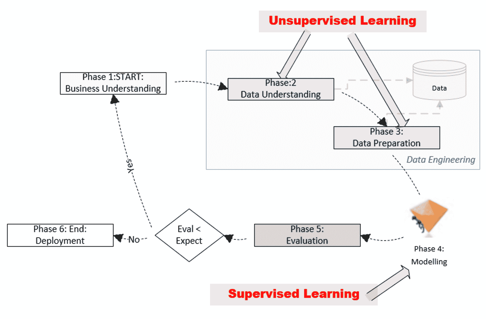

让我们逐一了解每个阶段：

*   **阶段 1：业务理解**：这是关于收集需求的，涉及从业务的角度尝试深入理解问题。定义问题的范围并根据**机器学习**（**ML**）对其进行适当的重新表述是该阶段的一个重要部分，例如，对于二进制分类问题，有时，根据可以被证明或拒绝的假设来表述需求是有帮助的。该阶段还涉及记录机器学习模型的期望，该模型将在第 4 阶段中进行下游培训，例如，针对分类问题，我们需要记录可在生产中部署的模型的最低可接受精度。

It is important to note that Phase 1 of the CRISP-DM life cycle is about business understanding. It focuses on what needs to be done, not on how it will be done.

*   **阶段 2：数据理解**：**这是关于理解可用于数据挖掘的数据。在这一阶段，我们将发现是否有合适的数据集可用于我们试图解决的问题。在识别数据集之后，我们需要了解数据的质量及其结构。我们需要找出哪些模式可以从数据中提取出来，从而有可能引导我们获得重要的见解。我们还将根据阶段 1 中收集的需求，尝试找到可用作标签（或目标变量）的正确特性。无监督学习算法可在实现第 2 阶段目标方面发挥强大作用。无监督算法可用于以下目的：

    *   在数据集中发现模式
    *   通过分析发现的模式来理解数据集的结构
    *   识别或导出目标变量** 
***   **第三阶段：数据准备**：**这是关于为我们将在第四阶段培训的 ML 模型准备数据。可用的标记数据分为两个不相等的部分。较大的部分称为**训练数据**，用于在第 4 阶段对下游模型进行训练。较小的部分称为**测试数据**，用于第 5 阶段的模型评估。在此阶段，无监督机器学习算法可作为准备数据的工具。例如，它们可用于将非结构化数据转换为结构化数据，提供有助于培训模型的附加尺寸。*****   **阶段 4：建模**：这是我们使用监督学习来制定我们发现的模式的阶段。我们希望能够根据我们选择的监督学习算法的要求成功地准备数据。这也是识别用作标签的特定特征的阶段。在第 3 阶段，我们将数据分为测试集和训练集。在这个阶段，我们形成数学公式来表示我们感兴趣的模式中的关系。这是通过使用在阶段 3 中创建的训练数据训练模型来完成的。如前所述，最终的数学公式将取决于我们对算法的选择*   **第五阶段：评估**：**本阶段是利用第三阶段的测试数据对新训练的模型进行测试。如果评估与阶段 1 中设置的期望相匹配，那么我们需要再次迭代前面的所有阶段，从阶段 1 开始。上图对此进行了说明。*****   **第 6 阶段：部署**：**如果评估达到或超过第 5 阶段中描述的预期，则将经过培训的模型部署到生产中，并开始生成我们在第 1 阶段中定义的问题的解决方案********

******Phase 2 (Data Understanding) and Phase 3 (Data Preparation) of the CRISP-DM life cycle are all about understanding the data and preparing it for training the model. These phases involve data processing. Some organizations employ specialists for this data engineering phase.

很明显，提出问题解决方案的过程是完全由数据驱动的。结合有监督和无监督的机器学习来制定可行的解决方案。本章重点介绍解决方案的无监督学习部分。

Data engineering comprises Phase 2 and Phase 3, and is the most time-consuming part of machine learning. It can take as much as 70% of the time and resources of a typical ML project. The unsupervised learning algorithms can play an important role in data engineering.

以下各节提供了有关无监督算法的更多详细信息。

# 无监督学习的研究动态

多年来，对机器学习算法的研究更多地集中在监督学习技术上。由于监督学习技术可以直接用于推理，因此它们在时间、成本和准确性方面的优势相对容易衡量。无监督机器学习算法的威力最近得到了认可。由于无监督学习不受指导，它对假设的依赖性较小，并且可能在任何维度上收敛解。虽然控制无监督学习算法的范围和处理要求更加困难，但它们有更大的潜力来挖掘隐藏的模式。研究人员还致力于将无监督机器学习技术与有监督学习技术相结合，以设计新的强大算法。

# 实例

目前，无监督学习用于更好地理解数据并为其提供更多的结构。例如，它用于市场细分、欺诈检测和市场篮子分析（本章后面将讨论）。让我们看几个示例。

# 语音分类

无监督学习可用于对语音文件中的单个语音进行分类。它利用了每个人的声音都有不同的特征这一事实，创造了潜在的可分离的音频模式。这些模式可以用于语音识别。例如，谷歌在其谷歌家庭设备中使用这项技术来训练他们区分不同的人的声音。一旦训练完成，谷歌家庭可以为每个用户分别个性化响应

例如，让我们假设我们有一个三个人相互交谈半小时的录音对话。使用无监督学习算法，我们可以识别数据集中不同人群的声音。请注意，通过无监督学习，我们正在为给定的非结构化数据集添加结构。这种结构为我们的问题空间提供了额外的有用维度，可用于获得见解和为我们选择的机器学习算法准备数据。下图显示了如何将无监督学习用于语音识别：


注意，在本例中，无监督学习建议我们添加一个具有三个不同级别的新特性。

# 文档分类

无监督机器学习算法也可以应用于非结构化文本数据的存储库。例如，如果我们有一个 PDF 文档数据集，则无监督学习可用于执行以下操作：

*   发现数据集中的各种主题
*   将每个 PDF 文档与发现的主题之一关联

下图显示了无监督学习在文档分类中的应用。这是我们向非结构化数据添加更多结构的另一个示例：


Figure 6.4: Using unsupervised learning for document classification

注意，在本例中，无监督学习建议我们添加一个具有五个不同级别的新特性。

# 理解聚类算法

在无监督学习中使用的最简单和最强大的技术之一是通过聚类算法将相似的模式分组在一起。它用于理解与我们试图解决的问题相关的数据的特定方面。聚类算法在数据项中寻找自然分组。由于该小组并非基于任何目标或假设，因此被归类为无监督学习技术

由各种聚类算法创建的分组基于发现问题空间中各种数据点之间的相似性。确定数据点之间相似性的最佳方法因问题而异，取决于我们正在处理的问题的性质。让我们看看可以用来计算不同数据点之间相似性的各种方法。

# 量化相似性

通过聚类算法创建的分组的可靠性基于这样的假设：我们可以准确地量化问题空间中不同数据点之间的相似性或接近性。这是通过使用各种距离度量来实现的。以下是用于量化相似性的三种最常用方法：

*   欧几里德距离测度
*   曼哈顿距离测量
*   余弦距离测量

让我们更详细地了解这些距离度量。

# 欧几里德距离

不同点之间的距离可以量化两个数据点之间的相似性，并广泛用于无监督机器学习技术，如聚类。欧几里德距离是最常用和最简单的距离度量，它是通过测量多维空间中两个数据点之间的最短距离来计算的。例如，让我们考虑两个点，即，在一个二维空间中，一个二维空间中的 A（1，1）和 1，1，1，2，B（4，4）。

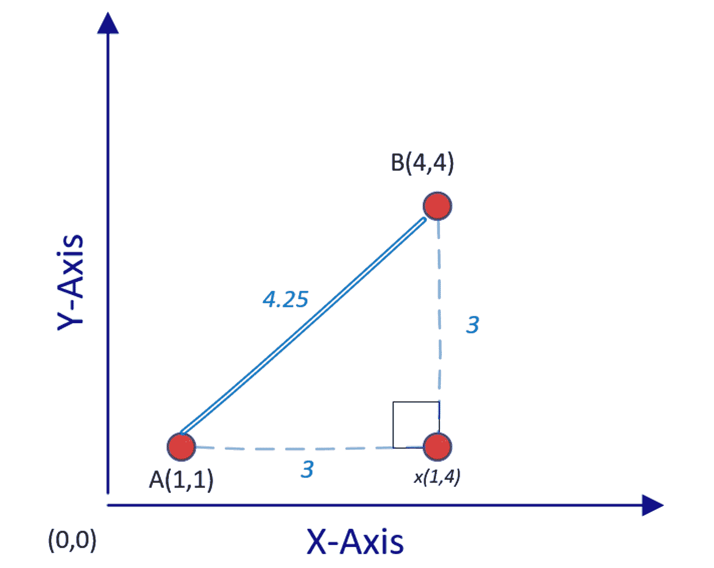

要计算**A**和**B**之间的距离，即*d（A，B）*，我们可以使用以下毕达哥拉斯公式：


请注意，此计算适用于二维问题空间。对于一个*n*维问题空间，我们可以计算两点**A**和**B**之间的距离，如下所示：


# 曼哈顿距离

在许多情况下，使用欧几里德距离度量来测量两点之间的最短距离并不能真正表示两点之间的相似性或接近程度。例如，如果两个数据点表示地图上的位置，则使用地面交通（如汽车或出租车）来测量点 a 到点 B 的实际距离，将大于由欧几里德距离计算的距离。对于这样的情况，我们使用曼哈顿距离，它标志着两点之间最长的路线，更好地反映了在繁忙城市中可以到达的起点和终点之间两点的接近程度。曼哈顿距离度量和欧几里德距离度量之间的比较如下图所示：

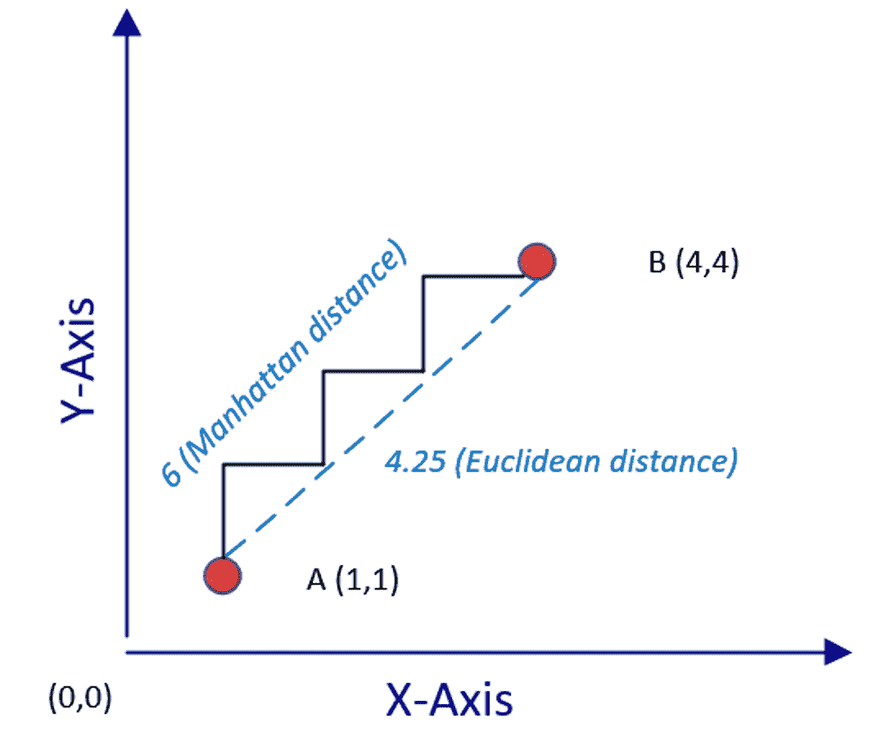

请注意，曼哈顿距离始终等于或大于计算的相应欧几里德距离。

# 余弦距离

欧几里德距离度量和曼哈顿距离度量在高维空间中表现不佳。在高维问题空间中，余弦距离更准确地反映了多维问题空间中两个数据点之间的接近程度。通过测量连接到参考点的两个点所产生的余弦角来计算余弦距离度量。如果数据点很近，则角度将很窄，而与它们的尺寸无关。另一方面，如果距离较远，则角度较大：


Textual data can almost be considered a highly dimensional space. As the cosine distance measure works very well with h-dimensional spaces, it is a good choice when dealing with textual data.

注意，在上图中，**A（2,5）**和**B（4.4）**之间的夹角的余弦是余弦距离。这些点之间的基准是原点，即**X（0,0）**。但实际上，问题空间中的任何点都可以作为参考数据点，而不必是原点。

# K-均值聚类算法

k-means 聚类算法的名称来源于它试图创建多个聚类，*k*、*计算平均值以找到数据点之间的接近度。它使用一种相对简单的集群方法，但由于其可伸缩性和速度，仍然很流行。从算法上讲，k-means 聚类使用迭代逻辑移动聚类中心，直到它们反映所属分组中最具代表性的数据点。*

 *需要注意的是，k-means 算法缺少聚类所需的一个非常基本的功能。缺少的功能是，对于给定的数据集，k-means 算法无法确定最合适的聚类数。最合适的聚类数*k*取决于特定数据集中的自然分组数。这种省略背后的理念是使算法尽可能简单，使其性能最大化。这种精简和平均的设计使得 k-means 适用于更大的数据集。假设将使用外部机制来计算*k*。确定*k*的最佳方法将取决于我们试图解决的问题。在某些情况下，*k*是由聚类问题的上下文直接指定的。例如，如果我们想将一个数据科学专业的学生分成两个群，一个是具有数据科学技能的学生，另一个是具有编程技能的学生，那么*k*将是两个。在其他一些问题中，*k*的值可能不明显。在这种情况下，必须使用迭代试错程序或基于启发式的算法来估计给定数据集最合适的聚类数。

# k-均值聚类的逻辑

本节描述了 k-means 聚类算法的逻辑。让我们逐一看一看。

# 初始化

为了对它们进行分组，k-means 算法使用距离度量来查找数据点之间的相似性或接近性。在使用 k-means 算法之前，需要选择最合适的距离度量。默认情况下，将使用欧几里德距离度量。此外，如果数据集存在异常值，则需要设计一种机制来确定要识别的标准并删除数据集的异常值

# k-means 算法的步骤

k-均值聚类算法涉及的步骤如下：

| 第一步 | 我们选择簇的数目，*k*。 |
| 步骤 2 | 在这些数据点中，我们随机选择*k*点作为聚类中心。 |
| 步骤 3 | 基于所选择的距离度量，我们迭代计算问题空间中每个点到每个*k*聚类中心的距离。基于数据集的大小，这可能是一个耗时的步骤，例如，如果集群中有 10000 个点且*k*=3，这意味着需要计算 30000 个距离。 |
| 步骤 4 | 我们将问题空间中的每个数据点分配给最近的聚类中心。 |
| 步骤 5 | 现在，问题空间中的每个数据点都有一个指定的群集中心。但我们还没有完成，因为初始聚类中心的选择是基于随机选择的。我们需要验证当前随机选择的簇中心实际上是每个簇的重心。我们通过计算每个*k*簇的组成数据点的平均值来重新计算簇中心。这一步解释了为什么该算法被称为 k-means。 |
| 步骤 6 | 如果集群中心在步骤 5 中发生了移动，这意味着我们需要重新计算每个数据点的集群分配。为此，我们将返回到步骤 3 以重复该计算密集型步骤。如果集群中心没有移动，或者我们预定的停止条件（例如，最大迭代次数）已经满足，那么我们就完成了。 |

下图显示了在二维问题空间中运行 k-means 算法的结果：

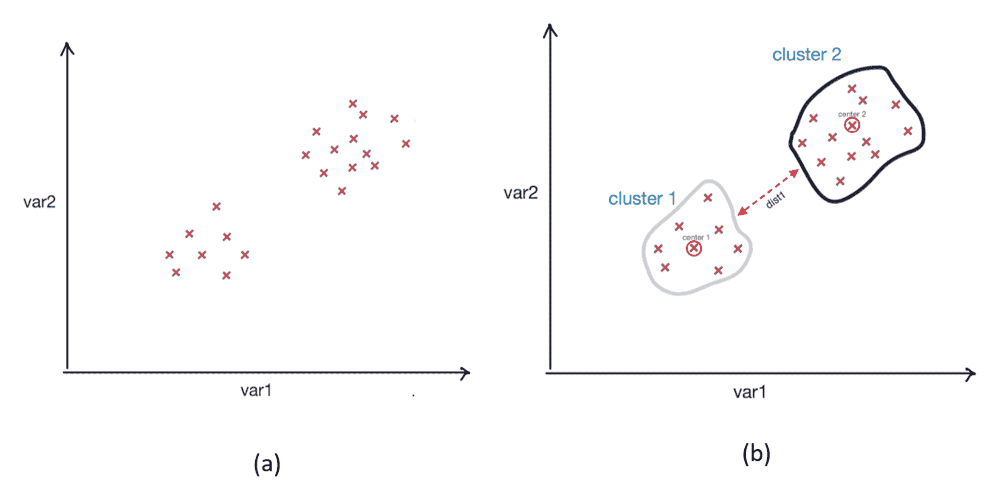

(a) Data points before clustering; (b) Resultant clusters after running the k-means clustering algorithm

请注意，在这种情况下，运行 k-means 后创建的两个结果集群是完全不同的

# 停止条件

对于 k-means 算法，默认停止条件是在步骤 5 中不再移动群集中心时。但与许多其他算法一样，k-means 算法可能需要大量时间才能收敛，尤其是在高维问题空间中处理大型数据集时。不必等待算法收敛，我们还可以明确定义停止条件，如下所示：

*   通过指定最大执行时间：
    *   **停止条件**：*t>t<sub>max</sub>*，其中*t*为当前执行时间，*t<sub>max</sub>为算法设置的最大执行时间。*
*   通过指定最大迭代次数：
    *   **停止条件**：*如果 m>m<sub>max</sub>*，其中*m*是当前迭代，*m*<sub>*max*</sub>是我们为算法设置的最大迭代次数。

# k-means 算法的编码

让我们看看如何用 Python 编写 k-means 算法：

1.  首先，让我们导入为 k-means 算法编码所需的包。请注意，我们正在导入用于 k-means 聚类的`sklearn`包：

```py
from sklearn import cluster
import pandas as pd
import numpy as np
```

2.  要使用 k-means 聚类，让我们在二维问题空间中创建 20 个数据点，用于 k-means 聚类：

```py
dataset = pd.DataFrame({
    'x': [11, 21, 28, 17, 29, 33, 24, 45, 45, 52, 51, 52, 55, 53, 55, 61, 62, 70, 72, 10],
    'y': [39, 36, 30, 52, 53, 46, 55, 59, 63, 70, 66, 63, 58, 23, 14, 8, 18, 7, 24, 10]
})
```

3.  让我们有两个集群（*k*=2），然后通过调用`fit`函数来创建集群：

```py
myKmeans = cluster.KMeans(n_clusters=2)
myKmeans.fit(dataset)
```

4.  让我们创建一个名为`centroid`的变量，它是一个数组，用于保存所形成簇的中心位置。在我们的例子中，当*k*=2 时，数组的大小将为 2。我们还要创建另一个名为`label`的变量，它表示将每个数据点分配给两个集群中的一个。由于有 20 个数据点，此阵列的大小为 20：

```py
centroids = myKmeans.cluster_centers_
labels = myKmeans.labels_
```

5.  现在让我们打印这两个数组，`centroids`和`labels`：


注意，第一个数组显示每个数据点的集群分配，第二个数组显示两个集群中心。

6.  让我们使用`matplotlib`绘制并查看集群：

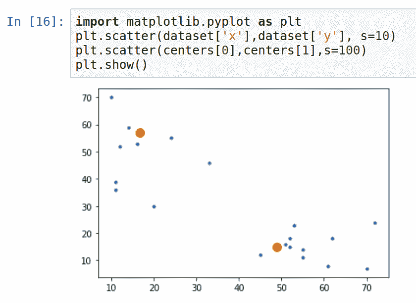

请注意，图中较大的点是由 k-均值算法确定的质心。

# k-均值聚类的局限性

k-means 算法被设计成一种简单快速的算法。由于其设计有意简单，因此有以下限制：

*   k-means 聚类的最大限制是聚类的初始数目必须预先确定。
*   集群中心的初始分配是随机的。这意味着每次运行该算法时，它可能会给出稍微不同的聚类
*   每个数据点仅指定给一个簇。
*   k-均值聚类对异常值敏感。

# 层次聚类

k-means 聚类使用自顶向下的方法，因为我们从最重要的数据点（即聚类中心）开始算法。还有另一种聚类方法，我们不是从顶部开始，而是从底部开始算法。此上下文中的底部是问题空间中的每个单独数据点。解决方案是在向集群中心前进的过程中，继续将相似的数据点分组在一起。这种自下而上的替代方法由分层聚类算法使用，本节将对此进行讨论。

# 层次聚类的步骤

分层聚类涉及以下步骤：

1.  我们为问题空间中的每个数据点创建一个单独的集群。如果我们的问题空间由 100 个数据点组成，那么它将从 100 个集群开始。
2.  我们只对彼此最接近的点进行分组
3.  我们检查停止条件；如果停止条件尚未满足，则重复步骤 2。

由此产生的聚集结构称为**树状图**。

在树状图中，垂直线的高度决定了项目的接近程度，如下图所示：

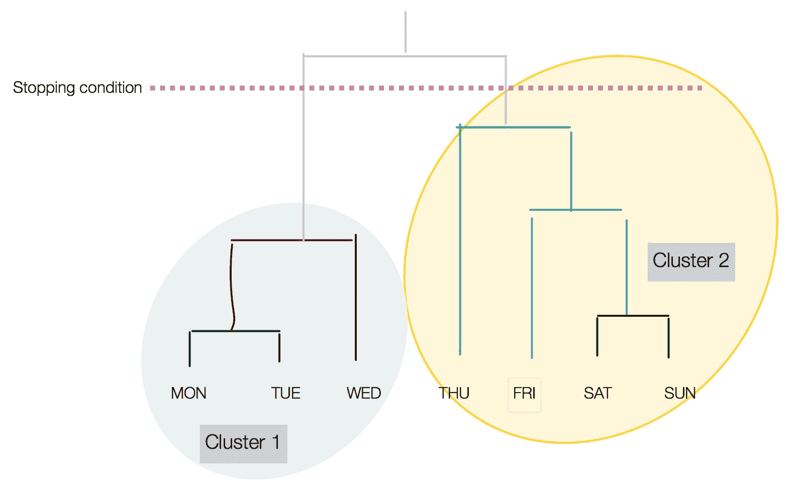

请注意，停止条件在上图中显示为虚线。

# 分层聚类算法的编码

让我们学习如何用 Python 编写分层算法：

1.  我们将首先从`sklearn.cluster`库导入`AgglomerativeClustering`以及`pandas`和`numpy`包：

```py
from sklearn.cluster import AgglomerativeClustering
import pandas as pd
import numpy as np
```

2.  然后，我们将在二维问题空间中创建 20 个数据点：

```py
dataset = pd.DataFrame({
    'x': [11, 21, 28, 17, 29, 33, 24, 45, 45, 52, 51, 52, 55, 53, 55, 61, 62, 70, 72, 10],
    'y': [39, 36, 30, 52, 53, 46, 55, 59, 63, 70, 66, 63, 58, 23, 14, 8, 18, 7, 24, 10]
})

```

3.  然后，我们通过指定超参数来创建分层集群。我们使用`fit_predict`函数实际处理算法：

```py
cluster = AgglomerativeClustering(n_clusters=2, affinity='euclidean', linkage='ward') 
cluster.fit_predict(dataset) 
```

4.  现在让我们看看每个数据点与创建的两个集群的关联：


您可以看到，分层算法和 k-means 算法的集群分配非常相似。

# 评估集群

高质量聚类的目标是属于独立聚类的数据点应该是可微的。这意味着：

*   属于同一集群的数据点应尽可能相似。
*   属于不同集群的数据点应尽可能不同。

人类的直觉可以通过可视化聚类来评估聚类结果，但是有一些数学方法可以量化聚类的质量。轮廓分析就是这样一种技术，它比较由 k-均值算法创建的聚类中的紧密度和分离度。轮廓绘制一个图，显示特定聚类中每个点相对于其他点的紧密度在相邻的簇中。它将[-0，1]范围内的数字与每个簇关联。下表显示了此范围内的数字的含义：

| **范围** | 意思 | 描述 |
| 0.71–1.0 | 杰出的 | 这意味着 k-均值聚类产生了彼此非常不同的组。 |
| 0.51–0.70 | 公平的 | 这意味着 k-均值聚类导致了一些彼此不同的组。 |
| 0.26–0.50 | 虚弱的 | 这意味着 k-means 聚类导致分组，但不应依赖分组的质量。 |
| <0.25 | 没有发现群集 | 使用选定的参数和使用的数据，不可能使用 k 均值聚类创建分组。 |

请注意，问题空间中的每个集群将获得单独的分数。

# 聚类的应用

在我们需要发现数据集中的底层模式的任何地方都可以使用集群。

在政府用例中，集群可用于以下方面：

*   犯罪热点分析
*   人口社会分析

在市场研究中，聚类可用于以下方面：

*   市场细分
*   定向广告
*   客户分类

**主成分分析**（**PCA**）也用于对数据进行一般性探索，并去除实时数据中的噪声，如股票市场交易。

# 降维

数据中的每个特征对应于问题空间中的一个维度。最小化特征数量以使问题空间更简单称为**降维**。可通过以下两种方式之一进行：

*   **特征选择**：选择一组在我们试图解决的问题中非常重要的特征
*   **特征聚合**：使用以下算法之一，组合两个或多个特征以降低维度：
    *   **PCA**：一种线性无监督 ML 算法
    *   **线性判别分析**（**LDA**）：一种线性监督 ML 算法
    *   **核主成分分析**：一种非线性算法

让我们更详细地了解一种流行的降维算法，即 PCA。

# 主成分分析

PCA 是一种无监督的机器学习技术，可以使用线性变换来降低维数。在下图中，我们可以看到两个主成分，**PC1**和**PC2**，它们显示了数据点扩散的形状。PC1 和 PC2 可以用适当的系数汇总数据点：

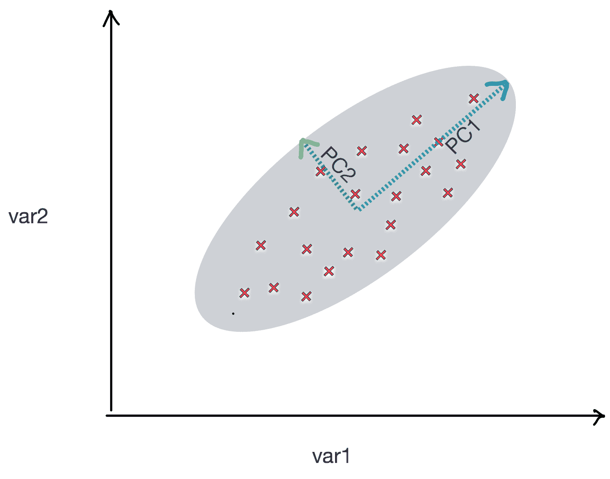

让我们考虑下面的代码：

```py
from sklearn.decomposition import PCA
iris = pd.read_csv('iris.csv')
X = iris.drop('Species', axis=1)
pca = PCA(n_components=4)
pca.fit(X)
```

现在，让我们打印 PCA 模型的系数：


请注意，原始数据帧有四个特性，`Sepal.Length`、`Sepal.Width`、`Petal.Length`和`Petal.Width`。前面的数据帧指定了四个主成分 PC1、PC2、PC3 和 PC4 的系数。例如，第一行指定了可用于替换原始四个变量的 PC1 的系数。

基于这些系数，我们可以计算输入数据帧 X 的 PCA 分量：

```py
pca_df=(pd.DataFrame(pca.components_,columns=X.columns))

# Let us calculate PC1 using coefficients that are generated
X['PC1'] = X['Sepal.Length']* pca_df['Sepal.Length'][0] + X['Sepal.Width']* pca_df['Sepal.Width'][0]+ X['Petal.Length']* pca_df['Petal.Length'][0]+X['Petal.Width']* pca_df['Petal.Width'][0]

# Let us calculate PC2
X['PC2'] = X['Sepal.Length']* pca_df['Sepal.Length'][1] + X['Sepal.Width']* pca_df['Sepal.Width'][1]+ X['Petal.Length']* pca_df['Petal.Length'][1]+X['Petal.Width']* pca_df['Petal.Width'][1]

#Let us calculate PC3
X['PC3'] = X['Sepal.Length']* pca_df['Sepal.Length'][2] + X['Sepal.Width']* pca_df['Sepal.Width'][2]+ X['Petal.Length']* pca_df['Petal.Length'][2]+X['Petal.Width']* pca_df['Petal.Width'][2]

# Let us calculate PC4
X['PC4'] = X['Sepal.Length']* pca_df['Sepal.Length'][3] + X['Sepal.Width']* pca_df['Sepal.Width'][3]+ X['Petal.Length']* pca_df['Petal.Length'][3]+X['Petal.Width']* pca_df['Petal.Width'][3]

```

现在，让我们在计算 PCA 组件后打印 X：

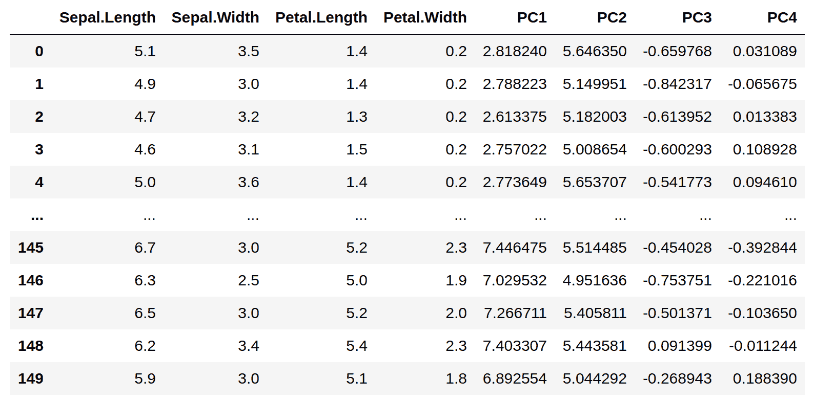

现在，让我们打印方差比，并尝试了解使用 PCA 的含义：


差异比率表示以下各项：

*   如果我们选择用 PC1 替换原来的四个特性，那么我们将能够捕获原始变量约 92.3%的方差。我们将通过不捕获原始四个特征的 100%方差来引入一些近似值。
*   如果我们选择用 PC1 和 PC2 替换原来的四个特性，那么我们将捕获原始变量的额外 5.3%方差。
*   如果我们选择用 PC1、PC2 和 PC3 替换原来的四个特性，那么我们现在将进一步捕获原始变量方差的 0.017%。
*   如果我们选择用四个主成分替换原始的四个特征，那么我们将捕获原始变量的 100%方差（92.4+0.053+0.017+0.005），但是用四个主成分替换四个原始特征是毫无意义的，因为我们根本没有减少维度，也没有取得任何成果。

# 主成分分析的局限性

以下是 PCA 的局限性：

*   PCA 只能用于连续变量，与类别变量无关。
*   在聚合过程中，主成分分析对各分量变量进行近似；它以牺牲精度为代价简化了维数问题。在使用 PCA 之前，应仔细研究这种权衡。

# 关联规则挖掘

特定数据集中的模式是需要发现、理解和挖掘它们所包含信息的宝藏。有一组重要的算法试图专注于给定数据集中的模式分析。这类算法中比较流行的算法之一是**关联规则挖掘**算法，它为我们提供了以下功能：

*   测量图案频率的能力
*   在模式之间建立*因果*和*效应*关系的能力。
*   通过比较模式的准确性和随机猜测来量化模式有用性的能力

# 使用示例

关联规则挖掘用于研究数据集不同变量之间的因果关系。以下是它可以帮助回答的示例问题：

*   哪些湿度、云量和温度值会导致明天下雨？
*   什么类型的保险索赔可以表明欺诈？
*   哪些药物组合可能导致患者并发症？

# 市场篮子分析

在本书中，推荐引擎在[第 8 章](08.html)、*神经网络算法*中进行了讨论。篮子分析是学习推荐的一种更简单的方法。在购物篮分析中，我们的数据只包含关于哪些商品一起购买的信息。它没有关于用户的任何信息，也没有关于用户是否喜欢单个项目的任何信息。请注意，获取此数据要比获取评级数据容易得多。

例如，这类数据是我们在沃尔玛购物时生成的，不需要特殊的技术来获取数据。在一段时间内收集到的这些数据称为**跨国****数据**。当关联规则分析应用于便利店、超市和快餐连锁店使用的购物车的跨国数据集时，称为**市场篮子分析**。它测量一起购买一组物品的条件概率，这有助于回答以下问题：

*   货架上物品的最佳位置是什么
*   这些项目应如何出现在营销目录中？
*   根据用户的购买模式，应该推荐什么？

由于市场篮子分析可以估计物品之间的相互关系，因此它通常用于大众市场零售，如超市、便利店、药店和快餐连锁店。市场篮子分析的优势在于其结果几乎是不言自明的，这意味着业务用户很容易理解这些结果。

让我们来看看一个典型的超市。店内所有独特的商品都可以用一套来表示，={item<sub>1</sub>、item<sub>2</sub>、<sub>m</sub>}。因此，如果该超市销售 500 种不同的商品，那么将是一套 500 码的商品。

人们将从这家商店购买商品。每次有人购买商品并在柜台付款时，它都会被添加到特定交易中的一组商品中，称为**项目集**。在给定的时间段内，事务被分组在一个集合中，该集合由表示，其中={t<sub>1</sub>、t<sub>2</sub>…、t<sub>n</sub>}。

让我们看看以下仅由四个事务组成的简单事务数据。下表总结了这些事务：

| t1 | 小门、垫子 |
| t2 | 球棒、球门、护垫、头盔 |
| t3 | 头盔、球 |
| t4 | 蝙蝠、垫子、头盔 |

让我们更详细地看一下这个示例：

={bat、wickets、Pad、头盔、ball}，代表商店中所有独特的商品。

让我们考虑一个事务，T3，^。请注意，在 t3 中购买的项目可以在项目集<sub>t3</sub>={helmet，ball}中表示，这表示客户购买了两个项目。由于此项目集中有两个项目，因此项目集<sub>t5</sub>的大小被称为两个

# 关联规则

关联规则以数学方式描述各种事务中涉及的关系项。它通过调查两个项目集之间的关系来实现这一点，两个项目集的形式为*X*⇒*Y*，其中*X*⊂ 、*Y*⊂ 。另外，*X*和*Y*是非重叠项集；也就是说。

关联规则可以用以下形式描述：

{头盔，球}⇒{自行车}

这里，{helmet，ball}是*X*，而{ball}是*Y*。

# 规则的类型

运行关联分析算法通常会导致从事务数据集中生成大量规则。大多数都是无用的。要选择能够产生有用信息的规则，我们可以将其分为以下三种类型之一：

*   不重要的
*   费解的
*   可诉

让我们更详细地了解每种类型。

# 琐碎的规则

在生成的大量规则中，许多派生的规则都是无用的，因为它们总结了有关业务的常见知识。它们被称为琐碎规则。即使这些琐碎规则的可信度很高，它们仍然是无用的，不能用于任何数据驱动的决策。我们可以放心地忽略所有琐碎的规则。

以下是琐碎规则的示例：

*   任何从高层建筑上跳下的人都有可能死亡。
*   努力学习会使考试取得更好的成绩。
*   随着温度的下降，加热器的销售量也在增加
*   在高速公路上开车超速会导致更高的事故发生率。

# 莫名其妙的规则

在运行关联规则算法后生成的规则中，没有明显解释的规则最难使用。请注意，只有当一条规则能够帮助我们发现和理解一种新的模式，并最终导致某种行动过程时，它才会有用。如果情况并非如此，我们无法解释为什么事件*X*导致事件*Y*，那么这是一个无法解释的规则，因为它只是一个数学公式，最终探索了两个不相关和独立的事件之间无意义的关系。

以下是无法解释的规则示例：

*   穿红衫的人在考试中往往得分更高。
*   绿色自行车更容易被盗。
*   买泡菜的人最后也会买尿布。

# 可诉规则

可操作的规则是我们正在寻找的黄金规则。他们为企业所理解，并能带来深刻的见解。当向熟悉业务领域的观众展示时，他们可以帮助我们发现事件的可能原因。例如，可操作的规则可以根据当前的购买模式建议特定产品在商店中的最佳位置。他们还可能建议将哪些物品放在一起，以最大限度地提高销售机会，因为用户倾向于一起购买。

以下是可执行规则及其相应操作的示例：

*   **规则 1:**向用户的社交媒体账户显示广告会导致更高的销售可能性。

**可操作项：**建议产品广告的替代方式

*   **规则 2:**创造更多的价位会增加销售的可能性。

**可诉项目：**一个项目可能会在销售中做广告，而另一个项目的价格会提高。

# 排名规则

关联规则的度量有三种方式：

*   项目的支持（频率）
*   信心
*   举起

让我们更详细地看看它们。

# 支持

支持度度量是一个数字，它量化了我们正在寻找的模式在数据集中的频率。它的计算方法是首先计算我们感兴趣的模式的出现次数，然后除以所有交易的总数。

让我们看一下特定*项目集<sub>a</sub>*的以下公式：

*numItemset<sub>a</sub>=包含项目集<sub>a</sub>*的交易数量

*数量<sub>总计</sub>=交易总数*


例如，如果*项集<sub>a</sub>={helmet，ball}*出现在六个事务中的两个事务中，则支持（项集<sub>a</sub>）=2/6=0.33。

# 信心

置信度是一个数字，通过计算条件概率来量化我们可以将左侧（*X*）与右侧（*Y*）关联的程度。它计算事件*X*将导致事件*Y*的概率，假设该事件*X*发生。

数学上，考虑规则⇒ *Y*。

该规则的置信度表示为置信度（*X*⇒ *Y*），测量如下：


让我们看一个例子。考虑以下规则：

{头盔，球}⇒{wickets}

该规则的置信度通过以下公式计算：


这意味着如果有人在篮筐里有{头盔，球}，那么有 0.5%或 50%的概率他们也会有边门。

# 举起

估算规则质量的另一种方法是计算升力。lift 返回一个数字，该数字量化了一条规则在预测结果时所取得的改善程度，而不是仅在等式右侧假设结果。如果*X*和*Y*项目集是独立的，则升力计算如下：


# 关联分析算法

在本节中，我们将探讨以下两种可用于关联分析的算法：

*   **Apriori 算法**：Agrawal，R.和 Srikant 于 1994 年提出。
*   **FP-growth 算法**：Han 等人于 2001 年提出的改进。

让我们看看这些算法。

# Apriori 算法

apriori 算法是一种用于生成关联规则的迭代多阶段算法。它基于生成和测试方法

在执行 apriori 算法之前，我们需要定义两个变量：支持度<sub>阈值</sub>和置信度<sub>阈值</sub>

该算法包括以下两个阶段：

*   **候选项生成阶段**：生成候选项集，包含支持<sub>阈值</sub>以上所有项集的集合。
*   **过滤阶段**：过滤掉所有低于期望置信度<sub>阈值</sub>的规则。

过滤后，得到的规则就是答案。

# apriori 算法的局限性

apriori 算法的主要瓶颈是第一阶段中候选规则的生成——例如，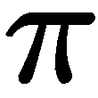={item<sub xmlns:epub="http://www.idpf.org/2007/ops">1</sub>，item<sub xmlns:epub="http://www.idpf.org/2007/ops">2</sub>…，item<sub xmlns:epub="http://www.idpf.org/2007/ops">m[T6}可以生成 2<sup xmlns:epub="http://www.idpf.org/2007/ops">m</sup>个可能的项集。由于其多阶段设计，它首先生成这些项目集，然后寻找频繁的项目集。这一限制是一个巨大的性能瓶颈，使得 apriori 算法不适用于较大的项目。</sub>

# FP-growth 算法

**频繁模式增长**（**FP 增长**算法）是对 apriori 算法的改进。它首先显示频繁事务 FP 树，这是一个有序的树。它包括两个步骤：

*   填充 FP 树
*   频繁模式挖掘

让我们逐一看看这些步骤。

# 填充 FP 树

让我们考虑下表中显示的事务数据。首先将其表示为稀疏矩阵：

| **ID** | **蝙蝠** | **小门** | **焊盘** | **头盔** | **球** |
| 1. | 0 | 1. | 1. | 0 | 0 |
| 2. | 1. | 1. | 1. | 1. | 0 |
| 3. | 0 | 0 | 0 | 1. | 1. |
| 4. | 1. | 0 | 1. | 1. | 0 |

让我们计算每个项目的频率，并按频率降序排列：

| **项目** | **频率** |
| 垫 | 3. |
| 头盔 | 3. |
| 球棒 | 2. |
| 边门 | 2. |
| 球 | 1. |

现在，让我们根据频率重新排列基于事务的数据：

| **ID** | **原项目** | **重新订购的项目** |
| t1 | 小门、垫子 | 护垫、导叶 |
| t2 | 球棒、球门、护垫、头盔 | 头盔、护垫、导叶、球棒 |
| t3 | 头盔、球 | 头盔、球 |
| t4 | 蝙蝠、垫子、头盔 | 头盔、护垫、球棒 |

要构建 FP 树，让我们从 FP 树的第一个分支开始。FP 树以一个**Null**作为根开始。为了构建树，我们可以用一个节点表示每个项目，如下图所示（t<sub>1</sub>的树表示如图所示）。请注意，每个节点的标签都是项的名称，其频率附加在冒号之后。此外，请注意，**pads**项的频率为 1：


使用相同的模式，让我们绘制所有四个事务，从而生成完整的 FP 树。FP 树有四个叶节点，每个叶节点表示与四个事务关联的项集。请注意，我们需要计算每个项目的频率，并且在多次使用时需要增加频率，例如，在 FP 树中添加 t<sub>2</sub>时，**头盔**的频率增加到两个。同样，在添加 t<sub>4</sub>时，它再次增加到 3。生成的树如下图所示：

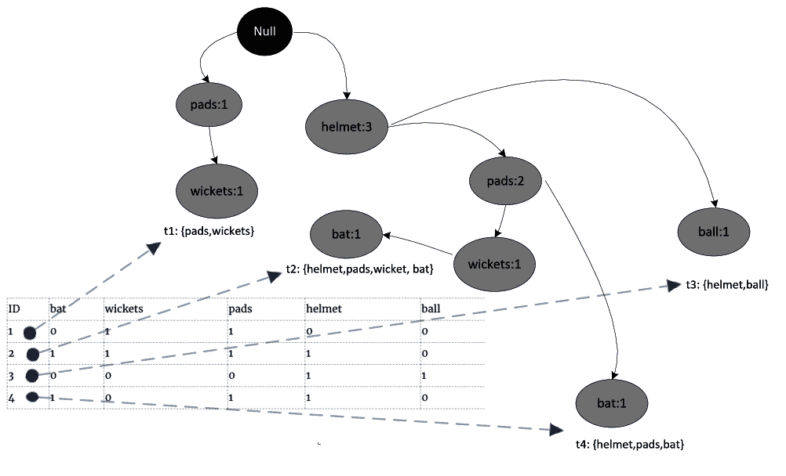

请注意，上图中生成的 FP 树是一个有序树。

# 频繁模式挖掘

FP 生长树的第二阶段涉及从 FP 树中挖掘频繁模式。通过创建一个有序的树，目的是创建一个高效的数据结构，可以轻松导航以搜索频繁的模式。

我们从一个叶节点（即结束节点）开始，然后向上移动，例如，让我们从一个叶节点项目**bat**开始。然后我们需要计算**bat**的条件模式库。通过指定从叶项目节点到顶部的所有路径来计算条件模式库。**bat**的条件模式基础如下：

| 边门：1 | 港口及机场发展策略：1 | 头盔：1 |
| Pad:1 | 头盔：1 |  |

**蝙蝠**的**频繁模式**如下：

*{导叶、护垫、头盔}：蝙蝠*

*{pad，头盔}：蝙蝠*

# 使用 FP-growth 的代码

让我们看看如何在 Python 中使用 FP-growth 算法生成关联规则。为此，我们将使用`pyfpgrowth`包。首先，如果我们以前从未使用过`pyfpgrowth`，那么让我们先安装它：

```py
!pip install pyfpgrowth
```

然后，让我们导入实现此算法所需的包：

```py
import pandas as pd
import numpy as np
import pyfpgrowth as fp
```

现在我们将以`transactionSet`的形式创建输入数据：

```py
dict1 = {
 'id':[0,1,2,3],
 'items':[["wickets","pads"],
 ["bat","wickets","pads","helmet"],
 ["helmet","pad"],
 ["bat","pads","helmet"]]

}
transactionSet = pd.DataFrame(dict1)
```

一旦生成了输入数据，我们将根据在`find_frequent_patterns()`中传递的参数生成模式。请注意，传递给此函数的第二个参数是最小支持度，在本例中为 1：

```py
patterns = fp.find_frequent_patterns(transactionSet['items'],1)
```

模式已经生成。现在让我们打印图案。模式列出了项目及其支架的组合：


现在，让我们生成规则：

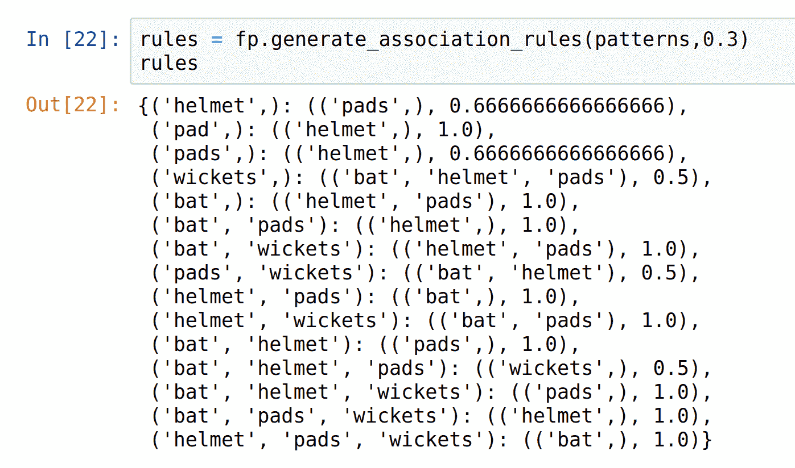

每个规则都有一个左侧和一个右侧，由冒号（：）分隔。它还为我们提供了对输入数据集中每个规则的支持。

# 实际应用–将类似 tweet 聚集在一起

无监督机器学习算法也可以实时应用于将类似 tweet 聚集在一起。他们将做以下工作：

*   步骤 1-**主题建模**：从一组给定的推文中发现各种主题
*   步骤 2-**聚类：**将每条推文与发现的主题之一关联

无监督学习的使用如下图所示：


让我们逐一研究这些步骤。

# 主题建模

主题建模是在一组文档中发现可用于区分它们的概念的过程。在 tweet 的上下文中，它是关于找到哪些是最合适的主题，在这些主题中可以划分一组 tweet。潜在 Dirichlet 分配是一种用于主题建模的流行算法。因为每个 tweet 都是简短的 144 个字符的文档，通常是关于一个非常特定的主题，所以我们可以编写一个更简单的算法来进行主题建模。算法描述如下：

1.  标记化推特。
2.  对数据进行预处理。删除停止字、数字、符号并执行词干分析
3.  为推文创建术语文档矩阵（TDM）。选择在独特推文中出现频率最高的前 200 个单词。
4.  选择直接或间接代表概念或主题的前 10 个单词。比如时装、纽约、节目、事故。这 10 个词现在是我们已经成功发现的主题，并将成为 tweet 的集群中心。

让我们转到下一步，即集群

# 群集

一旦我们发现了主题，我们将选择它们作为集群的中心。然后我们可以运行 k-means 聚类算法，将每个 tweet 分配给一个集群中心

因此，这是一个实际的例子，说明了如何将一组 tweet 聚集到发现的主题中

# 异常检测算法

字典对*异常*的定义是不同的、异常的、特殊的或不容易分类的。这是对一般规则的背离。在数据科学的背景下，异常是与预期模式有很大偏差的数据点。找到这些数据点的技术称为异常检测技术

现在让我们看看异常检测算法的一些应用：

*   信用卡诈骗
*   在**磁共振成像（MRI**扫描中发现恶性肿瘤
*   集群中的故障预防
*   考试中的模仿
*   高速公路上的交通事故

在接下来的章节中，我们将看到各种异常检测技术。

# 使用聚类

聚类算法（如 k-means）可用于将相似的数据点分组在一起。可以定义阈值，超过该阈值的任何点都可以归类为异常。这种方法的问题是，由于异常数据点的存在，k-means 聚类产生的分组本身可能会有偏差，并可能影响该方法的有用性和准确性。

# 基于密度的异常检测

基于密度的方法试图找到密集的社区。可使用**k-最近邻**（**KNN**算法）实现此目的。远离已发现的密集社区的异常被标记为异常

# 使用支持向量机

**支持向量机**（**SVM**算法）可用于学习数据点的边界。超出这些发现边界的任何点都被确定为异常。

# 总结

在本章中，我们研究了各种无监督机器学习技术。我们研究了在何种情况下，尝试降低我们试图解决的问题的维度是一个好主意，以及降低维度的不同方法。我们还研究了无监督机器学习技术非常有用的实例，包括市场篮子分析和异常检测。

在下一章中，我们将介绍各种监督学习技术。我们将从线性回归开始，然后我们将研究更复杂的有监督机器学习技术，如基于决策树的算法、SVM 和 XGBoast。我们还将研究最适合于非结构化文本数据的朴素贝叶斯算法。*******