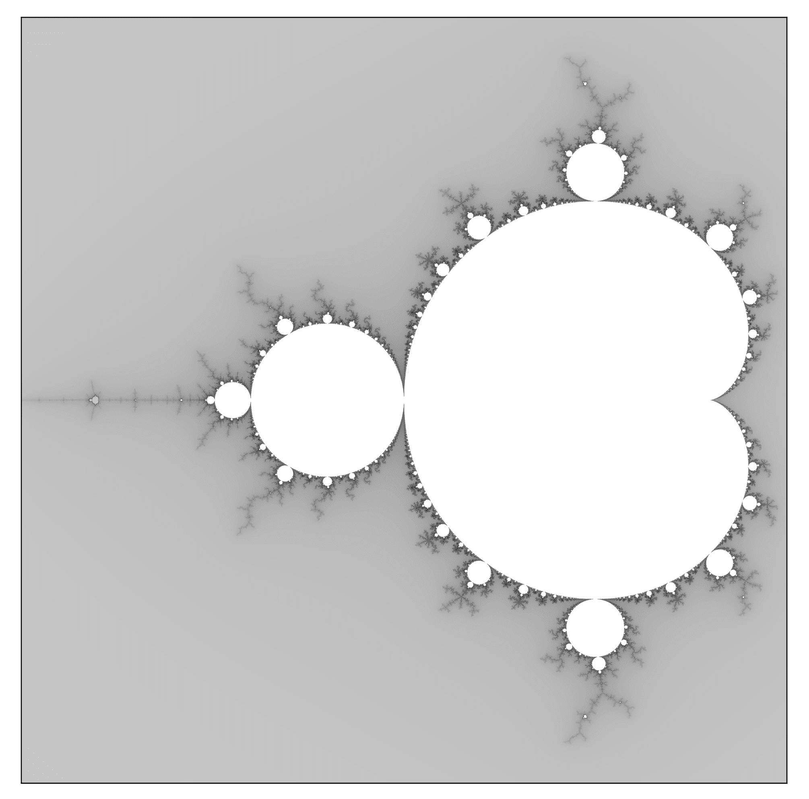
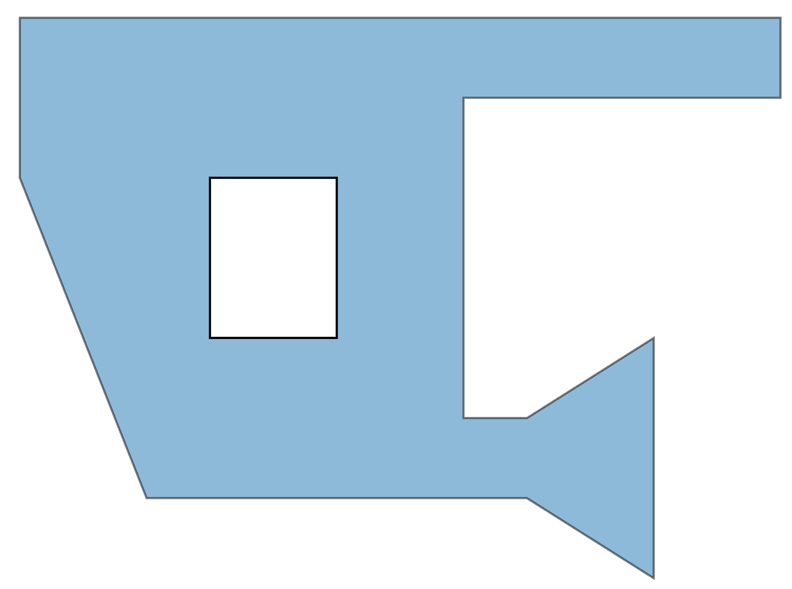
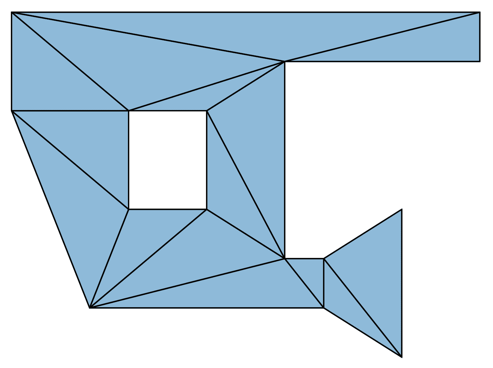
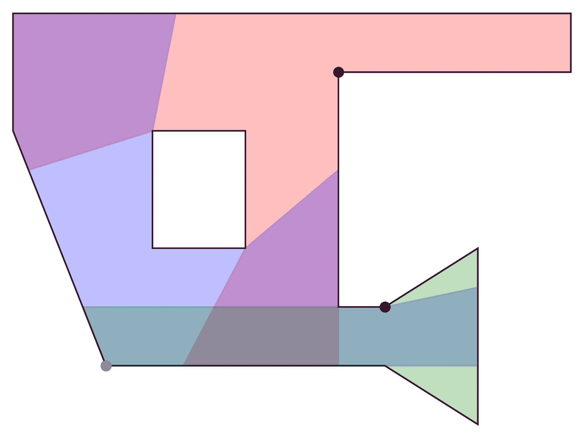
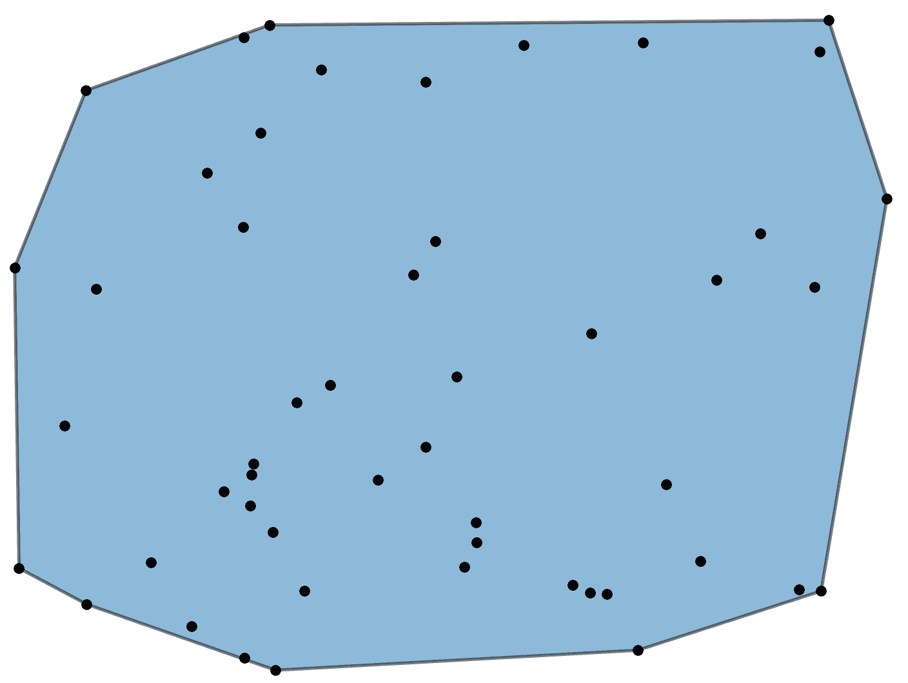
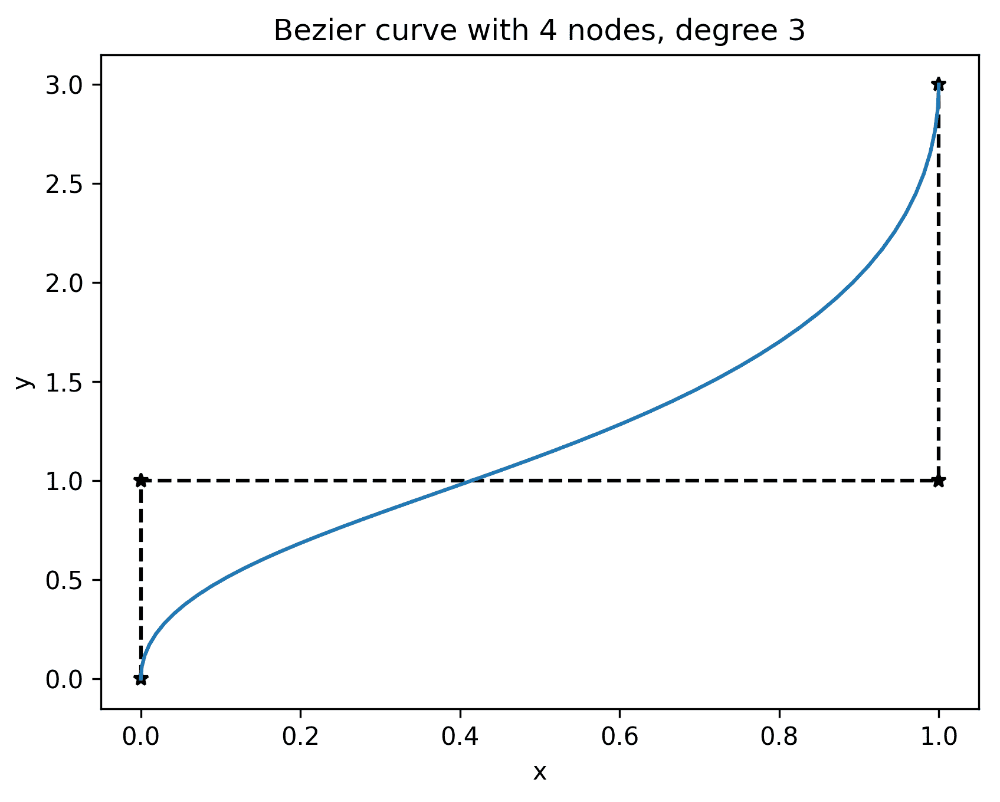
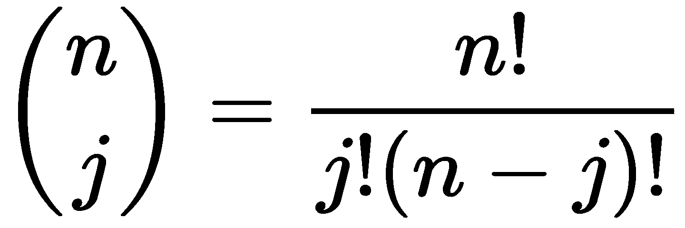

Geometric Problems

本章介绍有关二维几何的几个问题的解决方案。几何学是数学的一个分支，涉及点、线和其他图形（形状）的特征、这些图形之间的相互作用以及这些图形的变换。在本章中，我们将重点讨论二维图形的特征以及这些对象之间的相互作用。

在 Python 中处理几何对象时，我们必须克服几个问题。最大的障碍是代表性问题。大多数几何对象占据二维平面中的一个区域，因此，不可能存储该区域内的每个点。相反，我们必须找到一种更紧凑的方法来表示可以存储为相对较少数量点的区域。例如，我们可以沿对象的边界存储一组点，以便重建边界和对象本身。此外，我们将几何问题重新表述为可以使用代表性数据回答的问题。

第二个最大的问题是将纯粹的几何问题转换成可以用软件理解和解决的形式。这可能相对简单——例如，找到两条直线相交的点是一个求解矩阵方程的问题——也可能非常复杂，具体取决于所问问题的类型。解决这些问题的一种常用技术是使用更简单的对象来表示所讨论的图形，并使用每个简单对象来解决（希望）更容易的问题。这应该给我们一个解决原始问题的想法。

我们将首先向您展示如何可视化二维图形，然后学习如何确定一个点是否包含在另一个图形中。然后，我们将继续学习边缘检测、三角剖分和查找凸包。我们将通过构造 Bezier 曲线来结束本章。

本章涵盖以下配方：

*   可视化二维几何形状
*   寻找内点
*   在图像中查找边
*   平面图形的三角剖分
*   凸壳的计算
*   构造 Bezier 曲线

让我们开始吧！

# 技术要求

对于本章，我们将一如既往地需要`numpy`包和`matplotlib`包。我们还需要 Shapely 软件包和`scikit-image`软件包，可以使用您最喜欢的软件包管理器安装，例如`pip`：

```py
          python3.8 -m pip install numpy matplotlib shapely scikit-image

```

本章的代码可以在 GitHub 存储库的[的`Chapter 08`文件夹中找到 https://github.com/PacktPublishing/Applying-Math-with-Python/tree/master/Chapter%2008](https://github.com/PacktPublishing/Applying-Math-with-Python/tree/master/Chapter%2008) 。

查看以下视频以查看代码的运行：[https://bit.ly/3hpeKEF](https://bit.ly/3hpeKEF) 。

# 可视化二维几何形状

本章的重点是二维几何，因此我们的首要任务是学习如何可视化二维几何图形。这里提到的一些技术和工具可能适用于三维几何图形，但一般来说，这需要更专业的软件包和工具。

*几何图形*，至少在本书的上下文中，是指边界为线和曲线集合的任何点、线、曲线或闭合区域（包括边界）。简单的例子包括点和线（显然）、矩形、多边形和圆。

在本食谱中，我们将学习如何使用 Matplotlib 可视化几何图形。

## 准备

对于这个配方，我们需要 NumPy 包作为`np`导入，Matplotlib`pyplot`模块作为`plt`导入。我们还需要从 Matplotlib`patches`模块导入`Circle`类，从 Matplotlib`collections`模块导入`PatchCollection`类。这可以通过以下命令完成：

```py
import numpy as np
import matplotlib.pyplot as plt
from matplotlib.patches import Circle
from matplotlib.collections import PatchCollection
```

本章还需要代码库中的`swisscheese-grid-10411.csv`数据文件。

## 怎么做。。。

以下步骤显示如何可视化二维几何图形：

1.  首先，我们从本书的代码库加载`swisscheese-grid-10411.csv`文件中的数据：

```py
data = np.loadtxt("swisscheese-grid-10411.csv")
```

2.  我们创建一个新的面片对象，它表示绘图上的一个区域。这将是一个圆心位于原点且半径为`1`的圆（圆盘）。我们创建了一组新的轴，并将此面片添加到其中：

```py
fig, ax = plt.subplots()
outer = Circle((0.0, 0.0), 1.0, zorder=0, fc="k")
ax.add_patch(outer)
```

3.  接下来，我们根据*步骤 1*中加载的数据创建一个`PatchCollection`对象，其中包含许多其他圆的中心和半径。然后我们将此`PatchCollection`添加到*步骤 2*中创建的轴：

```py
col = PatchCollection(
    (Circle((x, y), r) for x, y, r in data),
    facecolor="white", zorder=1, linewidth=0.2, 
    ls="-", ec="k"
)
ax.add_collection(col)
```

4.  最后，我们设置*x-*和*y*轴范围，以便显示整个图像，然后关闭轴：

```py
ax.set_xlim((-1.1, 1.1))
ax.set_ylim((-1.1, 1.1))
ax.set_axis_off()
```

生成的图像是一个*瑞士奶酪*，如下所示：


Figure 8.1: Plot of a Swiss cheese

## 它是如何工作的。。。

此配方的关键是`Circle`和`PatchCollection`对象，它们表示 Matplotlib`Axes`上绘图区域的区域。在本例中，我们正在创建一个大型圆形面片，以原点为中心，半径为`1`，面色为黑色，并使用`zorder=0`将其放置在其他面片后面。使用`add_patch`方法将此修补程序添加到`Axes`对象。

下一步是创建一个对象，该对象将呈现我们在*步骤 1*中从 CSV 文件加载的数据所表示的圆。该数据由单个圆的*x*、*y*和*r*中心（*x*、*y*）和半径*r*（共 10411 个）值组成。`PatchCollection`对象将一系列面片组合成单个对象，可以添加到`Axes`对象。这里，我们为数据中的每一行添加一个`Circle`，然后使用`add_collection`方法将其添加到`Axes`对象中。请注意，我们已将面部颜色应用于整个系列，而不是每个`Circle`成分。我们将面部颜色设置为白色（使用`facecolor="w"`参数），边缘颜色设置为黑色（使用`ec="k"`），线宽（边缘线）设置为 0.2（使用`linewidth=0.2`），边缘样式设置为连续线。所有这些，当放在一起的时候，就形成了我们的形象。

我们在这里创造的形象被称为“瑞士奶酪”。1938 年，Alice Roth 首次将其应用于有理近似理论中；它们随后被重新发现，此后，类似的建筑也被多次使用。我们之所以使用这个示例，是因为它由一个较大的单个零件和一个较大的较小单个零件集合组成。Roth's Swiss Cheese 是平面上具有正面积但没有拓扑内部的集合的一个例子。（这是相当令人惊讶的，这样一个集合甚至可以存在！）更重要的是，在这个瑞士奶酪上定义的连续函数不能用有理函数近似。这个性质使得类似的构造在*一致**代数*理论中非常有用。

`Circle`类是更一般的`Patch`类的一个子类。还有许多其他的`Patch`类表示不同的平面图形，例如`Polygon`和`PathPatch`，它们表示由路径（曲线或曲线集合）限定的区域。这些可用于生成可在 Matplotlib 图形中渲染的复杂面片。集合可用于同时将设置应用于多个面片对象，如在本配方中，如果有大量对象将以相同样式渲染，则这一点尤其有用。

## 还有更多。。。

Matplotlib 中有许多不同的修补程序类型。在这个配方中，我们使用了`Circle`面片类，它表示轴上的一个圆形区域。还有`Polygon`面片类，它表示多边形（规则或其他）。还有`PatchPath`对象，它们是由曲线包围的区域，曲线不一定由直线段组成。这类似于在许多矢量图形软件包中构造着色区域的方式。

除了 Matplotlib 中的单个面片类型外，还有许多集合类型将多个面片聚集在一起用作单个对象。在这个配方中，我们使用`PatchCollection`类收集了大量`Circle`补丁。有更多专门的补丁集合可用于自动生成这些内部补丁，而不是我们自己生成它们。

## 另见

瑞士奶酪在数学方面的更详细历史可以在以下传记文章中找到：*Daepp，U.，Gauthier，P.，Gorkin，P.和 Schmieder，G.，2005。爱丽丝在瑞士：爱丽丝·罗斯的生活和数学。《数学智者》，27（1），第 41-54 页*。

# 寻找内点

在编程环境中处理二维图形的一个问题是，您不可能存储图形中的所有点。相反，我们通常存储的以某种方式表示图形的点要少得多。在大多数情况下，这将是一些描述图形边界的点（通过线连接）。例如，这在内存方面是有效的，并且可以使用 Matplotlib`Patches`轻松地在屏幕上显示它们。然而，这种方法使得确定一个点或另一个图形是否位于给定图形中变得更加困难。这是许多几何问题中的一个关键问题。

在本食谱中，我们将学习如何表示几何图形，并确定一个点是否位于图形内。

## 准备

对于该配方，我们需要将`matplotlib`包（整体）作为`mpl`导入，`pyplot`模块作为`plt`导入：

```py
import matplotlib as mpl
import matplotlib.pyplot as plt
```

我们还需要从 Shapely 包的`geometry`模块导入`Point`和`Polygon`对象。Shapely 软件包包含许多用于表示、操作和分析二维几何图形的例程和对象：

```py
from shapely.geometry import Polygon, Point
```

## 怎么做。。。

以下步骤演示如何创建多边形的形状表示，然后测试点是否位于该多边形内：

1.  创建要测试的示例多边形：

```py
polygon = Polygon(
    [(0, 2), (-1, 1), (-0.5, -1), (0.5, -1), (1, 1)],
)
```

2.  接下来，我们在一个新的图形上绘制多边形。首先，我们需要将多边形转换为可以添加到图形中的 Matplotlib`Polygon`面片：

```py
fig, ax = plt.subplots()
poly_patch = mpl.patches.Polygon(polygon.exterior, ec="k", 
   lw="1", alpha=0.5)
ax.add_patch(poly_patch)
ax.set(xlim=(-1.05, 1.05), ylim=(-1.05, 2.05))
ax.set_axis_off()
```

3.  现在，我们需要创建两个测试点，其中一个位于多边形内部，另一个位于多边形外部：

```py
p1 = Point(0.0, 0.0)
p2 = Point(-1.0, -0.75)
```

4.  我们在多边形顶部绘制并注释这两个点，以显示它们的位置：

```py
ax.plot(0.0, 0.0, "k*")
ax.annotate("p1", (0.0, 0.0), (0.05, 0.0))
ax.plot(-0.8, -0.75, "k*")
ax.annotate("p2", (-0.8, -0.75), (-0.8 + 0.05, -0.75))

```

5.  最后，我们使用`contains`方法测试每个点在多边形内的位置，然后将结果打印到终端：

```py
print("p1 inside polygon?", polygon.contains(p1))
print("p2 inside polygon?", polygon.contains(p2))
```

结果表明，第一个点`p1`包含在多边形中，而第二个点`p2`不包含在多边形中。下图中也可以看到这一点，它清楚地显示一个点包含在着色多边形中，而另一个点不包含在着色多边形中：


Figure 8.2: Points inside and outside a polygonal region

## 它是如何工作的。。。

Shapely`Polygon`类是多边形的表示，它将顶点存储为点。由外部边界包围的区域——存储顶点之间的五条直线——对我们来说是显而易见的，并且很容易被眼睛识别，但“在”边界内的概念很难用计算机容易理解的方式定义。对于“位于”给定曲线内意味着什么，给出一个正式的数学定义甚至都不容易。

确定点是否位于简单闭合曲线内有两种主要方法，即，在不包含任何自交点的同一位置开始和结束的曲线。第一种方法使用称为*缠绕数*的数学概念，计算曲线“环绕”一个点的次数；第二种方法使用*光线交叉计数*方法，计算光线从一个点到无穷远处一个点穿过曲线的次数。幸运的是，我们不需要自己计算这些数字，因为我们可以使用 Shapely 包中的工具为我们进行计算。这就是多边形的`contains`方法所做的。（在引擎盖下，Shapely 使用 GEOS 库执行此计算。）

Shapely`Polygon`类可用于计算与这些平面图形相关的许多数量，包括周长和面积。`contains`方法用于确定一个点或一组点是否位于由对象表示的多边形内。（对于此类可以表示的多边形的类型有一些限制。）事实上，您可以使用相同的方法来确定一个多边形是否包含在另一个多边形中，因为正如我们在本配方中看到的，多边形由简单的点集合表示。

# 在图像中查找边

在图像中查找边缘是一种很好的方法，可以将包含大量噪声和干扰的复杂图像还原为包含最突出轮廓的非常简单的图像。这可以作为我们分析过程的第一步，例如在图像分类中，或者作为将线轮廓导入计算机图形软件包的过程。

在这个配方中，我们将学习如何使用`scikit-image`包和 Canny 算法在复杂图像中找到边缘。

## 准备

对于该配方，我们需要将 Matplotlib`pyplot`模块作为`plt`导入，从`skimage.io`模块导入`imread`例程，从`skimage.feature`模块导入`canny`例程：

```py
import matplotlib.pyplot as plt
from skimage.io import imread
from skimage.feature import canny
```

## 怎么做。。。

按照以下步骤学习如何使用`scikit-image`包在图像中查找边缘：

1.  从源文件加载图像数据。这可以在本章的 GitHub 存储库中找到。关键的是，我们传入`as_gray=True`以加载灰度图像：

```py
image = imread("mandelbrot.png", as_gray=True)
```

以下是原始图像，供参考。集合本身由白色区域显示，如您所见，由较暗阴影表示的边界非常复杂：



Figure 8.3: Plot of the Mandelbrot set generated using Python

2.  接下来，我们使用`canny`例程，它需要从`scikit-image`包的`features`模块导入。此图像的`sigma`值设置为 0.5：

```py
edges = canny(image, sigma=0.5)
```

3.  最后，我们将`edges`图像添加到具有灰度（反转）颜色贴图的新图形中：

```py
fig, ax = plt.subplots()
ax.imshow(edges, cmap="gray_r")
ax.set_axis_off()
```

已检测到的边缘可以在下图中看到。边缘查找算法已识别出 Mandelbrot 集边界的大部分可见细节，尽管它并不完美（毕竟这是一个估计）：


Figure 8.4: The edges of the Mandelbrot set found using the scikit-image package's Canny edge detection algorithm

## 它是如何工作的。。。

`scikit-image`包提供了各种实用程序和类型，用于处理和分析从图像中获取的数据。顾名思义，`canny`例程使用 Canny 边缘检测算法在图像中查找边缘。该算法利用图像中的强度梯度来检测梯度较大的边缘。它还执行一些过滤，以减少它发现的边缘中的噪声。

我们提供的`sigma`关键字值是在计算边缘检测梯度之前应用于图像的高斯平滑的标准偏差。这有助于我们去除图像中的一些噪声。我们设置的值（0.5）比默认值（1）小，但在这种情况下它确实为我们提供了更好的分辨率。较大的值会模糊 Mandelbrot 集边界中的一些更精细的细节。

# 平面图形的三角剖分

正如我们在[第 3 章](03.html)、*微积分和微分方程*中看到的，我们经常需要将连续区域分解为更小、更简单的区域。在早期的食谱中，我们将实数的间隔缩减为更小的间隔集合，每个间隔的长度都很小。这个过程通常称为**离散化**。在本章中，我们将处理二维图形，因此我们需要此过程的二维版本。为此，我们将二维图形（在本配方中为多边形）分解为更小更简单的多边形集合。所有多边形中最简单的是三角形，因此这是二维离散化的良好起点。找到“平铺”几何图形的三角形集合的过程称为*三角剖分*。

在本食谱中，我们将学习如何使用 Shapely 软件包对多边形（带孔）进行三角剖分。

## 准备

对于该配方，我们需要将 NumPy 包作为`np`导入，将 Matplotlib 包作为`mpl`导入，将`pyplot`模块作为`plt`导入：

```py
import matplotlib as mpl
import matplotlib.pyplot as plt
import numpy as np
```

我们还需要 Shapely 包装中的以下物品：

```py
from shapely.geometry import Polygon
from shapely.ops import triangulate
```

## 怎么做。。。

以下步骤说明如何使用 Shapely 包对带有孔的多边形进行三角剖分：

1.  首先，我们需要创建一个`Polygon`对象，该对象表示我们希望三角化的图形：

```py
polygon = Polygon(
    [(2.0, 1.0), (2.0, 1.5), (-4.0, 1.5), (-4.0, 0.5), 
       (-3.0, -1.5), (0.0, -1.5), (1.0, -2.0), (1.0, -0.5), 
         (0.0, -1.0), (-0.5, -1.0), (-0.5, 1.0)],

    holes=[np.array([[-1.5, -0.5], [-1.5, 0.5], [-2.5, 0.5], 
       [-2.5, -0.5]])]
)
```

2.  现在，我们应该绘制图，以便了解我们将在其中工作的区域：

```py
fig, ax = plt.subplots()
plt_poly = mpl.patches.Polygon(polygon.exterior, 
   ec="k", lw="1", alpha=0.5, zorder=0)
ax.add_patch(plt_poly)
plt_hole = mpl.patches.Polygon(polygon.interiors[0], 
   ec="k", fc="w")
ax.add_patch(plt_hole)
ax.set(xlim=(-4.05, 2.05), ylim=(-2.05, 1.55))
ax.set_axis_off()
```

此多边形可以在下图中看到。我们可以看到，图中有一个“洞”，必须仔细考虑：



Figure 8.5: Sample polygon but with a hole

3.  我们使用`triangulate`例程生成多边形的三角剖分。此三角剖分包括外部边，这是我们不希望在本配方中使用的：

```py
triangles = triangulate(polygon)
```

4.  要删除位于原始多边形之外的三角形，我们需要使用内置的`filter`例程以及`contains`方法（见本章前面的内容）：

```py
filtered = filter(lambda p: polygon.contains(p), triangles) 
```

5.  要在原始多边形的顶部绘制三角形，我们需要将 Shapely 三角形转换为 Matplotlib`Patch`对象，存储在`PatchCollection`中：

```py
patches = map(lambda p: mpl.patches.Polygon(p.exterior), filtered)
col = mpl.collections.PatchCollection(patches, fc="none", ec="k")
```

6.  最后，我们将三角形面片集合添加到前面创建的图形中：

```py
ax.add_collection(col)
```

在原始多边形顶部绘制的三角剖分可以在下图中看到。在这里，我们可以看到每个顶点都与其他两个顶点相连，形成了一个覆盖整个原始多边形的三角形系统：



Figure 8.6: Triangulation of a sample polygon with a hole

## 它是如何工作的。。。

`triangulate`例程使用一种称为*Delaunay 三角剖分*的技术将一组点连接到一个三角形系统。在这种情况下，点的集合是多边形的顶点。Delaunay 方法查找这些三角形的方式是，所有点都不包含在任何三角形的外接圆内。这是该方法的一个技术条件，但这意味着三角形的选择是有效的，因为它避免了非常长、非常薄的三角形。生成的三角剖分利用原始多边形中存在的边，并连接一些外部边。

为了删除位于原始多边形之外的三角形，我们使用内置的`filter`例程，该例程通过删除 Criteria 函数失败的项来创建一个新的 iterable。这与 Shapely`Polygon`对象上的`contains`方法结合使用，以确定每个三角形是否位于原始图形内。正如我们前面提到的，我们需要将这些 Shapely 项转换为 Matplotlib 面片，然后才能将其添加到绘图中。

## 还有更多。。。

三角剖分通常用于将复杂的几何图形简化为三角形集合，对于某些计算任务来说，三角形集合要简单得多。然而，它们还有其他用途。三角剖分的一个特别有趣的应用是解决“艺术画廊问题”。这个问题涉及到找到“守卫”特定形状的艺术画廊所需的最大守卫数量。三角剖分是菲斯克对艺术画廊定理的简单证明的一个重要部分，这一定理最初由 Chvátal 证明。

假设此配方中的多边形是美术馆的平面图，需要在顶点上放置一些防护装置。少量工作将显示，需要在多边形顶点放置三个防护装置，才能覆盖整个博物馆。在下图中，我们绘制了一种可能的排列：



Figure 8.7: One possible solution to the art gallery problem where guards are placed on vertices.
The guards are indicated by the dots, and their corresponding field of vision is shaded.

一个防护装置放置在每个带有圆圈的顶点处，其视野由相应的阴影区域表示。在这里，您可以看到整个多边形至少被一种颜色覆盖。画廊问题的解决方案——实际上是原始问题的一种变体——告诉我们，我们最多需要四名警卫。

## 另见

关于画廊问题的更多信息可以在奥鲁克的经典著作中找到：*奥鲁克，J.（1987）。美术馆定理和算法。纽约：牛津大学出版社。*

# 凸壳的计算

如果一个几何图形中的每一对点都可以用一条直线连接起来，则称该几何图形为*凸*。凸体的简单示例包括点、直线、正方形、圆（圆盘）、正多边形等。*图 8.5*中所示的几何图形不是凸的，因为孔的相对侧上的点不能通过保留在图形内部的直线连接。

凸面图形从某种角度来看很简单，这意味着它们在各种应用中都很有用。一个特殊的问题是寻找包含点集合的最小凸集。这个最小的凸集称为点集的*凸包*。

在这个配方中，我们将学习如何使用 Shapely 包找到一组点的凸包。

## 准备

对于该配方，我们需要将 NumPy 包作为`np`导入，将 Matplotlib 包作为`mpl`导入，将`pyplot`模块作为`plt`导入：

```py
import numpy as np
import matplotlib as mpl
import matplotlib.pyplot as plt
```

我们还需要 NumPy 提供的默认随机数生成器。我们可以按如下方式导入：

```py
from numpy.random import default_rng
rng = default_rng(12345)
```

最后，我们需要从 Shapely 导入`MultiPoint`类：

```py
from shapely.geometry import MultiPoint
```

## 怎么做。。。

按照以下步骤查找随机生成点集合的凸包：

1.  首先，我们生成一个二维随机数数组：

```py
raw_points = rng.uniform(-1.0, 1.0, size=(50, 2))
```

2.  接下来，我们创建一个新图形，并在此图形上绘制这些原始采样点：

```py
fig, ax = plt.subplots()
ax.plot(raw_points[:, 0], raw_points[:, 1], "k.")
ax.set_axis_off()
```

这些随机生成的点可以在下图中看到。这些点大致分布在正方形区域上：


Figure 8.8: A collection of points in the plane

3.  接下来，我们构建一个`MultiPoint`对象，该对象收集所有这些点并将它们放入一个对象中：

```py
points = MultiPoint(raw_points)
```

4.  现在，我们使用`convex_hull`属性得到这个`MultiPoint`对象的凸包：

```py
convex_hull = points.convex_hull
```

5.  然后，我们创建一个 Matplotlib`Polygon`面片，该面片可以绘制在我们的图形上，以显示找到凸面外壳的结果：

```py
patch = mpl.patches.Polygon(convex_hull.exterior, alpha=0.5,
   ec="k", lw=1.2)
```

6.  最后，我们将`Polygon`面片添加到图中以显示凸面外壳：

```py
ax.add_patch(patch)
```

随机生成的点的凸包可以在下图中看到：



Figure 8.9: The convex hull of a collection of points in the plane

## 它是如何工作的。。。

Shapely 包是一个围绕 GEOS 库的 Python 包装器，用于几何分析。Shapely 几何对象的`convex_hull`属性从 GEOS 库调用凸包计算例程，生成一个新的 Shapely 对象。从这个方法中，我们可以看到点集合的凸包是一个多边形，顶点位于距离“中心”最远的点上。

# 构造 Bezier 曲线

*贝塞尔曲线*或*B 样条曲线*是一系列在矢量图形中非常有用的曲线，例如，它们通常用于高质量字体包中。这是因为它们由少量的点定义，然后可以使用这些点沿曲线廉价地计算大量点。这允许根据用户的需要缩放细节。

在这个配方中，我们将学习如何创建一个表示贝塞尔曲线的简单类，并沿它计算许多点。

## 准备

在这个配方中，我们将使用作为`np`导入的 NumPy 包，作为`plt`导入的 Matplotlib`pyplot`模块，以及来自 Python 标准库`math`模块的`comb`例程，以别名`binom`导入：

```py
from math import comb as binom
import matplotlib.pyplot as plt
import numpy as np
```

## 怎么做。。。

按照以下步骤定义表示贝塞尔曲线的类，该曲线可用于计算曲线沿线的点：

1.  第一步是建立基本类。我们需要为实例属性提供控制点（节点）和一些相关编号：

```py
class Bezier:
    def __init__(self, *points):
        self.points = points
        self.nodes = n = len(points) - 1
        self.degree = l = points[0].size
```

2.  仍然在`__init__`方法中，我们为贝塞尔曲线生成系数，并将其存储在实例属性的列表中：

```py
        self.coeffs = [binom(n, i)*p.reshape((l, 1)) for i, 
           p in enumerate(points)]
```

3.  接下来，我们定义一个`__call__`方法以使类可调用。为了清晰起见，我们将实例中的节点数加载到局部变量中：

```py
    def __call__(self, t):
        n = self.nodes
```

4.  接下来，我们重塑输入数组，使其包含一行：

```py
        t = t.reshape((1, t.size))
```

5.  现在，我们使用实例的`coeffs`属性中的每个系数生成一个值数组列表：

```py
        vals = [c @ (t**i)*(1-t)**(n-i) for i, 
           c in enumerate(self.coeffs)]
```

6.  最后，我们对*步骤 5*中构造的所有数组求和，并返回结果数组：

```py
       return np.sum(vals, axis=0)
```

7.  现在，我们将通过一个例子来测试我们的类。我们将为本例定义四个控制点：

```py
p1 = np.array([0.0, 0.0])
p2 = np.array([0.0, 1.0])
p3 = np.array([1.0, 1.0])
p4 = np.array([1.0, 3.0])
```

8.  接下来，我们设置了一个用于绘制的新图形，并使用虚线连接线绘制控制点：

```py
fig, ax = plt.subplots()
ax.plot([0.0, 0.0, 1.0, 1.0], [0.0, 1.0, 1.0, 3.0], "*--k")
ax.set(xlabel="x", ylabel="y", title="Bezier curve with 
    4 nodes, degree 3")
```

9.  然后，我们使用*步骤 7*中定义的四个点创建`Bezier`类的新实例：

```py
b_curve = Bezier(p1, p2, p3, p4)
```

10.  我们现在可以使用`linspace`创建一个 0 到 1 之间等间距点的数组，并沿贝塞尔曲线计算点：

```py
t = np.linspace(0, 1)
v = b_curve(t)
```

11.  最后，我们在前面绘制的控制点顶部绘制此曲线：

```py
ax.plot(v[0,:], v[1, :])
```

我们绘制的贝塞尔曲线可以在下图中看到。如您所见，曲线从第一个点（0,0）开始，到最后一个点（1,3）结束：



Figure 8.10: Bezier curve of degree 3 constructed using four nodes

## 它是如何工作的。。。

Bezier 曲线由一系列控制点来描述，从中我们以递归的方式构造曲线。具有一个点的贝塞尔曲线是一条保持在该点的恒定曲线。具有两个控制点的贝塞尔曲线是这两个点之间的线段：


当我们添加第三个控制点时，我们在曲线的贝塞尔曲线上的对应点之间取线段，该曲线由一个较少的点构成。这意味着我们使用以下公式构造具有三个控制点的贝塞尔曲线：


这种结构可以在下图中看到：


Figure 8.11: Construction of a quadratic Bezier curve using a recursive definition. The two linear Bezier curves are shown by the black dashed lines.

构造将继续以这种方式在任意数量的控制点上定义贝塞尔曲线。幸运的是，我们在实践中不需要使用这种递归定义，因为我们可以将公式展平为曲线的单个公式，该公式由以下公式给出：


这里，**p**<sub>*i*</sub>元素是控制点，*t*是参数，并且



是二项系数。记住，*t*参数是为生成曲线点而改变的量。我们可以将前面的求和中涉及*t*的项与不涉及*t*的项分开。这定义了我们在*步骤 2*中定义的系数，每个系数由以下代码片段给出：

```py
binom(n, i)*p.reshape((l, 1))
```

在这一步中，我们重塑每个点`p`，以确保它被安排为列向量。这意味着每个系数是一个列向量（作为 NumPy 数组），由二项式系数缩放的控制点组成。

现在，我们需要指定如何在*t*的不同值下计算贝塞尔曲线。这就是我们利用 NumPy 包中的高性能阵列操作的地方。在形成系数时，我们将控制点重塑为列向量。在*步骤 4*中，我们对输入*t*的值进行了整形，形成了一个行向量。这意味着我们可以使用矩阵乘法运算符将每个系数乘以相应的（标量）值，具体取决于输入*t*。这就是*步骤 5*中列表理解中发生的情况。在下一行中，我们将*l×1*数组乘以*1×N*数组，得到一个*l×N*数组：

```py
c @ (t**i)*(1-t)**(n-i)
```

对于每个系数，我们得到其中一个。然后，我们可以使用`np.sum`例程对这些*l×N*数组进行求和，以获得沿贝塞尔曲线的值。在本配方提供的示例中，输出数组的顶行包含曲线的*x*值，底行包含曲线的*y*值。在为`sum`例程指定`axis=0`关键字参数时，我们必须小心，以确保总和接管我们创建的列表，而不是该列表包含的数组。

我们定义的类使用 Bezier 曲线的控制点进行初始化，然后使用这些控制点生成系数。曲线值的实际计算是使用 NumPy 完成的，因此此实现应该具有相对良好的性能。一旦创建了这个类的特定实例，它的功能就非常类似于一个函数，正如您所期望的那样。但是，这里没有进行类型检查，所以我们只能使用 NumPy 数组作为参数来调用这个“函数”。

## 还有更多。。。

贝塞尔曲线使用迭代构造进行定义，其中具有*n*点的曲线使用连接第一个和最后一个*n-1*点定义的曲线的直线进行定义。使用此构造跟踪每个控制点的系数将快速引导您找到我们用于定义前面曲线的方程式。这种构造还导致贝塞尔曲线有趣且有用的几何特性。

正如我们在介绍本配方时提到的，贝塞尔曲线出现在许多涉及矢量图形的应用程序中，例如字体。它们也出现在许多常见的矢量图形软件包中。在这些软件包中，通常可以看到*二次贝塞尔曲线*，它由三个点的集合定义。但是，也可以通过在这些点上提供两个端点以及渐变线来定义二次贝塞尔曲线。这在图形软件包中更常见。生成的 Bezier 曲线将沿渐变线离开每个端点，并在这些点之间平滑连接曲线。

我们在这里构建的实现对于小型应用程序将具有相对良好的性能，但对于涉及在大量*t*值下渲染具有大量控制点的曲线的应用程序来说，这是不够的。为此，最好使用编译语言编写的低级包。例如，`bezier`Python 包使用编译的 Fortran 后端进行计算，并提供比我们在这里定义的类更丰富的接口。

当然，贝塞尔曲线可以自然地扩展到更高的维度。其结果是一个贝塞尔曲面，这使它们成为高质量、可伸缩图形的非常有用的通用工具。

# 进一步阅读

*   关于计算几何中一些常见算法的描述，请参见以下书籍：*Press，W.H.，Teukolsky，S.A.，Vetterling，W.T.，和 Flannery，B.P.，2007 年。数字配方：科学计算的艺术**。剑桥：剑桥大学出版社*。
*   有关计算几何中一些问题和技术的更详细说明，请查阅以下书籍：*O'Rourke，J.，1994。C**中的计算几何。剑桥：剑桥大学出版社*。