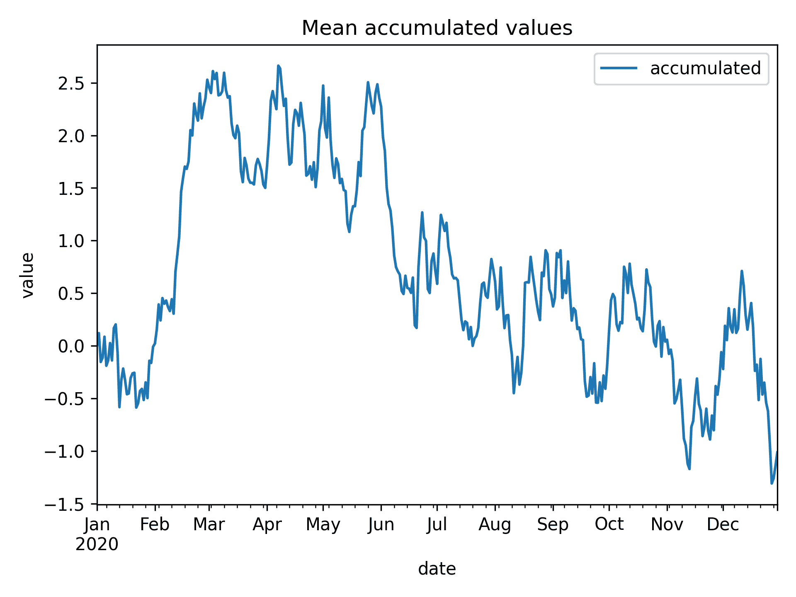
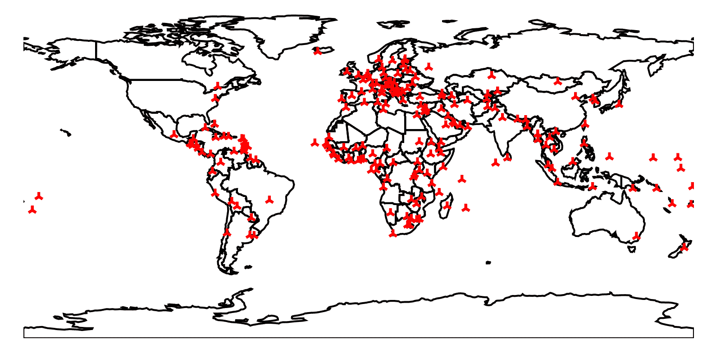
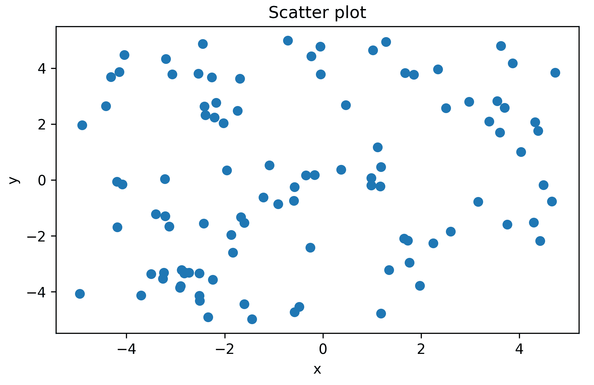
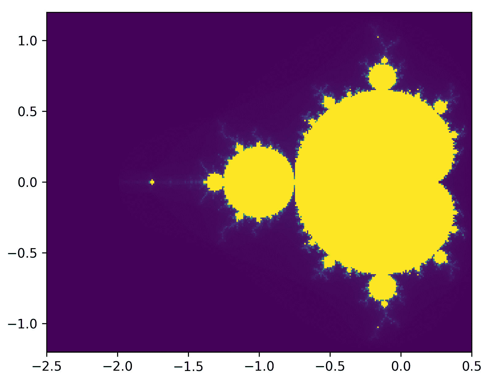

# 十、杂项话题

在本章中，我们将讨论一些与本书前几章中讨论的类别不符的主题。这些主题中的大多数都涉及促进计算和优化代码执行的不同方法。另一些则涉及处理特定类型的数据或文件格式。

在前两个配方中，我们将介绍有助于跟踪计算中的单位和不确定性的程序包。对于涉及具有直接物理应用的数据的计算而言，这些是非常重要的。在下一个配方中，我们将研究如何从 NetCDF 文件加载和存储数据。NetCDF 是一种文件格式，通常用于存储天气和气候数据。（NetCDF 代表**网络公共数据表**）在第四个配方中，我们将讨论使用地理数据，例如可能与天气或气候数据相关的数据。之后，我们将讨论如何从终端运行 Jupyter 笔记本，而不必启动交互式会话。接下来的两个方法涉及验证数据和处理来自 Kafka 服务器的数据流。我们的最后两个配方涉及两种不同的方法，我们可以使用 Cython 和 Dask 等工具来加速代码。

在本章中，我们将介绍以下配方：

*   用一品脱酒跟踪单位
*   考虑计算中的不确定性
*   从 NetCDF 文件加载和存储数据
*   处理地理数据
*   将 Jupyter 笔记本作为脚本执行
*   验证数据
*   使用数据流
*   用 Cython 加速代码
*   基于 Dask 的分布式计算

让我们开始吧！

# 技术要求

由于本章所含配方的性质，本章需要许多不同的包装。我们需要的包裹清单如下：

*   品脱
*   不确定性
*   NetCDF4
*   沙雷
*   土工画板
*   地质图
*   造纸厂
*   地狱犬
*   浮士德
*   赛昂
*   达斯克

所有这些软件包都可以使用您喜爱的软件包管理器安装，例如`pip`：

```py
          python3.8 -m pip install pint uncertainties netCDF4 xarray geopandas
   geoplot papermill cerberus faust cython

```

要安装 Dask 包，我们需要安装与该包相关的各种附加组件。我们可以在终端中使用以下`pip`命令：

```py
          python3.8 -m pip install dask[complete]

```

除了这些 Python 软件包，我们还需要安装一些支持软件。对于使用地理数据的*配方，GeoPandas 和 Geoplot 库具有许多较低级别的依赖项，可能需要单独安装。详细说明见[处的 GeoPandas 包文件 https://geopandas.org/install.html](https://geopandas.org/install.html) 。*

对于*处理流式数据*配方，我们需要安装卡夫卡服务器。有关如何安装和运行 Kafka 服务器的详细说明，请参见位于[的 Apache Kafka 文档页面 https://kafka.apache.org/quickstart](https://kafka.apache.org/quickstart) 。

对于使用 Cython 配方的*加速代码，我们需要安装一个 C 编译器。关于如何获取**GNU C 编译器**（**GCC**）的说明，请参见[中的 Cython 文档 https://cython.readthedocs.io/en/latest/src/quickstart/install.html](https://cython.readthedocs.io/en/latest/src/quickstart/install.html) 。*

本章的代码可以在 GitHub 存储库的[的`Chapter 10`文件夹中找到 https://github.com/PacktPublishing/Applying-Math-with-Python/tree/master/Chapter%2010](https://github.com/PacktPublishing/Applying-Math-with-Python/tree/master/Chapter%2010) 。

查看以下视频以查看代码的运行：[https://bit.ly/2ZMjQVw](https://bit.ly/2ZMjQVw) 。

# 用一品脱酒跟踪单位

在计算中正确跟踪单位可能非常困难，特别是在某些地方可以使用不同的单位时。例如，很容易忘记在不同的单位之间转换——英尺/英寸转换为米——或者公制前缀——例如，将 1 公里转换为 1000 米。

在本食谱中，我们将学习如何使用品脱软件包跟踪计算中的测量单位。

## 准备

对于该配方，我们需要品脱包装，可按如下方式导入：

```py
import pint
```

## 怎么做。。。

以下步骤说明如何使用 Pint 软件包跟踪计算中的单位：

1.  首先，我们需要创建一个`UnitRegistry`对象：

```py
ureg = pint.UnitRegistry(system="mks")
```

2.  要创建具有单位的数量，我们将该数字乘以注册表对象的相应属性：

```py
distance = 5280 * ureg.feet
```

3.  我们可以使用一种可用的转换方法更改数量的单位：

```py
print(distance.to("miles"))
print(distance.to_base_units())
print(distance.to_base_units().to_compact())
```

这些`print`语句的输出如下：

```py
0.9999999999999999 mile
1609.3439999999998 meter
1.6093439999999999 kilometer
```

4.  我们包装一个例程，使其以秒为单位预期参数，并以米为单位输出结果：

```py
@ureg.wraps(ureg.meter, ureg.second)
def calc_depth(dropping_time):
    # s = u*t + 0.5*a*t*t
    # u = 0, a = 9.81
    return 0.5*9.81*dropping_time*dropping_time
```

5.  现在，当我们以分钟为单位调用`calc_depth`例程时，它会自动转换为秒进行计算：

```py
depth = calc_depth(0.05 * ureg.minute)
print("Depth", depth)
# Depth 44.144999999999996 meter
```

## 它是如何工作的。。。

Pint 包为数字类型提供了一个包装类，该类将单元元数据添加到类型中。此包装器类型实现所有标准算术运算，并在整个计算过程中跟踪单位。例如，当我们将一个长度单位除以一个时间单位时，我们将得到一个速度单位。这意味着您可以使用品脱来确保经过复杂计算后的单位是正确的。

`UnitRegistry`对象跟踪会话中存在的所有单元，并处理不同单元类型之间的转换等事项。它还维护一个测量参考系统，在本配方中，该系统是以米、千克和秒为基本单位的标准国际系统，表示为`mks`。

`wrap`功能允许我们声明例程的输入和输出单位，这允许 Pint 为输入功能进行自动单位转换——在这个配方中，我们将分钟转换为秒。尝试使用没有关联单位或不兼容单位的数量调用包装函数将引发异常。这允许运行时验证参数并自动转换为例程的正确单位。

## 还有更多。。。

Pint 软件包附带了大量预先编程的测量单位列表，涵盖了大多数全球使用的系统。单位可以在运行时定义或从文件加载。这意味着您可以定义特定于正在使用的应用程序的自定义单位或单位制。

单元也可以在不同的上下文中使用，这允许在通常不相关的不同单元类型之间轻松转换。在需要在计算中的多个点在单位之间流动的情况下，这可以节省大量时间。

# 计算中不确定性的会计处理

大多数测量设备不是 100%精确，而是精确到一定量，通常在 0%到 10%之间。例如，一个温度计的准确度可能高达 1%，而一对数字卡尺的准确度可能高达 0.1%。这两种情况下的真实值不太可能与报告的值完全一致，尽管它将相当接近。跟踪一个值中的不确定性是困难的，尤其是当您有多个不同的不确定性以不同的方式组合在一起时。与其手动跟踪，不如使用一致的库来为您执行此操作。这就是`uncertainties`包的作用。

在本食谱中，我们将学习如何量化变量的不确定性，并了解这些不确定性如何通过计算传播。

## 准备

对于这个配方，我们需要`uncertainties`包，从中我们将导入`ufloat`类和`umath`模块：

```py
from uncertainties import ufloat, umath
```

## 怎么做。。。

以下步骤说明如何量化计算中数值的不确定性：

1.  首先，我们创建一个不确定的浮动值`3.0`加上或减去`0.4`：

```py
seconds = ufloat(3.0, 0.4)
print(seconds)  # 3.0+/-0.4
```

2.  接下来，我们执行涉及该不确定值的计算，以获得新的不确定值：

```py
depth = 0.5*9.81*seconds*seconds
print(depth)  # 44+/-12
```

3.  接下来，我们创建一个新的不确定浮点值，并以与前面计算相反的方式应用来自`umath`模块的`sqrt`例程：

```py
other_depth = ufloat(44, 12)
time = umath.sqrt(2.0*other_depth/9.81)
print("Estimated time", time)
# Estimated time 3.0+/-0.4
```

## 它是如何工作的。。。

`ufloat`类围绕`float`对象，并在整个计算过程中跟踪不确定性。该库利用线性误差传播理论，该理论使用非线性函数的导数来估计计算过程中传播的误差。该库还正确处理相关性，因此从自身减去一个值将得到 0，而不会出现错误。

为了跟踪标准数学函数中的不确定性，您需要使用`umath`模块中提供的版本，而不是 Python 标准库或第三方软件包（如 NumPy）中定义的版本。

## 还有更多。。。

`uncertainties`包为 NumPy 提供支持，前面配方中提到的品脱包可以与不确定性相结合，以确保单位和误差裕度正确归因于计算的最终值。例如，我们可以从本配方的*步骤 2*计算计算中的单位，如下所示：

```py
import pint
from uncertainties import ufloat
g = 9.81*ureg.meters / ureg.seconds ** 2
seconds = ufloat(3.0, 0.4) * ureg.seconds

depth = 0.5*g*seconds**2
print(depth)
```

正如我们所期望的，最后一行的`print`语句为我们提供了`44+/-12 meter`。

# 从 NetCDF 文件加载和存储数据

许多科学应用要求我们以可靠的格式启动大量多维数据。NetCDF 是气象和气候行业开发的数据格式的一个示例。不幸的是，数据的复杂性意味着我们不能简单地使用 Pandas 包中的实用程序来加载这些数据进行分析。我们需要`netcdf4`包来读取数据并将其导入 Python，但我们还需要使用`xarray`。与 Pandas 库不同，`xarray`可以处理更高维的数据，同时仍然提供类似 Pandas 的接口。

在此配方中，我们将学习如何从 NetCDF 文件加载数据并将数据存储在 NetCDF 文件中。

## 准备

对于此配方，我们需要从 NumPy 导入 NumPy 包作为`np`，熊猫包作为`pd`，Matplotlib`pyplot`模块作为`plt`，以及默认随机数生成器的一个实例：

```py
import numpy as np
import pandas as pd
import matplotlib.pyplot as plt
from numpy.random import default_rng
rng = default_rng(12345)
```

我们还需要导入别名为`xr`的`xarray`包。您还需要安装 Dask 软件包，如*技术要求*部分所述，以及 NetCDF4 软件包：

```py
import xarray as xr
```

我们不需要直接导入这些包中的任何一个。

## 怎么做。。。

按照以下步骤在 NetCDF 文件中加载和存储示例数据：

1.  首先，我们需要创建一些随机数据。该数据包括一系列日期、位置代码列表和随机生成的数字：

```py
dates = pd.date_range("2020-01-01", periods=365, name="date")
locations = list(range(25))
steps = rng.normal(0, 1, size=(365,25))
accumulated = np.add.accumulate(steps)
```

2.  接下来，我们创建一个包含数据的 xarray`Dataset`对象。日期和位置是索引，`steps`和`accumulated`变量是数据：

```py
data_array = xr.Dataset({
    "steps": (("date", "location"), steps),
    "accumulated": (("date", "location"), accumulated)
    },
    {"location": locations, "date": dates}
)
print(data_array)
```

`print`语句的输出如下图所示：

```py
<xarray.Dataset>
Dimensions: (date: 365, location: 25)
Coordinates:
* location (location) int64 0 1 2 3 4 5 6 7 8 ... 17 18 19 20 21 22 23 24
* date (date) datetime64[ns] 2020-01-01 2020-01-02 ... 2020-12-30
Data variables:
steps (date, location) float64 geoplot.pointplot(cities, ax=ax, fc="r", marker="2")
ax.axis((-180, 180, -90, 90))-1.424 1.264 ... -0.4547 -0.4873
accumulated (date, location) float64 -1.424 1.264 -0.8707 ... 8.935 -3.525
```

3.  接下来，我们计算每个时间索引的所有位置的平均值：

```py
means = data_array.mean(dim="location")
```

4.  现在，我们在一组新轴上绘制平均累积值：

```py
fig, ax = plt.subplots()
means["accumulated"].to_dataframe().plot(ax=ax)
ax.set(title="Mean accumulated values", xlabel="date", ylabel="value")
```

结果图如下所示：



Figure 10.1: Plot of accumulated means over time

5.  使用`to_netcdf`方法将此数据集保存到新的 NetCDF 文件中：

```py
data_array.to_netcdf("data.nc")
```

6.  现在，我们可以使用`xarray`中的`load_dataset`例程加载新创建的 NetCDF 文件：

```py
new_data = xr.load_dataset("data.nc")
print(new_data)
```

上述代码的输出如下所示：

```py
<xarray.Dataset>
Dimensions: (date: 365, location: 25)
Coordinates:
  * location (location) int64 0 1 2 3 4 5 6 7 8 ... 17 18 19 20 21 22 23 24
  * date (date) datetime64[ns] 2020-01-01 2020-01-02 ... 2020-12-30
Data variables:
    steps (date, location) float64 -1.424 1.264 ... -0.4547 -0.4873
    accumulated (date, location) float64 -1.424 1.264 -0.8707 ... 8.935 -3.525
```

## 它是如何工作的。。。

`xarray`包提供了`DataArray`和`DataSet`类，它们（粗略地说）是熊猫`Series`和`DataFrame`对象的多维等价物。在本例中，我们使用数据集，因为每个索引（日期和位置的元组）都有两个与之关联的数据段。这两个对象都向其对等对象公开了类似的接口。例如，我们可以使用`mean`方法沿其中一个轴计算平均值。`DataArray`和`DataSet`对象也有一种方便的方法可以转换成熊猫`DataFrame`，称为`to_dataframe`。我们在这个配方中使用它来转换为`DataFrame`进行绘图，这并不是真正必要的，因为`xarray`内置了绘图功能。

此配方的真正重点在于`to_netcdf`方法和`load_dataset`例程。前者以 NetCDF 格式文件存储一个`DataSet`。这需要安装 NetCDF4 包，因为它允许我们访问相关的 C 库来解码 NetCDF 格式的文件。`load_dataset`例程是一个通用例程，用于从各种文件格式（包括 NetCDF）将数据加载到`DataSet`对象中（同样，这需要安装 NetCDF4 包）。

## 还有更多。。。

`xarray`包除了支持 NetCDF 外，还支持多种数据格式，如 OPeNDAP、Pickle、GRIB 和 Pandas 支持的其他格式。

# 处理地理数据

许多应用程序涉及处理地理数据。例如，在跟踪全球天气时，我们可能希望在地图上绘制由世界各地的各种传感器测量的温度。为此，我们可以使用 GeoPandas 包和 Geoplot 包，这两个包都允许我们操作、分析和可视化地理数据。

在本配方中，我们将使用 GeoPandas 和 Geoplot 软件包加载和可视化一些示例地理数据。

## 准备

对于该配方，我们需要 GeoPandas 包、Geoplot 包和 Matplotlib`pyplot`包作为`plt`导入：

```py
import geopandas
import geoplot
import matplotlib.pyplot as plt
```

## 怎么做。。。

按照以下步骤，使用示例数据在世界地图上绘制首都城市的简单图：

1.  首先，我们需要从 GeoPandas 包中加载样本数据，该包包含世界几何体信息：

```py
world = geopandas.read_file(
        geopandas.datasets.get_path("naturalearth_lowres")
)
```

2.  接下来，我们需要加载包含世界上每个首都的名称和位置的数据：

```py
cities = geopandas.read_file(
        geopandas.datasets.get_path("naturalearth_cities")
)
```

3.  现在，我们可以创建一个新图形，并使用`polyplot`例程绘制世界几何体的轮廓：

```py
fig, ax = plt.subplots()
geoplot.polyplot(world, ax=ax)
```

4.  最后，我们使用`pointplot`例程将首都的位置添加到世界地图的顶部。我们还设置轴限制，以使整个世界可见：

```py
geoplot.pointplot(cities, ax=ax, fc="r", marker="2")
ax.axis((-180, 180, -90, 90))
```

由此得出的世界首都位置图如下所示：



Figure 10.2: Plot of the world's capital cities on a map

## 它是如何工作的。。。

GeoPandas 包是 Pandas 的扩展，用于处理地理数据，而 Geoplot 包是 Matplotlib 的扩展，用于绘制地理数据。GeoPandas 软件包附带了我们在本配方中使用的一些样本数据集。`naturalearth_lowres`包含描述世界各国边界的几何图形。正如其名称所示，这些数据的分辨率不是很高，这意味着地图上可能不存在一些更精细的地理特征细节。（一些小岛根本没有显示。）`naturalearth_cities`包含世界首都的名称和位置。我们正在使用`datasets.get_path`例程来检索包数据目录中这些数据集的路径。`read_file`例程将数据导入 Python 会话。

Geoplot 软件包提供了一些专门用于打印地理数据的其他打印例程。`polyplot`例程从 GeoPandas 数据框绘制多边形数据，该数据框可能描述一个国家的地理边界。`pointplot`例程从 GeoPandas 数据框在一组轴上绘制离散点，在本例中，该数据框描述了首都的位置。

# 将 Jupyter 笔记本作为脚本执行

Jupyter 笔记本是为科学和基于数据的应用程序编写 Python 代码的流行媒介。Jupyter 笔记本实际上是一系列块，它们以**JavaScript 对象表示法**（**JSON**）和`ipynb`扩展名存储在一个文件中。每个块可以是几种不同类型中的一种，例如代码或标记。这些笔记本通常通过一个 web 应用程序访问，该应用程序在后台内核中解释块并执行代码，然后将结果返回给 web 应用程序。如果你在个人电脑上工作，这很好，但是如果你想在服务器上远程运行笔记本中包含的代码呢？在这种情况下，甚至可能无法访问 Jupyter 笔记本软件提供的 web 界面。papermill 包允许我们从命令行参数化和执行笔记本。

在本食谱中，我们将学习如何使用 papermill 从命令行执行 Jupyter 笔记本。

## 准备

对于这个配方，我们需要安装 papermill 软件包，并且在当前目录中有一个 Jupyter 笔记本示例。在本章中，我们将使用存储在代码库中的`sample.ipynb`笔记本文件。

## 怎么做。。。

按照以下步骤使用 PaperPill 命令行界面远程执行 Jupyter 笔记本：

1.  首先，我们从本章的代码库中打开示例笔记本`sample.ipynb`。笔记本包含三个代码单元，其中包含以下代码：

```py
import matplotlib.pyplot as plt
from numpy.random import default_rng
rng = default_rng(12345)

uniform_data = rng.uniform(-5, 5, size=(2, 100))

fig, ax = plt.subplots(tight_layout=True)
ax.scatter(uniform_data[0, :], uniform_data[1, :])
ax.set(title="Scatter plot", xlabel="x", ylabel="y")
```

2.  接下来，我们在终端中打开包含 Jupyter 笔记本的文件夹，并使用以下命令：

```py
          papermill --kernel python3 sample.ipynb output.ipynb

```

3.  现在，我们打开输出文件`output.ipynb`，它现在应该包含用执行代码的结果更新的笔记本。在最终块中生成的散点图如下所示：



Figure 10.3: Scatter plot of the random data that was generated inside a Jupyter notebook, executed remotely using papermill

## 它是如何工作的。。。

papermill 软件包提供了一个简单的命令行界面，该界面解释并执行 Jupyter 笔记本，然后将结果存储在新的笔记本文件中。在这个配方中，我们给出了第一个参数–输入笔记本文件–`sample.ipynb`和第二个参数–输出笔记本文件–`output.ipynb`。然后，该工具执行笔记本中包含的代码并生成输出。笔记本的文件格式跟踪上次运行的结果，因此这些结果将添加到输出笔记本并存储在所需位置。在这个配方中，这是一个简单的本地文件，但 papermill 也可以存储到云位置，例如**Amazon Web Services**（**AWS**）S3 存储或 Azure 数据存储。

在*步骤 2 中，*在使用造纸机命令行界面时增加了`--kernel python3`选项。此选项允许我们指定用于执行 Jupyter 笔记本的内核。如果 papermill 尝试使用与用于编写笔记本的内核不同的内核来执行笔记本，这可能是防止错误的必要条件。在终端中使用以下命令可以找到可用内核的列表：

```py
          jupyter kernelspec list

```

如果在执行笔记本时出错，可以尝试更改为其他内核。

## 还有更多。。。

Papermill 还有一个 Python 接口，您可以从 Python 应用程序中执行笔记本。这对于构建需要能够在外部硬件上执行长时间运行的计算以及结果需要存储在云中的 web 应用程序可能很有用。它还能够为笔记本电脑提供参数。为此，我们需要在笔记本中创建一个块，用带有默认值的参数标记进行标记。然后，可以通过命令行界面使用`-p`标志提供更新的参数，后跟参数名称和值。

# 验证数据

数据通常以原始形式呈现，可能包含异常或不正确或格式不正确的数据，这显然会给以后的处理和分析带来问题。将验证步骤构建到处理管道中通常是一个好主意。幸运的是，Cerberus 包为 Python 提供了一个轻量级且易于使用的验证工具。

对于验证，我们必须定义一个*模式*，它是对数据应该是什么样子以及应该对数据执行的检查的技术描述。例如，我们可以检查最大值和最小值的类型和位置界限。Cerberus 验证器还可以在验证步骤中执行类型转换，这允许我们将直接从 CSV 文件加载的数据插入验证器。

在此配方中，我们将学习如何使用 Cerberus 验证从 CSV 文件加载的数据。

## 准备

对于这个配方，我们需要从 Python 标准库导入`csv`模块，以及 Cerberus 包：

```py
import csv
import cerberus
```

在本章中，我们还需要代码库中的`sample.csv`文件。

## 怎么做。。。

在以下步骤中，我们将验证使用 Cerberus 软件包从 CSV 加载的一组数据：

1.  首先，我们需要构建一个描述我们期望的数据的模式。为此，我们必须为浮点数定义一个简单的模式：

```py
float_schema = {"type": "float", "coerce": float, "min": -1.0,
   "max": 1.0}
```

2.  接下来，我们为各个项目构建模式。这些将是我们的数据行：

```py
item_schema = {
    "type": "dict",
    "schema": {
        "id": {"type": "string"},
        "number": {"type": "integer", "coerce": int},
        "lower": float_schema,
        "upper": float_schema,
    }
}
```

3.  现在，我们可以为整个文档定义模式，它将包含一个项目列表：

```py
schema = {
    "rows": {
        "type": "list",
        "schema": item_schema
    }
}
```

4.  接下来，我们使用刚才定义的模式创建一个`Validator`对象：

```py
validator = cerberus.Validator(schema)
```

5.  然后，我们使用`csv`模块中的`DictReader`加载数据：

```py
with open("sample.csv") as f:
    dr = csv.DictReader(f)
    document = {"rows": list(dr)}
```

6.  接下来，我们使用`Validator`上的`validate`方法对文档进行验证：

```py
validator.validate(document)
```

7.  然后，我们从`Validator`对象中检索验证过程中的错误：

```py
errors = validator.errors["rows"][0]
```

8.  最后，我们可以打印出现的任何错误消息：

```py
for row_n, errs in errors.items():
    print(f"row {row_n}: {errs}")
```

错误消息的输出如下所示：

```py
row 11: [{'lower': ['min value is -1.0']}]
row 18: [{'number': ['must be of integer type', "field 'number' cannot be coerced: invalid literal for int() with base 10: 'None'"]}]
row 32: [{'upper': ['min value is -1.0']}]
row 63: [{'lower': ['max value is 1.0']}]
```

## 它是如何工作的。。。

我们创建的模式是我们需要对照数据检查的所有标准的技术描述。这通常被定义为一个以项目名称为键的字典，以及一个属性字典，例如字典中值的类型或边界，作为值。例如，在*步骤 1*中，我们为浮点数定义了一个模式，该模式限制这些数字，使它们介于-1 和 1 之间。请注意，我们包含了`coerce`键，它指定了在验证过程中应将值转换为的类型。这允许我们传入从 CSV 文档加载的数据，该文档只包含字符串，而不必担心其类型。

`Validator`对象负责解析文档，以便对文档进行验证，并根据模式描述的所有条件检查文档中包含的数据。在这个配方中，我们在创建`Validator`对象时为其提供了模式。但是，我们也可以将模式作为第二个参数传递到`validate`方法中。错误存储在反映文档结构的嵌套字典中。

# 使用数据流

一些数据以恒定流的形式从各种来源接收。例如，我们可能会遇到这样的情况：多个温度探测器通过 Kafka 服务器以设定的间隔报告值。Kafka 是一个流数据消息代理，它根据主题将消息传递给不同的处理代理。

处理流数据是异步 Python 的完美应用程序。这使我们能够同时处理大量数据，这在应用程序中可能非常重要。当然，我们不能在异步上下文中直接对此数据执行长时间运行的分析，因为这会干扰事件循环的执行。

为了使用 Python 的异步编程特性处理 Kafka 流，我们可以使用 Faust 包。这个包允许我们定义异步函数，这些函数将充当处理代理或服务，可以处理来自 Kafka 服务器的数据流或以其他方式与之交互。

在本教程中，我们将学习如何使用 Faust 包处理来自 Kafka 服务器的数据流。

## 准备

与本书中的大多数配方不同，此配方不能在 Jupyter 笔记本中运行，因为我们将从命令行运行生成的应用程序。

对于此配方，我们需要导入 Faust 软件包：

```py
import faust
```

我们还需要 NumPy 包中的默认随机数生成器实例：

```py
from numpy.random import default_rng
rng = default_rng(12345)
```

我们还需要在本地机器上运行 Kafka 服务的实例，以便 Faust 应用程序可以与 MessageBroker 交互。

下载 Kafka 并解压缩下载的源代码后，导航到 Kafka 应用程序所在的文件夹。在终端中打开此文件夹。对于 Linux 或 Mac，使用以下命令启动 ZooKeeper 服务器：

```py
          bin/zookeeper-server-start.sh config/zookeeper.properties

```

如果您在 Windows 上，请改用以下命令：

```py
          bin\windows\zookeeper-server-start.bat config\zookeeper.properties

```

然后，在新的终端中，使用以下 Linux 或 Mac 命令启动 Kafka 服务器：

```py
          bin/kafka-server-start.sh config/server.properties

```

如果您在 Windows 上，请改用以下命令：

```py
          bin\windows\kafka-server-start.bat config\server.properties

```

在每个终端中，您应该看到一些日志信息，这些信息将指示服务器正在运行。

## 怎么做。。。

按照以下步骤创建 Faust 应用程序，该应用程序将向 Kafka 服务器读取（和写入）数据，并执行一些简单的处理：

1.  首先，我们需要创建一个 Faust`App`实例，作为 Python 和 Kafka 服务器之间的接口：

```py
app = faust.App("sample", broker="kafka://localhost")
```

2.  接下来，我们将创建一个记录类型，它模拟我们期望从服务器获得的数据：

```py
class Record(faust.Record):
    id_string: str
    value: float
```

3.  现在，我们将向 Faust`App`对象添加一个主题，该主题将值类型设置为我们刚刚定义的`Record`类：

```py
topic = app.topic("sample-topic", value_type=Record)
```

4.  现在，我们定义一个代理，它是一个异步函数，包装在`App`对象的`agent`装饰器中：

```py
@app.agent(topic)
async def process_record(records):
    async for record in records:
        print(f"Got {record.id_string}: {record.value}")
```

5.  接下来，我们定义两个源函数，它们将根据我们设置的示例主题将记录发布到 Kafka 服务器。这些异步函数包装在`timer`装饰器中，并设置了适当的间隔：

```py
@app.timer(interval=1.0)
async def producer1(app):
    await app.send(
        "sample-topic",
        value=Record(id_string="producer 1", value=
            rng.uniform(0, 2))
    )

@app.timer(interval=2.0)
async def producer2(app):
    await app.send(
        "sample-topic",
        value=Record(id_string="producer 2", value=
            rng.uniform(0, 5))
    )
```

6.  在文件的底部，我们启动应用程序的`main`功能：

```py
app.main()
```

7.  现在，在新的终端中，我们可以使用以下命令启动应用程序的工作程序（假设我们的应用程序存储在`working-with-data-streams.py`中）：

```py
          python3.8 working-with-data-streams.py worker

```

在此阶段，您应该看到代理生成的一些输出打印到终端中，如下所示：

```py
[2020-06-21 14:15:27,986] [18762] [WARNING] Got producer 1: 0.4546720449343393 
[2020-06-21 14:15:28,985] [18762] [WARNING] Got producer 2: 1.5837916985487643 
[2020-06-21 14:15:28,989] [18762] [WARNING] Got producer 1: 1.5947309146654682 
[2020-06-21 14:15:29,988] [18762] [WARNING] Got producer 1: 1.3525093415019491
```

下面是 Faust 生成的一些应用程序信息。

8.  按*Ctrl*+*C*关闭 worker，并确保以相同的方式同时关闭 Kafka 服务器和 Zookeeper 服务器。

## 它是如何工作的。。。

这是 Faust 应用程序的一个非常基本的示例。通常，我们不会生成记录并通过 Kafka 服务器发送，然后在同一个应用程序中处理它们。但是，就本演示而言，这很好。在生产环境中，我们可能会连接到远程 Kafka 服务器，该服务器连接到多个源并同时发布到多个不同的主题。

Faust 应用程序控制 Python 代码和 Kafka 服务器之间的交互。我们使用`agent`装饰器添加一个函数来处理发布到特定频道的信息。每次将新数据推送到示例主题时，都将执行此异步函数。在这个配方中，我们定义的代理只是将`Record`对象中包含的信息打印到终端中。

`timer`装饰器定义了一个服务，该服务在指定的时间间隔内定期执行某些操作。在我们的例子中，计时器通过`App`对象向 Kafka 服务器发送消息。然后将这些消息推送到代理进行处理。

Faust 命令行界面用于启动运行应用程序的工作进程。这些工作者实际上是对 Kafka 服务器上的事件或过程中的本地事件（如本配方中定义的计时器服务）执行处理的人。大型应用程序可能会使用多个辅助进程来处理大量数据。

## 另见

浮士德文档提供了关于浮士德能力的更多细节，以及浮士德的各种替代方案：[https://faust.readthedocs.io/en/latest/](https://faust.readthedocs.io/en/latest/) 。

有关卡夫卡的更多信息，请访问 Apache 卡夫卡网站：[https://kafka.apache.org/](https://kafka.apache.org/) 。

# 用 Cython 加速代码

Python 经常被批评为一种缓慢的编程语言——这是一种争论不休的说法。许多批评都可以通过使用一个具有 Python 接口的高性能编译库（如 scientific Python 堆栈）来解决，从而大大提高性能。然而，在某些情况下，很难避免 Python 不是编译语言这一事实。在这些（相当罕见的）情况下提高性能的一种方法是编写一个 C 扩展（甚至完全用 C 重写代码），以加快关键部分的速度。这当然会使代码运行得更快，但可能会使维护包更加困难。相反，我们可以使用 Cython，它是 Python 语言的一个扩展，被转换成 C 语言并编译以获得极大的性能改进。

例如，我们可以考虑一些用于生成曼德尔布罗特集的图像的代码。作为比较，我们假设纯 Python 代码是我们的起点，如下所示：

```py
# mandelbrot/python_mandel.py

import numpy as np

def in_mandel(cx, cy, max_iter):
    x = cx
    y = cy
    for i in range(max_iter):
        x2 = x**2
        y2 = y**2
        if (x2 + y2) >= 4:
            return i
        y = 2.0*x*y + cy
        x = x2 - y2 + cx
    return max_iter

def compute_mandel(N_x, N_y, N_iter):
    xlim_l = -2.5
    xlim_u = 0.5
    ylim_l = -1.2
    ylim_u = 1.2
    x_vals = np.linspace(xlim_l, xlim_u, N_x, dtype=np.float64)
    y_vals = np.linspace(ylim_l, ylim_u, N_y, dtype=np.float64)

    height = np.empty((N_x, N_y), dtype=np.int64)
    for i in range(N_x):
        for j in range(N_y):
            height[i, j] = in_mandel(x_vals[i], y_vals[j], N_iter)
    return height
```

这段代码在纯 Python 中相对较慢的原因很明显：嵌套循环。出于演示目的，让我们假设无法使用 NumPy 将此代码矢量化。初步测试表明，使用这些函数以 320×240 点和 255 步生成 Mandelbrot 集大约需要 6.3 秒。您的时间可能会有所不同，具体取决于您的系统。

在此配方中，我们将使用 Cython 极大地提高前面代码的性能，以便生成 Mandelbrot 集的图像。

## 准备

对于这个配方，我们需要安装 NumPy 包和 Cython 包。您还需要在系统上安装一个 C 编译器，如 GCC。例如，在 Windows 上，您可以通过安装 MinGW 获得 GCC 版本。

## 怎么做。。。

按照以下步骤使用 Cython 极大地提高生成 Mandelbrot 集图像的代码的性能：

1.  在`mandelbrot`文件夹中启动名为`cython_mandel.pyx`的新文件。在此文件中，我们将添加一些简单的导入和类型定义：

```py
# mandelbrot/cython_mandel.pyx

import numpy as np
cimport numpy as np
cimport cython
ctypedef Py_ssize_t Int
ctypedef np.float64_t Double
```

2.  接下来，我们使用 Cython 语法定义`in_mandel`例程的新版本。我们在此例程的前几行添加了一些声明：

```py
cdef int in_mandel(Double cx, Double cy, int max_iter):
    cdef Double x = cx
    cdef Double y = cy
    cdef Double x2, y2
    cdef Int i
```

3.  函数的其余部分与函数的 Python 版本相同：

```py
    for i in range(max_iter):
        x2 = x**2
        y2 = y**2
        if (x2 + y2) >= 4:
            return i
        y = 2.0*x*y + cy
        x = x2 - y2 + cx
    return max_iter
```

4.  接下来，我们定义一个新版本的`compute_mandel`函数。我们从 Cython 包向该函数添加了两个装饰器：

```py
@cython.boundscheck(False)
@cython.wraparound(False)
def compute_mandel(int N_x, int N_y, int N_iter):
```

5.  然后，我们定义常量，就像我们在原始例程中所做的那样：

```py
    cdef double xlim_l = -2.5
    cdef double xlim_u = 0.5
    cdef double ylim_l = -1.2
    cdef double ylim_u = 1.2
```

6.  我们使用 NumPy 包中的`linspace`和`empty`例程的方式与 Python 版本完全相同。这里唯一的补充是我们声明了`i`和`j`变量，它们属于`Int`类型：

```py
    cdef np.ndarray x_vals = np.linspace(xlim_l, xlim_u, 
        N_x, dtype=np.float64)
    cdef np.ndarray y_vals = np.linspace(ylim_l, ylim_u, 
        N_y, dtype=np.float64)
    cdef np.ndarray height = np.empty((N_x, N_y), dtype=np.int64)
    cdef Int i, j
```

7.  定义的其余部分与 Python 版本中的定义完全相同：

```py
    for i in range(N_x):
        for j in range(N_y):
            height[i, j] = in_mandel(x_vals[i], y_vals[j], N_iter)
    return height
```

8.  接下来，我们在`mandelbrot`文件夹中创建一个名为`setup.py`的新文件，并将以下导入添加到此文件的顶部：

```py
# mandelbrot/setup.py

import numpy as np
from setuptools import setup, Extension
from Cython.Build import cythonize
```

9.  之后，我们定义了一个扩展模块，其源指向原始的`python_mandel.py`文件。将此模块的名称设置为`hybrid_mandel`：

```py
hybrid = Extension(
    "hybrid_mandel",
    sources=["python_mandel.py"],
    include_dirs=[np.get_include()],
    define_macros=[("NPY_NO_DEPRECATED_API", 
       "NPY_1_7_API_VERSION")]
)
```

10.  现在，我们定义第二个扩展模块，其源设置为我们刚刚创建的`cython_mandel.pyx`文件：

```py
cython = Extension(
    "cython_mandel",
    sources=["cython_mandel.pyx"],
    include_dirs=[np.get_include()],
    define_macros=[("NPY_NO_DEPRECATED_API", 
       "NPY_1_7_API_VERSION")]
)
```

11.  接下来，我们将这两个扩展模块添加到列表中，并调用`setup`例程来注册这些模块：

```py
extensions = [hybrid, cython]
setup(
    ext_modules = cythonize(extensions, compiler_directives=
       {"language_level": "3"}),
)
```

12.  在`mandelbrot`文件夹中创建一个名为`__init__.py`的新空文件，将其放入一个可以用 Python 导入的包中。
13.  打开`mandelbrot`文件夹内的终端，使用以下命令构建 Cython 扩展模块：

```py
          python3.8 setup.py build_ext --inplace

```

14.  现在，启动一个名为`run.py`的新文件，并添加以下导入语句：

```py
# run.py

from time import time
from functools import wraps
import matplotlib.pyplot as plt
```

15.  从我们定义的每个模块中导入各种`compute_mandel`例程：`python_mandel`用于原始模块；`hybrid_mandel`用于 Cythonized Python 代码；编译后的纯 Cython 代码为`cython_mandel`：

```py
from mandelbrot.python_mandel import compute_mandel 
    as compute_mandel_py
from mandelbrot.hybrid_mandel import compute_mandel 
    as compute_mandel_hy
from mandelbrot.cython_mandel import compute_mandel
    as compute_mandel_cy
```

16.  定义一个简单的计时器装饰器，用于测试例程的性能：

```py
def timer(func, name):
    @wraps(func)
    def wrapper(*args, **kwargs):
        t_start = time()
        val = func(*args, **kwargs)
        t_end = time()
        print(f"Time taken for {name}: {t_end - t_start}")
        return val
    return wrapper
```

17.  将`timer`装饰器应用于每个导入的例程，并定义一些用于测试的常量：

```py
mandel_py = timer(compute_mandel_py, "Python")
mandel_hy = timer(compute_mandel_hy, "Hybrid")
mandel_cy = timer(compute_mandel_cy, "Cython")

Nx = 320
Ny = 240
steps = 255
```

18.  使用前面设置的常量运行每个修饰例程。在`vals`变量中记录最终调用的输出（Cython 版本）：

```py
mandel_py(Nx, Ny, steps)
mandel_hy(Nx, Ny, steps)
vals = mandel_cy(Nx, Ny, steps)
```

19.  最后，绘制 Cython 版本的输出，以检查例程是否正确计算 Mandelbrot 集：

```py
fig, ax = plt.subplots()
ax.imshow(vals.T, extent=(-2.5, 0.5, -1.2, 1.2))
plt.show()
```

运行`run.py`文件将向终端打印每个例程的执行时间，如下所示：

```py
Time taken for Python: 6.276328802108765
Time taken for Hybrid: 5.816391468048096
Time taken for Cython: 0.03116750717163086
```

Mandelbrot 集的绘图可以在下图中看到：



Figure 10.4: Image of the Mandelbrot set computed using Cython code

这就是我们对 Mandelbrot 集合的期望。

## 它是如何工作的。。。

在这个配方中有很多事情发生，所以让我们从解释整个过程开始。Cython 获取用 Python 语言的扩展编写的代码，并将其编译成 C 代码，然后使用 C 代码生成一个 C 扩展库，该库可以导入 Python 会话。事实上，您甚至可以使用 Cython 将普通 Python 代码直接编译到扩展中，尽管结果不如使用修改后的语言时好。本配方的前几个步骤用修改过的语言（保存为`.pyx`文件）定义了 Python 代码的新版本，除了常规 Python 代码外，还包括类型信息。为了使用 Cython 构建 C 扩展名，我们需要定义一个安装文件，然后创建一个文件，运行该文件生成结果。

Cython 代码的最终编译版本运行速度远远快于其 Python 等效版本。Cython 编译的 Python 代码（我们在本配方中称之为 hybrid）的性能略好于纯 Python 代码。这是因为生成的 Cython 代码仍然必须使用 Python 对象，并附带所有的注意事项。通过将键入信息添加到 Python 代码中，在`.pyx`文件中，我们开始看到性能的重大改进。这是因为`in_mandel`函数现在被有效地定义为一个 C 级函数，它与 Python 对象没有交互，而是对原始数据类型进行操作。

Cython 代码和 Python 等效代码之间有一些很小但非常重要的区别。在*步骤 1*中，您可以看到我们像往常一样导入了 NumPy 包，但我们也使用了`cimport`关键字将一些 C 级定义带入了范围。在*步骤 2*中，我们在定义`in_mandel`例程时使用了`cdef`关键字而不是`def`关键字。这意味着`in_mandel`例程被定义为不能从 Python 级别使用的 C 级函数，这在调用该函数时节省了大量开销（这种情况经常发生）。

关于此函数定义的唯一其他真正区别是在签名和函数的前几行中包含了一些类型声明。我们在这里应用的两个 decorator 在从列表（数组）访问元素时禁用边界检查。`boundscheck`修饰符禁用检查索引是否有效（介于 0 和数组大小之间），而`wraparound`修饰符禁用负索引。尽管这两种方法禁用了 Python 中内置的一些安全特性，但它们在执行过程中都略微提高了速度。在这个方法中，禁用这些检查是可以的，因为我们在数组的有效索引上使用循环。

安装文件是我们告诉 Python（以及 Cython）如何构建 C 扩展的地方。Cython 的`cythonize`例程是这里的关键，因为它触发 Cython 构建过程。在*步骤 9*和*10 中，*使用`setuptools`中的`Extension`类定义了扩展模块，以便为构建定义一些额外的细节；具体来说，我们为 NumPy 编译设置了一个环境变量，并为 NumPy C 头添加了`include`文件。这是通过`Extension`类的`define_macros`关键字参数完成的。我们在*步骤 13*中使用的 terminal 命令使用`setuptools`构建 Cython 扩展，而`--inplace`平面的添加意味着编译后的库将添加到当前目录中，而不是放在一个集中的位置。这有利于发展。

运行脚本相当简单：从每个定义的模块导入例程——其中两个实际上是 C 扩展模块——并计时它们的执行时间。我们必须对导入别名和例程名称进行一些创新，以避免冲突。

## 还有更多。。。

Cython 是一个功能强大的工具，用于提高代码某些方面的性能。然而，在优化代码时，您必须始终小心地明智地花费时间。可以使用 Python 标准库中提供的配置文件（如 cProfiler）查找代码中出现性能瓶颈的地方。在这个配方中，性能瓶颈出现的地方非常明显。Cython 是解决本例问题的一个很好的方法，因为它涉及对（double）`for`循环中的函数的重复调用。但是，它并不是解决性能问题的通用解决方案，而且，通常情况下，通过重构代码，使其利用高性能库，可以大大提高代码的性能。

Cython 与 Jupyter 笔记本集成良好，可以无缝地在笔记本的代码块中使用。Cython 也包含在 Python 的 Anaconda 发行版中，因此在使用 Anaconda 发行版安装 Cython 和 Jupyter 笔记本时，不需要额外的设置。

当涉及到从 Python 生成编译代码时，有 Cython 的替代方案。例如，NumBa 包（[http://numba.pydata.org/](http://numba.pydata.org/) 提供了一个**即时**（**JIT**编译器，它只需在特定函数上放置一个修饰符，即可在运行时优化 Python 代码。NumBa 设计用于与 NumPy 和其他科学 Python 库一起工作，还可以用来利用 GPU 来加速代码。

# 基于 Dask 的分布式计算

Dask 是一个库，用于跨多个线程、进程甚至计算机分布计算，以便在大规模上有效地执行计算。这可以极大地提高性能和吞吐量，即使您使用的是一台笔记本电脑。Dask 提供了 Python 科学堆栈中大多数数据结构的替换，如 NumPy 数组和 Pandas 数据帧。这些替代品具有非常相似的接口，但在幕后，它们是为分布式计算而构建的，因此它们可以在多个线程、进程或计算机之间共享。在许多情况下，切换到 Dask 就像更改`import`语句一样简单，并可能添加两个额外的方法调用来启动并发计算。

在这个配方中，我们将学习如何使用 Dask 在数据帧上进行一些简单的计算。

## 准备

对于这个配方，我们需要从 Dask 包中导入`dataframe`模块。按照 Dask 文档中规定的约定，我们将以别名`dd`导入此模块：

```py
import dask.dataframe as dd
```

在本章中，我们还需要代码库中的`sample.csv`文件。

## 怎么做。。。

按照以下步骤使用 Dask 对数据帧对象执行一些计算：

1.  首先，我们需要将数据从`sample.csv`加载到 Dask`DataFrame`：

```py
data = dd.read_csv("sample.csv")
```

2.  接下来，我们对数据帧的列执行标准计算：

```py
sum_data = data.lower + data.upper
print(sum_data)
```

与熊猫数据帧不同，结果不是新的数据帧。`print`声明向我们提供了以下信息：

```py
Dask Series Structure:
npartitions=1
    float64
        ...
dtype: float64
Dask Name: add, 6 tasks
```

3.  要真正得到结果，我们需要使用`compute`方法：

```py
result = sum_data.compute()
print(result.head())
```

结果现在如预期所示：

```py
0 -0.911811
1 0.947240
2 -0.552153
3 -0.429914
4 1.229118
dtype: float64
```

4.  我们以与 Pandas DataFrame 完全相同的方式计算最后两列的平均值，但我们需要添加对`compute`方法的调用以执行计算：

```py
means = data.loc[:, ("lower", "upper")].mean().compute()
print(means)
```

结果如印刷品所示，完全符合我们的预期：

```py
lower -0.060393
upper -0.035192
dtype: float64
```

## 它是如何工作的。。。

Dask 为计算构建了一个*任务图*，该图描述了需要对数据采集执行的各种操作和计算之间的关系。这将分解计算步骤，以便在不同的工作人员之间以正确的顺序进行计算。然后将此任务图传递给调度程序，该调度程序将实际任务发送给工人执行。Dask 附带了几种不同的调度器：同步、线程、多处理和分布式。调度器的类型可以在调用`compute`方法时选择，也可以全局设置。如果没有给出，Dask 将选择一个合理的默认值。

同步、线程和多处理调度程序在一台机器上工作，而分布式调度程序则用于集群。Dask 允许您以相对透明的方式在调度程序之间进行更改，尽管对于小任务，由于设置更复杂的调度程序的开销，您可能无法获得任何性能优势。

`compute`方法是这个配方的关键。通常在数据帧上执行计算的方法现在只需设置一个将通过 Dask 调度程序执行的计算。直到调用`compute`方法，计算才开始。这类似于返回一个`Future`作为异步函数调用结果的代理的方式，异步函数调用直到计算完成才完成。

## 还有更多。。。

Dask 为 NumPy 阵列以及本配方中显示的数据帧提供接口。还有一个名为`dask_ml`的机器学习接口，它向 scikit 学习包公开了类似的功能。一些外部包，如`xarray`也有 Dask 接口。Dask 还可以与 GPU 协作，进一步加速计算并从远程源加载数据，如果计算分布在集群中，这将非常有用。