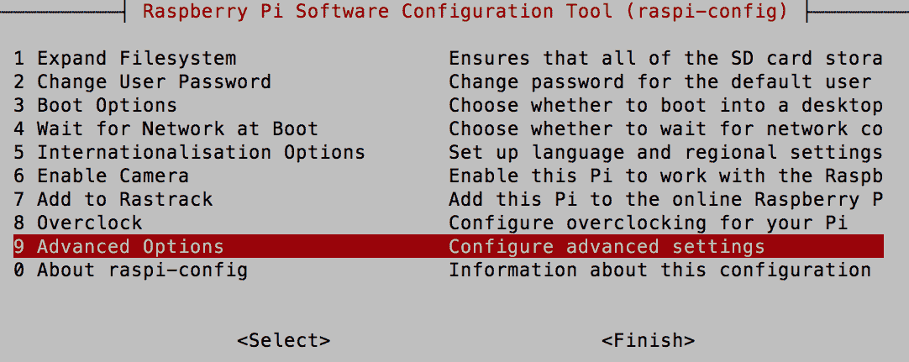
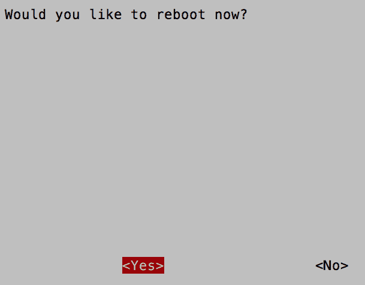
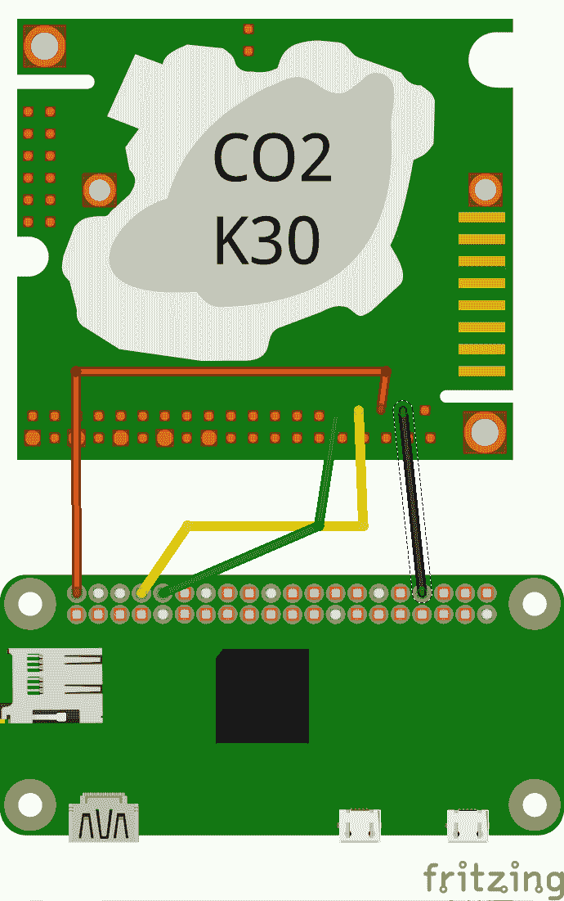
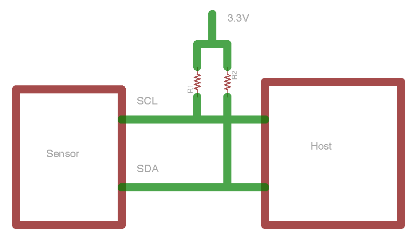
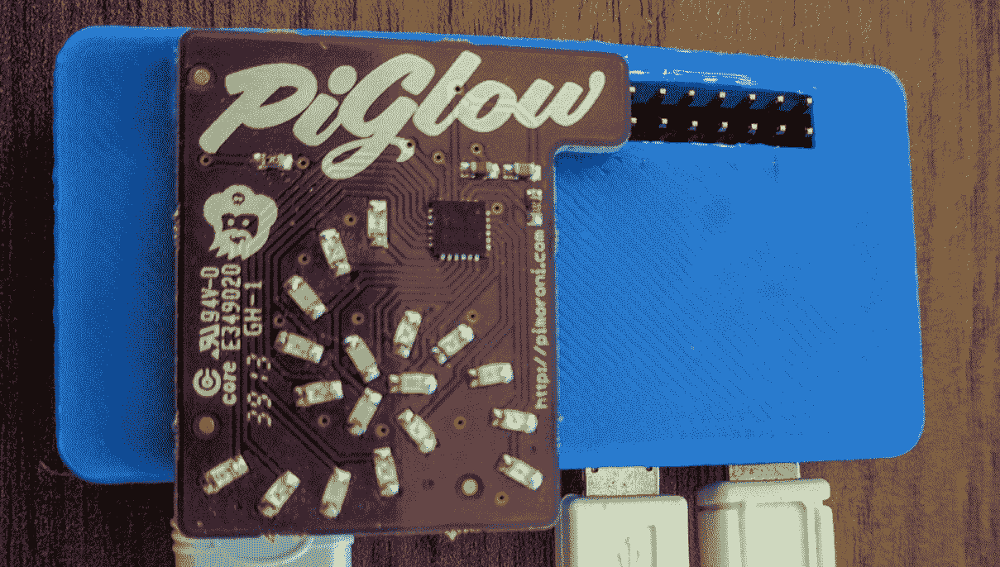
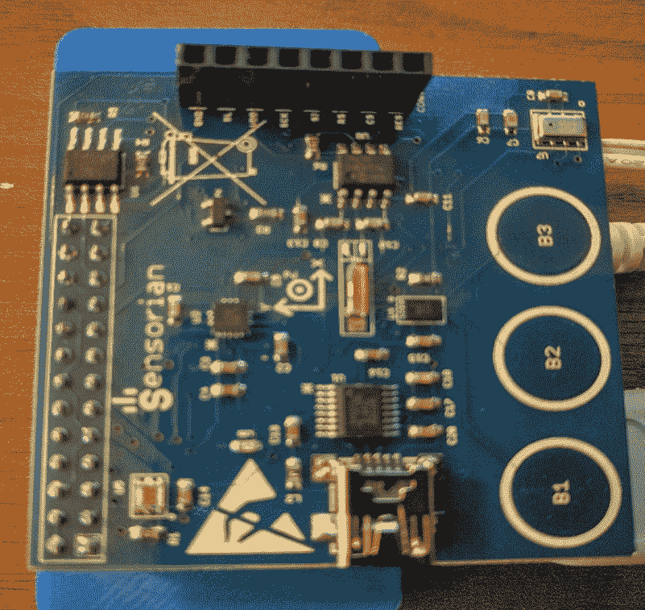

# 十二、通信接口

到目前为止，我们已经讨论了 Python 中的循环、条件语句和函数。我们还讨论了接口输出设备和简单的数字输入设备。

在本章中，我们将讨论以下通信接口：

*   UART–串行端口
*   串行外围接口
*   I<sup>2</sup>C 接口

We will be making use of different sensors/electronic components to demonstrate writing code in Python for these interfaces. We leave it up to you to pick a component of your choice to explore these communication interfaces.

# UART–串行端口

**通用异步收发器**（**UART**是一个串行端口，是一个通信接口，其中数据以位的形式从传感器串行传输到主机。使用串行端口是最古老的通信协议形式之一。它用于数据记录，微控制器从传感器收集数据并通过串行端口传输数据。还有一些传感器通过串行通信传输数据，作为对输入命令的响应。

我们将不讨论串行端口通信背后的理论（在[网站上有很多理论可用）https://en.wikipedia.org/wiki/Universal_asynchronous_receiver/transmitter](https://en.wikipedia.org/wiki/Universal_asynchronous_receiver/transmitter) ）。我们将讨论如何使用串口将不同的传感器与 Raspberry Pi 接口。

# Raspberry Pi Zero 的 UART 端口

通常，UART 端口由接收和发送数据的接收器（*Rx*和发射器（*Tx*引脚）组成。Raspberry Pi 的 GPIO 头带有 UART 端口。GPIO 引脚 14（即*Tx*引脚）和 15（即*Rx*引脚）用作 Raspberry Pi 的 UART 端口：


GPIO pins 14 and 15 are the UART pins (image source: https://www.rs-online.com/designspark/introducing-the-raspberry-pi-b-plus)

# 设置 Raspberry Pi 零串行端口

为了使用串行端口与传感器通信，需要禁用串行端口登录/控制台。在**Raspbian**操作系统映像中，这是默认启用的，因为它可以轻松调试。

可通过`raspi-config`禁用串口登录：

1.  启动终端并运行以下命令：

```py
       sudo raspi-config
```

2.  从`raspi-config`主菜单中选择高级选项：



Select Advanced Options from the raspi-config menu

3.  从下拉菜单中选择 A8 串行选项：


Select A8 Serial from the dropdown

4.  禁用串行登录：


Disable serial login

5.  完成配置并在结束时重新启动：



Save config and reboot

# 示例 1–将二氧化碳传感器连接到树莓 Pi

我们将使用 K30 二氧化碳传感器（其文档可在此处获取，[http://co2meters.com/Documentation/Datasheets/DS30-01%20-%20K30.pdf](http://co2meters.com/Documentation/Datasheets/DS30-01%20-%20K30.pdf)。它的范围为 0-10000 ppm，传感器通过串行端口向其提供二氧化碳浓度读数，作为对来自 Raspberry Pi 的某些命令的响应。

下图显示了树莓 Pi 和 K30 二氧化碳传感器之间的连接：



K30 carbon dioxide sensor interfaced with the Raspberry Pi

传感器的接收器（*Rx*引脚连接到 Raspberry Pi Zero 的发射器（*Tx*-**GPIO 14（UART_TXD）**引脚（上图中的黄线）。传感器的发射器（*Tx*引脚连接到树莓 Pi 零点（上图中的绿色线）的接收器（*Rx*-**GPIO 15（UART_RXD）**引脚）。

为了给传感器供电，将传感器的 G+引脚（上图中的红线）连接到RespberryPi零点的**5V**引脚。传感器的 G0 引脚连接到 Raspberry Pi Zero 的**GND**引脚（上图中的黑线）。

通常，通过指定波特率、帧中的位数、停止位和流量控制来启动串行端口通信。

# 用于串行端口通信的 Python 代码

我们将使用**pySerial**库（[https://pyserial.readthedocs.io/en/latest/shortintro.html#opening-用于连接二氧化碳传感器的串行端口](https://pyserial.readthedocs.io/en/latest/shortintro.html#opening-serial-ports)：

1.  根据传感器文档，可以通过以 9600 波特率、无奇偶校验、8 位和 1 位停止位启动串行端口来读取传感器输出。GPIO 串口为`ttyAMA0`。与传感器接口的第一步是启动串行端口通信：

```py
       import serial 
       ser = serial.Serial("/dev/ttyAMA0")
```

2.  根据传感器文件（[http://co2meters.com/Documentation/Other/SenseAirCommGuide.zip](http://co2meters.com/Documentation/Other/SenseAirCommGuide.zip) ），传感器响应以下二氧化碳浓度命令：


Command to read carbon dioxide concentration from the sensor-borrowed from the sensor datasheet

3.  该命令可按如下方式传输至传感器：

```py
       ser.write(bytearray([0xFE, 0x44, 0x00, 0x08, 0x02, 0x9F, 0x25]))
```

4.  传感器响应为 7 字节响应，可读取如下内容：

```py
       resp = ser.read(7)
```

5.  传感器的响应采用以下格式：


Carbon dioxide sensor response

6.  根据数据表，传感器数据大小为 2 字节。每个字节可用于存储 0 和 255 的值。两个字节可用于存储高达 65535（255*255）的值。二氧化碳浓度可根据以下信息计算：

```py
       high = resp[3] 
       low = resp[4] 
       co2 = (high*256) + low
```

7.  总而言之：

```py
       import serial 
       import time 
       import array 
       ser = serial.Serial("/dev/ttyAMA0") 
       print("Serial Connected!") 
       ser.flushInput() 
       time.sleep(1) 

       while True: 
           ser.write(bytearray([0xFE, 0x44, 0x00, 0x08,
           0x02, 0x9F, 0x25])) 
           # wait for sensor to respond 
           time.sleep(.01) 
           resp = ser.read(7) 
           high = resp[3] 
           low = resp[4] 
           co2 = (high*256) + low 
           print() 
           print() 
           print("Co2 = " + str(co2)) 
           time.sleep(1)
```

8.  将代码保存到文件并尝试执行它。

# I2C 通信

**集成电路**（**I<sup>2</sup>C**通信是一种串行通信，允许将多个传感器连接到计算机。I<sup>2</sup>C 通信由时钟和数据线两条线组成。用于 I<sup>2</sup>C 通信的 Raspberry Pi Zero 时钟和数据管脚分别为**GPIO 3**（**SCL**）和**GPIO 2**（**SDA**）。为了通过同一总线与多个传感器进行通信，通过 I<sup>2</sup>C 协议进行通信的传感器/执行器通常通过其 7 位地址进行寻址。在同一 I<sup>2</sup>C 总线上，可能有两个或多个 Raspberry Pi 板与同一传感器通信。这使得围绕 Raspberry Pi 构建传感器网络成为可能。

I<sup>2</sup>C 通信线路为明沟线路；因此，它们使用电阻器上拉，如下图所示：



I<sup>2</sup>C setup

让我们用一个例子来回顾 I<sup>2</sup>C 通信的一个例子。

# 示例 2–PiGlow

**PiGlow**是树莓 Pi 的一个附加硬件，由 18 个 LED 组成，与**SN3218**芯片接口。该芯片允许通过 I<sup>2</sup>C 接口控制 LED。芯片的 7 位地址为`0x54`。

**SCL**引脚连接**GPIO 3**与**SDA**引脚连接**GPIO 2**与附加硬件接口；接地插脚和电源插脚分别连接到附加硬件的对应部分。

PiGlow 附带了一个库，该库对 I<sup>2</sup>C 通信进行了抽象：[https://github.com/pimoroni/piglow](https://github.com/pimoroni/piglow) 。

尽管库是库的 I<sup>2</sup>C 接口的包装器，但我们建议阅读代码以了解操作 LED 的内部机制：



PiGlow stacked on top of the Raspberry Pi

# 安装库

可通过从命令行终端运行以下命令来安装 PiGlow 库：

```py
    curl get.pimoroni.com/piglow | bash
```

# 实例

安装完成后，切换到示例文件夹（`/home/pi/Pimoroni/piglow`并运行其中一个示例：

```py
    python3 bar.py
```

应该运行*闪烁*灯光效果，如下图所示：


Blinky lights on the PiGlow

类似地，还有一些库可以使用 I<sup>2</sup>C 通信与实时时钟、LCD 显示器等进行通信。如果您有兴趣编写自己的界面，提供 I<sup>2</sup>C 与传感器/输出设备通信的细节，请查看本书附带的网站以获取一些示例。

# 示例 3–Raspberry Pi 的传感器附加硬件

**传感器**是为树莓 Pi 设计的附加硬件。这种附加硬件配备了不同类型的传感器，包括光传感器、气压计、加速计、LCD 显示接口、闪存、电容式触摸传感器和实时时钟。

此附加硬件上的传感器足以使用本章中讨论的所有通信接口进行学习：



Sensorian hardware stacked on top of the Raspberry Pi Zero

在本节中，我们将讨论一个示例，在该示例中，我们将通过 I<sup>2</sup>C 接口使用RespberryPi零点测量环境光照水平。附加硬件板上的传感器为**APDS-9300**传感器（[www.avagotech.com/docs/AV02-1077EN](http://www.avagotech.com/docs/AV02-1077EN)。

# lux 传感器的 I2C 驱动器

可从 GitHub 存储库获取传感器硬件的驱动程序（[https://github.com/sensorian/sensorian-firmware.git](https://github.com/sensorian/sensorian-firmware.git) ）。让我们从命令行终端克隆存储库：

```py
    git clone https://github.com/sensorian/sensorian-firmware.git 
```

让我们利用驱动程序（可在` ~/sensorian-firmware/Drivers_Python/APDS-9300`文件夹中找到）从传感器的两个 ADC 通道读取值：

```py
import time 
import APDS9300 as LuxSens 
import sys 

AmbientLight = LuxSens.APDS9300() 
while True: 
   time.sleep(1) 
   channel1 = AmbientLight.readChannel(1)                       
   channel2 = AmbientLight.readChannel(0) 
   Lux = AmbientLight.getLuxLevel(channel1,channel2) 
   print("Lux output: %d." % Lux)
```

利用两个通道的 ADC 值，驾驶员可以使用以下公式（从传感器数据表中检索）计算环境光值：


Ambient light levels calculated using the ADC values

此计算由属性`getLuxLevel`执行。在正常照明条件下，环境光照水平（以勒克斯为单位）约为`2`。当我们用手掌覆盖勒克斯传感器时，测量的输出为`0`。该传感器可用于测量环境光照并相应地调整房间照明。

# 挑战

我们讨论了使用 lux 传感器测量环境光照水平。我们如何利用勒克斯输出（环境光照度）来控制房间照明？

# SPI 接口

还有一种串行通信接口称为**串行外围接口**（**SPI**）。此接口必须通过`raspi-config`启用（类似于本章前面启用串口接口）。SPI 接口的使用类似于 I<sup>2</sup>C 接口和串口。

通常，SPI 接口由时钟线、数据输入、数据输出和**从选择**（**SS**线）组成。与 I<sup>2</sup>C 通信（我们可以连接多个主设备）不同，在同一总线上只能有一个主设备（Raspberry Pi Zero），但有多个从设备。当有多个传感器连接到同一总线时，**SS**引脚允许选择一个特定的传感器，该传感器表示 Raspberry Pi Zero 正在读取/写入数据。

# 示例 4–写入外部存储器芯片

让我们回顾一个示例，其中我们通过 SPI 接口写入传感器附加硬件上的闪存芯片。SPI 接口和内存芯片的驱动程序可从同一 GitHub 存储库中获得。

既然我们已经下载了驱动程序，让我们回顾一下驱动程序的一个示例：

```py
import sys 
import time   
import S25FL204K as Memory
```

让我们初始化并将消息`hello`写入内存：

```py
Flash_memory = Memory.S25FL204K() 
Flash_memory.writeStatusRegister(0x00) 
message = "hello" 
flash_memory.writeArray(0x000000,list(message), message.len())
```

现在，让我们尝试读取刚刚写入外部内存的数据：

```py
data = flash_memory.readArray(0x000000, message.len()) 
print("Data Read from memory: ") 
print(''.join(data))
```

代码示例可随本章下载（`memory_test.py`。

我们能够演示如何使用 SPI 读/写外部存储芯片。

# 对读者的挑战

在这里的图中，有一个 LED 条（[https://www.adafruit.com/product/306](https://www.adafruit.com/product/306) 使用 Adafruit Cobbler（[连接到覆盆子 Pi 附加硬件的 SPI 接口 https://www.adafruit.com/product/914](https://www.adafruit.com/product/914) ）。我们提供了如何将 LED 条连接到 Raspberry Pi Zero 的线索。我们想看看您是否能够自己找到连接 LED 条的解决方案。有关答案，请参阅本书的网站。


LED strip interfaced with the Adafruit Cobbler for the Raspberry Pi Zero

# 总结

在本章中，我们讨论了 Raspberry Pi Zero 上可用的不同通信接口。这些接口包括 I<sup>2</sup>C、SPI 和 UART。我们将在最终项目中使用这些接口。我们使用二氧化碳传感器、LED 驱动器和传感器平台讨论了这些接口。在下一章中，我们将讨论面向对象编程及其独特的优势。我们将通过一个例子讨论面向对象编程的必要性。面向对象编程在需要编写自己的驱动程序来控制机器人组件或编写传感器接口库的情况下尤其有用。