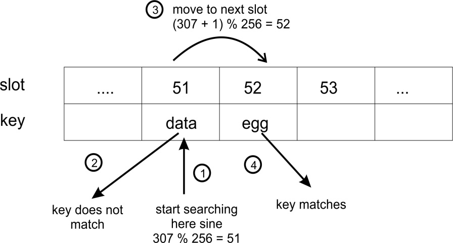
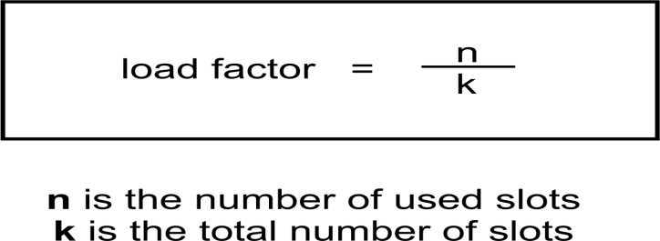
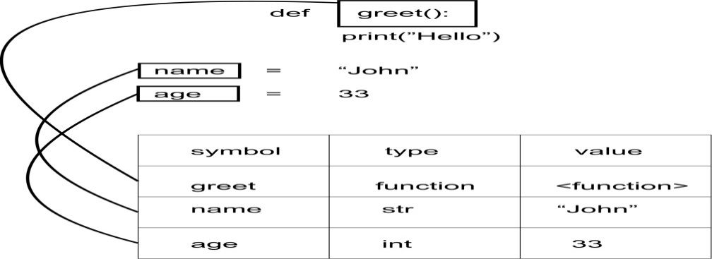

# 哈希表和符号表

我们之前已经研究过列表，其中项目按顺序存储并按索引号访问。索引数字对计算机很有效。它们是整数，因此运算速度快，易于操作。然而，他们并不总是为我们工作得那么好。例如，如果我们有一个地址簿条目，索引号是 56，那么这个数字告诉我们的并不多。没有任何东西可以将特定联系人与号码 56 联系起来。它恰好是列表中的下一个可用位置。

在本章中，我们将看到一个类似的结构：字典。字典使用关键字而不是索引号。因此，如果该联系人被称为*詹姆斯*，我们可能会使用关键字*詹姆斯*来定位该联系人。也就是说，我们不会通过呼叫*联系人【56】*来访问联系人，而是使用*联系人[“詹姆斯”]【T7]。*

字典通常使用哈希表构建。顾名思义，哈希表依赖于一个称为**哈希**的概念。这就是我们要开始讨论的地方。

本章将介绍以下主题：

*   散列
*   哈希表
*   元素的不同功能

# 散列

哈希是将任意大小的数据转换为固定大小数据的概念。更具体地说，我们将使用它将字符串（或其他数据类型）转换为整数。这听起来可能比实际情况更复杂，所以让我们看一个例子。我们想要散列表达式`hello world`，也就是说，我们想要得到一个数值，我们可以说*代表*字符串。

通过使用`ord()`函数，我们可以得到任意字符的序数值。例如，`ord('f')`函数给出 102。要获得整个字符串的哈希值，我们可以对字符串中每个字符的序号求和：

```py
>>> sum(map(ord, 'hello world'))
1116
```


这个很好用。但是，请注意，我们可以更改字符串中字符的顺序并获得相同的哈希：

```py
>>> sum(map(ord, 'world hello'))
1116
```

对于字符串`gello xorld`，字符的序数值之和也相同，因为`g`的序数值比`h`的序数值小一个，而 x 的序数值比`w`的序数值大一个，因此：

```py
>>> sum(map(ord, 'gello xorld'))
1116
```


# 完美散列函数

一个完美的散列函数是每个字符串（因为我们现在只讨论字符串）都保证是唯一的。实际上，散列函数通常需要非常快，因此尝试创建一个函数，为每个字符串提供一个唯一的散列值通常是不可能的。相反，我们有时会遇到冲突（两个或多个字符串具有相同的哈希值），当这种情况发生时，我们会想出解决冲突的策略。

同时，我们至少可以想出一种方法来避免一些碰撞。例如，我们可以添加一个乘数，使每个字符的哈希值成为乘数值，乘以字符的序数值。然后，当我们遍历字符串时，乘数会增加。这在以下功能中显示：

```py
    def myhash(s): 
        mult = 1 
        hv = 0 
        for ch in s: 
            hv += mult * ord(ch) 
            mult += 1 
        return hv 
```

我们可以在前面使用的字符串上测试此函数：

```py
    for item in ('hello world', 'world hello', 'gello xorld'): 
        print("{}: {}".format(item, myhash(item))) 
```

运行该程序，我们得到以下输出：

```py
% python hashtest.py

hello world: 6736
world hello: 6616
gello xorld: 6742
```


请注意，最后一行是将第 2 行和第 3 行中的值相乘的结果，例如，104 x 1 等于 104。

这一次，我们得到了不同的字符串哈希值。当然，这并不意味着我们有一个完美的散列。让我们尝试一下字符串`ad`和`ga`：

```py
% python hashtest.py 
ad: 297
ga: 297
```

在这里，我们仍然会得到两个不同字符串的相同哈希值。正如我们之前所说，这不一定是个问题，但我们需要设计一种解决碰撞的策略。我们将很快了解这一点，但首先我们将研究哈希表的实现。

# 哈希表

**哈希表**是一种列表形式，其中元素通过关键字而不是索引号进行访问。至少，客户机代码会这样看待它。在内部，它将使用我们的哈希函数的一个稍微修改的版本，以便找到应该插入元素的索引位置。这为我们提供了快速查找，因为我们使用的索引号对应于密钥的散列值。

我们首先创建一个类来保存哈希表项。它们需要有一个键和一个值，因为我们的哈希表是一个键值存储：

```py
    class HashItem: 
        def __init__(self, key, value): 
            self.key = key 
            self.value = value 
```

这为我们提供了一种非常简单的存储项目的方法。接下来，我们开始处理哈希表类本身。像往常一样，我们从一个构造函数开始：

```py
    class HashTable: 
        def __init__(self): 
            self.size = 256 
            self.slots = [None for i in range(self.size)] 
            self.count = 0 
```

哈希表使用标准 Python 列表存储其元素。我们同样可以使用我们以前开发的链表，但现在我们的重点是理解哈希表，所以我们将使用我们可以使用的内容。

我们首先将哈希表的大小设置为 256 个元素。稍后，我们将在开始填充表格时研究如何增加表格的策略。现在我们初始化一个包含 256 个元素的列表。这些元素通常被称为槽或桶。最后，我们为实际哈希表元素的数量添加一个计数器：


注意表的大小和计数之间的差异很重要。表的大小是指表中插槽的总数（已使用或未使用）。另一方面，表的计数只是指被填充的槽的数量，或者换句话说，就是我们添加到表中的实际键值对的数量。

现在，我们将把散列函数添加到表中。它与我们在散列函数一节中所讨论的内容类似，但有一点不同：我们需要确保散列函数返回的值介于 1 和 256（表的大小）之间。这样做的一个好方法是返回哈希除以表大小的余数，因为余数总是介于 0 和 255 之间的整数值。

由于散列函数只能在类内部使用，因此我们在名称的开头放了一个下划线（`_`，以表示这一点。这是一个普通的 Python 约定，用于指示某些内容是供内部使用的：

```py
    def _hash(self, key): 
        mult = 1 
        hv = 0 
        for ch in key: 
            hv += mult * ord(ch) 
            mult += 1 
        return hv % self.size 
```

目前，我们假设键是字符串。稍后我们将讨论如何使用非字符串键。现在，请记住，`_hash()`函数将生成字符串的哈希值。

# 推杆元件

我们使用`put()`函数向散列中添加元素，并使用`get()`函数进行检索。首先，我们来看一下`put()`函数的实现。我们首先将密钥和值嵌入到`HashItem`类中，并计算密钥的哈希值：

```py
    def put(self, key, value): 
        item = HashItem(key, value) 
        h = self._hash(key) 
```

现在我们需要找到一个空插槽。我们从对应于密钥哈希值的插槽开始。如果那个插槽是空的，我们就在那里插入我们的项目。

但是，如果插槽不是空的，并且项目的键与当前键不同，则会发生冲突。这就是我们需要找到处理冲突的方法的地方。我们要做的是，在之前的散列值上加上一个，然后得到这个值除以散列表大小的剩余值。这是解决碰撞的线性方法，非常简单：


```py
    while self.slots[h] is not None: 
        if self.slots[h].key is key: 
            break 
        h = (h + 1) % self.size 
```

我们找到了插入点。如果这是一个新元素（即之前包含了`None`，那么我们将计数增加 1。最后，我们将项目插入列表中所需的位置：

```py
    if self.slots[h] is None: 
        self.count += 1 
    self.slots[h] = item  
```

# 获取元素

`get()`方法的实现应该返回与键对应的值。我们还必须决定在表中不存在键的情况下要做什么。我们首先计算密钥的散列：

```py
    def get(self, key): 
        h = self._hash(key)
```

现在，我们只需在列表中查找包含我们正在搜索的键的元素，从包含传入键的哈希值的元素开始。如果当前元素不是正确的元素，那么，就像在`put()`方法中一样，我们在前一个散列值中添加一个元素，并得到该值除以列表大小的剩余值。这成为我们的新索引。如果我们找到一个包含`None`的元素，我们将停止查找。如果找到密钥，则返回值：



```py
        while self.slots[h] is not None: 
            if self.slots[h].key is key: 
                return self.slots[h].value 
            h = (h+ 1) % self.size 
```

最后，我们决定如果在表中找不到键该怎么办。在这里我们将选择返回`None`。另一个好的选择可能是提出一个例外：

```py
        return None 
```

# 测试哈希表

为了测试我们的哈希表，我们创建一个`HashTable`，在其中放入一些元素，然后尝试检索这些元素。我们还将尝试`get()`一个不存在的密钥。还记得我们的散列函数返回相同散列值的两个字符串 ad 和 ga 吗？为了更好地衡量，我们也加入了这些因素，只是为了确保冲突得到妥善解决：

```py
    ht = HashTable() 
    ht.put("good", "eggs") 
    ht.put("better", "ham") 
    ht.put("best", "spam") 
    ht.put("ad", "do not") 
    ht.put("ga", "collide") 

    for key in ("good", "better", "best", "worst", "ad", "ga"): 
        v = ht.get(key) 
        print(v) 
```

运行此命令将返回以下内容：

```py
% python hashtable.py 
eggs
ham
spam
None
do not
collide  
```

如您所见，由于密钥不存在，因此查找密钥最差返回`None`。键`ad`和`ga`也会返回它们相应的值，表明它们之间的冲突已被处理。

# 将[]与哈希表一起使用

然而，使用`put()`和`get()`方法看起来不是很好。我们希望能够将哈希表视为一个列表，也就是说，我们希望能够使用`ht["good"]`而不是`ht.get("good")`。使用特殊方法`__setitem__()`和`__getitem__()`可以轻松实现这一点：

```py
    def __setitem__(self, key, value): 
        self.put(key, value) 

    def __getitem__(self, key): 
        return self.get(key) 
```

我们的测试代码现在可以如下所示：

```py
    ht = HashTable() 
    ht["good"] = "eggs" 
    ht["better"] = "ham" 
    ht["best"] = "spam" 
    ht["ad"] = "do not" 
    ht["ga"] = "collide" 

    for key in ("good", "better", "best", "worst", "ad", "ga"): 
        v = ht[key] 
        print(v) 

    print("The number of elements is: {}".format(ht.count)) 
```

请注意，我们还打印哈希表中的元素数。这对我们的下一次讨论很有用。

# 非字符串键

在大多数情况下，仅使用字符串作为键更有意义。但是，如果需要，您可以使用任何其他 Python 类型。如果您创建了自己的类，希望将其用作键，那么您可能希望覆盖该类的特殊`__hash__()`函数，以便获得可靠的哈希值。

请注意，您仍然需要计算哈希值的模（%）和哈希表的大小才能获得插槽。该计算应该发生在哈希表中，而不是键类中，因为表知道自己的大小（键类不应该知道它所属的表的任何信息）。

# 生成哈希表

在我们的示例中，哈希表的大小设置为 256。显然，当我们向列表中添加元素时，我们开始填满空的插槽。在某个时刻，所有的插槽都将被填满，桌子也将被填满。为了避免这种情况，我们可以在桌子满的时候增加桌子的面积。

为此，我们比较大小和计数。还记得`size`包含插槽总数，而`count`包含元素的插槽数量吗？好吧，如果`count`等于`size`，那么我们已经填好了表格。

哈希表的负载因子为我们提供了可用插槽中有多大一部分被使用的指示。其定义如下：



当负载因子接近 1 时，我们需要增加表的大小。事实上，我们应该在它到达之前做，以避免它变得太慢。值 0.75 可能是一个很好的表增长值。

下一个问题是表格增长多少。一个策略是简单地将表的大小增加一倍。

# 公开寻址

我们在示例中使用的冲突解决机制，线性探测，是开放寻址策略的一个示例。线性探测非常简单，因为我们在探测之间使用固定的间隔。还有其他的开放寻址策略，但它们都有一个相同的想法，即存在一系列插槽。当我们想插入一个密钥时，我们会检查插槽是否已经有一个项。如果有，我们将寻找下一个可用插槽。

如果我们有一个包含 256 个插槽的哈希表，那么 256 是该哈希表中的最大元素数。此外，随着荷载系数的增加，找到新元素的插入点所需的时间也会延长。

由于这些限制，我们可能更愿意使用不同的策略来解决冲突，例如链接。

# 锁链

链接是一种解决冲突和避免哈希表中元素数量限制的策略。在链接中，哈希表中的插槽用空列表初始化：


插入元素时，它将被追加到与该元素的哈希值对应的列表中。也就是说，如果有两个元素都具有哈希值 1167，则这两个元素都将添加到哈希表插槽 1167 中的列表中：


上图显示了哈希值为 51 的条目列表。

然后，链接通过允许多个元素具有相同的哈希值来避免冲突。它还避免了随着负载因子的增加而出现的插入问题，因为我们不必寻找插槽。此外，哈希表可以容纳比可用插槽数量更多的值，因为每个插槽都包含一个可以增长的列表。

当然，如果一个特定的槽有许多项，搜索它们可能会非常慢，因为我们必须在列表中进行线性搜索，直到找到具有所需键的元素。这可能会降低检索速度，这是不好的，因为哈希表意味着高效：


上图演示了通过列表项进行线性搜索，直到找到匹配项为止。

我们可以使用另一种允许快速搜索的结构，而不是在表槽中使用列表。我们已经看过了**二叉搜索树**（**BSTs**）。我们可以简单地在每个插槽中放置一个（最初为空）BST：


插槽 51 包含一个 BST，我们在其中搜索密钥。但我们仍然会有一个潜在的问题：根据项目添加到 BST 的顺序，我们最终可能会得到一个与列表一样低效的搜索树。也就是说，树中的每个节点正好有一个子节点。为了避免这种情况，我们需要确保我们的 BST 是自我平衡的。

# 符号表

编译器和解释器使用符号表来跟踪已声明的符号及其相关信息。符号表通常使用哈希表构建，因为有效地检索表中的符号非常重要。

让我们看一个例子。假设我们有以下 Python 代码：

```py
    name = "Joe" 
    age = 27 
```

这里我们有两个符号，名字和年龄。它们属于一个名称空间，可以是`__main__`，但如果您将模块放在那里，它也可以是模块的名称。每个符号都有一个值；name 的值为`Joe`，age 的值为`27`。符号表允许编译器或解释器查找这些值。符号名称和年龄成为哈希表中的键。与之关联的所有其他信息（如值）将成为符号表条目值的一部分。

不仅变量是符号，函数和类也是符号。它们都将添加到我们的符号表中，以便在需要访问其中任何一个时，可以从符号表中访问它们：



在 Python 中，加载的每个模块都有自己的符号表。符号表给出了该模块的名称。这样，模块就充当名称空间。我们可以有多个称为年龄的符号，只要它们存在于不同的符号表中。要访问其中一个，我们可以通过相应的符号表进行访问：


# 总结

在本章中，我们研究了哈希表。我们研究了如何编写散列函数将字符串数据转换为整数数据。然后我们研究了如何使用散列键快速有效地查找与键对应的值。

我们还注意到散列函数不是完美的，几个字符串可能最终具有相同的散列值。这使我们开始研究冲突解决策略。

我们研究了如何增长哈希表，以及如何查看表的负载因子，以便准确地确定何时增长哈希表。

在本章的最后一节中，我们研究了符号表，它通常是使用哈希表构建的。符号表允许编译器或解释器查找已定义的符号（变量、函数、类等），并检索有关该符号的所有信息。

在下一章中，我们将讨论图和其他算法。