# 分类

每当收集到数据时，就有必要对数据进行排序。排序操作对于所有数据集都是通用的，可以是名称、电话号码或简单待办事项列表上的项目的集合。

在本章中，我们将研究几种排序技术，包括以下内容：

*   气泡排序
*   插入排序
*   选择排序
*   快速排序
*   堆排序

在处理这些排序算法时，我们将考虑它们的渐近行为。有些算法相对容易开发，但性能可能较差。其他编写起来有点复杂的算法将显示出令人印象深刻的性能。

排序后，对项目集合执行搜索操作变得更加容易。我们将从最简单的排序算法——冒泡排序算法开始。

# 排序算法

在本章中，我们将介绍一些排序算法，这些算法的实现难度各不相同。排序算法根据它们的内存使用情况、复杂性、递归、是否基于比较以及其他考虑因素进行分类。

一些算法使用更多的 CPU 周期，因此具有不好的渐近值。其他人在对一些值进行排序时，会消耗更多的内存和其他计算资源。另一个需要考虑的问题是排序算法如何适合递归或迭代表达，或者两者兼而有之。有一些算法使用比较作为元素排序的基础。冒泡排序算法就是一个例子。非比较排序算法的示例有巴克排序和鸽子洞排序。

# 气泡排序

气泡排序算法背后的思想非常简单。给定一个无序列表，我们比较列表中相邻的元素，每次按正确的数量级，只比较两个元素。算法取决于交换过程。

以仅包含两个元素的列表为例：

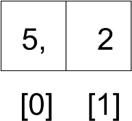

要对该列表进行排序，只需使用**2**占用索引**0**和**5**占用索引**1**将它们交换到正确的位置即可。为了有效地交换这些元素，我们需要有一个临时存储区：

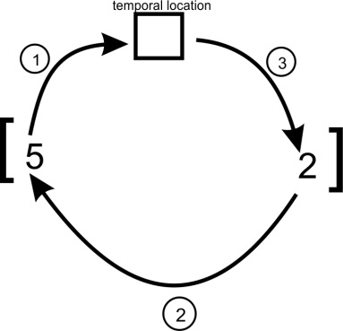

气泡排序算法的实现从交换方法开始，如上图所示。首先，元素**5**将被复制到临时位置`temp`。然后将元素**2**移动到索引**0**。最后，**5**将从 temp 移动到索引**1**。最后，这些元素将被交换。该列表现在将包含元素：`[2, 5]`。如果`unordered_list[j]`的元素顺序不正确，下面的代码会将其与`unordered_list[j+1]`交换：

```py
    temp = unordered_list[j] 
    unordered_list[j] = unordered_list[j+1] 
    unordered_list[j+1] = temp 
```

既然我们已经能够交换一个两元素数组，那么使用同样的方法对整个列表进行排序应该很简单。

我们将在双嵌套循环中运行此交换操作。内部循环如下所示：

```py
    for j in range(iteration_number): 
        if unordered_list[j] > unordered_list[j+1]: 
            temp = unordered_list[j] 
            unordered_list[j] = unordered_list[j+1] 
            unordered_list[j+1] = temp 
```

在实现冒泡排序算法时，知道要交换多少次很重要。要对数字列表（如`[3, 2, 1]`）进行排序，我们最多需要交换两次元素。这等于列表的长度减去 1，`iteration_number = len(unordered_list)-1`。我们减去`1`，因为它给出了要运行的最大迭代次数：

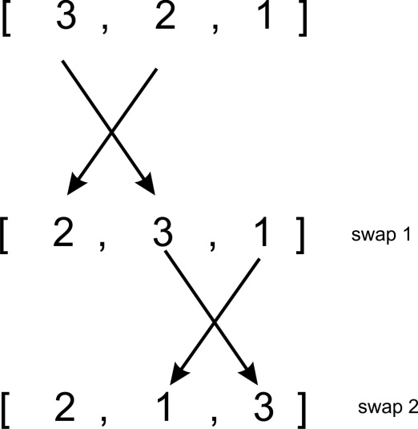

通过在两次迭代中交换相邻元素，最大数量的元素最终位于列表的最后一个位置。

`if`语句确保，如果两个相邻元素的顺序已经正确，则不会发生不必要的交换。内部`for`循环只会导致相邻元素的交换在我们的列表中发生两次。

但是，您会意识到，第一次运行`for`循环并不能完全对列表进行排序。为了对整个列表进行排序，此交换操作必须进行多少次？如果我们多次重复交换相邻元素的整个过程，列表将被排序。外部循环用于实现这一点。交换列表中的元素会产生以下动态：

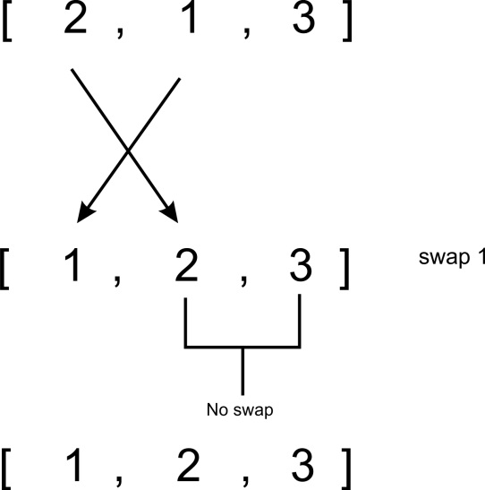

我们认识到，要对列表进行排序，最多需要进行四次比较。因此，内部和外部循环都必须运行`len(unordered_list)-1`次才能对所有元素进行排序：

```py
iteration_number = len(unordered_list)-1 
    for i in range(iteration_number): 
        for j in range(iteration_number): 
            if unordered_list[j] > unordered_list[j+1]: 
                temp = unordered_list[j] 
                unordered_list[j] = unordered_list[j+1] 
                unordered_list[j+1] = temp
```

即使列表包含许多元素，也会使用相同的原则。冒泡排序也有很多变体，可以最大限度地减少迭代和比较的次数。

气泡排序是一种效率极低的排序算法，其时间复杂度为`O(n2)`，最佳情况为`O(n)`。通常，冒泡排序算法不应用于对大型列表进行排序。然而，在相对较小的列表上，它的性能相当好。

有一种冒泡排序算法的变体，如果内部循环中没有比较，我们只需退出整个排序过程。不需要交换内部循环中的元素，这表明列表已经排序。在某种程度上，这有助于加速通常认为缓慢的算法。

# 插入排序

交换相邻元素以对项目列表进行排序的想法也可用于实现插入排序。在插入排序算法中，我们假设列表的某一部分已经排序，而另一部分仍然未排序。根据这个假设，我们将遍历列表中未排序的部分，一次选取一个元素。使用这个元素，我们遍历列表的排序部分，并按正确的顺序插入它，以便列表的排序部分保持排序。这是很多语法。让我们用一个例子来解释一下。

考虑下面的数组：

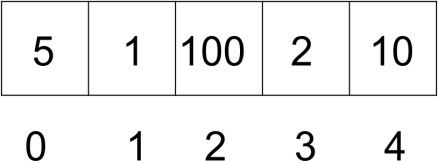

该算法首先使用一个`for`循环在索引**1**和**4**之间运行。我们从索引**1**开始，因为我们假设索引**0**的子数组已经处于排序顺序：


在循环开始执行时，我们有以下内容：

```py
    for index in range(1, len(unsorted_list)): 
        search_index = index 
        insert_value = unsorted_list[index] 
```

在`for`循环每次运行开始时，`unsorted_list[index]`处的元素存储在`insert_value`变量中。稍后，当我们在列表的排序部分找到适当的位置时，`insert_value`将存储在该索引或位置：

```py
    for index in range(1, len(unsorted_list)): 
        search_index = index 
        insert_value = unsorted_list[index] 

        while search_index > 0 and unsorted_list[search_index-1] >     
              insert_value : 
            unsorted_list[search_index] = unsorted_list[search_index-1] 
            search_index -= 1 

        unsorted_list[search_index] = insert_value 
```

`search_index`用于向`while`循环提供信息——准确地找到需要插入列表排序部分的下一个元素的位置。

`while`循环在两个条件的引导下向后遍历列表：首先，如果`search_index > 0`，则表示列表的排序部分有更多的元素；其次，要运行`while`循环，`unsorted_list[search_index-1]`必须大于`insert_value`。`unsorted_list[search_index-1]`阵列将执行以下任一操作：

*   在第一次执行`while`循环之前，指向`unsorted_list[search_index]`前面的元素
*   第一次运行`while`循环后，指向`unsorted_list[search_index-1]`之前的一个元素

在我们的列表示例中，`while`循环将被执行，因为`5 > 1`。在 while 循环的主体中，`unsorted_list[search_index-1]`处的元素存储在`unsorted_list[search_index]`处。`search_index -= 1`向后移动列表遍历，直到其具有值`0`。

我们的列表如下所示：


`while`循环退出后，`search_index`的最后一个已知位置（本例中为`0`）现在帮助我们知道插入`insert_value`的位置：

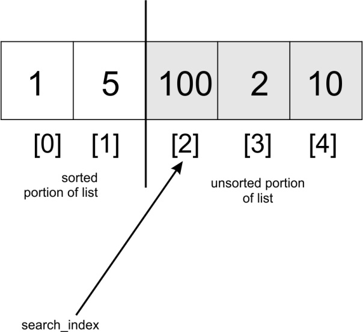

在`for`循环的第二次迭代中，`search_index`将具有值**2**，这是数组中第三个元素的索引。此时，我们从向左的方向开始比较（朝向索引**0**。**100**将与**5**进行比较，但由于**100**大于**5**，因此不会执行 while 循环。**100**将被自身替换，因为`search_index`变量从未递减。因此，`unsorted_list[search_index] = insert_value`将不起作用。

当`search_index`指向索引**3**时，我们比较**2**和**100**并将**100**移动到**2**的存储位置。然后我们比较**2**和**5**并将**5**移动到**100**最初存储的位置。此时，`while`循环将中断，**2**将存储在索引**1**中。数组将使用值`[1, 2, 5, 100, 10]`进行部分排序。

对于要排序的列表，上一步将最后执行一次。

插入排序算法被认为是稳定的，因为它不会改变具有相等键的元素的相对顺序。它也只需要不超过列表消耗的内存，因为它可以就地进行交换。

其最坏情况值为**O**（n<sup>2</sup>），最佳情况为**O**（n）。

# 选择排序

另一种流行的排序算法是选择排序。这种排序算法简单易懂，但效率也很低，其最坏和最佳渐近值分别为**O**（*n<sup>2</sup>*。它首先查找数组中的最小元素，并将其与数组索引[**0**处的数据交换。第二次进行相同的操作；但是，在找到第一个最小元素后，列表剩余部分中的最小元素将与索引[**1**处的数据交换。

为了更好地了解算法的工作原理，让我们对数字列表进行排序：


从索引**0**开始，我们搜索列表中存在于索引**1**和最后一个元素的索引之间的最小项。找到该元素后，将与索引**0**处找到的数据进行交换。我们只是重复这个过程，直到列表被排序。

搜索列表中最小的项目是一个增量过程：

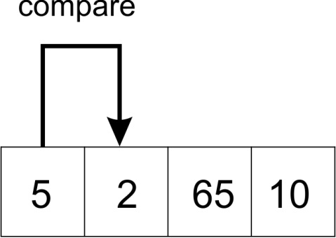

通过对元素**2**和**5**的比较，选择**2**作为两者中的较小者。这两个元素被交换。

交换操作后，阵列如下所示：


仍然在指标**0**下，我们比较**2**和**65**：


由于**65**大于**2**，所以两个元素不交换。将索引**0**处的元素**2**与索引**3**处的元素**10**进行进一步比较。没有交换发生。当我们到达列表中的最后一个元素时，我们将拥有占用索引**0**的最小元素。

一组新的比较将开始，但这次是从索引**1**开始。我们重复将存储在那里的元素与索引**2**到最后一个索引之间的所有元素进行比较的整个过程。

第二次迭代的第一步如下所示：

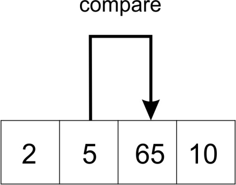

下面是选择排序算法的实现。函数的参数是我们希望按数量级升序排列的未排序项目列表：

```py
    def selection_sort(unsorted_list): 

        size_of_list = len(unsorted_list) 

        for i in range(size_of_list): 
            for j in range(i+1, size_of_list): 

                if unsorted_list[j] < unsorted_list[i]: 
                    temp = unsorted_list[i] 
                    unsorted_list[i] = unsorted_list[j] 
                    unsorted_list[j] = temp 
```

该算法首先使用外部`for`循环遍历列表`size_of_list`多次。因为我们将`size_of_list`传递给`range`方法，它将产生一个从**0**到`size_of_list-1`的序列。这是一个微妙的音符。

内部循环负责遍历列表，并在遇到小于`unsorted_list[i]`所指元素的元素时进行必要的交换。请注意，内部循环从`i+1`开始，一直到`size_of_list-1`。内部循环开始搜索`i+1`之间的最小元素，但使用`j`索引：

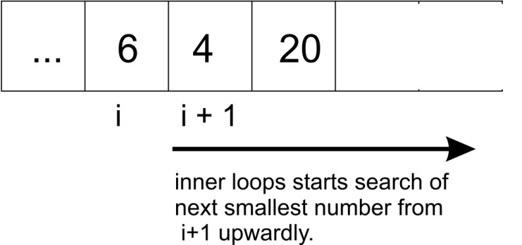

上图显示了算法搜索下一个最小项的方向。

# 快速排序

快速排序算法属于“分而治之”算法类，我们将问题分解成更小的块，更容易解决。在这种情况下，未排序的数组被分成部分排序的子数组，直到列表中的所有元素都位于正确的位置，此时未排序的列表将已排序。

# 列表分区

在我们将列表划分为更小的块之前，我们必须对其进行分区。这是快速排序算法的核心。要对阵列进行分区，必须首先选择一个枢轴。数组中的所有元素都将与此轴进行比较。在分区过程结束时，小于轴的所有元素将位于轴的左侧，而大于轴的所有元素将位于阵列中轴的右侧。

# 轴心选择

为了简单起见，我们将以任何数组中的第一个元素为轴心。这种轴心选择会降低性能，尤其是对已排序的列表进行排序时。随机选取数组中的中间或最后一个元素作为轴不会进一步改善这种情况。在下一章中，我们将采用更好的方法来选择轴心，以帮助我们找到列表中最小的元素。

# 实施

在深入研究代码之前，让我们使用快速排序算法对列表进行排序。理解分区步骤非常重要，因此我们将首先处理该操作。

考虑下面的整数列表。我们将使用下面的分区函数对该列表进行分区：


```py

    def partition(unsorted_array, first_index, last_index): 

        pivot = unsorted_array[first_index] 
        pivot_index = first_index 
        index_of_last_element = last_index 

        less_than_pivot_index = index_of_last_element 
        greater_than_pivot_index = first_index + 1 
        ... 
```

分区函数接收需要分区的数组作为其参数：第一个元素的索引和最后一个元素的索引。

枢轴的值存储在`pivot`变量中，其索引存储在`pivot_index`中。我们不使用`unsorted_array[0]`，因为当使用数组的一段调用未排序数组参数时，索引`0`不一定指向该数组中的第一个元素。枢轴的下一个元素`first_index + 1`的索引标记了我们开始在数组中查找大于`pivot``greater_than_pivot_index = first_index + 1`的元素的位置。

`less_than_pivot_index = index_of_last_element`标记列表中最后一个元素的位置，即我们开始搜索小于枢轴的元素的位置：

```py
    while True: 

        while unsorted_array[greater_than_pivot_index] < pivot and 
              greater_than_pivot_index < last_index: 
              greater_than_pivot_index += 1 

        while unsorted_array[less_than_pivot_index] > pivot and 
              less_than_pivot_index >= first_index: 
              less_than_pivot_index -= 1 
```

在主`while`循环开始执行时，数组如下所示：

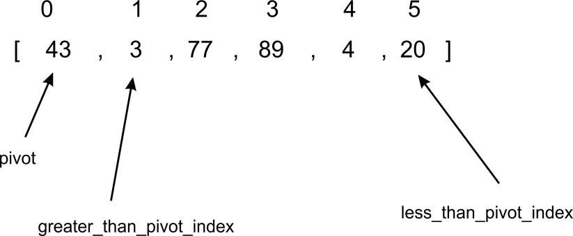

第一个内部`while`循环向右移动一个索引，直到它到达索引**2**，因为该索引处的值大于**43**。此时，第一个`while`循环中断，不再继续。在第一个`while`回路中条件的每次测试中，仅当`while`回路的测试条件评估为`True`时，才会评估`greater_than_pivot_index += 1`。这使得对元素的搜索比透视图更大，并前进到右侧的下一个元素。

第二个内部`while`循环一次向左移动一个索引，直到它落在索引**5**上，其值**20**小于**43**：


此时，任何内部`while`循环都不能再执行：

```py
    if greater_than_pivot_index < less_than_pivot_index: 
        temp = unsorted_array[greater_than_pivot_index] 
            unsorted_array[greater_than_pivot_index] =    
                unsorted_array[less_than_pivot_index] 
            unsorted_array[less_than_pivot_index] = temp 
    else: 
        break
```

自`greater_than_pivot_index < less_than_pivot_index`以来，if 语句的主体在这些索引处交换元素。当`greater_than_pivot_index`大于`less_than_pivot_index`时，else 条件会中断无限循环。在这种情况下，意味着`greater_than_pivot_index`和`less_than_pivot_index`已经相互交叉。

我们的阵列现在如下所示：

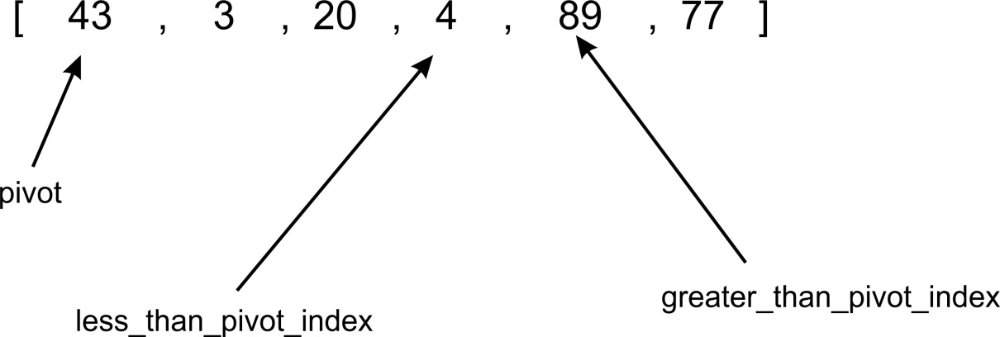

当`less_than_pivot_index`等于`3`且`greater_than_pivot_index`等于`4`时，执行 break 语句。

一旦退出`while`循环，我们就将`unsorted_array[less_than_pivot_index]`处的元素与`less_than_pivot_index`的元素交换，该元素作为枢轴的索引返回：

```py
    unsorted_array[pivot_index]=unsorted_array[less_than_pivot_index] 
    unsorted_array[less_than_pivot_index]=pivot 
    return less_than_pivot_index 
```

下图显示了作为分区过程的最后一步，代码如何将 4 与 43 互换：

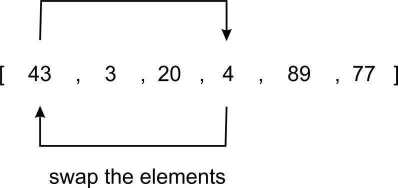

总而言之，第一次调用快速排序函数时，它是围绕索引**0**处的元素进行分区的。分区函数返回后，我们得到数组`[4, 3, 20, 43, 89, 77]`。

如您所见，元素**43**右侧的所有元素都较大，而左侧的元素较小。分区已完成。

使用索引为 3 的拆分点 43，我们将使用刚才所经历的相同过程递归地对两个子数组`[4, 30, 20]`和`[89, 77]`进行排序。

`quick sort`主要功能的主体如下：

```py
    def quick_sort(unsorted_array, first, last): 
        if last - first <= 0: 
            return 
    else: 
        partition_point = partition(unsorted_array, first, last) 
        quick_sort(unsorted_array, first, partition_point-1) 
        quick_sort(unsorted_array, partition_point+1, last) 
```

`quick sort`函数是一个非常简单的方法，不超过 6 行代码。重型提升通过`partition`功能完成。当调用`partition`方法时，它返回分区点。这是`unsorted_array`中的点，左侧的所有元素都小于枢轴，右侧的所有元素都大于枢轴。

当我们在分区进行后立即打印`unsorted_array`的状态时，我们可以清楚地看到分区是如何发生的：

```py
Output:
[43, 3, 20, 89, 4, 77]
[4, 3, 20, 43, 89, 77]
[3, 4, 20, 43, 89, 77]
[3, 4, 20, 43, 77, 89]
[3, 4, 20, 43, 77, 89]
```

退一步，让我们在第一个分区发生后对第一个子数组进行排序。当`greater_than_pivot_index`位于索引`2`且`less_than_pivot_index`位于索引`1`时，`[4, 3, 20]`子数组的分区将停止。在这一点上，据说这两个标记已经交叉。因为`greater_than_pivot_index`大于`less_than_pivot_index`，所以`while`循环的进一步执行将停止。Pivot 4 将与`3`交换，索引`1`作为分区点返回。

快速排序算法具有**O**（*n<sup>2</sup>*最坏情况复杂度，但在对大量数据进行排序时效率较高。

# 堆排序

在[第 11 章](11.html)、*图和其他算法*中，我们实现了（二进制）堆数据结构。我们的实现总是确保在元素被移除或添加到堆之后，通过使用 sink 和 float helper 方法来维护 heap order 属性。

堆数据结构可用于实现称为堆排序的排序算法。作为总结，让我们创建一个包含以下项目的简单堆：

```py
    h = Heap() 
    unsorted_list = [4, 8, 7, 2, 9, 10, 5, 1, 3, 6] 
    for i in unsorted_list: 
        h.insert(i) 
    print("Unsorted list: {}".format(unsorted_list)) 
```

创建堆`h`，并插入`unsorted_list`中的元素。每次调用`insert`方法后，通过后续调用`float`方法恢复堆顺序属性。循环结束后，堆的顶部将是元素`4`。

我们堆中的元素数是`10`。如果我们对 heap 对象`h`调用`pop`方法 10 次，并存储弹出的实际元素，我们最终得到一个排序列表。每次`pop`操作后，重新调整堆以维护 heap order 属性。

`heap_sort`方法如下：

```py
    class Heap: 
        ... 
        def heap_sort(self): 
            sorted_list = [] 
            for node in range(self.size): 
                n = self.pop() 
                sorted_list.append(n) 

            return sorted_list 
```

`for`循环只调用`pop`方法`self.size`次数。循环终止后，`sorted_list`将包含已排序的项目列表。

`insert`方法被称为*n*次。与`float`方法一起，`insert`操作的最坏运行时间为**O**（*n log n*），与`pop`方法一样。因此，此排序算法会导致最坏情况下的运行时间为**O**（*n log n*。

# 总结

在本章中，我们探讨了一些排序算法。快速排序的性能比其他排序算法要好得多。在讨论的所有算法中，quick sort 保留了它所排序的列表的索引。我们将在下一章探讨选择算法时使用此属性。