# 堆栈和队列

在本章中，我们将在上一章中学习的技能的基础上，创建特殊列表实现。我们仍然坚持线性结构。在接下来的章节中，我们将详细介绍更复杂的数据结构。

在本章中，我们将了解堆栈和队列的概念。我们还将使用各种方法（如`lists`和`node`）在 Python 中实现这些数据结构。

在本章中，我们将介绍以下内容：

*   使用各种方法实现堆栈和队列
*   堆栈和队列的一些实际示例应用

# 技术要求

您应该有一个安装了 Python 的计算机系统。基于本章讨论的概念的所有程序都在本书以及 GitHub 存储库中提供，链接如下：[https://github.com/PacktPublishing/Hands-On-Data-Structures-and-Algorithms-with-Python-Second-Edition/tree/master/Chapter05](https://github.com/PacktPublishing/Hands-On-Data-Structures-and-Algorithms-with-Python-Second-Edition/tree/master/Chapter05) 。

# 堆叠

堆栈是存储数据的数据结构，类似于厨房中的一叠盘子。你可以把一个盘子放在书堆的顶部，当你需要一个盘子时，你可以从书堆的顶部取下来。添加到堆栈中的最后一块板将是从堆栈中拾取的第一块板。类似地，堆栈数据结构允许我们从一端存储和读取数据，最后添加的元素首先被拾取。因此，堆栈是一种**后进先出**（**后进先出**结构：

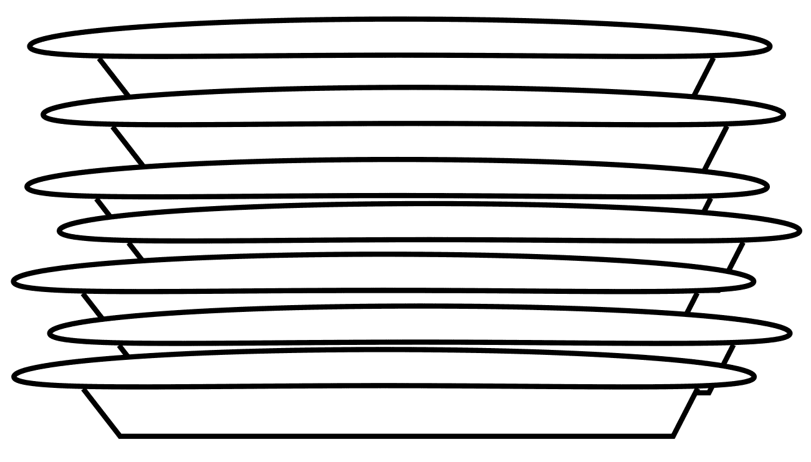

上图描绘了一堆板材。只有将板留在桩的顶部，才能将板添加到桩中。从板材堆中移除板材意味着移除位于板材堆顶部的板材。

在堆栈上执行两个主要操作-`push`和`pop`。将元素添加到堆栈顶部时，它将被推送到堆栈上。当从堆栈顶部拾取元素时，它会从堆栈中弹出。有时使用的另一个操作是`peek`，它可以在不弹出的情况下看到堆栈顶部的元素。

堆栈用于许多事情。堆栈的一个常见用法是在函数调用期间跟踪返回地址。让我们假设我们有以下程序：

```py
def b(): 
    print('b') 

def a(): 
    b() 

a() 
print("done")
```

当程序执行到达对`a()`的调用时，会发生以下情况：

1.  它首先将当前指令的地址推送到堆栈上，然后跳转到`a`的定义
2.  在函数`a()`内部，调用函数`b()`
3.  并且，函数`b()`的返回地址被推送到堆栈上
4.  一旦`b()`中的指令和函数的执行完成，返回地址就会从堆栈中弹出，这将使我们回到函数`a()`
5.  当函数`a`中的所有指令完成后，返回地址再次从堆栈中弹出，这将我们带回`main`函数和`print`语句

堆栈还用于在函数之间传递数据。考虑下面的例子。假设您的代码中有以下函数调用：

```py
   somefunc(14, 'eggs', 'ham', 'spam') 
```

内部发生的情况是，函数`14, 'eggs', 'ham'`和`'spam'`传递的值将被推送到堆栈上，一次推一个，如下图所示：

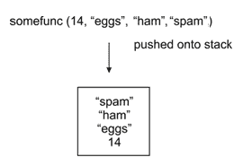

当代码调用跳转到函数的定义时，`a, b, c, d`的值将从堆栈中弹出。首先弹出`spam`元素并分配给`d`，然后将`ham`分配给`c`，依此类推：

```py
    def somefunc(a, b, c, d): 
        print("function executed")
```

# 堆栈实现

可以使用节点在 Python 中实现堆栈。我们首先创建一个`node`类，就像我们在上一章中使用列表所做的那样：

```py
class Node: 
    def __init__(self, data=None): 
        self.data = data 
        self.next = None 
```

正如我们所讨论的，节点保存数据和对列表中下一项的引用。在这里，我们将实现一个堆栈而不是一个列表；但是，节点的相同原理也适用于通过引用将节点链接在一起的情况。

现在让我们来看`stack`课程。它以类似于单链表的方式开始。使用节点实现堆栈需要两件事：

1.  我们首先需要知道堆栈顶部的节点，以便能够通过该节点应用`push`和`pop`操作。
2.  我们还希望跟踪堆栈中节点的数量，因此我们向堆栈类添加了一个`size`变量。考虑堆栈类的以下代码片段：

```py
class Stack: 
    def __init__(self): 
        self.top = None 
        self.size = 0 
```

# 推送操作

`push`操作是堆栈上的重要操作；它用于在堆栈顶部添加元素。我们在 Python 中实现推送功能以了解它的工作原理。首先，我们检查堆栈中是否已经有一些项，或者当我们希望在堆栈中添加新节点时，它是否为空。

如果堆栈已经有一些元素，那么我们必须做两件事：

1.  新节点的下一个指针必须指向先前位于顶部的节点。

2.  我们通过将`self.top`指向新添加的节点，将这个新节点放在堆栈的顶部。请参见下图中的两个说明：

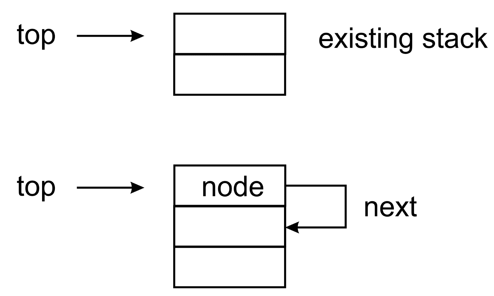

如果现有堆栈为空，并且要添加的新节点是第一个元素，则需要将此节点设置为元素的顶部节点。因此，`self.top`将指向这个新节点。见下图：

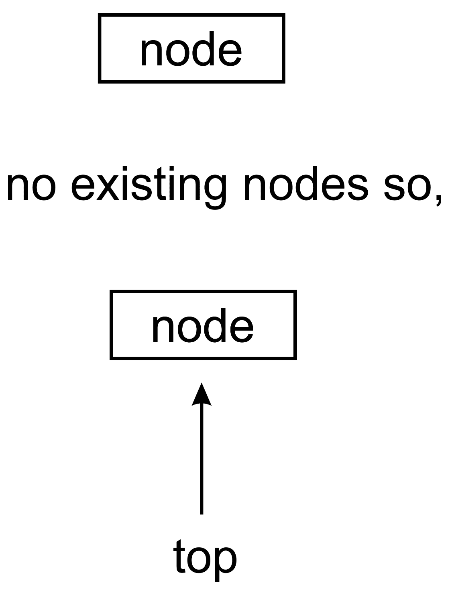

以下是`stack`中`push`操作的完整实施情况：

```py
   def push(self, data): 
       node = Node(data) 
       if self.top: 
           node.next = self.top 
           self.top = node                 
       else: 
           self.top = node 
       self.size += 1
```

# Pop 操作

现在，我们需要堆栈的另一个重要功能，`pop`操作。它读取堆栈的最顶层元素并将其从堆栈中移除。`pop`操作返回堆栈的最顶层元素，如果堆栈为空，则返回`None`

要在堆栈上执行`pop`操作：

1.  首先，检查堆栈是否为空。空堆栈上不允许进行`pop`操作。
2.  如果堆栈不是空的，可以检查顶部节点是否有指向其他节点的**next**属性。这意味着堆栈中有元素，最上面的节点指向堆栈中的下一个节点。要应用`pop`操作，我们必须更改顶部指针。下一个节点应位于顶部。我们通过将`self.top`指向`self.top.next`来实现这一点。请参见下图以了解这一点：

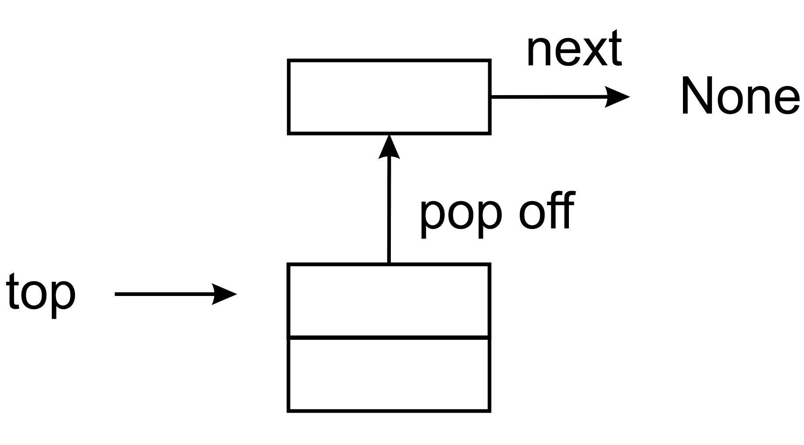

3.  当堆栈中只有一个节点时，pop 操作后堆栈将为空。我们必须将顶部指针更改为`None`。见下图：


4.  移除这样一个节点会导致`self.top`指向`None`：

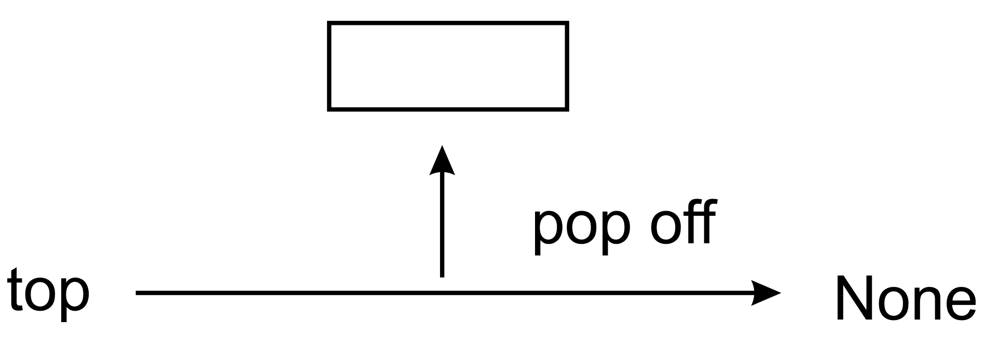

5.  如果堆栈不是空的，我们还将堆栈的大小减少`1`。以下是 Python 中`stack`的`pop`操作的完整代码：

```py
    def pop(self): 
        if self.top: 
            data = self.top.data 
            self.size -= 1  
            if self.top.next: 
                self.top = self.top.next 
            else: 
                self.top = None 
            return data 
        else: 
            return None 
```

# Peek 操作

还有一个重要的操作可以应用在堆栈上`peek`方法。此方法返回堆栈中的 top 元素，而不从堆栈中删除它。`peek`和`pop`之间唯一的区别在于`peek`方法只返回最顶层的元素；但是，对于`pop`方法，返回最顶层的元素，并且从堆栈中删除该元素

pop 操作允许我们在不更改堆栈的情况下查看顶部元素。这个操作非常简单。如果有顶层元素，则返回其数据；否则返回`None`（因此`peek`的行为与`pop`的行为匹配）：

```py
    def peek(self): 
        if self.top 
            return self.top.data 
        else: 
            return None 
```

# 括号匹配应用程序

现在让我们看一个示例应用程序，它展示了如何使用堆栈实现。我们将编写一个小函数来验证包含方括号的语句-`(`、`[`或`{`是否平衡，即结束方括号的数量是否与开始方括号的数量匹配。它还将确保一对括号真正包含在另一对括号中：

```py
    def check_brackets(statement): 
        stack = Stack() 
        for ch in statement: 
            if ch in ('{', '[', '('): 
                stack.push(ch) 
            if ch in ('}', ']', ')'): 
                last = stack.pop() 
            if last is '{' and ch is '}': 
                continue 
            elif last is '[' and ch is ']': 
                continue 
            elif last is '(' and ch is ')': 
                continue 
            else: 
                return False 
    if stack.size > 0: 
        return False 
    else: 
        return True 
```

我们的函数解析传递给它的语句中的每个字符。如果它得到一个开放的括号，它会将其推到堆栈上。如果它得到一个结束括号，它会将顶部元素从堆栈中弹出，并比较两个括号以确保它们的类型匹配，`(`应该匹配`)`、`[`应该匹配`]`、`{`应该匹配`}`。如果没有，我们返回`False`；否则，我们将继续解析。

一旦我们到达语句的末尾，我们需要做最后一次检查。如果堆栈为空，则可以返回`True`。但是如果堆栈不是空的，那么我们有一个开始的括号，没有匹配的结束括号，我们将返回`False`。我们可以使用以下代码测试括号匹配器：

```py
sl = ( 
   "{(foo)(bar)}[hello](((this)is)a)test", 
   "{(foo)(bar)}[hello](((this)is)atest", 
   "{(foo)(bar)}[hello](((this)is)a)test))" 
) 
for s in sl: 
   m = check_brackets(s) 
   print("{}: {}".format(s, m))
```

只有三条语句中的第一条应该匹配。当我们运行代码时，我们得到以下输出：


前面代码的输出为`True`、`False`和`False`

综上所述，堆栈数据结构的`push`和`pop`操作的复杂性为*O（1）*。栈数据结构简单；但是，它用于在实际应用程序中实现许多功能。浏览器中的后退和前进按钮是使用堆栈实现的。堆栈还用于在字处理器中实现撤消和重做功能。

# 排队

另一种特殊类型的列表是队列数据结构。队列数据结构与您在现实生活中习惯的常规队列非常相似。如果你在机场排队，或是在附近的商店里吃到你最喜欢的汉堡，那么你应该知道排队是怎么回事。

队列是非常基本的，也是需要掌握的一个重要概念，因为许多其他数据结构都是建立在它们之上的。

队列的工作方式如下。第一个加入队列的人通常首先得到服务，每个人都将按照他们加入队列的顺序得到服务。首字母缩略词 FIFO 最能解释队列的概念。**FIFO**代表**先进先出**。当人们站在队列中等待轮到服务时，服务只在队列的前面提供。人们离开队列的唯一时间是他们得到服务时，这只发生在队列的最前面。如下图所示，人们站在队列中，前面的人将首先得到服务：


要加入队列，参与者必须站在队列中最后一个人的后面。这是队列接受新进入者的唯一合法或允许的方式。队列长度无关紧要

我们将提供队列的各种实现，但这将围绕 FIFO 的相同概念。将首先读取首先添加的项。我们将调用将元素添加到队列中的操作作为`enqueue`。当我们从队列中删除一个元素时，我们称之为`dequeue`操作。每当一个元素排队时，队列的长度或大小都会增加 1。相反，出列项会将队列中的元素数减少 1。

为了演示这两种操作，下表显示了在队列中添加和删除元素的效果：

| **队列操作** | **尺寸** | **目录** | **手术结果** |
| `Queue()` | 0 | `[]` | 已创建队列对象，该对象为空 |
| `Enqueue`包装 | 1. | `['Packt']` | 队列中增加了一个*包*项。 |
| `Enqueue`出版 | 2. | `['Publishing', 'Packt']` | 队列中又增加了一项*发布* |
| `Size()` | 2. | `['Publishing', 'Packt']` | 返回队列中的项目数，在本例中为 2。 |
| `Dequeue()` | 1. | `['Publishing']` | *Packt*项已出列并返回。（此项是先添加的，因此先删除。） |
| `Dequeue()` | 0 | `[]` | *发布*项已出列并返回。（这是添加的最后一项，因此最后返回。） |

# 基于列表的队列

队列可以使用各种方法实现，例如`list`、`stack`和`node`。我们将逐一讨论使用所有这些方法实现队列。让我们首先使用 Python 的`list`类实现一个队列。这有助于我们快速了解队列。必须在队列上执行的操作封装在`ListQueue`类中：

```py
class ListQueue: 
    def __init__(self): 
        self.items = [] 
        self.size = 0 
```

在初始化方法`__init__`中，`items`实例变量设置为`[]`，表示队列创建时为空。队列的大小也设置为`zero`。`enqueue`和`dequeue`是队列中的重要方法，我们将在下一小节中讨论它们

# 排队操作

`enqueue`操作将一个项目添加到队列中。它使用`list`类的`insert`方法在列表的前面插入项目（或数据）。`enqueue`方法的实现见以下代码：

```py
  def enqueue(self, data): 
    self.items.insert(0, data)   # Always insert items at index 0
    self.size += 1               # increment the size of the queue by 1
```

请务必注意，我们是如何使用列表在队列中实现插入的。其概念是将索引`0`处的项目添加到列表中；它是数组或列表中的第一个位置。为了理解在列表中添加索引项 T1 时，队列如何工作的概念，请考虑下面的图表。我们从一个空列表开始。最初，我们在索引`0`中添加了一项`1`。接下来，我们在索引`0`中添加一个项目`2`；它会将先前添加的项移动到下一个索引。

接下来，当我们再次在索引`0`的列表中添加一个新的项目`3`时，已经添加到列表中的所有项目都会移位，如下图所示。同样，当我们在索引`0`中添加项目`4`时，列表中的所有项目都会移位：

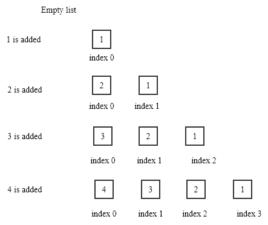

因此，在我们使用 Python 列表实现队列时，数组索引`0`是将新数据元素插入队列的唯一位置。`insert`操作将列表中的现有数据元素向上移动一个位置，然后将新数据插入索引`0`处创建的空间

为了使我们的队列反映新元素的添加，大小增加了`1`：

```py
self.size += 1 
```

We could have used Python's `shift` method on the list as another way of implementing the insert at `0`. 

# 出列操作

`dequeue`操作用于从队列中删除项目。此方法从队列中返回最顶端的项，并将其从队列中删除。以下是`dequeue`方法的实现：

```py
  def dequeue(self):
    data = self.items.pop()    # delete the topmost item from the queue
    self.size -= 1             # decrement the size of the queue by 1
     return data
```

Python`list`类有一个名为`pop()`的方法。`pop`方法执行以下操作：

1.  从列表中删除最后一项
2.  将列表中已删除的项目返回给调用它的用户或代码

列表中的最后一项弹出并保存在`data`变量中。在方法的最后一行，返回数据。

考虑下面的图作为我们的队列实现，其中添加了三个元素--OutT0}、AuthT1、和 Ty2 T2。要执行`dequeue`操作，首先添加数据为`1`的节点时，将其从队列前端移除：

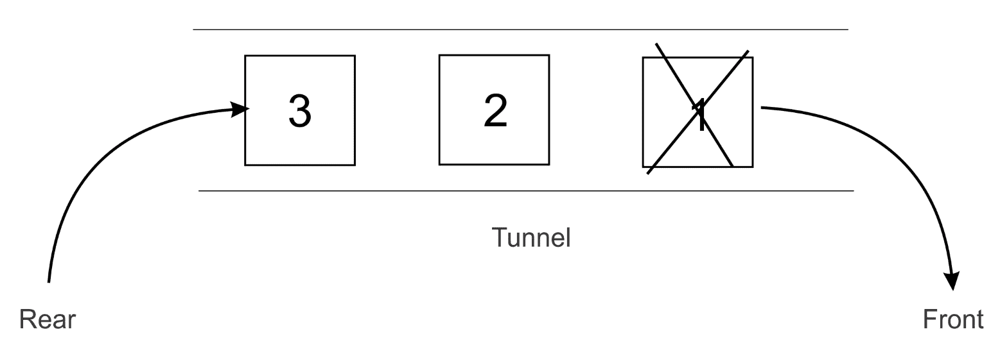

队列中的结果元素如下所示：

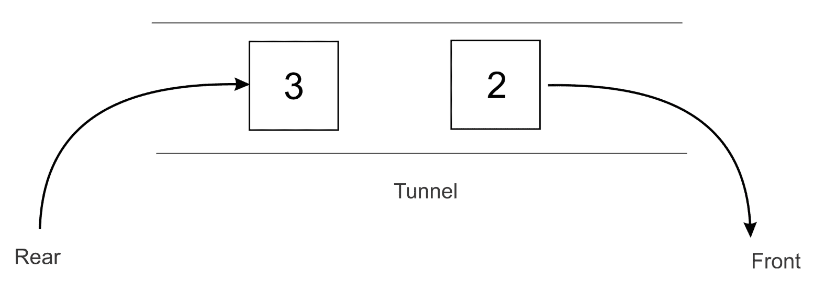

The `enqueue` operation is very inefficient due to one reason. The method has to first shift all the elements by one space. Imagine there are 1 million elements in a list which need to be shifted around any time a new element is being added to the queue. This will make the enqueue process very slow for large lists.

# 基于堆栈的队列

队列也可以使用两个堆栈实现。我们最初设置了两个实例变量，以便在初始化时创建一个空队列。这些堆栈将帮助我们实现队列。在本例中，堆栈只是 Python 列表，允许我们对其调用`push`和`pop`方法，最终允许我们获得`enqueue`和`dequeue`操作的功能。以下是`Queue`课程：

```py
class Queue: 
    def __init__(self): 
        self.inbound_stack = [] 
        self.outbound_stack = [] 
```

`inbound_stack`仅用于存储添加到队列中的元素。无法在此堆栈上执行其他操作。

# 排队操作

`enqueue`方法是将项目添加到队列中，该方法非常简单，只接收`data`追加到队列中。然后将该数据传递给`queue`类中`inbound_stack`的`append`方法。此外，使用`append`方法模拟`push`操作，将元素推到堆栈顶部。以下代码是使用 Python 中的堆栈实现的`enqueue`：

```py
def enqueue(self, data): 
    self.inbound_stack.append(data) 
```

对于`inbound_stack`上的`enqueue`数据，以下代码执行此任务：

```py
queue = Queue() 
queue.enqueue(5) 
queue.enqueue(6) 
queue.enqueue(7) 
print(queue.inbound_stack)
```

队列中`inbound_stack`的命令行输出如下：

```py
[5, 6, 7]
```

# 出列操作

`dequeue`操作用于按照添加项目的顺序从队列中删除元素。添加到队列中的新元素最终会出现在`inbound_stack`中。我们没有从`inbound_stack`中删除元素，而是将注意力转移到另一个堆栈上，即`outbound_stack`。我们将仅通过`outbound_stack`从队列中删除元素。

为了理解如何使用 AutoT0}来删除队列中的项，让我们考虑下面的例子。

最初，我们的`inbound_stack`中填充了**5**、**6**和**7**元素，如下图所示：

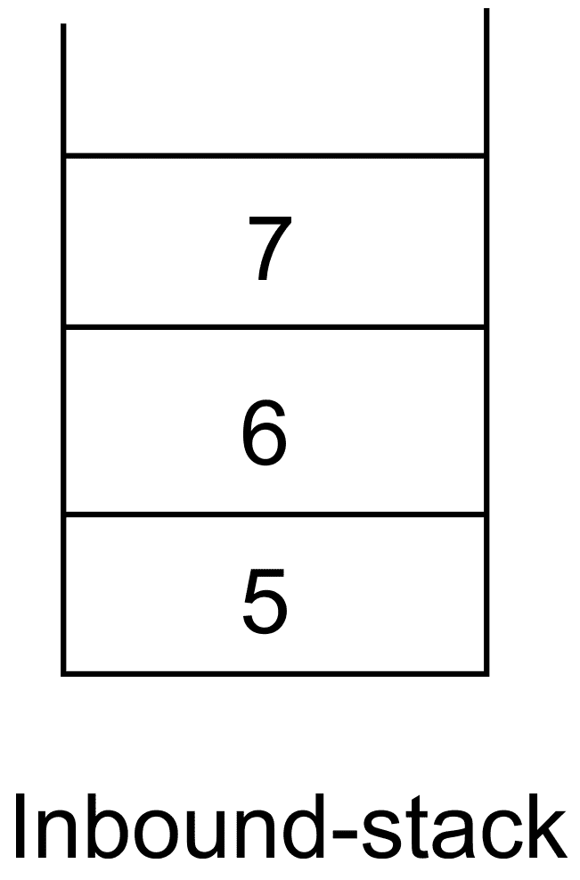

我们首先检查`outbound_stack`是否为空。由于开始时是空的，我们使用堆栈上的`pop`操作将`inbound_stack`中的所有元素移动到`outbound_stack`中。现在`inbound_stack`变为空，`outbound_stack`保留元素。为了更加清晰，我们在下图中显示了这一点：

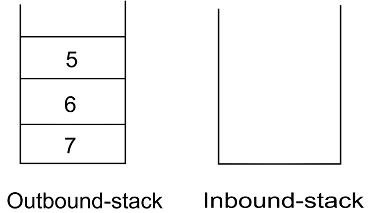

现在，如果`outbound_stack`不是空的，我们继续使用`pop`操作从队列中移除项目。在上图中，当我们在`outbound_stack`上应用`pop`操作时，我们得到元素`5`，这是正确的，因为它是首先添加的，应该是从队列中弹出的第一个元素。这使得`outbound_stack`只有两个元素：

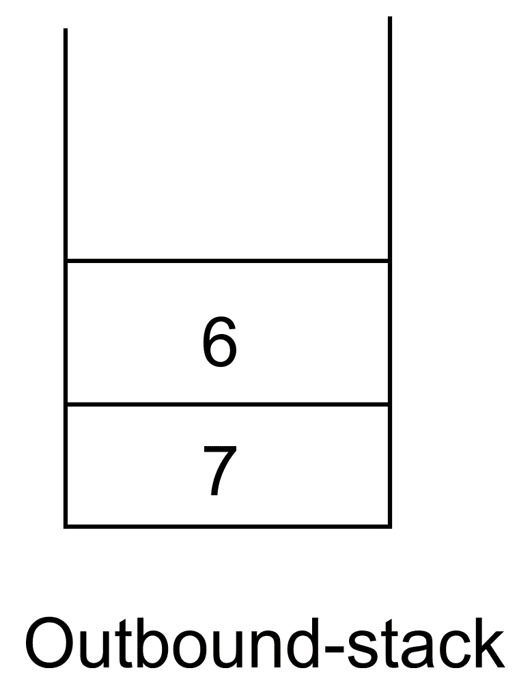

以下是队列的`dequeue`方法的实现：

```py
def dequeue(self):  
    if not self.outbound_stack: 
        while self.inbound_stack: 
            self.outbound_stack.append(self.inbound_stack.pop()) 
    return self.outbound_stack.pop() 
```

`if`语句首先检查`outbound_stack`是否为空。如果不为空，我们继续使用`pop`方法删除队列前面的元素，如下所示：

```py
return self.outbound_stack.pop() 
```

如果`outbound_stack`为空，则`inbound­_stack`中的所有元素都会移动到`outbound_stack`中，队列中前面的元素才会弹出：

```py
while self.inbound_stack: 
    self.outbound_stack.append(self.inbound_stack.pop()) 
```

只要`inbound_stack`中有元素，`while`循环将继续执行。

`self.inbound_stack.pop()`语句将删除添加到`inbound_stack`的最新元素，并立即将弹出的数据传递给`self.outbound_stack.append()`方法调用。

让我们考虑一个示例代码来理解队列上的操作。我们首先使用队列实现在队列中添加三项，即`5`、`6`和`7`。接下来，我们应用出列操作从队列中删除项目。代码如下：

```py
queue = Queue() 
queue.enqueue(5) 
queue.enqueue(6) 
queue.enqueue(7) 
print(queue.inbound_stack) 
queue.dequeue() 
print(queue.inbound_stack) 
print(queue.outbound_stack) 
queue.dequeue() 
print(queue.outbound_stack) 
```

上述代码的输出如下所示：

```py
 [5, 6, 7] 
 [] 
 [7, 6] 
 [7] 
```

前面的代码段首先将元素添加到队列中，并打印出队列中的元素。接下来，调用`dequeue`方法，之后当再次打印队列时，观察到元素数量的变化。

Implementing a queue with two stacks is very important and questions about this are often posed during interviews.

# 基于节点的队列

使用 Python 列表实现队列是了解队列工作原理的良好开端。我们还可以利用指针结构实现自己的队列数据结构。

队列可以使用双链表以及该数据结构上的`insertion`和`deletion`操作来实现，其时间复杂度为`*O(1)*`。

`node`类的定义与我们在双链表中讨论时定义的`Node`相同。如果双链接列表支持 FIFO 类型的数据访问，则可以将其视为队列，其中添加到列表中的第一个元素是第一个要删除的元素。

# 队列类

`queue`类与双链接`list`类和`Node`类非常相似，在双链接列表中添加一个节点：

```py
class Node(object):
    def __init__(self, data=None, next=None, prev=None):
        self.data = data
        self.next = next
        self.prev = prev

class Queue: 
    def __init__(self): 
        self.head = None 
        self.tail = None 
        self.count = 0 
```

最初，在创建`queue`类的实例时，`self.head`和`self.tail`指针被设置为`None`。为了对`Queue`中的节点数量进行计数，`count`实例变量也在此处进行维护，初始设置为`0`。

# 排队操作

元素通过`enqueue`方法添加到`Queue`对象。元素或数据通过节点添加，`enqueue`方法代码非常类似于[第 4 章](04.html)、*列表和指针结构*中讨论的双链表的`append`操作。

enqueue 操作根据传递给它的数据创建一个节点，并将其附加到队列的`tail`中，如果队列为空，则将`self.head`和`self.tail`都指向新创建的节点。队列中的元素总数按`self.count += 1`行增加。如果队列不是空的，则新节点的前一个变量将设置为列表的尾部，而尾部的下一个指针（或变量）将设置为新节点。最后，我们更新尾部指针以指向新节点。这在以下代码中显示：

```py
    def enqueue(self, data): 
        new_node = Node(data, None, None) 
        if self.head is None: 
            self.head = new_node 
            self.tail = self.head 
        else: 
            new_node.prev = self.tail 
            self.tail.next = new_node 
            self.tail = new_node 

        self.count += 1
```

# 出列操作

另一个使我们的双链表表现为队列的操作是`dequeue`方法。此方法删除队列前面的节点。要删除`self.head`指向的第一个元素，使用`if`语句：

```py
def dequeue(self): 
    current = self.head 
         if self.count == 1: 
             self.count -= 1 
             self.head = None 
             self.tail = None 
         elif self.count > 1: 
             self.head = self.head.next 
             self.head.prev = None 
             self.count -= 1 
```

`current`通过指向`self.head`进行初始化。如果`self.count`为`1`，则表示列表中只有一个节点，且始终是队列。因此，为了移除关联节点（由`self.head`指向），将`self.head`和`self.tail`变量设置为`None`。

如果队列有多个节点，则头指针移动到`self.head`之后的下一个节点。

执行`if`语句后，该方法返回`head`指向的节点。此外，在这两种情况下，即当计数最初为`1`且大于`1`时，变量`self.count`递减`1`。

有了这些方法，我们实现了一个队列，大量借鉴了双链表的思想。

还要记住，将双链表转换为队列的唯一方法是两种方法，即`enqueue`和`dequeue`方法。

# 队列的应用

队列可用于在许多实际的基于计算机的应用程序中实现各种功能。例如，不是为网络上的每台计算机提供自己的打印机，而是通过将每台打印机要打印的内容排队，使计算机网络共享一台打印机。当打印机准备打印时，它将选择队列中的一项（通常称为作业）进行打印。它将按照不同计算机发出的命令的顺序，从首先发出命令的计算机打印命令

操作系统还将 CPU 执行的进程排队。让我们创建一个应用程序，该应用程序使用队列来创建基本媒体播放器。

# 媒体播放器队列

most 音乐播放器软件允许用户将歌曲添加到播放列表中。按下播放按钮后，主播放列表中的所有歌曲都会一首接一首地播放。歌曲的顺序播放可以通过队列实现，因为要排队的第一首歌曲是要播放的第一首歌曲。这与 FIFO 首字母缩略词一致。我们将实现自己的播放列表队列，以 FIFO 方式播放歌曲。

我们的媒体播放器队列将只允许添加曲目和播放队列中所有曲目的方式。在成熟的音乐播放器中，线程将用于改进与队列的交互方式，而音乐播放器将继续用于选择要播放、暂停甚至停止的下一首歌曲。

`track`课程将模拟一个音乐曲目：

```py
from random import randint 
class Track: 
    def __init__(self, title=None): 
        self.title = title 
        self.length = randint(5, 10) 
```

每首曲目都包含歌曲标题和歌曲长度的参考。歌曲的长度是一个介于`5`和`10`之间的随机数。Python 中的随机模块提供了`randint`函数，使我们能够生成随机数。该类表示任何包含音乐的 MP3 曲目或文件。曲目的随机长度用于模拟播放歌曲或曲目所需的秒数。

要创建一些曲目并打印其长度，我们将执行以下操作：

```py
track1 = Track("white whistle") 
track2 = Track("butter butter") 
print(track1.length) 
print(track2.length) 
```

上述代码的输出如下所示：

```py
6
7
```

根据为两个轨迹生成的随机长度，您的输出可能会有所不同。

现在，让我们创建队列。使用继承，我们只是从`queue`类继承：

```py
import time 
class MediaPlayerQueue(Queue): 

    def __init__(self): 
        super(MediaPlayerQueue, self).__init__() 
```

通过调用`super`来正确初始化队列。该类本质上是一个队列，在队列中包含许多轨迹对象。要将曲目添加到队列中，将创建一个`add_track`方法：

```py
    def add_track(self, track): 
        self.enqueue(track) 
```

方法将一个`track`对象传递给队列`super`类的`enqueue`方法。实际上，这将使用`track`对象（作为节点的数据）创建`Node`，如果队列不为空，则指向尾部；如果队列为空，则指向头部和尾部。

假设队列中的曲目从添加的第一首曲目到最后一首曲目（FIFO）按顺序播放，`play`功能必须循环播放队列中的元素：

```py
def play(self): 
        while self.count > 0: 
            current_track_node = self.dequeue() 
            print("Now playing {}".format(current_track_node.data.title)) 
            time.sleep(current_track_node.data.length) 
```

`self.count`记录何时将轨道添加到我们的队列中，以及何时将轨道退出队列。如果队列不是空的，对`dequeue`方法的调用将返回队列前面的节点（其中包含`track`对象）。然后，`print`语句通过节点的`data`属性访问曲目的标题。为了进一步模拟曲目的播放，`time.sleep()`方法暂停程序执行，直到曲目的秒数结束：

```py
time.sleep(current_track_node.data.length)
```

媒体播放器队列由节点组成。将轨迹添加到队列时，轨迹将隐藏在新创建的节点中，并与该节点的数据属性关联。这解释了为什么我们通过调用`dequeue`返回的节点数据属性访问节点的`track`对象：

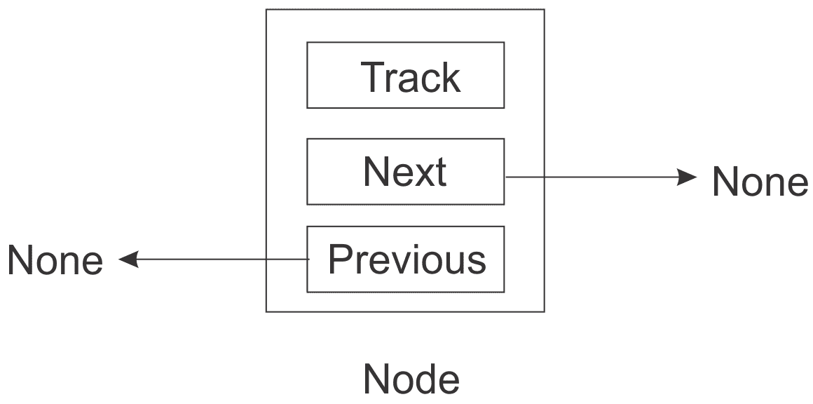

你可以看到，我们的`node`对象不是只存储任何数据，而是在本例中存储轨迹。

让我们带着音乐播放器转一圈：

```py
track1 = Track("white whistle") 
track2 = Track("butter butter") 
track3 = Track("Oh black star") 
track4 = Track("Watch that chicken") 
track5 = Track("Don't go") 
```

我们创建了五个以随机单词为标题的轨迹对象：

```py
print(track1.length) 
print(track2.length) 
>> 8 >> 9
```

由于随机长度的原因，输出应该与您在机器上获得的不同。

接下来，创建`MediaPlayerQueue`类的一个实例：

```py
media_player = MediaPlayerQueue()
```

将添加曲目，`play`功能的输出应按照我们排队的顺序打印播放的曲目：

```py
media_player.add_track(track1) 
media_player.add_track(track2) 
media_player.add_track(track3) 
media_player.add_track(track4) 
media_player.add_track(track5) 
media_player.play() 
```

上述代码的输出如下所示：

```py
    >>Now playing white whistle
 >>Now playing butter butter
 >>Now playing Oh black star
 >>Now playing Watch that chicken
 >>Now playing Don't go
```

在执行程序时，可以看到曲目是按照队列的顺序播放的。播放曲目时，系统还会暂停与曲目长度相等的秒数。

# 总结

在本章中，我们使用我们关于将节点链接在一起的知识来创建其他数据结构，即`stacks`和`queues`。我们已经看到了这些数据结构是如何紧密模拟现实世界中的堆栈和队列的。探讨了具体实现及其各种类型。我们后来应用堆栈和队列的概念来编写实际的程序。

我们将在下一章考虑树木。将讨论树的主要操作，以及应用其数据结构的不同领域。