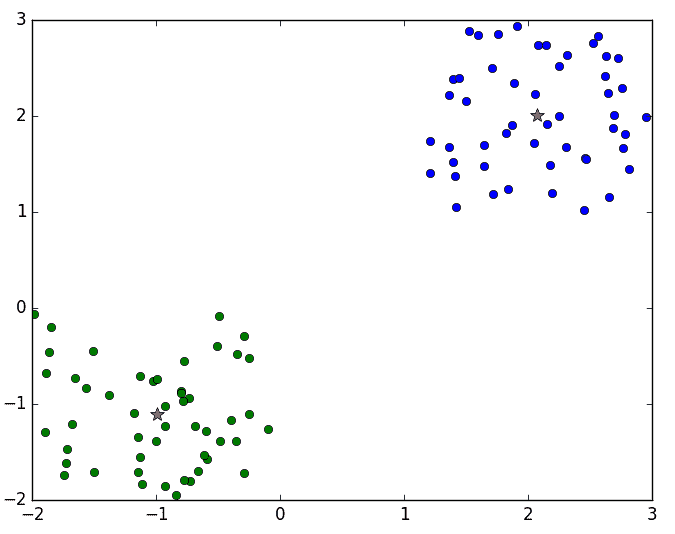
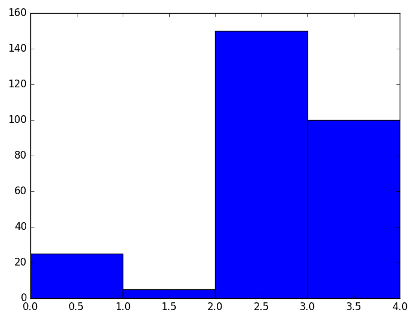
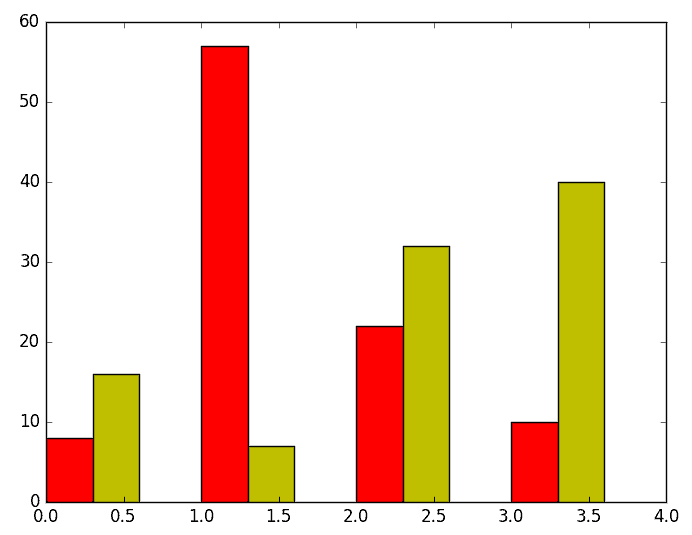
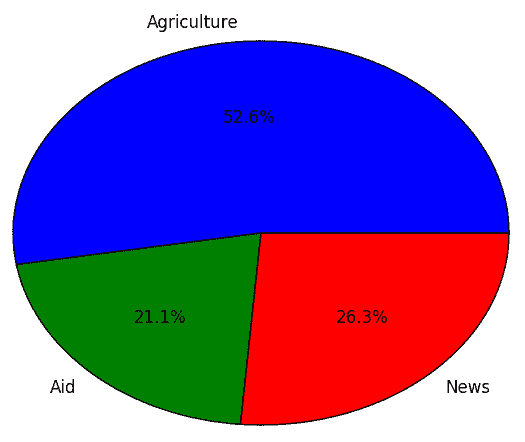
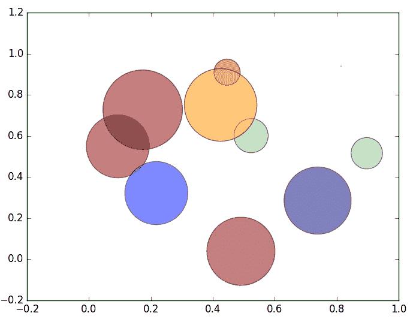

# 实现、应用程序和工具

在没有任何实际应用的情况下学习算法仍然是纯粹的学术追求。在本章中，我们将探讨塑造我们世界的数据结构和算法。

这个时代的金块之一是丰富的数据。电子邮件、电话号码、文本文档和图像包含大量数据。在这些数据中，有一些有价值的信息使数据变得更加重要。但要从原始数据中提取这些信息，我们必须使用专门用于此任务的数据结构、流程和算法。

机器学习使用大量的算法来分析和预测某些变量的发生。在纯数字的基础上分析数据仍然会在原始数据中留下许多潜在信息。因此，直观地呈现数据也能让人理解并获得有价值的见解。

在本章结束时，您应该能够执行以下操作：

*   精确地修剪和显示数据
*   使用有监督和无监督学习算法进行预测
*   直观地表示数据以获得更多的洞察力

# 技术要求

为了继续本章，您需要安装以下软件包。这些包将用于预处理并直观地表示正在处理的数据。其中一些软件包还包含一个编写良好的算法实现，该算法将在我们的数据上运行。

最好使用`pip`安装这些模块。因此，首先，我们需要使用以下命令安装 pip for Python 3：

*   `sudo apt-get update`
*   `sudo apt-get install python3-pip`

此外，需要运行以下命令来安装`numpy`、`scikit-learn`、`matplotlib`、`pandas`和`textblob`软件包：

```py
# pip3 install numpy
# pip3 install scikit-learn
# pip3 install matplotlib
# pip3 install pandas
# pip3 install textblob  
```

如果您使用的是旧版本的 Python（即 Python 2），则可以使用相同的命令通过将`pip3`替换为`pip`来安装包。

您还需要安装提供内置文本处理功能的`nltk`和`punkt`软件包。要安装它们，请打开 Python 终端并运行以下命令：

```py
>>import nltk
>>nltk.download('punkt')
```

这些软件包可能需要先安装其他特定于平台的模块。注意并安装所有依赖项：

*   **NumPy**：一个库，具有对 n 维数组和矩阵进行操作的函数。
*   **Scikit 学习**：高度先进的机器学习模块。它包含许多用于分类、回归和聚类等的算法的实现。
*   **Matplotlib**：这是一个绘图库，利用 NumPy 绘制各种图表，包括直线图、直方图、散点图，甚至 3D 图。
*   **熊猫**：该库处理数据操作和分析。

GitHub 链接如下：[https://github.com/PacktPublishing/Hands-On-Data-Structures-and-Algorithms-with-Python-3.x-Second-Edition/tree/master/Chapter14](https://github.com/PacktPublishing/Hands-On-Data-Structures-and-Algorithms-with-Python-3.x-Second-Edition/tree/master/Chapter14) 。

# 数据预处理

为了分析数据，首先，我们必须对数据进行预处理，以去除噪声，并将其转换为适当的格式，以便进一步分析。来自真实世界的数据集合大多充满了噪声，这使得直接应用任何算法都很困难。收集的原始数据存在很多问题，因此我们需要采取各种方法对数据进行清理，使其适合用于进一步的研究。

# 处理原始数据

收集的数据也可能与随时间收集的其他记录不一致。重复条目和不完整记录的存在保证了我们对数据的处理方式能够揭示隐藏的有用信息。

为了清理数据，我们完全丢弃了不相关和有噪声的数据。缺少部分或属性的数据可以替换为合理的估计。此外，如果原始数据存在不一致性，则有必要进行检测和纠正。

让我们探讨如何使用`NumPy`和`pandas`进行数据预处理技术。

# 缺失数据

如果数据缺少值，机器学习算法的性能就会恶化。数据集缺少字段或属性并不意味着它没有用处。可以使用几种方法来填充缺少的值。其中一些方法如下：

*   使用全局常量填充缺少的值。
*   使用数据集中的平均值或中值。
*   手动提供数据。
*   使用属性“平均值”或“中值”来填充缺少的值。选择是基于数据将用于什么的上下文和敏感性。

以以下数据为例：

```py
    import numpy as np 
    data = pandas.DataFrame([ 
        [4., 45., 984.], 
        [np.NAN, np.NAN, 5.], 
        [94., 23., 55.], 
    ]) 
```

我们可以看到，数据元素`data[1][0]`和`data[1][1]`的值为`np.NAN`，表示它们没有值。如果给定数据集中不需要`np.NAN`值，可以将其设置为常量。

让我们将值为`np.NAN`的数据元素设置为`0.1`：

```py
    print(data.fillna(0.1)) 
```

数据的新状态如下所示：

```py
0     1      2
0   4.0  45.0  984.0
1   0.1   0.1    5.0
2  94.0  23.0   55.0
```

为了应用平均值，我们执行以下操作：

```py
    print(data.fillna(data.mean()))
```

计算每列的平均值，并将其插入到具有`np.NAN`值的数据区域中：

```py
0     1      2
0   4.0  45.0  984.0
1  49.0  34.0    5.0
2  94.0  23.0   55.0
```

对于第一列`0`列，通过`(4 + 94)/2`获得平均值。然后将得到的`49.0`存储在`data[1][0]`。对`1`列和`2`列执行类似操作

# 特征缩放

数据框中的列称为其特征。这些行被称为记录或观察。如果一个属性的值与其他属性的值相比处于更高的范围内，则机器学习算法的性能会降低。因此，通常需要在公共范围内缩放或规范化属性值

考虑一个例子，下面的数据矩阵。这些数据将在小节中引用，因此请注意：

```py
data1= ([[  58.,    1.,   43.],
 [  10.,  200.,   65.],
 [  20.,   75.,    7.]]
```

特征一的数据为`58`、`10`和`20`，其值介于`10`和`58`之间。对于特征二，数据位于`1`和`200`之间。如果我们将这些数据提供给任何机器学习算法，就会产生不一致的结果。理想情况下，我们需要将数据缩放到一定范围，以获得一致的结果。

再次，仔细检查发现每个特征（或列）位于不同的平均值附近。因此，我们要做的是围绕类似的方式对齐这些特性。

特征缩放的一个好处是它促进了机器学习的学习部分。`scikit`模块有大量的缩放算法，我们将应用于我们的数据。

# 标准化的最小-最大标量形式

标准化的最小-最大标量形式使用平均值和标准偏差将所有数据装箱到介于特定最小值和最大值之间的范围内。一般设置范围在`0`到`1`之间；尽管可以应用其他范围，`0`到`1`范围仍然是默认值：

```py
from sklearn.preprocessing import MinMaxScaler

scaled_values = MinMaxScaler(feature_range=(0,1)) 
results = scaled_values.fit(data1).transform(data1) 
print(results) 
```

`MinMaxScaler`类的一个实例被创建为范围为`(0,1)`并传递给`scaled_values`变量。调用`fit`函数进行必要的计算，这些计算在内部用于更改数据集。`transform`函数影响数据集的实际操作，将值返回到`results`：

```py
[[ 1\.          0\.          0.62068966]
 [ 0\.          1\.          1\.        ]
 [ 0.20833333  0.3718593   0\.        ]]
```

我们可以从前面的输出中看到，所有数据都是标准化的，并且位于`0`和`1`之间。这种输出现在可以提供给机器学习算法。

# 标准标量

初始数据集或表格中各特征的平均值分别为 29.3、92 和 38。为了使所有数据具有相似的平均值，即数据的零平均值和单位方差，我们可以应用标准标量算法，如下所示：

```py
    stand_scalar =  preprocessing.StandardScaler().fit(data) 
    results = stand_scalar.transform(data) 
    print(results)
```

`data`传递给实例化`StandardScaler`类返回的对象的`fit`方法。`transform`方法作用于数据中的数据元素，并将输出返回结果：

```py
[[ 1.38637564 -1.10805456  0.19519899]
 [-0.93499753  1.31505377  1.11542277]
 [-0.45137812 -0.2069992  -1.31062176]]
```

通过检查结果，我们发现我们的所有功能现在都是均匀分布的。

# 二值化数据

要对给定的功能集进行二值化，我们可以使用阈值。如果给定数据集中的任何值大于阈值，则该值替换为`1`，如果该值小于阈值，则替换为`0`。考虑下面的代码片段，其中我们将 50 作为对原始数据进行二进制化的阈值：

```py
 results = preprocessing.Binarizer(50.0).fit(data).transform(data) 
 print(results) 
```

使用参数`50.0`创建`Binarizer`的实例。`50.0`是将在二值化算法中使用的阈值：

```py
[[ 1\. 0\. 0.]
 [ 0\. 1\. 1.]
 [ 0\. 1\. 0.]] 
```

数据中小于 50 的所有值都将具有值`0`，否则将保持值`1`。

# 学习机器学习

机器学习是人工智能的一个分支。机器学习基本上是一种算法，它可以从示例数据中学习，并根据示例数据提供预测。机器学习模型从数据示例中学习模式，并使用这些学习的模式对看不见的数据进行预测。例如，我们提供了许多垃圾邮件和 ham 电子邮件示例，以开发一个机器学习模型，该模型可以学习电子邮件中的模式，并可以将新电子邮件分类为垃圾邮件或 ham

# 机器学习的类型

机器学习有三大类，如下所示：

*   **监督学习**：这里，一个算法由一组输入及其相应的输出组成。然后，算法必须计算出一个看不见的输入的输出是什么。监督学习算法试图学习输入特征和目标输出中的模式，以便学习的模型能够预测新的看不见数据的输出。分类和回归是两类使用监督学习方法，其中机器学习算法从给定的数据和标签中学习。分类是一个过程，给定一组输入特征和与之相关联的标签，将给定的不可见数据分类为预定义的类集合之一。回归与分类非常相似，但有一个例外，我们有连续的目标值，而不是一组固定的预定义类（标称或分类属性），并且我们在连续响应中预测新的未知数据的值。此类算法的示例包括朴素贝叶斯、支持向量机、，k-最近邻、线性回归、神经网络和决策树算法
*   **无监督学习**：无监督学习算法不使用一组输入和输出变量之间存在的关系，只使用输入来学习数据中的模式和簇。无监督算法用于学习给定输入数据中的模式，而不需要与之关联的标签。聚类问题是使用无监督学习方法解决的最流行的问题类型之一。在这种情况下，根据特征之间的相似性将数据点分组在一起以形成组或簇。此类算法的示例包括 k-均值聚类、凝聚聚类和层次聚类
*   **强化学习**：这种学习方法中的计算机与环境进行动态交互，以提高其性能。

# hello 分类器

让我们举一个简单的例子来理解机器学习是如何工作的；我们从一个文本分类器的`hello world`示例开始。这是对机器学习的温和介绍。

这个例子将预测给定的文本是否具有消极或积极的内涵。在这之前，我们需要用一些数据来训练我们的算法（模型）。

朴素贝叶斯模型适用于文本分类。基于朴素贝叶斯模型的算法通常速度快，结果准确。它基于特征相互独立的假设。要准确预测降雨的发生，需要考虑三个条件。这些是风速、温度和空气中的湿度。事实上，这些因素确实相互影响，以确定降雨的可能性。但是朴素贝叶斯的抽象是假设这些特征在任何方面都是无关的，因此独立地影响降雨的机会。朴素贝叶斯在预测未知数据集的类别时很有用，我们很快就会看到。

现在，回到我们的 hello 分类器。在我们训练模型后，其预测将分为正面或负面两类：

```py
    from textblob.classifiers import NaiveBayesClassifier 
    train = [ 
        ('I love this sandwich.', 'pos'), 
        ('This is an amazing shop!', 'pos'), 
        ('We feel very good about these beers.', 'pos'), 
        ('That is my best sword.', 'pos'), 
        ('This is an awesome post', 'pos'), 
        ('I do not like this cafe', 'neg'), 
        ('I am tired of this bed.', 'neg'), 
        ("I can't deal with this", 'neg'), 
        ('She is my sworn enemy!', 'neg'), 
        ('I never had a caring mom.', 'neg') 
    ] 
```

首先，我们将从`textblob`包中导入`NaiveBayesClassifier`类。该分类器非常容易使用，并且基于贝叶斯定理。

`train`变量由元组组成，每个元组保存实际的训练数据。每个元组包含句子及其关联的组。

现在，为了训练我们的模型，我们将通过将 train 传递给`NaiveBayesClassifier`对象来实例化它：

```py
    cl = NaiveBayesClassifier(train) 
```

更新后的朴素贝叶斯模型`cl`将预测未知句子所属的类别。到目前为止，我们的模型只知道一个短语可以属于两个类别，`neg`和`pos`。

以下代码使用我们的模型运行测试：

```py
    print(cl.classify("I just love breakfast")) 
    print(cl.classify("Yesterday was Sunday")) 
    print(cl.classify("Why can't he pay my bills")) 
    print(cl.classify("They want to kill the president of Bantu")) 
```

我们的测试结果如下：

```py
pos 
pos 
neg 
neg 
```

我们可以看到，该算法在将输入短语正确分类方面取得了一定程度的成功。

这个人为设计的例子过于简单化，但它确实表明了一个承诺，即如果给定适当的数据量和合适的算法或模型，机器就有可能在没有任何人工帮助的情况下执行任务。

在下一个示例中，我们将使用`scikit`模块预测短语可能属于的类别。

# 一个监督学习的例子

让我们考虑文本分类问题的一个例子，它可以用有监督的学习方法来解决。文本分类问题是当我们有一组与固定数量的类别相关的文档时，将新文档分类为预定义的文档类别集之一。与监督学习一样，我们需要首先训练模型，以便准确预测未知文档的类别。

# 收集数据

`scikit`模块提供了样本数据，我们可以用来训练机器学习模型。在本例中，我们将使用新闻组文档，它有 20 类文档。要加载这些文档，我们将使用以下代码行：

```py
 from sklearn.datasets import fetch_20newsgroups 
 training_data = fetch_20newsgroups(subset='train', categories=categories,   
                                           shuffle=True, random_state=42)
```

让我们只选取四类文档来训练模型。训练完模型后，预测结果将属于以下类别之一：

```py
    categories = ['alt.atheism', 
                  'soc.religion.christian','comp.graphics', 'sci.med'] 
```

我们将用作培训数据的记录总数通过以下方式获得：

```py
 print(len(training_data)) 
```

机器学习算法不直接作用于文本属性，因此使用以下代码行将每个文档所属类别的名称表示为数字（例如，`alt.atheism`表示为`0`：

```py
    print(set(training_data.target)) 
```

类别具有整数值，我们可以使用`print(training_data.target_names[0])`映射回类别本身。

这里，`0`是从`set(training_data.target)`中选取的数字随机索引。

既然已经获得了训练数据，我们就必须将数据提供给机器学习算法。单词袋模型是一种将文本文档转换为特征向量的方法，目的是将文本转换为可以应用学习算法或模型的形式。此外，这些特征向量将用于训练机器学习模型。

# 字里行间

单词包是一种用于表示文本数据的模型，它不考虑单词的顺序，而是使用单词计数。让我们考虑一个例子来理解单词包方法是如何用来表示文本的。看下面两句话：

```py
    sentence_1 = "as fit as a fiddle"
    sentence_2 = "as you like it"
```

单词包使我们能够将文本分割成由矩阵表示的数字特征向量。

为了使用单词袋模型简化我们的两句话，我们需要获得所有单词的唯一列表：

```py
    set((sentence_1 + sentence_2).split(" "))
```

此集合将成为我们在矩阵中的列，称为机器学习术语中的功能。矩阵中的行将表示用于培训的文档。行和列的交点将存储该单词在文档中出现的次数。以我们的两句话为例，我们得到以下矩阵：

|  | **作为** | **配合** | **a** | **小提琴** | **你** | **类似** | **它** |
| **第 1 句** | 2. | 1. | 1. | 1. | 0 | 0 | 0 |
| **第 2 句** | 1. | 0 | 0 | 0 | 1. | 1. | 1. |

前面的数据具有许多对于文本分类通常不重要的特征。可以删除停止字，以确保只分析相关数据。停止词包括 is、am、are、was 等。由于 bag of words 模型在其分析中不包含语法，因此可以安全地删除停止词。 

要生成进入矩阵列的值，我们必须标记培训数据：

```py
    from sklearn.feature_extraction.text import CountVectorizer 
    from sklearn.feature_extraction.text import TfidfTransformer 
    from sklearn.naive_bayes import MultinomialNB 
    count_vect = CountVectorizer() 
    training_matrix = count_vect.fit_transform(training_data.data) 
```

对于我们在本例中使用的四类数据，`training_matrix`的维度为（2257x35788）。这意味着 2257 对应于文档总数，而 35788 对应于列数，即构成所有文档中唯一单词集的特征总数。

我们实例化`CountVectorizer`类并将`training_data.data`传递给`count_vect`对象的`fit_transform`方法。结果存储在`training_matrix`中。`training_matrix`保存所有独特的单词及其各自的频率。

有时，频率计数在文本分类问题上表现不佳；我们可以使用**项频率逆文档频率**（**TF-IDF**加权方法来表示特征，而不是使用频率计数

在此，将导入`TfidfTransformer`，这有助于分配数据中每个特征的权重：

```py
    matrix_transformer = TfidfTransformer() 
    tfidf_data = matrix_transformer.fit_transform(training_matrix) 

    print(tfidf_data[1:4].todense()) 
```

`tfidf_data[1:4].todense()`仅显示一个三行乘 35788 列矩阵的截断列表。所见数值为 TF-IDF；与使用频率计数相比，它是一种更好的表示方法。

一旦我们提取了特征并以表格形式表示它们，我们就可以应用机器学习算法进行训练。有许多监督学习算法；让我们看一个训练文本分类器模型的朴素贝叶斯算法示例

朴素贝叶斯算法是一种基于贝叶斯定理的简单分类算法。它是一种基于概率的学习算法，通过使用特征/词/词的词频来计算归属概率来构建模型。朴素贝叶斯算法将给定文档分类为预定义类别之一，其中观察该类别中新文档的词的概率最大类别朴素贝叶斯算法的工作原理如下：首先，对所有训练文档进行处理，提取文本中出现的所有单词的词汇表，然后计算它们在不同目标类中的频率，以获得它们的概率。接下来，在类别中对新文档进行分类，该类别具有属于该特定类别的最大概率。朴素贝叶斯分类器基于单词出现概率与文本中的位置无关的假设。多项式朴素贝叶斯可以使用`scikit`库的`MultinomialNB`函数实现，如下所示：

```py
 model = MultinomialNB().fit(tfidf_data, training_data.target) 
```

`MultinomialNB`是朴素贝叶斯模型的一个变体。我们将合理化的数据矩阵`tfidf_data`和类别`training_data.target`传递给其`fit`方法。

# 预言

为了测试训练模型如何预测未知文档的类别，让我们考虑一些示例测试数据来评估模型：

```py
    test_data = ["My God is good", "Arm chip set will rival intel"] 
    test_counts = count_vect.transform(test_data) 
    new_tfidf = matrix_transformer.transform(test_counts)
```

将`test_data`列表传递给`count_vect.transform`函数，以获得测试数据的矢量化形式。为了获得测试数据集的 TF-IDF 表示，我们调用`matrix_transformer`对象的`transform`方法。当我们将新的测试数据传递给机器学习模型时，我们必须以与准备训练数据相同的方式处理数据

为了预测单据可能属于哪一类，我们使用`predict`函数如下：

```py
    prediction = model.predict(new_tfidf)  
```

循环可用于迭代预测，显示预测它们所属的类别：

```py
    for doc, category in zip(test_data, prediction): 
        print('%r => %s' % (doc, training_data.target_names[category])) 
```

当循环运行到完成时，将显示短语及其可能属于的类别。示例输出如下所示：

```py
'My God is good' => soc.religion.christian
'Arm chip set will rival intel' => comp.graphics
```

到目前为止，我们所看到的是监督学习的一个主要例子。我们首先加载类别已知的文档。然后，根据朴素贝叶斯定理，将这些文档输入最适合文本处理的机器学习算法。向模型提供了一组测试文件，并对类别进行了预测。

为了探索一个无监督学习算法的例子，我们将讨论一些数据聚类的 k-means 算法。

# 无监督学习示例

无监督学习算法能够发现可能存在的数据中的固有模式，并可以将它们分组，从而使一个集群中的数据点非常相似，而来自两个不同集群的数据点本质上非常不同。这些算法的一个例子是 k-means 算法。

# K-均值算法

k-means 算法使用给定数据集中的平均点来聚类和发现数据集中的组。`K`是我们想要并希望发现的集群数量。在 k-means 算法生成分组/簇后，我们可以将未知数据传递给该模型，以预测新数据应该属于哪个簇。

注意，在这种算法中，只有未分类的原始数据被送入算法，而没有任何与数据相关联的标签。由算法确定数据中是否存在固有的组

k-means 算法根据所提供的特征之间的相似性，迭代地将数据点分配给聚类。k-means 聚类使用平均点对 k 个聚类/组中的数据点进行分组。它的工作原理如下。首先，我们创建 k 个非空集，并计算数据点与聚类中心之间的距离。接下来，我们将数据点分配给距离最小且最近的簇。接下来，我们重新计算聚类点，并重复执行相同的过程，直到所有数据都被聚类。

为了了解该算法的工作原理，让我们检查由 x 和 y 值组成的`100`数据点（假设有两个属性）。我们将把这些值提供给学习算法，并期望该算法将数据分为两组。我们将为这两个集合着色，以使簇可见。

让我们创建一个样本数据，包含 100 条*x*和*y*对记录：

```py
    import numpy as np 
    import matplotlib.pyplot as plt 
    original_set = -2 * np.random.rand(100, 2) 
    second_set = 1 + 2 * np.random.rand(50, 2) 
    original_set[50: 100, :] = second_set 
```

首先，我们使用`-2 * np.random.rand(100, 2)`创建 100 条记录。在每个记录中，我们将使用其中的数据表示最终将绘制的*x*和*y*值。

`original_set`中的最后 50 个数字将替换为`1+2*np.random.rand(50, 2)`。实际上，我们所做的是创建两个数据子集，其中一个集合的数字为负数，而另一个集合的数字为正数。现在算法的责任是适当地发现这些片段。

我们实例化`KMeans`算法类并传递`n_clusters=2`。这使得算法将所有数据分为两组。在 k-means 算法中，必须事先知道簇的数目。使用`scikit`库实现 k-means 算法如图所示：

```py
    from sklearn.cluster import KMeans 
    kmean = KMeans(n_clusters=2) 

    kmean.fit(original_set) 

    print(kmean.cluster_centers_) 

    print(kmean.labels_) 
```

将数据集传递给`kmean``kmean.fit(original_set)`的`fit`函数。该算法生成的聚类将围绕某个平均点旋转。定义这两个平均点的点由`kmean.cluster_centers_`获得。

打印时的平均点如下所示：

```py
[[ 2.03838197 2.06567568]
 [-0.89358725 -0.84121101]]
```

`original_set`中的每个数据点在我们的 k-均值算法完成训练后将属于一个集群。k-mean 算法将发现的两个簇表示为 1 和 0。如果我们要求算法将数据分为四类，那么这些类的内部表示将是 0、1、2 和 3。要打印出每个数据集所属的各种集群，我们执行以下操作：

```py
    print(kmean.labels_) 
```

这将提供以下输出：

```py
[1 1 1 1 1 1 1 1 1 1 1 1 1 1 1 1 1 1 1 1 1 1 1 1 1 1 1 1 1 1 1 1 1 1 1 
 1 1 1 1 1 1 1 1 1 1 1 1 1 1 1 0 0 0 0 0 0 0 0 0 0 0 0 0 0 0 0 0 0 0 0 
 0 0 0 0 0 0 0 0 0 0 0 0 0 0 0 0 0 0 0 0 0 0 0 0 0 0 0 0 0 0]
```

有`100`1 和 0。每个显示每个数据点所属的集群。通过使用`matplotlib.pyplot`，我们可以绘制每组的点，并对其进行适当的着色，以显示集群：

```py
    import matplotlib.pyplot as plt 
    for i in set(kmean.labels_): 
        index = kmean.labels_ == i 
        plt.plot(original_set[index,0], original_set[index,1], 'o')
```

`index = kmean.labels_ == i`是一种巧妙的方法，我们可以选择与`i`组对应的所有点。当`i=0`时，属于零组的所有点都返回变量索引。`index =1, 2`也一样，以此类推。

`plt.plot(original_set[index,0], original_set[index,1], 'o')`然后使用`o`作为绘制每个点的字符绘制这些数据点。

下一步，我们将绘制形成簇的质心或平均值：

```py
    plt.plot(kmean.cluster_centers_[0][0],kmean.cluster_centers_[0][1], 
             '*', c='r', ms=10) 
    plt.plot(kmean.cluster_centers_[1][0],kmean.cluster_centers_[1][1], 
             '*', c='r', ms=10) 
```

最后，我们使用代码片段`plt.show()`以红星所示的两种方式展示了整个图，如下所示：



该算法在样本数据中发现两个不同的聚类

# 预言

通过我们获得的两个聚类，我们可以预测一组新数据可能属于哪个组。

让我们预测点`[[-1.4, -1.4]]`和`[[2.5, 2.5]]`将属于哪一组：

```py
    sample = np.array([[-1.4, -1.4]]) 
    print(kmean.predict(sample)) 

    another_sample = np.array([[2.5, 2.5]]) 
    print(kmean.predict(another_sample)) 
```

结果如下：

```py
[1]
[0] 
```

这里，两个测试样本被分配到两个不同的集群

# 数据可视化

数值分析有时并不那么容易理解。在本节中，我们将向您展示一些可视化数据和结果的方法。图像提供了一种快速分析数据的方法。大小和长度的差异是图像中的快速标记，据此可以得出结论。在本节中，我们将介绍表示数据的不同方法。除了这里列出的图表之外，在处理数据时还可以实现更多的功能。

# 条形图

为了将值 25、5、150 和 100 绘制成条形图，我们将把这些值存储在一个数组中，并将其传递给`bar`函数。图中的条形表示沿*y*轴的幅值：

```py
    import matplotlib.pyplot as plt 

    data = [25., 5., 150., 100.] 
    x_values = range(len(data)) 
    plt.bar(x_values, data) 

    plt.show()
```

`x_values`存储`range(len(data))`生成的值数组。此外，`x_values`将确定*x*轴上绘制钢筋的点。第一根钢筋将在*x*轴上绘制，其中*x*为零。带有数据 5 的第二个条形图将绘制在*x*轴上，其中*x*为 1：


可以通过修改以下行来更改每个条的宽度：

```py
    plt.bar(x_values, data, width=1.)  
```

这将生成以下图表：



然而，这在视觉上并不吸引人，因为酒吧之间已经没有空间了，这使得它看起来很笨拙。现在，每个条在*x*轴上占据一个单位。

# 多重条形图

在尝试可视化数据时，通过堆叠多个条形图，可以进一步了解一段数据或变量与另一段数据或变量之间的差异：

```py
    data = [ 
            [8., 57., 22., 10.], 
            [16., 7., 32., 40.],
           ] 

    import numpy as np 
    x_values = np.arange(4) 
    plt.bar(x_values + 0.00, data[0], color='r', width=0.30) 
    plt.bar(x_values + 0.30, data[1], color='y', width=0.30) 

    plt.show() 
```

第一批数据的`y`值为`[8., 57., 22., 10.]`。第二批为`[16., 7., 32., 40.]`。绘制条形图时，8 和 16 将并排占据相同的`x`位置。

`x_values = np.arange(4)`生成值为`[0, 1, 2, 3]`的数组。第一组钢筋首先在位置`x_values + 0.30`处绘制。因此，第一个 x 值将绘制在`0.00, 1.00, 2.00 and 3.00`处。

第二批`x_values`将绘制在`0.30, 1.30, 2.30`和`3.30`处：



# 方框图

方框图用于显示分布的中值和高低范围。它也被称为“框须图”。

让我们绘制一个简单的方框图。

我们从正态分布生成`50`数字开始。然后将其传递到`plt.boxplot(data)`以绘制图表：

```py
    import numpy as np 
    import matplotlib.pyplot as plt 

    data = np.random.randn(50) 

    plt.boxplot(data) 
    plt.show() 
```

下图是生成的内容：


上图中的一些注释方框图的特征包括一个跨越四分位区间的方框，用于测量离散度；数据的外边缘由连接到中心盒的晶须表示；红线代表中间值。

方框图有助于轻松识别数据集中的异常值，以及确定数据集可能向哪个方向倾斜。

# 饼图

饼图解释并直观地表示数据，就像将其放入一个圆中一样。单个数据点表示为一个圆的扇形，其总和为 360 度。此图表也适用于显示分类数据和摘要：

```py
    import matplotlib.pyplot as plt 
    data = [500, 200, 250] 

    labels = ["Agriculture", "Aide", "News"] 

    plt.pie(data, labels=labels,autopct='%1.1f%%') 
    plt.show() 
```

图形中的扇区使用标签数组中的字符串进行标记：



# 气泡图

散点图的另一个变体是气泡图。在散点图中，我们只绘制数据的`x`和`y`点。气泡图通过显示点的大小增加了另一个维度。第三个维度可能代表市场规模甚至利润：

```py
    import numpy as np 
    import matplotlib.pyplot as plt 

    n = 10 
    x = np.random.rand(n) 
    y = np.random.rand(n) 
    colors = np.random.rand(n) 
    area = np.pi * (60 * np.random.rand(n))**2 

    plt.scatter(x, y, s=area, c=colors, alpha=0.5) 
    plt.show() 
```

通过`n`变量，我们指定随机生成的`x`和`y`值的数量。这个数字用于确定我们的`x`和`y`坐标的随机颜色。随机气泡尺寸由`area = np.pi * (60 * np.random.rand(n))**2`确定。

下图显示了此气泡图：



# 总结

在本章中，我们探讨了数据和算法如何结合起来帮助机器学习。首先，通过数据清理技术、缩放和规范化过程对数据进行修剪，可以理解大量数据。将这些数据输入到专门的学习算法中，我们能够根据算法从数据中学习到的模式预测看不见数据的类别。我们还讨论了机器学习算法的基础知识。

我们用朴素贝叶斯和 k-均值聚类算法详细解释了有监督和无监督机器学习算法。我们还使用基于`scikit-learn`Python 的机器学习库提供了这些算法的实现。最后，讨论了一些重要的可视化技术，因为绘制和绘制压缩数据有助于您更好地理解和做出有见地的发现。

我希望您对这本书有很好的体验，并希望它能帮助您在数据结构和 Python 3.7 方面的未来工作！