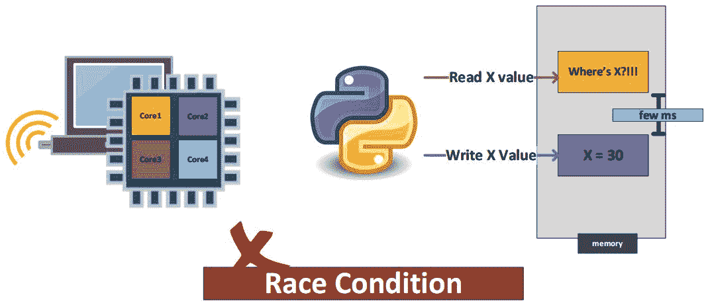
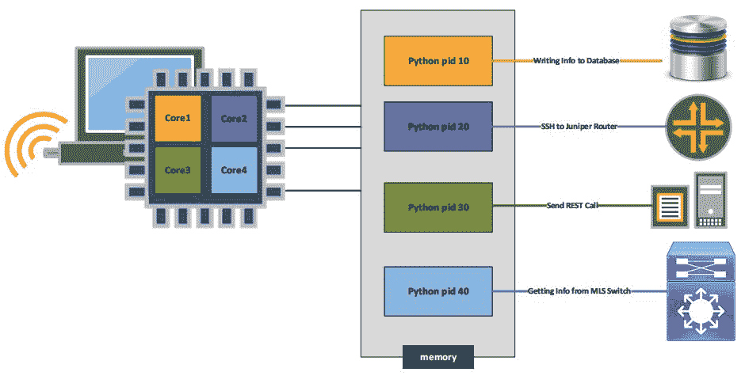
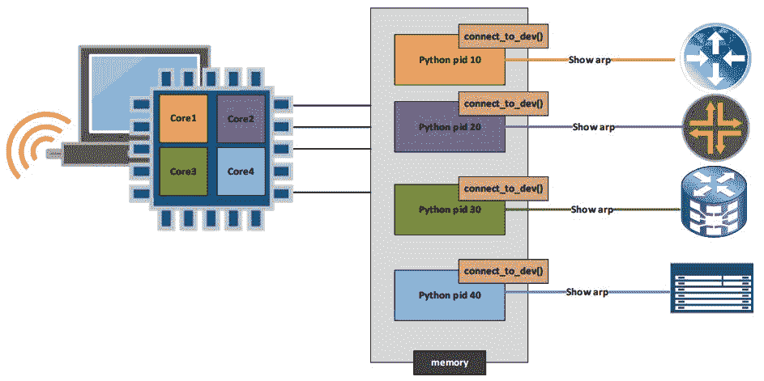

# Python 脚本的并行执行

Python 已经成为网络自动化的*事实上的*标准。许多网络工程师已经每天使用它来自动化网络任务，从配置到操作，再到解决网络问题。在本章中，我们将访问 Python 中的一个高级主题：了解 Python 的多处理特性，并学习如何使用它来加快脚本执行时间。

本章将介绍以下主题：

*   Python 代码在操作系统中的执行方式
*   Python 多处理库

# 计算机如何执行 Python 脚本

这是计算机操作系统执行 Python 脚本的方式：

1.  在 shell 中键入`python <your_awesome_automation_script>.py`时，Python（作为进程运行）指示计算机处理器调度线程（这是最小的处理单元）：


2.  分配的线程将开始逐行执行脚本。线程可以做任何事情，包括与 I/O 设备交互、连接到路由器、打印输出、执行数学方程等等。
3.  一旦脚本到达文件**EOF**的**结尾，线程将被终止并返回到空闲池，供其他进程使用。然后，脚本被终止。**

在 Linux 中，您可以使用`#strace –p <pid>`跟踪特定线程的执行。

分配给脚本的线程越多（处理器或操作系统允许的线程越多），脚本运行的速度就越快。实际上，线程有时被称为**工作线程**或**从线程**。

我有一种感觉，你脑子里有一个小想法：为什么我们不分配很多线程，从所有核心到 Python 脚本，以便快速完成任务？

在没有特殊处理的情况下，将大量线程分配给一个进程的问题是**争用条件**。操作系统将为您的进程分配内存（在本例中，它是 Python 进程），以便在运行时使用并由所有线程访问-*所有线程同时访问*。现在，假设其中一个线程在另一个线程实际写入数据之前读取数据！您不知道线程尝试访问共享数据的顺序；这是竞赛条件：



一个可用的解决方案是使线程获得锁。事实上，Python 在默认情况下被优化为作为单线程进程运行，并且有一个称为**全局解释器锁**（**GIL**的东西）。GIL 不允许多个线程同时执行 Python 代码，以防止线程之间发生冲突。

但是，与其有多个线程，为什么我们没有多个进程呢？

与多线程相比，多进程的优点在于，您不必担心共享数据导致的数据损坏。每个派生的进程都有自己分配的内存，其他 Python 进程不会访问这些内存。这使我们能够同时执行并行任务：



另外，从 Python 的角度来看，每个进程都有自己的 GIL。因此，这里没有资源冲突或种族条件。

# Python 多处理库

`multiprocessing`模块是 Python 的标准库，随 Python 二进制文件一起提供，可从 Python 2.6 获得。还有`threading`模块，它允许您生成多个线程，但它们都共享相同的内存空间。多处理具有比线程更多的优势。其中之一是每个进程的独立内存空间，它可以利用多个 CPU 和内核。

# 多处理入门

首先，需要为 Python 脚本导入模块：

```py
import multiprocessing as mp
```

然后，用 Python 函数包装代码；这将允许进程以该函数为目标，并将其标记为并行执行。

假设我们有连接到路由器并使用`netmiko`库在其上执行命令的代码，我们希望并行连接到所有设备。这是一个示例串行代码，将连接到每个设备并执行传递的命令，然后继续第二个设备，依此类推：

```py
from netmiko import ConnectHandler
from devices import R1, SW1, SW2, SW3, SW4

nodes = [R1, SW1, SW2, SW3, SW4]

for device in nodes:
    net_connect = ConnectHandler(**device)
    output = net_connect.send_command("show run")
    print output
```

Python 文件`devices.py`是在与我们的脚本相同的目录下创建的，它以`dictionary`格式包含每个设备的登录详细信息和凭据：

```py

R1 = {"device_type": "cisco_ios_ssh",
      "ip": "10.10.88.110",
      "port": 22,
      "username": "admin",
      "password": "access123",
      }

SW1 = {"device_type": "cisco_ios_ssh",
       "ip": "10.10.88.111",
       "port": 22,
       "username": "admin",
       "password": "access123",
       }

SW2 = {"device_type": "cisco_ios_ssh",
       "ip": "10.10.88.112",
       "port": 22,
       "username": "admin",
       "password": "access123",
       }

SW3 = {"device_type": "cisco_ios_ssh",
       "ip": "10.10.88.113",
       "port": 22,
       "username": "admin",
       "password": "access123",
       }

SW4 = {"device_type": "cisco_ios_ssh",
       "ip": "10.10.88.114",
       "port": 22,
       "username": "admin",
       "password": "access123",
       }

```

现在，如果我们想使用多处理模块，我们需要重新设计脚本并将代码移动到函数下；然后，我们将分配与设备数量相等的多个进程（一个进程将连接到一个设备并执行命令），并设置进程目标以执行此功能：

```py

from netmiko import ConnectHandler
from devices import R1, SW1, SW2, SW3, SW4
import multiprocessing as mp
from datetime import datetime

nodes = [R1, SW1, SW2, SW3, SW4]

def connect_to_dev(device):

    net_connect = ConnectHandler(**device)
    output = net_connect.send_command("show run")
    print output

processes = []

start_time = datetime.now()
for device in nodes:
    print("Adding Process to the list")
    processes.append(mp.Process(target=connect_to_dev, args=[device]))

print("Spawning the Process")
for p in processes:
    p.start()

print("Joining the finished process to the main truck")
for p in processes:
    p.join()

end_time = datetime.now()
print("Script Execution tooks {}".format(end_time - start_time))

```

在上例中，以下内容适用：

*   我们导入了一个多进程模块作为`mp`。模块中最重要的类之一是`Process`，它将`netmiko connect`函数作为目标参数。此外，它还接受将参数传递给目标函数。
*   然后，我们迭代节点，为每个设备创建一个进程，并将该进程附加到进程列表中。
*   模块中提供的`start()`方法用于生成，然后开始流程执行。
*   最后，通过从脚本结束时间减去脚本开始时间来计算脚本执行时间。

在幕后，执行主脚本的主线程将开始分叉相当于设备数量的进程。它们中的每一个都以一个函数为目标，该函数同时在所有设备上执行`show run`，并将输出存储在一个变量中，而不会相互影响。

这是 Python 内部流程的示例视图：



现在，当您执行完整的代码时，还需要做最后一件事。您需要将 forked 进程连接到主线程/卡车，以便顺利完成程序的执行：

```py
for p in processes:
    p.join()
```


The `join()` method used in the preceding example has nothing to do with the original `join()`, available as a string method; it's only used to join the process to the main thread.

# 进程之间的相互通信

有时，您会有一个进程需要在运行时与其他进程传递或交换信息。多处理模块有一个`Queue`类，该类实现一个特殊列表，进程可以在其中插入和使用数据。此类中有两种方法可用：`get()`和`put()`。`put()`方法用于向`Queue`添加数据，而从队列获取数据则通过`get()`方法完成。在下一个示例中，我们将使用`Queue`将数据从子流程传递到父流程：

```py
import multiprocessing
from netmiko import ConnectHandler
from devices import R1, SW1, SW2, SW3, SW4
from pprint import pprint

nodes = [R1, SW1, SW2, SW3, SW4]

def connect_to_dev(device, mp_queue):
    dev_id = device['ip']
    return_data = {}
    net_connect = ConnectHandler(**device)
    output = net_connect.send_command("show run")
    return_data[dev_id] = output
    print("Adding the result to the multiprocess queue")
    mp_queue.put(return_data)

mp_queue = multiprocessing.Queue()
processes = []

for device in nodes:
    p = multiprocessing.Process(target=connect_to_dev, args=[device, mp_queue])
    print("Adding Process to the list")
    processes.append(p)
    p.start()

for p in processes:
    print("Joining the finished process to the main truck")
    p.join()

results = []
for p in processes:
    print("Moving the result from the queue to the results list")
    results.append(mp_queue.get())

pprint(results)
```

在前面的示例中，以下内容适用：

*   我们从`multiprocess`模块中导入了另一个名为`Queue()`的类，并将其实例化为`mp_queue`变量。
*   然后，在进程创建过程中，我们将此队列作为参数与设备并排附加，这样每个进程都可以访问同一个队列并能够向其写入数据。
*   `connect_to_dev()`函数连接到每个设备并在终端上执行`show run`命令，然后将输出写入共享队列。

Note that we formatted the output as dictionary items, `{ip:<command_output>}`, before adding it to the shared queue using `mp_queue.put()`.

*   在流程完成执行并加入主（父）流程后，我们使用`mp_queue.get()`检索结果列表中的队列项目，然后使用`pprint`预打印输出。

# 总结

在本章中，我们学习了 Python 多处理库以及如何并行实例化和执行 Python 代码。

在下一章中，我们将学习如何准备实验室环境并探索自动化选项以加快服务器部署。