# 准备实验室环境

在本章中，我们将使用两个流行的 Linux 发行版：CentOS 和 Ubuntu 建立一个实验室。CentOS 是一个以企业服务器为目标的社区驱动 Linux 操作系统，以其与**Red Hat enterprise Linux**（**RHEL**的兼容性而闻名。Ubuntu 是另一个基于著名 Debian 操作系统的 Linux 发行版；它目前由 Canonical Ltd.开发，该公司为其提供商业支持。

我们还将学习如何使用名为**Cobbler 的免费开放软件**安装这两个 Linux 发行版，该软件将使用 Linux 映像自动引导服务器，并使用 CentOS 的`kickstart`和 Debian 系统的 Anaconda 对其进行定制。

本章将介绍以下主题：

*   获取 Linux 操作系统
*   在虚拟机监控程序上创建自动化计算机
*   从鞋匠开始

# 获取 Linux 操作系统

在下一节中，我们将在不同的管理程序上创建两台 Linux 机器，CentOS 和 Ubuntu。这些机器将作为我们环境中的自动化服务器。

# 下载 CentOS

CentOS 二进制文件可以通过多种方法下载。您可以直接从世界各地的多个 FTP 服务器下载它们，也可以将它们作为种子从种子用户处下载。此外，CentOS 有两种款式：

*   最小 ISO：提供基本服务器和基本包
*   Everything ISO：提供服务器和主存储库中的所有可用包

首先，前往 CentOS 项目链接（[https://www.centos.org/](https://www.centos.org/) ）点击 Get CentOS Now 按钮，如下图所示：

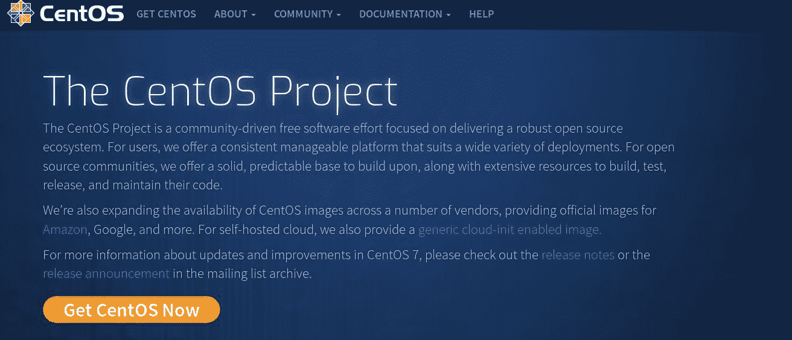

然后，选择最小的 ISO 映像，并从任何可用的下载站点下载它。

CentOS is available for multiple cloud providers, such as Google, Amazon, Azure, and Oracle Cloud. You can find all of the cloud images at [https://cloud.centos.org/centosimg/](https://cloud.centos.org/centosimg/).

# 下载 Ubuntu

Ubuntu 以向终端用户提供良好的桌面体验而广为人知。Canonical（Ubuntu 开发者）与许多服务器供应商合作，在不同的硬件上认证 Ubuntu。Canonical 还为 Ubuntu 提供了一个服务器版本，该版本提供了与 16.04 中相同的功能，例如：

*   Canonical 在 2021 年之前的支持
*   能够在所有主要体系结构上运行—x86、x86-64、ARM v7、ARM64、POWER8 和 IBM s390x（LinuxONE）
*   支持 ZFS，这是下一代卷管理文件系统，是服务器和容器的理想选择
*   LXD Linux 容器管理程序增强，包括 QoS 和资源控制（CPU、内存、块 I/O 和存储配额）
*   安装快照，用于简单的应用程序安装和发布管理。
*   DPDK line speed 内核网络的首次生产发布
*   Linux 4.4 内核和`systemd`服务管理器
*   在 AWS、Microsoft Azure、Joyent、IBM、Google 云平台和 Rackspace 上以来宾身份获得认证
*   Tomcat（v8）、PostgreSQL（v9.5）、Docker v（1.10）、Puppet（v3.8.5）、QEMU（v2.5）、Libvirt（v1.3.1）、LXC（v2.0）、MySQL（v5.6）等的更新

您可以通过浏览[下载 Ubuntu LTShttps://www.ubuntu.com/download/server](https://www.ubuntu.com/download/server) 选择 Ubuntu 16.04 LTS：


# 在虚拟机监控程序上创建自动化计算机

下载 ISO 文件后，我们将在 VMware ESXi 和 KVM 虚拟机监控程序上创建一台 Linux 机器。

# 在 VMware ESXi 上创建 Linux 计算机

我们将使用 VMware vSphere 客户端创建虚拟机。使用根凭据登录到一个可用的 ESXi 服务器。首先，您需要将 Ubuntu 或 CentOS ISO 上传到 VMware 数据存储。然后，按照以下步骤创建机器：

1.  右键单击服务器名称并选择“新建虚拟机”：


2.  选择自定义安装，以便在安装过程中有更多选项：


3.  提供 VM 的名称：AutomationServer。
4.  选择机器版本：8。
5.  选择将在其上创建计算机的数据存储。

6.  选择来宾操作系统：Ubuntu Linux（64 位）或 Red Hat 6/7 版：

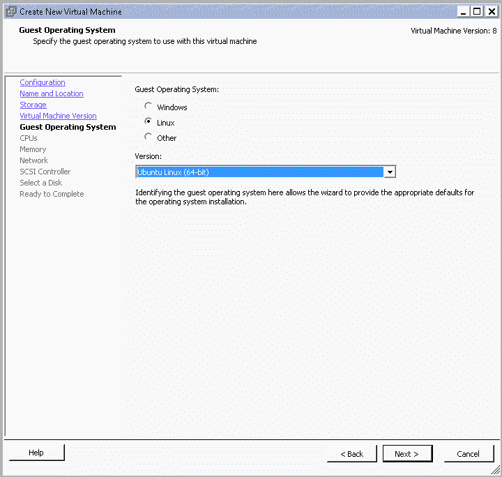

7.  VM 规范不应少于 2 个 vCPU 和 4 GB RAM，以获得高效性能。分别在 CPU 和内存选项卡中选择它们。

8.  在网络选项卡中，选择两个带有 E1000 适配器的接口。其中一个接口将连接到 internet，第二个接口将管理客户端：

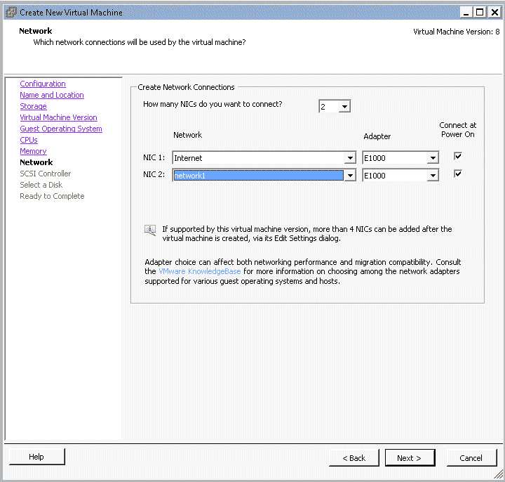

9.  选择系统的默认 SCSI 控制器。在我的例子中，它将是 LSI 逻辑并行的。
10.  选择创建新虚拟磁盘，并提供 20 GB 作为 VM 的磁盘大小。

11.  现在虚拟机已经准备好，您可以开始安装 Linux 操作系统了。将上载的图像与 CD/DVD 驱动器关联，并确保选择了“通电连接”选项：


一旦开始运行，系统将要求您选择一种语言：

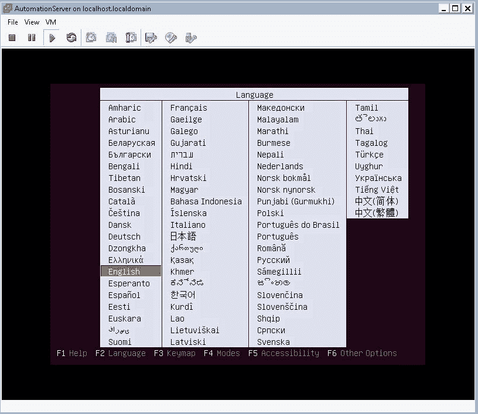

像往常一样完成 CentOS/Ubuntu 安装步骤。

# 在 KVM 上创建 Linux 计算机

我们将使用 KVM 中提供的`virt-manager`实用程序启动 KVM 的桌面管理。然后，我们将创建一个新 VM：

1.  在这里，我们将选择安装方法作为本地安装介质（ISO 映像或 CDROM）：

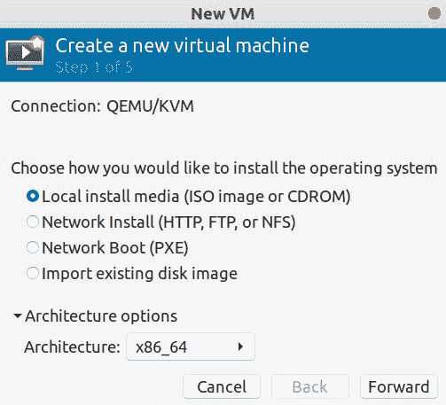

2.  然后，我们将单击浏览并选择先前下载的图像（CentOS 或 Ubuntu）。您会注意到 KVM 成功检测到操作系统类型和版本：

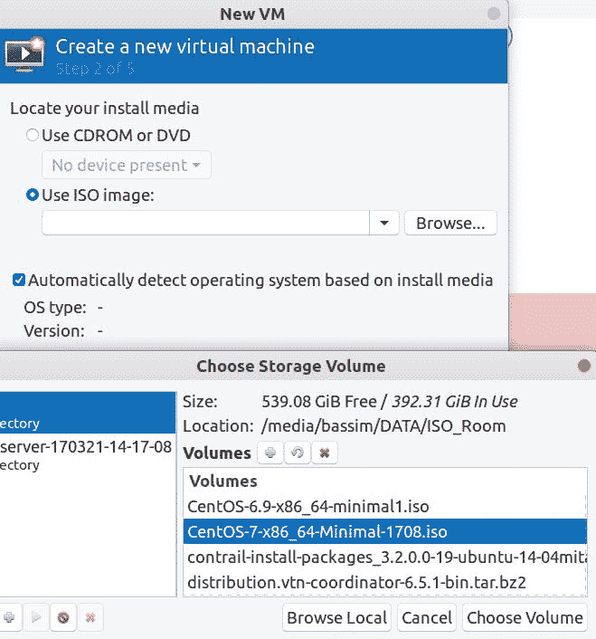

3.  然后，我们将根据 CPU、内存和存储选择机器规格：

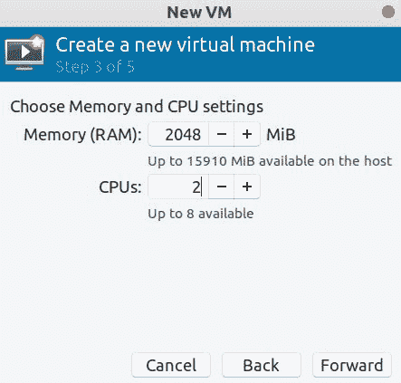

4.  为您的机器选择适当的存储空间：

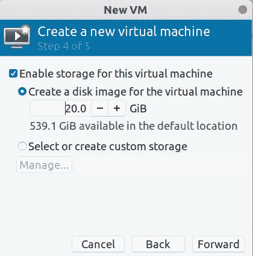

5.  最后一步是选择一个名称，然后单击“安装前自定义配置”选项，以便向自动化服务器添加额外的网络接口。然后，单击 Finish：


另一个窗口打开，其中包含机器的所有规格。单击添加硬件，然后选择网络：

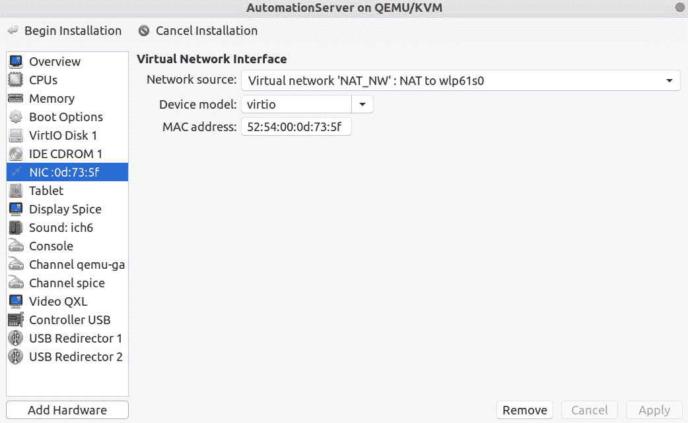

我们将添加另一个网络接口以与客户端通信。第一个网络接口使用 NAT 通过物理无线 NIC 连接到互联网：

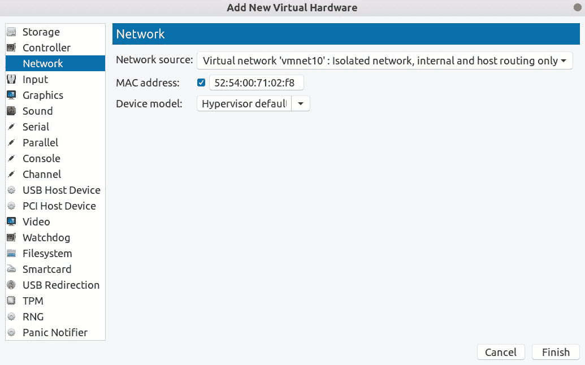

最后，单击主窗口上的开始安装，以便 KVM 将开始分配硬盘并将 ISO 映像连接到虚拟机：

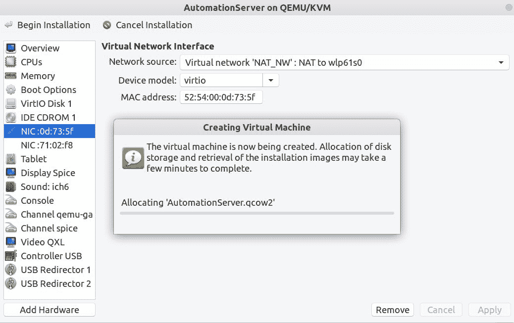

完成后，您将看到以下屏幕：

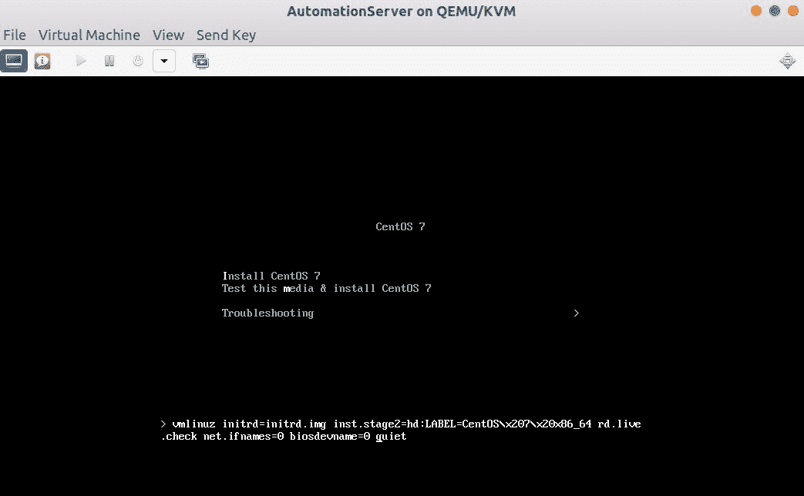

像往常一样完成 CentOS/Ubuntu 安装步骤。

# 从鞋匠开始

Cobbler 是一款开源软件，用于无人值守的基于网络的安装。它利用了多种工具，如 DHCP、FTP、PXE 和其他开源工具（我们将在后面解释），因此您将拥有一站式操作系统安装自动化。目标机器（裸机或虚拟机）必须支持从其**网络接口卡**（**NIC**上的网络引导。此功能使机器能够发送一个 DHCP 请求，该请求将命中 Cobbler 服务器，该服务器将处理其余的请求。

您可以在其 GitHub 页面（[上）阅读更多关于该项目的信息 https://github.com/cobbler/cobbler](https://github.com/cobbler/cobbler) ）。

# 了解鞋匠的工作原理

Cobbler 依靠多种工具向客户端提供**预引导执行环境**（**PXE**功能。首先，它取决于开机时从客户端接收 DHCP 广播消息的 DHCP 服务；然后，它用 IP 地址、子网掩码、下一个服务器（TFTP）以及最后的`pxeLinux.0`进行回复，这是客户端最初向服务器发送 DHCP 消息时请求的加载程序文件名。

第二个工具是承载`pxeLinux.0`和不同分发映像的 TFTP 服务器。

第三个工具是模板渲染实用程序。Cobbler 使用`cheetah`，这是一个用 Python 开发的开源模板引擎，有自己的 DSL（领域特定语言）格式。我们将使用它生成`kickstart`文件。

Kickstart 文件用于自动安装基于 Red Hat 的发行版，如 CentOS、Red Hat 和 Fedora。它对呈现用于安装基于 Debian 的系统的`Anaconda`文件的支持也很有限。

还有其他工具。`reposync`用于将互联网上的在线存储库镜像到 Cobbler 内部的本地目录，使其可供客户使用。`ipmitools`远程管理打开和关闭不同服务器硬件的电源：

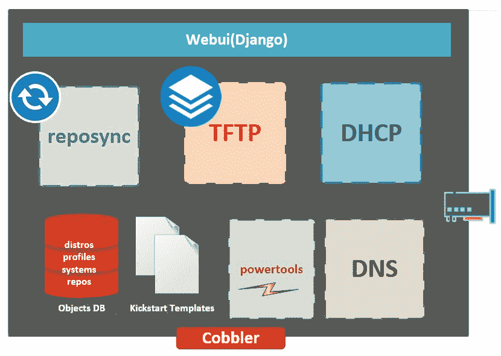

在以下拓扑中，Cobbler 托管在先前安装的自动化服务器上，并将连接到两台服务器。我们将通过 Cobbler 在其上安装 Ubuntu 和 Red Hat。自动化服务器有另一个直接连接到 internet 的接口，以便下载 Cobbler 所需的一些附加软件包，我们将在下一节中看到：

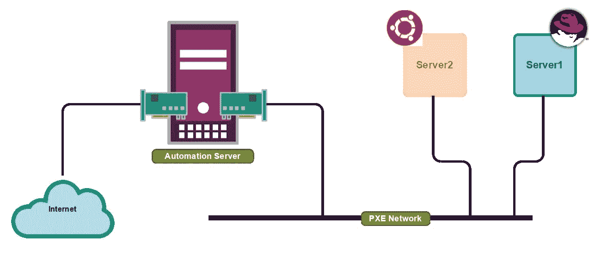

| **服务器** | **IP 地址** |
| 自动化服务器（安装了 cobbler） | `10.10.10.130` |
| 服务器 1（CentOS 机器） | IP 从范围`10.10.10.5`-`10.10.10.10` |
| 服务器 2（Ubuntu 机器） | IP 从范围`10.10.10.5`-`10.10.10.10` |

# 在自动化服务器上安装 Cobbler

我们将首先在我们的自动化服务器（CentOS 或 Ubuntu）上安装一些基本的软件包，如`vim`、`tcpudump`、`wget`和`net-tools`。然后，我们将从`epel`存储库安装`cobbler`包。请注意，这些软件包不是 Cobbler 所必需的，但我们将使用它们来了解 Cobbler 真正的工作原理。

对于 CentOS，请使用以下命令：

```py
yum install vim vim-enhanced tcpdump net-tools wget git -y
```

对于 Ubuntu，请使用以下命令：

```py
sudo apt install vim tcpdump net-tools wget git -y
```

然后，我们需要禁用防火墙。Cobbler 不能很好地使用 SELinux 策略，建议禁用它，特别是当您不熟悉它们时。此外，我们将禁用`iptables`和`firewalld`，因为我们是在实验室中，而不是在生产中。

对于 CentOS，请使用以下命令：

```py
# Disable firewalld service
systemctl disable firewalld
systemctl stop firewalld

# Disable IPTables service
systemctl disable iptables.service
systemctl stop iptables.service

# Set SELinux to permissive instead of enforcing
sed -i s/^SELinux=.*$/SELinux=permissive/ /etc/seLinux/config
setenforce 0
```

对于 Ubuntu，请使用以下命令：

```py
# Disable ufw service
sudo ufw disable

# Disable IPTables service 
sudo iptables-save > $HOME/BeforeCobbler.txt 
sudo iptables -X 
sudo iptables -t nat -F 
sudo iptables -t nat -X 
sudo iptables -t mangle -F 
sudo iptables -t mangle -X 
sudo iptables -P INPUT ACCEPT 
sudo iptables -P FORWARD ACCEPT 
sudo iptables -P OUTPUT ACCEPT

# Set SELinux to permissive instead of enforcing
sed -i s/^SELinux=.*$/SELinux=permissive/ /etc/seLinux/config
setenforce 0
```

最后，重新启动自动化服务器计算机以使更改生效：

```py
reboot
```

现在，我们将安装`cobbler`包。该软件在 CentOS 的`epel`存储库中可用（但我们需要先安装它）。Ubuntu 在上游存储库中没有可用的软件，因此我们将下载源代码并在平台上编译。

对于 CentOS，请使用以下命令：

```py
# Download and Install EPEL Repo
yum install epel-release -y

# Install Cobbler
yum install cobbler -y

#Install cobbler Web UI and other dependencies
yum install cobbler-web dnsmasq fence-agents bind xinetd pykickstart -y
```

在撰写本书时，Cobbler 的当前版本为 2.8.2，于 2017 年 9 月 16 日发布。对于 Ubuntu，我们将从 GIT 存储库克隆最新的软件包，并从源代码构建它：

```py
#install the dependencies as stated in (http://cobbler.github.io/manuals/2.8.0/2/1_-_Prerequisites.html)

sudo apt-get install createrepo apache2 mkisofs libapache2-mod-wsgi mod_ssl python-cheetah python-netaddr python-simplejson python-urlgrabber python-yaml rsync sysLinux atftpd yum-utils make python-dev python-setuptools python-django -y

#Clone the cobbler 2.8 from the github to your server (require internet)
git clone https://github.com/cobbler/cobbler.git
cd cobbler

#Checkout the release28 (latest as the developing of this book)
git checkout release28

#Build the cobbler core package
make install

#Build cobbler web
make webtest
```

在我们的机器上成功安装 Cobbler 后，我们需要对其进行自定义，以更改默认设置以适应我们的网络环境。我们需要更改以下内容：

*   选择`bind`或`dnsmasq`模块来管理 DNS 查询
*   选择`isc`或`dnsmaasq`模块为来自客户端的传入 DHCP 请求提供服务
*   配置 TFTP Cobbler IP 地址（在 Linux 中通常是静态地址）。
*   提供服务于客户端的 DHCP 范围
*   重新启动服务以应用配置

让我们一步一步地看一下配置：

1.  选择`dnsmasq`作为 DNS 服务器：

```py
vim /etc/cobbler/modules.conf
[dns]
module = manage_dnsmasq
vim /etc/cobbler/settings
manage_dns: 1
restart_dns: 1
```

2.  选择`dnsmasq`管理 DHCP 服务：

```py
vim /etc/cobbler/modules.conf

[dhcp]
module = manage_dnsmasq
vim /etc/cobbler/settings
manage_dhcp: 1
restart_dhcp: 1
```

3.  将 Cobbler IP 地址配置为 TFTP 服务器：

```py
vim /etc/cobbler/settings
server: 10.10.10.130
next_server: 10.10.10.130
vim /etc/xinetd.d/tftp
 disable                 = no
```

另外，通过将`pxe_just_once`设置为`0`来启用 PXE 引导循环预防：

```py
pxe_just_once: 0
```

4.  在`dnsmasq`服务模板中添加客户端`dhcp-range`：

```py
vim /etc/cobbler/dnsmasq.template
dhcp-range=10.10.10.5,10.10.10.10,255.255.255.0
```

注意写着`dhcp-option=66,$next_server`的那一行。这意味着 Cobbler 将通过`dnsmasq`提供的 DHCP 服务将之前在设置中配置为 TFTP 引导服务器的`next_server`传递给任何请求 IP 地址的客户端。

5.  启用并重新启动服务：

```py
systemctl enable cobblerd
systemctl enable httpd
systemctl enable dnsmasq

systemctl start cobblerd
systemctl start httpd
systemctl start dnsmasq
```

# 通过 Cobbler 配置服务器

我们现在离第一台服务器的安装和运行还有几步之遥。基本上，我们需要告诉 Cobbler 我们客户的 MAC 地址以及他们有哪些操作系统：

1.  导入 Linux ISO。Cobbler 将自动分析图像并为其创建配置文件：

```py

cobbler import --arch=x86_64 --path=/mnt/cobbler_images --name=CentOS-7-x86_64-Minimal-1708

task started: 2018-03-28_132623_import
task started (id=Media import, time=Wed Mar 28 13:26:23 2018)
Found a candidate signature: breed=redhat, version=rhel6
Found a candidate signature: breed=redhat, version=rhel7
Found a matching signature: breed=redhat, version=rhel7
Adding distros from path /var/www/cobbler/ks_mirror/CentOS-7-x86_64-Minimal-1708-x86_64:
creating new distro: CentOS-7-Minimal-1708-x86_64
trying symlink: /var/www/cobbler/ks_mirror/CentOS-7-x86_64-Minimal-1708-x86_64 -> /var/www/cobbler/links/CentOS-7-Minimal-1708-x86_64
creating new profile: CentOS-7-Minimal-1708-x86_64
associating repos
checking for rsync repo(s)
checking for rhn repo(s)
checking for yum repo(s)
starting descent into /var/www/cobbler/ks_mirror/CentOS-7-x86_64-Minimal-1708-x86_64 for CentOS-7-Minimal-1708-x86_64
processing repo at : /var/www/cobbler/ks_mirror/CentOS-7-x86_64-Minimal-1708-x86_64
need to process repo/comps: /var/www/cobbler/ks_mirror/CentOS-7-x86_64-Minimal-1708-x86_64
looking for /var/www/cobbler/ks_mirror/CentOS-7-x86_64-Minimal-1708-x86_64/repodata/*comps*.xml
Keeping repodata as-is :/var/www/cobbler/ks_mirror/CentOS-7-x86_64-Minimal-1708-x86_64/repodata
*** TASK COMPLETE ***
```

You may need to mount the Linux ISO image before importing it to a mount point, by using `mount -O loop /root/<image_iso> /mnt/cobbler_img/`.

您可以运行`cobbler profile report`命令检查创建的配置文件：

```py
cobbler profile report

Name                           : CentOS-7-Minimal-1708-x86_64
TFTP Boot Files                : {}
Comment                        : 
DHCP Tag                       : default
Distribution                   : CentOS-7-Minimal-1708-x86_64
Enable gPXE?                   : 0
Enable PXE Menu?               : 1
Fetchable Files                : {}
Kernel Options                 : {}
Kernel Options (Post Install)  : {}
Kickstart                      : /var/lib/cobbler/kickstarts/sample_end.ks
Kickstart Metadata             : {}
Management Classes             : []
Management Parameters          : <<inherit>>
Name Servers                   : []
Name Servers Search Path       : []
Owners                         : ['admin']
Parent Profile                 : 
Internal proxy                 : 
Red Hat Management Key         : <<inherit>>
Red Hat Management Server      : <<inherit>>
Repos                          : []
Server Override                : <<inherit>>
Template Files                 : {}
Virt Auto Boot                 : 1
Virt Bridge                    : xenbr0
Virt CPUs                      : 1
Virt Disk Driver Type          : raw
Virt File Size(GB)             : 5
Virt Path                      : 
Virt RAM (MB)                  : 512
Virt Type                      : kvm
```

您可以看到，`import`命令自动填充了许多字段，如`Kickstart`、`RAM`、`operating system`和`initrd/kernel`文件位置。

2.  将任何其他存储库添加到配置文件（可选）：

```py
cobbler repo add --mirror=https://dl.fedoraproject.org/pub/epel/7/x86_64/ --name=epel-local --priority=50 --arch=x86_64 --breed=yum

cobbler reposync 
```

现在，编辑配置文件，并将创建的存储库添加到可用存储库列表中：

```py
cobbler profile edit --name=CentOS-7-Minimal-1708-x86_64 --repos="epel-local"
```

3.  添加客户端 MAC 地址并将其链接到创建的配置文件：

```py
cobbler system add --name=centos_client --profile=CentOS-7-Minimal-1708-x86_64  --mac=00:0c:29:4c:71:7c --ip-address=10.10.10.5 --subnet=255.255.255.0 --static=1 --hostname=centos-client  --gateway=10.10.10.1 --name-servers=8.8.8.8 --interface=eth0
```

`--hostname`字段对应本地系统名称，并使用`--ip-address`、`--subnet`和`--gateway`选项配置客户端网络。这将使 Cobbler 使用这些选项生成一个`kickstart`文件。

如果需要自定义服务器并添加其他包、配置防火墙、ntp 以及配置分区和硬盘布局，则可以将这些设置添加到`kickstart`文件中。Cobbler 在`/var/lib/cobbler/kickstarts/sample.ks`下提供示例文件，您可以将其复制到另一个文件夹，并在前面命令的`--kickstart`参数中提供。

You can integrate Ansible inside the `kickstart` file by running Ansible in pull mode (instead the default push mode). Ansible will download the playbook from an online GIT repository (such as GitHub or GitLab) and will execute it after that.

4.  指示 Cobbler 生成为我们的客户服务所需的配置文件，并使用以下命令使用新信息更新内部数据库：

```py
#cobbler sync  task started: 2018-03-28_141922_sync
task started (id=Sync, time=Wed Mar 28 14:19:22 2018)
running pre-sync triggers
cleaning trees
removing: /var/www/cobblimg/CentOS-7-Minimal-1708-x86_64
removing: /var/www/cobblimg/Ubuntu_Server-x86_64
removing: /var/www/cobblimg/Ubuntu_Server-hwe-x86_64
removing: /var/lib/tftpboot/pxeLinux.cfg/default
removing: /var/lib/tftpboot/pxeLinux.cfg/01-00-0c-29-4c-71-7c
removing: /var/lib/tftpboot/grub/01-00-0C-29-4C-71-7C
removing: /var/lib/tftpboot/grub/efidefault
removing: /var/lib/tftpboot/grub/grub-x86_64.efi
removing: /var/lib/tftpboot/grub/images
removing: /var/lib/tftpboot/grub/grub-x86.efi
removing: /var/lib/tftpboimg/CentOS-7-Minimal-1708-x86_64
removing: /var/lib/tftpboimg/Ubuntu_Server-x86_64
removing: /var/lib/tftpboimg/Ubuntu_Server-hwe-x86_64
removing: /var/lib/tftpboot/s390x/profile_list
copying bootloaders
trying hardlink /var/lib/cobbler/loaders/grub-x86_64.efi -> /var/lib/tftpboot/grub/grub-x86_64.efi
trying hardlink /var/lib/cobbler/loaders/grub-x86.efi -> /var/lib/tftpboot/grub/grub-x86.efi
copying distros to tftpboot
copying files for distro: Ubuntu_Server-x86_64
trying hardlink /var/www/cobbler/ks_mirror/Ubuntu_Server-x86_64/install/netboot/ubuntu-installer/amd64/Linux -> /var/lib/tftpboimg/Ubuntu_Server-x86_64/Linux
trying hardlink /var/www/cobbler/ks_mirror/Ubuntu_Server-x86_64/install/netboot/ubuntu-installer/amd64/initrd.gz -> /var/lib/tftpboimg/Ubuntu_Server-x86_64/initrd.gz
copying files for distro: Ubuntu_Server-hwe-x86_64
trying hardlink /var/www/cobbler/ks_mirror/Ubuntu_Server-x86_64/install/hwe-netboot/ubuntu-installer/amd64/Linux -> /var/lib/tftpboimg/Ubuntu_Server-hwe-x86_64/Linux
trying hardlink /var/www/cobbler/ks_mirror/Ubuntu_Server-x86_64/install/hwe-netboot/ubuntu-installer/amd64/initrd.gz -> /var/lib/tftpboimg/Ubuntu_Server-hwe-x86_64/initrd.gz
copying files for distro: CentOS-7-Minimal-1708-x86_64
trying hardlink /var/www/cobbler/ks_mirror/CentOS-7-x86_64-Minimal-1708-x86_img/pxeboot/vmlinuz -> /var/lib/tftpboimg/CentOS-7-Minimal-1708-x86_64/vmlinuz
trying hardlink /var/www/cobbler/ks_mirror/CentOS-7-x86_64-Minimal-1708-x86_img/pxeboot/initrd.img -> /var/lib/tftpboimg/CentOS-7-Minimal-1708-x86_64/initrd.img
copying images
generating PXE configuration files
generating: /var/lib/tftpboot/pxeLinux.cfg/01-00-0c-29-4c-71-7c
generating: /var/lib/tftpboot/grub/01-00-0C-29-4C-71-7C
generating PXE menu structure
copying files for distro: Ubuntu_Server-x86_64
trying hardlink /var/www/cobbler/ks_mirror/Ubuntu_Server-x86_64/install/netboot/ubuntu-installer/amd64/Linux -> /var/www/cobblimg/Ubuntu_Server-x86_64/Linux
trying hardlink /var/www/cobbler/ks_mirror/Ubuntu_Server-x86_64/install/netboot/ubuntu-installer/amd64/initrd.gz -> /var/www/cobblimg/Ubuntu_Server-x86_64/initrd.gz
Writing template files for Ubuntu_Server-x86_64
copying files for distro: Ubuntu_Server-hwe-x86_64
trying hardlink /var/www/cobbler/ks_mirror/Ubuntu_Server-x86_64/install/hwe-netboot/ubuntu-installer/amd64/Linux -> /var/www/cobblimg/Ubuntu_Server-hwe-x86_64/Linux
trying hardlink /var/www/cobbler/ks_mirror/Ubuntu_Server-x86_64/install/hwe-netboot/ubuntu-installer/amd64/initrd.gz -> /var/www/cobblimg/Ubuntu_Server-hwe-x86_64/initrd.gz
Writing template files for Ubuntu_Server-hwe-x86_64
copying files for distro: CentOS-7-Minimal-1708-x86_64
trying hardlink /var/www/cobbler/ks_mirror/CentOS-7-x86_64-Minimal-1708-x86_img/pxeboot/vmlinuz -> /var/www/cobblimg/CentOS-7-Minimal-1708-x86_64/vmlinuz
trying hardlink /var/www/cobbler/ks_mirror/CentOS-7-x86_64-Minimal-1708-x86_img/pxeboot/initrd.img -> /var/www/cobblimg/CentOS-7-Minimal-1708-x86_64/initrd.img
Writing template files for CentOS-7-Minimal-1708-x86_64
rendering DHCP files
rendering DNS files
rendering TFTPD files
generating /etc/xinetd.d/tftp
processing boot_files for distro: Ubuntu_Server-x86_64
processing boot_files for distro: Ubuntu_Server-hwe-x86_64
processing boot_files for distro: CentOS-7-Minimal-1708-x86_64
cleaning link caches
running post-sync triggers
running python triggers from /var/lib/cobbler/triggers/sync/post/*
running python trigger cobbler.modules.sync_post_restart_services
running: service dnsmasq restart
received on stdout: 
received on stderr: Redirecting to /bin/systemctl restart dnsmasq.service

running shell triggers from /var/lib/cobbler/triggers/sync/post/*
running python triggers from /var/lib/cobbler/triggers/change/*
running python trigger cobbler.modules.scm_track
running shell triggers from /var/lib/cobbler/triggers/change/*
*** TASK COMPLETE ***
```

一旦启动 CentOS 客户端，您将注意到它进入 PXE 进程并通过`PXE_Network`发送 DHCP 消息。Cobbler 将用一个 IP 地址、一个`PXELinux0`文件和分配给该 MAC 地址的所需映像进行响应：

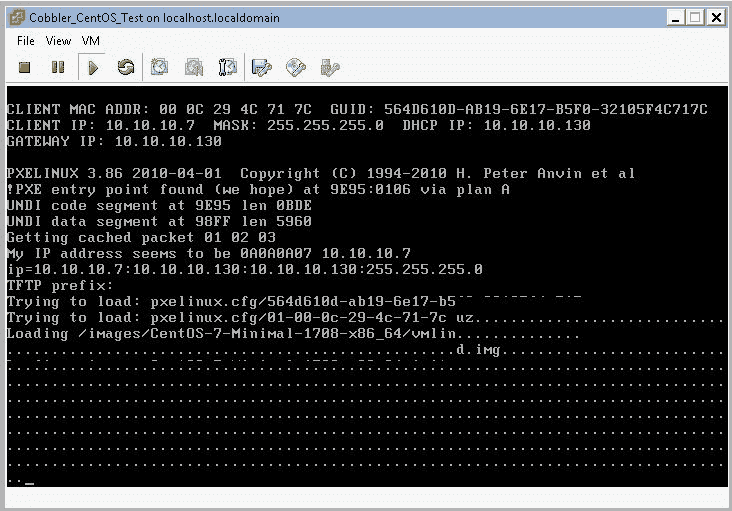

Cobbler 完成 CentOS 安装后，您将在计算机中看到正确配置的主机名：

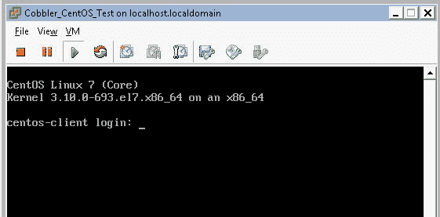

对于 Ubuntu 机器，您可以执行相同的步骤。

# 总结

在本章中，您学习了如何通过在虚拟机监控程序上安装两台 Linux 机器（CentOS 和 Ubuntu）来准备实验室环境。然后，我们探索了自动化选项，并通过安装 Cobbler 加快了服务器部署。

在下一章中，您将学习如何将 Python 脚本中的命令直接发送到操作系统外壳，并研究返回的输出。