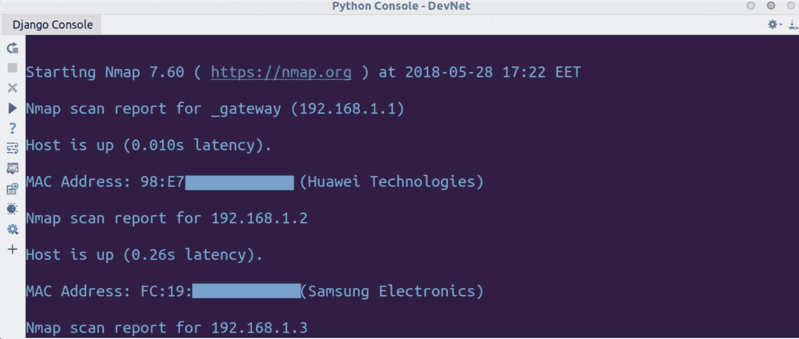
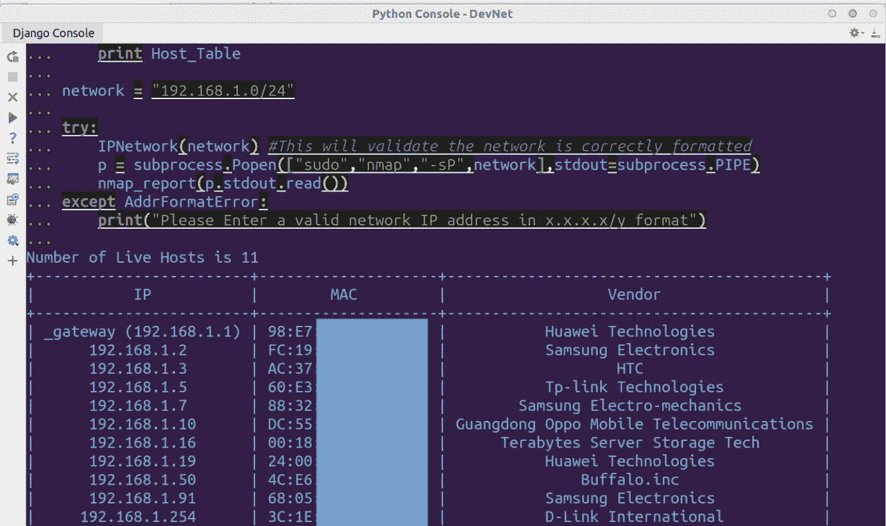
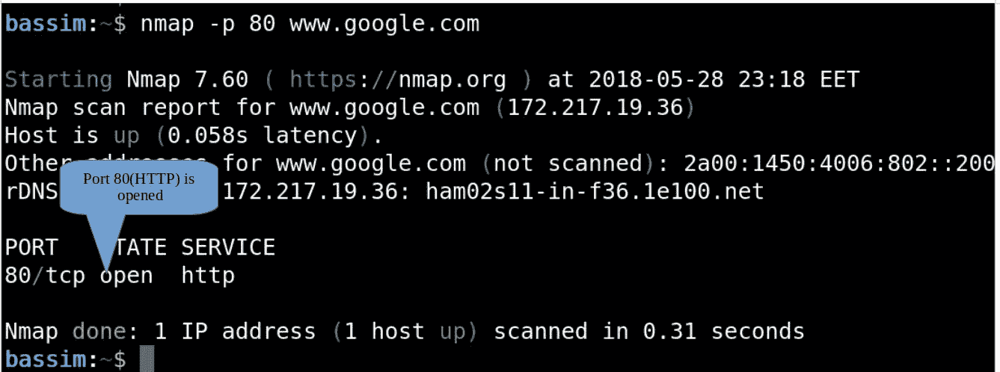
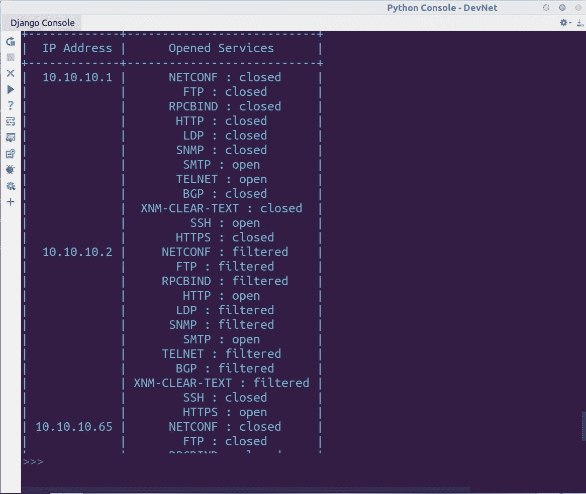
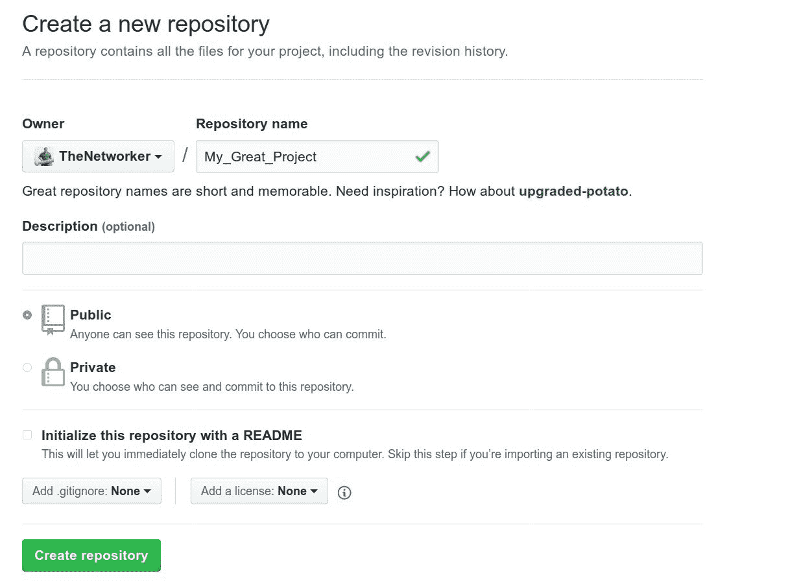
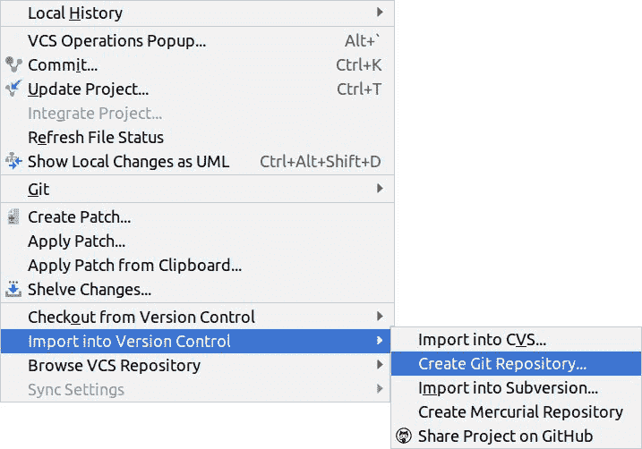
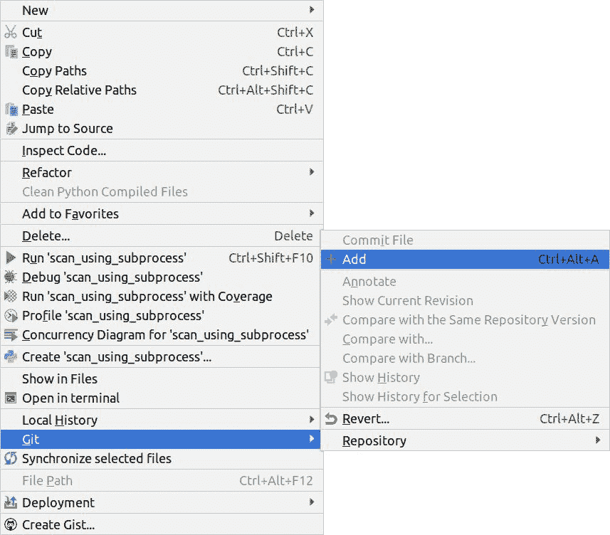
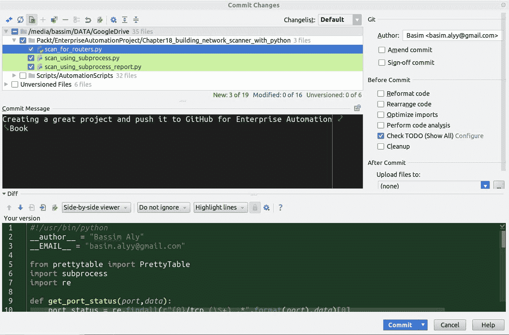
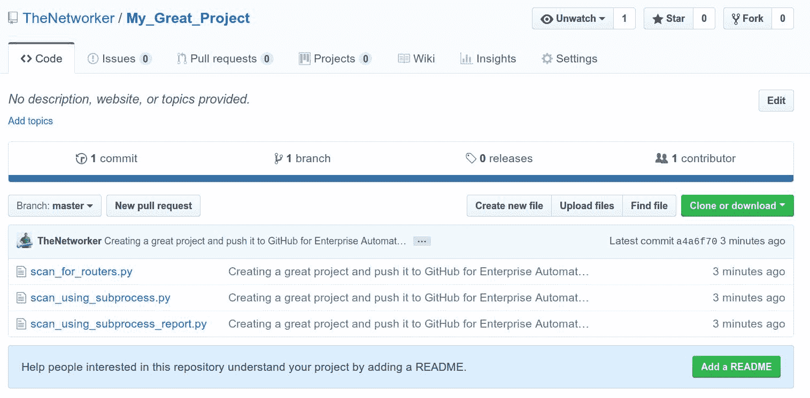

# 使用 Python 构建网络扫描程序

在本章中，我们将构建一个网络扫描程序，它可以识别网络上的活动主机，我们还将对其进行扩展，包括猜测每个主机上运行的操作系统和打开/关闭的端口。通常，收集这些信息需要多种工具和一些 LinuxNinja 技能才能获得所需的信息，但是，使用 Python，我们可以构建自己的网络扫描程序代码，其中包括任何工具，并且我们可以获得定制的输出。

本章将介绍以下主题：

*   了解网络扫描器
*   用 Python 构建网络扫描程序
*   在 GitHub 上共享您的代码

# 了解网络扫描器

网络扫描仪用于扫描第 2 层和第 3 层中提供的网络 ID 范围。它可以为数十万台计算机发送请求和分析响应。此外，您还可以扩展其功能，通过 Samba 和 NetBIOS 协议显示一些共享资源，以及运行共享协议的服务器上未受保护的数据的内容。网络扫描器在渗透测试中的另一个用途是，一名白帽黑客试图模拟对网络资源的攻击，以发现漏洞并评估公司安全性。渗透测试的最终目标是生成一份包含目标系统中所有弱点的报告，以便原点可以针对潜在的实际攻击加强和增强安全策略。

# 用 Python 构建网络扫描程序

Python 工具提供了许多本机模块，并支持使用套接字和 TCP/IP。此外，Python 可以使用系统上现有的第三方命令来启动所需的扫描并返回结果。这可以使用我们之前讨论过的`subprocess`模块完成，在[第 9 章](09.html#3Q2800-9cfcdc5beecd470bbeda046372f0337f)中，*使用子流程模块*。一个简单的示例是使用 Nmap 扫描子网，如下代码所示：

```py
import subprocess
from netaddr import IPNetwork
network = "192.168.1.0/24"
p = subprocess.Popen(["sudo", "nmap", "-sP", network], stdout=subprocess.PIPE)

for line in p.stdout:
    print(line)
```

在本例中，我们可以看到以下内容：

*   开始时，我们导入了要在脚本中使用的`subprocess`模块。
*   然后，我们用`network`参数定义了要扫描的网络。请注意，我们使用了 CIDR 表示法，但我们可以使用子网掩码，并使用 Python`netaddr`模块将其转换为 CIDR 表示法。
*   `subprocess`中的`Popen()`类用于创建一个对象，该对象将发送常规 Nmap 命令并扫描网络。请注意，我们添加了一些标志`-sP`，以调整 Nmap 操作，并将输出重定向到`subprocess.PIPE`创建的特殊管道。
*   最后，我们迭代创建的管道并打印每一行。

脚本输出如下所示：

**** Access to network ports on Linux requires root access, or your account must belong to a sudoers group in order to avoid any problems in the script. Also, the `nmap` package should be installed on the system prior to running the Python code.

这是一个简单的 Python 脚本，我们可以直接使用 Nmap 工具，而不是在 Python 中使用它。然而，用 Python 代码包装 Nmap（或任何其他系统命令）使我们能够灵活地裁剪输出并以任何方式对其进行自定义。在下一节中，我们将增强脚本并向其添加更多功能。

# 加强守则

尽管 Nmap 的输出为我们提供了扫描网络上活动主机的概览，但我们可以对其进行增强并获得更好的输出视图。例如，我需要知道输出开始时的主机总数，然后是每个主机的 IP 地址、MAC 地址和 MAC 供应商，但要以表格形式，这样我就可以轻松找到任何主机以及与之相关的所有信息。

因此，我将设计一个函数并将其命名为`nmap_report()`。此功能将获取`subprocess`管道生成的标准输出，并提取所需信息，并将其格式化为表格格式：

```py
def nmap_report(data):
    mac_flag = ""
    ip_flag = ""
    Host_Table = PrettyTable(["IP", "MAC", "Vendor"])
    number_of_hosts = data.count("Host is up ")

    for line in data.split("\n"):
        if "MAC Address:" in line:
            mac = line.split("(")[0].replace("MAC Address: ", "")
            vendor = line.split("(")[1].replace(")", "")
            mac_flag = "ready"
        elif "Nmap scan report for" in line:
            ip = re.search(r"Nmap scan report for (.*)", line).groups()[0]
            ip_flag = "ready"

        if mac_flag == "ready" and ip_flag == "ready":
            Host_Table.add_row([ip, mac, vendor])
            mac_flag = ""
            ip_flag = ""

    print("Number of Live Hosts is {}".format(number_of_hosts))
    print Host_Table
```

从最简单的部分开始，我们可以通过计算传递的输出中出现的`Host is up`并将其分配给`number_of_hosts`参数来获得活动主机的数量。

其次，Python 有一个很好的模块，名为`PrettyTable`，它可以创建一个文本表，并根据其中的数据处理单元格大小。模块接受表头作为列表，并使用`add_row()`函数向创建的表中添加行。因此，第一件事是导入这个模块（安装后，如果尚未安装）。在我们的示例中，我们将向`PrettyTable`类（从`PrettyTable`模块导入）传递一个包含三项（`IP`、`MAC`、`Vendor`的列表，以创建表头。

现在，为了填充此表，我们将在`\n`（回车）上拆分输出。分割的结果将是一个列表，我们可以对其进行迭代以获取特定信息，如 MAC 地址和 IP 地址。我们使用了一些拆分和替换黑客来单独提取 MAC 地址。此外，我们还使用正则表达式`search`函数从输出中获取 IP 地址部分（或主机名，如果启用了 DNS）。

最后，我们将此信息添加到创建的`Host_Table`中，并继续迭代下一行。

以下是完整的脚本：

```py
#!/usr/bin/python
__author__ = "Bassim Aly"
__EMAIL__ = "basim.alyy@gmail.com"

import subprocess
from netaddr import IPNetwork, AddrFormatError
from prettytable import PrettyTable
import re

def nmap_report(data):
    mac_flag = ""
    ip_flag = ""
    Host_Table = PrettyTable(["IP", "MAC", "Vendor"])
    number_of_hosts = data.count("Host is up ")

    for line in data.split("\n"):
        if "MAC Address:" in line:
            mac = line.split("(")[0].replace("MAC Address: ", "")
            vendor = line.split("(")[1].replace(")", "")
            mac_flag = "ready"
        elif "Nmap scan report for" in line:
            ip = re.search(r"Nmap scan report for (.*)", line).groups()[0]
            ip_flag = "ready"

        if mac_flag == "ready" and ip_flag == "ready":
            Host_Table.add_row([ip, mac, vendor])
            mac_flag = ""
            ip_flag = ""

    print("Number of Live Hosts is {}".format(number_of_hosts))
    print Host_Table

network = "192.168.1.0/24"

try:
    IPNetwork(network) 
    p = subprocess.Popen(["sudo", "nmap", "-sP", network], stdout=subprocess.PIPE)
    nmap_report(p.stdout.read())
except AddrFormatError:
    print("Please Enter a valid network IP address in x.x.x.x/y format")
```

注意，我们还使用`netaddr.IPNetwork()`类向`subprocess`命令添加了一个预检查。此类将在执行`subprocess`命令之前验证网络是否正确格式化*，否则类将引发异常，该异常应由`AddrFormatError`异常类处理，并将向用户打印自定义错误消息。*

脚本输出为：



现在，如果我们将网络更改为不正确的值（子网掩码错误或网络 ID 无效），`IPNetwork()`类将抛出异常，并打印此错误消息：

```py
network = "192.168.300.0/24"

```


# 扫描服务

在主机上运行服务通常会打开操作系统中的一个端口并开始侦听它，以便接受传入的 TCP 通信并启动三方握手。在 Nmap 中，您可以在特定端口上发送 SYN 数据包，如果主机使用 SYN-ACK 进行响应，则服务正在运行并侦听该端口。

让我们测试 HTTP 端口，例如在[google.com](https://www.google.com/)中，使用`nmap`：

```py
nmap -p 80 www.google.com
```



我们可以使用相同的概念来发现路由器上正在运行的服务。例如，运行 BGP 守护进程的路由器将侦听端口`179`中的打开/更新/保持活动/通知消息。如果要监视路由器，则应启用 SNMP 服务并侦听传入的 SNMP get/set 消息。MPLS LDP 通常会听取`646`与其他邻居建立关系。以下是路由器上运行的常见服务及其侦听端口的列表：

| **服务** | **监听端口** |
| 文件传输协议 | `21` |
| SSH | `22` |
| 电信网 | `23` |
| SMTP | `25` |
| 超文本传输协议 | `80` |
| HTTPS | `443` |
| SNMP | `161` |
| BGP | `179` |
| 自民党 | `646` |
| RPCBIND | `111` |
| 网络形态 | `830` |
| XNM-明文 | `3221` |

我们可以创建一个包含所有这些端口的字典，并使用`subprocess`和 Nmap 扫描它们。然后，我们使用返回的输出创建表，其中列出了每次扫描的打开和关闭端口。此外，通过一些额外的逻辑，我们可以尝试关联信息来猜测设备功能的操作系统类型。例如，如果该设备正在侦听端口`179`（BGP 端口），则该设备很可能是一个网络网关，如果它侦听`389`或`636`，则该设备正在运行 LDAP 应用程序，并且可能是公司 active directory。这将有助于我们在 pen 测试期间对设备发起适当的攻击。

无需进一步讨论，让我们快速将想法和注释放入以下脚本中：

```py
#!/usr/bin/python
__author__ = "Bassim Aly"
__EMAIL__ = "basim.alyy@gmail.com"

from prettytable import PrettyTable
import subprocess
import re

def get_port_status(port, data):
    port_status = re.findall(r"{0}/tcp (\S+) .*".format(port), data)[0]
    return port_status

Router_Table = PrettyTable(["IP Address", "Opened Services"])
router_ports = {"FTP": 21,
                "SSH": 22,
                "TELNET": 23,
                "SMTP": 25,
                "HTTP": 80,
                "HTTPS": 443,
                "SNMP": 161,
                "BGP": 179,
                "LDP": 646,
                "RPCBIND": 111,
                "NETCONF": 830,
                "XNM-CLEAR-TEXT": 3221}

live_hosts = ["10.10.10.1", "10.10.10.2", "10.10.10.65"]

services_status = {}
for ip in live_hosts:
    for service, port in router_ports.iteritems():
        p = subprocess.Popen(["sudo", "nmap", "-p", str(port), ip], stdout=subprocess.PIPE)
        port_status = get_port_status(port, p.stdout.read())
        services_status[service] = port_status

    services_status_joined = "\n".join("{} : {}".format(key, value) for key, value in services_status.iteritems())

    Router_Table.add_row([ip, services_status_joined])

print Router_Table
```

在本例中，我们可以看到以下内容：

*   我们开发了一个名为`get_port_status()`的函数，用于获取 Nmap 端口扫描结果，并使用`findall()`函数中的正则表达式搜索端口状态（打开、关闭、过滤等）。它返回端口状态结果。

*   然后，我们在`router_ports`字典中添加了映射到服务名称的服务端口，因此我们可以使用相应的服务名称（字典键）访问任何端口值。此外，我们在`live_hosts`列表中定义了路由器主机的 IP 地址。请注意，我们可以使用带有`-sP`标志的`nmap`来获取活动主机，就像我们在前面的脚本中所做的那样。
*   现在，我们可以迭代`live_hosts`列表中的每个 IP 地址，并执行 Nmap 扫描`router_ports`字典中的每个端口。这需要一个嵌套的`for`循环，因此对于每个设备，我们迭代一个端口列表，以此类推。结果将添加到`services_status`字典中，服务名称为字典键，端口状态为字典值。
*   最后，我们将结果添加到使用`prettytable`模块创建的`Router_Table`中，以获得一个好看的表。

脚本输出如下所示：



# 在 GitHub 上共享您的代码

GitHub 是一个使用 Git 共享代码并与其他人协作完成公共项目的地方。Git 是由 Linus Trovalds 发明和创建的源代码版本控制平台，Linus Trovalds 创建了 Linux，但在维护 Linux 开发时遇到了问题，有大量开发人员对此做出了贡献。他创建了一个非集中式版本控制，任何人都可以获取整个代码（称为克隆或分叉），进行更改，然后将其推回到中央存储库，与其他开发人员的代码合并。Git 成为许多开发人员在项目中合作的首选方法。您可以通过 GitHub 提供的 15 分钟课程学习如何以交互方式在 Git 中编写代码：[https://try.github.io](https://try.github.io) 。

GitHub 是承载这些项目的网站，它使用 Git 进行版本控制。它就像一个开发者社交媒体平台，您可以在其中跟踪代码开发、编写 wiki 或提出问题/错误报告并获得开发者的反馈。同一项目的人员可以讨论项目进度并共享代码，以构建更好更快的软件。另外，一些公司认为你在 GITHUB 账户中共享的代码和存储库是一个在线简历，它可以衡量你的技能以及如何用感兴趣的语言进行编码。

# 在 GitHub 上创建帐户

在共享您的代码或下载其他代码之前，首先要做的是创建您的帐户。

前往[https://github.com/join?source=header-主页](https://github.com/join?source=header-home)并选择用户名、密码和电子邮件地址，然后单击绿色的“创建帐户”按钮。

第二件事是选择你的计划。默认情况下，免费计划很好，因为它为您提供了无限的公共存储库，您可以推送用任何喜欢的语言开发的任何代码。但是，免费计划并没有将您的存储库设置为私有，并允许其他人搜索和下载。如果你不是在你的公司从事秘密或商业项目，那么它不是交易破坏者，但是你需要确保你不共享任何敏感信息，例如密码、令牌或代码中的公共 IP 地址。

# 创建和推送代码

现在，我们已经准备好与其他人共享代码。创建 GitHub 帐户后的第一件事是创建一个存储库来存放文件。通常，您为每个项目（而不是每个文件）创建一个存储库，其中包含相互关联的项目资产和文件。

单击右上角您的个人资料图片旁边的+图标，创建一个新的存储库：


您将被重定向到一个新页面，您可以在其中输入存储库名称。请注意，您可以选择任何您喜欢的存储库，但它不应与您的配置文件中的其他存储库冲突。此外，您将获得此回购协议的唯一 URL，以便任何人都可以访问它。您可以设置回购设置，例如它是公共的还是私有的（仅适用于付费计划），以及是否要使用自述文件对其进行初始化。此文件使用**标记**文本格式编写，其中包括有关您的项目的信息，以及其他开发人员在使用您的项目时应遵循的步骤。

最后，您可以选择添加一个`.gitignore`文件，告诉 Git 忽略跟踪目录中特定类型的文件，例如日志、`pyc`、编译文件、视频等：



最后，您的回购协议被创建，您将获得一个唯一的 URL。请记下此 URL，因为我们稍后将在向其推送文件时使用它：


现在是时候分享你的代码了。我将使用 PyCharm 中集成的 Git 功能来完成这项工作，尽管您可以在 CLI 中执行相同的步骤。此外，还有许多其他 GUI 工具（包括 GitHub 本身提供的一个）可以管理 GIT repo。我强烈建议您参加 GitHub 提供的 Git 培训（[https://try.github.io](https://try.github.io/) 在执行这些步骤之前：

1.  转到 VCS |导入到版本控制|创建 Git 存储库：



2.  选择本地存储项目文件的文件夹：


这将在文件夹中创建本地 Git repo。

3.  突出显示侧边栏中需要跟踪的所有文件，右键单击它们，然后选择 Git |添加：



PyCharm uses file color code to indicate the type of file tracked in Git. When the files are not tracked, it will color them red and when the files are added to Git, it will color them green. This allows you to easily know file status without running commands.

4.  通过转到 VCS | Git | Remotes，在 GitHub 中定义将映射到本地存储库的远程存储库：


5.  输入我们创建回购协议时记录的回购协议名称和 URL；单击“确定”两次以退出窗口：


6.  最后一步是提交代码。转到 VCS | Git |提交，从打开的弹出窗口中，选择跟踪文件，在提交消息部分输入描述性消息，单击旁边的小箭头并选择提交和推送，而不是点击提交。可能会打开一个对话框，告诉您未定义 Git 用户名。只需输入您的姓名和电子邮件，并确保勾选“设置全局属性”框，然后点击“设置并提交”：



PyCharm 为您提供了一个选项，可以推送到 Gerrit 进行代码审查。如果您有一个，您也可以在其中共享您的文件。否则，单击推送。

将显示一条通知消息，告诉您推送已成功完成：


您可以从浏览器刷新 GitHub repo URL，您将看到其中存储的所有文件：



现在，每当您在跟踪文件和提交中对代码进行任何更改时，这些更改都将被跟踪并添加到版本控制系统中，并可在 GitHub 中供其他用户下载和评论。

# 总结

在本章中，我们构建了网络扫描仪，可在授权渗透测试期间使用，并学习了如何扫描设备上运行的不同服务和应用程序，以检测其类型。此外，我们将我们的代码共享给 GitHub，这样我们就可以保留不同版本的代码，还允许其他开发人员使用我们的共享代码并对其进行增强，然后再与其他人共享。