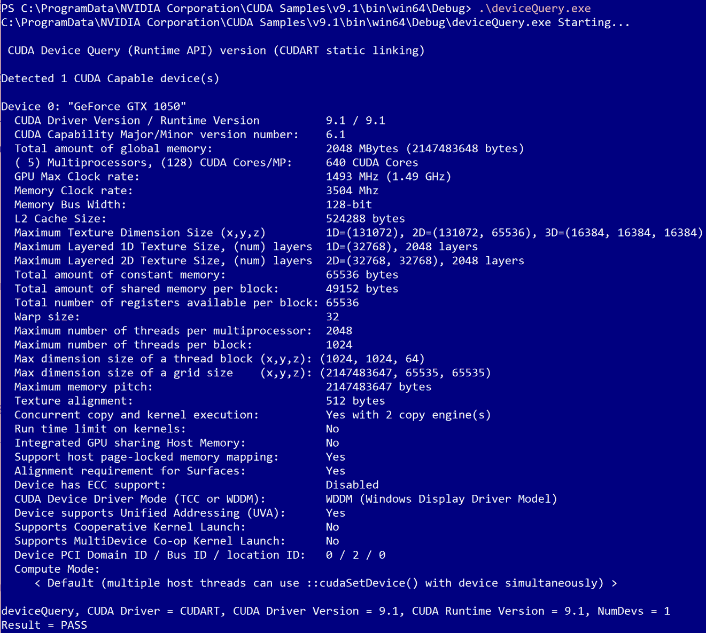
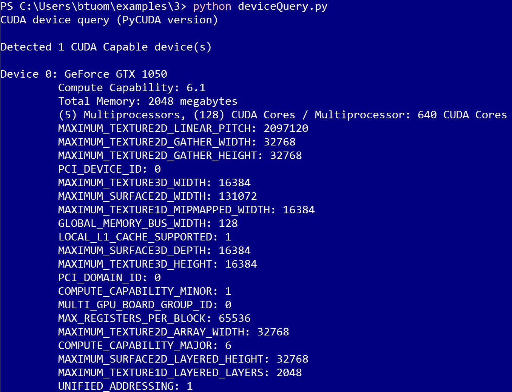
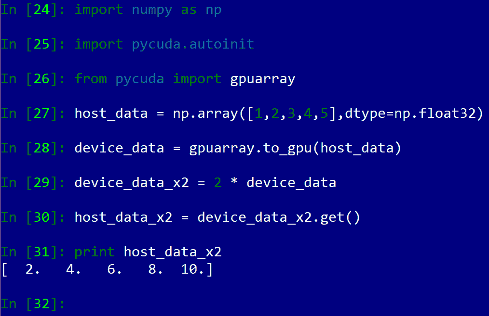
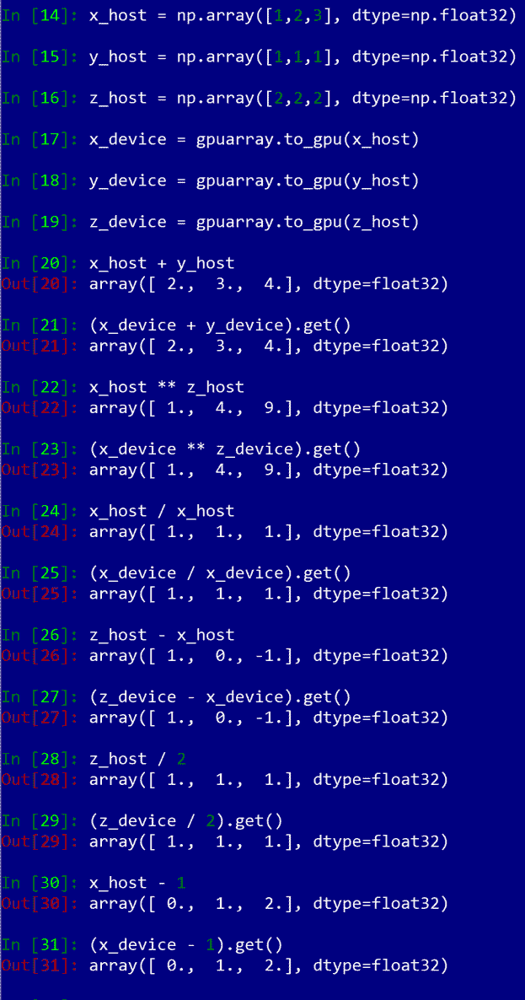
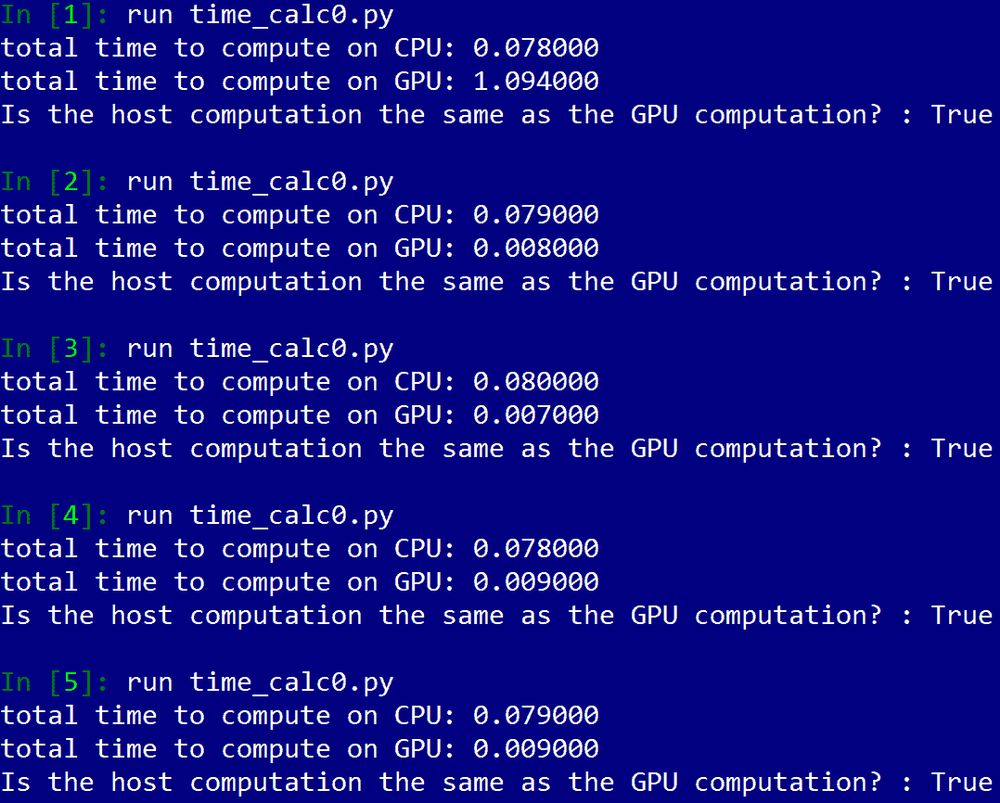
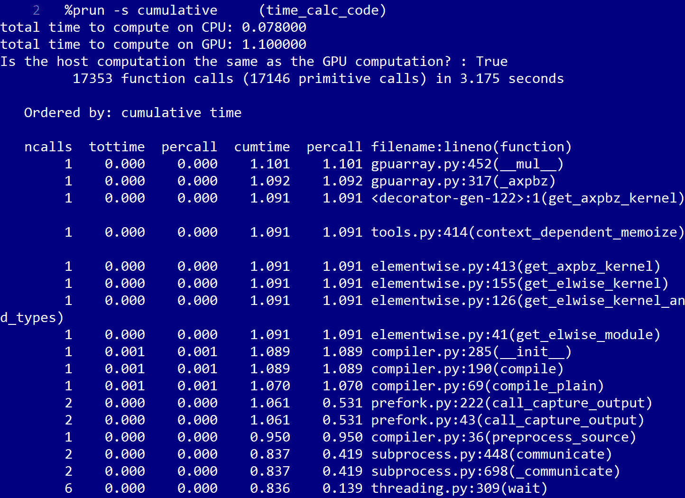
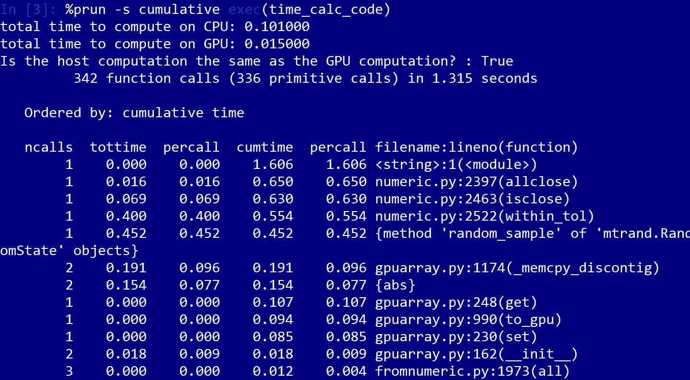
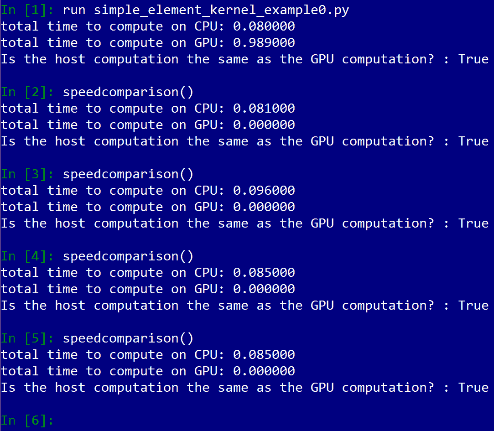
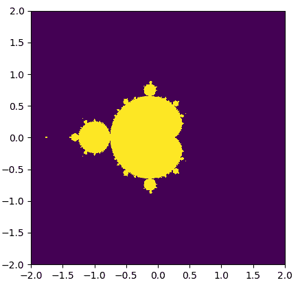
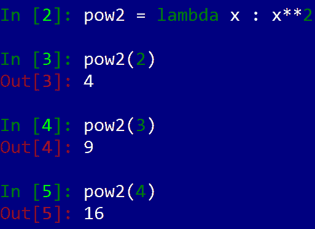

# PyCUDA 入门

在最后一章中，我们设置了我们的编程环境。现在，有了我们的驱动程序和编译器，我们将开始实际的 GPU 编程！我们将从学习如何使用 PyCUDA 进行一些基本操作开始。我们将首先了解如何查询我们的 GPU，也就是说，我们将从编写一个小型 Python 程序开始，该程序将告诉我们 GPU 的特性，例如核心计数、体系结构和内存。然后，我们将花一些时间了解如何使用 PyCUDA 的`gpuarray`类在 Python 和 GPU 之间传输内存，以及如何使用该类进行基本计算。本章剩余部分将介绍如何编写一些可以直接在 GPU 上启动的基本函数（我们称之为**CUDA 内核**。

本章的学习成果如下：

*   使用 PyCUDA 确定 GPU 特性，如内存容量或核心计数
*   了解主机（CPU）和设备（GPU）内存之间的差异，以及如何使用 PyCUDA 的`gpuarray`类在主机和设备之间传输数据
*   如何仅使用`gpuarray`对象进行基本计算
*   如何使用 PyCUDA`ElementwiseKernel`功能在 GPU 上执行基本的元素操作
*   了解 reduce/scan 操作的函数编程概念，以及如何进行基本的 reduce 或 scan CUDA 内核

# 技术要求

本章要求 Linux 或 Windows 10 PC 配备现代 NVIDIA GPU（2016 年以后），并安装所有必要的 GPU 驱动程序和 CUDA 工具包（9.0 以后）。还需要使用 PyCUDA 模块安装合适的 Python 2.7（如 Anaconda Python 2.7）。

本章的代码也可在 GitHub 的[上找到 https://github.com/PacktPublishing/Hands-On-GPU-Programming-with-Python-and-CUDA](https://github.com/PacktPublishing/Hands-On-GPU-Programming-with-Python-and-CUDA) 。

For more information about the prerequisites, check the *Preface* of this book; for the software and hardware requirements, check the `README` section in [https://github.com/PacktPublishing/Hands-On-GPU-Programming-with-Python-and-CUDA](https://github.com/PacktPublishing/Hands-On-GPU-Programming-with-Python-and-CUDA).

# 查询您的 GPU

在我们开始编程我们的 GPU 之前，我们应该真正了解它的技术能力和限制。我们可以通过**GPU 查询**来确定这一点。GPU 查询是一个非常基本的操作，它将告诉我们 GPU 的具体技术细节，例如可用 GPU 内存和内核数。NVIDIA 包含一个用纯 CUDA-C 编写的命令行示例，名为`deviceQuery`，位于`samples`目录中（对于 Windows 和 Linux），我们可以运行它来执行此操作。让我们来看看在作者的 Windows 10 笔记本电脑上产生的输出（它是一个带有 GTX 1050 GPU 的微软曲面书 2）：



让我们看看这里显示的所有技术信息的一些要点。首先，我们看到只安装了一个 GPU，设备 0——主机可能有多个 GPU 并使用它们，因此 CUDA 将为每个*GPU 设备*指定一个单独的编号。在某些情况下，我们可能必须明确设备编号，因此最好知道。我们还可以看到我们拥有的特定类型的设备（这里是 GTX 1050），以及我们使用的 CUDA 版本。现在我们还要注意两件事：内核总数（这里是 640 个）和设备上的全局内存总量（在本例中是 2048MB，即 2GB）

While you can see many other technical details from `deviceQuery`, the core count and amount of memory are usually the first two things your eyes should zero in on the first time you run this on a new GPU, since they can give you the most immediate idea of the capacity of your new device.

# 使用 PyCUDA 查询您的 GPU

现在，最后，我们将开始进军 GPU 编程领域，用 Python 编写我们自己的`deviceQuery`版本。这里，我们将主要关注设备上可用内存的数量、计算能力、多处理器的数量以及 CUDA 内核的总数。

我们将按如下方式初始化 CUDA：

```py
import pycuda.driver as drv
drv.init()
```

Note that we will always have to initialize PyCUDA with `pycuda.driver.init()` or by importing the PyCUDA `autoinit` submodule with `import pycuda.autoinit`!

现在，我们可以通过以下线路立即检查主机上有多少 GPU 设备：

```py
print 'Detected {} CUDA Capable device(s)'.format(drv.Device.count())
```

让我们在 IPython 中键入此内容，看看会发生什么：


伟大的到目前为止，我已经证实我的笔记本电脑确实有一个 GPU。现在，让我们通过添加几行代码来迭代每个可以使用`pycuda.driver.Device`（按数字索引）单独访问的设备，来提取关于这个 GPU（以及系统上的任何其他 GPU）的一些更有趣的信息。设备名称（例如，GeForce GTX 1050）由`name`函数给出。然后我们得到具有`compute_capability`功能的设备的**计算能力**和具有`total_memory`功能的设备内存总量

**Compute capability** can be thought of as a *version number* for each NVIDIA GPU architecture; this will give us some important information about the device that we can't otherwise query, as we will see in a minute.

下面是我们将如何编写它：

```py
for i in range(drv.Device.count()):

     gpu_device = drv.Device(i)
     print 'Device {}: {}'.format( i, gpu_device.name() )
     compute_capability = float( '%d.%d' % gpu_device.compute_capability() )
     print '\t Compute Capability: {}'.format(compute_capability)
     print '\t Total Memory: {} megabytes'.format(gpu_device.total_memory()//(1024**2))
```

现在，我们准备看看 GPU 的一些剩余属性，PyCUDA 以 Python 字典类型的形式向我们提供这些属性。我们将使用以下行将其转换为一个字典，该字典由表示属性的字符串索引：

```py
    device_attributes_tuples = gpu_device.get_attributes().iteritems()
     device_attributes = {}

     for k, v in device_attributes_tuples:
         device_attributes[str(k)] = v
```

我们现在可以通过以下方式确定设备上的*多处理器*数量：

```py
    num_mp = device_attributes['MULTIPROCESSOR_COUNT']
```

GPU 将其单个内核划分为更大的单元，称为**流****多处理器（SMs）**；一个 GPU 设备将有几个 SMs，每个 SMs 将分别具有特定数量的 CUDA 内核，具体取决于设备的计算能力。需要明确的是：每个多处理器的内核数不是由 GPU 直接指示的，而是由计算能力隐式地提供给我们的。我们必须查阅 NVIDIA 的一些技术文件，以确定每个多处理器的内核数量（参见[http://docs.nvidia.com/cuda/cuda-c-programming-guide/index.html#compute-功能](http://docs.nvidia.com/cuda/cuda-c-programming-guide/index.html#compute-capabilities)，然后创建一个查找表，为我们提供每个多处理器的内核数。我们这样做，使用`compute_capability`变量查找核心数：

```py
    cuda_cores_per_mp = { 5.0 : 128, 5.1 : 128, 5.2 : 128, 6.0 : 64, 6.1 : 128, 6.2 : 128}[compute_capability]
```

现在，我们可以通过将这两个数字相乘，最终确定设备上的内核总数：

```py
    print '\t ({}) Multiprocessors, ({}) CUDA Cores / Multiprocessor: {} CUDA Cores'.format(num_mp, cuda_cores_per_mp, num_mp*cuda_cores_per_mp)
```

现在，我们可以通过迭代字典中剩余的键并打印相应的值来完成程序：

```py
    device_attributes.pop('MULTIPROCESSOR_COUNT')

     for k in device_attributes.keys():
         print '\t {}: {}'.format(k, device_attributes[k])
```

所以，现在我们终于完成了我们的第一个真正的 GPU 程序的文本！（也可在[上获得）https://github.com/PacktPublishing/Hands-On-GPU-Programming-with-Python-and-CUDA/blob/master/3/deviceQuery.py](https://github.com/PacktPublishing/Hands-On-GPU-Programming-with-Python-and-CUDA/blob/master/3/deviceQuery.py) ）。现在，我们可以按如下方式运行它：



我们现在可以有一点自豪，我们确实可以写一个程序来查询我们的 GPU！现在，让我们真正开始学习使用我们的 GPU，而不仅仅是观察它。

# 使用 PyCUDA 的 gpuarray 类

就像 NumPy 的`array`类是 NumPy 环境中数值编程的基石一样，PyCUDA 的`gpuarray`类在 Python 的 GPU 编程中也扮演着类似的重要角色。它拥有 NumPy 多维向量/矩阵/张量形状构造、数组切片、数组分解以及用于逐点计算的重载运算符（例如，`+`、`-`、`*`、`/`和`**`）的所有特性。

`gpuarray`对于任何初露头角的 GPU 程序员来说都是不可或缺的工具。在继续之前，我们将在本节中详细介绍这个特定的数据结构，并对其进行深入了解。

# 使用 gpuarray 在 GPU 之间传输数据

正如我们在用 Python 编写之前的`deviceQuery`程序时所注意到的，GPU 除了主机的内存之外，还有自己的内存，即所谓的**设备内存**。（有时这更具体地称为**全局设备内存***，*以区别于 GPU 上的附加高速缓存内存、共享内存和寄存器内存。）对于大多数情况，我们在 GPU 上处理（全局）设备内存就像在 C 中动态分配堆内存一样（使用 Tyl T1 和 Ty2 T2 函数）或 C++（与 AdvT3 和 PoT T4 操作符）一样；在 CUDA C 中，这是复杂的，另外的任务是在 CPU 与 GPU 之间来回传送数据（带有命令，如 AutoT5T 和 OutT6T）。，同时跟踪 CPU 和 GPU 空间中的多个指针，并执行适当的内存分配（`cudaMalloc`和释放（`cudaFree`）。

幸运的是，PyCUDA 通过`gpuarray`类覆盖了内存分配、释放和数据传输的所有开销。如上所述，该类的作用类似于 NumPy 数组，使用向量/矩阵/张量形状结构信息来处理数据。`gpuarray`对象甚至会根据生命周期自动进行清理，因此我们不必担心*在使用`gpuarray`对象时会释放*存储在该对象中的任何 GPU 内存

我们如何使用它将数据从主机传输到 GPU？首先，我们必须以某种形式的 NumPy 数组（我们称之为`host_data`）包含主机数据，然后使用`gpuarray.to_gpu(host_data)`命令将其传输到 GPU 并创建一个新的 GPU 数组

现在让我们在 GPU 中执行一个简单的计算（GPU 上的一个常数的逐点乘法），然后使用`gpuarray.get`函数将 GPU 数据检索到一个新的内存中。让我们加载 IPython，看看它是如何工作的（注意，这里我们将用`import pycuda.autoinit`初始化 PyCUDA）：



需要注意的一点是，我们在设置 NumPy 数组时，特别指出主机上的数组的类型被特别设置为 NumPy`float32`类型，并使用`dtype`选项；这与 C/C++中的浮点类型直接对应。一般来说，在向 GPU 发送数据时，最好使用 NumPy 专门设置数据类型。原因有两个：第一，由于我们使用 GPU 来提高应用程序的性能，我们不希望使用不必要的类型带来任何不必要的开销，这可能会占用更多的计算时间或内存；第二，因为我们很快就会在内联 CUDA C 中编写部分代码，我们必须非常具体地使用类型，否则我们的代码将无法正常工作，请记住 C 是一种静态类型语言。

Remember to specifically set data types for NumPy arrays that will be transferred to the GPU. This can be done with the `dtype` option in the constructor of the `numpy.array` class.

# 使用 gpuarray 的基本逐点算术运算

在上一个示例中，我们看到可以使用（重载的）Python 乘法运算符（`*`）将`gpuarray`对象中的每个元素乘以标量值（这里是 2）；请注意，逐点操作本质上是可并行的，因此当我们在`gpuarray`对象上使用此操作时，PyCUDA 能够将每个乘法操作卸载到单个线程上，而不是逐个串行计算每个乘法（公平地说，某些版本的 NumPy 可以使用现代 x86 芯片中的高级 SSE 指令进行这些计算，因此在某些情况下，性能将与 GPU 相当）。需要明确的是：在 GPU 上执行的这些逐点操作是并行的，因为一个元素的计算不依赖于任何其他元素的计算

为了了解操作符是如何工作的，我建议读者加载 IPython 并在 GPU 上创建一些`gpuarray`对象，然后对这些操作进行几分钟的研究，看看这些操作符的工作方式是否与 NumPy 中的数组类似。以下是一些启示：



现在，我们可以看到`gpuarray`对象的行为是可预测的，并且与 NumPy 数组的行为一致。（请注意，我们必须使用`get`函数从 GPU 上提取输出！）现在让我们比较一下 CPU 和 GPU 的计算时间，看看在 GPU 上执行这些操作是否有好处，以及什么时候有好处。

# 速度测试

让我们编写一个小程序（`time_calc0.py`，它将在 CPU 上的标量乘法和 GPU 上的相同操作之间进行速度比较测试。然后我们将使用 NumPy 的`allclose`函数来比较这两个输出值。我们将生成一个包含 5000 万个随机 32 位浮点值的数组（这将相当于大约 48 兆字节的数据，因此在任何现代主机和 GPU 设备上使用几 GB 内存应该是完全可行的），然后我们将计算两个设备上用数组乘以 2 所需的时间。最后，我们将比较输出值以确保它们相等。这是如何做到的：

```py
import numpy as np
import pycuda.autoinit
from pycuda import gpuarray
from time import time
host_data = np.float32( np.random.random(50000000) )

t1 = time()
host_data_2x =  host_data * np.float32(2)
t2 = time()

print 'total time to compute on CPU: %f' % (t2 - t1)
device_data = gpuarray.to_gpu(host_data)

t1 = time()
device_data_2x =  device_data * np.float32( 2 )
t2 = time()

from_device = device_data_2x.get()
print 'total time to compute on GPU: %f' % (t2 - t1)

print 'Is the host computation the same as the GPU computation? : {}'.format(np.allclose(from_device, host_data_2x) )
```

（您可以在前面提供给您的存储库中找到`time_calc0.py`文件。）

现在，让我们加载 IPython 并运行几次，以了解它们的总体速度，并查看是否存在任何差异。（在这里，这是在 2017 年的 Microsoft Surface Book 2 上运行的，它使用了 Kaby Lake i7 处理器和 GTX 1050 GPU。）：



我们首先注意到，每次计算的 CPU 计算时间大致相同（大约 0.08 秒）。然而，我们注意到，GPU 计算时间远慢于我们第一次运行时的 CPU 计算（1.09 秒），并且在随后的运行中变得更快，在接下来的每次运行中（7 或 9 毫秒范围内）大致保持不变。如果退出 IPython，然后再次运行该程序，同样的情况也会发生。这种现象的原因是什么？好吧，让我们使用 IPython 的内置`prun`探查器进行一些调查工作。（其工作原理类似于[第 1 章](01.html)、*为什么要进行 GPU 编程？*中介绍的`cProfiler`模块。）

首先，让我们将程序作为文本加载到 IPython 中，并使用以下行，然后通过 Python 的`exec`命令使用探查器运行：

```py
with open('time_calc0.py','r') as f:
     time_calc_code = f.read()
```

现在，我们在 IPython 控制台中键入`%prun -s cumulative exec(time_calc_code)`（前面的`%`），看看哪些操作花费的时间最多：



现在，有许多对 Python 模块文件`compiler.py`的可疑调用；这大约需要 1 秒的时间，比这里进行 GPU 计算所需的时间要少一点。现在，让我们再次运行此操作，看看是否存在任何差异：



请注意，这次没有对`compiler.py`的调用。为什么会这样？根据 PyCUDA 库的性质，GPU 代码通常在第一次在给定 Python 会话中运行时被编译并与 NVIDIA 的`nvcc`编译器链接；然后缓存它，如果再次调用代码，则无需重新编译。这甚至可能包括*简单的*操作，比如这个标量乘法！（我们将最终看到，通过使用[第 10 章](10.html)、*中的预编译代码以及编译后的 GPU 代码*，或者使用 NVIDIA 自己的线性代数库和 Scikit CUDA 模块，这一点可以得到改善，我们将在[第 7 章](07.html)、*中看到与 Scikit CUDA*一起使用 CUDA 库。

In PyCUDA, GPU code is often compiled at runtime with the NVIDIA `nvcc` compiler and then subsequently called from PyCUDA. This can lead to an unexpected slowdown, usually the first time a program or GPU operation is run in a given Python session.

# 使用 PyCUDA 的 ElementWiseKernel 执行逐点计算

现在，我们将了解如何在 PyCUDA 的`ElementWiseKernel`函数的帮助下，将我们自己的逐点（或等效的*元素*操作直接编程到我们的 GPU 上。这就是我们对 C/C++编程的先验知识将变得有用的地方。我们必须用 CUDA C 编写一点*内联代码*，它由 NVIDIA 的`nvcc`编译器外部编译，然后在运行时由我们的代码通过 PyCUDA 启动。

在本文中，我们使用了很多术语**内核**；所谓*内核*，我们总是指 CUDA 直接在 GPU 上启动的函数。我们将使用 PyCUDA 中的几个函数为不同类型的内核生成模板和设计模式，从而简化向 GPU 编程的过渡。

让我们一头扎进去；首先，我们要显式地重写代码，在 CUDA-C 中，将`gpuarray`对象的每个元素乘以 2；我们将使用 PyCUDA 的`ElementwiseKernel`函数来生成我们的代码。您应该尝试直接在 IPython 控制台中键入以下代码。（不太冒险的人可以从本文的 Git 存储库下载，该存储库的文件名为`simple_element_kernel_example0.py`：

```py
import numpy as np
import pycuda.autoinit
from pycuda import gpuarray
from time import time
from pycuda.elementwise import ElementwiseKernel
host_data = np.float32( np.random.random(50000000) )
gpu_2x_ker = ElementwiseKernel(
"float *in, float *out",
"out[i] = 2*in[i];",
"gpu_2x_ker")
```

让我们来看看这是如何建立的；当然，这是几行内联 C。我们首先在第一行（`"float *in, float *out"`中设置输入和输出变量，通常以 C 指针的形式指向 GPU 上分配的内存。在第二行中，我们用`"out[i] = 2*in[i];"`定义元素操作，它将`in`中的每个点乘以 2，并将其放入`out`的相应索引中。

请注意，PyCUDA 会自动为我们设置整数索引`i`。当我们使用`i`作为索引时，`ElementwiseKernel`将在我们的 GPU 中的许多内核中自动并行计算`i`。最后，我们给出了代码的内部 CUDAC 内核名（`"gpu_2x_ker"`。由于这是指 CUDA C 的名称空间，而不是 Python 的名称空间，因此可以（也很方便）将其命名为 Python 中的名称。

现在，让我们做一个速度比较：

```py
def speedcomparison():
    t1 = time()
    host_data_2x =  host_data * np.float32(2)
    t2 = time()
    print 'total time to compute on CPU: %f' % (t2 - t1)
    device_data = gpuarray.to_gpu(host_data)
    # allocate memory for output
    device_data_2x = gpuarray.empty_like(device_data)
    t1 = time()
    gpu_2x_ker(device_data, device_data_2x)
    t2 = time()
    from_device = device_data_2x.get()
    print 'total time to compute on GPU: %f' % (t2 - t1)
    print 'Is the host computation the same as the GPU computation? : {}'.format(np.allclose(from_device, host_data_2x) )

if __name__ == '__main__':
    speedcomparison()
```

现在，让我们运行这个程序：


哇！看起来不太好。让我们从 IPython 运行`speedcomparison()`函数几次：



正如我们所看到的，在我们第一次使用一个给定的 GPU 功能之后，速度急剧提高。同样，与前面的示例一样，这是因为 PyCUDA 在第一次使用`nvcc`编译器调用给定的 GPU 内核函数时编译我们的内联 CUDA C 代码。在编译代码之后，它将被缓存并重新用于给定 Python 会话的其余部分。

现在，在我们继续之前，让我们先讨论一些重要的事情，这是非常微妙的。我们定义的小内核函数在 C 浮点指针上运行；这意味着我们必须在 GPU 上分配一些由`out`变量指向的空内存。从`speedcomparison()`函数再次查看这部分代码：

```py
device_data = gpuarray.to_gpu(host_data)
# allocate memory for output
device_data_2x = gpuarray.empty_like(device_data)
```

与之前一样，我们通过`gpuarray.to_gpu`函数向 GPU（`host_data`）发送一个 NumPy 数组，该函数自动将数据分配到 GPU，并从 CPU 空间复制数据。我们将把它插入内核函数的`in`部分。在下一行中，我们使用`gpuarray.empty_like`函数在 GPU 上分配空内存。这就像 C 中的普通`malloc`，分配与`device_data`大小和数据类型相同的数组，但不复制任何内容。我们现在可以将其用于内核函数的`out`部分。现在我们来看`speedcomparison()`中的下一行，看看如何在 GPU 上启动内核函数（忽略我们用于计时的行）：

```py
gpu_2x_ker(device_data, device_data_2x)
```

同样，我们设置的变量直接对应于我们用`ElementwiseKernel`定义的第一行（这里是`"float *in, float *out"`）。

# 曼德布罗特重访

让我们再次看看从[第 1 章](01.html)生成 Mandelbrot 集的问题，*为什么要进行 GPU 编程？*。原始代码位于存储库的`1`文件夹下，文件名为`mandelbrot0.py`，在我们继续之前，您应该再看一看。我们看到这个程序有两个主要部分：第一个是生成 Mandelbrot 集，第二个是将 Mandelbrot 集转储到 PNG 文件中。在第一章中，我们意识到我们只能并行生成 Mandelbrot 集，考虑到这需要程序花费大量的时间，这将是一个很好的候选算法，可以将其卸载到 GPU 上。让我们想一想如何做到这一点。（我们将不再重复 Mandelbrot 集合的定义，因此如果您需要更深入的回顾，请重新阅读[第 1 章](01.html)*为什么要进行 GPU 编程？*中*Mandelbrot**的*部分）

首先，让我们在原始程序的`simple_mandelbrot`基础上创建一个新的 Python 函数。我们称之为`gpu_mandelbrot`，它将接收与之前相同的精确输入：

```py
def gpu_mandelbrot(width, height, real_low, real_high, imag_low, imag_high, max_iters, upper_bound):
```

我们将从这里开始有点不同。我们将首先构建一个复杂的晶格，该晶格由我们将要分析的复杂平面中的每个点组成

在这里，我们将使用 NumPy 矩阵类型的一些技巧来轻松生成晶格，然后将结果从 NumPy`matrix`类型转换为二维 NumPy`array`（因为 PyCUDA 只能处理 NumPy`array`类型，而不能处理`matrix`类型）。请注意，我们是如何非常小心地设置 NumPy 类型的：

```py
    real_vals = np.matrix(np.linspace(real_low, real_high, width), dtype=np.complex64)
    imag_vals = np.matrix(np.linspace( imag_high, imag_low, height), dtype=np.complex64) * 1j
    mandelbrot_lattice = np.array(real_vals + imag_vals.transpose(), dtype=np.complex64)  
```

现在我们有了一个二维复杂数组，它代表了我们将从中生成 Mandelbrot 集的晶格；正如我们将看到的，我们可以在 GPU 中非常轻松地操作它。现在，让我们将晶格转移到 GPU，并分配一个数组，用于表示 Mandelbrot 集：

```py
    # copy complex lattice to the GPU
    mandelbrot_lattice_gpu = gpuarray.to_gpu(mandelbrot_lattice)    
    # allocate an empty array on the GPU
    mandelbrot_graph_gpu = gpuarray.empty(shape=mandelbrot_lattice.shape, dtype=np.float32)
```

重申`gpuarray.to_array`函数只能在 NumPy`array`类型上运行，所以我们在将其发送到 GPU 之前，一定要先进行类型转换。接下来，我们必须使用`gpuarray.empty`函数在 GPU 上分配一些内存，指定数组的大小/形状和类型。同样，您可以将其视为类似于 C 中的`malloc`；请记住，我们以后不必取消分配或`free`这个内存，因为`gpuarray`对象析构函数在到达作用域末尾时会自动清理内存。

When you allocate memory on the GPU with the PyCUDA functions `gpuarray.empty` or `gpuarray.empty_like`, you do not have to deallocate this memory later due to the destructor of the `gpuarray `object managing all memory clean up.

我们现在已经准备好启动内核；我们唯一要做的改变就是改变环境

我们还没有编写内核函数来生成 Mandelbrot 集，但是让我们来编写我们希望该函数的其余部分如何运行：

```py
    mandel_ker( mandelbrot_lattice_gpu, mandelbrot_graph_gpu, np.int32(max_iters), np.float32(upper_bound))

    mandelbrot_graph = mandelbrot_graph_gpu.get()

    return mandelbrot_graph
```

这就是我们希望我们的新内核的工作方式。第一个输入是我们生成的复杂点阵（NumPy`complex64`类型），第二个是指向二维浮点数组（NumPy`float32`类型）的指针，该数组将指示哪些元素是 Mandelbrot 集的成员，第三个将是一个整数，指示每个点的最大迭代次数，最终输入将是用于确定 Mandelbrot 类成员资格的每个点的上限。请注意，我们在输入 GPU 的所有内容时都非常小心！

下一行将从 GPU 生成的 Mandelbrot 集检索回 CPU 空间，并返回结束值。（请注意，`gpu_mandelbrot`的输入和输出与`simple_mandelbrot`完全相同）。

现在让我们看看如何正确定义我们的 GPU 内核。首先，让我们在标题中添加适当的`include`语句：

```py
import pycuda.autoinit
from pycuda import gpuarray
from pycuda.elementwise import ElementwiseKernel
```

我们现在已经准备好编写 GPU 内核了！我们将在此处显示，然后逐行检查：

```py
mandel_ker = ElementwiseKernel(
"pycuda::complex<float> *lattice, float *mandelbrot_graph, int max_iters, float upper_bound",
"""
mandelbrot_graph[i] = 1;
pycuda::complex<float> c = lattice[i]; 
pycuda::complex<float> z(0,0);
for (int j = 0; j < max_iters; j++)
    {  
     z = z*z + c;     
     if(abs(z) > upper_bound)
         {
          mandelbrot_graph[i] = 0;
          break;
         }
    }         
""",
"mandel_ker")
```

首先，我们使用传递给`ElementwiseKernel`的第一个字符串设置输入。我们必须认识到，当我们在 CUDA-C 中工作时，特定的 C 数据类型将直接对应于特定的 Python NumPy 数据类型。再次注意，当数组被传递到 CUDA 内核时，CUDA 将它们视为 C 指针。这里，CUDA C`int`类型正好对应于 NumPy`int32`类型，而 CUDA C`float`类型对应于 NumPy`float32`类型。然后，内部 PyCUDA 类模板用于复杂类型，PyCUDA`::complex<float>`对应于 Numpy`complex64`。

让我们看一下第二个字符串的内容，它用三个引号（`"""`删除）。这允许我们在字符串中使用多行；当我们用 Python 编写更大的内联 CUDA 内核时，我们将使用它

虽然我们传入的数组是 Python 中的二维数组，但 CUDA 只会将它们视为一维数组，并通过`i`进行索引。同样，`ElementwiseKernel`为我们自动在多个内核和线程之间建立`i`索引。我们用`mandelbrot_graph[i] = 1;`将输出中的每个点初始化为一点，因为`i`将在 Mandelbrot 集合的每个元素上建立索引；我们将假设每个点都是一个成员，除非另有证明。（同样，Mandelbrot 集是二维的，真实且复杂，但`ElementwiseKernel`会自动将所有内容转换为一维集。当我们再次在 Python 中与数据交互时，Mandelbrot 集的二维结构将被保留。）

我们将我们的`c`值设置为 Python 中的`pycuda::complex<float> c = lattice[i];`对应的晶格点，并使用`pycuda::complex<float> z(0,0);`将`z`值初始化为`0`（第一个零对应于实部，第二个零对应于虚部）。然后，我们在一个新的迭代器`j`和`for(int j = 0; j < max_iters; j++)`上执行一个循环。（请注意，此算法不会在`j`或任何其他索引`i`上并行化！此`for`循环将在`j`上串行运行-但整个代码段将在`i`上并行化。）

然后，我们按照 Mandelbrot 算法将新值`*z*`设置为`z = z*z + c;`。如果该元素的绝对值超过上限（`if(abs(z) > upper_bound)`，我们将该点设置为 0（`mandelbrot_graph[i] = 0;`，并使用`break`关键字跳出循环

在传递到`ElementwiseKernel`的最后一个字符串中，我们给出了内核的内部 CUDA C 名称，这里是`"mandel_ker"`。

我们现在已经准备好启动内核；我们需要做的唯一更改是将主函数中的引用从`simple_mandelbrot`更改为`gpu_mandelbrot`，我们准备好了。让我们从 IPython 开始：


让我们检查转储的图像以确保这是正确的：



这肯定与第一章中生成的 Mandelbrot 图像相同，因此我们已经成功地在 GPU 上实现了这一点！现在让我们看看速度的提高：在第一章中，我们用了 14.61 秒来绘制这个图表；在这里，只花了 0.894 秒。请记住，PyCUDA 还必须在运行时编译和链接我们的 CUDA C 代码，以及与 GPU 进行内存传输所需的时间。尽管如此，即使有这些额外的开销，这也是一个非常值得的速度提升！（您可以使用 Git 存储库中名为`gpu_mandelbrot0.py`的文件查看我们的 GPU Mandelbrot 的代码。）

# 对函数式编程的简单探索

在继续之前，让我们简要回顾一下 Python 中用于**函数编程***-*`map`和`reduce`的两个函数。它们都被认为是*功能*，因为它们都作用于*功能*进行操作。我们发现这些很有趣，因为它们都对应于编程中的常见设计模式，因此我们可以交换输入中的不同函数，以获得大量不同（且有用）的操作。

让我们首先回顾一下 Python 中的`lambda`关键字。这允许我们定义一个**匿名函数**——在大多数情况下，这些函数可以被视为一个`throwaway`函数，我们可能只希望使用一次，或者可以在一行上定义。现在让我们打开 IPython，定义一个小函数，将一个数字平方-`pow2 = lambda x : x**2`。让我们用几个数字来测试一下：



让我们回忆一下，`map`作用于两个输入值：一个函数和一个`list`给定函数可以作用的对象。`map`输出原始列表中每个元素的函数输出列表。现在，让我们将平方运算定义为一个匿名函数，我们将其输入到 map 中，并使用下面的“`map(lambda x : x**2, [2,3,4])`”检查最后几个数字的列表：


我们看到`map`充当`ElementwiseKernel`！这实际上是函数式编程中的标准设计模式。现在我们来看`reduce`；与接收列表并输出直接对应的列表不同，reduce 接收列表，对其执行递归二进制操作，并输出单例。让我们通过输入`reduce(lambda x, y : x + y, [1,2,3,4])`来了解这种设计模式。当我们在 IPython 中输入这个时，我们会看到它将输出一个数字 10，它实际上是*1+2+3+4*的和。您可以尝试将上面的求和替换为乘法，并看到这确实适用于将一长串数字递归相乘。一般来说，我们将 reduce 运算与*关联二进制运算*结合使用；这意味着，无论我们在列表的连续元素之间执行操作的顺序如何，只要列表保持有序，我们总是会给出相同的结果。（这不能与*交换属性*混淆。）

现在我们将看到 PyCUDA 如何处理类似于`reduce`的编程模式—使用**并行扫描**和**还原内核**。

# 并行扫描和精简内核基础知识

让我们看看 PyCUDA 中的一个基本函数，它再现了 reduce-`InclusiveScanKernel`的功能。（您可以在`simple_scankernal0.py`文件名下找到代码。）让我们执行一个基本示例，对 GPU 上的一个小数字列表求和：

```py
import numpy as np
import pycuda.autoinit
from pycuda import gpuarray
from pycuda.scan import InclusiveScanKernel
seq = np.array([1,2,3,4],dtype=np.int32)
seq_gpu = gpuarray.to_gpu(seq)
sum_gpu = InclusiveScanKernel(np.int32, "a+b")
print sum_gpu(seq_gpu).get()
print np.cumsum(seq)
```

我们通过首先指定输入/输出类型（这里是 NumPy`int32`）和字符串`"a+b"`来构造内核。在这里，`InclusiveScanKernel`自动在 GPU 空间中设置名为`a`和`b`的元素，因此您可以将此字符串输入视为类似于 Python 中的`lambda a,b: a + b`。我们真的可以把任何（关联的）二进制操作放在这里，只要我们记得用 C 写它。

当我们运行`sum_gpu`时，我们会看到一个与输入数组大小相同的数组。数组中的每个元素表示计算中每个步骤的值（NumPy`cumsum`函数给出相同的输出，如我们所见）。最后一个元素是我们正在寻找的最终输出，它对应于 reduce 的输出：


让我们试试更具挑战性的东西；让我们在`float32`数组中找到最大值：

```py
import numpy as np
import pycuda.autoinit
from pycuda import gpuarray
from pycuda.scan import InclusiveScanKernel
seq = np.array([1,100,-3,-10000, 4, 10000, 66, 14, 21],dtype=np.int32)
seq_gpu = gpuarray.to_gpu(seq)
max_gpu = InclusiveScanKernel(np.int32, "a > b ? a : b")
print max_gpu(seq_gpu).get()[-1]
print np.max(seq)
```

（您可以在名为`simple_scankernal1.py`的文件中找到完整的代码。）

在这里，我们所做的主要更改是将`a + b`字符串替换为`a > b ? a : b`。（在 Python 中，这将在一个`reduce`语句中呈现为`lambda a, b:  max(a,b)`。在这里，我们使用了一个技巧，通过 C 语言的`?`操作符给出`a`和`b`之间的最大值。最后，我们在输出数组中显示结果元素的最后一个值，它将恰好是最后一个元素（在 Python 中，我们总是可以使用`[-1]`索引检索该元素）。

现在，让我们再看一个生成 GPU 内核的 PyCUDA 函数-`ReductionKernel`。实际上，`ReductionKernel`就像一个`ElementwiseKernel`函数，后面跟着一个并行扫描内核。使用`ReductionKernel`实现的最佳候选算法是什么？首先想到的是线性代数的点积。让我们记住计算两个向量的点积有两个步骤：

1.  逐点乘以向量
2.  将得到的逐点乘法求和

这两个步骤也称为*乘法和累加*。现在让我们设置一个内核来执行此计算：

```py
dot_prod = ReductionKernel(np.float32, neutral="0", reduce_expr="a+b", map_expr="vec1[i]*vec2[i]", arguments="float *vec1, float *vec2")

```

首先，注意我们用于内核的数据类型（a`float32`。然后，我们用`arguments`设置 CUDA C 内核的输入参数（这里两个浮点数组表示每个向量，用`float *`指定），并用`map_expr`设置逐点计算，这里是逐点乘法。与`ElementwiseKernel`一样，这是在`i`之上编制的索引。我们设置了与`InclusiveScanKernel`相同的`reduce_expr`。这将获取元素操作的结果输出，并对数组执行 reduce 类型操作。最后，我们将*中性元素*设置为中性。这是一个元素，将作为`reduce_expr`的标识；在这里，我们设置了`neutral=0`，因为`0`总是加法下的恒等式（乘法下，一个是恒等式）。当我们在本书后面更深入地讨论并行前缀时，我们将看到为什么我们必须设置它。

# 总结

我们首先看到了如何从 PyCUDA 查询我们的 GPU，并用 Python 重新创建了 CUDA`deviceQuery`程序。然后，我们学习了如何使用 PyCUDA`gpuarray`类及其`to_gpu`和`get`函数在 GPU 内存之间传输 NumPy 数组。通过观察如何使用`gpuarray`对象在 GPU 上进行基本计算，我们对使用`gpuarray`对象有了一种感觉，并且我们学会了使用 IPython 的`prun`分析器进行一些调查工作。我们看到，在会话中第一次从 PyCUDA 运行 GPU 函数时，有时会出现一些任意的减速，这是因为 PyCUDA 启动了 NVIDIA 的`nvcc`编译器来编译内嵌的 CUDA C 代码。然后，我们了解了如何使用`ElementwiseKernel`函数编译和启动元素操作，这些操作会从 Python 自动并行到 GPU 上。我们简要回顾了 Python 中的函数编程（特别是`map`和`reduce`函数），最后介绍了如何使用`InclusiveScanKernel`和`ReductionKernel`函数在 GPU 上进行一些基本的 reduce/scan 类型的计算。

现在，我们已经掌握了编写和启动内核函数的基本知识，我们应该意识到 PyCUDA 已经为我们编写了一个带有模板的内核，为我们节省了大量的开销。我们将在下一章学习 CUDA 内核执行的原理，以及 CUDA 如何将内核中的并发线程安排为抽象的**网格**和**块**。

# 问题

1.  在 GUP0 中，我们没有考虑到 GPU 在测量 GPU 计算时间方面的内存转移。尝试使用 Python time 命令测量`gpuarray`函数、`to_gpu`和`get`所用的时间。你认为把这个特殊的功能转移到 GPU 上，并考虑内存传输时间，是值得的吗？

2.  在[第一章](01.html)中*为什么要进行 GPU 编程？*我们讨论了阿姆达尔定律，它让我们了解了将程序的一部分卸载到 GPU 上可能获得的收益。请说出我们在本章中看到的阿姆达尔法没有考虑到的两个问题。

3.  修改`gpu_mandel0.py`使用越来越小的复数格，并将其与程序的相同格 CPU 版本进行比较。我们是否可以选择一个足够小的晶格，使 CPU 版本实际上比 GPU 版本快？

4.  使用`ReductionKernel`创建一个内核，该内核在 GPU 上使用两个长度相同的`complex64`数组，并返回两个数组中绝对最大的元素。

5.  在 Python 中，如果`gpuarray`对象到达作用域的末尾会发生什么？

6.  当我们使用`ReductionKernel`时，您认为我们为什么需要定义`neutral`？

7.  如果在`ReductionKernel`中我们设置`reduce_expr ="a > b ? a : b"`，并且我们正在操作 int32 类型，那么我们应该将“`neutral`设置为什么？