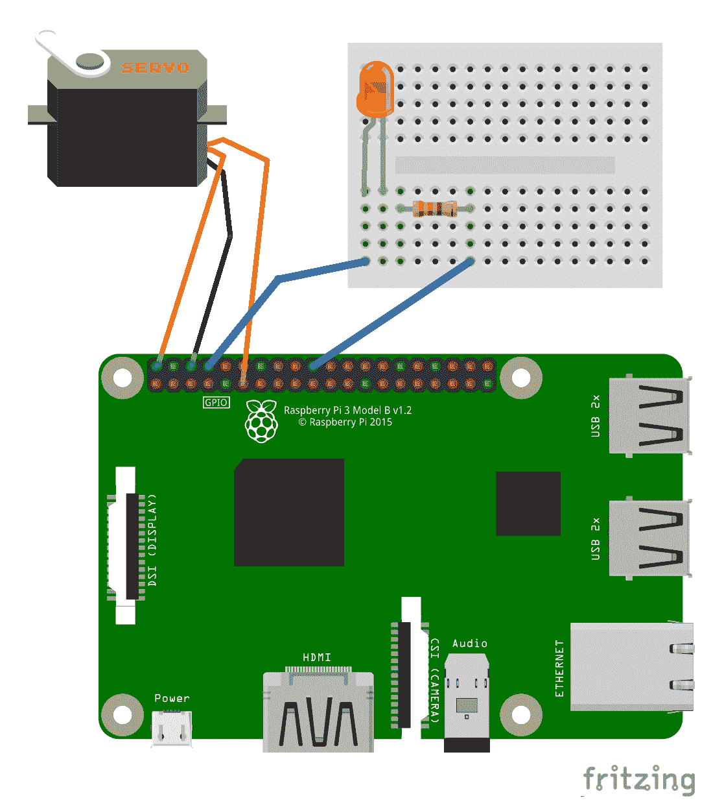
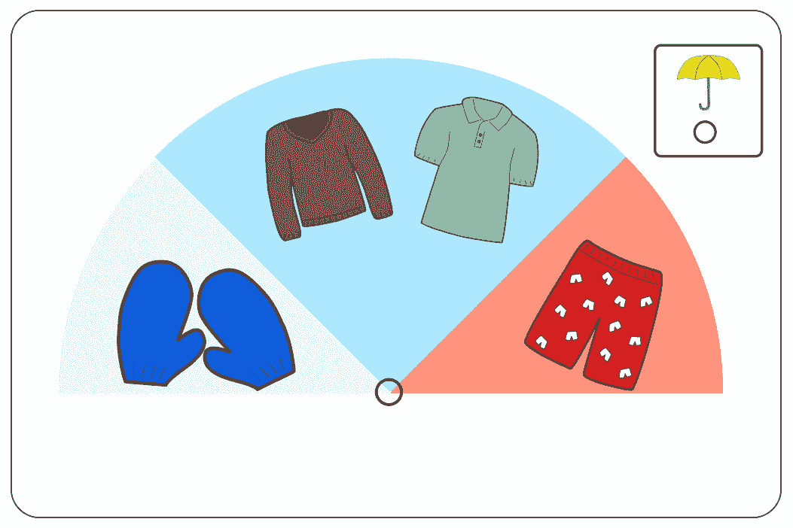
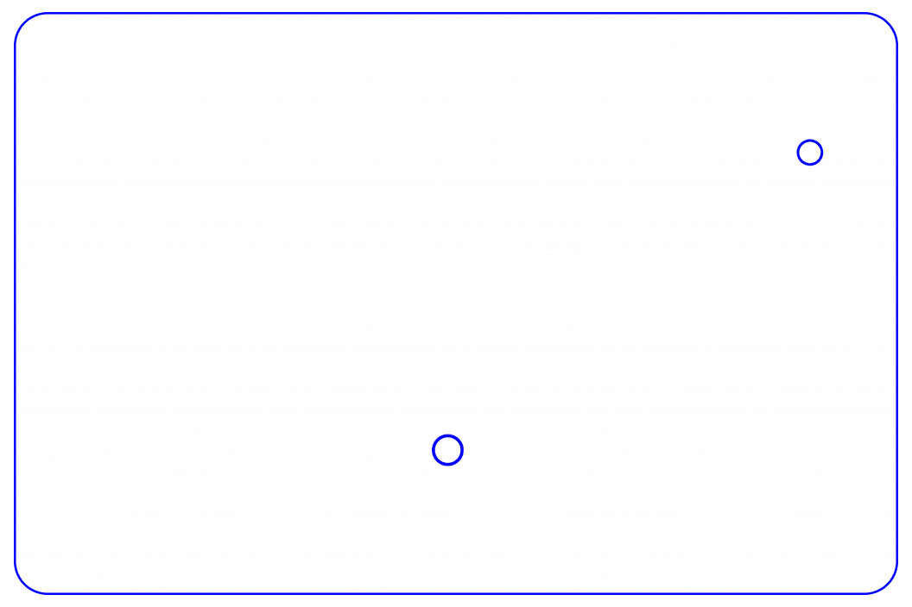
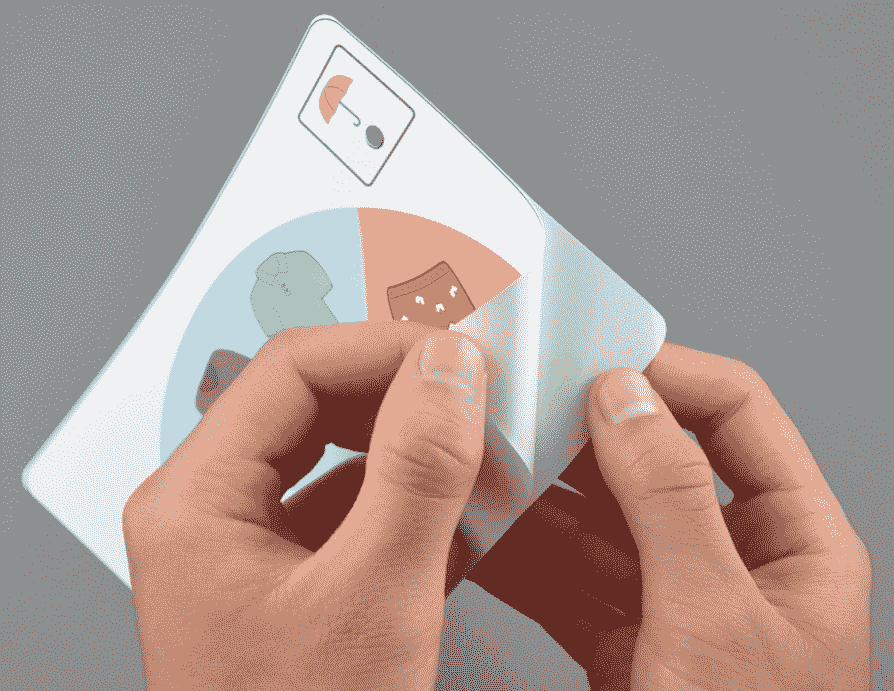
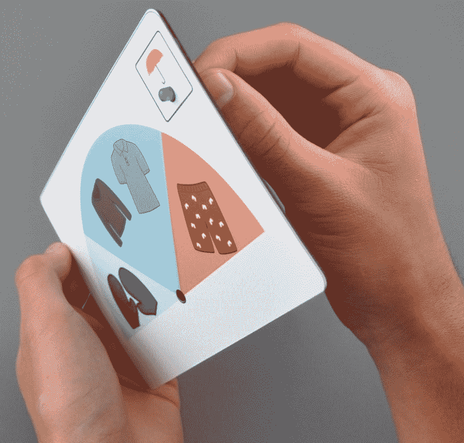
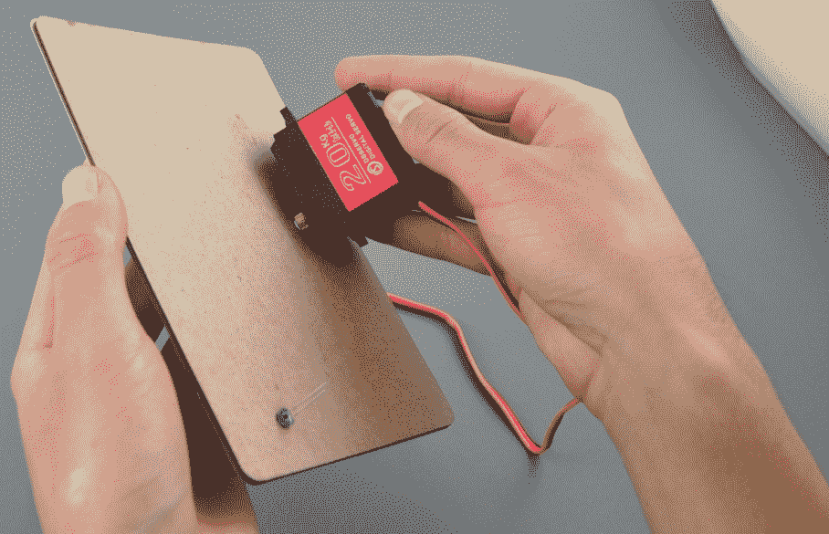
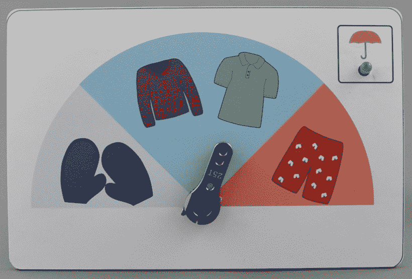

# 使用伺服控制代码控制模拟设备

继续我们的旅程，将模拟仪表的优雅与数字数据的准确性结合起来，我们将看看我们在前两章学到的内容，并构建一个带有模拟仪表显示屏的物联网天气仪表板。

在开始本章之前，请确保已将[第 5 章](05.html)*中使用 Python*控制伺服的电路连接好。

此仪表板将根据室外温度和风速显示衣柜建议。我们还将在仪表板上使用 LED 指示灯，指示是否应随身携带雨伞。

本章将介绍以下主题：

*   从云中访问天气数据
*   利用气象数据控制伺服系统
*   加强我们的项目

# 完成本章所需的知识

要完成本章，您应该具备 Python 编程语言的实用知识。必须具备使用可连接组件的简单试验板的知识。

本项目中可使用乙烯基或工艺切割机。如何使用刀具的知识将是一项资产，这样你就可以完成这个项目。

# 项目概述

到本章结束时，我们应该有一个工作物联网模拟天气仪表板。我们将修改[第 4 章](04.html)、*订阅 Web 服务*、[第 5 章](05.html)、*用 Python*控制伺服的代码，为我们的仪表盘提供数据。背景将被打印并剪掉。这个背景将给我们的仪表板一个卡通般的外观。

我们将使用[第 5 章](05.html)中的电路*使用 Python*控制伺服。以下是该电路的接线图：



这个项目需要一个下午才能完成。

# 开始

为完成本项目，需要以下各项：

*   Raspberry Pi 3 型（2015 型或更新型）
*   USB 电源
*   计算机显示器
*   USB 键盘
*   USB 鼠标
*   小型伺服电动机
*   LED（任何颜色）
*   试验板
*   用于试验板的跨接导线
*   彩色打印机
*   乙烯基或工艺切割机（可选）

# 从云中访问天气数据

在[第 4 章](04.html)*订阅 Web 服务*中，我们编写了一个 Python 程序来访问雅虎的天气数据！天气该程序中的类`CurrentWeather`返回了该类实例化时使用的`city`值的温度、天气条件和风速。

我们将重新访问该代码，并将类名更改为`WeatherData`。我们还将添加一个方法，从`0`-`100`返回一个值，以指示天气。在确定该数值时，我们将考虑温度和风速，0 表示极端冬季条件，`100`表示非常炎热的极端夏季条件。我们将使用这个数字来控制我们的伺服。我们还将检查是否下雨，并更新 LED 以指示是否需要雨伞：

1.  从应用程序菜单|编程| Thonny Python IDE
    打开 Thonny
2.  单击新建图标创建一个新文件

3.  在文件中键入以下内容：

```py
from weather import Weather, Unit

class WeatherData:

    temperature = 0
    weather_conditions = ''
    wind_speed = 0
    city = ''

    def __init__(self, city):
        self.city = city
        weather = Weather(unit = Unit.CELSIUS)
        lookup = weather.lookup_by_location(self.city)
        self.temperature = float(lookup.condition.temp)
        self.weather_conditions = lookup.condition.text
        self.wind_speed = float(lookup.wind.speed)

    def getServoValue(self):
        temp_factor = (self.temperature*100)/30
        wind_factor = (self.wind_speed*100)/20
        servo_value = temp_factor-(wind_factor/20)

        if(servo_value >= 100):
            return 100
        elif (servo_value <= 0):
            return 0
        else:
            return servo_value

    def getLEDValue(self): 
        if (self.weather_conditions=='Thunderstorm'):
            return 2;
        elif(self.weather_conditions=='Raining'):
            return 1
        else:
            return 0

if __name__=="__main__":

    weather = WeatherData('Paris')
    print(weather.getServoValue())
    print(weather.getLEDValue())
```

4.  将文件另存为`WeatherData.py`

我们代码的核心在于`getServoValue()`和`getLEDValue()`方法：

```py
def getServoValue(self):
     temp_factor = (self.temperature*100)/30
     wind_factor = (self.wind_speed*100)/20
     servo_value = temp_factor-(wind_factor/20)

     if(servo_value >= 100):
         return 100
     elif (servo_value <= 0):
         return 0
     else:
         return servo_value
```

在`getServoValue`方法中，我们将`temp_factor`和`wind_factor`变量设置为一个百分比值，该百分比值基于两个变量的最小值`0`，以及温度和风速的最大值`30`和`20`。这些是任意数量的，我们将认为 T6 摄氏度是我们极端的热温度和 20 公里的风作为我们的极端风速。通过从温度中减去 5%的风速（除以`20`来设置伺服值）。当然，这也是武断的。您可以根据需要随意调整百分比。

`temp_factor`

`wind_factor`

`servo_value`

`20`

`servo_value`

然后我们返回`servo_value`的值，并使用它来控制伺服。任何低于`0`和高于`100`的值都将超出我们的范围，并且不会与我们的伺服一起工作（因为我们正在将伺服移动到`0`和`100`百分比之间）。我们在`getServoValue`方法中使用`if`语句来纠正这种情况。

`getLEDValue`方法只是检查天气状况，并根据是否下雨返回代码。`Thunderstorm`将返回`2`的值，`Rain`和`Light Rain`将返回`1`的值，其他任何内容都将返回`0`的值。如果有雷雨，我们将使用此值使仪表板中的 LED 闪烁；如果只是下雨，则将其保持稳定；在所有其他条件下，将其关闭：

```py
def getLEDValue(self):
     if (self.weather_conditions=='Thunderstorm'):
         return 2;
     elif(self.weather_conditions=='Rain'):
         return 1
     elif(self.weather_conditions=='Light Rain'):
         return 1
     else:
         return 0
```

`Thunderstorm`

`Rain`

`Light Rain`

`if`

`if`

用 Thonny 运行代码。您应该根据巴黎的天气条件获得伺服和 LED 的值。我在运行代码时收到以下信息：

```py
73.075
0
```

# 利用气象数据控制伺服系统

我们即将构建物联网天气仪表板。最后一步是根据雅虎返回的天气数据控制伺服位置！天气网络服务和物理建设的背景下，我们的伺服针。

# 伺服范围校正

正如你们中的一些人可能已经注意到的，你们的伺服电机并没有从最小到最大移动 180 度。这是由于 GPIO 零点设置的最小和最大脉冲宽度分别为 1 ms 和 2 ms。为了解释这种差异，我们必须在实例化一个`Servo`对象时相应地调整`min_pulse_width`和`max_pulse_width`属性。

下面的代码就是这样做的。变量`servoCorrection`对`min_pulse_width`和`max_pulse_width`值进行加和减。以下代码在`5`秒后将伺服移动到最小位置，然后移动到最大位置：

1.  从应用程序菜单|编程| Thonny Python IDE 打开 Thonny。

2.  单击新建图标创建一个新文件。

3.  在文件中键入以下内容：

```py
from gpiozero import Servo
from time import sleep
servoPin=17

servoCorrection=0.5
maxPW=(2.0+servoCorrection)/1000
minPW=(1.0-servoCorrection)/1000

servo=Servo(servoPin, min_pulse_width=minPW, max_pulse_width=maxPW)

servo.min()
sleep(5)
servo.max()
sleep(5)
servo.min()
sleep(5)
servo.max()
sleep(5)
servo.min()
sleep(5)
servo.max()
sleep(5)

servo.close()
```

4.  将文件另存为`servo_correction.py`。
5.  运行代码，查看`servoCorrection`的值是否解决了伺服未从`servo.min`旋转 180 度到`servo.max`的问题。
6.  调整`servoCorrection`直到伺服在`servo.min`和`servo.max`之间移动 180 度。我们将在天气仪表板的代码中使用`servoCorrection`的值。

# 根据天气数据更改伺服位置

我们现在已经准备好根据天气条件控制伺服的位置。我们将修改在[第 5 章](05.html)中创建的`WeatherDashboard`类*用 Python 控制伺服；*要执行此操作，请执行以下步骤：

1.  从应用程序菜单|编程| Thonny Python IDE
    打开 Thonny
2.  单击新建图标创建一个新文件
3.  在文件中键入以下内容：

```py
from gpiozero import Servo
from gpiozero import LED
from time import sleep
from WeatherData import WeatherData

class WeatherDashboard:

     servo_pin = 17
     led_pin = 14
     servoCorrection=0.5
     maxPW=(2.0+servoCorrection)/1000
     minPW=(1.0-servoCorrection)/1000

     def __init__(self, servo_position=0, led_status=0):
         self.servo = Servo(self.servo_pin, min_pulse_width=
                self.minPW, max_pulse_width=self.maxPW)
         self.led = LED(self.led_pin)

         self.move_servo(servo_position)
         self.set_led_status(led_status)

     def move_servo(self, servo_position=0): 
         self.servo.value = self.convert_percentage_to_integer(
                servo_position)

     def turnOffServo(self):
         sleep(5)
         self.servo.close()

     def set_led_status(self, led_status=0):
         if(led_status==0):
             self.led.off()
         elif (led_status==1):
             self.led.on()
         else:
             self.led.blink()

     def convert_percentage_to_integer(self, percentage_amount):
        #adjust for servos that turn counter clockwise by default
        adjusted_percentage_amount = 100 - percentage_amount
        return (adjusted_percentage_amount*0.02)-1

if __name__=="__main__":
     weather_data = WeatherData('Toronto')
     weather_dashboard = WeatherDashboard(
     weather_data.getServoValue(),
     weather_data.getLEDValue())
     weather_dashboard.turnOffServo()
```

4.  将文件另存为`WeatherDashboard.py`
5.  运行代码并观察伺服位置是否发生变化

让我们看一下代码。

我们从导入我们需要的资源开始：

```py
from time import sleep
from WeatherData import WeatherData
```

我们将`time`添加到我们的项目中，因为我们将在关闭`Servo`对象之前将其用作延迟。增加`WeatherData`是为了根据天气情况为我们的伺服和 LED 提供数值。

`servoCorrection`、`maxPW`和`minPW`变量调整我们的伺服（如果需要），如我们之前的伺服校正代码所述：

```py
servoCorrection=0.5
maxPW=(2.0+servoCorrection)/1000
minPW=(1.0-servoCorrection)/1000
```

`turnOffServo`方法允许我们关闭与伺服的连接，停止可能发生的任何抖动运动：

```py
def turnOffServo(self):
    sleep(5)
    self.servo.close()
```

我们使用`sleep`功能延迟关闭伺服，使其在设置到其位置之前不会关闭。

您可能还注意到[第 5 章](14.html)中*使用 Python*控制伺服的代码对`convert_percentage_to_integer`方法进行了更改。本项目测试的电机在右侧有一个最小位置。这与我们需要的正好相反，因此代码被更改为从 100 中减去`percentage_amount`，以反转此行为并为我们提供正确的伺服位置（请参阅[第 5 章](05.html)、*使用 Python 控制伺服*、*了解此方法的更多信息，并使用`convert_percentage_to_integer`根据本章（如需要）：*

 *```py
def convert_percentage_to_integer(self, percentage_amount):
        #adjust for servos that turn counter clockwise by default
        adjusted_percentage_amount = 100 - percentage_amount
        return (adjusted_percentage_amount*0.02)-1
```

用 Thonny 运行代码。您应该看到伺服电机根据加拿大多伦多的天气条件移动到某个位置。根据运行代码时多伦多是否下雨，LED 将闪烁、保持稳定或熄灭。

现在，让我们通过为伺服和 LED 构建物理背景来增强我们的项目。

# 加强我们的项目

随着我们的代码的方式，现在是时候添加一个物理背景到我们的伺服。在此背景下，我们为我们的天气数据带来物联网。我们的仪表盘会根据天气情况建议我们应该穿哪种衣柜。

# 打印出主图形

以下是我们将用于背景的图形：



使用彩色打印机，在可打印的乙烯基上打印图形（此图像文件可从我们的 GitHub 存储库获得）。剪下伞下的孔和主图形。

要增加支撑，请使用切割器或用剪刀手动切割硬卡纸上的背板：



从可打印乙烯基片上剥下背景，并将其粘贴到背板上。使用孔将背景与背板对齐：



# 添加指针和 LED

将 LED 插入伞下的孔中：



通过另一个孔插入伺服电机的轮毂。如有必要，使用双面泡沫胶带将伺服固定至背板：



使用跨接导线将 LED 和伺服连接到试验板（参见本章开头的接线图）。总成应稍微倾斜放置。在我们使用新显示器运行`WeatherDashboard`代码之前，我们必须将打捆针安装到最小位置：

1.  从应用程序菜单|编程| Thonny Python IDE
    打开 Thonny
2.  单击新建图标创建一个新文件
3.  在文件中键入以下内容：

```py
from gpiozero import Servo
servoPin=17

servoCorrection=<<put in the correction you calculated>>
maxPW=(2.0+servoCorrection)/1000
minPW=(1.0-servoCorrection)/1000

servo=Servo(servoPin, min_pulse_width=minPW, max_pulse_width=maxPW)

servo.min()
```

4.  将文件另存为`servo_minimum.py`
5.  运行代码，使伺服位置本身达到最小值

安装打捆针时，如果伺服电机逆时针转动至其最小值，则打捆针指向左侧；如果伺服电机顺时针转动至其最小值，则打捆针指向右侧（一旦开始实际操作伺服电机，这将更有意义）。

再次运行`WeatherDashboard`代码。伺服应根据天气数据移动，指示衣柜选项。如果下雨，LED 灯应该亮起。雷雨将使 LED 闪烁。否则，LED 将熄灭。

在下图中，仪表板推荐加拿大多伦多的短袖衬衫。室外天气条件下不需要雨伞：



祝贺您刚刚构建了一个物联网天气仪表板。

# 总结

在这个项目中，我们使用树莓 Pi 的强大功能创建了一个物联网模拟天气仪表板。在这种情况下，这涉及一个互联网控制的伺服用作模拟仪表。不难想象我们会如何修改代码来显示除天气数据以外的数据。想象一个模拟仪表显示来自远方工厂的储罐液位，液位数据通过互联网传输

模拟仪表的直观特性使其非常适合只需一瞥数据的应用。将模拟仪表与来自互联网的数据相结合，创造了一个全新的数据显示世界。

在[第 7 章](07.html)中*设置 Raspberry Pi Web 服务器*中，我们将从模拟世界中走出一步，探索如何将 Raspberry Pi 用作 Web 服务器并构建基于 Web 的仪表板。

# 问题

1.  对还是错？伺服可以用作物联网设备。
2.  对还是错？更改`Servo`对象上的最小和最大脉冲宽度值会修改伺服范围。
3.  为什么我们要在调用`Servo`对象的`close()`方法之前添加延迟？
4.  对还是错？我们的`WeatherData`类中不需要`getTemperature()`方法。
5.  对还是错？仪表板上闪烁的 LED 指示晴朗无云的一天。
6.  我们在仪表板上用一条短裤来表示什么？
7.  在我们的代码中，您将在哪里使用正则表达式？
8.  为什么我们要在代码中导入时间？
9.  对还是错？启用物联网的伺服只能用于指示天气数据。

# 进一步阅读

为了增强我们的代码，可以使用正则表达式。任何关于 Python 和正则表达式的文档对于培养强大的编码技能都是非常宝贵的。*