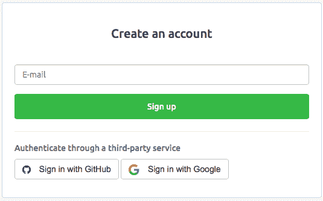
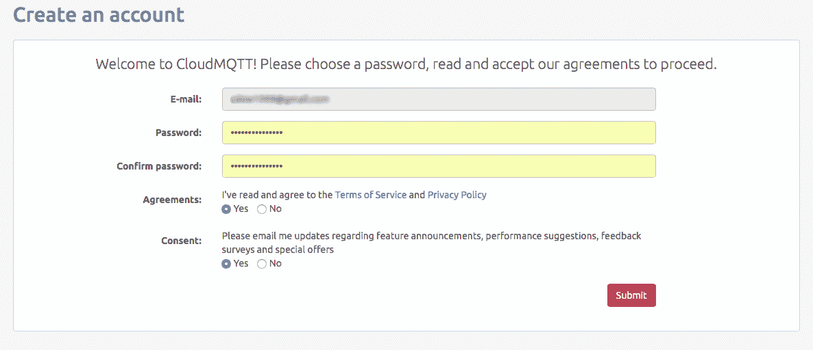
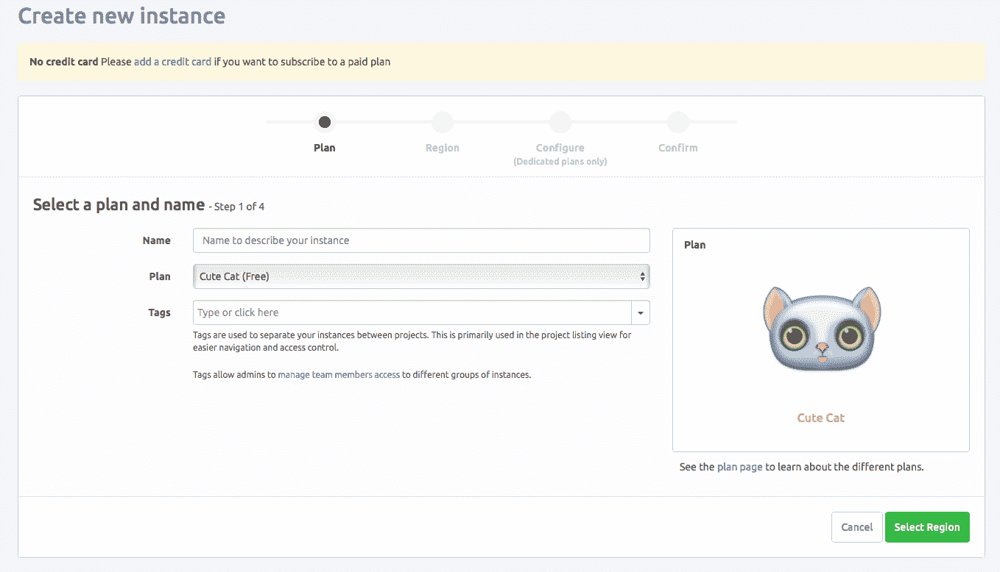
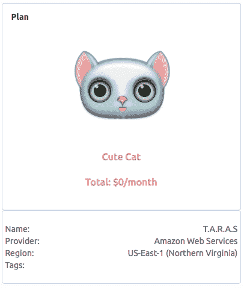
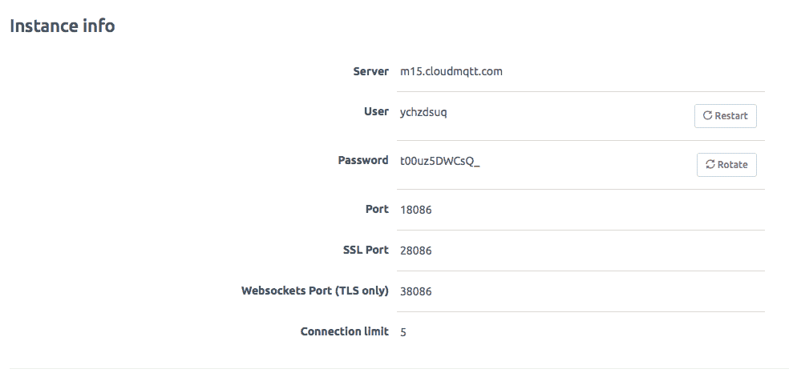
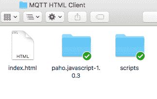
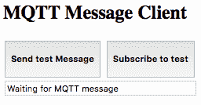
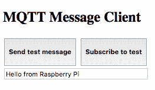

# 构建 JavaScript 客户端

让我们面对现实吧。如果没有互联网，我们真的不会有物联网。JavaScript，连同 HTML 和 CSS，是互联网的核心技术之一。物联网的核心是设备间通信的协议 MQTT。

在本章中，我们将把注意力从 Python 转移到使用 JavaScript 构建 JavaScript 客户机以订阅 MQTT 服务器上的主题上

本章将介绍以下主题：

*   介绍 JavaScript 云库
*   使用 JavaScript
    连接到云服务

# 项目概述

我们将从创建一个连接到 MQTT 代理（服务器）的简单 JavaScript 客户机开始本章。我们将向 MQTT 代理发送一条测试消息，然后将该消息返回到我们在其上创建 JavaScript 客户端的同一页面。然后，我们将从 Raspberry Pi 向我们的 MQTT 代理发布一条消息。

完成这一章需要几个小时。

# 开始

为完成本项目，需要以下各项：

*   Raspberry Pi 3 型（2015 型或更新型）
*   USB 电源
*   计算机显示器
*   USB 键盘
*   USB 鼠标
*   用于编写和执行 JavaScript 客户端程序的独立计算机

# 介绍 JavaScript 云库

让我们从提供 JavaScript 云库的背景开始。JavaScript 自互联网诞生之日起就已经存在（为了争论起见，1995 年）。它已经成为一种语言，可以将 HTML 网页转换为功能齐全的桌面应用程序。我个人认为 JavaScript 是最有用的编程语言之一（当然除了 Python 之外）。

JavaScript was released in 1995 and was designed to work with the most popular web browser at the time, Netscape Navigator. It was originally called livescript, but the name was changed to JavaScript due to the use and support of Java within the Netscape Navigator browser. Despite the similar syntax, Java and JavaScript really have nothing to do with each other—a confusing fact that continues to this day.

# 谷歌云

我们可以通过`google-api-javascript-client`访问谷歌云服务。具体来说，我们可以访问谷歌计算引擎，它是谷歌云平台的一个组件。通过谷歌计算引擎，我们可以通过使用按需虚拟机访问运行 Gmail、YouTube、谷歌搜索引擎和其他谷歌服务的基础设施。如果这听起来像是一种会给朋友留下深刻印象的技术胡言乱语，那么您可能需要深入研究一下这个 JavaScript 库。你可以在这里找到更多关于`google-api-javascript-client`的信息：[https://cloud.google.com/compute/docs/tutorials/javascript-guide](https://cloud.google.com/compute/docs/tutorials/javascript-guide) 。

# 用于 JavaScript 的 AWS SDK

Node.js 中的 AWS SDK for JavaScript 为 AWS 服务提供 JavaScript 对象。这些服务包括 amazons3、amazonec2、amazonswf 和 DynamoDB。此库使用 Node.js 运行时环境。您可以在此处找到有关此库的更多信息：[https://aws.amazon.com/sdk-for-node-js/](https://aws.amazon.com/sdk-for-node-js/) 。

Node.js was released in May of 2009\. The original author was Ryan Dhal and it is currently being developed by the company Joyent. Node.js allows for the execution of JavaScript code outside of the browser, thereby making it a JavaScript everywhere technology. This allows JavaScript to be used both on the server side and client side for web applications.

# Eclipse Paho JavaScript 客户端

Eclipse Paho JavaScript 客户端库是一个基于 MQTT 浏览器的 JavaScript 客户端库。Paho 本身是用 JavaScript 编写的，可以很容易地插入到 web 应用程序项目中。EclipsePAHOJavaScript 客户端库使用 web 套接字连接到 MQTT 代理。在本章中，我们将在我们的项目中使用此库。

# 使用 JavaScript 连接到云服务

对于我们的项目，我们将构建一个 JavaScript 客户机并将其连接到 MQTT 代理。我们将**发布**并**订阅**一个名为**测试**的**主题**。然后，我们将在 Raspberry Pi 上编写一个简单的小程序，以发布到名为 test 的主题。这段代码将演示使用 MQTT 发送和接收消息是多么容易。

请看下图，了解我们将在本项目中完成的工作：


# 设置 CloudMQTT 帐户

第一步是设置 MQTT 代理。我们可以通过使用 Mosquitto 平台（[www.Mosquitto.org](http://www.mosquitto.org)在本地安装一个。我们将使用网站[www.cloudmqtt.com](http://www.cloudmqtt.com)建立一个基于云的 MQTT 代理。

要设置帐户，请执行以下操作：

1.  在浏览器中，导航至[www.cloudmqtt.com。](http://www.cloudmqtt.com)
2.  单击右上角的登录。

3.  在“创建帐户”框中，键入您的电子邮件地址：



4.  您将收到一封电子邮件，要求您确认该电子邮件地址。您可以通过单击电子邮件中的“确认电子邮件”按钮来完成确认过程。
5.  然后，您将进入需要输入密码的页面。选择密码，确认密码，然后按提交：



6.  然后，您将进入实例页面。在这里，我们将创建一个 MQTT 代理实例来发送和发布 MQTT 消息。

# 设置 MQTT 代理实例

现在我们已经设置了 CloudMQTT 帐户，是时候创建一个用于我们的应用程序的实例了：

1.  在实例页面中，单击绿色大按钮，说明创建新实例。
2.  您将看到以下页面：



3.  在名称框中，输入 AutoT0.（我们将命名 MQTT 代理实例，因为我们将考虑 T.A.R.A.S 机器人车的这个代理部分）。
4.  在“计划”下拉列表中，选择“可爱的猫”（这是一个免费的选项，适合于开发目的）。
5.  单击绿色的“选择区域”按钮。
6.  根据您在世界上的位置，选择一个靠近您地理位置的区域。由于我位于加拿大，我将选择 US-East-1（北弗吉尼亚州）：


7.  单击绿色的确认按钮。
8.  您将看到确认新实例页面。在单击绿色的“确认实例”按钮之前，请查看此信息：



9.  您应该看到列表中包含 T.a.R.a.S 实例的实例列表：


# 编写 JavaScript 客户端代码

这是我在我的帐户上设置的 T.a.R.a.S 实例的屏幕截图。请注意列表中的值。这些值来自我的实例，而您的将不同。在编写 JavaScript 客户端时，我们将使用以下值：



要编写 JavaScript 客户端代码，我们应该在 T.a.R.a.S 上使用 Raspberry Pi 以外的计算机。您可以使用您想要的任何操作系统和 HTML 编辑器。我使用 macOS 和 VisualStudio 代码编写 JavaScript 客户端代码。您还需要 Paho JavaScript 库：

1.  导航到 Eclipse Paho 下载站点[https://projects.eclipse.org/projects/technology.paho/downloads](https://projects.eclipse.org/projects/technology.paho/downloads) 。
2.  单击 JavaScript 客户端链接。它将被标记为名称`JavaScript client`，后跟版本号。在撰写本文时，版本为 1.03。
3.  JavaScript 客户端库将下载为带有`paho.javascript-1.0.3`的 ZIP 文件。解压缩文件。
4.  我们需要在计算机上有一个文件夹用作项目文件夹。在您的计算机上创建一个新文件夹，并将其命名为`MQTT HTML Client`。
5.  在`MQTT HTML Client`文件夹内创建名为`scripts`的子文件夹。
6.  将解压后的`paho.javascript-1.0.3`文件夹拖放到`MQTT HTML Client`文件夹中。

7.  `MQTT HTML Client`文件夹内的目录结构应如下所示：


现在，是时候写代码了。我们将使代码尽可能简单，以便了解 MQTT 如何使用 JavaScript。我们的客户端代码将由两个文件组成，一个 HTML 页面和一个`.js`（JavaScript）文件。让我们从创建 HTML 页面开始：

1.  使用您喜爱的 HTML 编辑器，创建一个名为`index.html`的文件，并将其保存到项目根目录中。
2.  您的`project`文件夹应如下所示：



3.  在`index.html`文件中键入以下内容：

```py
<!DOCTYPE html>
<html>

<head>
    <title>MQTT Message Client</title>
    <script src="paho.javascript-1.0.3/paho-mqtt.js" type="text/javascript"></script>
    <script src="scripts/index.js" type='text/javascript'></script>
</head>

<body>

    <h2>MQTT Message Client</h2>
    <button onclick="sendTestData()">
        <h4>Send test message</h4>
    </button>

    <button onclick="subscribeTestData()">
        <h4>Subscribe to test</h4>
    </button>

    <div>
        <input type="text" id="messageTxt" value="Waiting for MQTT message" size=34 />
    </div>

</body>

</html>
```

4.  将更改保存到`index.html`。
5.  我们在这里所做的是创建了一个简单的 HTML 页面，并导入了两个 JavaScript 库，Paho JavaScript 库和一个名为`index.js`的文件，我们还没有创建：

```py
<script src="paho.javascript-1.0.3/paho-mqtt.js" type="text/javascript"></script>
<script src="scripts/index.js" type='text/javascript'></script>
```

6.  然后我们需要创建两个按钮；在顶部按钮上，我们将`onclick`方法设置为`sendTestData`。在底部按钮上，我们将`onclick`方法设置为`subscribeTestData`。这些方法将在我们将编写的 JavaScript 文件中创建。为简单起见，我们不会为这些按钮分配 ID 名称，因为我们不会在 JavaScript 代码中引用它们：

```py
<button onclick="sendTestData()">
        <h4>Send test Message</h4>
</button>
<button onclick="subscribeTestData()">
        <h4>Subscribe to test</h4>
</button>
```

7.  我们将在`index.html`页面中创建的最后一个元素是文本框。我们分配了一个`id`的`messageTxt`和一个`Waiting for MQTT message to the text box`的值：

```py
<div>
    <input type="text" id="messageTxt" value="Waiting for MQTT message" size=34 />
</div>
```

8.  如果我们将`index.html`加载到浏览器中，它将如下所示：



# 运行代码

在运行客户端代码之前，我们需要创建 JavaScript 文件，该文件将提供我们所需的功能：

1.  使用 HTML 编辑器，创建一个名为`index.js`的文件，并将其保存到项目目录中的`scripts`文件夹中。
2.  将以下代码添加到`index.js`并保存。用实例中的值替换`Server`、`User`、`Password`和`Websockets Port`（分别显示为`"m10.cloudmqtt.com"`、`38215`、`"vectydkb"`和`"ZpiPufitxnnT"`：

```py
function sendTestData() {
    client = new Paho.MQTT.Client
        ("m10.cloudmqtt.com", 38215, "web_" + 
                parseInt(Math.random() * 100, 10));

    // set callback handlers
    client.onConnectionLost = onConnectionLost;

    var options = {
        useSSL: true,
        userName: "vectydkb",
        password: "ZpiPufitxnnT",
        onSuccess: sendTestDataMessage,
        onFailure: doFail
    }

    // connect the client
    client.connect(options);
}

// called when the client connects
function sendTestDataMessage() {
    message = new Paho.MQTT.Message("Hello from JavaScript 
            client");
    message.destinationName = "test";
    client.send(message);
}

function doFail() {
    alert("Error!");
}

// called when the client loses its connection
function onConnectionLost(responseObject) {
    if (responseObject.errorCode !== 0) {
        alert("onConnectionLost:" + responseObject.errorMessage);
    }
}

// called when a message arrives
function onMessageArrived(message) {
    document.getElementById('messageTxt').value = message.payloadString; 
}

function onsubsribeTestDataSuccess() {
    client.subscribe("test");
    alert("Subscribed to test");
}

function subscribeTestData() {
    client = new Paho.MQTT.Client
        ("m10.cloudmqtt.com", 38215, "web_" + 
                parseInt(Math.random() * 100, 10));

    // set callback handlers
    client.onConnectionLost = onConnectionLost;
    client.onMessageArrived = onMessageArrived;

    var options = {
        useSSL: true,
        userName: "vectydkb",
        password: "ZpiPufitxnnT",
        onSuccess: onsubsribeTestDataSuccess,
        onFailure: doFail
    }

    // connect the client
    client.connect(options);
}
```

3.  通过刷新已加载`index.html`的浏览器来运行代码。
4.  单击订阅测试按钮。您应该会得到一个弹出对话框，其中包含订阅测试的消息。
5.  关闭弹出对话框。
6.  单击发送测试消息按钮。
7.  您应该会在文本框中看到消息`Hello from JavaScript client`。

这是我们刚才表演的魔术吗？嗯，在某种程度上，是这样的。我们刚刚在 MQTT 代理上完成了一个主题的订阅，然后发布到同一个主题，然后在同一个 JavaScript 客户端中接收一条消息。要从 MQTT 代理见证这一点，请执行以下操作：

1.  登录到您的 CloudMQTT 帐户
2.  单击 T.A.R.A.S 实例
3.  单击 WEBSOCKET UI 菜单选项
4.  您应该会看到以下对话框，说明您已连接：


5.  在浏览器的另一个选项卡或窗口中，导航回 JavaScript 客户端`index.html`
6.  再次单击发送测试消息按钮

7.  导航回 CloudMQTT 页面
8.  在“已接收消息”列表下，您应该看到一条消息：


9.  再点击 SendTestMessage 按钮几次，您会在 ReceivedMessages 下看到相同消息的列表。

# 理解 JavaScript 代码

在为 Raspberry Pi 编写代码之前，让我们看看从 java T0T 中获取的 JavaScript 代码。

我们将首先看一下订阅代码。我们用于从 MQTT 代理订阅主题的两种方法是`subscribeTestData`和`onsubsribeTestDataSuccess`。`subscribeTestData`创建名为`client`的 Paho MQTT 客户端对象。它通过使用`Server`和`Websockets Port`值实例化对象，使用`client`对象连接到我们的 MQTT 代理（为了简单起见，我在代码中保留了我帐户中的值）：

```py
function subscribeTestData() {
    client = new Paho.MQTT.Client
        ("m10.cloudmqtt.com", 38215, "web_" +     
                        parseInt(Math.random() * 100, 10));

    // set callback handlers
    client.onConnectionLost = onConnectionLost;
    client.onMessageArrived = onMessageArrived;

    var options = {
        useSSL: true,
        userName: "vectydkb",
        password: "ZpiPufitxnnT",
        onSuccess: onsubsribeTestDataSuccess,
        onFailure: doFail
    }

    // connect the client
    client.connect(options);
}
```

然后，我们将回调处理程序设置为`client.onConnectionLost`和`client.onMessageArrived`。回调处理程序将 JavaScript 代码中的函数链接到来自`client`对象的事件。在这种情况下，当与 MQTT 代理的连接丢失或消息从 MQTT 代理到达时。`options`变量将 SSL 的使用设置为`true`，设置`User`和`Password`设置，然后设置成功连接`onsubsribeTestDataSuccess`方法和尝试连接`doFail`方法失败的条件。然后，我们通过传入我们的`options`变量，通过`client.connect`方法连接到我们的 MQTT 代理。

成功连接到 MQTT 代理时调用`onsubsribeTestDataSuccess`方法。它将`client`对象设置为订阅`test`主题。然后，它会创建一个带有消息`Subscribed to test`的警报：

```py
function onsubsribeTestDataSuccess() {
    client.subscribe("test");
    alert("Subscribed to test");
}
```

如果与客户端的连接不成功，则调用`doFail`方法。它只是创建一个带有消息`Error!`的弹出式警报：

```py
function doFail() {
    alert("Error!");
}
```

现在，我们了解了订阅 AutoT0}主题的代码，让我们来看看发布到“TythT1”主题的代码。

`sendTestData`功能与`subscribeTestData`功能非常相似：

```py
function sendTestData() {
    client = new Paho.MQTT.Client
        ("m10.cloudmqtt.com", 38215, "web_" + parseInt(Math.random() * 100, 10));

    // set callback handlers
    client.onConnectionLost = onConnectionLost;

    var options = {
        useSSL: true,
        userName: "vectydkb",
        password: "ZpiPufitxnnT",
        onSuccess: sendTestDataMessage,
        onFailure: doFail
    }

    // connect the client
    client.connect(options);
}
```

名为`client`的 Paho MQTT 客户机对象是使用`subscribeTestData`函数中使用的相同参数创建的。唯一的回调处理程序集是`onConnectionLost`。我们没有设置`onMessageArrived`，因为我们正在发送消息而没有收到消息。`options`变量的设置值与`subscribeTestData`函数中使用的值相同，但`onSuccess`除外，我们将其分配给`sendTestDataMessage`函数。

`sendTestDataMessage`函数使用`Hello from JavaScript client`值创建一个新的 Paho MQTT 消息对象，并将其命名为`message`。`destinationName`是我们为其创建消息的主题，它被设置为`test`值。然后我们用`client.send`发送信息：

```py
function sendTestDataMessage() {
    message = new Paho.MQTT.Message("Hello from JavaScript client");
    message.destinationName = "test";
    client.send(message);
}
```

`onConnectionLost`函数用于订阅和发布，只需创建一个警报弹出窗口，其中包含来自 JavaScript 响应对象的错误消息：

```py
// called when the client loses its connection
function onConnectionLost(responseObject) {
    if (responseObject.errorCode !== 0) {
        alert("onConnectionLost:" + responseObject.errorMessage);
    }
}
```

现在我们已经有了 JavaScript 客户端订阅并发布到 MQTT 代理，让我们让 Raspberry Pi 参与进来。

# 从 Raspberry Pi 发布 MQTT 消息

让我们回到 Raspberry Pi（如果您一直在使用另一台计算机），并编写一些代码与我们的 MQTT 代理通信：

1.  从应用程序菜单|编程| Thonny Python IDE 打开 Thonny。
2.  单击新建图标创建一个新文件。
3.  在文件中键入以下内容：

```py
import paho.mqtt.client as mqtt
from time import sleep

mqttc = mqtt.Client()
mqttc.username_pw_set("vectydkb", "ZpiPufitxnnT")
mqttc.connect('m10.cloudmqtt.com', 18215)

while True:
    try:
        mqttc.publish("test", "Hello from Raspberry Pi")
    except:
        print("Could not send message!")
    sleep(10)

```

4.  将文件另存为`CloudMQTT-example.py`并运行它。
5.  导航回 CloudMQTT 页面。您应该会看到来自 Raspberry Pi 的消息：


6.  导航到我们的 JavaScript 客户端`index.html`。您应该在文本框中看到消息`Hello from the Raspberry Pi`（如果您没有看到消息，请刷新页面并再次单击 Subscribe to test）：



Raspberry Pi Python 代码刻意保持简单，以便理解这些概念。我们通过导入所需的库来启动代码。然后，我们创建一个 MQTT 客户机对象，我们称之为`mqttc`。用户名和密码使用`username_pw_set`方法设置。然后，我们通过传递`Server`和`Port`值，使用`connect`方法连接到 MQTT 代理（对于 Python 客户端，我们使用`Port`而不是`Websockets Port`。在一个连续循环中，我们通过`publish`方法将主题`test`和消息`Hello from Raspberry Pi`传递给 MQTT 代理。

# 总结

在本章中，我们在使用 JavaScript 创建 MQTT 客户机之前研究了 JavaScript 库。我们建立了一个基于云的 MQTT 代理，能够使用 JavaScript 客户端和 Raspberry Pi 上的 Python 程序发布和订阅消息。

在[第 18 章](18.html)*中*我们将对本章所学内容进行扩展，并构建一个 JavaScript 客户端，可以通过互联网控制 T.a.R.a.S。

# 问题

1.  我们可以使用哪个程序（平台）在本地安装 MQTT 代理？
2.  对还是错？JavaScript 和 Java 是相同的技术。
3.  对还是错？我们可以使用 JavaScript 创建 MQTT 客户机。
4.  我们可以使用`google-api-javascript-client`库访问哪些谷歌服务？
5.  对还是错？MQTT 是物联网中使用的协议。
6.  JavaScript Node.js 技术允许您做什么？
7.  对还是错？Python 可用于开发 MQTT 客户机。
8.  对还是错？我们可以使用 script 标记将外部 JavaScript 库中的功能添加到我们的网页中。
9.  如何在 JavaScript 代码中设置 MQTT 客户机的用户名和密码？
10.  对还是错？我们可以在云 MQTT 应用程序中查看已发布的消息。

# 进一步阅读

有关使用基于云的 MQTT 代理的更多信息，请参阅位于[的 CloudMQTT 文档 https://www.cloudmqtt.com/docs.html](https://www.cloudmqtt.com/docs.html) [。](https://www.cloudmqtt.com/docs.html)