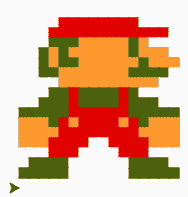
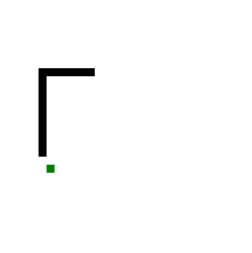
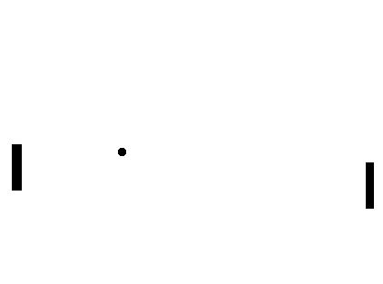
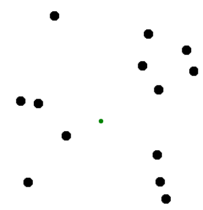

# 用海龟升级蛇游戏

大多数电脑游戏玩家认为游戏因其外观而令人兴奋和有吸引力。在某种程度上，这是正确的。电脑游戏必须在视觉上有吸引力，让玩家感觉他们在实际参与其中。大多数游戏开发人员和游戏设计师花费大量时间开发游戏图形和动画，以便为玩家提供更好的体验。

本章将教您如何使用 Python`turtle`模块从头开始构建游戏的基本布局。正如我们所知，`turtle`模块允许我们制作二维（2D）运动的游戏；因此，在本章中，我们将只制作 2D 游戏，如 flappy bird、pong 和 snake。为了将游戏角色的动作与用户动作结合起来，我们将在本章中介绍的概念非常重要。

在本章结束时，您将学习如何通过创建二维动画和游戏来实现数据模型。因此，您将学习如何处理游戏逻辑的不同组件，例如定义碰撞、边界、投影和屏幕点击事件。通过学习游戏编程的这些方面，您将能够学习如何使用`turtle`模块定义和设计游戏组件。

本章将介绍以下主题：

*   计算机像素概述
*   使用海龟模块的简单动画
*   使用海龟升级蛇游戏
*   乒乓球比赛
*   飞鸟游戏
*   游戏测试和可能的修改

# 技术要求

您应该拥有以下资源：

*   Python 3.5 或更新版本
*   Python 空闲（Python 的内置 IDE）
*   文本编辑器
*   网络浏览器

本章文件可在此处找到：[https://github.com/PacktPublishing/Learning-Python-by-building-games/tree/master/Chapter10](https://github.com/PacktPublishing/Learning-Python-by-building-games/tree/master/Chapter10)

请查看以下视频以查看代码的运行情况：

[http://bit.ly/2oJLeTY](http://bit.ly/2oJLeTY)

# 探索计算机像素

当你仔细观察计算机屏幕时，你可能会发现形成行和列的小点。从一定距离看，点阵代表图像，这是我们通常在屏幕上看到的。这些点称为像素。由于电脑游戏在本质上应该是令人愉悦的视觉，我们必须使用这些像素来创建和定制游戏屏幕，甚至使用它们来让玩家在游戏中移动，这将显示在屏幕上。每当玩家按下键盘上的任何键时，移动的变化必须反映在屏幕的像素上。例如，当玩家按下**右**键时，特定角色必须在屏幕上向右移动一定数量的像素单位，以表示运动。我们在前一章中讨论了矢量运动，它能够覆盖某些类的方法来实现运动。我们将使用矢量技术为游戏角色进行像素移动。让我们观察下面的大纲，我们将对其进行调整，以使用向量和海龟模块制作任何游戏：

1.  制作一个`Vector`类，该类将包含`__add__()`、`__mul__()`和`__div__()`等方法，这些方法将对我们的向量点执行算术运算。
2.  使用`Vector`类在游戏屏幕上实例化一个玩家及其瞄准目标或动作。
3.  使用`turtle`模块制作游戏边界。

4.  使用`turtle`模块绘制游戏角色。

5.  旋转、前进和移动等操作应在`Vector`类中使用，以便使游戏角色移动。
6.  使用主循环处理用户事件。

我们将通过制作一个简单的**马里奥**像素艺术来学习像素表现。下面的代码显示多维列表中像素的表示，多维列表是一个列表列表。我们使用多维列表将每个像素存储在一行上：

```py
>>> grid = [[1,0,1,0,1,0],[0,1,0,1,0,1],[1,0,1,0,1,0]]
```

前面的网格由表示像素位置的三条线组成。与列表元素提取方法类似，`>>> grid[1][4]`语句从网格的第二个列表（即[0,1,0,1,0,1]）返回位置值“0”。（参见[第 4 章](04.html)、*数据结构和函数*，了解更多列表操作）这样，我们就可以访问网格内的任何单元格。

应在 Python 脚本中编写以下代码。通过创建一个`mario.py`文件，我们将使用它来创建马里奥像素艺术：

1.  首先导入海龟-`import turtle`-我们将要使用的唯一模块。
2.  使用`>>> Pen = turtle.Turtle()`命令实例化海龟模块。
3.  使用“速度”和“颜色”属性为画笔指定两个属性：

```py
      Pen.speed(0)
          Pen.color("#0000000")   #or Pen.color(0, 0, 0)
```

4.  我们必须制作一个名为`box`的`new`函数，它将通过使用 turtle 方法绘制方形来绘制一个长方体。此框大小表示像素艺术的尺寸：

```py
       def box(Dimension): #box method creates rectangular box
               Pen.begin_fill()
           # 0 deg.
               Pen.forward(Dimension)
               Pen.left(90)
           # 90 deg.
               Pen.forward(Dimension)
               Pen.left(90)
           # 180 deg.
               Pen.forward(Dimension)
               Pen.left(90)
           # 270 deg.
               Pen.forward(Dimension)
               Pen.end_fill()
               Pen.setheading(0)
```

5.  我们必须定位笔，从屏幕左上角开始绘画。这些命令应在`box()`功能之外定义：

```py
      Pen.penup()
      Pen.forward(-100)
      Pen.setheading(90)
      Pen.forward(100)
      Pen.setheading(0)
```

6.  定义框大小，它表示我们将要绘制的像素艺术的尺寸：

```py
      boxSize = 10
```

7.  在第二阶段，必须以多维列表的形式声明像素，该列表表示每个像素的位置。以下`grid_of_pixels`变量表示代表像素位置的线网格。必须在`box`函数定义之外添加以下代码行。（参见[https://github.com/PacktPublishing/Learning-Python-by-building-games](https://github.com/PacktPublishing/Learning-Python-by-building-games) 定位游戏文件，即`mario.py`：

Remember that a combination of pixels in a single form represents a straight line.

```py
      grid_of_pixels = [[1,1,1,1,2,2,2,2,2,2,2,2,1,1,1,1]]
      grid_of_pixels.append([1,1,1,2,2,2,2,2,2,2,2,2,2,2,2,1])
      grid_of_pixels.append([1,1,1,0,0,0,3,3,3,3,3,0,3,1,1,1])
      grid_of_pixels.append([1,1,0,3,0,3,3,3,3,3,3,0,3,3,3,1])
      grid_of_pixels.append([1,1,0,3,0,0,3,3,3,3,3,3,0,3,3,3])
      grid_of_pixels.append([1,1,0,0,3,3,3,3,3,3,3,0,0,0,0,1])
      grid_of_pixels.append([1,1,1,1,3,3,3,3,3,3,3,3,3,3,1,1])
      grid_of_pixels.append([1,1,1,0,0,2,0,0,0,0,2,0,1,1,1,1])
      grid_of_pixels.append([1,1,0,0,0,2,0,0,0,0,2,0,0,0,1,1])
      grid_of_pixels.append([0,0,0,0,0,2,2,2,2,2,2,0,0,0,0,0])
      grid_of_pixels.append([3,3,3,0,2,3,2,2,2,2,3,2,0,3,3,3])
      grid_of_pixels.append([3,3,3,3,2,2,2,2,2,2,2,2,3,3,3,3])
      grid_of_pixels.append([3,3,3,2,2,2,2,1,1,2,2,2,2,3,3,3])
      grid_of_pixels.append([1,1,1,2,2,2,1,1,1,1,2,2,2,1,1,1])
      grid_of_pixels.append([1,0,0,0,0,1,1,1,1,1,1,0,0,0,0,1])
      grid_of_pixels.append([0,0,0,0,0,1,1,1,1,1,1,0,0,0,0,0])
```

8.  使用颜色定义像素艺术的调色板。我们将使用颜色代码来定义艺术的颜色，如下代码所示。十六进制颜色代码（HEX）表示红色、绿色和蓝色的颜色组合（#RRGGBB）。参见[https://htmlcolorcodes.com/](https://htmlcolorcodes.com/) 为了分析不同颜色的不同代码：

```py
      palette = ["#4B610B" , "#FAFAFA" , "#DF0101" , "#FE9A2E"]
```

9.  接下来，我们应该开始使用我们在*步骤 7*和*步骤 8*中定义的像素网格和调色板绘制像素艺术。我们必须使用之前使用`box()`函数制作的`box`类来制作像素艺术。像素艺术由行和列组成；因此，我们必须为绘画艺术声明两个循环。下面的代码从海龟模块调用不同的函数，例如`forward()`、`penup()`和`pendown()`。我们在前一章研究了它们；他们将使用钢笔根据像素网格定义的列表列表进行绘制：

```py
       for i in range (0,len(grid_of_pixels)):
               for j in range (0,len(grid_of_pixels[i])):
                   Pen.color(palette[grid_of_pixels[i][j]])
                   box(boxSize)
                   Pen.penup()
                   Pen.forward(boxSize)
                   Pen.pendown()    
               Pen.setheading(270)
               Pen.penup()
               Pen.forward(boxSize)
               Pen.setheading(180)
               Pen.forward(boxSize*len(grid_of_pixels[i]))
               Pen.setheading(0)
               Pen.pendown()
```

让我们消化一下前面的代码片段。它包含一个`for`循环，从初始值 0 循环到表示画布中位置的像素网格长度。每个像素代表一个位置，我们必须在这里用钢笔画；因此，我们在每个像素上循环，一次一个。在 2D`for`循环中，我们从调色板中获取颜色并调用`box`方法，该方法创建一个矩形框，用于渲染马里奥艺术。我们使用`forward()`功能，用乌龟笔在这个盒子里画画。我们在像素行中执行相同的操作，如 i<sup>th</sup>循环所示。

一旦我们完成了前面代码的组合，也就是说，我们已经执行了`box`方法、初始化和两个主要的`for`循环，我们就可以运行代码并观察下面的 Mario pixel 艺术了。运行我们的代码后，`turtle`模块中的笔将开始绘图，最终它将为我们提供以下艺术：



由于我们熟悉像素和矢量运动的概念，现在是时候使用 2D 图形制作游戏了。我们将使用`turtle`模块以及数据模型来创建游戏角色并使其移动。在下一节中，我们将通过制作一个简单的动画来开始这次冒险。

# 使用海龟模块理解简单动画

到目前为止，我们可能已经熟悉了`turtle`模块的不同方法。这意味着我们为游戏创建角色不会有任何问题。类似地，游戏角色的运动也使用矢量运动提供。矢量加减等操作通过对象的旋转提供直线运动（详见[第 9 章](09.html)、*数据模型实现*）。下面代码段中定义的`move`操作将为游戏角色提供随机移动。`move`方法将采用另一个向量作为催化剂，并将执行数学运算以更新当前位置，同时考虑游戏角色的方向：

```py
>>> v = (1,2) #vector coordinates
>>> v.move(3,4) # vector addition is done (1,2) + (3,4)
>>> v
(4,6)
```

`rotate`方法将逆时针旋转矢量一个特定角度（就地）。以下示例表示`rotate`方法调用：

```py
>>> v = vector(1, 2)
>>> v.rotate(90)
>>> v == vector(-2, 1)
True
```

我们必须在`Vector`类中定义前面两个方法。按照以下步骤实现`Vector`类：

1.  您必须首先用 class 关键字定义`Vector`类。我们将插槽定义为类属性，它将包含三个属性。插槽表示一个属性，其中包含三条关键信息：*x*、*y、*和散列。值*x*和*y*是游戏角色的当前位置，而哈希用于定位数据记录。例如，如果用*x*和*y*坐标实例化`Vector`类，则会激活哈希属性。否则，它将保持停用状态。
2.  向量化元素的坐标（5,6）由*x*和*y 表示，其中*x=5*和*y=6*，哈希变量表示插槽是否为空。散列变量用于定位数据记录并检查`Vector`类是否实例化。如果 slot 属性已经包含*x*和*y*，则该散列属性将限制对 slot 的进一步分配。我们还将定义`PRECISION`属性（用户定义），它将*x*和*y*的坐标舍入到一定的水平。为了清楚起见，代码中添加了几个示例，您可以在三行注释中观察到这一点：*

```py
      #following class will create vector 
      #representing current position of game character
      class vector(collections.Sequence):
          """Two-dimensional vector.

          Vectors can be modified in-place.

          >>> v = vector(0, 1)
          >>> v.move(1)
          >>> v
          vector(1, 2)
          >>> v.rotate(90)
          >>> v
          vector(-2.0, 1.0)

          """

          PRECISION = 6 #value 6 represents level of rounding
          #for example: 4.53434343 => 4.534343
          __slots__ = ('_x', '_y', '_hash')
```

3.  接下来，我们需要定义类的第一个成员。我们知道这个类的第一个成员是`__init__()`方法。我们将定义它以初始化类属性，它们是*x*和*y*。如`PRECISION`属性所示，我们已将*x*和*y*的值四舍五入到一定的精度水平。`round()`是 Python 的内置函数。下面的代码行包含一个构造函数，我们使用`round`方法初始化向量坐标（*x*、*y*）：

```py
      def __init__(self, x, y):
              """Initialize vector with coordinates: x, y.

              >>> v = vector(1, 2)
              >>> v.x
              1
              >>> v.y
              2

              """
              self._hash = None
              self._x = round(x, self.PRECISION)
              self._y = round(y, self.PRECISION)
```

4.  您可能已经注意到，您已经将*x*和*y*属性作为私有属性，因为它们以一个下划线（`_x`、`_y`开头）。因此，无法在这些类型的属性中进行直接初始化，这导致了**数据封装**，我们在面向对象的范例主题中介绍了这一点。现在，为了获取和设置这些属性的值，您必须使用`getter`和`setter`方法。这两个方法将成为`Vector`类的属性。下面的代码表示如何为我们的`Vector`类实现`getter`和`setter`：

```py
      @property
          def x(self):
              """X-axis component of vector.

              >>> v = vector(1, 2)
              >>> v.x
              1
              >>> v.x = 3
              >>> v.x
              3

              """
              return self._x

          @x.setter
          def x(self, value):
              if self._hash is not None:
                  raise ValueError('cannot set x after hashing')
              self._x = round(value, self.PRECISION)

          @property
          def y(self):
              """Y-axis component of vector.

              >>> v = vector(1, 2)
              >>> v.y
              2
              >>> v.y = 5
              >>> v.y
              5

              """
              return self._y

          @y.setter
          def y(self, value):
              if self._hash is not None:
                  raise ValueError('cannot set y after hashing')
              self._y = round(value, self.PRECISION)
```

5.  除了`getter`和`setter`方法，您可能已经观察到`_hash`，它表示插槽是否已经分配。为了检查插槽是否已被占用，我们必须实现一个数据模型，即`__hash__()`。

Just a quick review: data models, or magic functions, allow us to change the implementation of a method that is provided by one of its ancestors.

现在，我们将在我们的`Vector`类上定义`hash`方法，并以不同的方式实现它：

```py
      def __hash__(self):
              """v.__hash__() -> hash(v)

              >>> v = vector(1, 2)
              >>> h = hash(v)
              >>> v.x = 2
              Traceback (most recent call last):
                  ...
              ValueError: cannot set x after hashing

              """
              if self._hash is None:
                  pair = (self.x, self.y)
                  self._hash = hash(pair)
              return self._hash
```

6.  最后，您必须在`Vector`类中实现两个主要方法：`move()`和`rotate()`。我们将从`move`方法开始。`move`方法将通过其他（就地）移动向量。这里，另一个是传递给`move`方法的参数。例如，`(1, 2).move(2, 3)`将导致（3,5）。请记住：移动是通过任何向量算术运算完成的，即加、乘、除等。我们将使用`__add__()`魔术功能（参见[第 9 章](09.html)、*数据模型实现*）为向量创建运动。在此之前，我们必须创建一个 copy 方法，该方法将返回向量的副本。`copy()`方法是必要的，因为我们不希望操作损害我们的原始向量；相反，我们将对原始向量的副本执行算术运算：

```py
      def copy(self):
              """Return copy of vector.

              >>> v = vector(1, 2)
              >>> w = v.copy()
              >>> v is w
              False

              """
              type_self = type(self)
              return type_self(self.x, self.y)
```

7.  在实现`add`功能之前，您必须先实现`iadd`魔术功能。我们使用`__iadd__`方法来实现扩展的`add`操作符分配。我们可以在`Vector`类中实现`__iadd__()`魔法函数，如下所示。我们在上一章中看到了它的实现（[第 9 章](09.html)、*数据模型实现）*：

```py
      def __iadd__(self, other):
              """v.__iadd__(w) -> v += w

              >>> v = vector(1, 2)
              >>> w = vector(3, 4)
              >>> v += w
              >>> v
              vector(4, 6)
              >>> v += 1
              >>> v
              vector(5, 7)

              """
              if self._hash is not None:
                  raise ValueError('cannot add vector after hashing')
              elif isinstance(other, vector):
                  self.x += other.x
                  self.y += other.y
              else:
                  self.x += other
                  self.y += other
              return self
```

8.  现在，您必须创建一个新方法，`__add__`，它将在原始向量的副本上调用前面的`__iadd__()`方法。最后一句话`__radd__ = __add__`意义重大。让我们观察一下`radd`和 add 之间的图示关系。它的工作原理是这样的：Python 尝试计算表达式，*向量（1,4）+向量（4,5）*。首先，它调用`int.__add__((1,4), (4,5))`，这引发了一个异常。在此之后，它将尝试调用`Vector.__radd__((1,4), (4,5))`：


不难看出，`__radd__`的实现类似于`add`：（参考`__add__()`方法注释中定义的示例代码）：

```py
       def __add__(self, other):
              """v.__add__(w) -> v + w

              >>> v = vector(1, 2)
              >>> w = vector(3, 4)
              >>> v + w
              vector(4, 6)
              >>> v + 1
              vector(2, 3)
              >>> 2.0 + v
              vector(3.0, 4.0)

              """
              copy = self.copy()
              return copy.__iadd__(other)

          __radd__ = __add__
```

9.  最后，我们准备为动画制作第一个运动序列。我们将从定义类中的`move`方法开始。`move()`方法将单个参数作为向量，并将其添加到表示游戏角色当前位置的当前向量中。`move`方法将实现直线加法。以下代码表示`move`方法的定义：

```py
      def move(self, other):
              """Move vector by other (in-place).

              >>> v = vector(1, 2)
              >>> w = vector(3, 4)
              >>> v.move(w)
              >>> v
              vector(4, 6)
              >>> v.move(3)
              >>> v
              vector(7, 9)

              """
              self.__iadd__(other)
```

10.  接下来，我们需要创建`rotate()`方法。这种方法创建起来相当棘手，因为它会将矢量逆时针旋转指定的角度（原地）。此方法将使用三角运算，例如角度的正弦和余弦；因此，我们必须首先导入一个数学模块：`import math`。
11.  以下代码描述了定义旋转方法的方式；在它里面，我们添加了注释，让您清楚地了解这个操作。首先，我们使用：`angle*π/ 180.0`命令/公式将角度转换为弧度。之后，我们获取向量类的*x*和*y*坐标，并执行`x = x*cosθ - y*sinθ`和`y = y*cosθ + x*sinθ`操作：

```py
      import math
      def rotate(self, angle):
              """Rotate vector counter-clockwise by angle (in-place).

              >>> v = vector(1, 2)
              >>> v.rotate(90)
              >>> v == vector(-2, 1)
              True

              """
              if self._hash is not None:
                  raise ValueError('cannot rotate vector after hashing')
              radians = angle * math.pi / 180.0
              cosine = math.cos(radians)
              sine = math.sin(radians)
              x = self.x
              y = self.y
              self.x = x * cosine - y * sine
              self.y = y * cosine + x * sine
```

数学公式*x=x*cosθ-y*sin**θ*在矢量运动中具有重要意义。此公式用于为游戏角色提供旋转运动。*x*cosθ*表示基础*x*轴运动，*y*sinθ*表示垂直*y*轴运动。因此，该公式有助于以θ角旋转二维平面中的点。

最后，我们完成了两种方法：`move()`和`rotate()`。这两种方法是完全独特的，但它们都表示矢量运动。`move()`方法实现了`__iadd_()`魔术函数，而`rotate()`方法有自己的自定义三角函数实现。这两种方法的结合可以在画布或游戏屏幕上形成游戏角色的完整运动。要构建任何类型的 2D 游戏，我们必须实现类似类型的动作。现在，我们将制作一个简单的蚂蚁游戏动画，开始我们的游戏冒险之旅。

以下步骤描述了为 2D 游戏制作任何动画的过程：

1.  首先，您必须导入必要的模块。因为我们必须给之前的`move()`方法提供随机向量坐标，所以我们可以预测我们将需要一个随机模块。
2.  之后，我们需要另一个模块——一个`turtle`模块，它允许我们调用诸如 ontimer 和 setup 之类的方法。我们还需要向量类的方法，即`move()`和`rotate()`。
3.  如果该类在任何其他模块或文件中维护，我们必须导入它。创建两个文件：`base.py`用于矢量运动，`animation.py`用于动画。然后，导入以下语句：

```py
      from random import *
      from turtle import *
      from base import vector
```

4.  前两条语句将导入随机模块和`turtle`模块中的所有内容。第三条语句将从基文件或模块导入 vector 类。
5.  接下来，我们需要定义游戏角色的初始位置及其目标。应将其初始化为 vector 类的实例：

```py
      ant = vector(0, 0) #ant is character
      aim = vector(2, 0) #aim is next position
```

6.  现在，您必须定义 wrap 方法。此方法将*x*和*y*位置作为参数，称为`value`并返回该参数。在即将推出的游戏（如 flappy bird 和 Pong）中，我们将扩展此函数，并使其围绕某些边界点包装值：

```py
      def wrap(value):
          return value 
```

7.  游戏的主要控制单元是`draw()`函数，它调用一种方法使游戏角色移动。在`Vector`类中，我们将调用`move`和`rotate`方法。在海龟模块中，我们将调用`goto`、`dot`和`ontimer`方法。`goto`方法会将海龟笔移动到游戏屏幕上的指定位置，`dot`方法会在调用时创建一个指定长度的小点，`ontimer(function, t)`方法会安装一个计时器，在`t`毫秒后调用该功能：

```py
      def draw():
          "Move ant and draw screen."
          ant.move(aim)
          ant.x = wrap(ant.x)
          ant.y = wrap(ant.y)

          aim.move(random() - 0.5)
          aim.rotate(random() * 10 - 5)

          clear()
          goto(ant.x, ant.y)
          dot(10)

          if running:
              ontimer(draw, 100)
```

8.  在前面的代码中，`running`变量没有声明。我们现在就做，在`draw()`方法的定义之外。我们还将使用以下代码设置游戏屏幕：

```py
      setup(420, 420, 370, 0)
      hideturtle()
      tracer(False)
      up()
      running = True
      draw()
      done()
```

最后，我们完成了一个简单的 2D 动画。它由一个长度为 10 像素的简单点组成，但更重要的是，它附带了运动，这是在`Vector`类中实现魔法函数的结果。下一节将教我们如何使用我们在本节中实现的魔法功能，以制作一个更健壮的游戏，即蛇游戏。我们将使用海龟模块和魔法功能制作一个蛇游戏。

# 使用海龟升级蛇游戏

事实证明，在本书的前几章中，我们一直在构建蛇游戏：在[第 5 章](05.html)中，*通过构建蛇游戏*学习诅咒，使用诅咒模块；在[第 6 章](06.html)中*面向对象编程*；在[第 7 章](07.html)中*列表理解和属性*通过使用属性和列表理解对其进行细化。我们从诅咒模块开始（[第 5 章](05.html)，*通过构建蛇游戏*学习诅咒），并使用面向对象的范例对其进行了修改。诅咒模块能够提供一个基于角色的终端游戏屏幕，这最终使游戏角色看起来很糟糕。尽管我们学习了如何使用**OOP**和诅咒构建逻辑，以及制作蛇游戏，但应该注意的是，游戏主要关注视觉效果：玩家如何看待角色以及与角色的互动。因此，我们主要关注的是使游戏在视觉上具有吸引力。在本节中，我们将尝试使用海龟模块和矢量运动升级蛇游戏。由于在蛇游戏中只有一种可能的移动，即按**左、右、上、**或**下**键的直线移动，因此我们不必在基本文件的 vector 类中定义任何新的内容。我们之前制作的`move()`方法足以为蛇类游戏提供动作。

让我们按照以下步骤，使用海龟模块和`Vector`类开始编写蛇游戏：

1.  通常，从导入必要的模块开始，如下代码所示。您不必首先导入所有内容；我们也可以将其与编码其他内容一起进行，但一次导入所有内容是一种很好的做法，这样我们以后就不会忘记任何内容：

```py
      from turtle import *
      from random import randrange
      from base import vector
```

2.  现在，让我们集思广益。我们还不能使用精灵或图像。在我们开始 Pygame 之后，我们将在接下来的章节中了解这些。现在，我们必须制作一个代表 2D 蛇的形状，这是我们的主要角色。您必须打开`base.py`文件，我们在其中创建了一个`Vector`类并定义了一个`Square`方法。注意，`Square`方法是在`Vector`类之外声明的。以下代码是 turtle 方法的简单实现，该方法将使用 turtle 笔创建方形：

```py
      def square(x, y, size, name):
          """Draw square at `(x, y)` with side length `size` and fill color 
           `name`.

          The square is oriented so the bottom left corner is at (x, y).

          """
          import turtle
          turtle.up()
          turtle.goto(x, y)
          turtle.down()
          turtle.color(name)
          turtle.begin_fill()

          for count in range(4):
              turtle.forward(size)
              turtle.left(90)

          turtle.end_fill()
```

3.  接下来，在 Snake 游戏模块中导入这个新制作的方法。现在，我们可以在 Snake 游戏的 Python 文件中调用 square 方法：

```py
      from base import square
```

4.  在导入所有内容之后，我们将声明变量，如 food、snake 和 aim。食物代表向量坐标，它是`Vector`类的一个实例，例如向量（0,0）。蛇代表蛇角色的初始向量化位置，即（向量（10,0）），而蛇体必须是向量表示的列表，即长度为 3 的蛇的（向量（10,0）、向量（10,1）和向量（10,2））。`aim`向量表示必须根据用户的键盘操作向当前 snake 向量添加或减去的单位：

```py
      food = vector(0, 0)
      snake = [vector(10, 0)]
      aim = vector(0, -10)
```

5.  在`snake-Python`文件（主文件）中，导入所有内容并声明其属性后，我们将开始定义蛇游戏的边界，如下所示：

```py
      def inside(head):
          "Return True if head inside boundaries."
          return -200 < head.x < 190 and -200 < head.y < 190
```

6.  您还应该定义蛇游戏的另一个重要方法，称为`move()`，因为这将处理游戏屏幕上蛇角色的移动，如下所示：

```py
      def move():
          "Move snake forward one segment."
          head = snake[-1].copy()
          head.move(aim)

          if not inside(head) or head in snake:
              square(head.x, head.y, 9, 'red')
              update()
              return

          snake.append(head)

          if head == food:
              print('Snake:', len(snake))
              food.x = randrange(-15, 15) * 10
              food.y = randrange(-15, 15) * 10
          else:
              snake.pop(0)

          clear()

          for body in snake:
              square(body.x, body.y, 9, 'black')

          square(food.x, food.y, 9, 'green')
          update()
          ontimer(move, 100)
```

7.  让我们从逐行理解代码开始：

*   在`move`方法开始时，我们获取`snakehead`并执行了一个复制操作，该操作在`Vector`类中定义，我们让一条蛇自动向前移动一段，因为我们希望蛇在用户开始玩游戏时自动移动。
*   之后，`if not inside(head) or head in snake`语句用于检查是否存在任何碰撞。如果有，我们将通过向蛇渲染`Red`颜色返回。

*   在声明的下一行`head == food`中，我们检查了蛇是否能吃东西。一旦玩家吃了食物，我们将使食物出现在另一个随机位置，并在 Python 控制台中打印分数。
*   在`for body in snake: ..`语句中，我们将蛇的整个身体循环并呈现`black`颜色。
*   调用在`Vector`类中定义的`square`方法为游戏创建食物。
*   在代码的最后一条语句中，调用了`ontimer()`方法，该方法使用`move()`函数，它将安装一个计时器，每隔 100 毫秒调用一次`move`方法。

8.  定义`move()`方法后，您必须设置游戏屏幕并处理海龟屏幕。通过`setup`方法传递的参数为`width`、`height`、`setx`和`sety`位置：

```py
      setup(420, 420, 370, 0)
      hideturtle()
      tracer(False)
```

9.  我们游戏的最后一部分是处理用户事件。我们必须让用户玩游戏；因此，每当收到用户的键盘输入时，我们必须调用相应的函数。由于蛇是一种简单的游戏，只包含几个动作，我们将在下一节中介绍它。一旦用户按下任何键，我们必须通过改变蛇的方向来处理它。因此，我们必须制定一种处理用户操作的快速方法。下面的`change()`方法将根据用户事件改变蛇的方向。这里，我们使用了 turtle 模块提供的`listen`接口，它将监听任何传入的用户事件或键盘输入。`onkey()`取函数，根据用户事件调用变更方法。例如，当按下`Up`时，我们将通过将当前`y`值增加 10 个单位来改变*y*坐标：

```py
      def change(x, y):
          "Change snake direction."
          aim.x = x
          aim.y = y

      listen()
      onkey(lambda: change(10, 0), 'Right')
      onkey(lambda: change(-10, 0), 'Left')
      onkey(lambda: change(0, 10), 'Up')
      onkey(lambda: change(0, -10), 'Down')
      move()
      done()
```

是时候运行我们的游戏了，但在此之前，请记住将两个文件（包含`vector`和`square`类的文件，以及包含 Snake 游戏的文件）保留在同一目录中。游戏的输出如下所示：



除了海龟图形，我们还可以在 Python 终端中看到它旁边打印的分数：


现在我们已经通过使用 Python 模块和 OOP 范例提供的几种方法介绍了 Snake 游戏，我们可以在接下来的游戏中反复使用这些方法。在`base.py`文件中定义的`Vector`类可以在许多 2D 游戏中反复访问。因此，代码的重用是 OOP 提供的主要优点之一。在接下来的章节中，我们将只使用`Vector`类制作一些游戏，例如 Pong 和 flappy bird。在下一节中，我们将从头开始构建乒乓球游戏。

# 探索乒乓球游戏

现在我们已经介绍了 Snake 游戏（虽然这是一个陈词滥调，但是掌握 2D 游戏编程的知识非常好），现在是时候制作另一个有趣的游戏了。我们将在本节中介绍的游戏是乒乓球游戏。如果您以前玩过，您可能会发现更容易掌握我们将在本节中介绍的概念。对于那些以前没有玩过的人，不要担心！我们将在本节中介绍所有内容，这将帮助您制作自己的乒乓球游戏，并与您的朋友一起玩，甚至与他们分享。下图是乒乓球游戏的图示：



上图描绘了乒乓球游戏的操场，其中两名玩家是两个矩形。它们可以上下移动，但不能从左向右移动。中间的**点**是球，必须由任何一名球员击球。我们必须为游戏中的角色解决两种类型的运动：

*   对于球，它可以在任何位置移动，但是如果任何一方的球员没有接到球，他们就输了，而对方球员赢了。
*   对于玩家来说，他们应该只向上或向下移动：两个玩家应该处理四个键盘键动作。

除了运动之外，为游戏指定边界更为棘手。水平线可以上下移动，是必须击球的位置，并向另一个方向反射，但如果球击中左侧或右侧垂直边界，比赛应暂停，错过球的球员将输球。现在，让我们集思广益，以便在真正开始编写代码之前了解要点：

*   创建一个随机函数，该函数可能返回一个随机值，但在由屏幕高度和宽度确定的相同范围内。此函数返回的值可能有助于使其瞄准，这是游戏中球的随机移动。

*   创建一个在屏幕上绘制两个矩形的方法，这两个矩形实际上是游戏中的玩家。
*   应该声明第三个函数，它将绘制游戏并在屏幕上移动乒乓球。我们可以使用`move()`方法，该方法是在之前创建的`Vector`类中定义的，它将通过其他方法（就地）移动向量。

现在我们已经完成了物流，我们可以开始编码了。按照以下步骤制作您自己的乒乓球游戏：

1.  首先导入必要的模块，即 random、turtle 和我们定制的名为`base`的模块，该模块有一系列矢量运动方法：

```py
      from random import choice, random
      from turtle import *
      from base import vector
```

2.  以下代码表示`value()`方法的定义和三个变量赋值。`value()`方法将随机生成（-5，-3）和（3,5）之间的值。这三个分配语句的名称可以理解：

*   第一个语句表示球的初始位置。
*   第二个陈述是球的进一步目标。
*   第三条语句是`state`变量，它跟踪两个参与者的状态：

```py
      def value():
          "Randomly generate value between (-5, -3) or (3, 5)."
          return (3 + random() * 2) * choice([1, -1])
      ball = vector(0, 0)
      aim = vector(value(), value())
      state = {1: 0, 2: 0}
```

3.  下一个函数是一个有趣的函数；这将在游戏屏幕上渲染矩形形状。我们可以使用 turtle 模块及其方法渲染任何形状，如下所示：

```py
      def rectangle(x, y, width, height):
          "Draw rectangle at (x, y) with given width and height."
          up()
          goto(x, y)
          down()
          begin_fill()
          for count in range(2):
              forward(width)
              left(90)
              forward(height)
              left(90)
          end_fill()
```

4.  在我们创建了绘制矩形的函数之后，我们需要创建一个新方法，该方法可以调用前面步骤中定义的方法。除此之外，新方法还应将乒乓球完美地移动到游戏屏幕上：

```py
      def draw():
          "Draw game and move pong ball."
          clear()
          rectangle(-200, state[1], 10, 50)
          rectangle(190, state[2], 10, 50)

          ball.move(aim)
          x = ball.x
          y = ball.y

          up()
          goto(x, y)
          dot(10)
          update()
```

5.  现在，是时候解决游戏的主要谜团了：当球击中水平和垂直边界时，或者当球击中球员的矩形球棒时，会发生什么？我们可以使用`setup`方法创建具有自定义高度和宽度的游戏屏幕。在`draw()`功能中应添加以下代码：

```py
      #when ball hits upper or lower boundary  
      #Total height is 420 (-200 down and 200 up)
          if y < -200 or y > 200: 
              aim.y = -aim.y
      #when ball is near left boundary
          if x < -185:
              low = state[1]
              high = state[1] + 50

              #when player1 hits ball
              if low <= y <= high:
                  aim.x = -aim.x
              else:
                  return
      #when ball is near right boundary
          if x > 185:
              low = state[2]
              high = state[2] + 50

              #when player2 hits ball
              if low <= y <= high:
                  aim.x = -aim.x
              else:   
                  return

          ontimer(draw, 50)
```

6.  现在我们已经解决了游戏角色的移动问题，我们必须制作游戏屏幕并找到处理用户事件的方法。以下代码将设置从海龟模块调用的游戏屏幕：

```py
      setup(420, 420, 370, 0)
      hideturtle()
      tracer(False)
```

7.  在我们制作一个游戏屏幕之后，我们必须通过制作一个自定义函数来监听和处理用户的关键事件。我们将创建`move()`函数，该函数将在调用此函数时将玩家的位置移动一定数量的单位。此移动功能将负责矩形球拍的上下移动：

```py
      def move(player, change):
          "Move player position by change."
          state[player] += change
```

8.  最后，我们将使用 turtle 方法提供的`listen`接口来处理传入的密钥事件。由于每个玩家有四种可能的动作，即向上和向下，我们将保留四个键盘键[*W*、*S*、*I*和*K*，这四个键将让 turtle 在内部连接监听器，如下代码所示：

```py
      listen()
      onkey(lambda: move(1, 20), 'w')
      onkey(lambda: move(1, -20), 's')
      onkey(lambda: move(2, 20), 'i')
      onkey(lambda: move(2, -20), 'k')
      draw()
      done()
```

前面的步骤很容易理解，但让我们更清楚地掌握我们在*步骤 4*和*步骤 5*中定义的概念。在*步骤 4*中，`clear()`方法后的前两行代码将创建指定高度和宽度的矩形几何形状。`state[1]`代表第一名玩家，`state[2]`代表第二名玩家。`ball.move(aim)`语句是对在 vector 类中声明的`move`方法的调用。

此方法调用将执行指定向量之间的加法，这将导致直线运动。`dot(10)`语句将创建一个宽度为 10 个单位的球。

类似地，在*步骤 5*中，我们使用`>>> setup(420, 420, 370, 0)`语句创建了一个宽度为 420px、高度为 420px 的屏幕。当球以一定量撞击上下边界时，必须改变方向，并且该量正好是电流*y*（*-y*反转方向）的负值。但是，当球击中左侧或右侧边界时，游戏必须终止。在检查上下边界后，我们对*x*坐标进行比较，并检查低和高状态。如果球低于这些值，它一定与球棒发生了碰撞，否则我们返回`from`函数。确保将此代码添加到先前定义的`draw()`函数中。

当你运行你的乒乓球游戏文件时，你会看到两个屏幕；一个屏幕将有一个海龟图形屏幕，由两名玩家组成，准备玩你自己的乒乓球游戏。输出将类似于我们之前在脑力激荡乒乓球游戏时看到的图表。现在，您已经了解了很多处理键盘操作的方法，并使用 turtle`ontimer`函数调用自定义函数，让我们做一些新的东西，它将有一个控制器。它将侦听屏幕点击操作并提供响应。我们需要在像 flappy bird 这样的游戏中使用它，用户点击屏幕并改变鸟的位置

# 了解 flappy bird 游戏

每当我们谈到有屏幕点击动作或屏幕点击动作的游戏时，就会想到 flappy bird。如果您以前没有玩过，请确保在[查看 https://flappybird.io/](https://flappybird.io/) 为了熟悉它。虽然您在本网站中看到的界面与我们将在本节中制作的 flappy bird 游戏不同，但不要担心，在我们了解 Python 的 GUI 模块（称为*Pygame*后，我们将模拟其界面。但现在，我们将使用 Python 海龟模块和矢量运动制作一个简单的 2D flappy bird 游戏。我们一直使用`onkey`方法来处理键盘操作，在前面的部分中，我们使用`onkey`方法将侦听器嵌入到特定的键盘键中。

但是，也有一些游戏可以通过点击游戏屏幕使用鼠标操作来玩。在本节中，我们将按照以下步骤创建 Flappy，这是一款受 Flappy bird 启发的游戏：

1.  首先，你应该为游戏定义一个边界。您可以创建一个函数，将参数作为向量点，检查它是否在边界内，并相应地返回`True`或`False`。

2.  您必须创建一个渲染函数，将游戏角色绘制到屏幕上。正如我们所知，海龟无法处理 GUI 中的许多图像或精灵；因此，游戏角色将类似于几何形状。你可以通过制作任何形状来表现你的鸟的性格。如果可能的话，尽量使它变小。
3.  创建渲染函数后，必须创建一个能够更新对象位置的函数。此功能应能处理`tap`动作。

我们可以在 flappy bird 游戏的整个编码过程中使用预定义的`Vector`蓝图。前面的路线图清楚地表明，我们可以通过定义三个函数来制作一个简单的 flappy bird 游戏。让我们逐一定义这些函数：

1.  首先，你必须设置屏幕。此屏幕表示输出游戏控制台，您将在其中玩我们的 flappy bird 游戏。您可以使用`setup()`使用海龟模块创建游戏画面。让我们创建一个宽度为 420 像素、高度为 420 像素的屏幕：

```py
      from turtle import *
      setup(420, 420, 370, 0)
```

2.  您应该定义一个函数来检查用户是否在边界内点击或触摸。此函数应为布尔函数，如果抽头点位于边界内，则应返回`True`；否则返回`False`：

```py
      def inside(point):
          "Return True if point on screen."
          return -200 < point.x < 200 and -200 < point.y < 200
```

3.  我已经建议，如果你以前没有玩过“飞鸟”游戏，那就去看看。玩游戏时，你会发现游戏的目的是保护*鸟*角色不受障碍物的影响。在现实世界的游戏中，我们有垂直管道形式的障碍物。因为我们没有足够的资源来使用 turtle 模块进行编码，所以在本节中我们将无法使用这样的精灵或接口。正如我已经告诉过你的，我们将在学习 Pygame 的同时自己制作很酷的界面，但是现在，我们将重点关注游戏逻辑，而不是 GUI。因此，我们将为游戏角色提供一些随机形状；小的圆形用于鸟的角色，大的圆形用于障碍物。鸟将从表示其初始位置的 vector 类实例化。必须将球（障碍物）列为列表，因为我们希望障碍物位于鸟的路径上：

```py
      bird = vector(0, 0)
      balls = []
```

4.  现在您已经熟悉了游戏角色，可以通过创建一些函数来渲染它们。在函数中，我们将`alive`作为变量传递，它将是一个布尔值，这将检查玩家是否死亡。如果鸟还活着，我们使用`goto()`跳到那个位置，并给它渲染一个绿色的点。如果鸟死了，我们用红色渲染点。以下代码中的 for 循环将呈现多个障碍：

```py
      def draw(alive):
          "Draw screen objects."
          clear()

          goto(bird.x, bird.y)

          if alive:
              dot(10, 'green')
          else:
              dot(10, 'red')

          for ball in balls:
              goto(ball.x, ball.y)
              dot(20, 'black')

          update()
```

5.  正如我们在前面的蓝图中所讨论的，接下来是游戏的主控制器。此函数必须执行多个任务，但所有任务都与更新对象的位置有关。以前没有玩过 flappy bird 的用户很难理解下面的代码；这就是为什么我鼓励你去参观原始的 flappy bird 游戏。如果你在游戏中检查鸟的移动，它只能在*y*轴上移动，即向上或向下移动。同样，对于障碍物，它们必须从右向左移动，就像真实游戏中的垂直管道一样。以下`move()`功能包括鸟的初始运动。最初，我们希望它下降 5 个单位，并相应减少。对于鸟类作为障碍物的部分，我们希望它从右向左移动 3 个单位：

```py
      from random import *
      from base import vector #for vectored motion 
      def move():
          "Update object positions."
          bird.y -= 5

          for ball in balls:
              ball.x -= 3
```

6.  您必须在`move`函数中明确创建障碍物的数量。由于障碍物应该随机产生，我们可以使用随机模块来创建它：

```py
       if randrange(10) == 0:
          y = randrange(-199, 199)
          ball = vector(199, y)
          balls.append(ball)    #append each obstacles to list
```

7.  接下来，我们需要检查玩家是否能够阻止鸟接触障碍物。检查这一点的方法很简单。如果球或障碍物超出左侧垂直边界，我们可以将其从球列表中删除。最初，我们使用`inside`函数检查边界内是否有任何点；现在，我们可以用它来检查障碍物是否在边界内。它应该是这样的：

```py
      while len(balls) > 0 and not inside(balls[0]):
          balls.pop(0)
```

8.  请注意，我们为障碍添加了一个条件；现在，是时候增加一个条件来检查这只鸟是否还活着了。如果鸟坠落并触及下边界，程序应终止：

```py
      if not inside(bird):
          draw(False)
          return
```

9.  现在，我们将添加另一个条件，即检查障碍物是否与鸟碰撞。有几种方法可以做到这一点，但现在，我们将通过检查球和障碍物的位置来做到这一点。首先，你必须检查障碍物和鸟的大小：障碍物或球的大小为 20 像素，鸟的大小为 10 像素（定义在点 4）；因此，我们可以假设它们之间的距离为 0 时发生碰撞。因此，`>>> if abs(ball - bird) < 15`表达式将检查它们之间的距离是否小于 15（考虑到球和鸟的宽度）：

```py
      for ball in balls:
          if abs(ball - bird) < 15:         
              draw(False)
              return
      draw(True)
      ontimer(move, 50) #calls move function at every 50ms
```

10.  现在我们已经完成了对象位置的更新，我们需要处理用户事件，这是玩家点击游戏屏幕时应该实现的。当用户轻触屏幕时，我们希望这只鸟上升一定数量的像素。传递给 tap 函数（*x，y*的参数是游戏屏幕上点击点的坐标：

```py
      def tap(x, y):
          "Move bird up in response to screen tap."
          up = vector(0, 30)
          bird.move(up)
```

11.  最后，是使用 turtle 模块添加侦听器的时候了。我们将使用`onscreenclick()`函数，该函数将任何用户定义的函数作为参数（在我们的例子中，它是`tap()`函数），将使用画布上单击点的坐标（*x，y*调用该函数。我们已使用 tap 函数调用此侦听器：

```py
      hideturtle()
      up()
      tracer(False)
      onscreenclick(tap)
      move()
      done()
```

这似乎需要做很多工作，对吗？的确如此。在本节中，我们已经介绍了很多内容：定义边界的方法、渲染游戏对象、更新对象位置以及处理点击事件或鼠标事件。我觉得我们已经研究了很多关于使用 turtle 模块的 2D 游戏架构。虽然使用海龟模块制作的游戏不太吸引人，但我们通过构建这些游戏所学到的逻辑将在接下来的章节中反复使用。在这些类型的游戏中，我们不太关心界面，但我们将在 Python shell 中运行游戏并观察它的外观。上述计划的结果如下：



**Error message**: No module named 'base'. This is because you haven't added your `Base` module (the Python file that contains the `Vector` class, which we made in the *Simple animation using Turtle module* section) and the Python game file to the same directory. Make sure you create a new directory and store the two files together, or grab the code from the following GitHub link: [https://github.com/PacktPublishing/Learning-Python-by-building-games/tree/master/Chapter10](https://github.com/PacktPublishing/Learning-Python-by-building-games/tree/master/Chapter10).

几乎没有地方可以修改海龟制作的游戏。然而，我强烈建议你自己去完成它，测试游戏，发现可能的修改。如果你得到了什么，试着去实现它们。在下一节中，我们将介绍如何正确测试游戏并应用修改，使这些游戏比以前更加坚固。

# 游戏测试和可能的修改

许多人认为，为了成为一名熟练的游戏测试人员，你应该是一名游戏玩家，这是一个错误的误解。这在某种程度上可能是正确的，但大多数情况下，游戏测试人员并不关心游戏的前端设计。他们主要关注后端部分，处理游戏服务器和客户端计算机之间的*数据*通信。我将为您介绍我们的乒乓球游戏的游戏测试和修改过程，同时介绍以下几点：

1.  **增强游戏角色**：以下代码代表游戏角色的新模型。我们仅使用 turtle 模块实现它。*拨片*是长方形的盒子，代表乒乓球游戏的玩家。有两种，即桨 A 和桨 B：

```py
      import turtle
      # Paddle A
      paddle_a = turtle.Turtle()
      paddle_a.speed(0)
      paddle_a.shape('square')
      paddle_a.color('white')
      paddle_a.penup()
      paddle_a.goto(-350, 0)
      paddle_a.shapesize(5, 1)

      # Paddle B
      paddle_b = turtle.Turtle()
      paddle_b.speed(0)
      paddle_b.shape('square')
      paddle_b.color('white')
      paddle_b.penup()
      paddle_b.goto(350, 0)
      paddle_b.shapesize(5, 1)
```

2.  **在游戏中添加主角**（**一个球**）：类似于 a、B 桨的创建，我们将使用海龟模块以及`speed()`、`shape()`、`color()`等命令创建一个球角色，并为其添加以下功能：

```py
      # Ball
      ball = turtle.Turtle()
      ball.speed(0)
      ball.shape('circle')
      ball.color('white')
      ball.penup()
      ball.dx = 0.15
      ball.dy = 0.15
```

3.  **在游戏中增加一个得分界面**：**我们将使用乌龟笔为每个玩家的得分绘制一个界面。下面的代码由来自 turtle 模块的方法调用组成，即写入文本的`write()`方法。将*arg*的字符串表示置于指定位置：**

 **```py
      # Pen
      pen = turtle.Turtle()
      pen.speed(0)
      pen.color('white')
      pen.penup()
      pen.goto(0, 260)
      pen.write("Player A: 0  Player B: 0", align='center', 
        font=('Courier', 24, 'bold'))
      pen.hideturtle()

      # Score
      score_a = 0
      score_b = 0
```

4.  **用正确的动作绑定键盘**：在下面的代码中，我们已经用正确的功能绑定了键盘。每按一个键盘键，都会使用`onkeypress`调用指定的功能；这被称为**事件处理**。与`paddle_a_up`和`paddle_b_up`等方法混淆？请务必修改*乒乓球游戏*部分：

```py
      def paddle_a_up():
          y = paddle_a.ycor()
          y += 20
          paddle_a.sety(y)

      def paddle_b_up():
          y = paddle_b.ycor()
          y += 20
          paddle_b.sety(y)

      def paddle_a_down():
          y = paddle_a.ycor()
          y += -20
          paddle_a.sety(y)

      def paddle_b_down():
          y = paddle_b.ycor()
          y += -20
          paddle_b.sety(y)

      # Keyboard binding
      wn.listen()
      wn.onkeypress(paddle_a_up, 'w')
      wn.onkeypress(paddle_a_down, 's')
      wn.onkeypress(paddle_b_up, 'Up')
      wn.onkeypress(paddle_b_down, 'Down')
```

5.  **海龟屏和主游戏循环**：**以下两个方法调用代表海龟屏的设置：游戏的屏幕大小和标题。`bgcolor()`方法将以指定的颜色渲染海龟画布的背景。此处，屏幕背景为黑色：**

 **```py
      wn = turtle.Screen()
      wn.title('Pong')
      wn.bgcolor('black')
      wn.setup(width=800, height=600)
      wn.tracer(0)
```

主游戏循环看起来有点复杂，但是如果你看一看，你会发现我们已经了解了这个概念。主循环通过使球运动开始。`dx`和`dy`的值是其运动的恒定单位。对于**#边界检查**部分，我们首先检查球是否击中上壁或下壁。如果是这样的话，我们会反转它的方向，这样球就会回到游戏中。对于**#2：对于右边界**，我们检查球是否击中右侧垂直边界，如果是，我们将分数写入另一名球员，我们结束比赛。左边界也是如此：

```py
while True:
    wn.update()

    # Moving Ball
    ball.setx(ball.xcor() + ball.dx)
    ball.sety(ball.ycor() + ball.dy)

    # Border checking
    #1: For upper and lower boundary
    if ball.ycor() > 290 or ball.ycor() < -290:
        ball.dy *= -1

    #2: for RIGHT boundary
    if ball.xcor() > 390:
        ball.goto(0, 0)
        ball.dx *= -1
        score_a += 1
        pen.clear()
        pen.write("Player A: {}  Player B: {}".format(score_a, score_b), 
          align='center', font=('Courier', 24, 'bold'))

    #3: For LEFT boundary
    if ball.xcor() < -390:
        ball.goto(0, 0)
        ball.dx *= -1
        score_b += 1
        pen.clear()
        pen.write("Player A: {}  Player B: {}".format(score_a, score_b), 
          align='center', font=('Courier', 24, 'bold'))
```

现在，我们必须解决球碰到球员球拍的情况。以下两个条件表示挡板和球之间的碰撞：前者用于挡板 B，后者用于挡板 A。由于挡板 B 位于屏幕的右侧，我们将检查球的坐标是否与挡板的坐标以及宽度相同。如果是这样，我们使用`ball.dx *= -1`命令反转球的方向。`setx`方法将球的第一个坐标更改为**340**，并保持*y*坐标不变。这里的逻辑类似于我们在制作蛇游戏时使用的逻辑，当蛇头与食物碰撞时：

```py
# Paddle and ball collisions
    if (ball.xcor() > 340 and ball.xcor() < 350) and (ball.ycor() 
        < paddle_b.ycor() + 60 and ball.ycor() > paddle_b.ycor() -60):

        ball.setx(340)
        ball.dx *= -1

    if (ball.xcor() < -340 and ball.xcor() > -350) and (ball.ycor() 
        < paddle_a.ycor() + 60 and ball.ycor() > paddle_a.ycor() -60):

        ball.setx(-340)
        ball.dx *= -1
```

实施这种严格修改的好处是，不仅可以增强游戏角色，还可以控制不一致的帧速率——连续图像**帧**出现在我们的显示屏上的速率。我们将在下一章*Pygame*中详细了解这一点，我们将使用自己的精灵定制基于海龟的蛇游戏。在总结本章之前，让我们运行定制的乒乓球游戏并观察结果，如下所示：


# 总结

在本章中，我们探索了 2D 海龟图形以及矢量运动的世界。

我试图使这一章尽可能全面，特别是在处理矢量运动时。我们创建了两个单独的文件；一个用于`Vector`类，另一个用于游戏文件本身。`Vector`类提供了一种在*x*和*y*位置表示 2D 坐标的方法。在我们定制的`Vector`类中，我们使用覆盖其实际行为的数据模型执行了多种操作，例如*移动*和*旋转*。我们简要地观察了一种通过创建马里奥像素艺术来处理计算机像素的方法。我们制作了一个像素网格（列表列表）来表示像素的位置，并最终使用海龟方法来渲染像素艺术。之后，我们通过定义一个单独的`Vector`类来使用海龟模块制作一个简单的动画，该类表示游戏角色的位置。在整个游戏中，我们使用了海龟模块和定制的`Vector`类。虽然我觉得你已经准备好开始 2D 游戏程序员的职业生涯，但正如我们所说，*熟能生巧*，在你适应它之前，你需要进行大量的实验。

这一章对于我们所有想成为游戏程序员的人来说都是一个突破。我们学习了使用 turtle 模块使用 Python 构建游戏的基础知识，还学习了如何处理不同的用户事件，例如鼠标和键盘。最后，我们还学习了如何使用海龟模块创建不同的游戏角色。当你继续阅读这本书的时候，你会发现海龟的这些概念是多么的重要，所以在继续之前一定要修改它们。

在下一章中，我们将学习 Pygame 模块，它是使用 Python 构建交互式游戏的最重要平台。从下一章开始，我们将深入探讨有关在哪里可以加载图像或精灵以及制作自己的游戏动画的主题。您还可以发现，与 Python 相比，用 Python 构建游戏与 C 或 C++相比有多简单。****