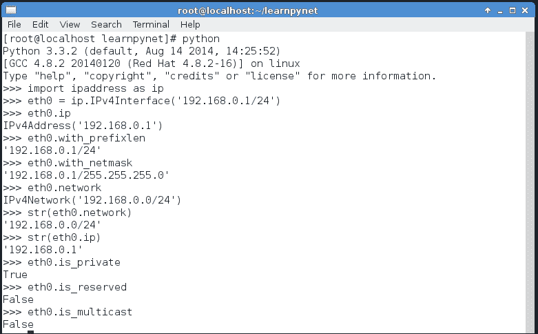
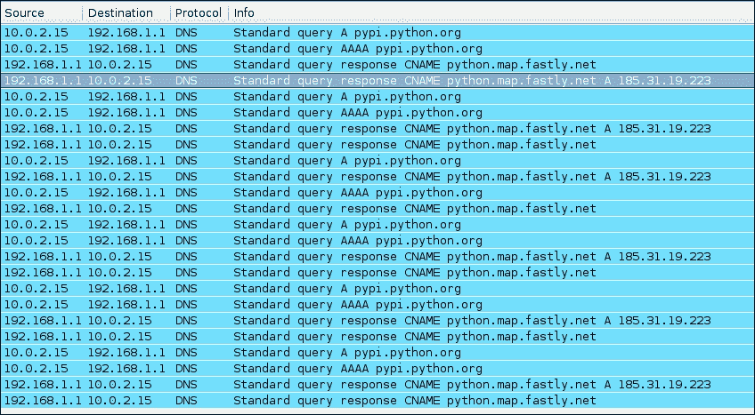
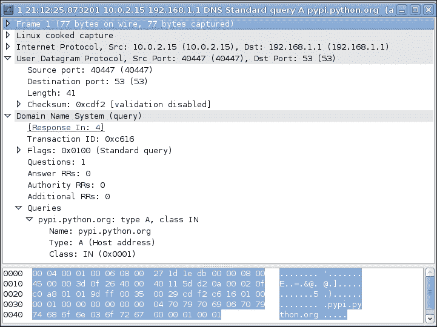
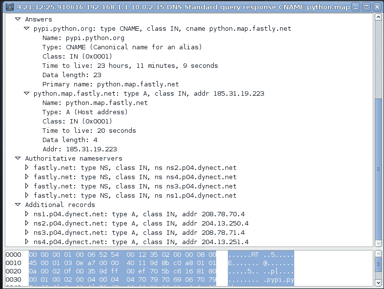
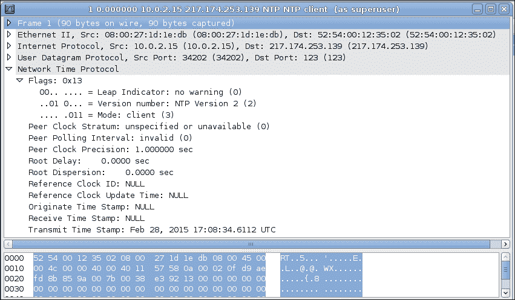
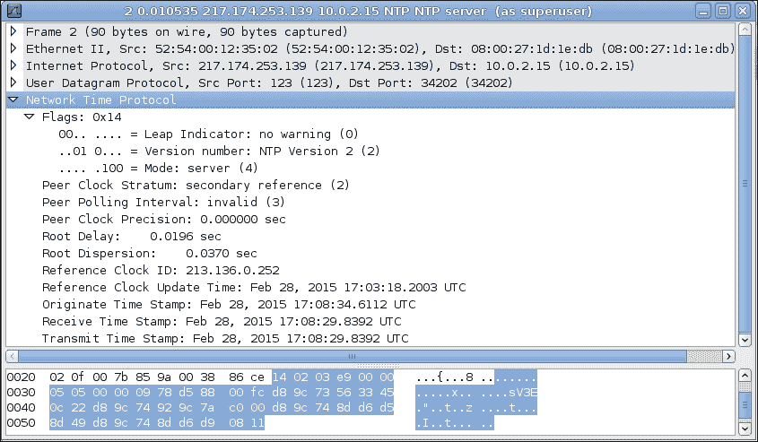

# 第 6 章 IP 和 DNS

连接到网络的每台计算机都需要一个 IP 地址。在[第一章](01.html "Chapter 1. Network Programming and Python")、*网络编程和 Python*中，介绍了 TCP/IP 网络。IP 地址用数字标识符标记机器的网络接口，数字标识符还标识机器的位置，尽管可靠性有限。**域名系统**（**DNS**是一项核心网络服务，将域名映射到 IP 地址，反之亦然。在本章中，我们将主要关注在 Python 的帮助下操作 IP 和 DNS 协议。除此之外，我们将简要讨论**网络时间协议**（**NTP**），该协议有助于将时间与集中式时间服务器同步。这里将讨论以下主题：

*   检索本地计算机的网络配置
*   操纵 IP 地址
*   GeoIP 查找
*   使用 DNS
*   与 NTP 合作

# 检索本地机器的网络配置

在做任何其他事情之前，让我们用 Python 语言提问，*我叫什么名字？*。在网络术语中，这相当于找出机器名或主机名。在 shell 命令行上，可以使用`hostname`命令来发现这一点。在 Python 中，可以通过使用套接字模块来实现这一点。

```py
>>> import socket
>>> socket.gethostname()
'debian6box.localdomain.loc'

```

现在，我们希望看到本地机器 IP。这可以通过在 Linux 中使用`ifconfig`命令和在 Windows 操作系统中使用`ipconfig`命令看到。但是，我们希望通过使用以下内置函数在 Python 中实现这一点：

```py
>>> socket.gethostbyname('debian6box.localdomain.loc')
'10.0.2.15'

```

正如您所见，这是第一个网络接口的 IP。如果 DNS 或主机文件未正确配置，它还可以向我们显示环回接口（127.0.0.1）的 IP。在 Linux/UNIX 中，可以在`/etc/hosts`文件中添加以下行以获得正确的 IP 地址：

```py
10.0.2.15       debian6box.localdomain.loc      debian6box
```

此过程称为基于主机文件的名称解析。您可以向 DNS 服务器发送查询，并询问特定主机的 IP 地址。如果名称已正确注册，则您将从服务器获得响应。但是，在查询远程服务器之前，让我们先了解有关网络接口和网络网关机器的更多信息。

在每个 LAN 中，一台主机被配置为网关，与*外部*世界进行通信。为了找到网络地址和网络掩码，我们可以使用 Python 第三方库 netifaces（版本>0.10.0）。这将获取所有相关信息。例如，您可以调用`netifaces.gateways()`查找配置到外部世界的网关。同样，您可以通过调用`netifaces.interfaces()`枚举网络接口。如果您想知道特定接口*eth0、*的所有 IP 地址，那么您可以调用`netifaces.ifaddresses('eth0')`。以下代码列表显示了列出本地计算机的所有网关和 IP 地址的方式：

```py
#!/usr/bin/env python
import socket
import netifaces

if __name__ == '__main__':    
    # Find host info
    host_name = socket.gethostname()
    ip_address = socket.gethostbyname(host_name)
    print("Host name: {0}".format(host_name))

    # Get interfaces list
    ifaces = netifaces.interfaces()
    for iface in ifaces:
        ipaddrs = netifaces.ifaddresses(iface)
        if netifaces.AF_INET in ipaddrs:
            ipaddr_desc = ipaddrs[netifaces.AF_INET]
            ipaddr_desc = ipaddr_desc[0]
            print("Network interface: {0}".format(iface))
            print("\tIP address: {0}".format(ipaddr_desc['addr']))
            print("\tNetmask: {0}".format(ipaddr_desc['netmask']))
    # Find the gateway
    gateways = netifaces.gateways()
    print("Default gateway: {0}".format(gateways['default'][netifaces.AF_INET][0]))
```

如果您运行此代码，则将打印本地网络配置的摘要，如下所示：

```py
$ python 6_1_local_network_config.py
Host name: debian6box
Network interface: lo
 IP address: 127.0.0.1
 Netmask: 255.0.0.0
Network interface: eth0
 IP address: 10.0.2.15
 Netmask: 255.255.255.0
Default gateway: 10.0.2.2

```

# 操纵 IP 地址

通常，您需要操纵 IP 地址并对其执行某种操作。Python3 有一个内置的`ipaddress`模块来帮助您完成这项任务。它具有定义 IP 地址和 IP 网络以及查找大量有用信息的方便功能。例如，如果您想知道给定子网中存在多少 IP 地址，例如，`10.0.1.0/255.255.255.0`或`10.0.2.0/24`，那么您可以借助此处显示的代码片段找到它们。该模块将提供多个类和工厂功能；例如，IP 地址和 IP 网络有单独的类。对于 IP 版本 4（IPv4）和 IP 版本 6（IPv6），每个类都有一个变体。以下部分演示了一些功能：

## IP 网络对象

让我们导入`ipaddress`模块，定义一个`net4`网络。

```py
>>> import ipaddress as ip
>>> net4 = ip.ip_network('10.0.1.0/24')

```

现在，我们可以找到一些有用的信息，例如`net4`的`netmask`、网络/广播地址等：

```py
>>> net4.netmask
IP4Address(255.255.255.0)

```

`net4`的`netmask`属性将显示为`IP4Address`对象。如果您正在寻找它的字符串表示，那么您可以调用`str()`方法，如下所示：

```py
>>> str(net4.netmask)
'255.255.255.0'

```

同样，您可以通过以下操作找到`net4,` 的网络和广播地址：

```py
>>> str(net4.network_address)
10.0.1.0
>>> str(net4.broadcast_address)
10.0.1.255

```

`net4`总共有多少个地址？可通过使用如下所示的命令找到：

```py
>>> net4.num_addresses
256

```

因此，如果我们减去网络和广播地址，那么总的可用 IP 地址将是 254。我们可以在`net4`对象上调用`hosts()`方法。它将生成一个 Python 生成器，它将所有主机作为`IPv4Adress`对象提供。

```py
>>> all_hosts = list(net4.hosts())
>>> len(all_hosts)
254

```

您可以按照标准的 Python 列表访问表示法访问各个 IP 地址。例如，第一个 IP 地址如下所示：

```py
>>> all_hosts[0]
IPv4Address('10.0.1.1')

```

您可以通过使用列表符号访问列表的最后一项来访问最后一个 IP 地址，如下所示：

```py
>>> all_hosts[-1]
IPv4Address('10.0.1.1')

```

我们还可以从`IPv4Network`对象中找到子网信息，如下所示：

```py
>>> subnets = list( net4.subnets())
>>> subnets
[ IPv4Network('10.0.1.0/25'), IPv4Network('10.0.1.128/25')  ]

```

任何`IPv4Network`对象都可以知道它的父超网，它与子网相反。

```py
>>> net4.supernet()
IPv4Network('10.0.1.0/23')

```

## 网络接口对象

在`ipaddress`模块中，一个方便的类用于详细表示接口的 IP 配置。IPv4 接口类采用任意地址，其行为类似于网络地址对象。让我们定义并讨论我们的网络接口`eth0,`，如下图所示：



正如您在前面的屏幕截图中所看到的，已经定义了带有`IPv4Address`类的网络接口 eth0。它有一些有趣的属性，如 IP、网络地址等。与网络对象一样，您可以检查地址是专用地址、保留地址还是多播地址。这些地址范围已在各种 RFC 文档中定义。`ipaddress`模块的帮助页面将显示这些 RFC 文档的链接。您也可以在其他地方搜索此信息。

## IP 地址对象

IP 地址类有许多更有趣的属性。您可以对这些对象执行一些算术和逻辑运算。例如，如果一个 IP 地址大于另一个 IP 地址，则可以向 IP 地址对象添加数字，这将为您提供相应的 IP 地址。下面的屏幕截图展示了这一点：


`ipaddress`模块演示

这里，`eth0`接口已经定义了一个私有 IP 地址，即`192.168.1.1,`，而`eth1`已经定义了另一个私有 IP 地址，即`192.168.2.1`。同样，环回接口`lo`定义为 IP 地址`127.0.0.1`。如您所见，您可以将数字添加到 IP 地址，它将为您提供具有相同序列的下一个 IP 地址。

您可以检查 IP 是否是特定网络的一部分。这里，网络地址是`192.168.1.0/24,`定义了一个网络，并对`eth0`和`eth1`的成员身份进行了测试。其他一些有趣的属性，如`is_loopback`、`is_private,`等，也在这里进行了测试。

## 为您的局域网规划 IP 地址

如果您想知道如何选择合适的 IP 子网，那么您可以尝试使用`ipaddress`模块。下面的代码片段将显示如何根据小型专用网络所需的主机 IP 地址数选择特定子网的示例：

```py
#!/usr/bin/env python
import ipaddress as ip

CLASS_C_ADDR = '192.168.0.0'

if __name__ == '__main__':
    not_configed = True
    while not_configed:
        prefix = input("Enter the prefixlen (24-30): ")
        prefix = int(prefix)
        if prefix not in range(23, 31):
            raise Exception("Prefixlen must be between 24 and 30")
        net_addr = CLASS_C_ADDR + '/' + str(prefix)
        print("Using network address:%s " %net_addr)
        try:
            network = ip.ip_network(net_addr)
        except:
            raise Exception("Failed to create network object")
        print("This prefix will give %s IP addresses" %(network.num_addresses))
        print("The network configuration will be")
        print("\t network address: %s" %str(network.network_address))
        print("\t netmask: %s" %str(network.netmask))
        print("\t broadcast address: %s" %str(network.broadcast_address))
        first_ip, last_ip = list(network.hosts())[0], list(network.hosts())[-1] 
        print("\t host IP addresses: from %s to %s" %(first_ip, last_ip))
        ok = input("Is this configuration OK [y/n]? ")
        ok = ok.lower()
        if ok.strip() == 'y':
            not_configed = False
```

如果您运行此脚本，则它将显示类似于以下内容的输出：

```py
# python 6_2_net_ip_planner.py 
Enter the prefixlen (24-30): 28
Using network address:192.168.0.0/28 
This prefix will give 16 IP addresses
The network configuration will be
 network address: 192.168.0.0
 netmask: 255.255.255.240
 broadcast address: 192.168.0.15
 host IP addresses: from 192.168.0.1 to 192.168.0.14
Is this configuration OK [y/n]? n
Enter the prefixlen (24-30): 26
Using network address:192.168.0.0/26 
This prefix will give 64 IP addresses
The network configuration will be
 network address: 192.168.0.0
 netmask: 255.255.255.192
 broadcast address: 192.168.0.63
 host IP addresses: from 192.168.0.1 to 192.168.0.62
Is this configuration OK [y/n]? y

```

# GeoIP 查找

有时，许多应用程序都需要查找 IP 地址的位置。例如，许多网站所有者可能对跟踪其访问者的位置以及根据国家、城市等标准对其 IP 进行分类感兴趣。有一个名为**python geoip 的第三方库**，它的有一个健壮的接口，可以为您提供 IP 位置查询的答案。该库由 MaxMind 提供，它还提供了将 Geolite2 数据库的最新版本作为`python-geoip-geolite2`包交付的选项。这包括 MaxMind 创建的 GeoLite2 数据，可在[www.MaxMind.com](http://www.maxmind.com)的知识共享署名 ShareAlike 3.0 Unported 许可下获得。你也可以从他们的网站上购买商业许可证。

让我们看一个如何使用此地理查找库的示例：

```py
import socket
from geoip import geolite2
import argparse

if __name__ == '__main__':
    # Setup commandline arguments
    parser = argparse.ArgumentParser(description='Get IP Geolocation info')
    parser.add_argument('--hostname', action="store", dest="hostname", required=True)

    # Parse arguments
    given_args = parser.parse_args()
    hostname =  given_args.hostname
    ip_address = socket.gethostbyname(hostname)
    print("IP address: {0}".format(ip_address))

    match = geolite2.lookup(ip_address)
    if match is not None:
        print('Country: ',match.country)
        print('Continent: ',match.continent) 
        print('Time zone: ', match.timezone) 
```

此脚本将显示类似以下内容的输出：

```py
$ python 6_3_geoip_lookup.py --hostname=amazon.co.uk
IP address: 178.236.6.251
Country:  IE
Continent:  EU
Time zone:  Europe/Dublin

```

您可以在开发者网站[上找到关于此软件包的更多信息 http://pythonhosted.org/python-geoip/](http://pythonhosted.org/python-geoip/) 。

## DNS 查找

IP 地址可以翻译成人类可读的字符串，称为域名。DNS 是网络世界中的一个大话题。在本节中，我们将用 Python 创建一个 DNS 客户机，并了解该客户机将如何使用 Wirshark 与服务器通信。

PyPI 提供了一些 DNS cleint 库。我们将重点关注`dnspython`图书馆在[上提供 http://www.dnspython.org/](http://www.dnspython.org/) 。您可以使用`easy_install`命令或`pip`命令安装此库：

```py
$ pip install dnspython

```

对主机的 IP 地址进行简单查询非常简单。您可以使用`dns.resolver`子模块，如下所示：

```py
import dns.resolver
answers = dns.resolver.query('python.org', 'A')
for rdata in answers:
 print('IP', rdata.to_text())

```

如果要进行反向查找，则需要使用`dns.reversename`子模块，如下所示：

```py
import dns.reversename
name = dns.reversename.from_address("127.0.0.1")
print name
print dns.reversename.to_address(name)

```

现在，让我们创建一个交互式 DNS 客户端脚本，该脚本将对可能的记录进行完整的查找，如下所示：

```py
import dns.resolver

if __name__ == '__main__':
    loookup_continue = True
    while loookup_continue:
        name = input('Enter the DNS name to resolve: ')
        record_type = input('Enter the query type [A/MX/CNAME]: ')
        answers = dns.resolver.query(name, record_type)
        if record_type == 'A':
            print('Got answer IP address: %s' %[x.to_text() for x in answers])
        elif record_type == 'CNAME':
            print('Got answer Aliases: %s' %[x.to_text() for x in answers])
        elif record_type == 'MX':
            for rdata in answers:
                print('Got answers for Mail server records:')
                print('Mailserver', rdata.exchange.to_text(), 'has preference', rdata.preference)
            print('Record type: %s is not implemented' %record_type)
        lookup_more = input("Do you want to lookup more records? [y/n]: " )
        if lookup_more.lower() == 'n':
            loookup_continue = False
```

如果您使用一些输入来运行这个脚本，那么您将获得类似于以下内容的输出：

```py
$ python 6_4_dns_client.py 
Enter the DNS name to resolve: google.com
Enter the query type [A/MX/CNAME]: MX
Got answers for Mail server records:
Mailserver alt4.aspmx.l.google.com. has preference 50
Got answers for Mail server records:
Mailserver alt2.aspmx.l.google.com. has preference 30
Got answers for Mail server records:
Mailserver alt3.aspmx.l.google.com. has preference 40
Got answers for Mail server records:
Mailserver aspmx.l.google.com. has preference 10
Got answers for Mail server records:
Mailserver alt1.aspmx.l.google.com. has preference 20
Do you want to lookup more records? [y/n]: y
Enter the DNS name to resolve: www.python.org
Enter the query type [A/MX/CNAME]: A
Got answer IP address: ['185.31.18.223']
Do you want to lookup more records? [y/n]: y
Enter the DNS name to resolve: pypi.python.org
Enter the query type [A/MX/CNAME]: CNAME
Got answer Aliases: ['python.map.fastly.net.']
Do you want to lookup more records? [y/n]: n

```

## 正在检查 DNS 客户端/服务器通信

在前面的章节中，您可能注意到我们是如何使用 Wireshark 捕获客户端和服务器之间的网络数据包的。以下是从 PyPI 安装 Python 包时捕获会话的示例：



FDNS 客户机/服务器通信

在 Wireshark 中，您可以通过导航到**捕获****选项****捕获过滤器**来指定`port 53`。这将捕获发送到/从您的计算机发送的所有 DNS 数据包。

正如您在下面的屏幕截图中所看到的，客户端和服务器在 DNS 记录中有几个请求/响应周期。它以主机地址（a）的标准请求开始，然后是适当的响应。



如果您深入查看数据包内部的，则可以看到服务器响应的请求格式，如以下屏幕截图所示：



# NTP 客户

本章将涉及的最后一个主题是 NTP。与集中式时间服务器同步时间是任何公司网络中的关键步骤。我们想比较不同服务器之间的日志文件，看看每个服务器上的时间戳是否准确；然后，日志事件可能不会相互关联。许多身份验证协议（如 Kerberos）严格依赖于客户端向服务器报告的时间戳的准确性。这里将介绍一个第三方 Python`ntplib`库，然后研究 NTP 客户端和服务器之间的通信。

要创建 NTP 客户端，需要调用 ntplib 的`NTPCLient`类。

```py
import ntplib
from time import ctime
c = ntplib.NTPClient()
response = c.request('pool.ntp.org')
print ctime(response.tx_time)

```

在这里，我们选择了`pool.ntp.org,`这是一个负载平衡的 Web 服务器。因此，NTP服务器池将准备好响应客户机的请求。让我们从 NTP 服务器返回的响应中查找有关此的更多信息。

```py
import ntplib
from time import ctime

HOST_NAME = 'pool.ntp.org'

if __name__ == '__main__':
    params = {}
    client = ntplib.NTPClient()
    response = client.request(HOST_NAME)
    print('Received time: %s' %ctime(response.tx_time))
    print('ref_clock: ',ntplib.ref_id_to_text(response.ref_id, response.stratum))
    print('stratum: ',response.stratum)
    print('last_update: ', response.ref_time)
    print('offset:  %f' %response.offset)
    print('precision: ', response.precision)
    print('root_delay: %.6f' %response.root_delay)
    print('root_dispersion: %.6f' %response.root_dispersion)
```

详细的响应如下所示：

```py
$ python 6_5_ntp_client.py 
Received time: Sat Feb 28 17:08:29 2015
ref_clock:  213.136.0.252
stratum:  2
last_update:  1425142998.2
offset:  -4.777519
precision:  -23
root_delay: 0.019608
root_dispersion: 0.036987

```

上述信息由 NTP 服务器提供给客户端。此信息可用于确定提供的时间服务器的准确性。例如，地层值 2 表示 NTP 服务器将使用地层值 1 查询另一个 NTP 服务器，该地层值可能具有直接连接的时间源。有关NTP 协议的更多信息，您可以阅读位于[的 RFC 958 文件 https://tools.ietf.org/html/rfc958](https://tools.ietf.org/html/rfc958) 或访问[http://www.ntp.org/](http://www.ntp.org/) 。

## 检查 NTP 客户端/服务器通信

通过查看捕获的数据包，您可以了解更多关于 NTP 的信息。为此，已捕获前面的 NTP 客户端/服务器通信，如以下两个屏幕截图所示：

第一个屏幕截图显示 NTP 客户端请求。如果查看标志字段，则会看到客户机的版本号。



类似地，NTP 服务器响应已显示在以下屏幕截图中：



# 总结

本章讨论了用于 IP 地址操作的标准 Python 库。提供了两个第三方库`dnspython`和`ntplib`分别与 DNS 和 NTP 服务器交互。正如您在前面的示例中所看到的，这些库为您提供了与这些服务对话的必要接口。

在下一章中，我们将介绍 Python 中的套接字编程。对于网络程序员来说，这是另一个有趣且流行的话题。在这里，您可以找到用于使用 BSD 套接字编程的低级和高级 Python 库。