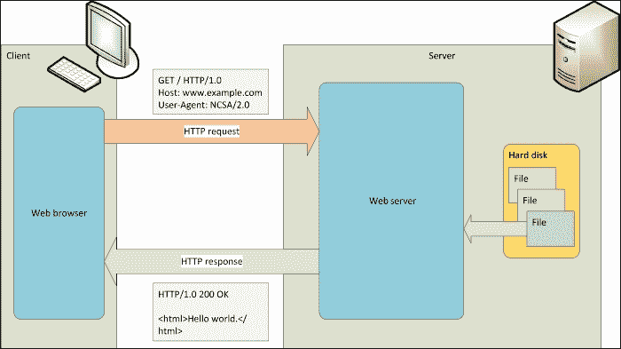
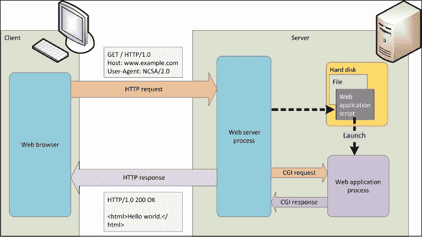
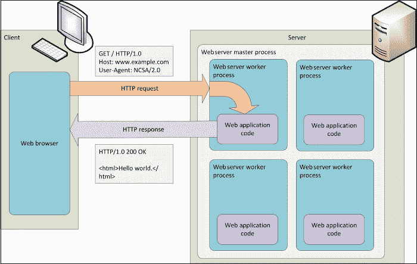
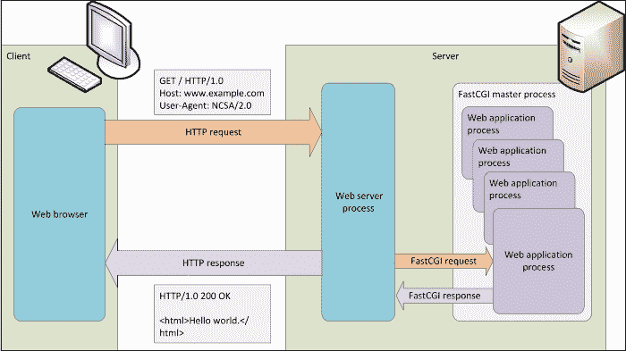

# 第九章网络应用

在[第 2 章](02.html "Chapter 2. HTTP and Working with the Web")、*HTTP 和 Web*中，我们探讨了 HTTP 协议——万维网使用的主要协议，并学习了如何使用 Python 作为 HTTP 客户端。在[第 3 章](03.html "Chapter 3. APIs in Action")、*API 实际应用*中，我们对此进行了扩展，并探讨了使用 web API 的方法。在本章中，我们将把重点转向如何使用 Python 构建响应 HTTP 请求的应用程序。

在本章中，我们将介绍以下内容：

*   Python web 框架
*   pythonweb 应用程序
*   托管 Python 和 WSGI

我应该提前指出，托管现代 web 应用程序是一个非常大的主题，完整的处理方法远远超出了本书的范围，本书将重点介绍如何将 Python 代码应用于网络问题。这里不介绍数据库访问、选择和配置负载平衡器和反向代理、容器化以及保持整个显示和运行所需的系统管理技术等主题。网上有很多很好的资源，虽然可以给你一个开始，我们会尽量在相关的地方提及，因为我们会继续。

尽管如此，上面列出的技术并不是创建和服务基于 Python 的 web 应用程序的要求，它们只是服务达到规模时所需要的。正如我们将看到的，也有一些易于管理的小型应用程序托管选项。

# 网络服务器中有什么？

为了理解如何使用 Python 来响应 HTTP 请求，我们需要了解响应请求通常需要做些什么，以及已经存在哪些工具和模式来实现这一点。

基本 HTTP 请求和响应可能如下所示：



在这里，我们的 web客户端向服务器发送 HTTP 请求，在服务器上，web 服务器程序解释请求，创建合适的 HTTP 响应，并将其发送回。在本例中，响应主体只是从中读取的 HTML 文件的内容，响应头由 web 服务器程序添加。

web 服务器负责响应客户端请求的整个过程。它需要执行的基本步骤是：


首先，web 服务器程序需要接受客户端的 TCP 连接尝试。然后，它通过 TCP 连接从客户端接收 HTTP 请求。服务器需要在生成 HTTP 响应时保持 TCP 连接打开，并使用该连接将响应发送回客户端。之后服务器如何处理连接取决于所使用的 HTTP 版本和请求中可能的连接头的值（参见 RFC 以获取[中的完整详细信息）http://tools.ietf.org/html/rfc7230#section-6.3](http://tools.ietf.org/html/rfc7230#section-6.3)）。

一旦 web 服务器接收到请求，它将对其进行解析，然后生成响应。当请求的 URL 映射到服务器上的有效资源时，服务器将使用该 URL 处的资源进行响应。资源可以是磁盘上的文件（所谓的**静态内容**），如之前的基本 HTTP 请求和响应图所示，可以是 HTTP 重定向，也可以是动态生成的 HTML 页面。如果出现问题，或者 URL 无效，那么响应将包含一个状态代码，位于`4xx`或`5xx`范围内。准备好响应后，服务器通过 TCP 连接将其发送回客户端。

在 Web 的早期，当几乎所有请求的资源都由从磁盘读取的静态文件组成时，Web 服务器可以用一种语言编写，并且可以轻松地处理上图所示的所有四个步骤。然而，随着越来越多的动态内容（如购物篮和数据库驱动的资源，如博客、Wiki 和社交媒体）进入需求，人们很快发现将这些功能硬编码到 web 服务器本身是不切实际的。相反，在 web 服务器中内置了一些功能，以允许调用外部代码作为页面生成过程的一部分。

因此，web 服务器可以用 C 等快速语言编写，可以处理低级 TCP 连接、请求的初始解析和验证，以及处理静态内容，但在需要动态响应时，可以调用外部代码来处理页面生成任务。

当我们谈论 web 应用程序时，通常会提到这些外部代码。因此，响应流程职责可以拆分，如下图所示：


Web 应用程序可以用 Web 服务器能够调用的任何语言编写，提供了极大的灵活性，并允许使用更高级的语言。这可以大大减少开发新 web 服务所需的时间。现在有很多种语言可以用来编写 web 应用程序，Python 也不例外。

# Python 与网络

使用本书中讨论的一些技术，特别是[第 8 章](08.html "Chapter 8. Client and Server Applications")、*客户机和服务器应用程序*，可以使用 Python 编写一个完整的 web 服务器，处理我们在上一节中列出的 HTTP 请求的所有四个步骤。现在已经有几个用纯 Python 编写的积极开发的 web 服务器，包括Gunicorn（[http://gunicorn.org](http://gunicorn.org) 和樱桃糖（[http://www.cherrypy.org](http://www.cherrypy.org) 。在标准库 HTTP.server 模块中甚至有一个非常基本的 HTTP 服务器。

编写一个完整的 HTTP 服务器不是一项简单的任务，详细的处理远远超出了本书的范围。如今，这也不是一个非常普遍的需求，主要是因为优秀的web 服务器已经准备好部署。但是，如果您确实觉得有必要破解这个难题，我将首先查看前面提到的 web 服务器的源代码，更详细地查看[第 8 章](08.html "Chapter 8. Client and Server Applications")、*客户端和服务器应用程序*中列出的框架，阅读相关 RFC 中的完整 HTTP 规范。您可能还想阅读 WSGI 规范（稍后在 WSGI 部分中讨论），以便允许服务器充当其他 Python web 应用程序的主机。

更强烈的需求是构建一个 web 服务应用程序来生成一些动态内容，并使其快速启动和运行。在这种情况下，Python 以 web 框架的形式为我们提供了一些优秀的选项。

## 网络框架

web 框架是一个位于 web 服务器和 Python 代码之间的层，它提供了抽象和简化的 API 来执行解释 HTTP 请求和生成响应的许多常见操作。理想情况下，它的结构也可以引导我们使用经过良好测试的模式进行良好的 web 开发。pythonweb 应用程序的框架通常是用 Python 编写的，可以认为是 web 应用程序的一部分。

框架提供的基本服务包括：

*   HTTP 请求和响应的抽象
*   URL 空间的管理（路由）
*   Python 代码和标记的分离（模板化）

现在有很多 Python web框架在使用，下面是一些流行框架的非详尽列表，按无特定顺序排列：

*   Django（[www.djangoproject.com](http://www.djangoproject.com)）
*   CherryPy（[www.CherryPy.org](http://www.cherrypy.org)）
*   烧瓶（[Flask.pocoo.org](http://flask.pocoo.org)）
*   龙卷风（[www.tornadoweb.org](http://www.tornadoweb.org)）
*   涡轮齿轮（[www.TurboGears.org](http://www.turbogears.org)）
*   金字塔（[www.pylonsproject.org](http://www.pylonsproject.org)）

### 注

最新的框架列表保存在[http://wiki.python.org/moin/WebFrameworks](https://wiki.python.org/moin/WebFrameworks) 和[http://docs.python-guide.org/en/latest/scenarios/web/#frameworks](http://docs.python-guide.org/en/latest/scenarios/web/#frameworks) 。

有如此多的框架，因为有很多方法可以用于执行的任务，对于他们应该执行的任务有很多不同的意见。

一些框架提供了快速构建简单 web 应用程序的最低要求。这些通常被称为**微框架**，这里最流行的是 Armin Ronacher 的优秀烧瓶。尽管它们可能不包括某些重量级框架的功能，但它们所做的工作通常都做得很好，并提供了挂钩，允许轻松扩展更复杂的任务。这允许对 web 应用程序开发采用完全可定制的方法。

其他框架则采取了更为灵活的姿态，提供了现代 web 应用程序的所有常见需求。这里的主要竞争者是 Django，它包括从模板到表单管理和数据库抽象的所有内容，甚至包括一个完全现成的基于 web 的数据库管理界面。TurboGears 通过将一个核心微框架与多个已建立的其他功能包集成，提供了类似的功能。

然而，其他框架提供了一些功能，例如支持具有事件驱动体系结构的 web 应用程序，如 Tornado 和 CherryPy。这两种服务器都有自己的内置生产质量 web 服务器。

选择一个框架可能是一个棘手的决定，而且没有正确的答案。我们将快速浏览一下当今最流行的框架之一，了解框架可以提供哪些服务，然后讨论如何选择一个框架。

# 烧瓶——一种微框架

为了尝试使用 Python web 框架，我们将使用 Flask 编写一个小应用程序。我们之所以选择 Flask，是因为它提供了一个精简的界面，为我们提供了所需的功能，同时又不碍事地让我们编写代码。此外，它不需要任何重要的预配置，我们只需安装它，如下所示：

```py
>>> pip install flask
Downloading/unpacking flask

```

烧瓶也可从项目主页[下载 http://flask.pocoo.org](http://flask.pocoo.org) 。请注意，要在 Python3 下运行 Flask，需要 Python3.3 或更高版本。

现在创建一个项目目录，并在目录中创建一个名为`tinyflaskapp.py`的文本文件。我们的应用程序将允许我们浏览 docstring 以查找 Python 内置函数。将其输入`tinyflaskapp.py`：

```py
from flask import Flask, abort
app = Flask(__name__)
app.debug = True

objs = __builtins__.__dict__.items()
docstrings = {name.lower(): obj.__doc__ for name, obj in objs if
              name[0].islower() and hasattr(obj, '__name__')}

@app.route('/')
def index():
    link_template = '<a href="/functions/{}">{}</a></br>'
    links = []
    for func in sorted(docstrings):
        link = link_template.format(func, func)
        links.append(link)
    links_output = '\n'.join(links)
    return '<h1>Python builtins docstrings</h1>\n' + links_output

@app.route('/functions/<func_name>')
def show_docstring(func_name):
    func_name = func_name.lower()
    if func_name in docstrings:
        output = '<h1>{}</h1>\n'.format(func_name)
        output += '<pre>{}</pre>'.format(docstrings[func_name])
        return output
    else:
        abort(404)

if __name__ == '__main__':
    app.run()
```

这段代码可以在本书的源代码下载本章中的`1-init`文件夹中找到。

Flask 包括一个开发 web 服务器，因此要试用我们的应用程序，我们只需运行以下命令：

```py
$ python3.4 tinyflaskapp.py
 * Running on http://127.0.0.1:5000/ (Press CTRL+C to quit)
 * Restarting with stat

```

我们可以看到Flask 服务器告诉我们它正在监听的 IP 地址和端口。连接到它现在在 web 浏览器中显示的 URL（在前面的示例中，这是`http://127.0.0.1:5000/`），您应该会看到一个包含 Python 内置函数列表的页面。单击一个应该会显示一个页面，显示函数名及其 docstring。

如果要在另一个接口或端口上运行服务器，可以将`app.run()`调用更改为`app.run(host='0.0.0.0', port=5001)`。

让我们看看我们的代码。从顶部开始，我们通过创建一个`Flask`实例来创建 Flask 应用程序，在本例中给出了主模块的名称。然后我们将 debug 模式设置为 active，这在浏览器出现错误时提供了良好的回溯，并且还将开发服务器设置为自动重新加载代码更改，而无需重新启动。请注意，在生产应用程序中，调试模式不应保持活动状态！这是因为调试器有一个交互元素，允许在服务器上执行代码。默认情况下，“调试”处于关闭状态，因此我们需要做的就是在将应用程序投入生产时删除`app.config.debug`行。

接下来，我们从全局变量中过滤出内置函数对象，并提取它们的 docstring 供以后使用。现在我们有了应用程序的主要部分，我们遇到了 Flask 的第一个超级功能：URL 路由。Flask 应用程序的核心是一组函数，通常称为**视图**，它们处理对 URL 空间各个部分的请求—`index()`和`show_docstring()`就是这样的函数。您将看到这两个函数前面都有一个 Flask decorator 函数，`app.route()`。这告诉 Flask 修饰函数应该处理 URL 空间的哪些部分。也就是说，当一个请求带有一个与`app.route()`装饰器中的模式匹配的 URL 时，将调用具有匹配装饰器的函数来处理该请求。视图函数必须返回一个 Flask 可以返回给客户端的响应，但稍后会有更多的响应。

我们的`index()`函数的 URL 模式只是站点根目录`'/'`，这意味着只有对根目录的请求才会由`index()`处理。

在`index()`中，我们只需将输出 HTML 编译为字符串，首先是指向函数页面的链接列表，然后是标题，然后返回字符串。Flask 获取该字符串并从中创建响应，使用该字符串作为响应主体并添加一些 HTTP 头。特别是对于`str`返回值，它将`Content-Type`设置为`text/html`。

`show_docstrings()`视图做了类似的事情，它返回我们在 HTML 头标记中查看的内置函数的名称，加上包装在`<pre>`标记中的 docstring（以保留新行和空白）。

有趣的部分是`app.route('/functions/<func_name>')`呼叫。在这里，我们声明函数的页面将位于`functions`目录中，并使用`<func_name>`段捕获请求函数的名称。Flask 捕获了尖括号中的 URL 部分，并使其可供我们查看。我们通过声明`show_docstring()`的`func_name`参数将其拉入视图名称空间。

在视图中，我们通过查看`docstrings`dict 中是否出现提供的名称来检查是否有效。如果可以，我们构建并返回相应的 HTML。如果不正常，则通过调用 Flask 的`abort()`函数向客户端返回`404 Not Found`响应。此函数将引发一个 Flask`HTTPException`，如果我们的应用程序不处理它，它将导致 Flask 生成一个错误页面，并将其返回给客户端，同时返回相应的状态代码（在本例中为 404）。这是一种在遇到错误请求时快速失败的好方法。

## 模板制作

从我们前面的观点中可以看出，即使为了节省复杂性而厚颜无耻地省略了常见的 HTML 形式，如`<DOCTYPE>` 和`<html>`标记，在 Python 代码中构建 HTML 也是很笨拙的。很难对整个页面有感觉，没有 Python 知识的设计师也不可能进行页面设计。此外，将表示代码的生成与应用程序逻辑混合在一起会使两者更难测试。

几乎所有的 web 框架都通过使用模板习惯用法来解决这个问题。由于 HTML 的大部分是静态的，因此出现了一个问题：为什么要将其保留在应用程序代码中？使用模板，我们将 HTML 完全提取到单独的文件中。然后，它们包含 HTML 代码，并包含一些特殊的占位符和逻辑标记，以允许插入动态元素。

Flask 使用另一个 Armin Ronacher 创作的*Jinja2*模板引擎来完成此任务。让我们调整应用程序以使用模板。在项目文件夹中，创建一个名为`templates`的文件夹。在那里，创建三个新的文本文件，`base.html`、`index.html`和`docstring.html`。填写如下：

`base.html`文件如下：

```py
<!DOCTYPE html>
<html>
<head>
    <title>Python Builtins Docstrings</title>
</head>
<body>

</body>
</html>
```

`index.html`文件将如下：

```py


    <h1>Python Builtins Docstrings</h1>
    <div>
    
        <div class="menuitem link">
            <a href="/functions/{{ func }}">{{ func }}</a>
        </div>
    
    </table>

```

`docstring.html`文件如下：

```py


    <h1>{{ func_name }}</h1>
    <pre>{{ doc }}</pre>
    <p><a href="/">Home</a></p>

```

将`render_template`添加到`tinyflaskapp.py`顶部的`from flask import...`行，然后修改视图，如下所示：

```py
@app.route('/')
def index():
    return render_template('index.html', funcs=sorted(docstrings))

@app.route('/functions/<func_name>')
def show_docstring(func_name):
    func_name = func_name.lower()
    if func_name in docstrings:
        return render_template('docstring.html',
                               func_name=func_name,
                               doc=docstrings[func_name])
    else:
        abort(404)
```

此代码可在本章源代码的`2-templates`文件夹中找到。

注意到视图变得更简单，HTML 现在可读性更强了吗？我们的视图不是手工编写返回字符串，而是简单地调用`render_template()`并返回结果。

那么`render_template()`做什么呢？它在`templates`文件夹中查找作为第一个参数提供的文件，读取它，运行文件中的任何处理指令，然后以字符串形式返回处理后的 HTML。提供给`render_template()`的任何关键字参数都会传递给模板，并可用于其处理指令。

查看模板，我们可以看到它们大部分是 HTML，但还有一些关于 Flask 的额外说明，包含在`{{ }}`和``标记中。`{{ }}`指令只是将命名变量的值替换为 HTML 的该点。例如，`docstrings.html`中的`{{ func_name }}`替换了我们传递给`render_template()`的`func_name`值。

``指令包含逻辑和流程控制。例如，`index.html`中的``指令循环`funcs`中的值，并为每个值重复包含的 HTML。

最后，您可能已经发现模板允许**继承**。这由``和``说明提供。在`base.html`中，我们声明了一些共享样板 HTML，然后在`<body>`标记中，我们只有一条``指令。在`index.html` 和`docstring.html`中，我们不包括样板 HTML；相反，我们`extend``base.html`，这意味着这些模板将填充`base.html`中声明的`block`说明。在`index.html`和`docstring.html`中，我们都声明了一个`body block`，烧瓶的内容插入到`base.html`中的 HTML 中，替换那里匹配的``。继承允许重用公共代码，并且可以根据需要层叠多个级别。

Jinja2 模板说明中提供了更多的功能；查看模板设计师文档，获取[的完整列表 http://jinja.pocoo.org/docs/dev/templates/](http://jinja.pocoo.org/docs/dev/templates/) 。

## 其他模板引擎

Jinja2肯定不是现存的唯一模板包；您可以在[找到维护的Python 模板引擎列表 https://wiki.python.org/moin/Templating](https://wiki.python.org/moin/Templating) 。

与框架一样，不同的引擎也存在，这是因为关于如何构成一个好引擎的理念不同。有些人认为逻辑和表示应该完全分开，流控制和表达式永远不应该在模板中可用，只提供值替换机制。其他人则采取相反的策略，允许在模板标记中使用完整的 Python 表达式。而金甲 2 号等其他公司则采取中间路线。有些引擎使用不同的模式，例如基于 XML 的模板或通过特殊的 HTML 标记属性声明逻辑。

没有“正确”的方法；最好尝试一些，看看什么最适合你。如果一个框架有自己的引擎，比如 Django，或者与现有的引擎紧密集成，比如 Flask，那么如果可以的话，你通常会有一个更流畅的运行，坚持它们提供的东西。

## 增加一些风格

在时刻，我们的页面看起来有点简单。让我们添加一些样式。我们将通过包含静态 CSS 文档来实现这一点，但同样的方法也可以用于包含图像和其他静态内容。本节的代码可以在本章源代码的`3-style`文件夹中找到。

首先在项目文件夹中创建一个新的`static`文件夹，并在其中创建一个名为`style.css.`的新文本文件，将以下内容保存到其中：

```py
body        { font-family: Sans-Serif; background: white; }
h1          { color: #38b; }
pre         { margin: 0px; font-size: 1.2em; }
.menuitem   { float: left; margin: 1px 1px 0px 0px; }
.link       { width: 100px; padding: 5px 25px; background: #eee; }
.link a      { text-decoration: none; color: #555; }
.link a:hover { font-weight: bold; color: #38b; }
```

接下来更新`base.html`文件的`<head>`部分，如下所示：

```py
<head>
    <title>Python Builtins Docstrings</title>
    <link rel="stylesheet" href="{{ url_for('static', filename='style.css') }}"/>
</head>
```

注意前面代码中的第三行和第四行，`<link>`标记应该是代码中的一行。在浏览器中再次尝试您的 web 应用程序，并注意到它看起来（希望）更加更新。

在这里，我们刚刚在`base.html`中的样板 HTML 中添加了一个样式表，添加了一个指向`static/style.css`文件的`<link>`标记。为此，我们使用 Flask 的`url_for()`函数。`url_for()`函数返回 URL 空间命名部分的路径。在本例中，它是特殊的`static`文件夹，默认情况下 Flask 会在 web 应用程序的根目录中查找该文件夹。我们还可以使用`url_for()`获取视图函数的路径，例如`url_for('index')`将返回`/`。

您可以将图片和其他资源放在`static`文件夹中，并以同样的方式引用它们。

## 关于安全的说明

如果您对 web 编程是新手，那么我强烈建议您阅读 web 应用程序中两种常见的安全漏洞。两者都很容易避免，但如果不加以解决，可能会产生严重后果。

### XSS

第一种是**跨站点脚本**（**XSS**）。攻击者将恶意脚本代码注入网站的 HTML，导致用户浏览器在用户不知情的情况下在该网站的安全上下文中执行操作。一个典型的向量是用户提交的信息在没有适当的清理或转义的情况下被重新显示给用户。

例如，一种方法是欺骗用户访问包含精心编制的`GET`参数的 URL。正如我们在[第 2 章](02.html "Chapter 2. HTTP and Working with the Web")、*HTTP 和**处理 Web*中看到的，Web 服务器可以使用这些参数来生成页面，有时它们的内容包含在响应页面本身的 HTML 中。如果服务器在显示 URL 参数时不小心用 HTML 转义码替换 URL 参数中的特殊字符，攻击者可以将可执行代码（例如 Javascript）放入 URL 参数中，并在访问该 URL 时实际执行。如果他们能够欺骗受害者访问该 URL，则该代码将在用户浏览器中执行，从而使攻击者能够执行用户可能执行的任何操作。

基本的 XSS 预防措施是确保从 web 应用程序外部接收的任何输入在返回到客户端时都能正确转义。Flask 在这方面非常有用，因为默认情况下它会激活 Jinja2 的自动转义功能，这意味着我们通过模板渲染的任何内容都会自动受到保护。但并非所有框架都有此功能，有些框架确实需要手动设置。此外，这仅适用于用户生成的内容不能包含标记的情况。在 wiki 允许在用户生成的内容中添加一些标记的情况下，您需要更加小心，请参见`5-search`文件夹中本章的源代码下载，以获取示例。您应该始终确保查看框架的文档。

### CSRF

第二种攻击形式是**跨站点请求伪造**（**CSRF**）。在这种攻击中，网站被诱骗在用户不知情或不同意的情况下，在用户的安全上下文中执行操作。这通常是由 XSS 攻击发起的，该攻击导致用户的浏览器在用户登录时在目标站点上执行操作。需要注意的是，即使用户没有主动浏览网站，这也会影响网站；站点通常只有在用户明确注销时才清除 cookie 身份验证令牌，因此，从站点和浏览器的角度来看，即使在用户停止浏览站点（如果用户尚未注销）之后，来自浏览器的任何请求都将被视为用户仍在登录。

一种有助于防止 CSRF 攻击的技术是使潜在的可滥用操作（如提交表单）需要一个只有服务器和客户端知道的一次性 nonce 值。CRSF 攻击通常采取预先编写的 HTTP 请求的形式，模仿用户提交表单或类似的请求。但是，如果每次服务器向客户端发送表单时，表单中都包含不同的 nonce 值，则攻击者无法将其包含在预编写的请求中，因此可以检测并拒绝攻击尝试。这种技术对 XSS 发起的攻击以及攻击者窃听浏览会话的 HTTP 流量的攻击效果较差。前者很难完全防范，最好的解决方案是确保 XSS 漏洞首先不存在。后者可以使用 HTTPS 而不是 HTTP 来缓解。有关更多信息，请参阅下面链接到的 OWASP 页面。

不同的框架有不同的方法来提供基于 nonce 的 CSRF 保护。Flask 没有内置此功能，但添加内容非常容易，例如：

```py
@app.before_request
def csrf_protect():
    if request.method == "POST":
        token = session.pop('_csrf_token', None)
        if not token or token != request.form.get('_csrf_token'):
            abort(403)

def generate_csrf_token():
    if '_csrf_token' not in session:
        session['_csrf_token'] = some_random_string()
    return session['_csrf_token']

app.jinja_env.globals['csrf_token'] = generate_csrf_token
```

然后，在带有表单的模板中，只需执行以下操作：

```py
<form method="post" action="<whatever>">
    <input name="_csrf_token" type="hidden" value="{{ csrf_token() }}">
```

这是来自烧瓶现场：[http://flask.pocoo.org/snippets/3/](http://flask.pocoo.org/snippets/3/) 。虽然它包含一些 Flask 功能，但我们还没有介绍，包括会话和`@app.before_request()`装饰器，您只需要在应用程序中包含上述代码，并确保在每个表单中都包含一个`_``csrf_token`隐藏输入。另一种方法是使用 Flask WTF 插件，该插件提供与具有内置 CSRF 保护的`WTForms`包的集成。

另一方面，Django 具有内置保护，尽管您需要启用和使用它。其他框架各不相同。始终检查所选框架的文档。

### 注

在烧瓶和 Django 站点上有更多关于 XSS 和 CSRF 的信息：

*   [http://flask.pocoo.org/docs/latest/security/](http://flask.pocoo.org/docs/latest/security/)
*   [https://docs.djangoproject.com/en/1.7/topics/security/](https://docs.djangoproject.com/en/1.7/topics/security/)

在OWASP 网站上，还有各种计算机安全相关信息的存储库：

*   [https://www.owasp.org/index.php/XSS](https://www.owasp.org/index.php/XSS)
*   [https://www.owasp.org/index.php/CSRF](https://www.owasp.org/index.php/CSRF)

## 以框架收尾

这就是我们要在烧瓶里浸泡的地方，这里。在本章的可下载源代码中有一些对我们的应用程序进行进一步修改的示例，特别是表单提交、在请求中访问表单值和会话。烧瓶教程详细介绍了其中的许多元素，非常值得一看[http://flask.pocoo.org/docs/0.10/tutorial/](http://flask.pocoo.org/docs/0.10/tutorial/) 。

这就是一个非常基本的 Python web 应用程序的外观。显然，编写同一个应用程序的方法和编写框架的方法一样多，那么如何选择框架呢？

首先，它有助于清楚地了解您希望通过应用程序实现的目标。您需要数据库交互吗？如果是这样的话，像 Django 这样更集成的解决方案可能会更快地开始使用。您是否需要基于 web 的数据输入或管理界面？如果是这样的话，Django 已经准备好了。

接下来，您可以查看您的环境。您的组织中是否已经有您可能想要执行的操作的首选包，例如数据库访问或单元测试？如果是这样的话，有没有框架已经在使用这些？如果没有，那么微框架可能是更好的选择，插入您所需的包。您是否有首选的托管操作系统或 web 服务器，以及哪些框架支持这些？您的主机是否在 Python 版本、数据库技术或类似方面限制了您？另外，如果你有网页设计师，你是否有时间让他们在复杂的模板语言上跟上速度，还是必须保持简单？

这些问题的答案可以帮助你缩小选择范围。然后，研究这些框架，询问使用它们的人，并尝试一些可能的框架，这些框架将帮助您找到需要的地方。

前面已经说过，对于需要用户表单提交和数据库访问的通用 web 应用程序，Django 不会出问题。它真的是“电池包括在内”，它的数据库模型是优雅的，它的开箱即用的数据库管理和数据输入界面是非常强大的，可以节省大量的时间。对于 API 等更简单的应用程序，Flask 也是一个不错的选择，如果需要数据库访问，还可以使用 SQLAlchemy。

正如我前面提到的，没有正确的答案，但是通过探索可用的内容和看到框架采用的不同方法，我们可以学到很多东西。

当然，一旦我们有了 web 应用程序，我们就需要一种方法来托管它。我们现在要看一些选项。

# 托管 Python web 应用程序

正如我们在本章开头所讨论的，为了运行 Python web 应用程序，我们需要一个 web 服务器来承载它。现在有很多 web 服务器，您很可能听说过一些。流行的例子有 Apache、nginx（发音为*engine-x*）、lhttpd（发音为*lighty*）和微软**互联网信息服务**（**IIS**）。

关于 web 服务器有很多术语，它们可以使用各种机制来调用 Python web 应用程序。我们将简要介绍 web 应用程序的历史，以帮助解释其中一些概念。

## CGI

在早期的网络时代，网络服务器通常只需要向客户端发送 HTML 页面，或者偶尔发送图像文件。正如前面的 HTTP 请求过程图所示，这些静态资源将驻留在服务器的硬盘上，web 服务器的主要任务是接受来自客户端的套接字连接，将请求的 URL 映射到本地文件，并通过套接字将文件作为 HTTP 响应发送回。

然而，随着对动态内容需求的增加，web 服务器被赋予了通过调用外部程序和脚本（我们今天称之为 web 应用程序）来生成页面的能力。Web 应用程序最初采用脚本或编译的可执行文件的形式，作为已发布 Web 树的一部分，它们位于常规静态内容旁边的磁盘上。web 服务器的配置应确保，当客户端请求这些 web 应用程序文件时，web 服务器将启动新的操作系统进程并执行该文件，而不仅仅是读取并返回该文件，并将结果作为请求的 HTML 网页返回。

如果我们从前面的图片中更新HTTP 请求的旅程，我们请求的旅程现在将如下所示：



显然，web 服务器和 web 应用程序之间需要某种协议来传递 HTTP 请求和返回的 HTML 页面。最早的机制称为**公共网关接口**（**CGI**。web 服务器将请求分解为环境变量，在调用时将这些变量添加到处理程序的环境中，并通过其标准输入将请求体（如果有）传递给程序。然后，该程序将通过管道将其生成的 HTTP 响应传输到其标准输出，web 服务器将捕获并返回到客户端。

然而，由于性能问题，CGI 现在慢慢地不受欢迎了，如果可能的话，编写 Python CGI 应用程序是应该避免的。

## 循环利用创造更美好的世界

CGI 是可行的，但是主要的缺点是必须为每个请求启动一个新流程。就操作系统资源而言，启动进程的成本很高，因此这种方法效率很低。已经制定了替代方案。

两种方法变得很普遍。第一种方法是让 web 服务器在启动时启动并维护多个进程，准备接受新的连接—一种称为**预分叉**的技术。使用这种技术，每个客户端仍然有一个进程的关系，但是当一个新客户端连接时，这些进程已经被创建，从而提高了响应时间。此外，每个连接都可以重用进程，而不是重新创建进程。

除此之外，web服务器还具有可扩展性，并创建了不同语言的绑定，以便 web 应用程序可以嵌入 web 服务器进程本身。最常见的例子是 ApacheWeb 服务器的各种语言模块，用于 PHP 和 Perl 等语言。

通过预分叉和 web 应用程序嵌入，我们的请求过程可能如下所示：



在这里，请求由语言绑定代码转换，我们的 web 应用程序看到的请求取决于绑定本身的设计。这种管理 web 应用程序的方法对于一般 web 负载非常有效，并且仍然是当今托管 web 应用程序的流行方式。现代浏览器通常还提供多线程变体，其中每个进程可以使用多个线程处理请求，每个客户端连接一个线程，从而进一步提高效率。

解决 CGI 性能问题的第二种方法是将 web 应用程序进程的管理完全移交给一个单独的系统。这个独立的系统将预分叉并维护一个运行 web 应用程序代码的进程池。与 web 服务器预分叉一样，可以为每个客户端连接重用这些功能。开发了新的协议，允许 web 服务器将请求传递给外部进程，最著名的是 FastCGI 和 SCGI。在这种情况下，我们的旅程将是：



同样，请求如何转换并呈现给 web 应用程序取决于所使用的协议。

虽然在实践中，这在某种程度上更复杂，但它比在预先分叉的 web 服务器进程中嵌入应用程序代码的副本有优势。首先，web 应用程序进程池可以独立于 web 服务器进程池进行管理，从而可以更高效地对两者进行调优。

## 事件驱动服务器

尽管如此，Web 客户端数量仍在继续增长，而且服务器需要能够同时处理大量的客户端连接，而事实证明，使用多处理方法时，这些连接会出现问题。这刺激了事件驱动 web 服务器的发展，如*nginx*和*lighttpd*，它们可以在一个进程中同时处理数千个连接。这些服务器还利用预处理，根据机器中 CPU 内核的数量维护大量事件驱动的进程，从而确保服务器的资源得到充分利用，同时也获得了事件驱动体系结构的好处。

## WSGI

pythonweb 应用程序最初是针对这些早期集成协议编写的：CGI、FastCGI 和一个现已基本失效的`mod_python`Apache 模块。但事实证明，这很麻烦，因为 Python web 应用程序与编写它们的协议或服务器绑定在一起。将它们移动到不同的服务器或协议需要对应用程序代码进行一些修改。

这个问题是通过 PEP 333 解决的，它定义了**Web 服务网关接口**（**WSGI**协议）。这为 web 服务器建立了一个通用的调用约定来调用 web 应用程序代码，类似于 CGI。当 web 服务器和 web 应用程序都支持 WSGI 时，服务器和应用程序可以轻松地交换。WSGI 支持已经添加到许多现代 web 服务器中，并且现在是在 web 上托管 Python 应用程序的主要方法。它在 PEP 3333 中针对 Python 3 进行了更新。

我们前面讨论过的许多 web 框架都在幕后支持 WSGI，以便与宿主 web 服务器（包括 Flask 和 Django）通信。这是使用这样一个框架的另一大好处——您可以免费获得完整的 WSGI 兼容性。

web 服务器可以通过两种方式使用 WSGI 托管 web 应用程序。首先，它可以直接支持托管 WSGI 应用程序。像 Gunicorn 这样的纯 Python 服务器遵循这种方法，它们使服务 Python web 应用程序变得非常简单。这正成为托管 Python web 应用程序的一种非常流行的方式。

第二种方法是让非 Python 服务器使用适配器插件，例如 Apache 的`mod_wsgi`或 nginx 的`mod_wsgi`插件。

WSGI 革命的例外是事件驱动服务器。WSGI 不包括允许 web 应用程序将控制权传递回调用进程的机制，因此使用带有阻塞 IO 样式的 WSGI web 应用程序的事件驱动服务器没有任何好处，因为一旦应用程序阻塞（例如，数据库访问），它将阻塞整个 web 服务器进程。

因此，大多数事件驱动框架都包含一个可用于生产的 web 服务器，使 web 应用程序本身成为事件驱动的，并且将其嵌入 web 服务器进程实际上是托管它的唯一方法。要使用这些框架托管 web 应用程序，请查看框架的文档。

# 实践中的托管

那么这一切在实践中是如何起作用的呢？正如我们在 Flask 中看到的，许多框架都有自己的内置开发 web 服务器。但是，不建议在生产环境中使用这些工具，因为它们通常不是设计用于安全性和可伸缩性非常重要的地方。

目前，使用生产质量服务器托管 Python web 应用程序的最快方法可能是使用 Gunicorn 服务器。使用前面的 Flask 应用程序，我们只需几个步骤就可以启动并运行它。首先，我们安装 Gunicorn：

```py
$ pip install gunicorn

```

接下来，我们需要稍微修改我们的 Flask 应用程序，以便它的使用`__builtins__`在 Gunicorn 下正常工作。在您的`tinyflaskapp.py`文件中，找到以下行：

```py
objs = __builtins__.__dict__.items()
```

将其更改为：

```py
objs = __builtins__.items()
```

现在我们可以运行 Gunicorn 了。在 Flask 应用程序项目文件夹中，运行以下命令：

```py
$ gunicorn --bind 0.0.0.0:5000 tinyflaskapp:app

```

这将启动Gunicorn web 服务器，监听所有可用接口上的端口 5000，并为我们的 Flask 应用程序提供服务。如果我们现在通过`http://127.0.0.1:5000`在 web 浏览器中访问它，我们应该会看到我们的文档索引页面。有将 Gunicorn 守护化的说明，以便它在后台运行，并随系统自动启动和停止，可在[的文档页面中找到 http://gunicorn-docs.readthedocs.org/en/latest/deploy.html#monitoring](http://gunicorn-docs.readthedocs.org/en/latest/deploy.html#monitoring) 。

Gunicorn 使用前面描述的 fork 前流程模型。您可以使用`-w`命令行选项设置进程数（Gunicorn 称之为工作进程）。文档中的“设计”部分包含了确定最佳工作人员数量的详细信息，不过最好从`(2 x $num_cores) + 1`开始，其中`$num_cores`是 Gunicorn 可用的 CPU 内核数量。

Gunicorn 提供两种标准工作类型：同步和异步。sync 类型严格地为每个客户端连接提供一个 worker 行为，async 类型使用 eventlet（有关此库的详细信息和安装说明，请参见[第 8 章](08.html "Chapter 8. Client and Server Applications")、*客户端和服务器应用程序*）提供基于事件的 worker，它可以处理多个连接。仅当您在反向代理（见下文）后面使用 Gunicorn 时，才建议使用同步类型，因为使用同步类型直接服务于 Internet 会使您的应用程序容易受到拒绝服务攻击（有关详细信息，请参阅文档的设计部分）。如果不使用反向代理，则应使用异步类型。在命令行上使用`-k`选项设置工作类型。

进一步提高性能和扩展的一个有效方法是使用一个快速、事件驱动的 web 服务器，例如 nginx，作为 Gunicorn 实例前面的**反向代理**。反向代理充当传入 web 请求的一线服务器。它直接响应任何它可以确定为错误的请求，还可以配置为提供静态内容，而不是我们的 Gunicorn 实例。但是，它还被配置为将确实需要动态内容的任何请求转发到我们的 Gunicorn 实例，以便我们的 Python web 应用程序能够处理它们。通过这种方式，我们可以利用 nginx 的性能优势来处理大部分 web 流量，而 Gunicorn 和我们的 web 应用程序可以专注于只提供动态页面。

### 注

有关配置此反向代理配置的详细说明，请参见[的Gunicorn 页面 http://gunicorn-docs.readthedocs.org/en/latest/deploy.html#nginx-配置](http://gunicorn-docs.readthedocs.org/en/latest/deploy.html#nginx-configuration)。

如果您对 Apache 比较满意，那么另一种有效的托管方法是带有`mod_wsgi`模块的 Apache。这需要更多的配置，完整的说明可以在：[中找到 https://code.google.com/p/modwsgi/](https://code.google.com/p/modwsgi/) 。`mod_wsgi`默认在嵌入式模式下运行应用程序，其中 web 应用程序托管在每个 Apache 进程中，这会导致像前面的预分叉示例一样的设置。或者，它提供一个守护进程模式，`mod_wsgi`管理 Apache 外部的进程池，类似于前面的 FastCGI 示例。事实上，建议使用守护程序模式以提高稳定性和内存性能。有关此配置的说明，请参见`mod_wsgi`快速配置文档，可在[找到 https://code.google.com/p/modwsgi/wiki/QuickConfigurationGuide](https://code.google.com/p/modwsgi/wiki/QuickConfigurationGuide) 。

# 总结

我们进行了一次关于将 Python 应用程序放到 Web 上的短暂之旅。我们对 web 应用程序体系结构及其与 web 服务器的关系进行了概述。我们研究了 Python web 框架的实用性，注意到它们如何为我们提供工具和结构，以便更快地编写更好的 web 应用程序，并帮助我们将应用程序与 web 服务器集成。

我们在 Flask web 框架中编写了一个小应用程序，我们看到了它如何帮助我们优雅地管理 URL 空间，以及模板引擎如何帮助我们干净地管理应用程序逻辑和 HTML 的分离。我们还强调了几个常见的潜在安全漏洞——XSS 和 CSRF——并研究了一些基本的缓解技术。

最后，我们讨论了 web 托管体系结构以及可用于将 Python web 应用程序部署到 web 上的各种方法。特别是，WSGI 是 web 服务器/web 应用程序交互的标准协议，Gunicorn 可用于快速部署，并可使用 nginx 反向代理进行扩展。带有 mod_wsgi 的 Apache 也是一种有效的托管方法。

我们在这本书中涵盖了很多领域，还有很多探索要做。我们希望这本书能让您领略到什么是可能的，并对发现更多内容产生兴趣，这只是您使用 Python 进行网络编程冒险的开始。