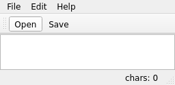
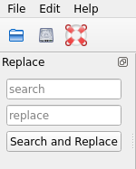

# 使用 QMainWindow 构建应用程序

在构建简单表单时，基本的 Qt 小部件可能会花费我们很长的时间，但完整的应用程序包括菜单、工具栏、对话框和其他功能，这些功能在从头开始构建时可能会非常繁琐和棘手。幸运的是，PyQt 为我们提供了这些标准组件的现成类，使构建应用程序相对轻松。

在本章中，我们将探讨以下主题：

*   `QMainWindow`类
*   标准对话框
*   使用`QSettings`保存设置

# 技术要求

本章将需要与[第 1 章](01.html)*PyQt 入门*中所示相同的设置。您可能还希望参考我们的 GitHub 存储库中的代码[https://github.com/PacktPublishing/Mastering-GUI-Programming-with-Python/tree/master/Chapter04](https://github.com/PacktPublishing/Mastering-GUI-Programming-with-Python/tree/master/Chapter04) 。

查看以下视频以查看代码的运行：[http://bit.ly/2M5OGnq](http://bit.ly/2M5OGnq)

# QMainWindow 类

到目前为止，我们一直使用 humble`QWidget`作为顶级窗口的基类。这适用于简单表单，但它缺少应用程序主窗口的许多功能，如菜单栏或工具栏。Qt 提供了`QMainWindow`类来满足这一需求。

复制[第一章](01.html)、*PyQt 入门*中的应用模板，让我们做一个小但关键的改变：

```py
class MainWindow(qtw.QMainWindow):
```

我们将从`QMainWindow`继承，而不是从`QWidget`继承。正如您将看到的，这将改变我们编写 GUI 的方式，但它也将为我们的主窗口添加一些不错的功能。

为了探索这些新特性，让我们构建一个简单的纯文本编辑器。下面的屏幕截图显示了我们完成的编辑器的外观，以及显示`QMainWindow`类主要组件的标签：


保存更新的模板，将其复制到名为`text_editor.py`的新文件中，然后在代码编辑器中打开新文件。开始吧！

# 设置中心小部件

`QMainWindow`分为几个部分，其中最重要的是**中央小部件**。这是一个小部件，代表接口的主要业务部分。

我们通过将对任何小部件的引用传递给`QMainWindow.setCentralWidget()`方法来设置它，如下所示：

```py
        self.textedit = qtw.QTextEdit()
        self.setCentralWidget(self.textedit)
```

只有一个中心小部件，因此在更复杂的应用程序（例如数据输入应用程序）中，它更有可能是一个`QWidget`对象，您在其上安排了更复杂的 GUI；对于我们的简单文本编辑器，一个`QTextEdit`小部件就足够了。请注意，我们没有在`QMainWindow`上设置布局；这样做会破坏组件的预设排列。

# 添加状态栏

**状态栏**是横跨应用程序窗口底部的条带，用于显示短文本消息和信息小部件。在 Qt 中，状态栏是一个`QStatusBar`对象，我们可以将它分配给主窗口的`statusBar`属性。

我们可以创建这样一个：

```py
        status_bar = qtw.QStatusBar()
        self.setStatusBar(status_bar)
        status_bar.showMessage('Welcome to text_editor.py')
```

不过,没必要这么麻烦,；如果没有状态栏，`QMainWindow`对象的`statusBar()`方法会自动创建一个新的状态栏，如果有，则返回现有的状态栏。

因此，我们可以将所有代码简化为：

```py
        self.statusBar().showMessage('Welcome to text_editor.py')
```

`showMessage()`方法完全按照它所说的做，在状态栏中显示给定的字符串。这是到目前为止最常用的状态栏；但是，`QStatusBar`对象也可以包含其他小部件。

例如，我们可以添加一个跟踪角色计数的小部件：

```py
        charcount_label = qtw.QLabel("chars: 0")
        self.textedit.textChanged.connect(
            lambda: charcount_label.setText(
                "chars: " +
                str(len(self.textedit.toPlainText()))
                )
            )
        self.statusBar().addPermanentWidget(charcount_label)
```

每当文本发生变化时，此`QLabel`将根据输入的字符数进行更新。

请注意，我们已经将其直接添加到状态栏，而没有引用布局对象；`QStatusBar`有自己的添加或插入小部件的方法，有两种风格：**常规**和**永久**。在常规模式下，如果向状态栏发送一条长消息以显示，则小部件可能会被覆盖。在永久模式下，它们将保持可见。在这种情况下，我们使用`addPermanentWidget()`方法在永久模式下添加`charcount_label`，这样它就不会被一条长的短信所掩盖。

The methods for adding a widget in regular mode are `addWidget()` and `insertWidget()`; for permanent mode, use `addPermanentWidget()` and `insertPermanentWidget()`.

# 创建应用程序菜单

**应用程序菜单**是大多数应用程序的一项关键功能，通过分层组织的下拉菜单可以访问应用程序的所有功能。

我们可以使用`QMainWindow.menuBar()`方法轻松创建：

```py
        menubar = self.menuBar()
```

`menuBar()`方法返回一个`QMenuBar`对象，与`statusBar()`一样，该方法将为我们提供窗口的现有菜单（如果它存在），或者简单地创建一个新菜单（如果它不存在）。

默认情况下，菜单为空，但我们可以使用菜单栏的`addMenu()`方法添加子菜单，如下所示：

```py
        file_menu = menubar.addMenu('File')
        edit_menu = menubar.addMenu('Edit')
        help_menu = menubar.addMenu('Help')
```

`addMenu()`返回一个`QMenu`对象，表示下拉子菜单。传递到方法中的字符串将用于在主菜单栏中标记菜单。

Certain platforms, such as macOS, will not display empty submenus. See the *Menus on macOS* section for more information on building menus in macOS.

要用项目填充这些菜单，我们需要创建一些**动作**。动作只是`QAction`类的对象，代表我们的程序可以做的事情。为了有用，`QAction`对象至少需要一个名称和回调；他们可以选择为操作定义键盘快捷键和图标。

创建动作的一种方法是调用`QMenu`对象的`addAction()`方法，如下所示：

```py
        open_action = file_menu.addAction('Open')
        save_action = file_menu.addAction('Save')
```

我们已经创建了两个名为`Open`和`Save`的动作。它们实际上都没有做任何事情，因为我们没有分配回调方法，但是如果您运行应用程序脚本，您会看到文件菜单确实列出了两项，`Open`和`Save`。

要创建实际执行某些操作的项，我们可以传入第二个参数，该参数包含 Python 可调用或 Qt 插槽：

```py
        quit_action = file_menu.addAction('Quit', self.destroy)
        edit_menu.addAction('Undo', self.textedit.undo)
```

对于需要更多控制的情况，可以显式创建`QAction`对象并将其添加到菜单中，如下所示：

```py
        redo_action = qtw.QAction('Redo', self)
        redo_action.triggered.connect(self.textedit.redo)
        edit_menu.addAction(redo_action)
```

`QAction`对象有一个`triggered`信号，该信号必须连接到一个可调用或插槽，动作才能生效。当我们使用创建动作的`addAction()`方法时，这是自动处理的，但当显式创建`QAction`对象时，必须手动处理。

Although not technically required, it's very important to pass in a parent widget when creating a `QAction` object explicitly. Failing to do so will result in the item not showing up, even when you add it to the menu.

# macOS 上的菜单

`QMenuBar`默认包装操作系统的本机菜单系统。在 macOS 上，本机菜单系统有一些您需要注意的特性：

*   macOS 使用**全局菜单**，这意味着菜单栏不是应用程序窗口的一部分，而是附在桌面顶部的菜单栏上。默认情况下，主窗口的菜单栏将用作全局菜单。如果您有一个具有多个主窗口的应用程序，并且希望它们都使用相同的菜单栏，请不要使用`QMainWindow.menuBar()`创建菜单栏。相反，显式创建一个`QMenuBar`对象，并将其分配给使用`setMenuBar()`方法创建的主窗口对象。
*   macOS 还有许多默认子菜单和菜单项。要访问这些项目，只需在添加子菜单时使用相同的选项。添加子菜单时，请参阅*进一步阅读*部分，了解有关 macOS 菜单的更多详细信息。
*   如前所述，macOS 不会在全局菜单上显示空的子菜单。

如果您发现这些问题对您的应用程序来说太麻烦，您可以随时指示 Qt 不要使用本机菜单系统，如下所示：

```py
        self.menuBar().setNativeMenuBar(False)
```

这将在应用程序窗口中放置菜单栏，就像在其他平台上一样，并删除平台特定的问题。但是，请注意，这种方法破坏了 macOS 软件的典型工作流程，用户可能会感到不舒服。

More information about Qt menus on macOS can be found at [https://doc.qt.io/qt-5/macos-issues.html#menu-bar](https://doc.qt.io/qt-5/macos-issues.html#menu-bar).

# 添加工具栏

**工具栏**是一长排按钮，通常用于编辑命令或类似操作。与主菜单不同，工具栏没有层次结构，按钮通常只标有图标。

`QMainWindow`允许我们使用`addToolBar()`方法向应用程序添加多个工具栏，如下所示：

```py
        toolbar = self.addToolBar('File')
```

`addToolBar()`方法创建并返回一个`QToolBar`对象。传递到方法中的字符串将成为工具栏的标题。

我们可以像添加到`QMenu`对象一样添加`QAction`对象：

```py
        toolbar.addAction(open_action)
        toolbar.addAction("Save")
```

与菜单一样，我们可以添加`QAction`对象或仅添加信息来构建动作（标题、回调和其他）。

运行应用程序；它应该是这样的：



请注意，工具栏的标题不显示在其上。但是，如果右键单击工具栏区域，将看到一个弹出菜单，其中包含所有工具栏标题，并带有复选框，可用于显示或隐藏应用程序的任何工具栏。

默认情况下，工具栏可以从应用程序中删除，并保持浮动或固定到应用程序的任意四个边缘。可通过将`movable`和`floatable`属性设置为`False`来禁用此功能：

```py
        toolbar.setMovable(False)
        toolbar.setFloatable(False)
```

您还可以通过将其`allowedAreas`属性设置为`QtCore.Qt.QToolBarAreas`枚举中的标志组合来限制可停靠条的窗口侧面。

例如，让我们将工具栏仅限于顶部和底部区域：

```py
        toolbar.setAllowedAreas(
            qtc.Qt.TopToolBarArea |
            qtc.Qt.BottomToolBarArea
        )
```

我们的工具栏目前有文本标记的按钮，但通常工具栏会有图标标记的按钮。为了展示它是如何工作的，我们需要一些图标。

我们可以从内置样式中提取一些图标，如下所示：

```py
        open_icon = self.style().standardIcon(qtw.QStyle.SP_DirOpenIcon)
        save_icon = self.style().standardIcon(qtw.QStyle.SP_DriveHDIcon)
```

现在不要担心这段代码是如何工作的；关于样式和图标的完整讨论将在[第 6 章](06.html)、*样式化 Qt 应用程序*中进行。现在，只需理解`open_icon`和`save_icon`是`QIcon`对象，这就是 Qt 处理图标的方式。

这些可以连接到我们的`QAction`对象，然后可以连接到工具栏，如下所示：

```py
        open_action.setIcon(open_icon)
        toolbar.addAction(open_action)
```

如您所见，这看起来更好一些：


请注意，当您运行此选项时，菜单中的文件|打开选项现在也有一个图标。因为两者都使用`open_action`对象，所以我们对该动作对象所做的任何更改都将应用于该对象的所有用途。

图标对象可以作为第一个参数传递到工具栏的`addAction`方法中，如下所示：

```py
        toolbar.addAction(
            save_icon,
            'Save',
            lambda: self.statusBar().showMessage('File Saved!')
        )
```

这会向工具栏添加一个保存操作，其中包含一个图标和一个毫无用处的回调。注意，这一次，菜单中的文件|保存操作没有得到图标；尽管我们使用了相同的标签文本，但在两个位置使用离散参数调用`addAction()`会导致两个不同且不相关的`QAction`对象。

最后，就像使用菜单一样，我们可以显式创建`QAction`对象并将其添加到工具栏中，如下所示：

```py
        help_action = qtw.QAction(
            self.style().standardIcon(qtw.QStyle.SP_DialogHelpButton),
            'Help',
            self,  # important to pass the parent!
            triggered=lambda: self.statusBar().showMessage(
                'Sorry, no help yet!'
                )
        )
        toolbar.addAction(help_action)
```

To synchronize actions across multiple action containers (toolbars, menus, and so on), either explicitly create `QAction` objects or save the references returned from `addAction()` to make sure you're adding the same action objects in each case.

我们可以在应用程序中添加任意数量的工具栏，并将它们附加到应用程序的任意一侧。要指定一方，我们必须使用另一种形式的`addToolBar()`，如下所示：

```py
        toolbar2 = qtw.QToolBar('Edit')
        toolbar2.addAction('Copy', self.textedit.copy)
        toolbar2.addAction('Cut', self.textedit.cut)
        toolbar2.addAction('Paste', self.textedit.paste)
        self.addToolBar(qtc.Qt.RightToolBarArea, toolbar2)
```

要使用这种形式的`addToolBar()`，我们必须先创建工具栏，然后将其与`QtCore.Qt.ToolBarArea`常量一起传递。

# 添加 dock 窗口小部件

**Dock widget**与工具栏类似，但它们位于工具栏区域和中心小部件之间，可以包含任何类型的小部件。

添加 dock 小部件非常类似于显式创建工具栏：

```py
        dock = qtw.QDockWidget("Replace")
        self.addDockWidget(qtc.Qt.LeftDockWidgetArea, dock)
```

与工具栏一样，dock 窗口小部件在默认情况下可以关闭、浮动或移动到应用程序的另一端。要更改 dock 小部件是否可以关闭、浮动或移动，我们必须将其`features`属性设置为`QDockWidget.DockWidgetFeatures`标志值的组合。

例如，通过添加以下代码，让用户无法关闭 dock 小部件：

```py
        dock.setFeatures(
            qtw.QDockWidget.DockWidgetMovable |
            qtw.QDockWidget.DockWidgetFloatable
        )
```

我们将`features`设置为`DockWidgetMovable`和`DockWidgetFloatable`。由于此处缺少`DockWidgetClosable`，用户将无法关闭小部件。

dock 窗口小部件设计用于保存使用`setWidget()`方法设置的单个窗口小部件。与主应用程序的`centralWidget`一样，我们通常会将其设置为包含某种表单或其他 GUI 的`QWidget`。

让我们构建一个表单以放置在 dock 小部件中，如下所示：

```py
        replace_widget = qtw.QWidget()
        replace_widget.setLayout(qtw.QVBoxLayout())
        dock.setWidget(replace_widget)

        self.search_text_inp = qtw.QLineEdit(placeholderText='search')
        self.replace_text_inp = qtw.QLineEdit(placeholderText='replace')
        search_and_replace_btn = qtw.QPushButton(
            "Search and Replace",
            clicked=self.search_and_replace
            )
        replace_widget.layout().addWidget(self.search_text_inp)
        replace_widget.layout().addWidget(self.replace_text_inp)
        replace_widget.layout().addWidget(search_and_replace_btn)
        replace_widget.layout().addStretch()
```

The `addStretch()` method can be called on a layout to add an expanding `QWidget` that pushes the other widgets together.

这是一个相当简单的表单，包含两个`QLineEdit`小部件和一个按钮。单击该按钮时，将调用主窗口的`search_and_replace()`方法。让我们快速编写代码：

```py
    def search_and_replace(self):
        s_text = self.search_text_inp.text()
        r_text = self.replace_text_inp.text()

        if s_text:
            self.textedit.setText(
                self.textedit.toPlainText().replace(s_text, r_text)
                )
```

此方法仅检索两行编辑的内容；然后，如果第一个文本中有内容，它将用文本编辑内容中的第二个文本替换第一个文本的所有实例。

此时运行程序，您应该会在应用程序左侧看到 dock 小部件，如下所示：



注意 dock 小部件右上角的图标。这允许用户在应用程序窗口外分离和浮动小部件。

# 其他 QMainWindow 功能

虽然我们已经介绍了它的主要组件，`QMainWindow`提供了许多其他功能和配置选项，您可以在[的文档中了解这些功能和配置选项 https://doc.qt.io/qt-5/qmainwindow.html](https://doc.qt.io/qt-5/qmainwindow.html) 。在以后的章节中，我们可能会涉及其中的一些内容，因为我们将从这里开始广泛使用`QMainWindow`。

# 标准对话框

**对话框**是应用程序中经常需要的，无论是询问问题、提交表单还是仅仅提醒用户某些信息。Qt 为常见情况提供了各种现成的对话框，以及定义自定义对话框的功能。在本节中，我们将介绍一些更常用的对话框类，并尝试设计我们自己的对话框类。

# QMessageBox

`QMessageBox`是一个简单的对话框，主要用于显示短消息或询问是或否问题。使用`QMessageBox`最简单的方法是利用其方便的静态方法，以最小的麻烦创建和显示对话框。

六种静态方法如下：

| 作用 | 类型 | 对话 |
| --- | --- | --- |
| `about()` | 无模式 | 使用给定文本显示应用程序的**关于**对话框。 |
| `aboutQt()` | 无模式 | 显示 Qt 的**关于**对话框。 |
| `critical()` | 情态动词 | 用提供的文本显示严重错误消息。 |
| `information()` | 情态动词 | 用提供的文本显示信息性消息。 |
| `warning()` | 情态动词 | 显示带有所提供文本的警告消息。 |
| `question()` | 情态动词 | 向用户提问。 |

大多数对话框之间的主要区别是默认图标、默认按钮和对话框的模式。

对话框可以是**模态**或**非模态**。模式对话框阻止用户与程序的任何其他部分交互，并在显示时阻止程序执行，并且在完成时可以返回值。无模式对话框不会阻止执行，但也不会返回值。在模式`QMessageBox`的情况下，返回值是表示按下按钮的`enum`常量。

让我们使用`about()`方法将**关于**的消息添加到我们的应用程序中。首先，我们将创建一个回调以显示对话框：

```py
    def showAboutDialog(self):
        qtw.QMessageBox.about(
            self,
            "About text_editor.py",
```

```py
            "This is a text editor written in PyQt5."
        )
```

**关于**的对话框是非模态的，所以它实际上只是被动显示信息的一种方式。参数依次为对话框的父窗口小部件、对话框的窗口标题文本和对话框的主文本。

回到构造函数中，让我们添加一个菜单操作来调用此方法：

```py
        help_menu.addAction('About', self.showAboutDialog)
```

模式对话框可用于从用户检索响应。例如，我们可以警告用户我们编辑器的未完成性质，看看他们是否真的打算使用它，如下所示：

```py
        response = qtw.QMessageBox.question(
            self,
            'My Text Editor',
            'This is beta software, do you want to continue?'
        )
        if response == qtw.QMessageBox.No:
            self.close()
            sys.exit()
```

所有模态对话框都返回与用户按下的按钮对应的 Qt 常量；默认情况下，`question()`创建一个包含`QMessageBox.Yes`和`QMessageBox.No`按钮值的对话框，以便我们可以测试响应并做出相应的反应。还可以通过传入第四个参数来覆盖显示的按钮，该参数包含与管道操作符组合的多个按钮。

例如，我们可以将`No`更改为`Abort`，如下所示：

```py
        response = qtw.QMessageBox.question(
            self,
            'My Text Editor',
            'This is beta software, do you want to continue?',
            qtw.QMessageBox.Yes | qtw.QMessageBox.Abort
        )
        if response == qtw.QMessageBox.Abort:
            self.close()
            sys.exit()
```

如果静态`QMessageBox`方法没有提供足够的灵活性，您也可以显式创建`QMessageBox`对象，如下所示：

```py
        splash_screen = qtw.QMessageBox()
        splash_screen.setWindowTitle('My Text Editor')
        splash_screen.setText('BETA SOFTWARE WARNING!')
        splash_screen.setInformativeText(
            'This is very, very beta, '
            'are you really sure you want to use it?'
        )
        splash_screen.setDetailedText(
            'This editor was written for pedagogical '
            'purposes, and probably is not fit for real work.'
        )
        splash_screen.setWindowModality(qtc.Qt.WindowModal)
        splash_screen.addButton(qtw.QMessageBox.Yes)
        splash_screen.addButton(qtw.QMessageBox.Abort)
        response = splash_screen.exec()
        if response == qtw.QMessageBox.Abort:
            self.close()
            sys.exit()
```

如您所见，我们可以在消息框上设置许多属性；这里描述了这些问题：

| 所有物 | 描述 |
| --- | --- |
| `windowTitle` | 打印在任务栏和对话框标题栏中的标题。 |
| `text` | 对话框中显示的文本。 |
| `informativeText` | 在`text`字符串下显示的较长的解释性文本，通常以较小或较轻的字体显示。 |
| `detailedText` | 隐藏在“显示详细信息”按钮后面并显示在滚动文本框中的文本。用于调试或日志输出。 |
| `windowModality` | 用于设置消息框是模态还是非模态。需要一个`QtCore.Qt.WindowModality`常数。 |

我们还可以使用`addButton()`方法在对话框中添加任意数量的按钮，然后通过调用其`exec()`方法显示对话框。如果我们将对话框配置为模态，此方法将返回与单击的按钮匹配的常量。

# QFileDialog

应用程序通常需要打开或保存文件，用户需要一种简单的方式来浏览和选择这些文件。Qt 为我们提供了`QFileDialog`类来满足这一需求。

与`QMessageBox`一样，`QFileDialog`类包含几个静态方法，这些方法显示适当的模态对话框并返回用户选择的值。

此表显示了静态方法及其预期用途：

| 方法 | 退换商品 | 描述 |
| --- | --- | --- |
| `getExistingDirectory` | 一串 | 选择现有目录路径。 |
| `getExistingDirectoryUrl` | `QUrl` | 选择现有的目录 URL。 |
| `getOpenFileName` | 一串 | 选择要打开的现有文件名路径。 |
| `getOpenFileNames` | 列表 | 选择要打开的多个现有文件名路径。 |
| `getOpenFileUrl` | `QUrl` | 选择现有的文件名 URL。 |
| `getSaveFileName` | 一串 | 选择要保存到的新文件名路径或现有文件名路径。 |
| `getSaveFileUrl` | `QUrl` | 选择新的或现有的 URL。 |

在支持它的平台上，这些方法的 URL 版本允许选择远程文件和目录。

要查看文件对话框的工作方式，让我们创建在应用程序中打开文件的功能：

```py
    def openFile(self):
        filename, _ = qtw.QFileDialog.getOpenFileName()
        if filename:
            try:
                with open(filename, 'r') as fh:
                    self.textedit.setText(fh.read())
            except Exception as e:
                qtw.QMessageBox.critical(f"Could not load file: {e}")
```

`getOpenFileName()`返回包含所选文件名和所选文件类型筛选器的元组。如果用户取消对话框，文件名将返回一个空字符串，我们的方法将退出。如果我们收到一个文件名，我们将尝试打开该文件并将我们的`textedit`小部件的内容写入其中。

Since we aren't using the second value returned from the method, we're assigning it to the `_` (underscore) variable. This is a standard Python convention for naming variables you don't intend to use.

`getOpenFileName()`有许多用于配置对话框的参数，所有这些参数都是可选的。顺序如下：

1.  父窗口小部件
2.  在窗口标题中使用的标题
3.  起始目录，作为路径字符串
4.  可用于“文件类型筛选器”下拉列表的筛选器
5.  默认选择的过滤器
6.  选项标志

例如，让我们配置文件对话框：

```py
        filename, _ = qtw.QFileDialog.getOpenFileName(
            self,
            "Select a text file to open…",
            qtc.QDir.homePath(),
            'Text Files (*.txt) ;;Python Files (*.py) ;;All Files (*)',
            'Python Files (*.py)',
            qtw.QFileDialog.DontUseNativeDialog |
            qtw.QFileDialog.DontResolveSymlinks
        )
```

`QDir.homePath()` is a static method that returns the user's home directory.

请注意，过滤器被指定为单个字符串；每个过滤器都是一个说明加上括号中的通配符字符串，过滤器之间用双分号分隔。这将导致过滤器下拉列表如下所示：


最后，我们可以使用管道操作符指定一组组合的选项标志。在本例中，我们告诉 Qt 不要使用本机 OS 文件对话框，也不要解析符号链接（默认情况下都是这样）。参见[中的`QFileDialog`文档 https://doc.qt.io/qt-5/qfiledialog.html#Option-枚举](https://doc.qt.io/qt-5/qfiledialog.html#Option-enum)以获取选项标志的完整列表。

“保存文件”对话框的工作方式大致相同，但提供了更适合保存文件的界面。我们可以按照以下方式实施我们的`saveFile()`方法：

```py
    def saveFile(self):
        filename, _ = qtw.QFileDialog.getSaveFileName(
            self,
            "Select the file to save to…",
            qtc.QDir.homePath(),
            'Text Files (*.txt) ;;Python Files (*.py) ;;All Files (*)'
        )
        if filename:
            try:
                with open(filename, 'w') as fh:
                    fh.write(self.textedit.toPlainText())
            except Exception as e:
                qtw.QMessageBox.critical(f"Could not save file: {e}")
```

其他`QFileDialog`方便的方法也是如此。与`QMessageBox`一样，还可以显式创建`QFileDialog`对象，手动配置其属性，然后使用`exec()`方法显示。但是，这很少是必需的，因为内置方法对于大多数文件选择情况都是足够的。

在继续之前，不要忘记添加操作以在`MainWindow`构造函数中调用这些方法：

```py
        open_action.triggered.connect(self.openFile)
        save_action.triggered.connect(self.saveFile)
```

# QFontDialog

Qt 提供了许多其他类似于`QFileDialog`的方便选择对话框；其中一个对话框是`QFontDialog`，它允许用户选择和配置文本字体的各个方面。

与其他对话框类一样，通过调用静态方法来显示对话框并返回用户的选择（在本例中为`getFont()`方法），这是最容易使用的方法。

让我们在`MainWindow`类中添加一个回调方法来设置编辑器字体：

```py
    def set_font(self):
        current = self.textedit.currentFont()
        font, accepted = qtw.QFontDialog.getFont(current, self)
        if accepted:
            self.textedit.setCurrentFont(font)
```

`getFont`将当前字体作为参数，允许其将所选字体设置为当前字体（如果忽略此操作，对话框将默认为列出的第一种字体）。

它返回一个元组，其中包含所选字体和一个布尔值，指示用户是否单击了“确定”。字体作为`QFont`对象返回，它不仅封装字体系列，还封装字体的样式、大小、效果和书写系统。我们的方法可以将此对象传递回`QTextEdit`对象的`setCurrentFont()`插槽以设置其字体。

与`QFileDialog`一样，Qt 尝试使用操作系统的本机字体对话框（如果有）；否则，它将使用自己的小部件。您可以通过将`DontUseNativeDialog`选项传递给`options`关键字参数，强制它使用对话框的 Qt 版本，正如我们在这里所做的：

```py
        font, accepted = qtw.QFontDialog.getFont(
            current,
            self,
            options=(
                qtw.QFontDialog.DontUseNativeDialog |
                qtw.QFontDialog.MonospacedFonts
            )
        )
```

我们还传入了一个选项，将对话框限制为单间距字体。参见[中`QFontDialog`的 Qt 文档 https://doc.qt.io/qt-5/qfontdialog.html#FontDialogOption-枚举](https://doc.qt.io/qt-5/qfontdialog.html#FontDialogOption-enum)了解有关可用选项的更多信息。

# 其他对话框

Qt 包含用于选择颜色、请求输入值等的其他对话框类。所有这些工作或多或少都类似于文件和字体对话框，它们都是从`QDialog`类派生而来的。我们可以将`QDialog`子类化以创建自定义对话框。

例如，假设我们想要一个对话框来输入设置。我们可以这样开始建设：

```py
class SettingsDialog(qtw.QDialog):
    """Dialog for setting the settings"""

    def __init__(self, settings, parent=None):
        super().__init__(parent, modal=True)
        self.setLayout(qtw.QFormLayout())
        self.settings = settings
        self.layout().addRow(
            qtw.QLabel('<h1>Application Settings</h1>'),
        )
        self.show_warnings_cb = qtw.QCheckBox(
            checked=settings.get('show_warnings')
        )
        self.layout().addRow("Show Warnings", self.show_warnings_cb)

        self.accept_btn = qtw.QPushButton('Ok', clicked=self.accept)
        self.cancel_btn = qtw.QPushButton('Cancel', clicked=self.reject)
        self.layout().addRow(self.accept_btn, self.cancel_btn)
```

这段代码与我们在过去几章中使用`QWidget`创建的弹出框的距离不远。然而，通过使用`QDialog`我们可以免费获得一些东西，即：

*   我们有`accept`和`reject`插槽，可以连接相应的按钮。默认情况下，这会导致窗口关闭并分别发出`accepted`或`rejected`信号。
*   我们还得到了`exec()`方法，该方法返回一个布尔值，指示对话框是被接受还是被拒绝。
*   通过将适当的值传递给`super()`构造函数，我们可以轻松地将对话框设置为模态或非模态。

`QDialog`在如何利用用户输入的数据方面给了我们很大的灵活性。例如，我们可以使用一个信号来发送数据或覆盖`exec()`来返回数据。

在本例中，由于我们传递的是一个可变的`dict`对象，我们将重写`accept()`以更改该`dict`对象：

```py
    def accept(self):
        self.settings['show_warnings'] = self.show_warnings_cb.isChecked()
        super().accept()
```

回到`MainWindow`类，让我们创建一个属性和方法来使用新对话框：

```py
class MainWindow(qtw.QMainWindow):

    settings = {'show_warnings': True}

    def show_settings(self):
        settings_dialog = SettingsDialog(self.settings, self)
        settings_dialog.exec()
```

使用`QDialog`类与创建对话框类的实例并调用`exec()`一样简单。因为我们直接编辑我们的`settings`dict，在这种情况下，我们不需要担心连接`accepted`信号或使用`exec()`的输出。

# 使用 QSettings 保存设置

任何合理大小的应用程序都可能在会话之间累积需要存储的设置。保存这些设置通常涉及大量繁琐的文件操作和数据序列化工作，如果我们希望以跨平台良好工作的方式保存这些设置，则会变得更加复杂。Qt 通过其`QtCore.QSettings`类将我们从这项工作中解救出来。

`QSettings`类是一个简单的键值数据存储，它以适合平台的方式自动持久化。例如，在 Windows 上，设置存储在注册表数据库中，而在 Linux 上，它们被放置在`~/.config`下的纯文本配置文件中。

让我们将在文本编辑器中创建的设置`dict`对象替换为`QSettings`对象。

要创建一个`QSettings`对象，我们需要传入一个公司名和应用程序名，如下所示：

```py
class MainWindow(qtw.QMainWindow):

    settings = qtc.QSettings('Alan D Moore', 'text editor')
```

这些字符串将确定存储设置的注册表项或文件路径。例如，在 Linux 上，此设置文件将保存在`~/.config/Alan D Moore/text editor.conf`。在 Windows 上，它将存储在注册表中的`HKEY_CURRENT_USER\Alan D Moore\text editor\`。

我们可以使用对象的`value()`方法查询任意设置的值；例如，我们可以使启动警告对话框以`show _warnings`设置为条件：

```py
        if self.settings.value('show_warnings', False, type=bool):
            # Warning dialog code follows...
```

`value()`的参数是键字符串、未找到键时的默认值以及`type`关键字参数，它告诉`QSettings`如何解释保存的值。`type`论点至关重要；并非所有平台都能以明确的方式充分表示所有数据类型。例如，如果未指定数据类型，布尔值将作为字符串`true`和`false`返回，这两个字符串在 Python 中都是`True`。

设置键的值使用`setValue()`方法，如`SettingsDialog.accept()`方法所示：

```py
        self.settings.setValue(
            'show_warnings',
            self.show_warnings_cb.isChecked()
        )
```

注意，我们不必做任何事情来将这些值存储到磁盘；Qt 事件循环会定期将它们自动同步到磁盘。`QSettings`对象创建时，它们也会自动从磁盘读取。简单地用一个`QSettings`对象替换我们原来的`settings`dict 就足以让我们在不编写一行文件 I/O 代码的情况下进行持久设置！

# QSettings 的局限性

物体虽然强大，却不能储存任何东西。设置对象中的所有值都存储为`QVariant`对象，因此只能存储可转换为`QVariant`的对象。这包含了一长串类型，包括几乎所有 Python 内置类型和来自`QtCore`的大多数数据类。甚至可以存储函数引用（尽管不是函数定义）。

不幸的是，如果您试图存储无法正确存储的对象，`QSettings.setValue()`既不会引发异常，也不会返回错误。它将向控制台打印一条警告，并存储一些可能不有用的内容，例如：

```py
app = qtw.QApplication([])
s = qtc.QSettings('test')
s.setValue('app', app)
# Prints: QVariant::save: unable to save type 'QObject*' (type id: 39).
```

一般来说，如果存储的对象清楚地表示数据，就不会有问题。

`QSettings`对象的另一个主要限制是它无法自动识别某些存储对象的数据类型，正如我们在布尔值中看到的那样。因此，在处理非字符串值的任何内容时，传递一个`type`参数至关重要。

# 总结

在本章中，您学习了帮助构建完整应用程序的 PyQt 类。您了解了`QMainWindow`类、其菜单、状态栏、工具栏和 dock 小部件。您还了解了源自`QDialog`的标准对话框和消息框，以及如何使用`QSettings`存储应用程序设置。

在下一章中，我们将学习 Qt 中的模型视图类，这将帮助我们分离关注点并创建更健壮的应用程序设计。

# 问题

尝试以下问题来测试您在本章中的知识：

1.  您希望将`QMainWindow`与[第 3 章](03.html)中的`calendar_app.py`脚本一起使用*处理带有信号和插槽的事件*。您将如何进行转换？
2.  您正在使用一个应用程序，并已将子菜单名称添加到菜单栏，但未使用项目填充其中任何一个。你的同事说，当他们测试菜单时，没有一个菜单名出现在他的桌面上。你的代码看起来是正确的；这里可能发生了什么？
3.  您正在开发一个代码编辑器，并希望创建一个边栏面板以与调试器交互。哪个`QMainWindow`功能最适合此任务？

4.  以下代码工作不正常；无论单击什么，它都将继续。为什么它不工作，你如何修复它？

```py
    answer = qtw.QMessageBox.question(
        None, 'Continue?', 'Run this program?')
    if not answer:
        sys.exit()
```

5.  您正在通过子类化`QDialog`来构建自定义对话框。您需要将输入到对话框中的信息返回到主窗口对象。以下哪种方法不起作用？

6.  您正在 Linux 上编写一个名为**SuperPhoto**的照片编辑器。您已经编写了代码并保存了用户设置，但是在`~/.config/`中找不到`SuperPhoto.conf`。查看代码并确定出错的原因：

```py
    settings = qtc.QSettings()
    settings.setValue('config_file', 'SuperPhoto.conf')
    settings.setValue('default_color', QColor('black'))
    settings.sync()
```

7.  您正在从“设置”对话框保存首选项，但由于某些原因，保存的设置会以非常奇怪的方式返回。这里怎么了？

```py
    settings = qtc.QSettings('My Company', 'SuperPhoto')
    settings.setValue('Default Name', dialog.default_name_edit.text)
    settings.setValue('Use GPS', dialog.gps_checkbox.isChecked)
    settings.setValue('Default Color', dialog.color_picker.color)
```

# 进一步阅读

有关更多信息，请参阅以下内容：

*   Qt 的`QMainWindow`文件可在[找到 https://doc.qt.io/qt-5/qmainwindow.html](https://doc.qt.io/qt-5/qmainwindow.html) 。
*   使用`QMainWindow`的示例可在[中找到 https://github.com/pyqt/examples/tree/master/mainwindows](https://github.com/pyqt/examples/tree/master/mainwindows) 。
*   苹果的 macOS 人机界面指南包括如何构建应用程序菜单的指南。这些可在[找到 https://developer.apple.com/design/human-interface-guidelines/macos/menus/menu-anatomy/](https://developer.apple.com/design/human-interface-guidelines/macos/menus/menu-anatomy/) 。
*   微软在[为 Windows 应用程序提供菜单设计指南 https://docs.microsoft.com/en-us/windows/desktop/uxguide/cmd-menus](https://docs.microsoft.com/en-us/windows/desktop/uxguide/cmd-menus) 。
*   PyQt 在[中提供了一些对话框使用示例 https://github.com/pyqt/examples/tree/master/dialogs](https://github.com/pyqt/examples/tree/master/dialogs) 。
*   `QMainWindow`也可用于创建**多文档接口**（**MDI**）。有关如何构建 MDI 应用程序的更多信息，请参阅[https://www.pythonstudio.us/pyqt-programming/multiple-document-interface-mdi.html](https://www.pythonstudio.us/pyqt-programming/multiple-document-interface-mdi.html) 和[处的示例代码 https://doc.qt.io/qt-5/qtwidgets-mainwindows-mdi-example.html](https://doc.qt.io/qt-5/qtwidgets-mainwindows-mdi-example.html) 。