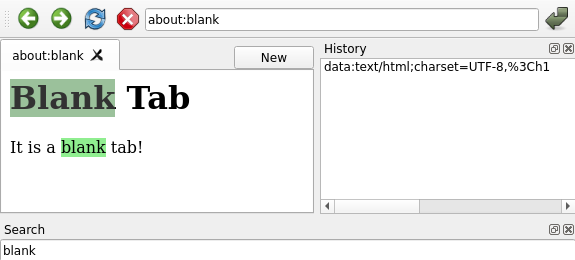

# 使用 QtWebEngine 进行 Web 浏览

在[第 8 章](08.html)*与 QtNetwork*的联网中，您学习了如何使用套接字和 HTTP 通过网络与系统进行交互。然而，现代网络不仅仅是网络协议；它是一个基于 HTML、JavaScript 和 CSS 组合构建的编程平台，有效地使用它需要一个完整的 web 浏览器。幸运的是，Qt 为我们提供了`QtWebEngineWidgets`库，它在小部件中为我们的应用程序提供了一个完整的 web 浏览器。

在本章中，我们将在以下部分学习如何使用 Qt 访问 web：

*   使用`QWebEngineView`构建基本浏览器
*   高级`QtWebEngine`用法

# 技术要求

除了我们在本书中使用的基本 PyQt5 设置外，您还需要确保已从 PyPI 安装了`PyQtWebEngine`包。可以使用以下命令执行此操作：

```py
$ pip install --user PyQtWebEngine
```

您可能还需要本章的示例代码，可从[获取 https://github.com/PacktPublishing/Mastering-GUI-Programming-with-Python/tree/master/Chapter16](https://github.com/PacktPublishing/Mastering-GUI-Programming-with-Python/tree/master/Chapter16) 。

查看以下视频以查看代码的运行：[http://bit.ly/2M5xFtD](http://bit.ly/2M5xFtD)

# 使用 QWebEngineView 构建基本浏览器

从`QtWebEngineWidgets`开始使用的主要类是`QWebEngineView`类；此类在`QWidget`对象中提供了一个几乎完整的基于铬的浏览器。Chromium 是一个开源项目，它支撑着 Google Chrome、最新版本的 Microsoft Edge 和许多其他浏览器。

Qt 还有一个不推荐使用的基于 Safari、Opera 和一些旧浏览器中使用的**Webkit**渲染引擎的`QtWebKit`模块。API 与`QtWebKit`和`QtWebEngineWidgets`的呈现行为之间存在一些显著差异，后者是较新项目的首选。

在本节中，我们将看到通过使用`QtWebEngineWidgets`构建一个简单的 web 浏览器，在 Qt 应用程序中包含 web 内容是多么容易。

# 使用 QWebEngineView 小部件

我们需要从[第 4 章](04.html)、*使用 QMainWindow 构建应用程序、*复制我们的 Qt 应用程序模板，并将其命名为`simple_browser.py`；我们将开发一个带有标签和历史显示的基本浏览器。

我们首先导入`QtWebEngineWidgets`库，如下所示：

```py
from PyQt5 import QtWebEngineWidgets as qtwe
```

Note that there is also a `QtWebEngine` module, but it is for use with the **Qt Modeling Language** (**QML**) declarative framework, not the Qt Widgets framework covered by this book. `QtWebEngineWidgets` contains the widgets-based browser.

在`MainWindow`类构造函数中，我们将通过定义导航工具栏来启动 GUI：

```py
        navigation = self.addToolBar('Navigation')
        style = self.style()
        self.back = navigation.addAction('Back')
        self.back.setIcon(style.standardIcon(style.SP_ArrowBack))
        self.forward = navigation.addAction('Forward')
        self.forward.setIcon(style.standardIcon(style.SP_ArrowForward))
        self.reload = navigation.addAction('Reload')
        self.reload.setIcon(style.standardIcon(style.SP_BrowserReload))
        self.stop = navigation.addAction('Stop')
        self.stop.setIcon(style.standardIcon(style.SP_BrowserStop))
        self.urlbar = qtw.QLineEdit()
        navigation.addWidget(self.urlbar)
        self.go = navigation.addAction('Go')
        self.go.setIcon(style.standardIcon(style.SP_DialogOkButton))
```

在这里，我们定义了标准浏览器操作的工具栏按钮，以及 URL 栏的`QLineEdit`对象。我们还从默认样式中提取了这些操作的图标，正如我们在[第 4 章](04.html)的*添加工具栏*部分中所做的一样，*使用 QMainWindow*构建应用程序。

现在我们将创建一个`QWebEngineView`对象：

```py
        webview = qtwe.QWebEngineView()
        self.setCentralWidget(webview)
```

`QWebEngineView`对象是一个（如您所见）功能齐全的交互式 web 小部件，能够检索和呈现 HTML、CSS、JavaScript、图像和其他标准 web 内容。

要在视图中加载 URL，我们将`QUrl`传递给它的`load()`方法：

```py
        webview.load(qtc.QUrl('http://www.alandmoore.com'))
```

这将提示 web 视图像普通 web 浏览器一样下载并呈现页面。

当然，尽管该网站很好，但我们希望能够导航到其他网站，因此我们将添加以下连接：

```py
        self.go.triggered.connect(lambda: webview.load(
            qtc.QUrl(self.urlbar.text())))
```

在这里，我们将`go`操作连接到一个`lambda`函数，该函数检索 URL 栏的文本，将其包装在`QUrl`对象中，并将其发送到 web 视图。如果此时运行脚本，您应该能够在工具栏中键入 URL，点击 Go**、**并像其他浏览器一样浏览 web。

`QWebView`有用于所有常见浏览器导航操作的插槽，我们可以将其连接到导航栏：

```py
        self.back.triggered.connect(webview.back)
        self.forward.triggered.connect(webview.forward)
        self.reload.triggered.connect(webview.reload)
        self.stop.triggered.connect(webview.stop)
```

有了这些信号的连接，我们的脚本就可以成为一个功能齐全的网页浏览体验了。然而，我们目前仅限于一个浏览器窗口；我们需要制表符，所以让我们在下一节中实现它。

# 允许多个窗口和选项卡

在`MainWindow.__init__()`中，删除或注释掉刚才添加的 web 视图代码（返回到`QWebEngineView`对象的创建）。我们将把这个功能转移到一个方法中，这样我们就可以在一个选项卡式界面中创建多个 web 视图。我们将按以下方式进行：

1.  首先，我们将用一个`QTabWidget`对象替换`QWebEngineView`对象作为我们的中心小部件：

```py
        self.tabs = qtw.QTabWidget(
            tabsClosable=True, movable=True)
        self.tabs.tabCloseRequested.connect(self.tabs.removeTab)
        self.new = qtw.QPushButton('New')
        self.tabs.setCornerWidget(self.new)
        self.setCentralWidget(self.tabs)
```

此选项卡小部件将具有可移动和可关闭的选项卡，在左角有一个用于添加新选项卡的新按钮。

2.  要添加带有 web 视图的新选项卡，我们将创建一个`add_tab()`方法：

```py
    def add_tab(self, *args):
        webview = qtwe.QWebEngineView()
        tab_index = self.tabs.addTab(webview, 'New Tab')
```

此方法首先创建一个 web 视图小部件，并将其添加到选项卡小部件中的新选项卡中。

3.  现在我们有了 web view 对象，我们需要连接一些信号：

```py
        webview.urlChanged.connect(
            lambda x: self.tabs.setTabText(tab_index, x.toString()))
        webview.urlChanged.connect(
            lambda x: self.urlbar.setText(x.toString()))
```

每当一个新的 URL 加载到视图中时，`QWebEngineView`对象的`urlChanged`信号就会发出，并将新的 URL 作为`QUrl`对象一起发送。我们将此信号连接到一个`lambda`函数，该函数将选项卡标题文本设置为 URL，以及另一个设置 URL 栏内容的函数。当用户使用网页中的超链接导航时，这将保持 URL 栏与浏览器同步，而不是直接使用 URL 栏。

4.  然后，我们可以使用其`setHtml()`方法将默认内容添加到 web 视图中：

```py
        webview.setHtml(
            '<h1>Blank Tab</h1><p>It is a blank tab!</p>',
            qtc.QUrl('about:blank'))
```

这会将浏览器窗口的内容设置为我们提供给它的任何 HTML 字符串。如果我们还传递一个`QUrl`对象，它将被用作当前 URL（例如，并发布到`urlChanged`信号）。

5.  要启用导航，我们需要将工具栏操作连接到浏览器小部件。由于我们的浏览器有一个全局工具栏，我们不能直接将它们连接到 web 视图小部件。我们需要将它们连接到将信号传递到当前活动 web 视图中的插槽的方法。首先创建回调方法，如下所示：

```py
    def on_back(self):
        self.tabs.currentWidget().back()

    def on_forward(self):
        self.tabs.currentWidget().forward()

    def on_reload(self):
        self.tabs.currentWidget().reload()

    def on_stop(self):
        self.tabs.currentWidget().stop()

    def on_go(self):
        self.tabs.currentWidget().load(
            qtc.QUrl(self.urlbar.text()))
```

这些方法基本上与单窗格浏览器中使用的方法相同，但有一个关键的变化，它们使用 tab 小部件的`currentWidget()`方法检索当前可见选项卡的`QWebEngineView`对象，然后调用该 web 视图上的导航方法。

6.  回到`__init__()`中，连接以下方法：

```py
        self.back.triggered.connect(self.on_back)
        self.forward.triggered.connect(self.on_forward)
        self.reload.triggered.connect(self.on_reload)
        self.stop.triggered.connect(self.on_stop)
        self.go.triggered.connect(self.on_go)
        self.urlbar.returnPressed.connect(self.on_go)
        self.new.clicked.connect(self.add_tab)
```

为了方便和键盘友好，我们还将 URL 栏的`returnPressed`信号连接到`on_go()`方法。我们还将新按钮连接到了`add_tab()`方法。

现在尝试一下浏览器，您应该能够添加多个选项卡并在每个选项卡中独立浏览。

# 为弹出窗口添加选项卡

目前，我们的脚本存在一个问题，如果您*Ctrl*+*单击超链接，或打开配置为打开新窗口的链接，则不会发生任何事情。默认情况下，`QWebEngineView`无法打开新选项卡或窗口。为了实现这一点，我们必须用一个函数重写它的`createWindow()`方法，该函数创建并返回一个新的`QWebEngineView`对象。*

 *通过更新我们的`add_tab()`方法，我们可以很容易地做到这一点：

```py
        webview.createWindow = self.add_tab
        return webview
```

与其子类化`QWebEngineView`来覆盖该方法，我们只需将`MainWindow.add_tab()`方法分配给其`createWindow()`方法。然后，我们只需要确保在方法末尾返回创建的 web 视图对象。

注意，在`createWindow()`方法中加载 URL 不是我们的责任；我们只需要创建视图并将其适当地添加到 GUI 中。Qt 将负责在我们返回的 web 视图对象中执行需要执行的浏览操作。

现在，当您尝试浏览器时，您应该会发现，*Ctrl*+单击会打开一个包含请求链接的新选项卡。

# 高级 QtWebEngine 用法

虽然我们已经实现了一个基本的、可维护的浏览器，但它仍有许多不足之处。在本节中，我们将通过修复用户体验中的一些痛点并实施有用的工具（如历史记录和文本搜索），探索`QtWebEngineWidgets`的一些更高级的功能。

# 共享个人资料

虽然我们可以在浏览器中查看多个选项卡，但它们与经过身份验证的网站的工作方式存在一个小问题。访问您拥有登录帐户的任何网站；登录，然后*Ctrl*+单击站点内的链接，在新选项卡中打开该链接。在新选项卡中，您会发现您没有经过身份验证。对于使用多个窗口或选项卡来实现用户界面的站点来说，这可能是一个真正的问题。我们希望身份验证和其他会话数据在浏览器范围内，所以让我们解决这个问题。

会话信息存储在由`QWebEngineProfile`对象表示的**配置文件**中。这个对象是为每个`QWebEngineWidget`对象自动生成的，但我们可以用自己的对象覆盖它。

首先在`MainWindow.__init__()`中创建一个：

```py
        self.profile = qtwe.QWebEngineProfile()
```

在`add_tab()`中创建新的 web 视图时，我们需要将此配置文件对象与它们关联。然而，概要文件实际上不是 web 视图的属性；它们是网页对象的属性。该页面由一个`QWebEnginePage`对象表示，可以认为是 web 视图的*模型*。每个 web 视图都会生成自己的`page`对象，作为浏览引擎的接口。

要覆盖 web 视图的配置文件，我们需要创建一个`page`对象，用我们自己的配置文件覆盖它的配置文件，然后用我们的新页面覆盖 web 视图的页面，如下所示：

```py
        page = qtwe.QWebEnginePage(self.profile)
        webview.setPage(page)
```

配置文件*必须*作为参数传递给`QWebEnginePage`构造函数，因为之后没有访问函数进行设置。一旦我们有了一个使用我们的配置文件的新的`QWebEnginePage`对象，我们就可以调用`QWebEngineView.setPage()`将其分配给我们的 web 视图。

现在，当您测试浏览器时，您的身份验证状态应该在所有选项卡上保持不变。

# 查看历史

每个`QWebEngineView`对象都管理自己的浏览历史记录，我们可以访问这些历史记录，以允许用户查看和导航所访问的 URL。

要构建此功能，让我们创建一个界面，显示当前选项卡的历史记录，并允许用户单击历史记录项以导航回：

1.  首先在`MainView.__init__()`中为历史创建 dock 小部件：

```py
        history_dock = qtw.QDockWidget('History')
        self.addDockWidget(qtc.Qt.RightDockWidgetArea, history_dock)
        self.history_list = qtw.QListWidget()
        history_dock.setWidget(self.history_list)
```

历史 dock 只包含一个`QListWidget`对象，它将显示当前所选选项卡的历史。

2.  因为当用户切换选项卡时，我们需要刷新此列表，所以将选项卡小部件的`currentChanged`信号连接到可以执行此操作的回调：

```py
        self.tabs.currentChanged.connect(self.update_history)
```

3.  `update_history()`方法如下：

```py
    def update_history(self, *args):
        self.history_list.clear()
        webview = self.tabs.currentWidget()
        if webview:
            history = webview.history()
            for history_item in reversed(history.items()):
                list_item = qtw.QListWidgetItem()
                list_item.setData(
                    qtc.Qt.DisplayRole, history_item.url())
                self.history_list.addItem(list_item)
```

首先，我们清除列表小部件并检索当前活动选项卡的 web 视图。如果存在 web 视图（如果所有选项卡都已关闭，则可能不存在），我们将使用`history()`方法检索 web 视图的历史记录。

这段历史是一个`QWebEngineHistory`对象；此对象是网页对象的属性，用于跟踪浏览历史记录。当在 web 视图上调用`back()`和`forward()`插槽时，将查询此对象以找到要加载的正确 URL。history 对象的`items()`方法返回`QWebEngineHistoryItem`对象列表，详细说明 web 视图对象的整个浏览历史。

我们的`update_history`方法迭代这个列表，并为历史记录中的每个项目添加一个新的`QListWidgetItem`对象。请注意，我们使用的是列表小部件项的`setData()`方法，而不是`setText()`，因为它允许我们直接存储`QUrl`对象，而不必将其转换为字符串（`QListWidget`将使用 URL 的`toString()`方法自动将 URL 转换为字符串以供显示）。

4.  除了在切换选项卡时调用此方法外，我们还需要在 web 视图导航到新页面时调用它，以便在用户浏览时保持历史记录的最新状态。要实现这一点，请在`add_tab()`方法中为每个新生成的 web 视图添加一个连接：

```py
        webview.urlChanged.connect(self.update_history)
```

5.  要完成历史记录功能，我们希望能够双击历史记录中的项目，并在当前打开的选项卡中导航到其 URL。我们首先创建一个`MainWindow`方法来进行导航：

```py
    def navigate_history(self, item):
        qurl = item.data(qtc.Qt.DisplayRole)
        if self.tabs.currentWidget():
            self.tabs.currentWidget().load(qurl)
```

我们将使用`QListWidget`中的`itemDoubleClicked`信号来触发这个方法，它将被点击的`QListItemWidget`对象传递给它的回调。我们只需通过调用列表项的`data()`访问器方法从列表项中检索 URL，然后将 URL 传递给当前可见的 web 视图。

6.  现在，回到`__init__()`，我们将按照如下方式将信号连接到回调：

```py
        self.history_list.itemDoubleClicked.connect(
            self.navigate_history)
```

这就完成了我们的历史记录功能；启动浏览器，您会发现您可以使用 dock 中的历史记录列表进行查看和导航。

# 网络设置

`QtWebEngine`浏览器，就像它基于的 Chromium 浏览器一样，提供了非常可定制的 web 体验；我们可以编辑它的许多设置，以实现各种安全性、功能性或外观更改。

为此，我们需要访问以下默认的`settings`对象：

```py
        settings = qtwe.QWebEngineSettings.defaultSettings()
```

`defaultSettings()`静态方法返回的`QWebEngineSettings`对象是我们程序中所有 web 视图引用的全局对象。更改后，我们不必（也不能）显式地将其分配给 web 视图。一旦我们检索到它，我们就可以用各种方式配置它，我们创建的所有 web 视图都将遵守我们的设置。

例如，让我们稍微改变一下字体：

```py
        # The web needs more drama:
        settings.setFontFamily(
            qtwe.QWebEngineSettings.SansSerifFont, 'Impact')
```

在本例中，我们将所有无衬线字体的默认字体系列设置为`Impact`。除了设置字体族外，我们还可以设置默认的`fontSize`对象和`defaultTextEncoding`对象。

`settings`对象也有许多属性，这些属性是我们可以切换的布尔开关；例如：

```py
        settings.setAttribute(
            qtwe.QWebEngineSettings.PluginsEnabled, True)
```

在这个例子中，我们启用了 PepperAPI 插件的使用，比如 Chrome 的 Flash 实现。我们可以切换 29 个属性，下表列出了一些示例：

| 属性 | 违约 | 描述 |
| --- | --- | --- |
| `JavascriptEnabled` | `True` | 允许运行 JavaScript 代码。 |
| `JavascriptCanOpenWindows` | `True` | 允许 JavaScript 打开新的弹出窗口。 |
| `FullScreenSupportEnabled` | `False` | 允许浏览器全屏显示。 |
| `AllowRunningInsecureContent` | `False` | 允许在 HTTPS 页面上运行 HTTP 内容。 |
| `PlaybackRequiresUserGesture` | `False` | 在用户与页面交互之前，不要播放媒体。 |

要更改单个 web 视图的设置，请使用`page().settings()`访问其`QWebEnginSettings`对象。

# 构建文本搜索功能

到目前为止，我们已经在 web 视图小部件中加载和显示了内容，但我们并没有对实际内容做太多处理。我们通过`QtWebEngine`获得的强大功能之一是通过向网页中注入我们自己的 JavaScript 代码来操纵网页内容的能力。要了解其工作原理，我们将使用以下说明开发文本搜索功能，该功能将突出显示搜索词的所有实例：

1.  我们首先将 GUI 组件添加到`MainWindow.__init__()`：

```py
        find_dock = qtw.QDockWidget('Search')
        self.addDockWidget(qtc.Qt.BottomDockWidgetArea, find_dock)
        self.find_text = qtw.QLineEdit()
        find_dock.setWidget(self.find_text)
        self.find_text.textChanged.connect(self.text_search)
```

搜索小部件只是一个嵌入 dock 小部件中的`QLineEdit`对象。我们已经将`textChanged`信号连接到一个执行搜索的回调函数。

2.  为了实现搜索功能，我们需要编写一些 JavaScript 代码来定位并突出显示搜索词的所有实例。我们可以将此代码添加为字符串，但为了清晰起见，让我们将其写入单独的文件中；打开一个名为`finder.js`的文件并添加此代码：

```py
function highlight_selection(){
    let tag = document.createElement('found');
    tag.style.backgroundColor = 'lightgreen';
    window.getSelection().getRangeAt(0).surroundContents(tag);}

function highlight_term(term){
    let found_tags = document.getElementsByTagName("found");
    while (found_tags.length > 0){
        found_tags[0].outerHTML = found_tags[0].innerHTML;}
    while (window.find(term)){highlight_selection();}
    while (window.find(term, false, true)){highlight_selection();}}
```

本书不是 JavaScript 文本，因此我们将不深入了解此代码的工作原理，而只是总结发生的事情：

3.  回到`MainWindow.__init__()`中，我们将读入此文件并将其保存为实例变量：

```py
        with open('finder.js', 'r') as fh:
            self.finder_js = fh.read()
```

4.  现在，让我们在`MainWindow`下实现我们的搜索回调方法：

```py
    def text_search(self, term):
        term = term.replace('"', '')
        page = self.tabs.currentWidget().page()
        page.runJavaScript(self.finder_js)
        js = f'highlight_term("{term}");'
        page.runJavaScript(js)
```

要在当前 web 视图中运行 JavaScript 代码，我们需要获取对其`QWebEnginePage`对象的引用。然后我们可以调用页面的`runJavaScript()`方法。此方法只需获取一个包含 JavaScript 代码的字符串，并在网页上执行它。

5.  在本例中，我们首先运行`finder.js`文件的内容来设置函数，然后调用插入搜索词的`highlight_term()`函数。作为一种快速而肮脏的安全措施，我们还从搜索词中删除了所有双引号；因此，它不能用于注入任意 JavaScript。如果现在运行应用程序，您应该能够在页面上搜索字符串，如下所示：



这很有效，但是每次我们更新搜索词时重新定义这些函数不是很有效，是吗？如果我们只需定义这些函数一次，然后就可以在导航到的任何页面上访问它们，那就太好了。

6.  这可以使用`QWebEnginePage`对象的`scripts`属性来完成。此属性存储`QWebEngineScript`对象的集合，其中包含每次加载新页面时要运行的 JavaScript 片段。通过将脚本添加到此集合，我们可以确保函数定义仅在每次页面加载时运行，而不是每次尝试搜索时运行。为了实现这一点，我们将从`MainWindow.__init__()`开始定义`QWebEngineScript`对象：

```py
        self.finder_script = qtwe.QWebEngineScript()
        self.finder_script.setSourceCode(self.finder_js)
```

7.  集合中的每个脚本都在 256 个**世界**中的一个世界中运行，这是独立的 JavaScript 上下文。为了在后续调用中访问我们的函数，我们需要通过设置其`worldId`属性来确保我们的`script`对象在主世界中执行：

```py
        self.finder_script.setWorldId(qtwe.QWebEngineScript.MainWorld)
```

`QWebEngineScript.MainWorld`是指向主 JavaScript 执行上下文的常量。如果我们没有设置这个，我们的脚本将运行，但是函数将在它们自己的世界中运行，并且在网页上下文中不可用于搜索。

8.  现在我们有了`script`对象，我们需要将其添加到 web 页面对象中。这应该在`MainWindow.add_tab()`中完成，当我们创建`page`对象时：

```py
        page.scripts().insert(self.finder_script)
```

9.  最后，我们可以缩短`text_search()`方法：

```py
    def text_search(self, term):
        page = self.tabs.currentWidget().page()
        js = f'highlight_term("{term}");'
        page.runJavaScript(js)
```

除了运行脚本之外，我们还可以从脚本中检索数据并将其发送到 Python 代码中的回调方法。

例如，我们可以对 JavaScript 进行以下更改，以从函数返回匹配数：

```py
function highlight_term(term){
    //cleanup
    let found_tags = document.getElementsByTagName("found");
    while (found_tags.length > 0){
        found_tags[0].outerHTML = found_tags[0].innerHTML;}
    let matches = 0
    //search forward and backward
    while (window.find(term)){
        highlight_selection();
        matches++;
    }
    while (window.find(term, false, true)){
        highlight_selection();
        matches++;
    }
    return matches;
}
```

此值不是从`runJavaScript()`返回的*值，因为 JavaScript 代码是异步执行的。*

要访问返回值，我们需要将对 Python 的引用作为第二个参数传递给`runJavaScript()`；Qt 将使用被调用代码的返回值调用该方法：

```py
    def text_search(self, term):
        term = term.replace('"', '')
        page = self.tabs.currentWidget().page()
        js = f'highlight_term("{term}");'
        page.runJavaScript(js, self.match_count)
```

在这里，我们将把 JavaScript 调用的输出传递给一个名为`match_count()`的方法，该方法类似于下面的代码片段：

```py
    def match_count(self, count):
        if count:
            self.statusBar().showMessage(f'{count} matches ')
        else:
            self.statusBar().clearMessage()
```

在本例中，如果找到任何匹配项，我们将只显示一条状态栏消息。再次尝试浏览器，您将看到消息应成功传达。

# 总结

在本章中，我们探讨了`QtWebEngineWidgets`提供给我们的可能性。您实现了一个简单的浏览器，然后学习了如何利用浏览历史记录、配置文件共享、多个选项卡和常用设置等功能。您还学习了将任意 JavaScript 注入 web 页面并检索这些调用的结果。

在下一章中，您将学习如何为共享、分发和部署准备代码。我们将讨论如何正确构造项目目录，如何使用官方工具分发 Python 代码，以及如何使用 PyInstaller 为各种平台创建独立的可执行文件。

# 问题

尝试以下问题来测试您在本章中的知识：

1.  下面的代码给出了一个属性错误；怎么了？

```py
   from PyQt5 import QtWebEngine as qtwe
   w = qtwe.QWebEngineView()
```

2.  下面的代码应该将这个`UrlBar`类与`QWebEngineView`连接起来，以便在按下*返回*/*输入*键时加载输入的 URL。但是，它不起作用；怎么了？

```py
   class UrlBar(qtw.QLineEdit):

       url_request = qtc.pyqtSignal(str)

       def __init__(self):
           super().__init__()
           self.returnPressed.connect(self.request)

       def request(self):
           self.url_request.emit(self.text())

   mywebview = qtwe.QWebEngineView()
   myurlbar = UrlBar()
   myurlbar.url_request(mywebview.load)
```

3.  以下代码的结果是什么？

```py
   class WebView(qtwe.QWebEngineView):

       def createWindow(self, _):

           return self
```

4.  在[查看`QWebEngineView`的文档 https://doc.qt.io/qt-5/qwebengineview.html](https://doc.qt.io/qt-5/qwebengineview.html) 。如何在浏览器中实现缩放功能？
5.  顾名思义，`QWebEngineView`表示模型视图体系结构的视图部分。哪个类代表此设计中的模型？
6.  给定一个名为`webview`的`QWebEngineView`对象，编写代码以确定是否在`webview`上启用了 JavaScript。
7.  您在我们的浏览器示例中看到，`runJavaScript()`可以将整数值传递给回调函数。编写一个简单的演示脚本，测试可以返回哪些其他类型的 JavaScript 对象，以及它们在 Python 代码中的显示方式。

# 进一步阅读

有关更多信息，请参阅以下内容：

*   **QuteBrowser**是一款使用`QtWebEngineWidgets`以 Python 编写的开源 web 浏览器。您可以在[找到其源代码 https://github.com/qutebrowser/qutebrowser](https://github.com/qutebrowser/qutebrowser) 。
*   **ADMBrowser**是基于本书作者创建的`QtWebEngineWidgets`的浏览器，可与 kiosk 系统配合使用。您可以在[找到它 https://github.com/alandmoore/admbrowser](https://github.com/alandmoore/admbrowser) 。
*   `QtWebChannel`是一种允许 PyQt 应用程序和 web 内容之间进行更健壮通信的功能。您可以从[开始探索此高级功能 https://doc.qt.io/qt-5/qtwebchannel-index.html](https://doc.qt.io/qt-5/qtwebchannel-index.html) 。*