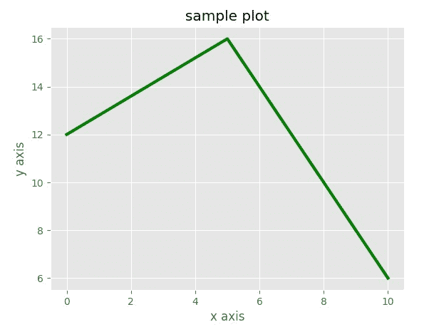
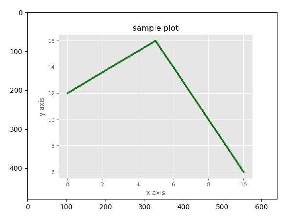
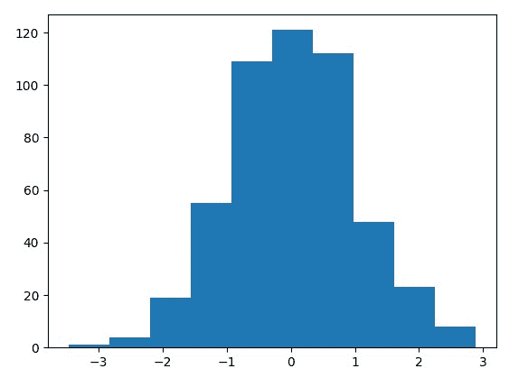
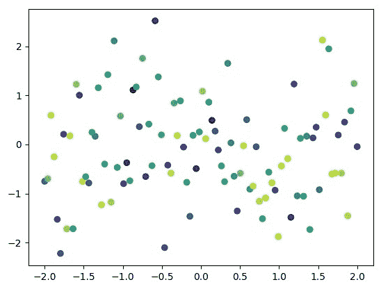
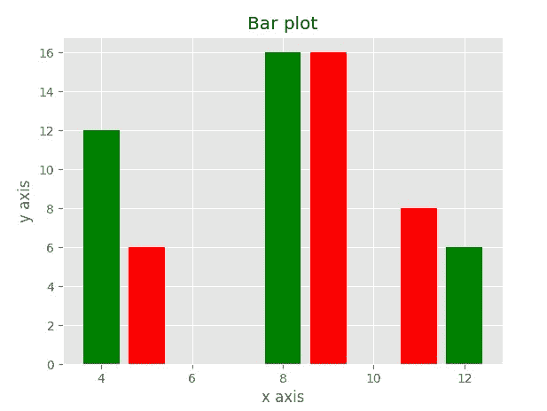
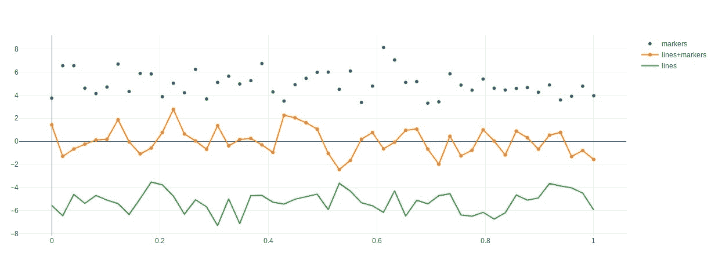
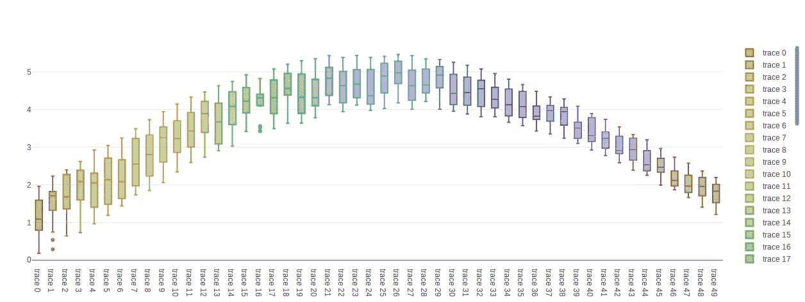
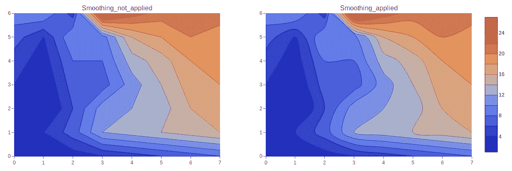

# 统计数据收集和报告

在本章中，您将了解科学计算统计中使用的高级 Python 库。您将学习 Python 的 NumPY、Pandas、Matplotlib 和 Plotly 模块。您将学习数据可视化技术以及如何绘制收集的数据。

在本章中，我们将介绍以下主题：

*   NumPY 模块
*   熊猫模块
*   数据可视化

# NumPY 模块

NumPY 是一个 Python 模块，它提供了对数组的高效操作。NumPY 是使用 Python 进行科学计算的基本包。此包通常用于 Python 数据分析。NumPY 数组是由多个值组成的网格。

通过在终端中运行以下命令来安装 NumPY：

```py
$ pip3 install numpy
```

我们将使用这个`numpy`库在`numpy`阵列上执行操作。现在我们来看看如何创建`numpy`数组。为此，创建一个名为`simple_array.py`的脚本，并在其中编写以下代码：

```py
import numpy as np my_list1 = [1,2,3,4] my_array1 = np.array(my_list1) print(my_list11, type(my_list1))
print(my_array1, type(my_array1))
```

运行脚本，您将获得以下输出：

```py
student@ubuntu:~$ python3 simple_array.py
```

结果如下：

```py
[1, 2, 3, 4] <class 'list'>
[1 2 3 4] <class 'numpy.ndarray'>
```

在前面的示例中，我们将`numpy`库导入为`np`以使用`numpy`功能。然后我们创建了一个简单的列表，我们将其转换为一个数组，并为此使用了**`np.array()`**函数**。**最后，我们打印了带有类型的`numpy`数组，以便于理解普通数组和`numpy`数组。

前面的示例是一维数组。现在我们来看一个多维数组的例子。为此，我们必须创建另一个列表。让我们看另一个例子。创建一个名为`mult_dim_array.py`的脚本，并在其中写入以下内容：

```py
import numpy as np my_list1 = [1,2,3,4] my_list2 = [11,22,33,44] my_lists = [my_list1, my_list2]
my_array = np.array(my_lists)
print(my_lists, type(my_lists)) print(my_array, type(my_array))
```

运行脚本，您将获得以下输出：

```py
student@ubuntu:~$ python3 mult_dim_array.py
```

结果如下：

```py
[[1, 2, 3, 4], [11, 22, 33, 44]] <class 'list'>
[[ 1 2 3 4]
 [11 22 33 44]] <class 'numpy.ndarray'>
```

在前面的示例中，我们导入了`numpy`模块。之后，我们创建了两个列表：`my_list1`和`my_list2`。然后我们制作了另一个列表（`my_list1`和`my_list2`，并在列表（`my_lists`上应用了`np.array()`函数，并将其存储在名为`my_array`的对象中。最后，我们打印了`numpy`阵列。

现在，我们将了解更多可以使用数组执行的操作。我们将研究如何知道我们创建的数组的大小和数据类型；也就是说，`my_array`。为此，我们只需应用`shape()`函数，就可以得到数组的`size`和`dtype()`函数，从而知道我们创建的数组上数组的`data type`。让我们看一个例子。创建一个名为`size_and_dtype.py`的脚本，并在其中写入以下内容：

```py
import numpy as np my_list1 = [1,2,3,4] my_list2 = [11,22,33,44] my_lists = [my_list1,my_list2] my_array = np.array(my_lists) print(my_array) size = my_array.shape print(size) data_type = my_array.dtype print(data_type)
```

运行脚本，您将获得以下输出：

```py
student@ubuntu:~$ python3 size_and_dtype.py
```

结果如下：

```py
[[ 1  2  3  4]
 [11 22 33 44]] (2, 4) int64
```

在前面的示例中，我们应用形状函数`my_array.shape`来获得数组的大小。输出为`(2, 4)`。然后在阵列上应用`dtype`函数作为`my_array.dtype`，输出为`int64`**。**

现在，我们将看一些特殊情况数组的示例。

首先，我们将使用`np.zeros()`函数制作一个全零的数组，如下所示：

```py
student@ubuntu:~$ python3 Python 3.6.7 (default, Oct 22 2018, 11:32:17) [GCC 8.2.0] on linux Type "help", "copyright", "credits" or "license" for more information. >>> import numpy as np >>> np.zeros(5) array([0., 0., 0., 0., 0.]) >>> 
```

制作完全零数组后，我们将使用`numpy`的`np.ones()`函数制作全 1 数组，如下图：

```py
>>> np.ones((5,5)) array([[1., 1., 1., 1., 1.],
 [1., 1., 1., 1., 1.], [1., 1., 1., 1., 1.], [1., 1., 1., 1., 1.], [1., 1., 1., 1., 1.]]) >>> 
```

`np.ones((5,5))`创建一个`5*5`数组，所有值均为`1`。

现在我们将使用`numpy`的`np.empty()`函数制作一个空数组，如下图：

```py
>>> np.empty([2,2]) array([[6.86506982e-317,  0.00000000e+000],
 [6.89930557e-310,  2.49398949e-306]]) >>> 
```

`np.empty()`不像`np.zeros()`函数那样将数组值设置为零。因此，它可能更快。此外，它要求用户在数组中手动输入所有值，因此应谨慎使用。

现在，让我们看看如何使用`np.eye()`函数生成一个标识数组，该数组的对角线值为`1`，如下所示：

```py
>>> np.eye(5) array([[1., 0., 0., 0., 0.],
 [0., 1., 0., 0., 0.], [0., 0., 1., 0., 0.], [0., 0., 0., 1., 0.], [0., 0., 0., 0., 1.]]) >>> 
```

现在我们来看看`range`函数，它使用`numpy`的`np.arange()`函数创建一个数组，如下图：

```py
>>> np.arange(10) array([0, 1, 2, 3, 4, 5, 6, 7, 8, 9]) >>> 
```

`The np.arange(10)`函数创建范围`0-9`的数组。我们定义了范围值`10`，因此数组索引值以`0`开头。

# 使用数组和标量

在本节中，我们将使用`numpy`查看数组上的各种算术运算。为此，首先我们将创建一个多维数组，如下所示：

```py
student@ubuntu:~$ python3 Python 3.6.7 (default, Oct 22 2018, 11:32:17) [GCC 8.2.0] on linux Type "help", "copyright", "credits" or "license" for more information. >>> import numpy as np >>> from __future__ import division >>> arr = np.array([[4,5,6],[7,8,9]]) >>> arr array([[4, 5, 6],
 [7, 8, 9]]) >>> 
```

在这里，我们导入了`numpy`模块来使用`numpy`功能，然后导入了`__future__`模块来处理浮点数。之后，我们创建了一个二维数组`arr`，对其执行各种操作。

现在，让我们看看数组上的一些算术运算。首先，我们将研究数组的乘法，如下所示：

```py
>>> arr*arr array([[16, 25, 36],
 [49, 64, 81]]) >>> 
```

在前面的乘法运算**中，**将`arr`数组相乘两次，得到一个相乘数组。也可以将两个不同的数组相乘。

现在，我们来看看数组上的减法运算，如下所示：

```py
>>> arr-arr array([[0, 0, 0],
 [0, 0, 0]]) >>> 
```

如上例所示，我们只需使用`**-**`操作符对两个数组进行减法。在减去数组之后，我们得到了结果数组，如前面的代码所示。

现在，我们将研究带标量的数组上的算术运算。让我们看看一些操作：

```py
>>> 1 / arr array([[0.25             ,  0.2        ,   0.16666667],
 [0.14285714 ,   0.125     ,  0.11111111]]) >>> 
```

在前面的示例中，我们将`1`除以数组，得到输出。记住，我们导入了`__future__`模块，它实际上对此类操作非常有用，用于处理数组中的浮点值。

现在我们来看看`numpy`数组上的指数运算，如下所示：

```py
>>> arr ** 3 array([[ 64, 125, 216],
 [343, 512, 729]]) >>> 
```

在前面的示例中，我们获取了数组的一个立方体，它将输出作为数组中每个值的立方体。

# 数组索引

数组的索引是使用数组作为索引来完成的。对于索引数组，将返回原始数组的副本。`numpy`可以使用任何其他序列或任何其他数组（元组除外）对数组进行索引。数组中的最后一个元素可以由`-1`索引，第二个最后一个元素可以由`-2`索引，依此类推。

因此，为了对数组执行索引操作，首先我们创建一个新的`numpy`数组，为此我们将使用`range()`函数创建数组，如下所示：

```py
student@ubuntu:~$ python3 Python 3.6.7 (default, Oct 22 2018, 11:32:17) [GCC 8.2.0] on linux Type "help", "copyright", "credits" or "license" for more information. >>> import numpy as np >>> arr = np.arange(0,16) >>> arr array([ 0,  1,  2,  3,  4,  5,  6,  7,  8,  9, 10, 11, 12, 13, 14, 15]) >>> 
```

在前面的示例中，我们创建了范围为`16`的数组`arr`；也就是说，`0-15`。

现在，我们将对数组`arr`执行不同的索引操作。首先，让我们获取数组中特定索引处的值：

```py
>>> arr[7] 7 >>> 
```

在前面的示例中，我们通过索引值访问数组，将索引号传递给数组`arr`后，数组返回值`7`，这是我们传递的特定索引号。

在得到一个特定索引的值之后，我们将得到一个范围内的值。让我们看一下以下示例：

```py
>>> arr[2:10] array([2, 3, 4, 5, 6, 7, 8, 9]) >>> arr[2:10:2] array([2, 4, 6, 8])>>>
```

在前面的示例中，首先我们访问了数组并获得了范围为（`2-10`的值。因此，它将输出显示为`array([2, 3, 4, 5, 6, 7, 8, 9])`。在第二项中，`arr[2:10:2]`实际上表示在两步间隔内访问`2-10`范围内的阵列。这种索引的语法是`arr[_start_value_:_stop_value_:_steps_]`。因此，作为第二项的输出，我们得到`array([2, 4, 6, 8])`。

我们还可以从索引中获取数组中的值，直到结束，如下例所示：

```py
>>> arr[5:] array([ 5,  6,  7,  8,  9, 10, 11, 12, 13, 14, 15]) >>> 
```

正如我们在前面的示例中所看到的，我们从第 5 个索引值到最后访问数组中的值。因此，我们得到的输出为`array([ 5,  6,  7,  8,  9, 10, 11, 12, 13, 14, 15])`。

现在我们来看看`numpy`数组的切片。在切片中，我们实际上获取原始数组的一部分，并将其存储在指定的数组名称中。让我们看一个例子：

```py
>>> arr_slice = arr[0:8] >>> arr_slice array([0, 1, 2, 3, 4, 5, 6, 7]) >>> 
```

在前面的示例中，我们获取原始数组的切片。结果，我们得到了一个值为`0,1,2,…..,7`的数组切片。我们还可以为数组的切片提供更新的值。让我们看一个例子：

```py
>>> arr_slice[:] = 29 >>> arr_slice array([29, 29, 29, 29, 29, 29, 29, 29]) >>> 
```

在前面的示例中，我们将数组切片中的所有值设置为`29,`。但是，在为数组切片赋值时，重要的一点是，分配给切片的值也将被分配给数组的原始集合。

让我们看看给数组切片赋值后的结果以及对原始数组的影响：

```py
>>> arr array([29, 29, 29, 29, 29, 29, 29, 29,  8,  9, 10, 11, 12, 13, 14, 15]) >>>
```

现在，我们来看看另一个操作；也就是说，复制数组。阵列切片和复制的区别在于，当我们对阵列进行切片时，所做的更改将应用于原始阵列。当我们得到数组的副本时，它给出了原始数组的显式副本。因此，应用于阵列副本的更改不会影响原始阵列。让我们看一个复制数组的示例：

```py
>>> cpying_arr = arr.copy() >>> cpying_arr array([29, 29, 29, 29, 29, 29, 29, 29,  8,  9, 10, 11, 12, 13, 14, 15]) >>> 
```

在前面的示例中，我们只获取原始数组的副本。为此，我们使用`array_name.copy()`函数，输出是原始数组的副本。

# 索引二维数组

二维数组是数组的数组。在这种情况下，数据元素的位置通常指两个索引，而不是一个索引，它表示包含数据行和数据列的表。现在我们将对这种类型的数组进行索引。

那么，让我们看一个 2D 阵列的示例：

```py
>>> td_array = np.array(([5,6,7],[8,9,10],[11,12,13])) >>> td_array array([[  5,   6,    7],
 [  8,   9,  10], [11, 12,  13]]) >>> 
```

在前面的示例中，我们创建了一个名为`td_array`的二维数组。创建数组后，我们打印了`td_array`。现在我们还将通过索引获取`td_array`中的值。让我们看一个通过索引访问值的示例：

```py
>>> td_array[1] array([ 8,  9, 10]) >>>
```

在前面的示例中，我们访问了数组的第一个索引值并获得了输出。在这种类型的索引中，当我们访问值时，我们得到整个数组。我们还可以访问特定的值，而不是获取整个数组。让我们看一个例子：

```py
>>> td_array[1,0] 8 >>> 
```

在前面的示例中，我们通过为行和列传递两个值来访问`td_array`。如输出中所示，我们得到了值`8`。

我们也可以用不同的方式设置二维数组。首先，将 2D 数组设置为增加长度。让我们将长度设置为`10`。因此，为此，我们创建一个样本数组，其中包含所有的零，然后，我们将把值放入其中。让我们看一个例子：

```py
>>> td_array = np.zeros((10,10)) >>> td_array array([[0., 0., 0., 0., 0., 0., 0., 0., 0., 0.],
 [0., 0., 0., 0., 0., 0., 0., 0., 0., 0.], [0., 0., 0., 0., 0., 0., 0., 0., 0., 0.], [0., 0., 0., 0., 0., 0., 0., 0., 0., 0.], [0., 0., 0., 0., 0., 0., 0., 0., 0., 0.], [0., 0., 0., 0., 0., 0., 0., 0., 0., 0.], [0., 0., 0., 0., 0., 0., 0., 0., 0., 0.], [0., 0., 0., 0., 0., 0., 0., 0., 0., 0.], [0., 0., 0., 0., 0., 0., 0., 0., 0., 0.], [0., 0., 0., 0., 0., 0., 0., 0., 0., 0.]]) >>> for i in range(10):
 ...     td_array[i] = i ... >>> td_array array([[0., 0., 0., 0., 0., 0., 0., 0., 0., 0.],
 [1., 1., 1., 1., 1., 1., 1., 1., 1., 1.], [2., 2., 2., 2., 2., 2., 2., 2., 2., 2.], [3., 3., 3., 3., 3., 3., 3., 3., 3., 3.], [4., 4., 4., 4., 4., 4., 4., 4., 4., 4.], [5., 5., 5., 5., 5., 5., 5., 5., 5., 5.], [6., 6., 6., 6., 6., 6., 6., 6., 6., 6.], [7., 7., 7., 7., 7., 7., 7., 7., 7., 7.], [8., 8., 8., 8., 8., 8., 8., 8., 8., 8.], [9., 9., 9., 9., 9., 9., 9., 9., 9., 9.]]) >>>
```

在前面的示例中，我们创建了一个长度为`10`乘以`10`的二维数组。

现在，让我们对其进行一些奇特的索引，如以下示例所示：

```py
>>> td_array[[1,3,5,7]] array([[1., 1., 1., 1., 1., 1., 1., 1., 1., 1.],
 [3., 3., 3., 3., 3., 3., 3., 3., 3., 3.], [5., 5., 5., 5., 5., 5., 5., 5., 5., 5.], [7., 7., 7., 7., 7., 7., 7., 7., 7., 7.]]) >>> 
```

在前面的示例中，我们获取特定的索引值。因此，在结果中，我们得到了输出。

# 通用数组函数

通用函数对`numpy`数组中的所有元素执行操作。现在，我们将看一个在一个数组上执行多个通用函数的示例。首先，我们要取数组的平方根。创建一个名为`sqrt_array.py`的脚本，并在其中写入以下内容：

```py
import numpy as np array = np.arange(16) print("The Array is : ",array) Square_root = np.sqrt(array) print("Square root of given array is : ", Square_root)
```

运行脚本，您将获得以下输出：

```py
student@ubuntu:~/work$ python3 sqrt_array.py
```

结果如下：

```py
The Array is : [ 0 1 2 3 4 5 6 7 8 9 10 11 12 13 14 15] Square root of given array is : [0\. 1\. 1.41421356 1.73205081 2\. 2.23606798
 2.44948974 2.64575131 2.82842712 3\. 3.16227766 3.31662479 3.46410162 3.60555128 3.74165739 3.87298335]
```

在前面的示例中，我们使用 range 作为`numpy`的函数创建了一个简单数组。然后我们在生成的数组上应用`sqrt()`函数，以获得数组的平方根。取数组的平方根后，我们将在数组上应用另一个普适函数，即指数`exp()`函数。让我们看一个例子。创建一个名为`expo_array.py`的脚本，并在其中写入以下内容：

```py
import numpy as np array = np.arange(16) print("The Array is : ",array) exp = np.exp(array) print("exponential of given array is : ", exp)
```

运行脚本，您将获得以下输出：

```py
student@ubuntu:~/work$ python3 expo_array.py
```

结果如下：

```py
The Array is :  [ 0  1  2  3  4  5  6  7  8  9 10 11 12 13 14 15] exponential of given array is :  [1.00000000e+00 2.71828183e+00 7.38905610e+00 2.00855369e+01
 5.45981500e+01 1.48413159e+02 4.03428793e+02 1.09663316e+03 2.98095799e+03 8.10308393e+03 2.20264658e+04 5.98741417e+04 1.62754791e+05 4.42413392e+05 1.20260428e+06 3.26901737e+06]
```

在前面的示例中，我们使用`numpy`的`range`函数创建了一个简单数组。然后我们在生成的数组上应用`exp()`函数来获得数组的指数。

# 熊猫模块

在本节中，我们将学习熊猫模块。熊猫模块提供快速灵活的数据结构，用于处理结构化和时间序列数据。熊猫模块用于数据分析。pandas 模块构建在 NumPY 和 Matplotlib 等软件包上，为我们提供了一个在中进行大部分分析和可视化工作的场所。要使用此模块的功能，必须先导入它。

首先，通过运行以下命令安装示例中所需的以下软件包：

```py
$ pip3 install pandas $ pip3 install matplotlib
```

在这里，我们将看一些使用 pandas 模块的示例。我们将学习两种数据结构：Series 和 DataFrames。我们还将了解如何使用 pandas 从`csv`文件中读取数据。

# 系列

熊猫系列是一维阵列。它可以保存任何数据类型。这些标签称为索引。现在，我们将看一个不声明索引的系列和声明索引的系列的示例。首先，我们将看一个不声明索引的序列示例。为此，创建一个名为`series_without_index.py`的脚本，并在其中写入以下内容：

```py
import pandas as pd import numpy as np s_data = pd.Series([10, 20, 30, 40], name = 'numbers') print(s_data)
```

运行脚本，您将获得以下输出：

```py
student@ubuntu:~/work$ python3 series_without_index.py
```

结果如下：

```py
0 10 1 20 2 30 3 40 Name: numbers, dtype: int64
```

在前面的示例中，我们了解了系列，但没有声明索引。首先，我们引进了两个模块：熊猫和`numpy`。接下来，我们创建了将存储序列数据的`s_data`对象。在该系列中，我们创建了一个列表，并没有声明索引，而是提供了 name 属性，该属性将为列表命名，然后打印数据。在输出中，左列是数据的索引。即使我们从不提供索引，熊猫也会隐式地给出它。索引将始终从`0`开始。列下面是系列的名称和值的数据类型。

现在，我们将看一个声明索引时的序列示例。这里我们还将执行索引和切片操作。为此，创建一个名为`series_with_index.py`的脚本，并在其中写入以下内容：

```py
import pandas as pd import numpy as np s_data = pd.Series([10, 20, 30, 40], index = ['a', 'b', 'c', 'd'], name = 'numbers') print(s_data) print() print("The data at index 2 is: ", s_data[2]) print("The data from range 1 to 3 are:\n", s_data[1:3])
```

运行脚本，您将获得以下输出：

```py
student@ubuntu:~/work$ python3 series_with_index.py a    10 b    20 c    30 d    40 Name: numbers, dtype: int64 

The data at index 2 is:  30 The data from range 1 to 3 are:
 b    20 c    30 Name: numbers, dtype: int64
```

在前面的示例中，我们在`index`属性中为数据提供了一个索引值。在输出中，左列是我们提供的索引值。

# 数据帧

在本节中，我们将学习熊猫数据帧。数据帧是具有列的二维标记数据结构，可以是不同的数据类型。数据帧类似于 SQL 表或电子表格。它们是与熊猫一起工作时最常见的对象。

现在，我们来看一个将数据从`csv`文件读入数据帧的示例。为此，您的系统中必须存在`csv`文件。如果您的系统中没有`csv`文件，请创建一个名为`employee.csv`的文件，如下所示：

```py
Id, Name, Department, Country 101, John, Finance, US 102, Mary, HR, Australia 103, Geeta, IT, India 104, Rahul, Marketing, India 105, Tom, Sales, Russia
```

现在，我们将把这个`csv`文件读入一个数据帧。为此，创建一个名为`read_csv_dataframe.py`的脚本，并在其中写入以下内容：

```py
import pandas as pd file_name = 'employee.csv' df = pd.read_csv(file_name) print(df) print() print(df.head(3)) print() print(df.tail(1))
```

运行脚本，您将获得以下输出：

```py
student@ubuntu:~/work$ python3 read_csv_dataframe.py Output:
 Id    Name  Department     Country 0  101    John     Finance          US 1  102    Mary          HR   Australia 2  103   Geeta          IT       India 3  104   Rahul   Marketing       India 4  105     Tom       Sales      Russia 

 Id    Name  Department     Country 0  101    John     Finance          US 1  102    Mary          HR   Australia 2  103   Geeta          IT       India
Id  Name  Department  Country 4  105   Tom       Sales   Russia
```

在前面的示例中，我们首先创建了一个名为`employee.csv`的`csv`文件。我们正在使用 pandas 模块创建数据帧。目标是将该`csv`文件读入数据帧。接下来，我们创建了一个`df`对象，并将`csv`文件的内容读入其中。接下来我们将打印一个数据帧。在这里，我们使用`head()`和`tail()`方法来获得特定数量的数据行。我们指定了`head(3)`，这意味着我们正在打印前三行数据。我们还指定了`tail(1)`，这意味着我们正在打印最后一行数据。

# 数据可视化

数据可视化是一个术语，它描述了理解数据重要性的努力，并以可视化的方式放置数据。在本节中，我们将介绍以下数据可视化技术：

*   Matplotlib
*   阴谋地

# Matplotlib

Matplotlib 是 Python 中的数据可视化库，它允许我们使用几行代码生成绘图、直方图、功率谱、条形图、误差图、散点图等。Matplotlib 通常使事情变得更容易，使最困难的事情成为可能。

要在 Python 程序中使用`matplotlib`，首先我们必须安装`matplotlib`。在您的终端中运行以下命令安装`matplotlib:`

```py
$ pip3 install matplotlib
```

现在，您必须再安装一个用于图形表示的软件包`tkinter`。使用以下命令安装它：

```py
$ sudo apt install python3-tk
```

既然`matplotlib`已安装在您的系统中，我们将看一些示例。打印时，有两个重要组件：图形和轴。图形是一个容器，充当绘制所有内容的窗口。它可以有各种类型的独立图形。轴是可以打印数据和与其关联的任何标签的区域。轴包括一个`x`轴和一个`y`轴。

现在，我们来看看`matplotlib`的一些例子。让我们从一个简单的例子开始。创建一个名为`simple_plot.py`的脚本，并在其中写入以下内容：

```py
import matplotlib.pyplot as plt import numpy as np x = np.linspace(0, 5, 10) y = x**2 plt.plot(x,y) plt.title("sample plot") plt.xlabel("x axis") plt.ylabel("y axis") plt.show()
```

运行脚本，您将获得以下输出：

```py
student@ubuntu:~/work$ python3 simple_plot.py
```

结果如下：


在前面的示例中，我们导入了两个模块`matplotlib`和`numpy`，分别用于可视化数据和创建阵列*x*和*y*。在此之后，我们绘制了两个数组作为`plt.plot(x,y)`。然后我们使用`xlabel()`、`ylabel()`和`title()`功能向绘图添加标题和标签，为了显示此绘图，我们使用`plt.show()`功能。因为我们在 Python 脚本中使用 Matplotlib，所以不要忘记在最后一行添加`plt.show()`以显示绘图。

现在我们将创建两个数组来显示绘图中的两条曲线，并将样式应用于两条曲线。在下面的示例中，我们将使用`ggplot`样式来绘制图形。`ggplot`是一个用于以声明方式创建图形的系统，它基于图形语法。为了绘制`ghraph`，我们只需提供数据，然后告诉`ggplot`如何映射变量以及使用什么图形原语，它会处理细节。在大多数情况下，我们从`ggplot()`风格开始。

现在，创建一个名为`simple_plot2.py`的脚本，并在其中写入以下内容：

```py
import matplotlib.pyplot as plt from matplotlib import style style.use('ggplot') x1 = [0,5,10]
y1 = [12,16,6] x2 = [6,9,11] y2 = [6,16,8] plt.subplot(2,1,1) plt.plot(x1, y1, linewidth=3) plt.title("sample plot") plt.xlabel("x axis") plt.ylabel("y axis") plt.subplot(2,1,2) plt.plot(x2, y2, color = 'r', linewidth=3) plt.xlabel("x2 axis") plt.ylabel("y2 axis") plt.show()
```

运行脚本，您将获得以下输出：

```py
student@ubuntu:~/work$ python3 simple_plot2.py
```

结果如下：


在前面的示例中，我们首先导入了所需的模块，然后使用`ggplot`样式绘制图形；即`x1`、`y1`和`x2`、`y2`。然后我们使用了子绘图函数`plt.subplot()`，因为它允许我们在同一画布中绘制不同的东西。如果要在不同的画布上显示这两个绘图，也可以使用`plt.figure()`功能而不是`plt.subplot(),`。

现在，我们将看到如何使用`plt.figure()`函数绘制阵列，并使用 Matplotlib 保存生成的图形。您可以使用`savefig()`方法以不同格式保存，如`png`、`jpg`、`pdf`等。我们将前面的图保存在名为`my_sample_plot.jpg`的文件中。现在，我们来看一个例子。为此，创建一个名为`simple_plot3.py`的脚本，并在其中写入以下内容：

```py
import matplotlib.pyplot as plt from matplotlib import style style.use('ggplot') x1 = [0,5,10] y1 = [12,16,6] x2 = [6,9,11] y2 = [6,16,8] plt.figure(1) plt.plot(x1, y1, color = 'g', linewidth=3) plt.title("sample plot") plt.xlabel("x axis") plt.ylabel("y axis") plt.savefig('my_sample_plot1.jpg') plt.figure(2) plt.plot(x2, y2, color = 'r', linewidth=3) plt.xlabel("x2 axis") plt.ylabel("y2 axis") plt.savefig('my_sample_plot2.jpg') plt.show()
```

运行脚本，您将获得以下输出：

```py
student@ubuntu:~/work$ python3 simple_plot3.py
```

结果如下：



在前面的例子中，我们使用`plt.figure()`函数在不同的画布上绘制东西。之后，我们使用`plt.plot()`函数。此函数具有不同的参数，这些参数对于绘制图形非常有用。在前面的例子中，我们使用了一些参数；即`x1`、`x2`、`y1`和`y2`，这些分别是用于绘制的轴点。

然后我们使用`color`参数为图形线提供特定的颜色，在第三个参数中，我们使用`linewidth`，它决定图形线的宽度。之后，我们还使用了`savefig()`方法将我们的图形保存为特定的图像格式。您可以在运行 Python 脚本的当前目录（如果没有提到路径）中检查它们。

您可以通过直接访问该目录打开这些图像，也可以使用以下方法使用`matplotlib`打开生成的图像。现在，我们来看一个打开保存的图形的示例。为此，创建一个名为`open_image.py`的脚本，并在其中写入以下内容：

```py
import matplotlib.pyplot as plt import matplotlib.image as mpimg plt.imshow(mpimg.imread('my_sample_plot1.jpg')) plt.show()
```

运行脚本，您将获得以下输出：

```py
student@ubuntu:~/work$ python3 open_image.py
```

结果如下：



在前面的示例中，我们使用 Matplotlib 的`imshow()`函数打开图形的保存图像。

现在，我们来看看不同类型的情节。Matplotlib 允许我们创建不同类型的图来处理数组中的数据，如直方图、散点图、条形图等。不同类型图的使用取决于数据可视化的目的。让我们看看其中的一些情节。

# 直方图

这种类型的图有助于我们检查数值数据的分布，这样你就无法单独使用均值或中位数。我们将使用`hist()`方法创建一个简单的直方图。让我们看一个创建简单直方图的示例。为此，创建一个名为`histogram_example.py`的脚本，并在其中写入以下内容：

```py
import matplotlib.pyplot as plt import numpy as np x = np.random.randn(500) plt.hist(x) plt.show()
```

运行脚本，您将获得以下输出：

```py
student@ubuntu:~/work$ python3 histogram_example.py
```

结果如下：



在前面的示例中，我们使用`numpy`创建了一个随机数数组。然后我们使用`plt.hist()`方法绘制数值数据。

# 散点图

这种类型的绘图将数据显示为点的集合。它提供了一种方便的方式来可视化数值之间的关系。它还帮助我们理解多个变量之间的关系。我们将使用`scatter()`方法在散点图中绘制数据。在散点图中，点的位置取决于其`x`和`y`轴值；也就是说，是二维值，因此数据集中的每个值都是水平或垂直维度中的一个位置。让我们看一个散点图的例子。创建一个名为`scatterplot_example.py`的脚本，并在其中写入以下内容：

```py
import matplotlib.pyplot as plt import numpy as np x = np.linspace(-2,2,100) y = np.random.randn(100) colors = np.random.rand(100) plt.scatter(x,y,c=colors) plt.show()
```

运行脚本，您将获得以下输出：

```py
student@ubuntu:~/work$ python3 scatterplot_example.py
```

结果如下：



在前面的例子中，我们得到了`x`和`y`的值。然后我们使用`plt.scatter()`方法绘制这些值，以获得`x`和`y`值的散点图。

# 条形图

条形图是用矩形条表示数据的图表。可以垂直或水平打印它们。创建一个名为`bar_chart.py`的脚本，并在其中写入以下内容：

```py
import matplotlib.pyplot as plt from matplotlib import style style.use('ggplot') x1 = [4,8,12] y1 = [12,16,6] x2 = [5,9,11] y2 = [6,16,8] plt.bar(x1,y1,color = 'g',linewidth=3) plt.bar(x2,y2,color = 'r',linewidth=3) plt.title("Bar plot") plt.xlabel("x axis") plt.ylabel("y axis") plt.show()
```

运行脚本，您将获得以下输出：

```py
student@ubuntu:~/work$ python3 bar_chart.py
```

结果如下：



在前面的示例中，我们有两组值：`x1`、`y1`和`x2`、`y2`。在获得数值数据后，我们使用`plt.bar()`方法绘制当前数据的条形图。

有多种技术可用于绘制数据。其中，有几种使用`matplotlib`的数据可视化技术或方法，我们已经看到了。我们还可以使用另一种数据可视化工具`plotly`执行此类操作。

# 阴谋地

Plotly 是 Python 中的一个交互式开源图形库。它是一个图表库，提供 30 多种图表类型，如科学图表、3D 图表、统计图表、金融图表等。

要在 Python 中使用`plotly`，首先我们必须在系统中安装它。要安装`plotly`，请在终端中运行以下命令：

```py
$ pip3 install plotly
```

我们可以在线和离线使用`plotly`。对于在线使用，您需要有一个`plotly`帐户，然后您需要用 Python 设置您的凭据：

```py
 plotly.tools.set_credentials_file(username='Username', api_key='APIkey')
```

离线使用`plotly`需要使用`plotly`功能：`plotly.offline.plot()`

在本节中，我们将使用 plotly offline。现在，我们来看一个简单的例子。为此，创建一个名为`sample_plotly.py`的脚本，并在其中写入以下内容：

```py
import plotly from plotly.graph_objs import Scatter, Layout plotly.offline.plot({
 "data": [Scatter(x=[1, 4, 3, 4], y=[4, 3, 2, 1])], "layout": Layout(title="plotly_sample_plot") })
```

将前面的脚本作为`sample_plotly.py`运行。您将获得以下输出：

```py
student@ubuntu:~/work$ python3 sample_plotly.py
```

结果如下：


在前面的示例中，我们导入了`plotly`模块，然后将`plotly`设置为脱机使用。我们在里面放了参数，这对绘制图表很有用。在这个例子中，我们使用了一些参数：`data`和`layout`。在`data`参数中，我们使用`x`和`y`数组定义散射函数，这两个数组的值分别绘制在`x`和`y`轴上。然后，我们使用`layout`参数，在该参数中，我们定义布局函数来提供图形的标题。前面程序的输出保存为 HTML 文件，并在默认浏览器中打开。此 HTML 文件与脚本位于同一目录中。

现在，让我们看一些不同类型的图表来可视化数据。首先，我们从散点图开始。

# 散点图

创建一个名为`scatter_plot_plotly.py`的脚本，并在其中写入以下内容：

```py
import plotly import plotly.graph_objs as go import numpy as np  x_axis = np.random.randn(100) y_axis = np.random.randn(100)  trace = go.Scatter(x=x_axis, y=y_axis, mode = 'markers') data_set = [trace] plotly.offline.plot(data_set, filename='scatter_plot.html')
```

运行脚本，您将获得以下输出：

```py
student@ubuntu:~/work$ python3 scatter_plot_plotly.py
```

结果如下：


在前面的示例中，我们导入了`plotly`，然后使用`numpy`创建了随机数据，为此，我们在脚本中导入了`numpy`模块。生成数据集后，我们创建了一个名为`trace`的对象，并将我们的数字数据插入其中以分散。最后，我们将`trace`对象中的数据放入`plotly.offline.plot()`函数中，得到数据的散点图。与我们的第一个示例图一样，本示例的输出也以 HTML 格式保存并显示在默认的 web 浏览器中。

# 线散点图

我们还可以创建一些更具信息性的图，例如线散点图。让我们看一个例子。创建一个名为`line_scatter_plot.py`的脚本，并在其中写入以下内容：

```py
import plotly import plotly.graph_objs as go import numpy as np x_axis = np.linspace(0, 1, 50) y0_axis = np.random.randn(50)+5 y1_axis = np.random.randn(50) y2_axis = np.random.randn(50)-5 trace0 = go.Scatter(x = x_axis,y = y0_axis,mode = 'markers',name = 'markers') trace1 = go.Scatter(x = x_axis,y = y1_axis,mode = 'lines+markers',name = 'lines+markers') trace2 = go.Scatter(x = x_axis,y = y2_axis,mode = 'lines',name = 'lines') data_sets = [trace0, trace1, trace2] plotly.offline.plot(data_sets, filename='line_scatter_plot.html')
```

运行脚本，您将获得以下输出：

```py
student@ubuntu:~/work$ python3 line_scatter_plot.py
```

结果如下：



在前面的示例中，我们导入了`plotly`以及`numpy`模块。然后我们为 x 轴和三个不同的 y 轴生成了一些随机值。之后，我们将该数据放入创建的`trace`对象中，最后将该数据集放入 plotly 的脱机函数中。然后我们以散点和直线的形式得到输出。本例的输出文件以名称`line_scatter_plot.html`保存在当前目录中。

# 方框图

方框图通常提供信息，也很有用，尤其是当您有太多的数据要用很少的数据来显示时。让我们看一个例子。创建一个名为`plotly_box_plot.py`的脚本，并在其中写入以下内容：

```py
import random import plotly from numpy import * N = 50. c = ['hsl('+str(h)+',50%'+',50%)' for h in linspace(0, 360, N)] data_set = [{
 'y': 3.5*sin(pi * i/N) + i/N+(1.5+0.5*cos(pi*i/N))*random.rand(20), 'type':'box', 'marker':{'color': c[i]} } for i in range(int(N))] layout = {'xaxis': {'showgrid':False,'zeroline':False, 'tickangle':45,'showticklabels':False},
 'yaxis': {'zeroline':False,'gridcolor':'white'}, 'paper_bgcolor': 'rgb(233,233,233)', 'plot_bgcolor': 'rgb(233,233,233)', } plotly.offline.plot(data_set)
```

运行脚本，您将获得以下输出：

```py
student@ubuntu:~/work$ python3 plotly_box_plot.py
```

结果如下：



在前面的示例中，我们导入了`plotly`以及`numpy`模块。然后，我们在方框图中声明 N 为方框总数，并通过固定颜色 HSL 表示的饱和度和亮度并围绕色调行进，生成彩虹颜色数组。每个框由包含数据、类型和颜色的字典表示。我们使用列表理解来描述 N 个框，每个框具有不同的颜色和不同的随机生成的数据。之后，我们格式化输出布局，并通过离线`plotly`功能绘制数据。

# 等高线图

等高线图是最常用的科学图，在显示热图数据时经常使用。让我们看一个等高线图的示例。创建一个名为`contour_plotly.py`的脚本，并在其中写入以下内容：

```py
from plotly import tools import plotly import plotly.graph_objs as go trace0 = go.Contour(
 z=[[1, 2, 3, 4, 5, 6, 7, 8], [2, 4, 7, 12, 13, 14, 15, 16], [3, 1, 6, 11, 12, 13, 16, 17], [4, 2, 7, 7, 11, 14, 17, 18], [5, 3, 8, 8, 13, 15, 18, 19], [7, 4, 10, 9, 16, 18, 20, 19], [9, 10, 5, 27, 23, 21, 21, 21]], line=dict(smoothing=0), ) trace1 = go.Contour(
 z=[[1, 2, 3, 4, 5, 6, 7, 8], [2, 4, 7, 12, 13, 14, 15, 16], [3, 1, 6, 11, 12, 13, 16, 17], [4, 2, 7, 7, 11, 14, 17, 18], [5, 3, 8, 8, 13, 15, 18, 19], [7, 4, 10, 9, 16, 18, 20, 19], [9, 10, 5, 27, 23, 21, 21, 21]], line=dict(smoothing=0.95), ) data = tools.make_subplots(rows=1, cols=2,
 subplot_titles=('Smoothing_not_applied', 'smoothing_applied')) data.append_trace(trace0, 1, 1) data.append_trace(trace1, 1, 2) plotly.offline.plot(data)
```

运行脚本，您将获得以下输出：

```py
student@ubuntu:~/work$ python3 contour_plotly.py This is the format of your plot grid: [ (1,1) x1,y1 ]  [ (1,2) x2,y2 ]
```

结果如下：



在前面的示例中，我们获取了一个数据集并对其应用了`contour()`函数。然后我们在`data_set`中添加该等高线数据，最后对数据应用`plotly`函数以获得输出。这些是从绘图到以可视化方式绘制数据的一些技术。

# 总结

在本章中，我们学习了 NumPY 和 Pandas 模块，以及数据可视化技术。在 NumPY 模块一节中，我们学习了数组的索引和切片以及通用数组函数。在熊猫模块部分，我们学习了系列和数据帧。我们还学习了如何将`csv`文件读入数据帧。在数据可视化方面，我们学习了 Python 中用于数据可视化的库：`matplotlib`和`plotly`。

在下一章中，您将了解 MySQL 和 SQLite 数据库管理。

# 问题

1.  什么是 NumPy 阵列？
2.  以下代码段的输出是什么？

```py
import numpy as np
# input array
in_arr1 = np.array([[ 1, 2, 3], [ -1, -2, -3]] )
print ("1st Input array : \n", in_arr1) 
in_arr2 = np.array([[ 4, 5, 6], [ -4, -5, -6]] )
print ("2nd Input array : \n", in_arr2) 
# Stacking the two arrays horizontally
out_arr = np.hstack((in_arr1, in_arr2))
print ("Output stacked array :\n ", out_arr)
```

3.  如何使一个小数组的求和速度比`np.sum`快
4.  如何从数据帧中删除索引、行或列？
5.  如何将数据帧写入文件？
6.  熊猫中的“南”是什么？
7.  如何从数据帧中删除重复项？
8.  如何更改使用 Matplotlib 绘制的地物的大小？
9.  使用 Python 绘制图形的备选方案有哪些？

# 进一步阅读

*   10 分钟后提交文件：[https://pandas.pydata.org/pandas-docs/stable/](https://pandas.pydata.org/pandas-docs/stable/)
*   NumPy 教程：[https://docs.scipy.org/doc/numpy/user/quickstart.html](https://docs.scipy.org/doc/numpy/user/quickstart.html)
*   使用 plotly 进行图形绘制：[https://plot.ly/d3-js-for-python-and-pandas-charts/](https://plot.ly/d3-js-for-python-and-pandas-charts/)