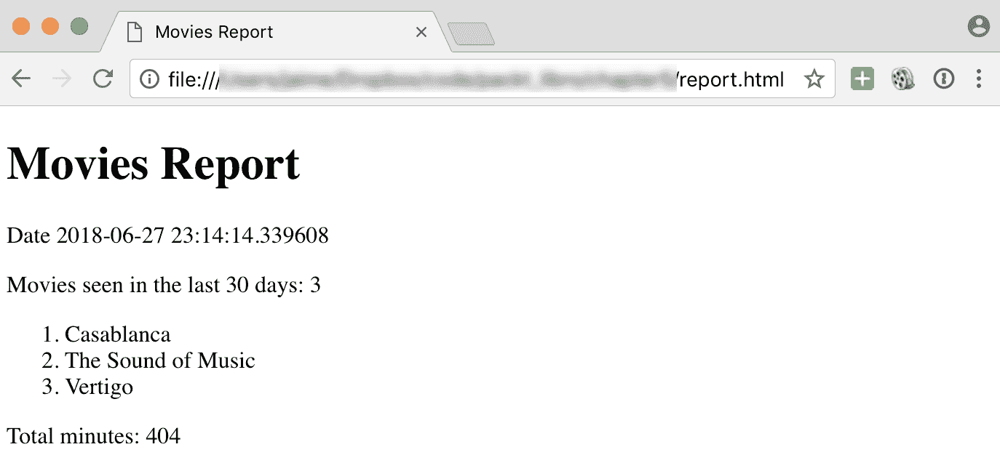
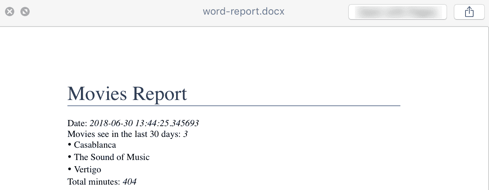
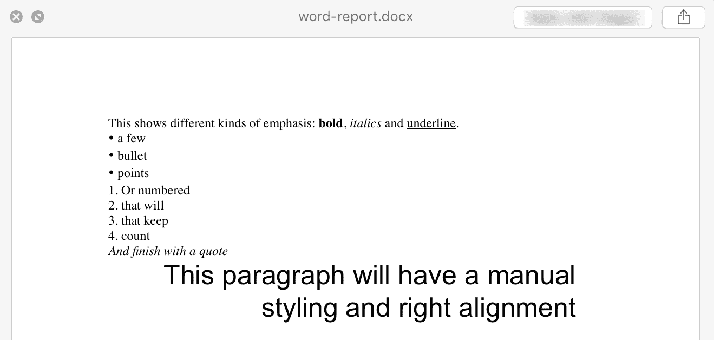
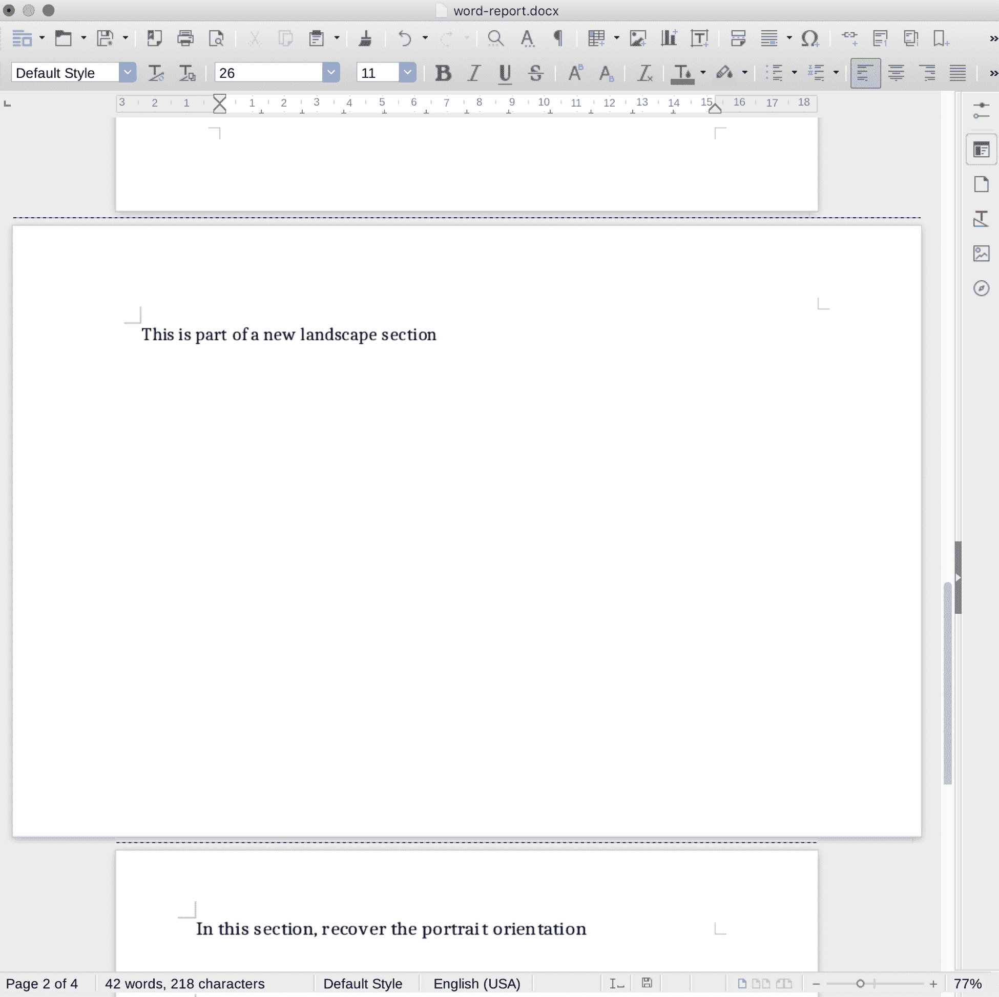
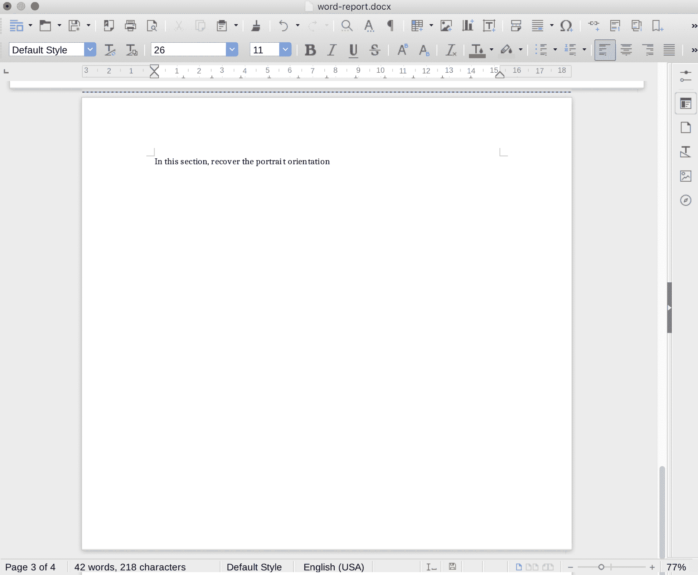
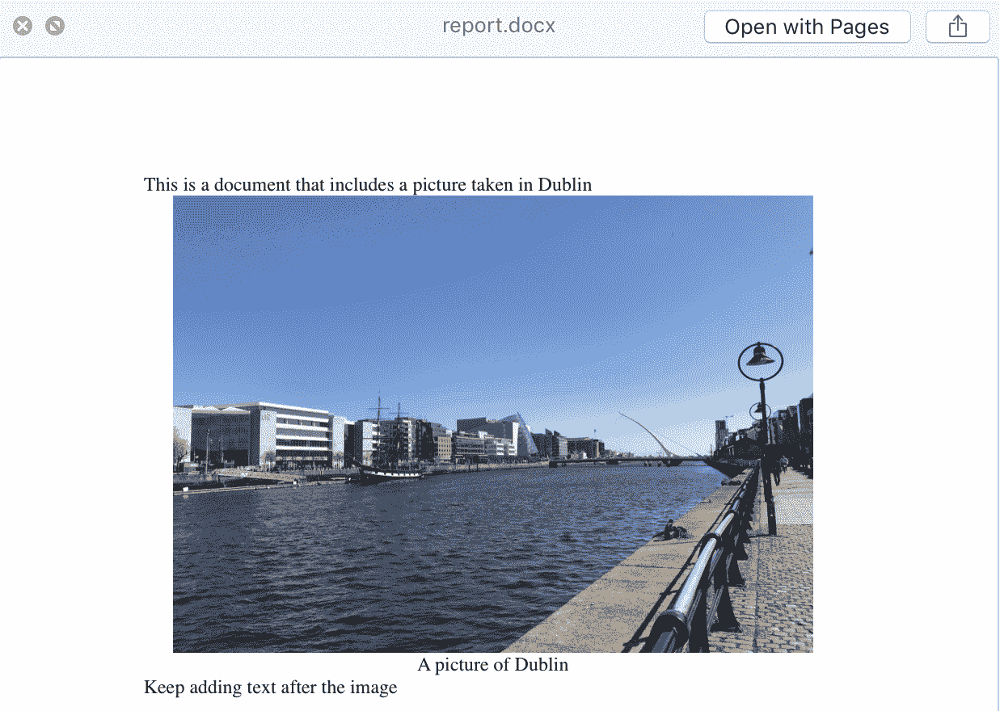
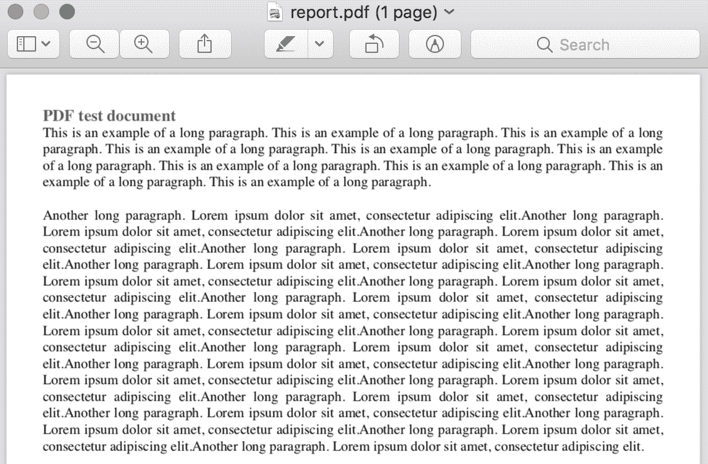
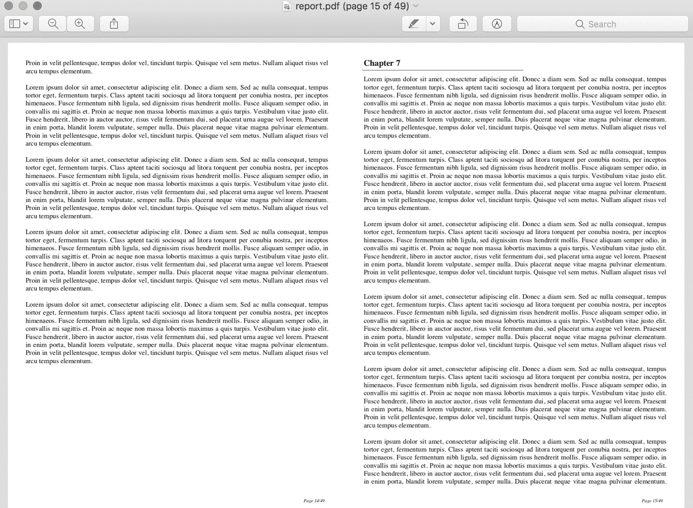
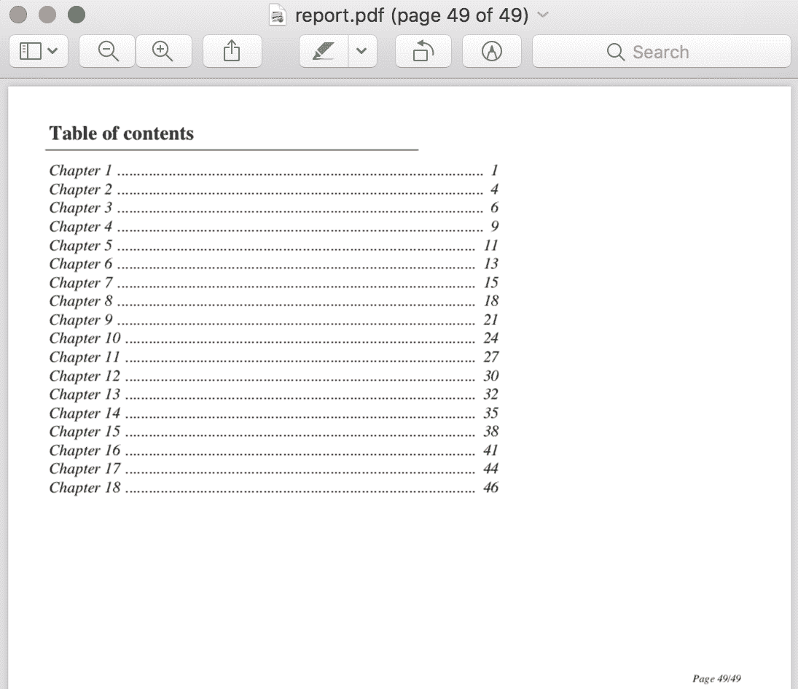
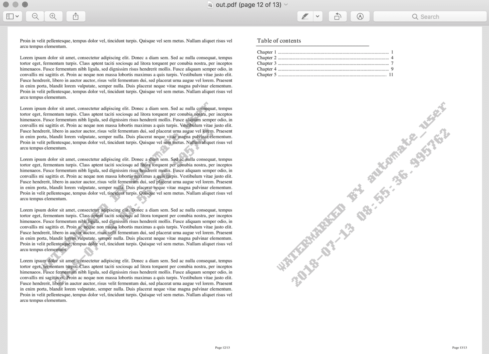

# 五、生成精彩的报告

在本章中，我们将介绍以下配方：

*   创建简单的纯文本报告
*   对报告使用模板
*   在标记中格式化文本
*   编写基本 Word 文档
*   设置 Word 文档的样式
*   Word 文档中的生成结构
*   向 Word 文档添加图片
*   编写简单的 PDF 文档
*   构建 PDF
*   聚合 PDF 报告
*   PDF 文档的水印和加密

# 介绍

在本章中，我们将了解如何编写文档和执行基本操作，例如处理不同格式的模板，例如纯文本和标记。我们将把大部分时间花在常见、有用的格式上，如 Word 和 PDF。

# 创建简单的纯文本报告

最简单的报告是生成一些文本并将其存储在文件中。

# 准备

对于这个配方，我们将生成一个文本格式的简要报告。要存储的数据将保存在字典中。

# 怎么做。。。

1.  进口`datetime`：

```py
>>> from datetime import datetime
```

2.  使用文本格式的报告创建模板：

```py
>>> TEMPLATE = '''
Movies report
-------------

Date: {date}
Movies seen in the last 30 days: {num_movies}
Total minutes: {total_minutes}
'''
```

3.  创建一个包含要存储的值的字典。注意：这是报告中将要呈现的数据：

```py
>>> data = {
    'date': datetime.utcnow(),
 'num_movies': 3,
    'total_minutes': 376,
}
```

4.  撰写报告，将数据添加到模板中：

```py
>>> report = TEMPLATE.format(**data)
```

5.  使用当前日期创建新文件并存储报告：

```py
>>> FILENAME_TMPL = "{date}_report.txt"
>>> filename = FILENAME_TMPL.format(date=data['date'].strftime('%Y-%m-%d'))
>>> filename
2018-06-26_report.txt
>>> with open(filename, 'w') as file:
...     file.write(report)
```

6.  检查新创建的报告：

```py
$ cat 2018-06-26_report.txt

Movies report
-------------

Date: 2018-06-26 23:40:08.737671
Movies seen in the last 30 days: 3
Total minutes: 376
```

# 它是如何工作的。。。

*如何做…*部分中的步骤 2 和 3 设置了一个简单的模板，并添加了一个包含报告中所有数据的字典。然后，在步骤 4 中，将这两种情况合并到一个特定的报告中。

In step 4, the dictionary is combined with a template. Notice that the keys on the dictionary correspond to the parameters on the template. The trick is to use the double star in the `format` call to decompress the dictionary, passing each of the keys as a parameter to `format()`.

在步骤 5 中，使用`with`上下文管理器将生成的报告（字符串）存储在新创建的文件中。`open()`函数创建一个新文件，如打开模式`w`中所述，并在块期间保持打开状态，将数据写入文件。退出块时，文件将正确关闭。

The open modes determine how to open a file, whether it is to read or write, and whether the file is in text or binary. The `w` mode opens the file to write it, overwriting it if it already exists. Be careful to not to delete an existing file by mistake!

步骤 6 检查文件是否已使用正确的数据创建。

# 还有更多。。。

文件名是用今天的日期创建的，以最大限度地减少覆盖值的可能性。已选择日期的格式，以年开始，以日结束，因此文件会按正确的顺序自然排序。

即使出现异常，`with`上下文管理器也会关闭该文件。如果存在异常，则会引发`IOError`异常。

Some of the common exceptions in writing could be a problem with permissions, a full hard drive, or a path problem (for instance, trying to write in a non-existent directory). 

请注意，文件在关闭或显式刷新之前可能不会完全提交到磁盘。一般来说，在处理文件时，这不是问题，但如果尝试打开一个文件两次，一次用于读取，一次用于写入，则需要记住这一点。

# 另见

*   *使用报表模板*配方
*   减价配方中的*格式化文本*
*   *聚合 PDF 报告*配方

# 对报告使用模板

HTML 是一种非常灵活的格式，可用于显示丰富的报告。虽然 HTML 模板可以通过将其视为文本来创建，但有一些工具允许您添加对结构化文本的更好处理。这也将模板与代码分离，将数据的生成与数据的表示分离。

# 准备

此配方中使用的工具 Jinja2 读取包含模板的文件并将上下文应用于该模板。上下文包含要显示的数据。

我们应该从安装模块开始：

```py
$ echo "jinja2==2.20" >> requirements.txt
$ pip install -r requirements.txt
```

Jinja2 使用自己的语法，它是 HTML 和 Python 的混合体。它针对 HTML 文档，因此可以轻松执行诸如正确转义特殊字符等操作。

在 GitHub 存储库中，我们包含了一个名为`jinja_template.html`的模板文件，其中包含要使用的模板。

# 怎么做。。。

1.  进口金甲 2`Template`和`datetime`：

```py
>>> from jinja2 import Template
>>> from datetime import datetime
```

2.  将模板从文件读入内存：

```py
>>> with open('jinja_template.html') as file:
...     template = Template(file.read())
```

3.  使用要显示的数据创建上下文：

```py
>>> context = {
    'date': datetime.now(),
    'movies': ['Casablanca', 'The Sound of Music', 'Vertigo'],
    'total_minutes': 404,
}
```

4.  呈现模板并写入新文件`report.html`，结果如下：

```py
>>> with open('report.html', 'w') as file:
...    file.write(template.render(context))
```

5.  在浏览器中打开`report.html`文件：



# 它是如何工作的。。。

*如何做…*部分中的步骤 2 和 4 非常简单：他们阅读模板并保存结果报告。

如步骤 3 和 4 所示，主要任务是创建一个上下文字典，其中包含要显示的信息。然后模板呈现该信息，如步骤 5 所示。让我们来看一看：

```py
<!DOCTYPE html>
<html lang="en">
<head>
    <title> Movies Report</title>
</head>
<body>
    <h1>Movies Report</h1>
    <p>Date {{date}}</p>
    <p>Movies seen in the last 30 days: {{movies|length}}</p>
    <ol>
        
        <li>{{movie}}</li>
        
    </ol>
    <p>Total minutes: {{total_minutes}} </p>
</body>
</html>
```

它的大部分内容是替换花括号中定义的上下文值，例如`{{total_minutes}}`

注意标签` / `，它定义了一个循环。这允许基于 Python 的赋值生成多行或多个元素。

过滤器可以应用于变量以修改它们。在这种情况下，`length`过滤器应用于`movies`列表，以使用管道符号获取尺寸，如`{{movies|length}}`所示。

# 还有更多。。。

除了``标记之外，还有一个``标记，允许它有条件地显示：

```py

  Wow, so many movies this month!

  Regular number of movies

```

已经定义了很多过滤器（请参见此处的完整列表：[http://jinja.pocoo.org/docs/2.10/templates/#list-内置过滤器的数量](http://jinja.pocoo.org/docs/2.10/templates/#list-of-builtin-filters)。但是，也可以定义自定义的。

Note that you can add a lot of processing and logic to the template using filters. While a little bit is fine, try to limit the amount of logic in the template. Most of the calculations for data to be displayed should be done before, leaving the template to just display values. This makes the context very straightforward and simplifies the template, allowing for changes.

处理 HTML 文件时，最好自动转义变量。这意味着有意义的字符（例如，`<`字符）将被等价的 HTML 代码替换，以便在 HTML 页面上正确显示。为此，请使用`autoescape`参数创建模板。请在此处检查差异：

```py
>>> Template('{{variable}}', autoescape=False).render({'variable': '<'})
'<'
>>> Template('{{variable}}', autoescape=True).render({'variable': '<'})
'<'
```

可以使用`e`过滤器对每个变量应用转义（意思是*转义*），而不使用`safe`过滤器（意思是*按照*的原样渲染是安全的）。

Jinja2 模板是可扩展的，这意味着您可以创建一个`base_template.html`，然后对其进行扩展，从而更改某些元素。您还可以包括其他文件，对不同的部分进行分区和分隔。有关更多详细信息，请参阅完整文档。

Jinja2 is very powerful and allows us to create complex HTML templates, and also in other formats such as LaTeX or JavaScript, though this requires configuring. I encourage you to read the whole documentation and have a look at all its capabilities! 

整个 Jinja2 文档可在此处找到：[http://jinja.pocoo.org/docs/2.10/.](http://jinja.pocoo.org/docs/2.10/)

# 另见

*   *创建简单的纯文本报告*配方
*   减价配方中的*格式化文本*

# 在标记中格式化文本

**Markdown**是一种非常流行的标记语言，用于创建可转换为样式化 HTML 的原始文本。这是一种很好的结构化文档的方法，它可以以原始文本格式读取文档，同时能够以 HTML 格式正确设置文档的样式

在本教程中，我们将看到如何使用 Python 将标记文档转换为样式化 HTML。

# 准备

我们应该从安装`mistune`模块开始，该模块将把降价文档编译成 HTML：

```py
$ echo "mistune==0.8.3" >> requirements.txt
$ pip install -r requirements.txt
```

在 GitHub 存储库中，有一个名为`markdown_template.md`的模板文件，其中包含要生成的报告模板

# 怎么做。。。

1.  进口`mistune`和`datetime`：

```py
>>> import mistune
```

2.  从文件中读取模板：

```py
>>> with open('markdown_template.md') as file:
...     template = file.read()
```

3.  设置要包含在报告中的数据的上下文：

```py
context = {
    'date': datetime.now(),
    'pmovies': ['Casablanca', 'The Sound of Music', 'Vertigo'],
    'total_minutes': 404,
}
```

4.  由于电影需要显示为项目符号，我们将列表转换为适当的降价项目符号列表。此外，我们还存储电影的数量：

```py
>>> context['num_movies'] = len(context['pmovies'])
>>> context['movies'] = '\n'.join('* {}'.format(movie) for movie in context['pmovies'])
```

5.  呈现模板并将结果标记编译为 HTML：

```py
>>> md_report = template.format(**context)
>>> report = mistune.markdown(md_report)
```

6.  最后，将生成的报告存储在`report.html`文件中：

```py
>>> with open('report.html', 'w') as file:
...    file.write(report)
```

7.  在浏览器中打开`report.html`文件检查结果：


# 它是如何工作的。。。

*如何…*部分中的步骤 2 和 3 准备模板和要显示的数据。在步骤 4 中，额外的信息生成电影的数量，这是从`movies`元素派生出来的。然后将`movies`元素从 Python 列表转换为有效的标记元素。注意新行和首字母`*`，它将被渲染为一个项目符号：

```py
>>> '\n'.join('* {}'.format(movie) for movie in context['pmovies'])
'* Casablanca\n* The Sound of Music\n* Vertigo'
```

在步骤 5 中，模板以降价格式生成。这种原始形式的格式可读性很强，这是降价的优点：

```py
Movies Report
=======

Date: 2018-06-29 20:47:18.930655

Movies seen in the last 30 days: 3

* Casablanca
* The Sound of Music
* Vertigo

Total minutes: 404
```

然后，在步骤 6 中，使用`mistune`将报告转换为 HTML 并存储在文件中。

# 还有更多。。。

学习降价是非常有用的，因为许多常见的网页都支持降价，这是一种支持文本输入的方法，这种输入很容易，并且可以呈现为样式化的格式。例如 GitHub、堆栈溢出和大多数博客平台。

There is actually more than one kind of Markdown. This is because the official definition was limited or ambiguous, and there was no interest in clarifying or standardizing it. This led to several implementations that are sightly different, such as GitHub Flavoured Markdown, MultiMarkdown, and CommonMark.

Markdown 中的文本可读性很强，但如果您需要以交互方式查看它的外观，您可以使用位于[的 Dillinger 在线编辑器 https://dillinger.io/](https://dillinger.io/) 。

`Mistune`此处提供完整单据：[http://mistune.readthedocs.io/en/latest/.](http://mistune.readthedocs.io/en/latest/)

完整的降价语法可在[中找到 https://daringfireball.net/projects/markdown/syntax](https://daringfireball.net/projects/markdown/syntax) 和[中使用最多元素的良好备忘单 https://beegit.com/markdown-cheat-sheet.](https://beegit.com/markdown-cheat-sheet)

# 另见

*   *在疼痛文本*配方中创建简单报告
*   *使用报表模板*配方

# 编写基本 Word 文档

Microsoft Office 是最常见的软件之一，尤其是 MS Word 几乎是事实上的文档标准。使用自动化脚本可以生成`docx`文档，这将有助于以在许多业务中易于阅读的格式分发报告。

在本教程中，我们将学习如何生成完整的 Word 文档。

# 准备

我们将使用`python-docx`模块处理 Word 文档：

```py
>>> echo "python-docx==0.8.6" >> requirements.txt
>>> pip install -r requirements.txt
```

# 怎么做。。。

1.  进口`python-docx`和`datetime`：

```py
>>> import docx
>>> from datetime import datetime
```

2.  使用要存储在报告中的数据定义`context`：

```py
context = {
    'date': datetime.now(),
    'movies': ['Casablanca', 'The Sound of Music', 'Vertigo'],
    'total_minutes': 404,
}
```

3.  创建新的`docx`文档，并包含标题`Movies Report`：

```py
>>> document = docx.Document()
>>> document.add_heading('Movies Report', 0)
```

4.  添加描述日期的段落，日期用斜体表示：

```py
>>> paragraph = document.add_paragraph('Date: ')
>>> paragraph.add_run(str(context['date'])).italic = True
```

5.  添加有关在不同段落中观看的电影数量的信息：

```py
>>> paragraph = document.add_paragraph('Movies see in the last 30 days: ')
>>> paragraph.add_run(str(len(context['movies']))).italic = True
```

6.  将每部电影添加为要点：

```py
>>> for movie in context['movies']:
...     document.add_paragraph(movie, style='List Bullet')
```

7.  添加总分钟数并按如下方式保存文件：

```py
>>> paragraph = document.add_paragraph('Total minutes: ')
>>> paragraph.add_run(str(context['total_minutes'])).italic = True
>>> document.save('word-report.docx')
```

8.  打开`word-report.docx`文件进行检查：



# 它是如何工作的。。。

Word 文档的基本原理是将其划分为多个段落，每个段落都划分为多段。行距是段落中具有相同样式的部分。

*如何操作…*部分中的步骤 1 和 2 是导入和定义将存储在报告中的数据的准备工作。

在步骤 3 中，创建文档并添加具有适当标题的标题。这会自动设置文本的样式。

第 4 步介绍如何处理段落。将基于引入的文本以默认样式创建一个新段落，但可以添加新的段落来更改它。在这里，我们使用文本`Date:`添加了第一次运行，然后使用特定时间添加了另一次运行，并标记为*斜体*。

在步骤 5 和 6 中，我们可以看到有关电影的信息。第一部分以与步骤 4 类似的方式存储电影的数量。在那之后，电影被一个接一个地添加到报告中，并且风格被设置为像要点一样。

最后，步骤 7 以与步骤 4 类似的方式存储所有电影的总运行时间，并将文档存储在文件中。

# 还有更多。。。

如果出于格式化目的需要在文档中引入额外的行，请添加空段落

由于 MS Word 格式的工作方式，没有简单的方法确定将有多少页。您可能需要对大小运行一些测试，尤其是在生成要动态存储的文本时。

Even if you generate `docx` files, having MS Office is not necessary. There are other applications that can open and deal with these files, including free alternatives such as LibreOffice.

整个`python-docx`文档可在此处获取：[https://python-docx.readthedocs.io/en/latest/.](https://python-docx.readthedocs.io/en/latest/)

# 另见

*   *设计 Word 文档的样式*配方
*   Word 文档配方中的*生成结构*

# 设置 Word 文档的样式

Word 文档可以非常简单，但我们也可以添加样式以帮助正确理解显示的数据。Word 有一组预定义的样式，可用于更改文档并突出显示文档的重要部分。

# 准备

我们将使用`python-docx`模块处理 Word 文档：

```py
>>> echo "python-docx==0.8.6" >> requirements.txt
>>> pip install -r requirements.txt
```

# 怎么做。。。

1.  导入`python-docx`模块：

```py
>>> import docx
```

2.  创建新文档：

```py
>>> document = docx.Document()
```

3.  添加一段以不同方式突出显示某些单词的文字，*斜体*、**粗体、**和下划线：

```py
>>> p = document.add_paragraph('This shows different kinds of emphasis: ')
>>> p.add_run('bold').bold = True
>>> p.add_run(', ')
<docx.text.run.Run object at ...>
>>> p.add_run('italics').italic = True
>>> p.add_run(' and ')
<docx.text.run.Run object at ...>
>>> p.add_run('underline').underline = True
>>> p.add_run('.')
<docx.text.run.Run object at ...>
```

4.  创建一些段落，使用默认样式设置它们的样式，例如`List Bullet`、`List Number`或`Quote`：

```py
>>> document.add_paragraph('a few', style='List Bullet')
<docx.text.paragraph.Paragraph object at ...>
>>> document.add_paragraph('bullet', style='List Bullet')
<docx.text.paragraph.Paragraph object at ...>
>>> document.add_paragraph('points', style='List Bullet')
<docx.text.paragraph.Paragraph object at ...>
>>>
>>> document.add_paragraph('Or numbered', style='List Number')
<docx.text.paragraph.Paragraph object at ...>
>>> document.add_paragraph('that will', style='List Number')
<docx.text.paragraph.Paragraph object at ...>
>>> document.add_paragraph('that keep', style='List Number')
<docx.text.paragraph.Paragraph object at ...>
>>> document.add_paragraph('count', style='List Number')
<docx.text.paragraph.Paragraph object at ...>
>>> 
>>> document.add_paragraph('And finish with a quote', style='Quote')
<docx.text.paragraph.Paragraph object at 0x10d2336d8>
```

5.  以不同的字体和大小创建段落。我们将使用`Arial`字体和`25`点大小。本段将向右对齐：

```py
>>> from docx.shared import Pt
>>> from docx.enum.text import WD_ALIGN_PARAGRAPH
>>> p = document.add_paragraph('This paragraph will have a manual styling and right alignment')
>>> p.runs[0].font.name = 'Arial'
>>> p.runs[0].font.size = Pt(25)
>>> p.alignment = WD_ALIGN_PARAGRAPH.RIGHT
```

6.  保存文档：

```py
>>> document.save('word-report-style.docx')
```

7.  打开`word-report-style.docx`文档验证其内容：



# 它是如何工作的。。。

在步骤 1 中创建文档后，*如何操作…*部分的步骤 2 添加了一个段落，该段落有几行。换句话说，一个段落可以包含多个段落，这些段落可以具有不同的样式。通常，与单个单词相关的任何格式更改都将应用于一段文字，而影响段落的更改将应用于该段落。

默认情况下，每个管路都以`Normal`样式创建。`.bold`、`.italic`或`.underline`的任何属性都可以更改为`True`，以设置运行是否应采用正确的样式或组合。`False`值将停用它，而`None`值将保留它作为默认值。

Note that the proper word in this protocol is *italic*, and not *italics*. Setting the property to italics won't have any effect, but won't display an error either. 

步骤 4 显示了如何为段落应用一些默认样式，在本例中显示项目符号、编号列表和引号。还有更多的样式，可以在文档的这个页面中查看：[https://python-docx.readthedocs.io/en/latest/user/styles-understanding.html?highlight=List%20Bullet#paragraph-默认模板](https://python-docx.readthedocs.io/en/latest/user/styles-understanding.html?highlight=List%20Bullet#paragraph-styles-in-default-template)中的样式。试着找出哪些最适合您的文档。

运行的`.font`属性如步骤 5 所示。这允许您手动设置特定的字体和大小。请注意，需要使用适当的`Pt`（点）对象指定大小。

段落对齐设置在`paragraph`对象中，并使用常量定义其是左对齐、右对齐、居中对齐还是对齐。可在此处找到所有对齐选项：[https://python-docx.readthedocs.io/en/latest/api/enum/WdAlignParagraph.html.](https://python-docx.readthedocs.io/en/latest/api/enum/WdAlignParagraph.html)

最后，步骤 7 保存文件，以便将其存储在文件系统中。

# 还有更多。。。

`font`属性还可用于设置文本的更多属性，例如小大写字母、阴影、浮雕或删除线。此处显示了所有可能性：[https://python-docx.readthedocs.io/en/latest/api/text.html#docx.text.run.Font.](https://python-docx.readthedocs.io/en/latest/api/text.html#docx.text.run.Font)

另一个可用选项是更改文本的颜色。注：运行可以是以前生成的任何运行：

```py
>>> from docx.shared import RGBColor
>>> DARK_BLUE = RGBColor.from_string('1b3866')
>>> run.font.color.rbg = DARK_BLUE
```

颜色可以用通常的十六进制格式从字符串中描述。尝试定义要使用的所有颜色，以确保它们都是一致的，并在报告中限制自己最多使用三种颜色，以避免对其收费过高。

You can use an online color picker, such as this one: [https://www.w3schools.com/colors/colors_picker.asp](https://www.w3schools.com/colors/colors_picker.asp). Remember to not use the # at the beginning. If you need to generate a palette, it's a good idea to use tools such as [https://coolors.co/](https://coolors.co/) to generate good combinations.

整个`python-docx`文档可在此处获取：[https://python-docx.readthedocs.io/en/latest/.](https://python-docx.readthedocs.io/en/latest/)

# 另见

*   *编写基本 Word 文档*配方
*   Word 文档配方中的*生成结构*

# Word 文档中的生成结构

要创建适当的专业报告，他们需要有适当的结构。MS Word 文档没有*页面*的概念，因为它在段落中工作，但我们可以引入分隔符和节来正确划分文档。

我们将在本食谱中了解如何创建结构化 Word 文档。

# 准备

我们将使用`python-docx`模块处理 Word 文档：

```py
>>> echo "python-docx==0.8.6" >> requirements.txt
>>> pip install -r requirements.txt
```

# 怎么做。。。

1.  导入`python-docx`模块：

```py
>>> import docx
```

2.  创建新文档：

```py
>>> document = docx.Document()
```

3.  创建具有换行符的段落：

```py
>>> p = document.add_paragraph('This is the start of the paragraph')
>>> run = p.add_run()
>>> run.add_break(docx.text.run.WD_BREAK.LINE)
>>> p.add_run('And now this in a different line')
>>> p.add_run(". Even if it's on the same paragraph.")
```

4.  创建分页符并编写段落：

```py
>>> document.add_page_break()
>>> document.add_paragraph('This appears in a new page')
```

5.  创建一个新部分，该部分将位于横向页面上：

```py
>>> section = document.add_section( docx.enum.section.WD_SECTION.NEW_PAGE)
>>> section.orientation = docx.enum.section.WD_ORIENT.LANDSCAPE
>>> section.page_height, section.page_width = section.page_width, section.page_height
>>> document.add_paragraph('This is part of a new landscape section')
```

6.  创建另一个部分，恢复为纵向：

```py
>>> section = document.add_section( docx.enum.section.WD_SECTION.NEW_PAGE)
>>> section.orientation = docx.enum.section.WD_ORIENT.PORTRAIT
>>> section.page_height, section.page_width = section.page_width, section.page_height
>>> document.add_paragraph('In this section, recover the portrait orientation')
```

7.  保存文档：

```py
>>> document.save('word-report-structure.docx')
```

8.  通过打开文档并检查结果部分来检查结果：


检查新页面：


检查风景部分：



然后，返回到纵向：



# 它是如何工作的。。。

在*如何做…*部分的步骤 2 中创建文档后，我们为第一部分添加了一个段落。请注意，文档以节开头。段落在段落的中间引入了一个分线。

There is a small difference between a line break in a paragraph and a new paragraph, though for most uses it is quite similar. Try to experiment with them.

在步骤 3 中引入分页符，而不更改小节。

步骤 4 在新页面上创建一个新节。第 5 步还将页面的方向更改为横向。在步骤 6 中，引入了一个新的部分，方向恢复为纵向。

Note that when changing the orientation, we also need to swap the width and height. Each new section inherits the properties from the previous one, so this swapping needs to happen in Step 6 as well.

最后，在步骤 6 中保存文档。

# 还有更多。。。

一个部分要求页面组成，包括页面的方向和大小。可以使用长度选项更改页面大小，例如`Inches`或`Cm`：

```py
>>> from docx.shared import Inches, Cm 
>>> section.page_height = Inches(10)
>>> section.page_width = Cm(20)
```

页边距的定义方式也相同：

```py
>>> section.left_margin = Inches(1.5)
>>> section.right_margin = Cm(2.81)
>>> section.top_margin = Inches(1)
>>> section.bottom_margin = Cm(2.54)
```

也可以强制章节不仅在下一页上开始，而且在下一个奇数页上开始，这样在双面打印时看起来会更好：

```py
>>> document.add_section( docx.enum.section.WD_SECTION.ODD_PAGE)
```

整个`python-docx`文档可在此处获取：[https://python-docx.readthedocs.io/en/latest/.](https://python-docx.readthedocs.io/en/latest/)

# 另见

*   *编写基本 Word 文档*配方
*   *设计 Word 文档的样式*配方

# 向 Word 文档添加图片

Word 文档能够添加图像以显示图形或任何其他类型的额外信息。能够添加图像是创建丰富报表的一种好方法。

我们将在本配方中了解如何在 Word 文档中包含现有文件。

# 准备

我们将使用`python-docx`模块处理 Word 文档：

```py
$ echo "python-docx==0.8.6" >> requirements.txt
$ pip install -r requirements.txt
```

我们需要准备一个图像以包含在文档中。我们将使用 GitHub 中位于[的文件 https://github.com/PacktPublishing/Python-Automation-Cookbook/blob/master/Chapterimg/photo-dublin-a1.jpg](https://github.com/PacktPublishing/Python-Automation-Cookbook/blob/master/Chapterimg/photo-dublin-a1.jpg) ，显示都柏林的全景。您可以在命令行上下载它，如下所示：

```py
$ wget https://github.com/PacktPublishing/Python-Automation-Cookbook/blob/master/Chapterimg/photo-dublin-a1.jpg
```

# 怎么做。。。

1.  导入`python-docx`模块：

```py
>>> import docx
```

2.  创建新文档：

```py
>>> document = docx.Document()
```

3.  创建包含一些文本的段落：

```py
>>> document.add_paragraph('This is a document that includes a picture taken in Dublin')
```

4.  添加图像：

```py
>>> image = document.add_picture('photo-dublin-a1.jpg')
```

5.  适当缩放图像以适合页面（*14 x 10*：

```py
>>> from docx.shared import Cm
>>> image.width = Cm(14)
>>> image.height = Cm(10)
```

6.  图像已添加到新段落中。将其与中心对齐并添加描述性文字：

```py
>>> paragraph = document.paragraphs[-1]
>>> from docx.enum.text import WD_ALIGN_PARAGRAPH
>>> paragraph.alignment = WD_ALIGN_PARAGRAPH.CENTER
>>> paragraph.add_run().add_break()
>>> paragraph.add_run('A picture of Dublin')
```

7.  添加带有额外文本的新段落，并保存文档：

```py
>>> document.add_paragraph('Keep adding text after the image')
<docx.text.paragraph.Paragraph object at XXX>
>>> document.save('report.docx')
```

8.  检查结果：



# 它是如何工作的。。。

前几个步骤（在*如何做…*部分中的步骤 1 到步骤 3）创建文档并添加一些文本。

第 4 步从文件中添加图像，第 5 步将其调整为可管理的大小。默认情况下，图像太大。

Keep in mind the proportion of the image when resizing. Note that you can also use other measures such as `Inch`, defined in `shared` as well.

插入图像也会创建一个新段落，因此可以设置段落样式以对齐图像或添加更多文本，例如引用或描述。该段落在步骤 6 中通过`document.paragraph`属性获得。获取最后一段并正确设置其样式，使其与中心对齐。新增一行和一条带描述性文字的`run`。

步骤 7 在图像后添加额外文本并保存文档。

# 还有更多。。。

图像的大小可以改变，但正如我们之前看到的，如果图像的大小改变，则需要计算图像的比例。如果采用近似方法，则调整大小可能最终不是完美的，如*如何调整…*部分中的步骤 5 所示。

Notice that the image does not have a perfect ratio of 10:14\. It should instead be 10:13.33\. For an image, that may be good enough, but for data that is more sensitive to proportion changes, such as a chart, it may require extra care.

要获得正确的关系，请将高度除以宽度，然后正确缩放：

```py
>>> image = document.add_picture('photo-dublin-a1.jpg')
>>> image.height / image.width
0.75
>>> RELATION = image.height / image.width
>>> image.width = Cm(12)
>>> image.height = Cm(12 * RELATION)
```

如果需要将值转换为特定大小，可以使用`cm`、`inches`、`mm`或`pt`属性：

```py
>>> image.width.cm
12.0
>>> image.width.mm
120.0
>>> image.width.inches
4.724409448818897
>>> image.width.pt
340.15748031496065
```

整个`python-docx`文档可在此处获取：[https://python-docx.readthedocs.io/en/latest/.](https://python-docx.readthedocs.io/en/latest/)

# 另见

*   *编写基本 Word 文档*配方
*   *设计 Word 文档的样式*配方
*   Word 文档配方中的*生成结构*

# 编写简单的 PDF 文档

PDF 文件是共享报告的常用方式。PDF 文档的主要特点是它们精确地定义了文档的外观，并且在生成后是只读的，这使得它们非常易于共享。

在本教程中，我们将了解如何使用 Python 编写简单的 PDF 报告。

# 准备

我们将使用`fpdf`模块创建 PDF 文档：

```py
>>> echo "fpdf==1.7.2" >> requirements.txt
>>> pip install -r requirements.txt
```

# 怎么做。。。

1.  导入`fpdf`模块：

```py
>>> import fpdf
```

2.  创建文档：

```py
>>> document = fpdf.FPDF()
```

3.  定义标题的字体和颜色，并添加第一页：

```py
>>> document.set_font('Times', 'B', 14)
>>> document.set_text_color(19, 83, 173)
>>> document.add_page()
```

4.  写下文档的标题：

```py
>>> document.cell(0, 5, 'PDF test document')
>>> document.ln()
```

5.  写一长段：

```py
>>> document.set_font('Times', '', 12)
>>> document.set_text_color(0)
>>> document.multi_cell(0, 5, 'This is an example of a long paragraph. ' * 10)
[]
>>> document.ln()
```

6.  再写一段长的话：

```py
>>> document.multi_cell(0, 5, 'Another long paragraph. Lorem ipsum dolor sit amet, consectetur adipiscing elit.' * 20)

```

7.  保存文档：

```py
>>> document.output('report.pdf')
```

8.  检查`report.pdf`文件：



# 它是如何工作的。。。

`fpdf`模块创建一个 PDF 文档并允许我们在其中写入。

Due to the peculiarities of a PDF, the best way to think about it is to imagine a cursor writing in the document and moving to the next position, similar to a typewriter.

第一个操作是指定要使用的字体和大小，然后添加第一页。这在步骤 3 中完成。第一个字体为粗体（第二个参数为`'B'`），字体比文档的其他部分大，用作标题。颜色也用 RGB 组件中的`.set_text_color`设置。

The text can also be styled in italics with `I` and underlined with `U`. You can combine them, so `BI` will produce text in bold and italic.

`.cell`调用使用指定的文本创建一个文本框。前两个参数是宽度和高度。宽度`0`使用整个空间直到右边距。高度`5`（毫米）适合`12`字体的大小。对`.ln`的呼叫引入了一条新线路。

要编写多行段落，我们使用`.multi_cell`方法。其参数与`.cell`相同。第 5 步和第 6 步编写了两段。请注意前面字体的更改，以便将标题与报告正文区分开来。使用单个参数调用`.set_text_color`以设置灰度中的颜色。在这种情况下，它是黑色的。

Using `.cell` for long text will make it go over the margin and off the page. Use it only for text that will fit in a single line. You can find the size of a string with `.get_string_width`.

文档在步骤 7 中保存到磁盘。

# 还有更多。。。

当`multi_cell`操作占用页面中的所有可用空间时，自动添加页面。呼叫`.add_page`将进入新页面。

您可以使用任何默认字体（`Courier`、`Helvetica`和`Times`，或使用`.add_font`添加额外字体。查看文档了解更多详细信息：[http://pyfpdf.readthedocs.io/en/latest/reference/add_font/index.html.](http://pyfpdf.readthedocs.io/en/latest/reference/add_font/index.html)

The fonts `Symbol` and `ZapfDingbats` are also available, but are to be used with symbols. This could be useful if you need some extra symbols, but test before using them. The rest of the default fonts should include your necessities for serif, sans serif, and fixed-width cases. In PDFs, fonts used will be embedded in the document, so they'll be displayed properly.

在整个文档中保持高度一致，至少在相同大小的文本之间保持一致。定义一个您熟悉的常量，并在整个文本中使用它：

```py
>>> BODY_TEXT_HEIGHT = 5
>>> document.multi_cell(0, BODY_TEXT_HEIGHT, text)
```

默认情况下，文本将对齐，但可以更改。将 align 参数与`J`（对齐）、`C`（居中）、`R`（右）或`L`（左）一起使用。例如，这将生成与左侧对齐的文本：

```py
>>> document.multi_cell(0, BODY_TEXT_HEIGHT, text, align='L')
```

完整的 FPDF 文件可在此处找到：[http://pyfpdf.readthedocs.io/en/latest/index.html.](http://pyfpdf.readthedocs.io/en/latest/index.html)

# 另见

*   *构建 PDF*
*   *聚合 PDF 报告*
*   *对 PDF*进行水印和加密

# 构建 PDF

创建 PDF 时可以自动生成某些元素，以便为元素添加更好的外观和结构。在这个配方中，我们将看到如何添加页眉和页脚，以及如何创建到其他元素的链接。

# 准备

我们将使用`fpdf`模块创建 PDF 文档：

```py
>>> echo "fpdf==1.7.2" >> requirements.txt
>>> pip install -r requirements.txt
```

# 怎么做。。。

1.  `structuring_pdf.py`脚本可在 GitHub 中找到：[https://github.com/PacktPublishing/Python-Automation-Cookbook/blob/master/Chapter05/structuring_pdf.py](https://github.com/PacktPublishing/Python-Automation-Cookbook/blob/master/Chapter05/structuring_pdf.py) 。此处显示了最相关的位：

```py
import fpdf
from random import randint

class StructuredPDF(fpdf.FPDF):
    LINE_HEIGHT = 5

    def footer(self):
        self.set_y(-15)
        self.set_font('Times', 'I', 8)
        page_number = 'Page {number}/{{nb}}'.format(number=self.page_no())
        self.cell(0, self.LINE_HEIGHT, page_number, 0, 0, 'R')

    def chapter(self, title, paragraphs):
        self.add_page()
        link = self.title_text(title)
        page = self.page_no()
        for paragraph in paragraphs:
            self.multi_cell(0, self.LINE_HEIGHT, paragraph)
            self.ln()

        return link, page

    def title_text(self, title):
        self.set_font('Times', 'B', 15)
        self.cell(0, self.LINE_HEIGHT, title)
        self.set_font('Times', '', 12)
        self.line(10, 17, 110, 17)
        link = self.add_link()
        self.set_link(link)
        self.ln()
        self.ln()

        return link

    def get_full_line(self, head, tail, fill):
        ...
```

```py
    def toc(self, links):
        self.add_page()
        self.title_text('Table of contents')
        self.set_font('Times', 'I', 12)

        for title, page, link in links:
            line = self.get_full_line(title, page, '.')
            self.cell(0, self.LINE_HEIGHT, line, link=link)
            self.ln()

LOREM_IPSUM = ...

def main():
    document = StructuredPDF()
    document.alias_nb_pages()
    links = []
    num_chapters = randint(5, 40)
    for index in range(1, num_chapters):
        chapter_title = 'Chapter {}'.format(index)
        num_paragraphs = randint(10, 15)
        link, page = document.chapter(chapter_title,
                                      [LOREM_IPSUM] * num_paragraphs)
        links.append((chapter_title, page, link))

    document.toc(links)
    document.output('report.pdf')
```

2.  运行脚本，它将生成`report.pdf`文件，其中包含一些章节和目录。请注意，它会产生一些随机性，因此每次运行时，具体的数字都会有所不同：

```py
$ python3 structuring_pdf.py
```

3.  检查结果。以下是一个示例：



检查末尾的目录：



# 它是如何工作的。。。

让我们来看看脚本的每一个元素。

`StructuredPDF`定义从`FPDF`继承的类。这对于覆盖`footer`方法非常有用，该方法在每次创建页面时都会创建一个页脚。它还有助于简化`main`中的代码。

`main`函数创建文档。它启动文档，并添加每个章节，收集它们的链接信息。最后，调用`toc`方法，使用链接信息生成目录。

The text to be stored is generated by multiplying the LOREM_IPSUM text, which is a placeholder.

`chapter`方法首先打印标题部分，然后添加定义的每个段落。它收集章节开始的页码和`title_text`方法返回的链接以返回它们。

`title_text`方法以更大、更粗体的文本书写文本。然后，添加一行将标题与章节正文分开。它生成并设置一个指向当前页面的`link`对象，如下所示：

```py
 link = self.add_link()
 self.set_link(link)
```

此链接将在目录中用于添加指向本章的可单击元素。

`footer`方法会自动为每页添加页脚。设置较小的字体，在当前页面中添加文本（通过`page_no`获取）并使用`{nb}`，将替换为总页数。

The call to `alias_nb_pages` in `main` ensures `{nb}` is replaced when the document is generated.

最后，通过`toc`方法生成目录。它写入标题并添加已收集的所有引用链接，作为链接、页面和章节名称，这是所需的全部信息。

# 还有更多。。。

注意使用`randint`给文档添加了一点随机性。此调用在 Python 的标准库中提供，返回定义的最大值和最小值之间的数字。两者都包括在内

`get_full_line`方法为目录生成一个适当大小的行。它以开始（章节名称）和结束（页码）为单位，并添加填充字符（点）的数量，直到线条具有适当的宽度（120 mm）。

为了计算文本的大小，脚本调用`get_string_width`，它考虑字体和大小。

链接对象可用于指向特定页面，而不是当前页面，也可不指向页面的开头；使用`set_link(link, y=place, page=num_page)`。检查[处的文件 http://pyfpdf.readthedocs.io/en/latest/reference/set_link/index.html.](http://pyfpdf.readthedocs.io/en/latest/reference/set_link/index.html)

Adjusting some of the elements can take a certain degree of trial and error, for example, to position the line. A sightly longer or shorter line can be a matter of taste. Don't be afraid to experiment and check until it produces the desired effect.

完整的 FPDF 文件可在此处找到：[http://pyfpdf.readthedocs.io/en/latest/index.html.](http://pyfpdf.readthedocs.io/en/latest/index.html)

# 另见

*   *编写简单的 PDF 文档*配方
*   *聚合 PDF 报告*配方
*   *水印和加密 PDF*配方

# 聚合 PDF 报告

在这个配方中，我们将看到如何将两个 PDF 混合到同一个 PDF 中。这将使我们能够将报告合并成一个更大的报告。

# 准备

我们将使用`PyPDF2`模块。`Pillow`和`pdf2image`也是脚本使用的依赖项：

```py
$ echo "PyPDF2==1.26.0" >> requirements.txt
$ echo "pdf2image==0.1.14" >> requirements.txt
$ echo "Pillow==5.1.0" >> requirements.txt
$ pip install -r requirements.txt
```

为使`pdf2image`正常工作，需要安装`pdftoppm`，因此，请查看此处有关如何为不同平台安装它的说明：[https://github.com/Belval/pdf2image#first-你需要 pdftoppm。](https://github.com/Belval/pdf2image#first-you-need-pdftoppm)

我们需要两个 PDF 来组合它们。对于这个配方，我们将使用两个 PDF：一个由`structuring_pdf.py`脚本生成的`report.pdf`文件，可在 GitHub 的[上找到 https://github.com/PacktPublishing/Python-Automation-Cookbook/blob/master/Chapter05/structuring_pdf.py](https://github.com/PacktPublishing/Python-Automation-Cookbook/blob/master/Chapter05/structuring_pdf.py) 、通过以下命令对其进行水印后的另一（`report2.pdf`）：

```py
$ python watermarking_pdf.py report.pdf -u automate_user -o report2.pdf
```

这使用了水印脚本`watermarking_pdf.py`，可在 GitHub 的[上找到 https://github.com/PacktPublishing/Python-Automation-Cookbook/blob/master/Chapter05/watermarking_pdf.py](https://github.com/PacktPublishing/Python-Automation-Cookbook/blob/master/Chapter05/watermarking_pdf.py) 。

# 怎么做。。。

1.  导入`PyPDF2`并创建输出 PDF:

```py
>>> import PyPDF2
>>> output_pdf = PyPDF2.PdfFileWriter()
```

2.  读取第一个文件并创建读取器：

```py
>>> file1 = open('report.pdf', 'rb')
>>> pdf1 = PyPDF2.PdfFileReader(file1)
```

3.  将所有页面附加到输出 PDF：

```py
>>> output_pdf.appendPagesFromReader(pdf1)
```

4.  打开第二个文件，创建读取器，并将页面附加到输出 PDF：

```py
>>> file2 = open('report2.pdf', 'rb')
>>> pdf2 = PyPDF2.PdfFileReader(file2)
>>> output_pdf.appendPagesFromReader(pdf2)
```

5.  创建并保存输出文件：

```py
>>> with open('result.pdf', 'wb') as out_file:
...     output_pdf.write(out_file)
```

6.  关闭打开的文件：

```py
>>> file1.close()
>>> file2.close()
```

7.  检查输出文件并确认它包含两个 PDF 页面。

# 它是如何工作的。。。

`PyPDF2`允许我们为每个输入文件创建一个阅读器，并将其所有页面添加到新创建的 PDF 编写器中。注意：文件以二进制模式打开（`rb`。

The input files need to remain open until the result is saved. This is due to the way the copy of the pages works. If the file is open, the resulting file can be stored as an empty file.

PDF 编写器最终保存到一个新文件中。请注意，文件需要打开才能以二进制模式写入（`wb`。

# 还有更多。。。

`.appendPagesFromReader`非常方便添加所有页面，但也可以使用`.addPage`逐个添加多个页面。例如，要添加第三个页面，代码如下所示：

```py
>>> page = pdf1.getPage(3)
>>> output_pdf.addPage(page)
```

`PyPDF2`的完整文档如下：[https://pythonhosted.org/PyPDF2/.](https://pythonhosted.org/PyPDF2/)

# 另见

*   *编写简单的 PDF 文档*配方
*   *构建 PDF*配方
*   *水印和加密 PDF*配方

# PDF 文档的水印和加密

PDF 文件有一些有趣的安全措施来限制文档的分发。我们可以对内容进行加密，这样就需要知道密码才能读取内容。我们还将看到如何添加水印，以清楚地将文档标记为不公开分发，如果泄露，还将了解其来源。

# 准备

我们将使用`pdf2image`模块将 PDF 文档转换为 PIL 图像。`Pillow`是先决条件。我们还将使用`PyPDF2`：

```py
$ echo "pdf2image==0.1.14" >> requirements.txt
$ echo "Pillow==5.1.0" >> requirements.txt
$ echo "PyPDF2==1.26.0" >> requirements.txt
$ pip install -r requirements.txt
```

为使`pdf2image`正常工作，需要安装`pdftoppm`，因此，请查看此处有关如何为不同平台安装它的说明：[https://github.com/Belval/pdf2image#first-你需要 pdftoppm。](https://github.com/Belval/pdf2image#first-you-need-pdftoppm)

我们还需要一个 PDF 文件水印和加密。我们将使用由`structuring_pdf.py`脚本生成的`report.pdf`文件，该文件可在 GitHub 的[中找到 https://github.com/PacktPublishing/Python-Automation-Cookbook/blob/master/chapter5/structuring_pdf.py](https://github.com/PacktPublishing/Python-Automation-Cookbook/blob/master/chapter5/structuring_pdf.py) 。

# 怎么做。。。

1.  脚本`watermarking_pdf.py`可在 GitHub 中找到，网址为：[https://github.com/PacktPublishing/Python-Automation-Cookbook/blob/master/Chapter05/watermarking_pdf.py](https://github.com/PacktPublishing/Python-Automation-Cookbook/blob/master/Chapter05/watermarking_pdf.py) 。此处显示了最相关的位：

```py
def encrypt(out_pdf, password):
    output_pdf = PyPDF2.PdfFileWriter()

    in_file = open(out_pdf, "rb")
    input_pdf = PyPDF2.PdfFileReader(in_file)
    output_pdf.appendPagesFromReader(input_pdf)
    output_pdf.encrypt(password)

    # Intermediate file
    with open(INTERMEDIATE_ENCRYPT_FILE, "wb") as out_file:
        output_pdf.write(out_file)

    in_file.close()

    # Rename the intermediate file
    os.rename(INTERMEDIATE_ENCRYPT_FILE, out_pdf)

def create_watermark(watermarked_by):
    mask = Image.new('L', WATERMARK_SIZE, 0)
    draw = ImageDraw.Draw(mask)
    font = ImageFont.load_default()
    text = 'WATERMARKED BY {}\n{}'.format(watermarked_by, datetime.now())
    draw.multiline_text((0, 100), text, 55, font=font)

    watermark = Image.new('RGB', WATERMARK_SIZE)
    watermark.putalpha(mask)
    watermark = watermark.resize((1950, 1950))
    watermark = watermark.rotate(45)
    # Crop to only the watermark
    bbox = watermark.getbbox()
    watermark = watermark.crop(bbox)

    return watermark

def apply_watermark(watermark, in_pdf, out_pdf):
    # Transform from PDF to images
    images = convert_from_path(in_pdf)
    ...
    # Paste the watermark in each page
    for image in images:
        image.paste(watermark, position, watermark)

    # Save the resulting PDF
    images[0].save(out_pdf, save_all=True, append_images=images[1:])
```

2.  使用以下命令为 PDF 文件添加水印：

```py
$ python watermarking_pdf.py report.pdf -u automate_user -o out.pdf
Creating a watermark
Watermarking the document
$
```

3.  检查文档是否在`out.pdf`的所有页面上添加了带有`automate_user`的水印和时间戳：



4.  使用以下命令进行水印和加密。请注意，加密可能需要一段时间：

```py
$ python watermarking_pdf.py report.pdf -u automate_user -o out.pdf -p secretpassword
Creating a watermark
Watermarking the document
Encrypting the document
$
```

5.  打开生成的`out.pdf`，检查是否需要输入`secretpassword`密码。时间戳也将是新的。

# 它是如何工作的。。。

`watermarking_pdf.py`脚本首先使用`argparse`从命令行获取参数，然后将其传递给`main`函数，该函数调用其他三个函数`create_watermark`、`apply_watermark`，如果使用密码，`encrypt`。

`create_watermark`生成带有水印的图像。它使用枕头`Image`类创建灰色图像（模式`L`并绘制文本。然后，将此图像应用为新图像上的 alpha 通道，使图像半透明，因此它将向水印显示文本。

The alpha channel makes fully transparent anything in white (color 0) and fully opaque anything in black (color 255). In this case, the background is white and the color of the text is 55, making it semi-transparent.

然后将图像旋转 45 度并进行裁剪，以减少可能出现的透明背景。这将使图像居中，并允许更好的定位。

在下一步中，`apply_watermark`使用`pdf2image`模块将 PDF 转换为 PIL`Images`序列。它计算应用水印的位置，然后粘贴水印。

The image needs to be located by its left-top corner. This is located in the half of the document, minus half of the watermark, in both height and width. Note that the script assumes that all the pages of the document are equal.

最后，将结果保存到 PDF 中；注意`save_all`参数，它允许我们保存多页 PDF。

如果传递了密码，则调用`encrypt`函数。它使用`PdfFileReader`打开输出 PDF，并使用`PdfFileWriter`创建一个新的中间 PDF。将输出 PDF 的所有页面添加到新 PDF 中，对 PDF 进行加密，然后使用`os.rename`将中间 PDF 重命名为输出 PDF。

# 还有更多。。。

作为水印的一部分，请注意页面将从文本转换为图像。这增加了额外的保护，因为文本不能直接提取，因为它存储为图像。保护文件时，这是一个好主意，因为它将停止直接复制/粘贴。

This is not a huge security measure, though, as the text may be extractable through OCR tools. But, it protects against casual extraction of the text.

PIL 的默认字体可能有点粗糙。如果`TrueType`或`OpenType`文件可用，可以通过调用以下命令添加和使用另一种字体：

```py
font = ImageFont.truetype('my_font.ttf', SIZE)
```

请注意，这可能需要安装通常作为`libfreetype`包一部分提供的`FreeType`库。有关更多文件，请访问[https://www.freetype.org/](https://www.freetype.org/) 。根据字体和大小，您可能需要调整大小。

完整的`pdf2image`文件可在[找到 https://github.com/Belval/pdf2image](https://github.com/Belval/pdf2image) ，`PyPDF2`在[的完整文档 https://pythonhosted.org/PyPDF2/](https://pythonhosted.org/PyPDF2/) ，`Pillow`的完整文档可在[找到 https://pillow.readthedocs.io/en/5.2.x/.](https://pillow.readthedocs.io/en/5.2.x/)

# 另见

*   *编写简单的 PDF 文档*配方
*   *构建 PDF*配方
*   *聚合 PDF 报告*配方