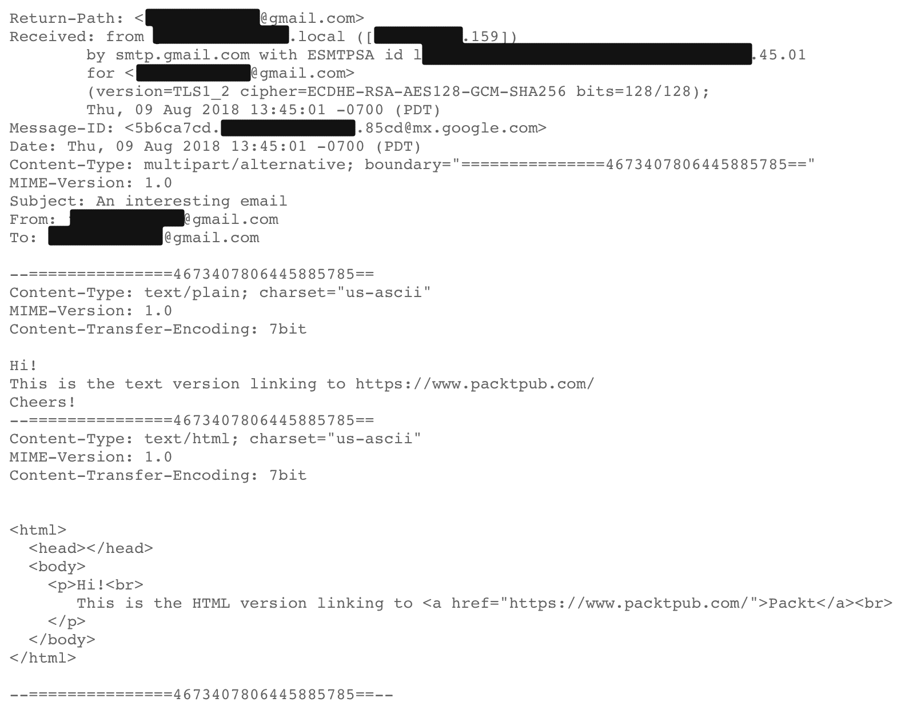
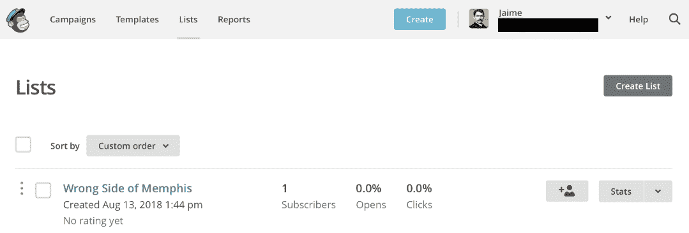
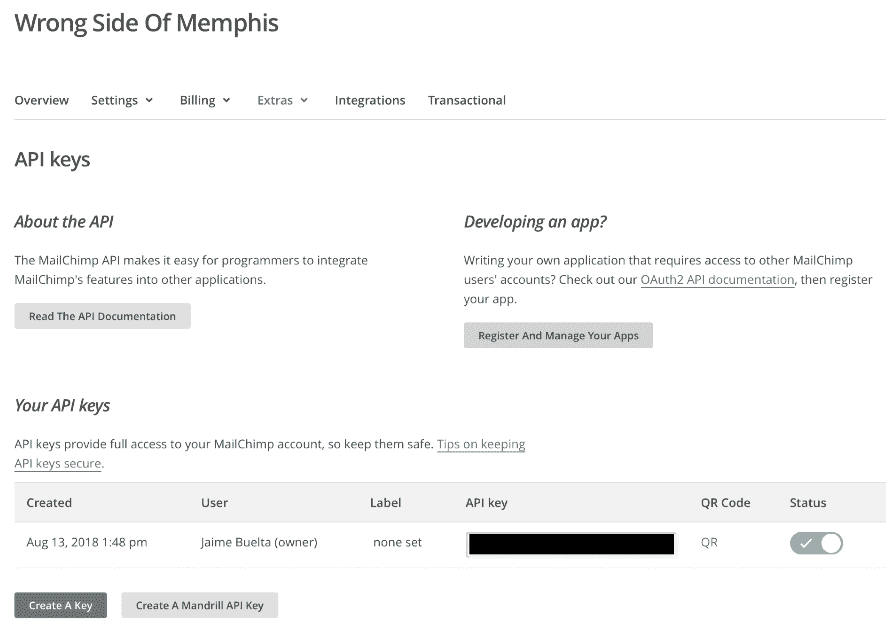
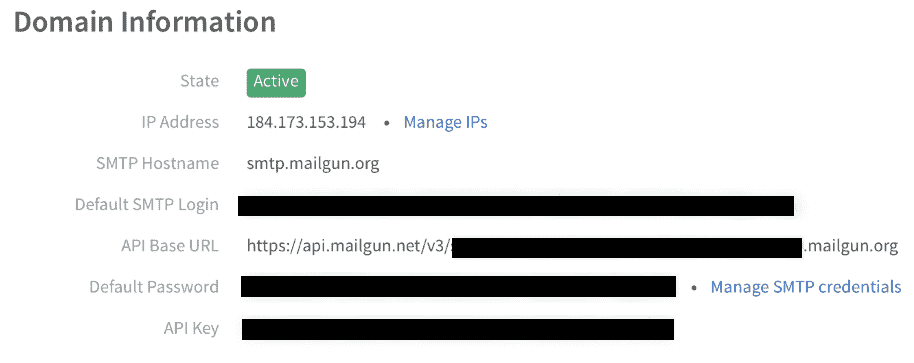
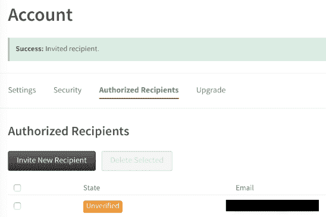
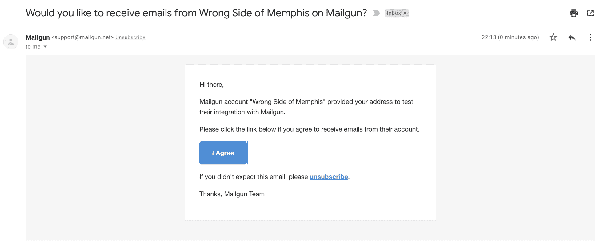
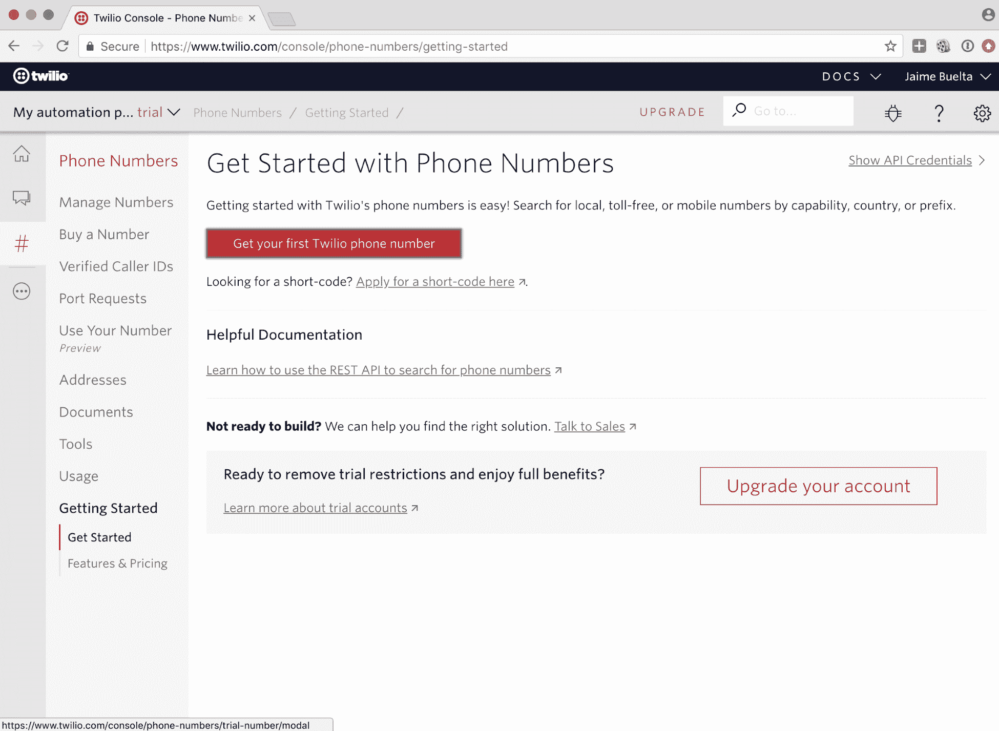
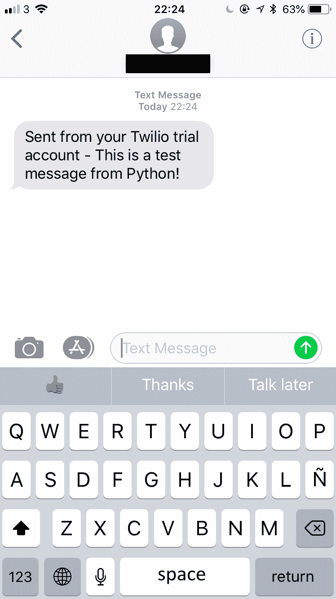
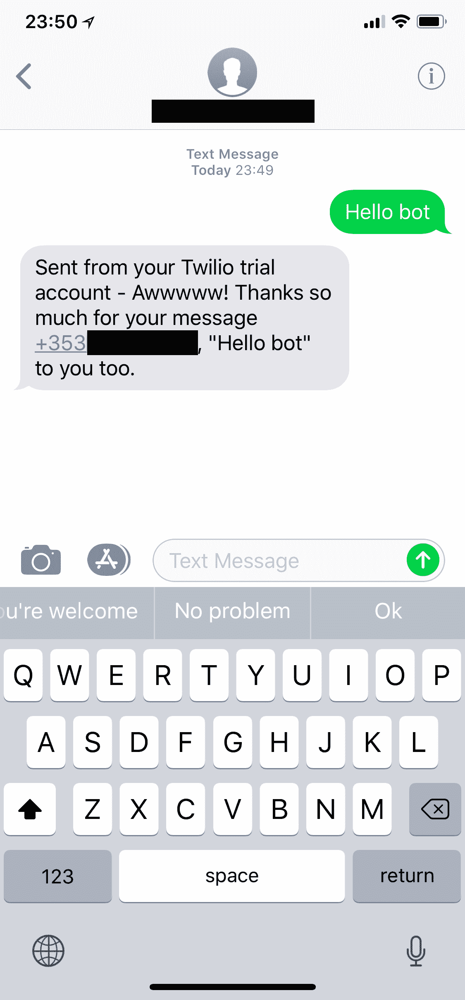
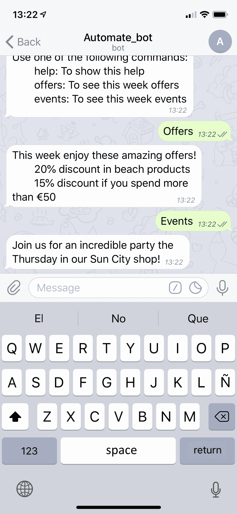

# 八、处理通信渠道

在本章中，我们将介绍以下配方：

*   使用电子邮件模板
*   发送个人电子邮件
*   阅读电子邮件
*   向电子邮件时事通讯添加订户
*   通过电子邮件发送通知
*   制作短信
*   接收短信
*   创建电报机器人

# 介绍

处理沟通渠道是自动化工作可以带来巨大收益的地方。在本食谱中，我们将了解如何使用两种最常见的通信渠道电子邮件，包括时事通讯，以及通过电话发送和接收文本消息。

在过去的几年中，垃圾邮件或未经请求的营销邮件等交付方式出现了相当数量的滥用，因此有必要与外部工具合作，以避免邮件被自动过滤器自动拒绝。我们将在适用的情况下提出适当的注意事项。所有提供的工具都有优秀的文档，所以不要害怕阅读。他们也有很多功能，他们可能能够做的事情，正是你所寻找的。

# 使用电子邮件模板

要发送电子邮件，我们首先需要生成其内容。在这个配方中，我们将看到如何以纯文本样式和 HTML 生成适当的模板。

# 准备

我们应该从安装`mistune`模块开始，该模块将把降价文档编译成 HTML。我们还将使用`jinja2`模块将 HTML 与文本相结合：

```py
$ echo "mistune==0.8.3" >> requirements.txt
$ echo "jinja2==2.20" >> requirements.txt
$ pip install -r requirements.txt
```

在 GitHub 回购协议中，我们将在[中使用两个模板-`email_template.md`https://github.com/PacktPublishing/Python-Automation-Cookbook/blob/master/Chapter08/email_template.md](https://github.com/PacktPublishing/Python-Automation-Cookbook/blob/master/Chapter08/email_template.md) 和[中的样式模板`email_styling.html` https://github.com/PacktPublishing/Python-Automation-Cookbook/blob/master/Chapter08/email_styling.html](https://github.com/PacktPublishing/Python-Automation-Cookbook/blob/master/Chapter08/email_styling.html) 。

# 怎么做。。。

1.  导入模块：

```py
>>> import mistune
>>> import jinja2
```

2.  从磁盘读取两个模板：

```py
>>> with open('email_template.md') as md_file:
...     markdown = md_file.read()

>>> with open('email_styling.html') as styling_file:
...     styling = styling_file.read()
```

3.  定义要包含在模板中的`data`。该模板非常简单，只接受一个参数：

```py
>>> data = {'name': 'Seamus'}
```

4.  呈现标记模板。这将生成`data`的纯文本版本：

```py
>>> text = markdown.format(**data)
```

5.  渲染标记并添加样式：

```py
>>> html_content = mistune.markdown(text)
>>> html = jinja2.Template(styling).render(content=html_content)
```

6.  将文本和 HTML 版本保存到磁盘以进行检查：

```py
>>> with open('text_version.txt', 'w') as fp:
...     fp.write(text)
>>> with open('html_version.html', 'w') as fp:
...     fp.write(html)
```

7.  检查文本版本：

```py
$ cat text_version.txt
Hi Seamus:

This is an email talking about **things**

### Very important info

1\. One thing
2\. Other thing
3\. Some extra detail

Best regards,

  *The email team*
```

8.  在浏览器中检查 HTML 版本：


# 它是如何工作的。。。

步骤 1 获取稍后将使用的模块，步骤 2 读取将呈现的两个模板。`email_template.md`是内容的基础，它是一个标记模板。`email_styling.html`是一个 HTML 模板，包含基本的 HTML 环境和 CSS 样式信息。

The basic structure is to create the content in Markdown format. This is a plain-text file that's readable and can be send as part of the email. That content can then be converted into HTML and surrounded with some styling to create an HTML function. `email_styling.html` has a content area to put the rendered HTML from Markdown.

步骤 3 定义将在`email_template.md`中呈现的数据。这是一个非常简单的模板，只需要一个名为`name`的参数。

在步骤 4 中，使用`data`呈现降价模板。这将生成电子邮件的纯文本版本。

在步骤 5 中呈现`HTML`版本。使用`mistune`将纯文本版本渲染为`HTML`，然后使用`jinja2`模板将其包装在`email_styling.html`中。最终版本是一个自包含的 HTML 文档。

最后，在步骤 6 中，我们将两个版本，纯文本（作为`text`和 HTML（作为`html`保存）保存到一个文件中。步骤 7 和 8 检查存储的值。信息是相同的，但在`HTML`版本中，它是样式化的。

# 还有更多。。。

使用 Markdown 可以轻松生成包含文本和 HTML 的双重电子邮件。Markdown 在文本格式中非常可读，并且非常自然地呈现为 HTML。这就是说，可以生成一个完全不同的 HTML 版本，这将允许更多的定制和利用 HTML 的功能。

完整的降价语法可在[中找到 https://daringfireball.net/projects/markdown/syntax](https://daringfireball.net/projects/markdown/syntax) 一份包含最常用元素的良好备忘单位于[https://beegit.com/markdown-cheat-sheet](https://beegit.com/markdown-cheat-sheet) 。

While making a plain-text-only version of an email is not strictly necessary, it is a good practice and shows you care about who reads the email. Most email clients accept HTML, but it's not totally universal. 

对于 HTML 电子邮件，请注意整个样式都应包含在电子邮件中。这意味着 CSS 需要嵌入到`HTML`中。避免进行可能导致电子邮件在某些电子邮件客户端中无法正确呈现，甚至被认定为垃圾邮件的外部呼叫。

`email_styling.html`中的样式基于此处可以找到的朴素样式：[http://markdowncss.github.io/](http://markdowncss.github.io/) 。有更多的 CSS 样式可以使用，在谷歌搜索应该可以找到更多。如前所述，请记住删除任何外部引用。

通过将图像编码为`base64`格式，图像可以包含在 HTML 中，因此可以直接嵌入 HTML`img`标记中，而不是添加引用：

```py
>>> import base64
>>> with open("image.png",'rb') as file:
...    encoded_data = base64.b64encode(file)
>>> print "".format(data=encoded_data)
```

您可以在本文中找到有关此技术的更多信息：[https://css-tricks.com/data-uris/](https://css-tricks.com/data-uris/) 。

`mistune`完整文档可在[处获取 http://mistune.readthedocs.io/en/latest/](http://mistune.readthedocs.io/en/latest/) 和[处的`jinja2`文件 http://jinja.pocoo.org/docs/2.10/](http://jinja.pocoo.org/docs/2.10/) 。

# 另见

*   [第 5 章](05.html)中的*加价*配方中的*格式化文本*生成奇妙的报告**
*   [第五章](05.html)中*使用报表模板配方**生成精彩报表*
*   [第 5 章](05.html)中的*发送事务性邮件*配方*生成精彩报告*

# 发送个人电子邮件

发送电子邮件最基本的方式是通过电子邮件帐户发送个人电子邮件。此选项仅建议偶尔使用，但对于简单的目的，例如每天向受控地址发送几封电子邮件，它就足够了。

Do not use this method to send emails in bulk to distribution lists or to customers with unknown email addresses. You risk being banned from your service provider due to anti-spam rules. See other recipes in this chapter for more options.

# 准备

对于这个配方，我们需要一个服务提供商的电子邮件帐户。根据要使用的提供商的不同，有一些细微的差别，但我们将使用 Gmail 帐户，因为它非常常见，并且可以免费访问。

由于 Gmail 的安全性，我们需要创建一个特定的应用密码，用于发送电子邮件。按照此处的说明进行操作：[https://support.google.com/accounts/answer/185833](https://support.google.com/accounts/answer/185833) 。这将有助于生成用于此配方的密码。记住为邮件访问创建它。您可以在以后删除密码以将其删除。

我们将使用`smtplib`模块，它是 Python 标准库的一部分。

# 怎么做。。。

1.  导入`smtplib`和`email`模块：

```py
>>> import smtplib
>>> from email.mime.multipart import MIMEMultipart
>>> from email.mime.text import MIMEText
```

2.  设置凭据，用您自己的凭据替换这些凭据。出于测试目的，我们将发送到相同的电子邮件，但请随意使用不同的地址：

```py
>>> USER = 'your.account@gmail.com'
>>> PASSWORD = 'YourPassword'
>>> sent_from = USER
>>> send_to = [USER]
```

3.  定义要发送的数据。请注意两个备选方案，纯文本和 HTML：

```py
>>> text = "Hi!\nThis is the text version linking to https://www.packtpub.com/\nCheers!"
>>> html = """<html><head></head><body>
... <p>Hi!<br>
... This is the HTML version linking to <a href="https://www.packtpub.com/">Packt</a><br>
... </p>
... </body></html>
"""
```

4.  将消息组成`MIME`多部分，包括`subject`、`to`、`from`：

```py
>>> msg = MIMEMultipart('alternative')
>>> msg['Subject'] = 'An interesting email'
>>> msg['From'] = sent_from
>>> msg['To'] = ', '.join(send_to)
```

5.  填写电子邮件的数据内容部分：

```py
>>> part_plain = MIMEText(text, 'plain')
>>> part_html = MIMEText(html, 'html')
>>> msg.attach(part_plain)
>>> msg.attach(part_html)
```

6.  使用`SMTP SSL`协议发送电子邮件：

```py
>>> with smtplib.SMTP_SSL('smtp.gmail.com', 465) as server:
...     server.login(USER, PASSWORD)
...     server.sendmail(sent_from, send_to, msg.as_string())
```

7.  电子邮件已发送。检查您的电子邮件帐户以获取该邮件。查看*原始电子邮件*，您可以看到完整的原始电子邮件，包含 HTML 和纯文本元素。该电子邮件已被编辑：



# 它是如何工作的。。。

在步骤 1 之后，从`stmplib`和`email`进行相关导入，步骤 2 定义从 Gmail 获得的凭证。

步骤 3 显示将要发送的 HTML 和文本。它们是备选方案，因此它们应该以不同的格式呈现相同的信息。

在步骤 4 中设置基本消息信息。它指定电子邮件的主题，以及从和*到*的*。步骤 5 添加了多个部件，每个部件都具有正确的`MIMEText`类型。*

The last part added is the preferred alternative, according to the `MIME` format, so we add the `HTML` part last.

步骤 6 设置与服务器的连接，使用凭据登录，并发送消息。它使用`with`上下文来获取连接

如果凭据出现错误，它将引发用户名和密码不被接受的异常。

# 还有更多。。。

注意，`sent_to`是一个地址列表。您可以向多个地址发送电子邮件。唯一的警告是在步骤 4 中，需要将其指定为所有地址的逗号分隔值列表。

Although it is possible to label `sent_from` as a different address than that used to send the email, it is not recommended. That can be interpreted as an indication of trying to fake the origin of the email, and provoke detection as a spam source.

这里使用的服务器`smtp.gmail.com`*是 Gmail 指定的服务器，`SMTPS`（安全`SMTP`定义的端口是`465`。Gmail 也接受端口`587`，这是标准，但要求您通过调用`.starttls`来指定会话类型，如下面的代码所示：*

 *```py
 with smtplib.SMTP('smtp.gmail.com', 587) as server:
    server.starttls()
    server.login(USER, PASSWORD)
    server.sendmail(sent_from, send_to, msg.as_string())
```

如果您对这些差异和两种协议的更多细节感兴趣，您可以在本文中找到更多信息：[https://www.fastmail.com/help/technical/ssltlsstarttls.html](https://www.fastmail.com/help/technical/ssltlsstarttls.html) 。

完整的`smtplib`文件可在[找到 https://docs.python.org/3/library/smtplib.html](https://docs.python.org/3/library/smtplib.html) 和`email`模块，以及关于不同电子邮件格式的信息，包括`MIME`类型的示例，可在此处找到：[https://docs.python.org/3/library/email.html](https://docs.python.org/3/library/email.html) 。

# 另见

*   *使用电子邮件模板*配方
*   *发送个人电子邮件*配方

# 阅读电子邮件

在本食谱中，我们将了解如何从帐户读取电子邮件。我们将使用`IMAP4`标准，这是阅读电子邮件最常用的标准。

一旦阅读，电子邮件可以自动处理和分析，以生成智能自动响应、将电子邮件转发到不同的目标、聚合结果以进行监视等操作。选择是无限的！

# 准备

对于这个配方，我们需要一个服务提供商的电子邮件帐户。根据要使用的提供商的不同，有一些细微的差别，但我们将使用 Gmail 帐户，因为它非常常见，并且可以免费访问。

由于 Gmail 的安全性，我们需要创建一个用于发送电子邮件的特定应用密码。按照此处的说明进行操作：[https://support.google.com/accounts/answer/185833](https://support.google.com/accounts/answer/185833) 。这将生成用于此配方的密码。记住为邮件创建它。您可以在以后删除密码以将其删除。

我们将使用`imaplib`模块，它是 Python 标准库的一部分。

食谱将阅读最后收到的电子邮件，因此您可以使用它更好地控制将要阅读的内容。我们将发送一封简短的电子邮件，看起来它是发送给支持人员的。

# 怎么做。。。

1.  导入`imaplib`和`email`模块：

```py
>>> import imaplib
>>> import email
>>> from email.parser import BytesParser, Parser
>>> from email.policy import default
```

2.  设置凭据，用您自己的凭据替换这些凭据：

```py
>>> USER = 'your.account@gmail.com'
>>> PASSWORD = 'YourPassword'
```

3.  连接到电子邮件服务器：

```py
>>> mail = imaplib.IMAP4_SSL('imap.gmail.com')
>>> mail.login(USER, PASSWORD)
```

4.  选择收件箱文件夹：

```py
>>> mail.select('inbox')
```

5.  阅读所有电子邮件 UID 并检索最近收到的电子邮件：

```py
>>> result, data = mail.uid('search', None, 'ALL')
>>> latest_email_uid = data[0].split()[-1]
>>> result, data = mail.uid('fetch', latest_email_uid, '(RFC822)')
>>> raw_email = data[0][1]
```

6.  将电子邮件解析为 Python 对象：

```py
>>> email_message = BytesParser(policy=default).parsebytes(raw_email)
```

7.  显示电子邮件的主题和发件人：

```py
>>> email_message['subject']
'[Ref ABCDEF] Subject: Product A'
>>> email.utils.parseaddr(email_message['From'])
('Sender name', 'sender@gmail.com')
```

8.  检索文本的有效负载：

```py
>>> email_type = email_message.get_content_maintype()
>>> if email_type == 'multipart':
...     for part in email_message.get_payload():
...         if part.get_content_type() == 'text/plain':
...             payload = part.get_payload()
... elif email_type == 'text':
...     payload = email_message.get_payload()
>>> print(payload)
Hi:

  I'm having difficulties getting into my account. What was the URL, again?

  Thanks!
    A confuser customer
```

# 它是如何工作的。。。

在导入将要使用的模块并定义凭据之后，我们在步骤 3 中连接到服务器。

步骤 4 连接到`inbox`。这是 Gmail 中包含收到的电子邮件的默认文件夹。

Of course, you may need to read a different folder. You can get a list of all folders by calling `mail.list()`.

在步骤 5 中，首先通过调用`.uid('search', None, "ALL")`检索收件箱中所有电子邮件的 UID 列表。最后收到的电子邮件将通过带有`.uid('fetch', latest_email_uid, '(RFC822)')`的`fetch`操作再次从服务器检索。这将检索 RFC822 格式的电子邮件，这是标准格式。请注意，检索电子邮件时会将其标记为已读。

The `.uid` command allows us to call IMAP4 commands, returning a tuple with the result (`OK` or `NO`) and the data. If there's an error, it will raise the proper exception.

`BytesParser`模块用于将原始`RFC822`电子邮件转换为 Python 对象。这在步骤 6 中完成。

元数据，包括主题、发送者和时间戳等细节，可以像字典一样访问，如步骤 7 所示。可以从原始文本格式解析地址，用`email.utils.parseaddr`分隔部分。

最后，可以展开和提取内容。如果电子邮件类型为多部分，则可以通过迭代`.get_payload()`提取每个部分。更容易处理的是`plain/text`，因此假设它存在，步骤 8 中的代码将提取它。

电子邮件正文存储在`payload`变量中。

# 还有更多。。。

在步骤 5 中，我们将检索收件箱中的所有电子邮件，但这不是必需的。可以过滤搜索，例如仅检索最后一天的电子邮件：

```py
import datetime
since = (datetime.date.today() - datetime.timedelta(days=1)).strftime("%d-%b-%Y")
result, data = mail.uid('search', None, f'(SENTSINCE {since})')
```

这将根据电子邮件的日期进行搜索。请注意，决议以天为单位。

通过`IMAP4`可以完成更多的操作。检查 RFC 3501[https://tools.ietf.org/html/rfc3501](https://tools.ietf.org/html/rfc3501) 和 RFC 6851[https://tools.ietf.org/html/rfc6851](https://tools.ietf.org/html/rfc6851) 了解更多详情。

The RFCs describe the IMAP4 protocol and can be a little arid. Checking the possible actions will give you an idea of the possibilities to investigate in detail, probably by Googling for examples. 

可以解析和处理电子邮件的主题和正文以及其他元数据，如日期、收件人、发件人等。例如，可通过以下方式处理此配方中检索到的受试者：

```py
>>> import re
>>> re.search(r'\[Ref (\w+)] Subject: (\w+)', '[Ref ABCDEF] Subject: Product A').groups()
('ABCDEF', 'Product') 
```

有关正则表达式和其他解析信息的方法的更多信息，请参见[第 1 章](01.html)、*让我们开始我们的自动化之旅*。

# 另见

*   [第 1 章](01.html)*中*引入正则表达式*的配方，让我们开始我们的自动化之旅*

# 向电子邮件时事通讯添加订户

一种常见的营销工具是电子邮件时事通讯。它们是向多个目标发送信息的便捷方式。一个好的时事通讯系统很难实现，推荐的方法是使用市场上可用的时事通讯系统。一个著名的是 MailChimp（[https://mailchimp.com/](https://mailchimp.com/) ）。

MailChimp 有很多可能性，但本书中有趣的一个是它的 API，它可以编写脚本来自动化工具。这个 RESTful API 可以通过 Python 访问。在这个配方中，我们将看到如何向现有列表添加更多订阅者。

# 准备

由于我们将使用 MailChimp，我们需要有一个可用的帐户。您可以在[创建一个免费账户 https://login.mailchimp.com/signup/](https://login.mailchimp.com/signup/) 。

创建帐户后，请确保至少有一个我们将向其中添加订户的列表。作为注册的一部分，它可能已经创建。它将出现在以下列表下：



该列表将包含已订阅的用户。

对于 API，我们需要一个 API 密钥。转到 Account | Extras | API 密钥并创建一个新密钥：



我们将使用请求模块访问 API。将其添加到您的虚拟环境：

```py
$ echo "requests==2.18.3" >> requirements.txt
$ pip install -r requirements.txt
```

MailChimp API 使用您的帐户使用的**DC**（**数据中心**的概念。这可以从 API 的最后一位数字，或者从 MailChimp 管理站点的 URL 开头获得。例如，在前面的所有截图中，它是`us19`。

# 怎么做。。。

1.  导入`requests`模块：

```py
>>> import requests
```

2.  定义身份验证和基本 URL。基本 URL 在开始时需要您的`dc`（如`us19`：

```py
>>> API = 'your secret key'
>>> BASE = 'https://<dc>.api.mailchimp.com/3.0'
>>> auth = ('user', API)
```

3.  获取您的所有列表：

```py
>>> url = f'{BASE}/lists'
>>> response = requests.get(url, auth=auth)
>>> result = response.json()
```

4.  筛选您的列表以获取所需列表的`href`：

```py
>>> LIST_NAME = 'Your list name'
>>> this_list = [l for l in result['lists'] if l['name'] == LIST_NAME][0]
>>> list_url = [l['href'] for l in this_list['_links'] if l['rel'] == 'self'][0]
```

5.  使用列表 URL，您可以获取列表成员的 URL：

```py
>>> response = requests.get(list_url, auth=auth)
>>> result = response.json()
>>> result['stats']
{'member_count': 1, 'unsubscribe_count': 0, 'cleaned_count': 0, ...}
>>> members_url = [l['href'] for l in result['_links'] if l['rel'] == 'members'][0]
```

6.  成员列表可通过`GET`请求`members_url`检索：

```py
>>> response = requests.get(members_url, json=new_member, auth=auth)
>>> result = response.json()
>>> len(result['members'])
1
```

7.  将新成员追加到列表中：

```py
>>> new_member = {
    'email_address': 'test@test.com',
    'status': 'subscribed',
}
>>> response = requests.post(members_url, json=new_member, auth=auth)
```

8.  通过`GET`检索用户列表，可获得两个用户：

```py
>>> response = requests.post(members_url, json=new_member, auth=auth)
>>> result = response.json()
>>> len(result['members'])
2
```

# 它是如何工作的。。。

在步骤 1 中导入 requests 模块后，我们定义了步骤 2 中要连接的基本值、基本 URL 和凭据。请注意，对于身份验证，我们只需要 API 密钥作为密码，以及任何用户（如 MailChimp 文档所述：[https://developer.mailchimp.com/documentation/mailchimp/guides/get-started-with-mailchimp-api-3/](https://developer.mailchimp.com/documentation/mailchimp/guides/get-started-with-mailchimp-api-3/) ）。

步骤 3 检索所有列表，调用正确的 URL。结果以 JSON 格式返回。该调用包括具有已定义凭据的`auth`参数。所有后续调用都将使用该`auth`参数进行身份验证。

步骤 4 显示了如何过滤返回的列表，以获取特定感兴趣列表的 URL。每个返回的调用都包含一个带有相关信息的`_links`列表，从而可以遍历 API。

在步骤 5 中调用列表的 URL。这将返回列表的信息，包括基本统计信息。在步骤 4 中应用类似的过滤，我们检索成员的 URL。

Due to size constraints and to show relevant data, not all of the retrieved elements are displayed. Feel free to analyze them interactively and find out about them. The data is well constructed, following the RESTful principles of discoverability; plus the Python ability of introspection makes it quite readable and understandable.

步骤 6 检索成员列表，向`members_url`发出`GET`请求，可以将其视为单个用户。这可以在 web 界面的*准备*部分看到

步骤 7 创建一个新用户，并使用在`json`参数中传递的信息发布在`members_url`上，因此它被转换为 JSON 格式。在步骤 7 中检索更新的数据，显示列表中有一个新用户。

# 还有更多。。。

完整的 MailChimp API 非常强大，可以执行大量任务。转到完整的 MailChimp 文档以发现所有可能性：[https://developer.mailchimp.com/](https://developer.mailchimp.com/) 。

As a brief note, and a little out of scope of this book, please be aware of the legal implications of adding subscribers to an automated list. Spam is a serious worry and there are new regulations in place to protect the rights of customers, such as GPDR. Ensure that you have the permission of users to email them. The good thing is that MailChimp automatically implements tools to help with this, such as automatic unsubscribe buttons.

MailChimp 的一般文档也很有趣，显示了很多可能性。MailChimp 能够管理时事通讯和普通通讯组列表，但它也可以进行定制，以生成流量、安排电子邮件的发送，并根据用户的生日等参数自动向用户发送消息。

# 另见

*   *发送个人电子邮件*配方
*   *发送交易性电子邮件*秘诀

# 通过电子邮件发送通知

在本食谱中，我们将介绍如何向客户发送电子邮件。响应用户操作而发送的电子邮件，例如确认电子邮件或警报电子邮件，称为*交易电子邮件***。由于垃圾邮件保护和其他限制，最好借助外部工具实现此类电子邮件**

 **在这个配方中，我们将使用邮枪（[https://www.mailgun.com](https://www.mailgun.com) ），可以发送此类邮件，也可以交流回复。

# 准备

我们需要在 Mailgun 中创建一个帐户。转到[https://signup.mailgun.com](https://signup.mailgun.com/new/signup) 创建一个。请注意，信用卡信息是可选的。

注册后，转到域以查看沙箱环境。我们可以使用它来测试功能，尽管它只会向注册的测试电子邮件帐户发送电子邮件。API 凭据将显示在此处：



我们需要注册帐户，以便我们将以*授权收件人*的身份接收电子邮件。您可以在此处添加它：



要验证帐户，请检查授权收件人的电子邮件并确认。电子邮件地址现在已准备好接收测试电子邮件：



我们将使用请求模块连接到 Mailgun API。在虚拟环境中安装它：

```py
$ echo "requests==2.18.3" >> requirements.txt
$ pip install -r requirements.txt
```

一切都准备好发送电子邮件，但只通知授权收件人。要想在任何地方发送电子邮件，我们需要设置一个域。请遵循邮枪文档：[https://documentation.mailgun.com/en/latest/quickstart-sending.html#verify-您的域名](https://documentation.mailgun.com/en/latest/quickstart-sending.html#verify-your-domain)。

# 怎么做。。。

1.  导入`requests`模块：

```py
>>> import requests
```

2.  准备凭证，以及往来电子邮件。注意，我们使用的模拟源：

```py
>>> KEY = 'YOUR-SECRET-KEY'
>>> DOMAIN = 'YOUR-DOMAIN.mailgun.org'
>>> TO = 'YOUR-AUTHORISED-RECEIVER'
```

```py

>>> FROM = f'sender@{DOMAIN}'
>>> auth = ('api', KEY)
```

3.  准备要发送的电子邮件。这里有 HTML 版本和另一个纯文本版本：

```py
>>> text = "Hi!\nThis is the text version linking to https://www.packtpub.com/\nCheers!"
>>> html = '''<html><head></head><body>
...     <p>Hi!<br>
...        This is the HTML version linking to <a href="https://www.packtpub.com/">Packt</a><br>
...     </p>  
...   </body></html>'''
```

4.  设置要发送到 Mailgun 的数据：

```py
>>> data = {
...     'from': f'Sender <{FROM}>',
...     'to': f'Jaime Buelta <{TO}>',
...     'subject': 'An interesting email!',
...     'text': text,
...     'html': html,
... }
```

5.  调用 API：

```py
>>> response = requests.post(f"https://api.mailgun.net/v3/{DOMAIN}/messages", auth=auth, data=data)
>>> response.json()
{'id': '<YOUR-ID.mailgun.org>', 'message': 'Queued. Thank you.'}
```

6.  检索事件并检查电子邮件是否已送达：

```py
>>> response_events = requests.get(f'https://api.mailgun.net/v3/{DOMAIN}/events', auth=auth)
>>> response_events.json()['items'][0]['recipient'] == TO
True
>>> response_events.json()['items'][0]['event']
'delivered'
```

7.  电子邮件应显示在您的收件箱中。由于它是通过沙箱环境发送的，如果它没有直接显示，请确保检查您的垃圾邮件文件夹。

# 它是如何工作的。。。

步骤 1 导入`requests`模块，供以后使用。消息中的凭证和基本信息在步骤 2 中定义，并且应该从 Mailgun web 界面中提取，如前所示。

步骤 3 定义将要发送的电子邮件。步骤 4 以 Mailgun 期望的方式构造信息。注意`html`和`text`字段。默认情况下，它会将 HTML 设置为首选，将纯文本选项设置为备选。`TO`和`FROM`的格式应为`Name <address>`格式。您可以在`TO`中使用逗号分隔多个收件人。

对 API 的调用在步骤 5 中进行。这是对消息端点的`POST`调用。数据以标准方式传输，使用`auth`参数进行基本身份验证。请注意步骤 2 中的定义。对 Mailgun 的所有调用都应包含此参数。它返回一条消息，通知您已成功，消息已排队。

在步骤 6 中，调用通过`GET`请求检索事件。这将显示最近执行的操作，最后一个操作将是最近的发送。还可以找到有关交付的信息。

# 还有更多。。。

要发送电子邮件，您需要设置发送电子邮件的域，而不是使用沙箱环境。您可以在此处找到说明：[https://documentation.mailgun.com/en/latest/quickstart-sending.html#verify-您的域名](https://documentation.mailgun.com/en/latest/quickstart-sending.html#verify-your-domain)。这要求您更改 DNS 记录以验证您是否是其合法所有者，并增加电子邮件的可交付性。

电子邮件可以通过以下方式包含附件：

```py
attachments = [("attachment", ("attachment1.jpg", open("image.jpg","rb").read())),
               ("attachment", ("attachment2.txt", open("text.txt","rb").read()))]
response = requests.post(f"https://api.mailgun.net/v3/{DOMAIN}/messages",
                         auth=auth, files=attachments, data=data)
```

数据可以包括通常的信息，如`cc`或`bcc`，但您也可以使用`o:deliverytime`参数延迟交货长达三天：

```py
import datetime
import email.utils
delivery_time = datetime.datetime.now() + datetime.timedelta(days=1)
data = {
    ...
    'o:deliverytime': email.utils.format_datetime(delivery_time),
}
```

Mailgun 还可用于接收电子邮件，并在邮件到达时触发流程，例如，根据规则转发邮件。查看邮枪文档以了解更多信息。

完整的邮枪文档可以在这里找到，[https://documentation.mailgun.com/en/latest/quickstart.html](https://documentation.mailgun.com/en/latest/quickstart.html) 。请务必查看他们的*最佳实践*部分（[https://documentation.mailgun.com/en/latest/best_practices.html#email-最佳实践](https://documentation.mailgun.com/en/latest/best_practices.html#email-best-practices)，了解发送电子邮件的世界以及如何避免被贴上垃圾邮件标签。

# 另见

*   *使用电子邮件模板*配方
*   *发送个人电子邮件*配方

# 制作短信

最广泛使用的通信渠道之一是短信。短信很方便用来传播信息。

SMS messages can be used for marketing purposes, but also as ways of alerting or sending notifications, or, very common recently, as a way of implementing two-factor authentication systems.

我们将使用 Twilio，一种公开 API 的服务，以一种简单的方式发送 SMS

# 准备

我们需要在[为 Twilio 创建一个帐户 https://www.twilio.com/](https://www.twilio.com/) 。转到页面并注册一个新帐户。

您需要按照说明操作并设置一个电话号码来接收信息。您需要输入发送到此电话的代码或接听电话以验证此线路。

创建新项目并检查仪表板。从那里，您将能够创建第一个电话号码，能够接收和发送短信：



配置号码后，它将出现在所有产品和服务的“电话号码”*中的“活动号码”部分。*

在主仪表板上，检查`ACCOUNT SID`和`AUTH TOKEN`。它们将在以后使用。注意，您需要显示 auth 令牌。

我们还需要安装`twilio`模块。将其添加到您的虚拟环境：

```py
$ echo "twilio==6.16.1" >> requirements.txt
$ pip install -r requirements.txt
```

请注意，接收方电话号码只能是具有试用帐户的已验证号码。您可以验证多个数字；按照[中的文档进行操作 https://support.twilio.com/hc/en-us/articles/223180048-Adding-a-Verified-Phone-Number-or-Caller-ID-with-Twilio](https://support.twilio.com/hc/en-us/articles/223180048-Adding-a-Verified-Phone-Number-or-Caller-ID-with-Twilio) 。

# 怎么做。。。

1.  从`twilio`模块导入`Client`：

```py
>>> from twilio.rest import Client
```

2.  设置之前从仪表板获取的身份验证凭据。另外，设置您的 Twilio 电话号码；举个例子，这里我们设置了`+353 12 345 6789`，一个假爱尔兰数字。它将是您所在国家的本地产品：

```py
>>> ACCOUNT_SID = 'Your account SID'
>>> AUTH_TOKEN = 'Your secret token'
>>> FROM = '+353 12 345 6789'
```

3.  启动`client`访问 API：

```py
>>> client = Client(ACCOUNT_SID, AUTH_TOKEN)
```

4.  向您的授权电话号码发送消息。注意`from_`末尾的下划线：

```py
>>> message = client.messages.create(body='This is a test message from Python!', 
                                     from_=FROM, 
                                     to='+your authorised number')
```

5.  您将收到手机短信：



# 它是如何工作的。。。

使用 Twilio 客户端发送消息非常简单。

第一步导入`Client`，准备第二步配置的凭证和电话号码。

步骤 3 使用正确的身份验证创建客户端，并在步骤 4 中发送消息。

Note that the `to` number needs to be one of the authenticated numbers while in a trial account, or it will produce an error. You can add more authenticated numbers; check the Twilio documentation.

从试用帐户发送的所有消息都将在 SMS 中包含该详细信息，如步骤 5 所示。

# 还有更多。。。

在某些地区（撰写本文时为美国和加拿大），SMS 号码能够发送彩信，包括图像。要将图像附加到消息，请添加`media_url`参数和要发送的图像的 URL：

```py
client.messages.create(body='An MMS message',
                       media_url='http://my.image.com/image.png', 
                       from_=FROM, 
                       to='+your authorised number')
```

客户端基于 RESTful API，允许您执行多种操作，例如创建新电话号码，或先获取可用号码，然后购买：

```py
available_numbers = client.available_phone_numbers("IE").local.list()
number = available_numbers[0]
new_number = client.incoming_phone_numbers.create(phone_number=number.phone_number)
```

查看文档以了解更多可用操作，但大多数仪表板点击操作都可以通过编程方式执行。

Twilio is also capable of performing other phone services, such as phone calls and text-to-speech. Check it out in the full documentation.

Twilio 的完整文档可在此处获取：[https://www.twilio.com/docs/](https://www.twilio.com/docs/) 。

# 另见

*   *接收短信*配方
*   *创建电报机器人*配方

# 接收短信

短信也可以自动接收和处理。这使服务能够按请求提供信息（例如，发送信息目标以接收足球联赛的结果），但也可以实现更复杂的流，例如在机器人中，它可以与用户进行简单的对话，从而实现丰富的服务，如远程配置恒温器

Each time Twilio receives an SMS to one of your registered phone numbers, it performs a request to a publicly available URL. This is configured in the service, meaning it should be under your control. This creates the problem of having a URL under your control available on the internet. This means that just your local computer won't work, as it's not addressable. We will use Heroku ([http://heroku.com](http://heroku.com)) to deliver an available service, but there are other alternatives. The Twilio documentation has examples using `grok`, which allows for local development by creating a tunnel between a public address and your local development environment. See here for more details: [https://www.twilio.com/blog/2013/10/test-your-webhooks-locally-with-ngrok.html](https://www.twilio.com/blog/2013/10/test-your-webhooks-locally-with-ngrok.html).

这种操作方式在通信 API 中很常见。应该注意的是，Twilio 为 WhatsApp 提供了一个测试版 API，其工作方式与之类似。有关更多信息，请查看文档[https://www.twilio.com/docs/sms/whatsapp/quickstart/python](https://www.twilio.com/docs/sms/whatsapp/quickstart/python) 。

# 准备

我们需要在[为 Twilio 创建一个帐户 https://www.twilio.com/](https://www.twilio.com/) 。详细说明参见*制作短信*配方中的*准备*部分。

对于这个配方，我们还需要在 Heroku（[中设置一个 web 服务 https://www.heroku.com/](https://www.heroku.com/) ）能够创建一个能够接收发送给 Twilio 的短信的 webhook。因为这个配方的主要目的是 SMS 部分，所以我们在设置 Heroku 时会很简洁，但是您可以参考它的优秀文档。它很容易使用：

1.  在 Heroku 中创建一个帐户。

2.  您需要为 Heroku 安装命令行界面（所有平台的说明见[https://devcenter.heroku.com/articles/getting-started-with-python#set-启动](https://devcenter.heroku.com/articles/getting-started-with-python#set-up)，然后登录命令行：

```py
$ heroku login
Enter your Heroku credentials.
Email: your.user@server.com
Password:
```

3.  从[下载基本 Heroku 模板 https://github.com/datademofun/heroku-basic-flask](https://github.com/datademofun/heroku-basic-flask) 。我们将使用它作为服务器的基础。
4.  将`twilio`客户端添加到`requirements.txt`文件：

```py
$ echo "twilio" >> requirements.txt
```

5.  将`app.py`替换为 GitHub 中位于[的一个 https://github.com/PacktPublishing/Python-Automation-Cookbook/blob/master/Chapter08/app.py](https://github.com/PacktPublishing/Python-Automation-Cookbook/blob/master/Chapter08/app.py) 。

You can keep the existing `app.py` to check the template example and how Heroku works. Check out the README at [https://github.com/datademofun/heroku-basic-flask](https://github.com/datademofun/heroku-basic-flask).

6.  完成后，将更改提交到 Git：

```py
$ git add .
$ git commit -m 'first commit'
```

7.  在 Heroku 中创建新服务。它将随机生成一个新的服务名称（我们这里使用`service-name-12345`。此 URL 可访问：

```py
$ heroku create
Creating app... done, ⬢ SERVICE-NAME-12345
https://service-name-12345.herokuapp.com/ | https://git.heroku.com/service-name-12345.git
```

8.  部署服务。在 Heroku 中，部署服务会将代码推送到远程 Git 服务器：

```py
$ git push heroku master
...
remote: Verifying deploy... done.
To https://git.heroku.com/service-name-12345.git
 b6cd95a..367a994 master -> master
```

9.  检查服务是否已在 webhook URL 上启动并运行。注意：在上一步中，它显示为输出。您也可以在浏览器中进行检查：

```py
$ curl https://service-name-12345.herokuapp.com/
All working!
```

# 怎么做。。。

1.  转到 Twilio 并访问电话号码部分。配置 webhook URL。这将使 URL 在收到的每条短信上都被调用。转到所有产品和服务中的活动号码部分|电话号码并填写 webhook。注意 webhook 末尾的`/sms`。点击保存：


2.  该服务现在已启动，可以使用。向您的 Twilio 电话号码发送短信，您将收到自动回复：



注意：模糊部分应替换为您的信息。

If you have a trial account, you can only send messages back to one of your authorized phone numbers, so you'll need to send the text from them.

# 它是如何工作的。。。

第 1 步设置 webhook，这样 Twilio 在收到手机短信时会调用你的 Heroku 应用。

让我们看一下在 Type T0x 中的代码，看看它是如何工作的。为了清晰起见，这里对其进行了编辑；在[处查看完整文件 https://github.com/PacktPublishing/Python-Automation-Cookbook/blob/master/Chapter08/app.py](https://github.com/PacktPublishing/Python-Automation-Cookbook/blob/master/Chapter08/app.py) ：

```py
...
@app.route('/')
def homepage():
    return 'All working!'

@app.route("/sms", methods=['GET', 'POST'])
def sms_reply():
    from_number = request.form['From']
    body = request.form['Body']
    resp = MessagingResponse()
    msg = (f'Awwwww! Thanks so much for your message {from_number}, '
           f'"{body}" to you too.')

    resp.message(msg)
    return str(resp)
...
```

`app.py`可以分为三个部分，Python 在文件开始时导入，在文件结束时启动 Flask app，这只是设置 Flask（此处未显示）；对`homepage`的调用，用于测试服务器是否正常工作；还有`sms_reply`，这就是魔法发生的地方。

`sms_reply`功能从`request.form`字典中获取发送短信的电话号码以及短信正文。然后，在`msg`中编写一个响应，将其附加到新的`MessagingResponse`上，然后返回。

We are using the message from the user as a whole, but remember all the techniques to parse text mentioned in [Chapter 1](01.html), *Let Us Begin Our Automation Journey*. They are all applicable here to detecting predefined actions or any other text processing.

返回的值将由 Twilio 发送回发送方，产生步骤 2 中所示的结果。

# 还有更多。。。

为了能够生成自动对话，应该存储对话的状态。对于高级状态，它可能应该存储在数据库中，生成一个流，但对于简单的情况，在`session`中存储信息就足够了。会话能够将信息存储在 Cookie 中，这些 Cookie 在相同的 to 和 from 电话号码组合之间保持不变，从而允许您在消息之间检索信息。

例如，此修改将不仅返回发送正文，还返回上一个正文。仅包含相关部分：

```py
app = Flask(__name__)
app.secret_key = b'somethingreallysecret!!!!'
... 
@app.route("/sms", methods=['GET', 'POST'])
def sms_reply():
    from_number = request.form['From']
    last_message = session.get('MESSAGE', None)
    body = request.form['Body']
    resp = MessagingResponse()
    msg = (f'Awwwww! Thanks so much for your message {from_number}, '
           f'"{body}" to you too. ')
    if last_message:
        msg += f'Not so long ago you said "{last_message}" to me..'
    session['MESSAGE'] = body
    resp.message(msg)
    return str(resp)
```

前一个`body`存储在会话的`MESSAGE`密钥中，该密钥被带入。请注意使用会话数据需要密钥。请阅读以下信息：[http://flask.pocoo.org/docs/1.0/quickstart/?highlight=session#sessions](http://flask.pocoo.org/docs/1.0/quickstart/?highlight=session#sessions) 。

To deploy the new version in Heroku, commit the new `app.py` to Git, and then do `git push heroku master`. The new version will be deployed automatically!

因为这个食谱的主要目的是演示如何回复，Heroku 和 Flask 没有详细描述，但它们都有很好的文档。Heroku 的完整文档可在[中找到 https://devcenter.heroku.com/categories/reference](https://devcenter.heroku.com/categories/reference) 烧瓶的文件在这里：[http://flask.pocoo.org/docs/](http://flask.pocoo.org/docs/) 。

Remember, the use of Heroku and Flask is just a convenience for this recipe, as they are great and easy tools to use. There are multiple alternatives to them, as long as you are able to expose a URL so Twilio can call it. Also, check the security measures to ensure that requests to this endpoint come from Twilio: [https://www.twilio.com/docs/usage/security#validating-requests](https://www.twilio.com/docs/usage/security#validating-requests).

Twilio 的完整文档可在此处找到：[https://www.twilio.com/docs/](https://www.twilio.com/docs/) 。

# 另见

*   *生产 SMS*配方
*   *创建电报机器人*配方

# 创建电报机器人

Telegram Messenger 是一款即时消息应用，对创建机器人程序有很好的支持。机器人是一种小型应用，旨在生成自动对话。机器人最大的希望是作为一种机器，它可以创建任何类型的对话，与人类的对话完全没有区别，并通过图灵测试，但这一目标是相当雄心勃勃的，在大多数情况下还不现实。

The Turing Test was proposed by Alan Turing in 1951\. Two participants, a human and an Artificial Intelligence (a machine or software program), communicate via text (like in an instant messaging app) with a human judge that decides which one is human and which one is not. If the judge can only guess correctly 50% of the time, it can't be easily differentiated and therefore the AI passes the test. This was one of the first attempts to measure Artificial Intelligence.

但是，如果使用更有限的方法，机器人可能非常有用，类似于电话系统，在电话系统中，您需要按*2*检查您的帐户，然后按*3*报告丢失的卡。在这个配方中，我们将看到如何生成一个简单的机器人来显示公司的报价和活动。

# 准备

我们需要为电报创建一个新的机器人。这是通过一个名为**botfard**的接口完成的，这是一个电报专用通道，允许我们创建一个新的 bot。您可以在此访问频道：[https://telegram.me/botfather](https://telegram.me/botfather) 。通过您的电报帐户访问它。

运行`/start`启动界面，然后使用`/newbot`创建一个新的 bot。界面将询问您 bot 的名称和用户名，用户名应该是唯一的。

设置后，它将为您提供以下信息：

*   你的机器人的电报频道-`https:/t.me/<yourusername>`。
*   允许访问 bot 的令牌。复制它，因为它将在以后使用。

You can generate a new token if you lose it. Read The BotFather's documentation.

我们还需要安装 Python 模块`telepot`，它包装了 Telegram 的 RESTful 接口：

```py
$ echo "telepot==12.7" >> requirements.txt
$ pip install -r requirements.txt
```

从 GitHub 的[下载`telegram_bot.py`脚本 https://github.com/PacktPublishing/Python-Automation-Cookbook/blob/master/Chapter08/telegram_bot.py](https://github.com/PacktPublishing/Python-Automation-Cookbook/blob/master/Chapter08/telegram_bot.py) 。

# 怎么做。。。

1.  将生成的令牌设置到第 6 行的`TOKEN`常量上的`telegram_bot.py`脚本中：

```py
TOKEN = '<YOUR TOKEN>'
```

2.  启动 bot：

```py
$ python telegram_bot.py
```

3.  使用 URL 打开手机中的电报频道并启动它。您可以使用`help`、`offers`和`events`命令：



# 它是如何工作的。。。

步骤 1 设置用于特定频道的令牌。在步骤 2 中，我们在本地启动 bot。

让我们看看`telegram_bot.py`中的代码是如何构造的：

```py
IMPORTS

TOKEN

# Define the information to return per command
def get_help():
def get_offers():
def get_events():
COMMANDS = {
    'help': get_help,
    'offers': get_offers,
    'events': get_events,
}

class MarketingBot(telepot.helper.ChatHandler):
...

# Create and start the bot

```

`MarketingBot`类创建一个接口来处理与电报的通信：

*   当通道启动时，调用`open`方法
*   当收到消息时，将调用`on_chat_message`方法
*   如果一段时间内没有应答，将调用`on_idle`

在每种情况下，使用`self.sender.sendMessage`方法将消息发送回用户。大多数有趣的比特发生在`on_chat_message`：

```py
def on_chat_message(self, msg):
    # If the data sent is not test, return an error
    content_type, chat_type, chat_id = telepot.glance(msg)
    if content_type != 'text':
        self.sender.sendMessage("I don't understand you. "
                                "Please type 'help' for options")
        return

    # Make the commands case insensitive
    command = msg['text'].lower()
```

```py

    if command not in COMMANDS:
        self.sender.sendMessage("I don't understand you. "
                                "Please type 'help' for options")
        return

    message = COMMANDS[command]()
    self.sender.sendMessage(message)
```

首先，它检查接收到的消息是否为文本，如果不是，则返回错误消息。它分析接收到的文本，如果它是定义的命令之一，则执行相应的函数来检索要返回的文本。

然后，它将消息发送回用户。

第 3 步从与 bot 交互的用户的角度展示了这是如何工作的。

# 还有更多。。。

您可以使用`BotFather`界面向电报频道添加更多信息、化身图片等。

为了简化我们的界面，我们可以创建一个自定义键盘来简化 bot。定义命令后，围绕脚本第 44 行创建它：

```py
from telepot.namedtuple import ReplyKeyboardMarkup, KeyboardButton
keys = [[KeyboardButton(text=text)] for text in COMMANDS]
KEYBOARD = ReplyKeyboardMarkup(keyboard=keys)
```

请注意，它正在创建一个包含三行的键盘，每行包含一个命令。然后，在每个`sendMessage`调用上添加结果`KEYBOARD`作为`reply_markup`，例如：

```py
 message = COMMANDS[command]()
 self.sender.sendMessage(message, reply_markup=KEYBOARD)
```

这将仅用定义的按钮替换键盘，使界面非常明显：


这些更改可以下载到`telegram_bot_custom_keyboard.py`文件中，可在 GitHub 中找到：[https://github.com/PacktPublishing/Python-Automation-Cookbook/blob/master/Chapter08/telegram_bot_custom_keyboard.py](https://github.com/PacktPublishing/Python-Automation-Cookbook/blob/master/Chapter08/telegram_bot_custom_keyboard.py) 。

您可以创建其他类型的自定义界面，例如内嵌按钮，甚至创建游戏的平台。有关更多信息，请查看电报 API 文档。

与电报的交互也可以通过 Webhook 完成，方式与接收 SMS 配方中的方式类似。检查`telepot`文档中的烧瓶示例：[https://github.com/nickoala/telepot/tree/master/examples/webhook](https://github.com/nickoala/telepot/tree/master/examples/webhook) 。

Setting up a Telegram webhook can be done through `telepot`. It requires that your service is behind an HTTPS address to ensure the communication is private. This can be tricky to do with simple services. You can check the documentation on setting up a webhook in the Telegram docs: [https://core.telegram.org/bots/api#setwebhook](https://core.telegram.org/bots/api#setwebhook).

机器人程序的完整电报 API 可在此处找到：[https://core.telegram.org/bots](https://core.telegram.org/bots) 。

`telepot`模块的文档可在此处找到：[https://telepot.readthedocs.io/en/latest/](https://telepot.readthedocs.io/en/latest/) 。

# 另见

*   *生产 SMS*配方
*   *接收短信*配方***