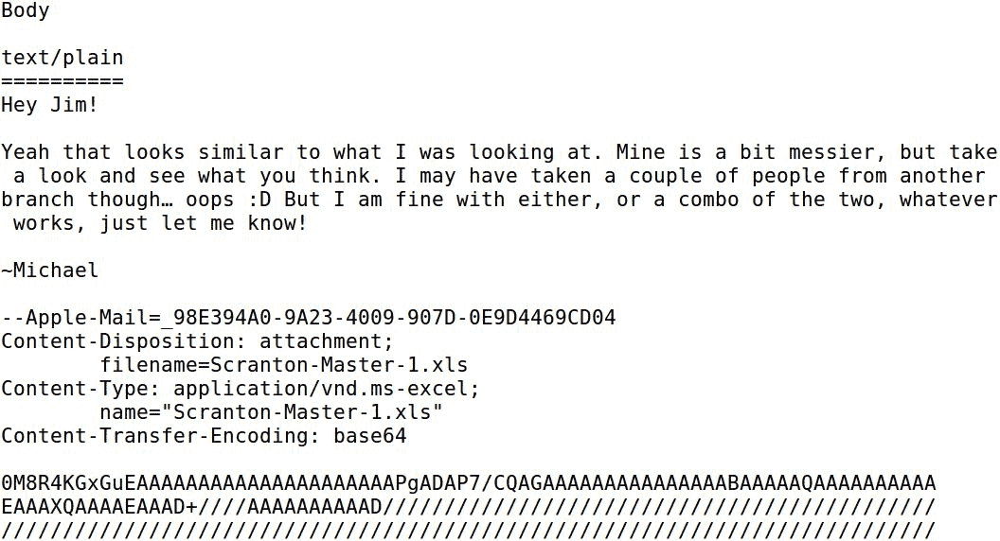
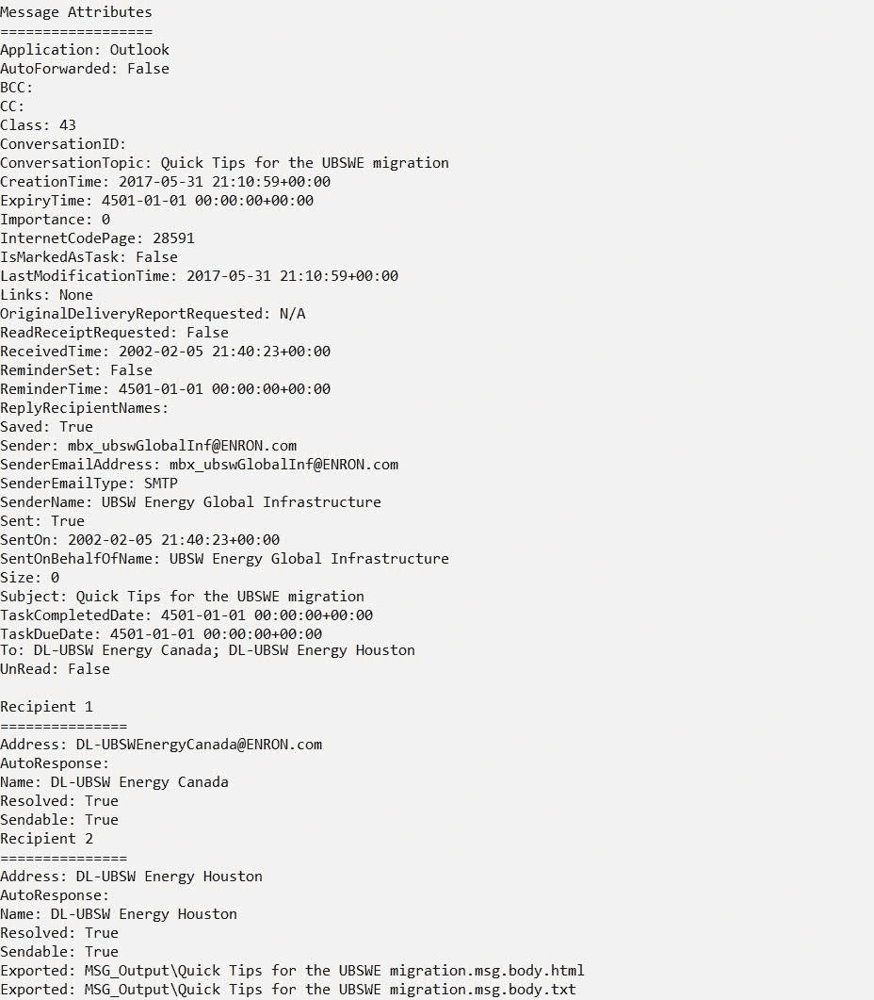
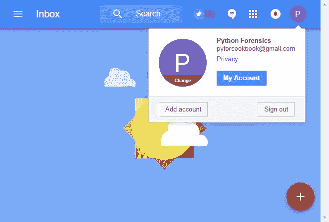
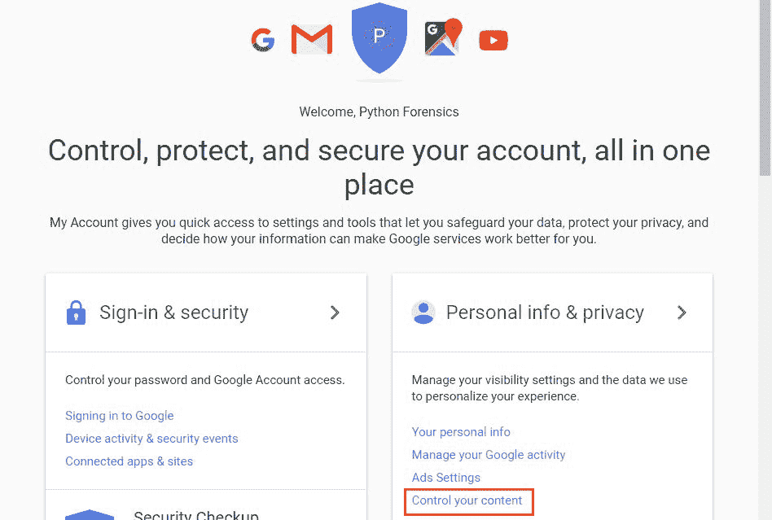
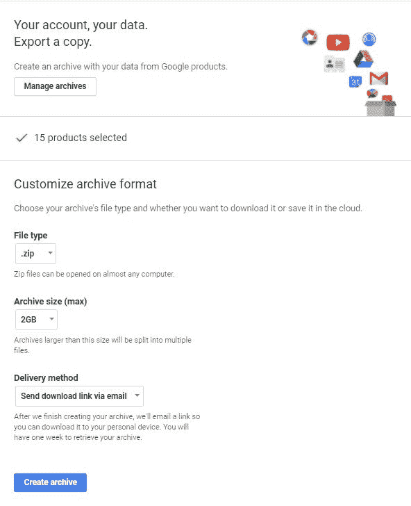

# 阅读电子邮件并记下菜谱上的名字

本章介绍了以下配方：

*   解析 EML 文件
*   查看 MSG 文件
*   订购外卖
*   盒子里有什么？
*   分析 PST 和 OST 邮箱

# 介绍

他说，她说，一旦电脑证据被添加到争论中，游戏经常被扔出窗外。电子邮件在大多数类型的调查中起着重要作用。电子邮件证据扩展到商业和个人设备，因为它被广泛用于发送文件、与同行通信以及接收在线服务的通知。通过检查电子邮件，我们可以了解保管人使用的社交媒体、云存储或其他网站。我们还可以在组织外部查找数据外泄，或者调查钓鱼计划的来源。

本章将介绍用于调查的公开这些信息的配方，包括：

*   使用内置库读取 EML 格式
*   利用`win32com`库从 Outlook MSG 文件中提取信息
*   用外卖保存 Google Gmail 并解析保存
*   使用内置库读取 MBOX 容器
*   使用`libpff`读取 PST 文件

Visit [www.packtpub.com/books/content/support](http://www.packtpub.com/books/content/support) to download the code bundle for this chapter.

# 解析 EML 文件

食谱难度：简单

Python 版本：2.7 或 3.5

操作系统：任何

EML 文件格式广泛用于存储电子邮件，因为它是一种结构化文本文件，可跨多个电子邮件客户端兼容。此文本文件以纯文本形式存储电子邮件标题、正文内容和附件数据，使用`base64`编码二进制数据，使用**引用的可打印**（**QP**编码存储内容信息。

# 开始

此脚本中使用的所有库都存在于 Python 的标准库中。我们将使用内置的`email`库从 EML 文件中读取和提取关键信息。

To learn more about the `email` library, visit [https://docs.python.org/3/library/email.html](https://docs.python.org/3/library/email.html).

# 怎么做。。。

要创建 EML 解析器，我们必须：

1.  接受 EML 文件的参数。
2.  从标题中读取值。
3.  解析来自 EML 每个部分的信息。
4.  在控制台中显示此信息以便于查看。

# 它是如何工作的。。。

我们首先导入用于参数处理、EML 处理和解码 base64 编码数据的库。`email`库提供读取 EML 文件所需的类和方法。我们将使用`message_from_file()`函数解析提供的 EML 文件中的数据。`Quopri`是本书的一个新库，我们使用它来解码 HTML 正文和附件中的 QP 编码值。正如人们所料，`base64`库允许我们解码任何 base64 编码的数据：

```py
from __future__ import print_function
from argparse import ArgumentParser, FileType
from email import message_from_file
import os
import quopri
import base64
```

此配方的命令行处理程序接受一个位置参数`EML_FILE`，它表示我们将处理的 EML 文件的路径。我们使用`FileType`类为我们处理文件的打开：

```py
if __name__ == '__main__':
    parser = ArgumentParser(
        description=__description__,
        epilog="Developed by {} on {}".format(
            ", ".join(__authors__), __date__)
    )
    parser.add_argument("EML_FILE",
                        help="Path to EML File", type=FileType('r'))
    args = parser.parse_args()

    main(args.EML_FILE)
```

在`main()`函数中，我们使用`message_from_file()`函数将类似文件的对象读入`email`库。我们现在可以使用结果变量`emlfile`来访问标题、正文内容、附件和其他有效负载信息。阅读电子邮件标题只需通过库的`_headers`属性提供的字典进行迭代。要处理正文内容，我们必须检查此消息是否包含多个有效载荷，如果是，则将每个有效载荷传递给指定的处理功能`process_payload()`：

```py
def main(input_file):
    emlfile = message_from_file(input_file)

    # Start with the headers
    for key, value in emlfile._headers:
        print("{}: {}".format(key, value))

    # Read payload
    print("\nBody\n")
    if emlfile.is_multipart():
        for part in emlfile.get_payload():
            process_payload(part)
    else:
        process_payload(emlfile[1])
```

`process_payload()`函数首先使用`get_content_type()`方法提取消息的 MIME 类型。我们将此值打印到控制台，并在换行符上打印大量的`"="`字符，以区分此值和消息的其余部分。

在一行中，我们使用`get_payload()`方法提取消息正文内容，并使用`quopri.decodestring()`功能解码 QP 编码数据。然后，我们检查是否存在数据的字符集，如果确定了字符集，则在指定字符集的同时对内容使用`decode()`方法。如果编码未知，我们将尝试使用 UTF8 解码对象，UTF8 是将`decode()`方法留空时的默认值，Windows-1252：

```py
def process_payload(payload):
    print(payload.get_content_type() + "\n" + "=" * len(
        payload.get_content_type()))
    body = quopri.decodestring(payload.get_payload())
    if payload.get_charset():
        body = body.decode(payload.get_charset())
    else:
        try:
            body = body.decode()
        except UnicodeDecodeError:
            body = body.decode('cp1252')
```

通过解码数据，我们检查内容 MIME 类型以正确处理电子邮件的存储。HTML 信息的第一个条件由`text/html`MIME 类型指定，它被写入与输入文件位于同一目录中的 HTML 文档中。在第二种情况下，我们在`Application`MIME 类型下处理二进制数据。该数据以`base64`编码值的形式传输，我们在使用`base64.b64decode()`函数写入当前目录中的文件之前对其进行解码。二进制数据具有`get_filename()`方法，我们可以使用该方法准确命名附件。请注意，第一种类型的输出文件必须以`"w"`模式打开，第二种类型的输出文件必须以`"wb"`模式打开。如果 MIME 类型与我们在这里介绍的不同，我们将正文打印到控制台：

```py
    if payload.get_content_type() == "text/html":
        outfile = os.path.basename(args.EML_FILE.name) + ".html"
        open(outfile, 'w').write(body)
    elif payload.get_content_type().startswith('application'):
        outfile = open(payload.get_filename(), 'wb')
        body = base64.b64decode(payload.get_payload())
        outfile.write(body)
        outfile.close()
        print("Exported: {}\n".format(outfile.name))
    else:
        print(body)
```

当我们执行这段代码时，我们看到头信息首先打印到控制台，然后是各种有效负载。在本例中，我们首先有一个`text/plain`MIME 内容，其中包含一条示例消息，然后是我们导出的`application/vnd.ms-excel`附件，另一个`text/plain`块显示初始消息：




# 查看 MSG 文件

食谱难度：简单

Python 版本：2.7 或 3.5

操作系统：Windows

电子邮件可以有许多不同的格式。MSG 格式是另一种用于存储邮件内容和附件的流行容器。在本例中，我们将学习使用 Outlook API 解析 MSG 文件。

# 开始

此配方需要安装第三方库`pywin32`。这意味着该脚本仅在 Windows 系统上兼容。我们还需要安装`pywin32,`，正如我们在[第 1 章](01.html#RL0A0-260f9401d2714cb9ab693c4692308abe)、*基本脚本和文件信息配方*中所做的那样。

要安装`pywin32`，我们需要访问其 SourceForge 页面[https://sourceforge.net/projects/pywin32/](https://sourceforge.net/projects/pywin32/) 并下载与 Python 安装相匹配的版本。为了检查 Python 版本，我们可以导入`sys`模块并在解释器中调用`sys.version`。选择正确的`pywin32`安装程序时，版本和体系结构都很重要。我们还想确认我们的机器上安装了有效的 Outlook，因为`pywin32`绑定依赖于 Outlook 提供的资源。我们已经准备好在运行`pywin32`安装程序后创建脚本。

# 怎么做。。。

要创建 MSG 解析器，我们必须：

1.  接受 MSG 文件的参数。
2.  将有关 MSG 文件的常规元数据打印到控制台。
3.  将特定于收件人的元数据打印到控制台。
4.  将消息内容导出到输出文件。
5.  将邮件中嵌入的任何附件导出到相应的输出文件。

# 它是如何工作的。。。

我们首先导入用于参数处理的库`argparse`和`os`，然后从`pywin32`导入`win32com`库。我们还导入了`pywintypes`库以正确捕获和处理`pywin32`错误：

```py
from __future__ import print_function
from argparse import ArgumentParser
import os
import win32com.client
import pywintypes
```

此配方的命令行处理程序接受两个位置参数`MSG_FILE`和`OUTPUT_DIR`，它们分别表示要处理的 MSG 文件的路径和所需的输出文件夹。我们检查所需的输出文件夹是否存在，如果不存在，则创建它。然后，我们将两个输入传递给`main()`函数：

```py
if __name__ == '__main__':
    parser = ArgumentParser(
        description=__description__,
        epilog="Developed by {} on {}".format(
            ", ".join(__authors__), __date__)
    )
    parser.add_argument("MSG_FILE", help="Path to MSG file")
    parser.add_argument("OUTPUT_DIR", help="Path to output folder")
    args = parser.parse_args()
    out_dir = args.OUTPUT_DIR
    if not os.path.exists(out_dir):
        os.makedirs(out_dir)
    main(args.MSG_FILE, args.OUTPUT_DIR)
```

在`main()`函数中，我们调用`win32com`库来设置 Outlook API，并以允许访问`MAPI`命名空间的方式对其进行配置。使用此`mapi`变量，我们可以使用`OpenSharedItem()`方法打开一个`MSG`文件，并创建一个对象，我们将用于此配方中的其他函数。这些功能包括：`display_msg_attribs()`、`display_msg_recipients()`、`extract_msg_body()`和`extract_attachments()`。现在让我们依次关注这些函数中的每一个，看看它们是如何工作的：

```py
def main(msg_file, output_dir):
    mapi = win32com.client.Dispatch(
        "Outlook.Application").GetNamespace("MAPI")
    msg = mapi.OpenSharedItem(os.path.abspath(args.MSG_FILE))
    display_msg_attribs(msg)
    display_msg_recipients(msg)
    extract_msg_body(msg, output_dir)
    extract_attachments(msg, output_dir)
```

`display_msg_attribs()`功能允许我们显示消息的各种属性（主题、收件人、密件抄送、大小等）。这些属性中的一些可能不存在于我们正在解析的消息中，但是，不管怎样，我们都会尝试导出所有值。`attribs`列表按顺序显示我们试图从消息访问的属性。当我们迭代每个属性时，我们在`msg`对象上使用内置的`getattr()`方法，并尝试提取相关值（如果存在），如果不存在，则提取`"N/A"`。然后，我们将属性及其确定的值打印到控制台。作为警告，其中一些值可能存在，但仅设置为默认值，例如某些日期的年份`4501`：

```py
def display_msg_attribs(msg):
    # Display Message Attributes
    attribs = [
        'Application', 'AutoForwarded', 'BCC', 'CC', 'Class',
        'ConversationID', 'ConversationTopic', 'CreationTime',
        'ExpiryTime', 'Importance', 'InternetCodePage', 'IsMarkedAsTask',
        'LastModificationTime', 'Links', 'OriginalDeliveryReportRequested',
        'ReadReceiptRequested', 'ReceivedTime', 'ReminderSet',
        'ReminderTime', 'ReplyRecipientNames', 'Saved', 'Sender',
        'SenderEmailAddress', 'SenderEmailType', 'SenderName', 'Sent',
        'SentOn', 'SentOnBehalfOfName', 'Size', 'Subject',
        'TaskCompletedDate', 'TaskDueDate', 'To', 'UnRead'
    ]
    print("\nMessage Attributes")
    print("==================")
    for entry in attribs:
        print("{}: {}".format(entry, getattr(msg, entry, 'N/A')))
```

`display_msg_recipients()`函数遍历消息并显示收件人详细信息。`msg`对象提供了一个`Recipients()`方法，该方法接受一个整数参数来通过索引访问收件人。使用`while`循环，我们尝试加载和显示可用收件人的值。对于在前面的函数中找到的每个接收者，我们使用`getattr()`方法和一个名为`recipient_attrib`的属性列表来提取和打印相关值，或者，如果它们不存在，则为它们分配值`"N/A"`。尽管大多数 Python 可重用性使用零作为第一个索引，`Recipients()`方法从`1`开始。因此，变量`i`将从`1`开始递增，直到找不到其他接收者。我们将继续尝试读取这些值，直到收到`pywin32`错误：

```py
def display_msg_recipients(msg):
    # Display Recipient Information
    recipient_attrib = [
        'Address', 'AutoResponse', 'Name', 'Resolved', 'Sendable'
    ]
    i = 1
    while True:
        try:
            recipient = msg.Recipients(i)
        except pywintypes.com_error:
            break

        print("\nRecipient {}".format(i))
        print("=" * 15)
        for entry in recipient_attrib:
            print("{}: {}".format(entry, getattr(recipient, entry, 'N/A')))
        i += 1
```

`extract_msg_body()`功能用于从消息中提取正文内容。`msg`对象以几种不同的格式公开主体内容；在这个配方中，我们将使用`HTMLBody()`方法导出 HTML，并使用`Body()`方法导出正文的纯文本版本。由于这些对象是字节字符串，我们必须首先对它们进行解码，这是我们对`cp1252`代码页所做的。使用解码的内容，我们在用户指定的目录中打开输出文件进行写入，并创建相应的`*.body.html`和`*.body.txt`文件：

```py
def extract_msg_body(msg, out_dir):
    # Extract HTML Data
    html_data = msg.HTMLBody.encode('cp1252')
    outfile = os.path.join(out_dir, os.path.basename(args.MSG_FILE))
    open(outfile + ".body.html", 'wb').write(html_data)
    print("Exported: {}".format(outfile + ".body.html"))

    # Extract plain text
    body_data = msg.Body.encode('cp1252')
    open(outfile + ".body.txt", 'wb').write(body_data)
    print("Exported: {}".format(outfile + ".body.txt"))
```

最后，`extract_attachments()`函数将附件数据从 MSG 文件导出到所需的输出目录。使用`msg`对象，我们再次创建一个列表`attachment_attribs`，表示一个附件的一系列属性。与 recipient 函数类似，我们使用一个`while`循环和`Attachments()`方法，该方法接受一个整数作为参数，通过索引选择一个附件，并遍历每个附件。正如我们之前在`Recipients()`方法中看到的，`Attachments()`方法的索引从`1`开始。因此，变量`i`将从`1`开始递增，直到找不到其他附件：

```py
def extract_attachments(msg, out_dir):
    attachment_attribs = [
        'DisplayName', 'FileName', 'PathName', 'Position', 'Size'
    ]
    i = 1 # Attachments start at 1
    while True:
        try:
            attachment = msg.Attachments(i)
        except pywintypes.com_error:
            break
```

对于每个附件，我们将其属性打印到控制台。我们提取和打印的属性在本函数开头的`attachment_attrib`列表中定义。打印可用附件详细信息后，我们使用`SaveAsFile()`方法写入其内容，并向其提供包含输出路径和所需输出附件名称的字符串（使用`FileName`属性获得）。在此之后，我们准备进入下一个附件，因此我们增加变量`i`并尝试访问下一个附件。

```py
        print("\nAttachment {}".format(i))
        print("=" * 15)
        for entry in attachment_attribs:
            print('{}: {}'.format(entry, getattr(attachment, entry,
                                                 "N/A")))
        outfile = os.path.join(os.path.abspath(out_dir),
                               os.path.split(args.MSG_FILE)[-1])
        if not os.path.exists(outfile):
            os.makedirs(outfile)
        outfile = os.path.join(outfile, attachment.FileName)
        attachment.SaveAsFile(outfile)
        print("Exported: {}".format(outfile))
        i += 1
```

执行此代码时，我们会看到以下输出，以及输出目录中的几个文件。这包括正文文本和 HTML，以及任何发现的附件。消息及其附件的属性显示在控制台窗口中。



# 还有更多。。。

这个脚本可以进一步改进。我们提供了以下一项或多项建议：

*   考虑通过引用 MSDN 上的 MSG 对象的属性在解析器中添加更多字段。https://msdn.microsoft.com/en-us/library/microsoft.office.interop.outlook.mailitem_properties.aspx

# 另见

存在用于访问 MSG 文件的其他库，包括`Redemption`库。该库提供了访问头信息的处理程序，以及本示例中显示的许多相同属性。

# 订购外卖

食谱难度：简单

Python 版本：不适用

操作系统：任何

谷歌邮件，俗称 Gmail，是应用更广泛的网络邮件服务之一。Gmail 账户不仅可以作为电子邮件地址，还可以作为进入谷歌提供的一系列其他服务的网关。除了通过网络或**互联网消息访问协议****IMAP**和**邮局协议****POP**邮件协议提供邮件访问外，谷歌还开发了一个系统，用于存档和获取存储在 Gmail 账户中的邮件和其他相关数据。

# 开始

信不信由你，这个食谱实际上不涉及任何 Python，而是需要一个浏览器和一个 Google 帐户。这个配方的目的是获取 MBOX 格式的 Google 帐户邮箱，我们将在下一个配方中对其进行解析。

# 怎么做。。。

要启动 Google 外卖，我们将遵循以下步骤：

1.  登录到有问题的 Google 帐户。
2.  导航到帐户设置和创建存档功能。
3.  选择所需的 Google 产品进行归档并开始此过程。
4.  下载存档数据。

# 它是如何工作的。。。

我们通过登录帐户并选择 My account 选项来启动 Google 外卖流程。我们也可以导航到[https://myaccount.google.com](https://myaccount.google.com) 如果“我的帐户”选项不存在：



在“我的帐户”仪表板上，我们选择“个人信息和隐私”部分下的“控制您的内容”链接：



在“控制您的内容”部分中，我们可以选择创建归档。这就是我们开始收集谷歌外卖的地方：


选择此选项时，我们将看到一个管理现有档案或生成新档案的选项。当生成一个新产品时，我们会看到每个希望包含的谷歌产品的复选框。下拉箭头提供更改导出格式或内容的子菜单。例如，我们可以选择如何将 Google Drive 文档导出为 Microsoft Word、PDF 或纯文本格式。在本例中，我们将保留默认选项，确保邮件选项设置为收集所有邮件：


选择所需的内容后，我们可以配置归档文件的格式。Google Takeout 允许我们选择归档文件类型和最大段大小，以便于下载和访问。我们还可以选择访问外卖的方式。此选项可设置为向正在存档的帐户发送下载链接（默认选项），或将存档上载到帐户的 Google Drive 或其他第三方云服务，这可能会修改更多信息以保留此数据。我们选择接收电子邮件，然后选择“创建存档”开始此过程！



现在我们必须等待。根据所保存数据的大小，这可能需要相当长的时间，因为 Google 必须为您收集、转换和压缩所有数据。

收到通知电子邮件后，请选择提供的链接以下载存档。此存档仅在有限的时间内可用，因此在收到通知后立即收集它非常重要。


下载数据后，提取归档文件的内容，查看内部文件夹结构和提供的数据。所选的每个产品都有一个文件夹，其中包含该产品的相关内容或文件夹结构。在本例中，我们最感兴趣的是以 MBOX 格式提供的邮件。在下一个菜谱中，我们将展示如何使用 Python 解析这个 MBOX 数据。

# 还有更多。。。

如果您希望本次收购采用更直接的路线，您可以导航至[https://takeout.google.com/settings/takeout](https://takeout.google.com/settings/takeout) 登录账号后。从这里你可以选择出口的产品。

# 盒子里有什么？！

难度：中等

Python 版本：3.5

操作系统：任何

MBOX 文件通常与 UNIX 系统、Thunderbird 和 Google Takeouts 关联。这些 MBOX 容器是具有特殊格式的文本文件，用于分割存储在其中的消息。由于构建 MBOX 文件有多种格式，我们的脚本将使用前面配方的输出，重点关注来自 Google Takeout 的格式。

# 开始

此脚本中使用的所有库都存在于 Python 的标准库中。我们使用内置的`mailbox`库解析 Google Takeout 结构化 MBOX 文件。

To learn more about the `mailbox` library, visit [https://docs.python.org/3/library/mailbox.html](https://docs.python.org/3/library/mailbox.html).

# 怎么做。。。

要实现此脚本，我们必须：

1.  设计参数以接受 MBOX 文件的文件路径，并输出报告及其内容。
2.  开发一个处理编码数据的自定义 MBOX 阅读器。
3.  提取包含附件名称的消息元数据。
4.  将附件写入输出目录。
5.  创建 MBOX 元数据报告。

# 它是如何工作的。。。

我们首先导入用于参数处理的库，然后是创建脚本输出所需的`os`、`time`和`csv`库。接下来，我们导入`mailbox`库来解析 MBOX 消息格式，`base64`来解码附件中的二进制数据。最后，我们引入`tqdm`库，提供与消息解析状态相关的进度条：

```py
from __future__ import print_function
from argparse import ArgumentParser
import mailbox
import os
import time
import csv
from tqdm import tqdm
import base64
```

此配方的命令行处理程序接受两个位置参数`MBOX`和`OUTPUT_DIR`，它们分别表示要处理的 MBOX 文件的路径和所需的输出文件夹。这两个参数都被传递到`main()`函数以启动脚本：

```py
if __name__ == '__main__':
    parser = ArgumentParser(
        description=__description__,
        epilog="Developed by {} on {}".format(
            ", ".join(__authors__), __date__)
    )
    parser.add_argument("MBOX", help="Path to mbox file")
    parser.add_argument("OUTPUT_DIR",
                        help="Path to output directory to write report "
                        "and exported content")
    args = parser.parse_args()

    main(args.MBOX, args.OUTPUT_DIR)
```

`main()`函数以调用`mailbox`库的`mbox`类开始。使用这个类，我们可以通过提供文件的路径和工厂的可选参数来解析 MBOX 文件，在我们的例子中，工厂是一个自定义读取器函数。使用这个库，我们现在有了一个 iterable 对象，其中包含可以与之交互的消息对象。我们使用内置的`len()`方法打印 MBOX 文件中包含的消息数。我们先来看看`custom_reader()`函数是如何工作的：

```py
def main(mbox_file, output_dir):
    # Read in the MBOX File
    print("Reading mbox file...")
    mbox = mailbox.mbox(mbox_file, factory=custom_reader)
    print("{} messages to parse".format(len(mbox)))
```

这个配方需要很多函数才能发挥作用（请看我们在那里做了什么…），但是`custom_reader()`方法与其他方法有点不同。此函数是`mailbox`库的读取器方法。我们需要创建此函数，因为默认读取器不处理编码，例如`cp1252`。我们可以将其他编码添加到此读取器中，尽管 ASCII 和`cp1252`是 MBOX 文件最常见的两种编码。

在对输入数据流使用`read()`方法后，它尝试使用 ASCII 码页对数据进行解码。如果不成功，它将依赖`cp1252`代码页完成任务。通过向`decode()`方法提供`errors`关键字并将其设置为`"replace"`，使用`cp1252`代码页解码时遇到的任何错误将被替换字符`U+FFFD`替换。我们使用`mailbox.mboxMessage()`函数以适当的格式返回解码内容：

```py
def custom_reader(data_stream):
    data = data_stream.read()
    try:
        content = data.decode("ascii")
    except (UnicodeDecodeError, UnicodeEncodeError) as e:
        content = data.decode("cp1252", errors="replace")
    return mailbox.mboxMessage(content)
```

回到`main()`函数中，我们在开始处理消息之前准备了一些变量。即设置`parsed_data`结果列表，为附件创建输出目录，为 MBOX 元数据报告定义`columns`。这些列还将用于使用`get()`方法从消息中提取信息。其中两列不会从 message 对象提取信息，而是包含处理附件后分配的数据。为了保持一致性，我们将在`columns`列表中保留这些值，因为它们将默认为`"N/A"`值：

```py
    parsed_data = []
    attachments_dir = os.path.join(output_dir, "attachments")
    if not os.path.exists(attachments_dir):
        os.makedirs(attachments_dir)
    columns = ["Date", "From", "To", "Subject", "X-Gmail-Labels",
               "Return-Path", "Received", "Content-Type", "Message-ID",
               "X-GM-THRID", "num_attachments_exported", "export_path"]
```

当我们开始遍历消息时，我们实现一个`tqdm`进度条来跟踪迭代过程。由于`mbox`对象具有长度属性，因此我们不需要为`tqdm`提供任何附加参数。在循环内部，我们定义`msg_data`字典来存储消息结果，然后尝试通过第二个`for`循环来分配消息属性，使用`get()`方法查询`header_data`字典中的`columns`键：

```py
    for message in tqdm(mbox):
        # Preserve header information
        msg_data = dict()
        header_data = dict(message._headers)
        for hdr in columns:
            msg_data[hdr] = header_data.get(hdr, "N/A")
```

接下来，在`if`语句中，我们检查`message`是否有有效负载，如果有，我们使用`write_payload()`方法为其提供`message`对象和输出附件目录作为输入。如果`message`不存在有效载荷，两个附件相关列将保留默认`"N/A"`值。否则，我们将计算找到的附件数量，并将其路径列表合并到逗号分隔的列表中：

```py
        if len(message.get_payload()):
            export_path = write_payload(message, attachments_dir)
            msg_data['num_attachments_exported'] = len(export_path)
            msg_data['export_path'] = ", ".join(export_path)
```

处理完每条消息后，其数据将附加到`parsed_data`列表中。处理完每条消息后，调用`create_report()`方法并传递`parsed_data`列表和所需的输出 CSV 名称。让我们回过头来看看`write_payload()`方法：

```py
        parsed_data.append(msg_data)

    # Create CSV report
    create_report(
        parsed_data, os.path.join(output_dir, "mbox_report.csv"), columns
    )
```

由于消息可以有各种各样的有效负载，我们需要设计一个专门的函数来处理各种类型的`MIME`。`write_payload()`方法就是这样一个函数。此功能首先使用`get_payload()`方法提取有效负载，并执行快速检查，查看有效负载内容是否由多个部分组成。如果是，我们递归调用此函数来处理每个小节，方法是迭代有效负载并将输出附加到`export_path`变量：

```py
def write_payload(msg, out_dir):
    pyld = msg.get_payload()
    export_path = []
    if msg.is_multipart():
        for entry in pyld:
            export_path += write_payload(entry, out_dir)
```

如果负载不是多部分的，我们将使用`get_content_type()`方法确定其 MIME 类型，并创建逻辑以按类别适当地处理数据源。数据类型，包括应用程序、图像和视频，通常表示为`base64`编码数据，允许二进制信息作为 ASCII 字符传输。出于这个原因，大多数格式，包括文本类别中的一些格式，都要求我们在提供数据供编写之前对其进行解码。在其他情况下，数据已经作为字符串存在，并且可以按原样写入文件。无论如何，该方法通常是相同的，数据被解码（如果需要）并使用`export_content()`方法将其内容写入文件系统。最后，表示导出项路径的字符串被附加到`export_path`列表中：

```py
    else:
        content_type = msg.get_content_type()
        if "application/" in content_type.lower():
            content = base64.b64decode(msg.get_payload())
            export_path.append(export_content(msg, out_dir, content))
        elif "img/" in content_type.lower():
            content = base64.b64decode(msg.get_payload())
            export_path.append(export_content(msg, out_dir, content))
        elif "video/" in content_type.lower():
            content = base64.b64decode(msg.get_payload())
            export_path.append(export_content(msg, out_dir, content))
        elif "audio/" in content_type.lower():
            content = base64.b64decode(msg.get_payload())
            export_path.append(export_content(msg, out_dir, content))
        elif "text/csv" in content_type.lower():
            content = base64.b64decode(msg.get_payload())
            export_path.append(export_content(msg, out_dir, content))
        elif "info/" in content_type.lower():
            export_path.append(export_content(msg, out_dir,
                                              msg.get_payload()))
        elif "text/calendar" in content_type.lower():
            export_path.append(export_content(msg, out_dir,
                                              msg.get_payload()))
        elif "text/rtf" in content_type.lower():
            export_path.append(export_content(msg, out_dir,
                                              msg.get_payload()))
```

`else`语句向有效负载添加额外的`if-elif`语句，以确定导出是否包含文件名。如果是，我们将其视为其他邮件，但是，如果不是，则可能是存储为 HTML 或文本的邮件正文。虽然我们可以通过修改这个部分来导出每个消息体，但它会为这个示例生成大量数据，因此我们选择不导出。一旦我们完成了从消息导出数据，我们将返回导出到`main()`函数的数据的路径列表：

```py
        else:
            if "name=" in msg.get('Content-Disposition', "N/A"):
                content = base64.b64decode(msg.get_payload())
                export_path.append(export_content(msg, out_dir, content))
            elif "name=" in msg.get('Content-Type', "N/A"):
                content = base64.b64decode(msg.get_payload())
                export_path.append(export_content(msg, out_dir, content))

    return export_path
```

`export_content()`函数首先调用`get_filename()`函数，这是一种从`msg`对象提取文件名的方法。对文件名执行附加处理以提取扩展名（如果存在），但如果未找到扩展名，则使用通用的`.FILE`扩展名：

```py
def export_content(msg, out_dir, content_data):
    file_name = get_filename(msg)
    file_ext = "FILE"
    if "." in file_name:
        file_ext = file_name.rsplit(".", 1)[-1]
```

接下来，我们通过集成时间（表示为 Unix 时间整数，后跟确定的文件扩展名），执行其他格式化以创建唯一的文件名。然后，该文件名被连接到输出目录，以形成用于写入输出的完整路径。此唯一文件名确保我们不会错误地覆盖输出目录中已存在的附件：

```py
    file_name = "{}_{:.4f}.{}".format(
        file_name.rsplit(".", 1)[0], time.time(), file_ext)
    file_name = os.path.join(out_dir, file_name)
```

此函数中的最后一段代码处理文件内容的实际导出。此`if`语句根据源类型处理不同的文件模式（`"w"`或`"wb"`。写入数据后，我们返回导出中使用的文件路径。此路径将添加到我们的元数据报告中：

```py
    if isinstance(content_data, str):
        open(file_name, 'w').write(content_data)
    else:
        open(file_name, 'wb').write(content_data)

    return file_name
```

下一个函数`get_filename()`从消息中提取文件名，以准确表示这些文件的名称。文件名可以在`"Content-Disposition"`或`"Content-Type"`属性中找到，通常在前面加上`"name="`或`"filename="`字符串。对于这两个属性，逻辑基本相同。函数首先用一个空格替换任何换行符，然后将字符串拆分为分号和空格。此分隔符通常分隔这些属性中的值。使用列表理解，我们确定哪个元素包含`name=`子字符串，并将其用作文件名：

```py
def get_filename(msg):
    if 'name=' in msg.get("Content-Disposition", "N/A"):
        fname_data = msg["Content-Disposition"].replace("\r\n", " ")
        fname = [x for x in fname_data.split("; ") if 'name=' in x]
        file_name = fname[0].split("=", 1)[-1]

    elif 'name=' in msg.get("Content-Type", "N/A"):
        fname_data = msg["Content-Type"].replace("\r\n", " ")
        fname = [x for x in fname_data.split("; ") if 'name=' in x]
        file_name = fname[0].split("=", 1)[-1]
```

如果这两个内容属性为空，我们将分配一个泛型`NO_FILENAME`并继续准备文件名。提取可能的文件名后，删除所有非字母数字、空格或句点的字符，以防止将文件写入系统时出错。在文件系统安全文件名就绪的情况下，我们返回它，以便在前面讨论的`export_content()`方法中使用：

```py
    else:
        file_name = "NO_FILENAME"

    fchars = [x for x in file_name if x.isalnum() or x.isspace() or
              x == "."]
    return "".join(fchars)
```

最后，我们已经准备好讨论 CSV 元数据报告。`create_report()`函数类似于我们在本书中看到的变体，它使用`DictWriter`类从字典列表创建 CSV 报告。塔达！

```py
def create_report(output_data, output_file, columns):
    with open(output_file, 'w', newline="") as outfile:
        csvfile = csv.DictWriter(outfile, columns)
        csvfile.writeheader()
        csvfile.writerows(output_data)
```

此脚本创建一个 CSV 报告和一个充满附件的目录。第一个屏幕截图显示了 CSV 报告的前几列和几行，以及如何向用户显示数据：


第二个屏幕截图显示了这些行的最后几列，并反映了附件信息的报告方式。可以按照以下文件路径访问相应的附件：


# 分析 PST 和 OST 邮箱

菜谱难度：难

Python 版本：2.7

操作系统：Linux

**个人存储表**（**PST**文件在许多系统上都很常见，可以访问存档的电子邮件。这些文件通常与 Outlook 应用程序关联，包含邮件和附件数据。这些文件通常存在于公司环境中，因为许多业务环境继续利用 Outlook 进行内部和外部电子邮件管理。

# 开始

此方法需要安装`libpff`及其 Python 绑定`pypff`才能正常工作。这个库在 GitHub 上提供了工具和 Python 绑定，用于处理和提取 PST 文件中的数据。为了便于开发，我们将在 Ubuntu 16.04 中使用 Python2 的绑定设置这个库。这个库也可以为 Python3 构建，不过本节我们将使用 Python2 绑定。

在安装所需的库之前，我们必须安装许多依赖项。使用 Ubuntu`apt`包管理器，我们将安装以下八个包。您可能希望将这个 Ubuntu 环境保持在手边，因为我们将广泛使用它[第 8 章](08.html#75QNI0-260f9401d2714cb9ab693c4692308abe)、*处理法医证据容器配方*及更高版本：

```py
sudo apt-get install automake autoconf libtool pkg-config autopoint git python-dev
```

安装依赖项后，导航到 GitHub 存储库并下载库所需的版本。此配方是使用`pypff`库的`libpff-experimental-20161119`版本开发的。接下来，提取版本内容后，打开一个终端并导航到提取的目录，并为版本执行以下命令：

```py
./synclibs.sh
./autogen.sh
sudo python setup.py install 
```

To learn more about the `pypff` library, visit [https://github.com/libyal/libpff](https://github.com/libyal/libpff).

最后，我们可以通过打开 Python 解释器、导入`pypff`并运行`pypff.get_version()`方法来检查库的安装，以确保我们拥有正确的发布版本。

# 怎么做。。。

我们按照以下步骤提取 PST 消息内容：

1.  使用`pypff`为 PST 文件创建句柄。
2.  遍历 PST 中的所有文件夹和邮件。

3.  存储每条消息的相关元数据。
4.  根据 PST 的内容创建元数据报告。

# 它是如何工作的。。。

此脚本首先导入用于参数处理的库、编写电子表格、执行正则表达式搜索和处理 PST 文件：

```py
from __future__ import print_function
from argparse import ArgumentParser
import csv
import pypff
import re
```

此配方的命令行处理程序接受两个位置参数`PFF_FILE`和`CSV_REPORT`，它们分别表示要处理的 PST 文件的路径和所需的输出 CSV 路径。在此配方中，我们放弃了一个`main()`函数，并立即开始使用`pypff.file()`对象实例化`pff_obj`变量。接下来，我们使用`open()`方法并尝试访问用户提供的 PST。我们将此 PST 传递给`process_folders()`方法，并将返回的字典列表存储在`parsed_data`变量中。在`pff_obj`变量上使用`close()`方法后，我们使用`write_data()`函数通过传递所需的输出 CSV 路径和处理后的数据字典来编写 PST 元数据报告：

```py
if __name__ == '__main__':
    parser = ArgumentParser(
        description=__description__,
        epilog="Developed by {} on {}".format(
            ", ".join(__authors__), __date__)
    )
    parser.add_argument("PFF_FILE", help="Path to PST or OST File")
    parser.add_argument("CSV_REPORT", help="Path to CSV report location")
    args = parser.parse_args()

    # Open file
    pff_obj = pypff.file()
    pff_obj.open(args.PFF_FILE)

    # Parse and close file
    parsed_data = process_folders(pff_obj.root_folder)
    pff_obj.close()

    # Write CSV report
    write_data(args.CSV_REPORT, parsed_data)
```

此配方由几个处理 PST 文件不同元素的函数组成。`process_folders()`函数处理文件夹处理和迭代。在处理这些文件夹时，我们会将它们的名称、子文件夹的数量以及该文件夹中的邮件数量打印到控制台。这可以通过调用`pff_folder`对象上的`number_of_sub_folders`和`number_of_sub_messages`属性来实现：

```py
def process_folders(pff_folder):
    folder_name = pff_folder.name if pff_folder.name else "N/A"
    print("Folder: {} (sub-dir: {}/sub-msg: {})".format(folder_name,
          pff_folder.number_of_sub_folders,
          pff_folder.number_of_sub_messages))
```

在这些打印消息之后，我们设置了`data_list`，它负责存储处理后的消息数据。当我们遍历文件夹中的消息时，我们调用`process_message()`方法用处理过的消息数据创建 dictionary 对象。紧接着，我们将文件夹名称添加到字典中，然后再将其添加到结果列表中。

第二个循环遍历子文件夹，递归调用`process_folders()`函数，并将其传递给要处理的子文件夹，并将结果字典列表附加到`data_list`。这允许我们在返回`data_list`并编写 CSV 报告之前，遍历 PST 并提取所有数据：

```py
    # Process messages within a folder
    data_list = []
    for msg in pff_folder.sub_messages:
        data_dict = process_message(msg)
        data_dict['folder'] = folder_name
        data_list.append(data_dict)

    # Process folders within a folder
    for folder in pff_folder.sub_folders:
        data_list += process_folders(folder)

    return data_list
```

`process_message()`功能负责访问消息的各种属性，包括电子邮件标题信息。正如在前面的配方中所看到的，我们使用对象属性列表来构建结果字典。然后，我们遍历`attribs`字典，并使用`getattr()`方法将适当的键值对附加到`data_dict`字典中。最后，如果存在电子邮件标题（我们使用`transport_headers`属性确定），我们将使用从`process_headers()`函数提取的附加值更新`data_dict`字典：

```py
def process_message(msg):
    # Extract attributes
    attribs = ['conversation_topic', 'number_of_attachments',
               'sender_name', 'subject']
    data_dict = {}
    for attrib in attribs:
        data_dict[attrib] = getattr(msg, attrib, "N/A")

    if msg.transport_headers is not None:
        data_dict.update(process_headers(msg.transport_headers))

    return data_dict
```

`process_headers()`函数最终返回一个包含提取的电子邮件标题数据的字典。此数据显示为键值对，由冒号和空格分隔。由于标题中的内容可能存储在新行上，因此我们使用正则表达式检查行的开头是否有一个键，后跟一个值。如果找不到与模式匹配的键（任意数量的字母或破折号字符后跟冒号），我们会将新值附加到前一个键，因为标题以顺序方式显示信息。在这个函数的末尾，我们有一些特定的代码行，使用`isinstance()`来处理字典值赋值。此代码检查密钥类型，以确保以不会覆盖已与给定密钥关联的任何数据的方式将值分配给密钥：

```py
def process_headers(header):
    # Read and process header information
    key_pattern = re.compile("^([A-Za-z\-]+:)(.*)$")
    header_data = {}
    for line in header.split("\r\n"):
        if len(line) == 0:
            continue

        reg_result = key_pattern.match(line)
        if reg_result:
            key = reg_result.group(1).strip(":").strip()
            value = reg_result.group(2).strip()
        else:
            value = line

        if key.lower() in header_data:
            if isinstance(header_data[key.lower()], list):
                header_data[key.lower()].append(value)
            else:
                header_data[key.lower()] = [header_data[key.lower()],
                                            value]
        else:
            header_data[key.lower()] = value
    return header_data
```

最后，`write_data()`方法负责创建元数据报告。由于电子邮件头解析中可能有大量的列名，因此，如果列表中尚未定义不同的列名，我们将遍历数据并提取不同的列名。使用此方法，我们可以确保不排除来自 PST 的动态信息。在`for`循环中，我们还将值从`data_list`重新分配到`formatted_data_list`，主要是将列表值转换为字符串，以便更轻松地将数据写入电子表格。`csv`库在确保单元格内的逗号被转义并由电子表格应用程序正确处理方面做得很好：

```py
def write_data(outfile, data_list):
    # Build out additional columns
    print("Writing Report: ", outfile)
    columns = ['folder', 'conversation_topic', 'number_of_attachments',
               'sender_name', 'subject']
    formatted_data_list = []
    for entry in data_list:
        tmp_entry = {}

        for k, v in entry.items():
            if k not in columns:
                columns.append(k)

            if isinstance(v, list):
                tmp_entry[k] = ", ".join(v)
            else:
                tmp_entry[k] = v
        formatted_data_list.append(tmp_entry)
```

使用`csv.DictWriter`类，我们打开文件，写入标题，并将每一行写入输出文件：

```py
    # Write CSV report
    with open(outfile, 'wb') as openfile:
        csvfile = csv.DictWriter(openfile, columns)
        csvfile.writeheader()
        csvfile.writerows(formatted_data_list)
```

当此脚本运行时，将生成一个 CSV 报告，该报告的外观应类似于以下屏幕截图所示的报告。水平滚动时，我们可以看到标题行顶部指定的列；特别是对于电子邮件标题列，这些列中的大多数只包含少数值。当您针对环境中的更多电子邮件容器运行此代码时，请记下您处理的 PST 中最有用和最常见的列，以加快分析：


# 还有更多。。。

这一过程可以进一步改进。我们提供了以下一项或多项建议：

*   此库还处理**脱机存储表**（**OST**文件，这些文件通常与 Outlook 脱机存储邮件内容相关。在 OST 文件上查找并测试此脚本，如有必要，对其进行修改以支持此其他常见邮件格式。

# 另见

在本例中，我们还可以利用`Redemtion`库访问 Outlook 中的信息。