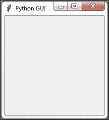
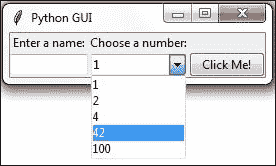
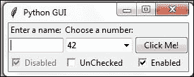
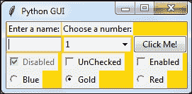
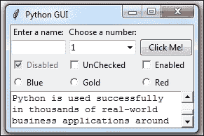

# 一、创建 GUI 表单并添加小部件

在本章中，我们将开始使用 Python 3 创建惊人的 GUI：

*   创建我们的第一个 Python GUI
*   防止调整 GUI 的大小
*   向 GUI 表单添加标签
*   创建按钮并更改其文本属性
*   文本框小部件
*   将焦点设置为小部件并禁用小部件
*   组合框小部件
*   创建具有不同初始状态的检查按钮
*   使用单选按钮小部件
*   使用滚动文本小部件
*   在循环中添加几个小部件

# 导言

在本章中，我们将用 Python 开发第一个 GUI。我们从构建运行的 GUI 应用程序所需的最低代码开始。然后，每个配方将不同的小部件添加到 GUI 表单中。

在前两个配方中，我们展示了整个代码，只包含几行代码。在下面的配方中，我们只显示要添加到前面配方中的代码。

到本章结束时，我们将创建一个工作的 GUI 应用程序，该应用程序由各种状态的标签、按钮、文本框、组合框和复选按钮以及更改 GUI 背景颜色的单选按钮组成。

# 创建我们的第一个 Python GUI

Python 是一种非常强大的编程语言。它附带内置的 tkinter 模块。只需几行代码（准确地说是四行代码），我们就可以构建第一个 Python GUI。

## 准备好了吗

要遵循这个方法，一个工作的 Python 开发环境是一个先决条件。Python 附带的空闲 GUI 足以启动。IDLE 是使用 tkinter 构建的！

### 注

本书中的所有配方都是在 Windows7 64 位操作系统上使用 Python3.4 开发的。它们尚未在任何其他配置上进行测试。由于 Python 是一种跨平台语言，因此每个配方中的代码都可以在任何地方运行。

如果您使用的是 Mac，它确实是 Python 内置的，但是它可能缺少一些模块，比如 tkinter，我们将在本书中使用这些模块。

我们使用的是 Python3，Python 的创建者故意不让它与 Python2 向后兼容。

如果您正在使用 Mac 或 Python 2，您可能必须从[www.Python.org](http://www.python.org)安装 Python 3 才能成功运行本书中的食谱。

## 怎么做。。。

以下是创建结果 GUI 所需的四行 Python 代码：

```py
import tkinter as tk     # 1
win = tk.Tk()            # 2
win.title("Python GUI")  # 3
win.mainloop()           # 4
```

执行此代码并欣赏结果：


## 它是如何工作的。。。

在第 1 行中，我们导入内置的`tkinter`模块并将其别名为`tk`，以简化 Python 代码。在第 2 行中，我们通过调用`Tk`类的构造函数来创建`Tk`类的实例（附在`Tk`后面的括号将该类转换为实例）。我们使用的是别名`tk`，因此不必使用更长的单词`tkinter`。我们正在将类实例分配给名为`win`（窗口的缩写）的变量。由于 Python 是一种动态类型的语言，我们在分配给它之前不必声明这个变量，也不必给它一个特定的类型。*Python 根据该语句*的赋值推断类型。Python 是一种强类型语言，因此每个变量都有一个类型。我们只是不必像在其他语言中那样预先指定它的类型。这使得 Python 成为一种非常强大和高效的编程语言。

### 注

关于类和类型的一点注意事项：

在 Python 中，每个变量都有一个类型。如果不为变量指定类型，则无法创建变量。然而，在 Python 中，我们不必像在 C 编程语言中那样事先声明类型。

Python 足够聪明，可以推断出类型。在撰写本文时，C#也具有这种能力。

使用 Python，我们可以使用`class`关键字而不是`def`关键字创建自己的类。

为了将类分配给变量，我们首先必须创建类的实例。我们创建实例并将该实例分配给变量。

```py
class AClass(object):
    print('Hello from AClass')

classInstance = AClass()
```

现在变量`classInstance`的类型为`AClass`。

如果这听起来令人困惑，不要担心。我们将在接下来的章节中介绍 OOP。

在第 3 行中，我们使用类（`win`的实例变量通过`title`属性为窗口提供标题。在第 4 行中，我们通过调用类实例`win`上的`mainloop`方法来启动窗口的事件循环。到目前为止，在我们的代码中，我们创建了一个实例并设置了一个属性*，但 GUI 将在启动主事件循环*之前不会显示。

### 注

事件循环是使 GUI 工作的机制。我们可以将其视为一个无休止的循环，GUI 正在等待事件发送给它。单击按钮会在 GUI 中创建一个事件，或者正在调整 GUI 大小的 GUI 也会创建一个事件。

我们可以提前编写所有 GUI 代码，在调用这个无止境循环之前，用户屏幕上不会显示任何内容（在上面显示的代码中为`win.mainloop()`）。

当用户单击红色**X**按钮或我们已编程用于结束 GUI 的小部件时，事件循环结束。当事件循环结束时，GUI 也结束。

## 还有更多。。。

这个配方使用了最少的 Python 代码来创建我们的第一个 GUI 程序。然而，在本书中，我们将在有意义的时候使用 OOP。

# 防止 GUI 调整大小

## 准备好了吗

这个配方扩展了前一个配方。因此，有必要自己将配方 1 输入到自己的项目中，或从[下载代码 https://www.packtpub.com/support](https://www.packtpub.com/support) 。

## 怎么做。。。

我们正在阻止调整 GUI 的大小。

```py
import tkinter as tk        # 1 imports

win = tk.Tk()               # 2 Create instance
win.title("Python GUI")     # 3 Add a title       

win.resizable(0, 0)         # 4 Disable resizing the GUI

win.mainloop()              # 5 Start GUI
```

运行代码将创建此 GUI：



## 它是如何工作的。。。

第 4 行防止调整 Python GUI 的大小。

运行此代码将生成一个与我们在配方 1 中创建的 GUI 类似的 GUI。但是，用户无法再调整其大小。另外，请注意窗口工具栏中的“最大化”按钮是如何变灰的。

为什么这很重要？因为，一旦我们将小部件添加到表单中，调整大小可能会使 GUI 看起来不如我们希望的那么好。在下一个食谱中，我们将向 GUI 添加小部件。

`Resizable()`是`Tk()`类的一种方法，通过传入`(0, 0),`我们可以防止 GUI 被调整大小。如果我们传入其他值，我们将硬编码 GUI 的 x 和 y 启动大小，*，但这不会使其无法调整*。

我们还在代码中添加了注释，以准备本书中包含的食谱。

### 注

在 visualstudio.NET 等可视化编程 ide 中，C#程序员通常不会考虑阻止用户调整用这种语言开发的 GUI 的大小。这就产生了劣质的 GUI。添加这一行 Python 代码可以让我们的用户欣赏我们的 GUI。

# 向 GUI 表单添加标签

## 准备好了吗

我们正在扩展第一个配方。我们将保持 GUI 的大小可调，因此不要使用第二个配方中的代码（或注释`win.resizable`第 4 行）。

## 怎么做。。。

为了向我们的 GUI 添加一个`Label`小部件，我们正在从`tkinter`导入`ttk`模块。请注意这两个导入语句。

```py
# imports                  # 1
import tkinter as tk       # 2
from tkinter import ttk    # 3
```

在配方 1 和配方 2 底部的`win.mainloop()`上方添加以下代码。

```py
# Adding a Label           # 4
ttk.Label(win, text="A Label").grid(column=0, row=0) # 5
```

运行代码会在 GUI 中添加一个标签：


## 它是如何工作的。。。

在上述代码的第 3 行中，我们正在从`tkinter`导入一个单独的模块。`ttk`模块有一些先进的小部件，使我们的 GUI 看起来很棒。在某种意义上，`ttk`是`tkinter`中的一个扩展。

我们仍然需要导入`tkinter`本身，但我们必须指定我们现在也要从`tkinter`使用`ttk`。

### 注

`ttk`代表“主题 tk”。它改善了我们的 GUI 外观和感觉。

在我们调用`mainloop`之前，上面第 5 行将标签添加到 GUI 中（此处未显示以保留空间。请参见配方 1 或配方 2）。

我们正在将窗口实例传递给`ttk.Label`构造函数并设置文本属性。这将成为我们`Label`将显示的文本。

我们还使用了*网格布局管理器*，我们将在[第 2 章](02.html "Chapter 2. Layout Management")、*布局管理*中对其进行更深入的探讨。

请注意，我们的 GUI 是如何突然变得比以前的配方小得多的。

它变得如此小的原因是我们在表单中添加了一个小部件。没有小部件，`tkinter`使用默认大小。添加小部件会导致优化，这通常意味着使用尽可能少的空间来显示小部件。

如果我们使标签的文本变长，GUI 将自动展开。我们将在[第 2 章](02.html "Chapter 2. Layout Management")、*版面管理*的后续配方中介绍此自动表单大小调整。

## 还有更多。。。

尝试用标签调整这个 GUI 的大小并最大化它，然后观察会发生什么。

# 创建按钮并更改其文本属性

## 准备好了吗

此配方扩展了前一个配方。您可以从 Packt 发布网站下载整个代码。

## 怎么做。。。

我们正在添加一个按钮，单击该按钮时执行操作。在此配方中，我们将更新在上一配方中添加的标签，以及更新按钮的文本属性。

```py
# Modify adding a Label                                      # 1
aLabel = ttk.Label(win, text="A Label")                      # 2
aLabel.grid(column=0, row=0)                                 # 3

# Button Click Event Callback Function                       # 4
def clickMe():                                               # 5
    action.configure(text="** I have been Clicked! **")
    aLabel.configure(foreground='red')

# Adding a Button                                            # 6
action = ttk.Button(win, text="Click Me!", command=clickMe)  # 7
action.grid(column=1, row=0)                                 # 8
```

在点击按钮前：


单击按钮后，标签的颜色和按钮的文本都已更改。行动


## 它是如何工作的。。。

在第 2 行中，我们现在将标签分配给一个变量，在第 3 行中，我们使用该变量在表单中定位标签。我们需要这个变量来改变它在`clickMe()`函数中的属性。默认情况下，这是一个模块级变量，因此只要在调用它的函数上方声明变量，就可以在函数内部访问它。

第 5 行是单击按钮后调用的事件处理程序。

在第 7 行中，我们创建按钮并将命令绑定到`clickMe()`函数。

### 注

GUI 是事件驱动的。单击按钮创建一个事件。我们使用`ttk.Button`小部件的 command 属性绑定回调函数中发生此事件时发生的情况。注意我们如何不使用括号；只有名称`clickMe`。

我们还将标签的文本更改为包含`red`，就像在印刷本中一样，否则这可能不明显。当您运行代码时，您可以看到颜色确实发生了变化。

第 3 行和第 8 行都使用网格布局管理器，这将在下一章中讨论。这将对齐标签和按钮。

## 还有更多。。。

我们将继续向 GUI 中添加越来越多的小部件，并在本书的其他配方中使用许多内置属性。

# 文本框小部件

在`tkinter`中，典型的文本框小部件称为`Entry`。在这个配方中，我们将把这样一个`Entry`添加到我们的 GUI 中。我们将通过描述`Entry`为用户所做的事情，使我们的标签更加有用。

## 准备好了吗

此配方基于*创建按钮并更改其文本属性*配方。

## 怎么做。。。

```py
# Modified Button Click Function   # 1
def clickMe():                     # 2
    action.configure(text='Hello ' + name.get())

# Position Button in second row, second column (zero-based)
action.grid(column=1, row=1)

# Changing our Label               # 3
ttk.Label(win, text="Enter a name:").grid(column=0, row=0) # 4

# Adding a Textbox Entry widget    # 5
name = tk.StringVar()              # 6
nameEntered = ttk.Entry(win, width=12, textvariable=name) # 7
nameEntered.grid(column=0, row=1)  # 8
```

现在，我们的 GUI 如下所示：


输入一些文本并点击按钮后，GUI 中有如下变化：


## 它是如何工作的。。。

在第 2 行中，我们得到了`Entry`小部件的值。我们还没有使用 OOP，那么为什么我们可以访问一个甚至还没有声明的变量的值呢？

在不使用 OOP 类的情况下，在 Python 过程编码中，我们必须在试图使用该名称的语句上方实际放置一个名称。那么，这是怎么起作用的呢？

答案是按钮单击事件是一个回调函数，当用户单击按钮时，该函数中引用的变量是已知的，并且确实存在。

生活是美好的。

第 4 行为我们的标签提供了一个更有意义的名称，因为现在它描述了它下面的文本框。我们将标签旁边的按钮向下移动，以直观地将两者关联起来。我们仍在使用网格布局管理器，[第 2 章](02.html "Chapter 2. Layout Management")、*布局管理*将对此进行详细说明。

第 6 行创建一个变量`name`。该变量绑定到`Entry`上，在我们的`clickMe()`函数中，我们可以通过调用该变量的`get()`来检索`Entry`框的值。这很有魅力。

现在我们看到，当按钮显示我们输入的全部文本（以及更多文本）时，文本框`Entry`小部件没有展开。原因是我们在第 7 行硬编码为 12 的宽度。

### 注

Python 是一种动态类型化语言，它从赋值中推断类型。这意味着，如果我们为变量`name,`分配一个字符串，那么该变量将是字符串类型，如果我们为`name,`分配一个整数，那么该变量的类型将是整数。

使用 tkinter，我们必须将变量`name`声明为类型`tk.StringVar()`，然后才能成功使用它。原因是 Tkinter 不是 Python。我们可以从 Python 使用它，但它不是同一种语言。

# 将焦点设置为小部件并禁用小部件

虽然我们的 GUI 有了很好的改进，但只要 GUI 一出现，光标就会出现在`Entry`小部件中，这将更加方便和有用。在这里，我们学习如何做到这一点。

## 准备好了吗

此配方扩展了上一配方。

## 怎么做。。。

Python 真的很棒。当 GUI 出现时，我们要做的就是在我们之前创建的`tkinter`小部件的实例上调用`focus()`方法，将焦点设置为特定控件。在我们当前的 GUI 示例中，我们将`ttk.Entry`类实例分配给一个名为`nameEntered`的变量。现在我们可以给它焦点了。

将以下代码放在启动主 windows 事件循环的模块底部的正上方，就像前面的方法一样。如果出现一些错误，请确保在声明变量的代码下面放置对变量的调用。到目前为止，我们还没有使用 OOP，所以这仍然是必要的。以后，就不再需要这样做了。

```py
nameEntered.focus()            # Place cursor into name Entry
```

在 Mac 上，您可能需要先将焦点设置到 GUI 窗口，然后才能将焦点设置到该窗口中的`Entry`小部件。

添加这一行 Python 代码将光标放在文本`Entry`框中，使文本`Entry`框成为焦点。一旦 GUI 出现，我们就可以在这个文本框中键入内容，而无需先点击。


### 注

请注意，光标现在默认位于文本`Entry`框内。

我们还可以禁用小部件。为此，我们在小部件上设置了一个属性。我们可以通过添加以下一行 Python 代码来禁用该按钮：

```py
action.configure(state='disabled')    # Disable the Button Widget
```

添加上述 Python 代码行后，单击按钮不再创建任何操作！


## 它是如何工作的。。。

这段代码是不言自明的。我们将焦点设置为一个控件，并禁用另一个小部件。编程语言中良好的命名有助于消除冗长的解释。在本书的后面，将有一些关于如何在工作中编程或在家中练习编程技能时做到这一点的高级技巧。

## 还有更多。。。

对这只是第一章。未来还有很多。

# 组合框小部件

在此配方中，我们将通过添加具有初始默认值的下拉组合框来改进 GUI。虽然我们可以限制用户只做某些选择，但与此同时，我们可以允许用户输入他们想要的任何内容。

## 准备好了吗

此配方扩展了以前的配方。

## 怎么做。。。

我们正在使用网格布局管理器在`Entry`小部件和`Button`之间插入另一列。下面是 Python 代码。

```py
ttk.Label(win, text="Choose a number:").grid(column=1, row=0)  # 1
number = tk.StringVar()                         # 2
numberChosen = ttk.Combobox(win, width=12, textvariable=number) #3
numberChosen['values'] = (1, 2, 4, 42, 100)     # 4
numberChosen.grid(column=1, row=1)              # 5
numberChosen.current(0)                         # 6
```

将此代码添加到以前的配方中时，将创建以下 GUI。请注意，在前面代码的第 4 行中，我们如何向组合框分配一个具有默认值的元组。这些值随后显示在下拉框中。如果愿意，我们也可以更改它们（在应用程序运行时键入不同的值）。



## 它是如何工作的。。。

第 1 行添加第二个标签以匹配新创建的组合框（在第 3 行中创建）。第 2 行将框的值分配给一个特殊的`tkinter`类型的变量（`StringVar`，正如我们在前面的配方中所做的那样。

第 5 行将两个新控件（标签和组合框）与我们以前的 GUI 布局对齐，第 6 行指定一个默认值，当 GUI 第一次可见时显示。这是`numberChosen['values']`元组的第一个值，字符串`"1"`。我们没有在第 4 行的整数元组周围加引号，但它们被转换成字符串，因为在第 2 行中，我们声明值的类型为`tk.StringVar`。

屏幕截图显示用户所做的选择（**42**。该值被分配给`number`变量。

## 还有更多。。。

如果我们想限制用户只能选择我们在`Combobox`中编程的值，我们可以通过将*状态属性*传递给构造函数来实现。将上一代码中的第 3 行修改为：

```py
numberChosen = ttk.Combobox(win, width=12, textvariable=number, state='readonly')
```

现在用户不能再在`Combobox`中输入值。通过向按钮单击事件回调函数添加以下代码行，可以显示用户选择的值：

```py
# Modified Button Click Callback Function
def clickMe():
    action.configure(text='Hello ' + name.get()+ ' ' + numberChosen.get())
```

选择一个数字，输入一个名称，然后单击按钮，我们会得到以下 GUI 结果，它现在也会显示所选的数字：


# 创建不同初始状态的检查按钮

在这个配方中，我们将添加三个`Checkbutton`小部件，每个小部件具有不同的初始状态。

## 准备好了吗

此配方扩展了以前的配方。

## 怎么做。。。

我们正在创建三个状态不同的`Checkbutton`小部件。第一个是禁用的，并且有一个复选标记。由于小部件已禁用，用户无法删除此复选标记。

第二个`Checkbutton`已启用，默认情况下，其中没有复选标记，但用户可以单击它添加复选标记。

第三个`Checkbutton`默认启用并选中。用户可以随时取消选中并重新检查小部件。

```py
# Creating three checkbuttons    # 1
chVarDis = tk.IntVar()           # 2
check1 = tk.Checkbutton(win, text="Disabled", variable=chVarDis, state='disabled')                     # 3
check1.select()                  # 4
check1.grid(column=0, row=4, sticky=tk.W) # 5

chVarUn = tk.IntVar()            # 6
check2 = tk.Checkbutton(win, text="UnChecked", variable=chVarUn)
check2.deselect()                # 8
check2.grid(column=1, row=4, sticky=tk.W) # 9                  

chVarEn = tk.IntVar()            # 10
check3 = tk.Checkbutton(win, text="Enabled", variable=chVarEn)
check3.select()                  # 12
check3.grid(column=2, row=4, sticky=tk.W) # 13
```

运行新代码将导致以下 GUI：



## 它是如何工作的。。。

在第 2、6 和 10 行中，我们创建了三个类型为`IntVar`的变量。在下一行中，我们为每个变量创建一个`Checkbutton`，传递这些变量。它们将保持`Checkbutton`的状态（未选中或选中）。默认情况下，该值为 0（未选中）或 1（已选中），因此变量类型为`tkinter`整数。

我们将这些`Checkbutton`小部件放置在主窗口中，以便传入构造函数的第一个参数是小部件的父参数；在我们的例子中`win`。我们通过`text`属性为每个`Checkbutton`赋予不同的标签。

将网格的粘性属性设置为`tk.W`意味着小部件将与网格的西部对齐。这与 Java 语法非常相似，这意味着它将向左对齐。当我们调整 GUI 的大小时，小部件将保持在左侧，而不会移向 GUI 的中心。

第 4 行和第 12 行通过在这两个`Checkbutton`类实例上调用`select()`方法，在`Checkbutton`小部件中打勾。

我们继续使用网格布局管理器来安排我们的小部件，这将在[第 2 章](02.html "Chapter 2. Layout Management")、*布局管理*中详细解释。

# 使用单选按钮小部件

在这个配方中，我们将创建三个`tkinter Radiobutton`小部件。我们还将添加一些代码，根据选择的`Radiobutton`更改主窗体的颜色。

## 准备好了吗

此配方扩展了以前的配方。

## 怎么做。。。

我们将在前面的配方中添加以下代码：

```py
# Radiobutton Globals   # 1
COLOR1 = "Blue"         # 2
COLOR2 = "Gold"         # 3
COLOR3 = "Red"          # 4

# Radiobutton Callback  # 5
def radCall():          # 6
   radSel=radVar.get()
   if   radSel == 1: win.configure(background=COLOR1)
   elif radSel == 2: win.configure(background=COLOR2)
   elif radSel == 3: win.configure(background=COLOR3)

# create three Radiobuttons   # 7
radVar = tk.IntVar()          # 8
rad1 = tk.Radiobutton(win, text=COLOR1, variable=radVar, value=1,               command=radCall)              # 9
rad1.grid(column=0, row=5, sticky=tk.W)  # 10

rad2 = tk.Radiobutton(win, text=COLOR2, variable=radVar, value=2, command=radCall)                             # 11
rad2.grid(column=1, row=5, sticky=tk.W)  # 12

rad3 = tk.Radiobutton(win, text=COLOR3, variable=radVar, value=3, command=radCall)                             # 13
rad3.grid(column=2, row=5, sticky=tk.W)  # 14
```

运行此代码并选择名为**Gold**的`Radiobutton`将创建以下窗口：



## 它是如何工作的。。。

在第 2-4 行中，我们创建了一些模块级全局变量，我们将在创建每个单选按钮以及创建更改主窗体背景颜色的操作的回调函数中使用这些变量（使用实例变量`win`。

我们正在使用全局变量来简化代码的更改。通过将颜色的名称指定给一个变量，并在多个位置使用该变量，我们可以轻松地使用不同的颜色进行实验。我们不需要进行全局搜索并替换硬编码字符串（容易出错），只需要更改一行代码，其他一切都可以工作。这就是所谓的**干燥原理**，代表**不要重复自己**。这是一个面向对象的概念，我们将在本书后面的食谱中使用。

### 注

我们分配给变量（`COLOR1`、`COLOR2 …`的颜色名称是`tkinter`关键字（从技术上讲，它们是*符号名称*。如果我们使用的名称不是`tkinter`颜色关键字，那么代码将无法工作。

第 6 行是*回调函数*，它根据用户的选择更改我们的主窗体（`win`的背景。

在第 8 行中，我们正在创建一个`tk.IntVar`变量。重要的是，我们只创建一个变量供所有三个单选按钮使用。从上面的截图可以看出，无论我们选择哪一个`Radiobutton`，其他所有的都会自动为我们取消选择。

第 9 行到第 14 行创建三个单选按钮，将它们分配给主窗体，并传入回调函数中要使用的变量，该函数创建更改主窗口背景的操作。

### 注

虽然这是第一个改变小部件颜色的方法，但老实说，它看起来有点难看。本书中的以下大部分食谱解释了如何使我们的 GUI 看起来真正令人惊叹。

## 还有更多。。。

以下是一个可用符号颜色名称的小样本，您可以在 tcl 官方手册页面上查看：

[http://www.tcl.tk/man/tcl8.5/TkCmd/colors.htm](http://www.tcl.tk/man/tcl8.5/TkCmd/colors.htm)

<colgroup><col style="text-align: left"> <col style="text-align: left"> <col style="text-align: left"> <col style="text-align: left"></colgroup> 
| 

名称

 | 

红色

 | 

绿色

 | 

蓝色

 |
| --- | --- | --- | --- |
| 爱丽丝蓝 | 240 | 248 | 255 |
| 愛麗絲藍 | 240 | 248 | 255 |
| 蓝色 | 0 | 0 | 255 |
| 金 | 255 | 215 | 0 |
| 红色 | 255 | 0 | 0 |

一些的名称创建了相同的颜色，因此`alice blue`创建了与`AliceBlue`相同的颜色。在这个配方中，我们使用了符号名`Blue`、`Gold`和`Red`。

# 使用滚动文本小部件

`ScrolledText`小部件比简单的`Entry`小部件大得多，并且跨越多行。它们是记事本和换行符之类的小部件，当文本大于`ScrolledText`小部件的高度时，会自动启用垂直滚动条。

## 准备好了吗

此配方扩展了以前的配方。你可以从 Packt 出版网站下载本书每一章的代码。

## 怎么做。。。

通过添加以下代码行，我们创建了一个`ScrolledText`小部件：

```py
# Add this import to the top of the Python Module    # 1
from tkinter import scrolledtext      # 2

# Using a scrolled Text control       # 3
scrolW  = 30                          # 4
scrolH  =  3                          # 5
scr = scrolledtext.ScrolledText(win, width=scrolW, height=scrolH, wrap=tk.WORD)                         # 6
scr.grid(column=0, columnspan=3)      # 7
```

我们实际上可以在我们的小部件中输入，如果我们输入足够的单词，这些行将自动环绕！


一旦我们输入的字数超过小部件显示的高度，垂直滚动条就会启用。这一切都是开箱即用的，我们不需要编写更多的代码来实现这一点。



## 它是如何工作的。。。

在第 2 行中，我们导入包含`ScrolledText`小部件类的模块。将其添加到模块顶部，就在其他两条`import`语句的下方。

第 4 行和第 5 行定义了我们将要创建的`ScrolledText`小部件的宽度和高度。这些是硬编码的值，我们正在第 6 行传递给`ScrolledText`小部件构造函数。

这些数值是通过实验发现的有效的*幻数*。您可以将`srcolW`从 30 改为 50 进行实验，观察效果！

在第 6 行中，我们通过传入`wrap=tk.WORD`在小部件上设置属性。

通过将`wrap`属性设置为`tk.WORD`，我们告诉`ScrolledText`小部件按单词断行，这样我们就不会在单词中缠绕。默认选项是 OutT3A.它封装了任何字符，而不管我们是否处于单词的中间。

第二个屏幕截图显示垂直滚动条向下移动，因为我们正在阅读一个较长的文本，该文本不完全符合我们创建的`SrolledText`控件的 x、y 维度。

对于`SrolledText`小部件，将网格小部件的`columnspan`属性设置为`3`，使该小部件跨越所有三列。如果我们没有设置这个属性，我们的`SrolledText`小部件将只驻留在第一列中，这不是我们想要的。

# 在循环中添加几个小部件

到目前为止我们已经创建了几个相同类型的小部件（例如`Radiobutton`），基本上是复制和粘贴相同的代码，然后修改变体（例如列号）。在这个方法中，我们开始重构代码，以减少冗余。

## 准备好了吗

我们正在重构前一个配方的部分代码，因此您需要将该代码应用于此配方。

## 怎么做。。。

```py
# First, we change our Radiobutton global variables into a list.
colors = ["Blue", "Gold", "Red"]              # 1

# create three Radiobuttons using one variable
radVar = tk.IntVar()

Next we are selecting a non-existing index value for radVar.
radVar.set(99)                                # 2

Now we are creating all three Radiobutton widgets within one loop.

for col in range(3):                          # 3
    curRad = 'rad' + str(col)  
    curRad = tk.Radiobutton(win, text=colors[col], variable=radVar,     value=col, command=radCall)
    curRad.grid(column=col, row=5, sticky=tk.W)

We have also changed the callback function to be zero-based, using the list instead of module-level global variables. 

# Radiobutton callback function                # 4
def radCall():
   radSel=radVar.get()
   if   radSel == 0: win.configure(background=colors[0])
   elif radSel == 1: win.configure(background=colors[1])
   elif radSel == 2: win.configure(background=colors[2])
```

运行此代码将创建与以前相同的窗口，但我们的代码更干净，更易于维护。这将有助于我们在以下方法中扩展 GUI。

## 它是如何工作的。。。

在第 1 行中，我们将全局变量转换为一个列表。

在第 2 行中，我们将为我们命名为`radVar`的`tk.IntVar`变量设置一个默认值。这一点很重要，因为在前面的方法中，我们将`Radiobutton`小部件的值设置为 1，而在我们的新循环中，使用 Python 的基于零的索引要方便得多。如果我们没有将默认值设置为超出`Radiobutton`小部件范围的值，GUI 出现时将选择其中一个单选按钮。虽然这本身可能没那么糟糕，*它不会触发回调*，我们最终会选择一个单选按钮，但该按钮不起作用（即，更改主赢单的颜色）。

在第 3 行中，我们用一个循环替换了之前三个硬编码的 Radiobutton 小部件，循环的作用也是一样的。它只是更简洁（代码行更少）和更易于维护。例如，如果我们想创建 100 而不是 3 个`Radiobutton`小部件，那么我们所要做的就是更改 Python 的 range 操作符中的数字。我们不必键入或复制粘贴 97 段重复代码，只需一个数字。

第 4 行显示了修改后的回调，它实际位于前几行之上。我们把它放在下面是为了强调这个食谱中更重要的部分。

## 还有更多。。。

这张食谱是本书第一章的结尾。下面所有章节中的所有配方都将基于我们迄今为止构建的 GUI，大大增强它。