# 七、通过 GUI 将数据存储到我们的 MySQL 数据库中

在本章中，我们将通过连接 MySQL 数据库来增强 Python GUI。

*   从 Python 连接到 MySQL 数据库
*   配置 MySQL 连接
*   pythongui 数据库的设计
*   使用 SQLINSERT 命令
*   使用 sqlupdate 命令
*   使用 sqldelete 命令
*   从 MySQL 数据库存储和检索数据

# 导言

在连接到 MySQL 服务器之前，我们必须访问 MySQL 服务器。本章的第一个菜谱将向您展示如何安装免费的 MySQL Server 社区版。

在成功连接到 MySQL 服务器的运行实例之后，我们将设计并创建一个数据库，该数据库将接受一个书名，可以是我们自己的日志，也可以是我们在互联网上找到的引用。我们需要一个书页号，可以是空的，然后我们将使用 Python 3 内置的 GUI 将我们喜欢的书、杂志、网站或朋友的引用`insert`输入 MySQL 数据库。

我们将使用 PythonGUI 插入、修改、删除和显示我们最喜欢的引用，以发出这些 SQL 命令并显示数据。

### 注

**CRUD**是一个您可能会遇到的数据库术语，它缩写了四个基本 SQL 命令，代表**创建**、**读取**、**更新**和**删除**。

# 从 Python 连接到 MySQL 数据库

在可以连接 MySQL 数据库之前，必须先连接 MySQL 服务器。

为了做到这一点，我们需要知道 MySQL 服务器的 IP 地址以及它正在侦听的端口。

为了得到 MySQL 服务器的身份验证，我们还必须是具有密码的注册用户。

## 准备好了吗

您需要有权访问正在运行的 MySQL 服务器实例，还需要有管理员权限才能创建数据库和表。

MySQL 官方网站上有免费的 MySQL 社区版。您可以从[下载并安装到本地 PC 上 http://dev.mysql.com/downloads/](http://dev.mysql.com/downloads/)

### 注

在本章中，我们使用的是 MySQL 社区服务器（GPL）版本：5.6.26。

## 怎么做…

为了连接到 MySQL，我们首先需要安装一个特殊的 Python 连接器驱动程序。这个驱动程序将使我们能够从 Python 与 MySQL 服务器通信。

驱动程序在 MySQL 网站上免费提供，并附带了一个非常好的在线教程。您可以从以下位置安装它：

[http://dev.mysql.com/doc/connector-python/en/index.html](http://dev.mysql.com/doc/connector-python/en/index.html)

### 注

确保选择的安装程序与已安装的 Python 版本相匹配。在本章中，我们将使用 Python3.4 的安装程序。


目前，在安装过程结束时有一点令人惊讶。当我们启动`.msi`安装程序时，我们短暂地看到一个显示安装进度的消息框，但随后它消失了。我们没有得到安装是否成功的确认。

验证我们安装了正确的驱动程序（让 Python 与 MySQL 对话）的一种方法是查看 Python 站点包目录。

如果您的站点包目录与下面的屏幕截图相似，并且您看到一些新文件的名称中有`mysql_connector_python`，那么，我们确实安装了一些东西…

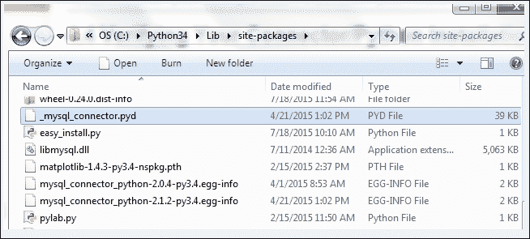

上述官方MySQL 网站附带教程，网址如下：

[http://dev.mysql.com/doc/connector-python/en/connector-python-tutorials.html](http://dev.mysql.com/doc/connector-python/en/connector-python-tutorials.html)

关于如何验证安装 Connector/Python 驱动程序是否有效的在线教程示例有点误导，因为它试图连接到一个没有自动创建的员工数据库，至少在我的社区版中是这样。

验证 Connector/Python 驱动程序是否真的安装了的方法是只连接到 MySQL 服务器，而不指定特定的数据库，然后打印出连接对象。

### 注

将括号中的占位符名称`<adminUser>`和`<adminPwd>`替换为您在 MySQL 安装中使用的真实凭据。

如果您安装了 MySQL 社区版，那么您就是管理员，并且在 MySQL 安装过程中选择了用户名和密码。

```py
import mysql.connector as mysql

conn = mysql.connect(user=<adminUser>, password=<adminPwd>,
                     host='127.0.0.1')
print(conn)

conn.close()
```

如果运行前面的代码会将以下输出打印到控制台，那么我们就可以了。


如果您无法连接到 MySQL服务器，那么在安装过程中可能出现了问题。如果是这种情况，请尝试卸载 MySQL，重新启动电脑，然后再次运行 MySQL 安装。仔细检查您下载的 MySQL 安装程序是否与您的 Python 版本相匹配。如果您安装了多个版本的 Python，这有时会导致混淆，因为您最后安装的版本会被预先添加到 Windows path 环境变量中，并且一些安装程序只使用在该位置可以找到的第一个 Python 版本。

当我在 64 位版本的基础上安装了 Python 32 位版本时，我就遇到了这种情况，我很困惑为什么我下载的一些模块不能工作。

安装人员下载了 32 位模块，这些模块与 64 位版本的 Python 不兼容。

## 它是如何工作的…

为了将 GUI 连接到 MySQL 服务器，如果我们想创建自己的数据库，我们需要能够以管理权限连接到服务器。

如果数据库已经存在，那么我们只需要的授权权限来连接、插入、更新和删除数据。

下一步我们将在 MySQL 服务器上创建一个新数据库。

# 配置 MySQL 连接

在前面的配方中，我们通过将身份验证所需的凭证硬编码到`connection`方法，使用最短的方式连接到 MySQL 服务器。虽然这是早期开发的快速方法，但我们绝对不想向任何人公开我们的 MySQL 服务器凭据，除非我们*向特定用户授予*数据库、表、视图和相关数据库命令的权限。

通过 MySQL 服务器进行身份验证的一种更安全的方法是将凭据存储在配置文件中，这就是我们在本配方中要做的。

我们将使用配置文件连接到 MySQL 服务器，然后在 MySQL 服务器上创建我们自己的数据库。

### 注

我们将在以下所有配方中使用此数据库。

## 准备好了吗

要运行此配方中所示的代码，需要以管理员权限访问正在运行的 MySQL 服务器。

### 注

前面的配方说明了如何安装 MySQL 服务器的免费社区版。管理员权限将使您能够实现此配方。

## 怎么做…

首先，我们在`MySQL.py`代码的同一模块中创建一个字典。

```py
# create dictionary to hold connection info
dbConfig = {
    'user': <adminName>,      # use your admin name 
    'password': <adminPwd>,   # use your admin password
    'host': '127.0.0.1',      # IP address of localhost
    }
```

接下来，在连接方法中，我们解压缩字典值。而不是写作，

```py
mysql.connect('user': <adminName>,  'password': <adminPwd>, 'host': '127.0.0.1') 
```

我们使用`(**dbConfig)`，其作用与上述相同，但要短得多。

```py
import mysql.connector as mysql
# unpack dictionary credentials 
conn = mysql.connect(**dbConfig)
print(conn)
```

这将导致与 MySQL 服务器的成功连接，但区别在于连接方法不再公开任何关键任务信息。

### 注

数据库服务器对您的任务至关重要。一旦您丢失了宝贵的数据，并且找不到任何最近的备份，您就会意识到这一点！


现在，将相同的用户名、密码、数据库等放在同一 Python 模块的字典中并不能消除任何人在阅读代码时看到凭据的风险。

为了提高数据库安全性，我们首先将字典移动到它自己的 Python 模块中。让我们调用新的 Python 模块`GuiDBConfig.py`。

然后，我们导入这个模块并解压缩凭据，就像我们以前做的那样。

```py
import GuiDBConfig as guiConf
# unpack dictionary credentials 
conn = mysql.connect(**guiConf.dbConfig)
print(conn)
```

### 注

一旦我们将这个模块放在一个安全的地方，与代码的其余部分分开，我们就为 MySQL 数据实现了更好的安全级别。

既然我们已经知道如何连接 MySQL 并拥有管理员权限，我们可以通过发出以下命令来创建我们自己的数据库：

```py
GUIDB = 'GuiDB'

# unpack dictionary credentials 
conn = mysql.connect(**guiConf.dbConfig)

cursor = conn.cursor()

try:
    cursor.execute("CREATE DATABASE {} DEFAULT CHARACTER SET 'utf8'".format(GUIDB))

except mysql.Error as err:
    print("Failed to create DB: {}".format(err))

conn.close()
```

为了执行 MySQL 的命令，我们从 connection 对象创建了一个 cursor 对象。

游标通常是数据库表中特定行中的一个位置，我们可以在表中上下移动它，但这里我们使用它来创建数据库本身。

我们将 Python 代码包装成一个`try…except`块，并使用 MySQL 的内置错误代码来告诉我们是否出现了任何错误。

我们可以通过两次执行数据库创建代码来验证此块是否有效。第一次，它将在 MySQL 中创建一个新的数据库，第二次它将打印一条错误消息，说明这个数据库已经存在。

我们可以通过使用完全相同的游标对象语法执行以下 MySQL 命令来验证存在哪些数据库。

我们不发出`CREATE DATABASE`命令，而是创建一个游标并使用它执行`SHOW DATABASES`命令，我们获取并打印控制台输出的结果。

```py
import mysql.connector as mysql
import GuiDBConfig as guiConf

# unpack dictionary credentials 
conn = mysql.connect(**guiConf.dbConfig)

cursor = conn.cursor()

cursor.execute("SHOW DATABASES")
print(cursor.fetchall())

conn.close()
```

### 注

我们通过调用游标对象上的`fetchall`方法来检索结果。

运行这段代码向我们展示了 MySQL 服务器实例中当前存在哪些数据库。从输出中可以看出，MySQL 附带了几个内置数据库，如`information_schema`等。我们已经成功创建了自己的`guidb`数据库，如输出所示。所示的所有其他数据库均随 MySQL 提供。


请注意，即使我们在创建数据库时以混合大小写字母将其指定为 GuiDB，`SHOW DATABASES`命令以小写形式显示 MySQL 中所有现有的数据库，并将我们的数据库显示为`guidb`。

## 它是如何工作的…

为了将 Python GUI 连接到 MySQL 数据库，我们首先必须知道如何连接到 MySQL 服务器。这需要建立一个连接，只有我们能够提供所需的凭据，MySQL 才会接受这个连接。

虽然将字符串放在一行 Python 代码中很容易，但当我们处理数据库时，我们必须非常仔细，因为到明天，今天的个人沙盒开发环境可能很容易在万维网上访问。

您不想危害数据库安全，本配方的第一部分介绍了如何通过将 MySQL 服务器的连接凭据放入单独的文件中，并将此文件放入外部世界无法访问的位置来提高安全性，我们的数据库系统将变得更安全。

在真实的生产环境中，MySQL 服务器安装、连接凭据和此 dbConfig 文件都将由 IT 系统管理员处理，您可以在不知道实际凭据是什么的情况下导入 dbConfig 文件以连接到 MySQL 服务器。解包 dbConfig 不会像在代码中那样公开凭据。

第二部分在一个 MySQL 服务器实例中创建了我们自己的数据库，我们将在接下来的食谱中扩展和使用该数据库，并将其与 Python GUI 结合起来。

# Python GUI 数据库的设计

在我们开始创建表并向其中插入数据之前，我们必须设计数据库。与更改本地 Python 变量名不同，在创建并加载数据后更改数据库模式并不容易。

我们必须`DROP`表格，这意味着我们将丢失表格中的所有数据。因此，在删除一个表之前，我们必须先提取数据，然后`DROP`该表，然后用不同的名称重新创建它，最后重新导入原始数据。

你明白了…

设计 GUI MySQL 数据库意味着首先考虑我们希望 Python 应用程序使用它做什么，然后为表选择符合预期用途的名称。

## 准备好了吗

我们正在使用在上一个配方中创建的 MySQL 数据库。MySQL 的一个运行实例是必要的，前面的两个方法说明了如何安装 MySQL 和所有必要的附加驱动程序，以及如何创建我们在本章中使用的数据库。

## 怎么做…

首先，我们将 pythongui 中的小部件移动到前面的两个选项卡之间，以便更好地组织 pythongui 以连接到 MySQL 数据库。

我们重命名几个小部件，并将访问 MySQL 数据的代码分离到以前命名的选项卡 1，我们将把不相关的小部件移动到前面的 recipes 选项卡 2 中。

为了更好地理解代码，我们还调整了一些内部 Python 变量名。

### 注

代码可读性是编码的优点，而不是浪费时间。

我们的重构 Python GUI 现在看起来像下面的屏幕截图。我们将第一个选项卡重命名为 MySQL，并创建了两个 tkinter LabelFrame 小部件。我们将顶部的一个标记为 Python 数据库，它包含两个标签和六个 tkinter 条目小部件以及三个按钮，我们使用 tkinter 网格布局管理器将它们对齐成四行三列。

我们将在条目小部件中输入书籍标题和页面，单击按钮将导致插入、检索或修改书籍引用。

底部的 LabelFrame 有一个标签**Book Quotence**，作为该框架一部分的 ScrolledText 小部件将显示我们的书籍和报价。

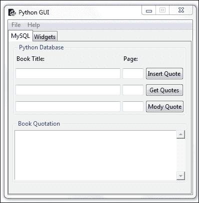

我们将创建两个 SQL 表来保存数据。第一个将保存书名和书页的数据。然后我们将加入第二个表，它将保存图书报价。

我们将通过主键到外键关系将两个表链接在一起。

现在，让我们创建第一个数据库表。

在我们这样做之前，让我们先确认我们的数据库确实没有表。根据在线 MySQL 文档，查看数据库中存在的表的命令如下所示。

### 注

13.7.5.38`SHOW` `TABLES`语法：

```py
SHOW [FULL] TABLES [{FROM | IN} db_name]
    [LIKE 'pattern' | WHERE expr]
```

需要注意的是，在前面的语法中，`FULL`等方括号中的参数是可选的，而`SHOW TABLES`命令的描述中需要`FROM`等大括号中的参数。`FROM`和`IN`之间的管道符号表示 MySQL 语法需要其中一种。

```py
# unpack dictionary credentials 
conn = mysql.connect(**guiConf.dbConfig)
# create cursor 
cursor = conn.cursor()
# execute command
cursor.execute("SHOW TABLES FROM guidb")
print(cursor.fetchall())

# close connection to MySQL
conn.close()
```

当我们在 Python 中执行 SQL 命令时，我们得到了预期的结果，这是一个空列表，显示我们的数据库当前没有表。


我们也可以通过执行`USE <DB>`命令首先选择数据库。现在，我们不必将其传递到`SHOW TABLES`命令中，因为我们已经选择了要与之对话的数据库。

以下代码创建与前一代码相同的 true 结果：

```py
cursor.execute("USE guidb")
cursor.execute("SHOW TABLES")
```

既然我们知道了如何验证数据库中没有表，那么让我们创建一些表。在我们创建了两个表之后，我们将使用与前面相同的命令来验证它们是否真正进入了我们的数据库。

通过执行以下代码，我们创建了第一个名为`Books`的表。

```py
# connect by unpacking dictionary credentials
conn = mysql.connect(**guiConf.dbConfig)

# create cursor 
cursor = conn.cursor()

# select DB
cursor.execute("USE guidb")

# create Table inside DB
cursor.execute("CREATE TABLE Books (       \
      Book_ID INT NOT NULL AUTO_INCREMENT, \
      Book_Title VARCHAR(25) NOT NULL,     \
      Book_Page INT NOT NULL,              \
      PRIMARY KEY (Book_ID)                \
    ) ENGINE=InnoDB")

# close connection to MySQL
conn.close()
```

我们可以通过执行以下命令来验证该表是在数据库中创建的。

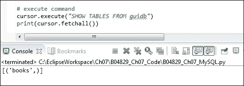

现在，结果不再是一个空列表，而是一个包含元组的列表，显示我们刚刚创建的`books`表。

我们可以使用 MySQL 命令行客户端查看表中的列。为此，我们必须以 root 用户身份登录。我们还必须在命令末尾附加分号。

### 注

在 Windows 上，只需双击 MySQL 命令行客户端快捷方式，即可在 MySQL 安装过程中自动安装该快捷方式。

如果桌面上没有快捷方式，您可以在以下路径找到典型默认安装的可执行文件：

`C:\Program Files\MySQL\MySQL Server 5.6\bin\mysql.exe`

如果没有运行 MySQL 客户端的快捷方式，则必须向其传递一些参数：

*   `C:\Program Files\MySQL\MySQL Server 5.6\bin\mysql.exe`
*   `--defaults-file=C:\ProgramData\MySQL\MySQL Server 5.6\my.ini`
*   `-uroot`
*   `-p`

双击快捷方式，或者使用带有可执行文件完整路径的命令行并输入所需参数，都将打开 MySQL 命令行客户端，提示您输入 root 用户的密码。

如果您记得在安装过程中分配给 root 用户的密码，则可以运行`SHOW COLUMNS FROM books;`命令，如下所示。这将显示 GUI 数据库中`books`表的列。

### 注

在 MySQL 客户机中执行命令时，语法不是 Pythonic。


接下来，我们将创建第二个表，该表将存储图书和期刊报价。我们将通过执行以下代码来创建它：

```py
# select DB
cursor.execute("USE guidb")

# create second Table inside DB
cursor.execute("CREATE TABLE Quotations ( \
        Quote_ID INT,                     \
        Quotation VARCHAR(250),           \
        Books_Book_ID INT,                \
        FOREIGN KEY (Books_Book_ID)       \
            REFERENCES Books(Book_ID)     \
            ON DELETE CASCADE             \
    ) ENGINE=InnoDB")
```

执行`SHOW TABLES`命令现在显示我们的数据库有两个表。

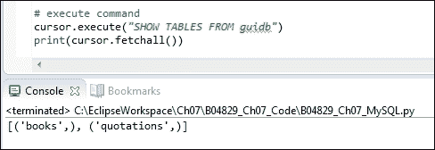

我们可以通过使用 Python 执行 SQL 命令来查看列。


使用 MySQL 客户端可能会以更好的格式显示数据。我们还可以使用 Python 的 pretty print（`pprint`）特性。

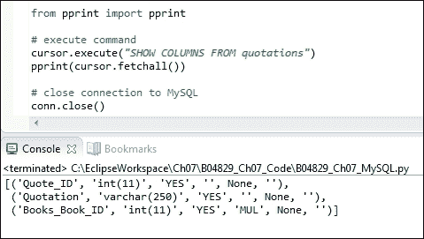

MySQL 客户端仍然以更清晰的格式显示我们的列，这在运行该客户端时可以看到。

## 它是如何工作的…

我们设计了我们的 Python GUI 数据库，并对 GUI 进行了重构，以准备使用我们的新数据库。然后我们创建了一个 MySQL 数据库，并在其中创建了两个表。

我们通过使用 Python 和 MySQL 服务器附带的 MySQL 客户机验证了这些表是否进入了我们的数据库。

在下一个配方中，我们将向表中插入数据。

# 使用 SQL INSERT 命令

这个配方展示了整个 Python 代码，向您展示了如何创建和删除 MySQL 数据库和表，以及如何显示 MySQL 实例的现有数据库、表、列和数据。

在创建数据库和表之后，我们将把数据插入我们在这个配方中创建的两个表中。

### 注

我们使用主键到外键的关系来连接两个表的数据。

我们将在下面的两个方法中详细介绍这是如何工作的，在这两个方法中，我们修改和删除 MySQL 数据库中的数据。

## 准备好了吗

这个配方建立在我们在上一个配方中创建的 MySQL 数据库的基础上，还向您展示了如何删除和重新创建 GUI 数据库。

### 注

删除数据库当然会删除数据库表中的所有数据，因此我们还将向您展示如何重新插入这些数据。

## 怎么做…

我们`MySQL.py`模块的全部代码都在本章的代码文件夹中，可从 Packt Publishing 的网站下载。它创建数据库，向其中添加表，然后将数据插入到我们创建的两个表中。

在这里，为了保留空间，我们将在不显示所有实现细节的情况下概述代码，因为显示整个代码需要太多页面。

```py
import mysql.connector as mysql
import GuiDBConfig as guiConf

class MySQL():
    # class variable
    GUIDB  = 'GuiDB'   

    #------------------------------------------------------
    def connect(self):
        # connect by unpacking dictionary credentials
        conn = mysql.connector.connect(**guiConf.dbConfig)

        # create cursor 
        cursor = conn.cursor()    

        return conn, cursor

    #------------------------------------------------------
    def close(self, cursor, conn):
        # close cursor

    #------------------------------------------------------
    def showDBs(self):
        # connect to MySQL

    #------------------------------------------------------
    def createGuiDB(self):
        # connect to MySQL

    #------------------------------------------------------
    def dropGuiDB(self):
        # connect to MySQL

    #------------------------------------------------------
    def useGuiDB(self, cursor):
        '''Expects open connection.'''
        # select DB

    #------------------------------------------------------
    def createTables(self):
        # connect to MySQL

        # create Table inside DB

    #------------------------------------------------------
    def dropTables(self):
        # connect to MySQL

    #------------------------------------------------------
    def showTables(self):
        # connect to MySQL

    #------------------------------------------------------
    def insertBooks(self, title, page, bookQuote):
        # connect to MySQL

        # insert data

    #------------------------------------------------------
    def insertBooksExample(self):
        # connect to MySQL

        # insert hard-coded data

    #------------------------------------------------------
    def showBooks(self):
        # connect to MySQL

    #------------------------------------------------------
    def showColumns(self):
        # connect to MySQL

    #------------------------------------------------------
    def showData(self):
        # connect to MySQL

#------------------------------------------------------
if __name__ == '__main__': 

    # Create class instance
    mySQL = MySQL()
```

运行前面的代码在我们创建的数据库中创建以下表和数据。

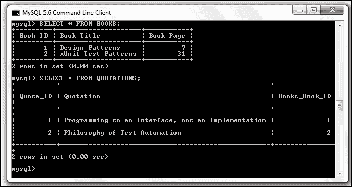

## 它是如何工作的…

我们创建了一个 MySQL 数据库，建立了与它的连接，然后创建了两个表，用于保存最喜欢的书籍或期刊引用的数据。

我们将数据分布在两个表之间，因为引用往往相当大，而书名和书页号非常短。通过这样做，我们可以提高数据库的效率。

### 注

在 SQL 数据库语言中，将数据分离到单独的表中称为规范化。

# 使用 SQL 更新命令

此配方将使用上一配方中的代码，对其进行更详细的解释，然后扩展代码以更新我们的数据。

为了更新之前插入到 MySQL 数据库表中的数据，我们使用 SQL`UPDATE`命令。

## 准备好了吗

此配方建立在前一配方的基础上，因此请阅读并研究前一配方，以便按照此配方中的编码修改现有数据。

## 怎么做…

首先，我们将通过运行以下 Python to MySQL 命令来显示要修改的数据：

```py
import mysql.connector as mysql
import GuiDBConfig as guiConf

class MySQL():
    # class variable
    GUIDB  = 'GuiDB'
    #------------------------------------------------------
    def showData(self):
        # connect to MySQL
        conn, cursor = self.connect()   

        self.useGuiDB(cursor)      

        # execute command
        cursor.execute("SELECT * FROM books")
        print(cursor.fetchall())

        cursor.execute("SELECT * FROM quotations")
        print(cursor.fetchall())

        # close cursor and connection
        self.close(cursor, conn)
#==========================================================
if __name__ == '__main__': 
    # Create class instance
    mySQL = MySQL()
    mySQL.showData()
```

运行代码将创建以下结果：


我们可能不同意“四人帮”，所以让我们改变他们著名的编程语录。

### 注

“四人帮”是四位作者，他们创作了一本世界著名的书，名为《设计模式》，这本书强烈影响了我们整个软件行业对使用软件设计模式进行识别、思考和编码的认识。

我们将通过更新我们最喜欢的报价数据库来实现这一点。

首先，我们通过搜索书名来检索主键值，然后将该值传递到对报价的搜索中。

```py
    #------------------------------------------------------
    def updateGOF(self):
        # connect to MySQL
        conn, cursor = self.connect()   

        self.useGuiDB(cursor)      

        # execute command
        cursor.execute("SELECT Book_ID FROM books WHERE Book_Title = 'Design Patterns'")
        primKey = cursor.fetchall()[0][0]
        print(primKey)

        cursor.execute("SELECT * FROM quotations WHERE Books_Book_ID = (%s)", (primKey,))
        print(cursor.fetchall())

        # close cursor and connection
        self.close(cursor, conn) 
#==========================================================
if __name__ == '__main__': 
    # Create class instance
    mySQL = MySQL()
    mySQL.updateGOF()
```

这给了我们以下结果：

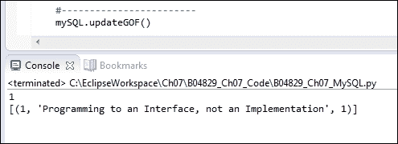

现在我们知道了 quote 的主键，我们可以通过执行以下命令来更新 quote。

```py
    #------------------------------------------------------
    def updateGOF(self):
        # connect to MySQL
        conn, cursor = self.connect()   

        self.useGuiDB(cursor)      

        # execute command
        cursor.execute("SELECT Book_ID FROM books WHERE Book_Title = 'Design Patterns'")
        primKey = cursor.fetchall()[0][0]
        print(primKey)

        cursor.execute("SELECT * FROM quotations WHERE Books_Book_ID = (%s)", (primKey,))
        print(cursor.fetchall())

        cursor.execute("UPDATE quotations SET Quotation = (%s) WHERE Books_Book_ID = (%s)", \
                       ("Pythonic Duck Typing: If it walks like a duck and talks like a duck it probably is a duck...", primKey))

        # commit transaction
        conn.commit ()

        cursor.execute("SELECT * FROM quotations WHERE Books_Book_ID = (%s)", (primKey,))
        print(cursor.fetchall())

        # close cursor and connection
        self.close(cursor, conn)
#==========================================================
if __name__ == '__main__': 
    # Create class instance
    mySQL = MySQL()
    #------------------------
    mySQL.updateGOF()
    book, quote = mySQL.showData()    
    print(book, quote)
```

通过运行前面的代码，我们使这个经典编程更具 python 风格。

从下面的屏幕截图中可以看出，在我们运行前面的代码之前，我们的标题与`Book_ID 1`通过一个主键到外键的关系与报价表`Books_Book_ID`列中的报价相关联。

这是*设计模式*一书中的原始引用。

然后，我们通过 SQL`UPDATE`命令更新了与此 ID 相关的报价。

所有 ID 都没有更改，但是现在与`Book_ID 1`关联的引号已经更改，如第二个 MySQL 客户端窗口所示，如下所示。


## 它是如何工作的…

在这个配方中，我们从我们的数据库和在早期配方中创建的数据库表中检索现有数据。我们将数据插入表中，并使用 SQL`UPDATE`命令更新数据。

# 使用 SQL DELETE 命令

在这个配方中，我们将使用 SQL`DELETE`命令删除我们在前面配方中创建的数据。

虽然删除数据乍一看可能听起来很琐碎，但一旦我们在生产中得到了一个相当大的数据库设计，事情可能就不再那么容易了。

因为我们通过主键到外键的关系将两个表关联起来来设计 GUI 数据库，所以当我们删除某些数据时，我们不会以孤立记录结束，因为这种数据库设计考虑了级联删除。

## 准备好了吗

此配方使用 MySQL 数据库、表以及本章前面配方中插入到这些表中的数据。为了展示如何创建孤立记录，我们必须更改其中一个数据库表的设计。

## 怎么做…

我们通过只使用两个数据库表来简化数据库设计。

当我们删除数据时，这种方法是有效的，但总有可能最终导致孤立记录。这意味着我们删除了一个表中的数据，但不删除另一个 SQL 表中的相关数据。

如果我们创建的`quotations`表与`books`表之间没有外键关系，那么最终可能会产生孤立记录。

```py
        # create second Table inside DB -- 
        # No FOREIGN KEY relation to Books Table
        cursor.execute("CREATE TABLE Quotations ( \
                Quote_ID INT AUTO_INCREMENT,      \
                Quotation VARCHAR(250),           \
                Books_Book_ID INT,                \
                PRIMARY KEY (Quote_ID)            \
            ) ENGINE=InnoDB")  
```

在`books`和`quotations`表中插入数据后，如果我们执行与之前相同的`delete`语句，我们只删除带`Book_ID 1`的书，而带`Books_Book_ID 1`的相关引用则被留下。

这是一个孤立的记录。不再存在`Book_ID`为`1`的图书记录。

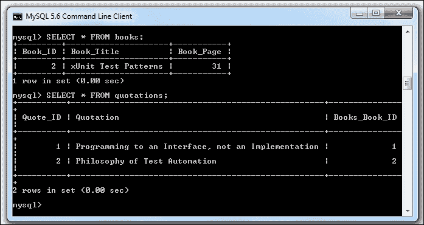

这种情况会造成混乱，我们可以通过使用级联删除来避免。

我们通过添加某些数据库约束来创建表。当我们创建包含上一个配方中的引用的表时，我们创建了带有外键约束的`quotations`表，该外键约束显式引用 books 表的主键，将两者链接起来。

```py
        # create second Table inside DB
        cursor.execute("CREATE TABLE Quotations ( \
                Quote_ID INT AUTO_INCREMENT,      \
                Quotation VARCHAR(250),           \
                Books_Book_ID INT,                \
                PRIMARY KEY (Quote_ID),           \
                FOREIGN KEY (Books_Book_ID)       \
                    REFERENCES Books(Book_ID)     \
                    ON DELETE CASCADE             \
            ) ENGINE=InnoDB")  
```

`FOREIGN KEY`关系包括`ON DELETE CASCADE`属性，它基本上告诉我们的 MySQL 服务器在删除这个外键相关的记录时删除这个表中的相关记录。

### 注

在创建表时，如果不指定`ON DELETE CASCADE`属性，我们就无法删除或更新数据，因为`UPDATE`是一个`DELETE`后跟一个`INSERT`。

因为这种设计，不会留下孤儿记录，这是我们想要的。

### 注

在 MySQL 中，我们必须指定`ENGINE=InnoDB`才能使用外键。

让我们在数据库中显示数据。

```py
#==========================================================
if __name__ == '__main__': 
    # Create class instance
    mySQL = MySQL()
      mySQL.showData()
```

这显示了数据库表中的以下数据：


这表明我们有两个记录，它们通过主键到外键关系进行关联。

当我们现在删除`books`表中的记录时，我们希望`quotations`表中的相关记录也会被级联删除。

让我们通过在 Python 中执行以下 SQL 命令来尝试这一点：

```py
import mysql.connector as mysql
import GuiDBConfig as guiConf

class MySQL():
    #------------------------------------------------------
    def deleteRecord(self):
        # connect to MySQL
        conn, cursor = self.connect()   

        self.useGuiDB(cursor)      

        # execute command
        cursor.execute("SELECT Book_ID FROM books WHERE Book_Title = 'Design Patterns'")
        primKey = cursor.fetchall()[0][0]
        # print(primKey)

        cursor.execute("DELETE FROM books WHERE Book_ID = (%s)", (primKey,))

        # commit transaction
        conn.commit ()

        # close cursor and connection
        self.close(cursor, conn)    
#==========================================================
if __name__ == '__main__': 
    # Create class instance
    mySQL = MySQL()
    #------------------------
    mySQL.deleteRecord()
    mySQL.showData()   
```

在执行上述删除记录的命令后，我们得到以下新结果：


### 注

著名的`Design Patterns`从我们最喜欢的语录数据库中消失了…

## 它是如何工作的…

在这个配方中，我们通过级联删除的主键到外键关系以可靠的方式设计数据库，从而触发了级联删除。

这使我们的数据保持健全和完整。

### 注

在本配方和示例代码中，我们引用了相同的表名，有时以大写开头，有时以小写开头。

这适用于 MySQL 的 Windows 默认安装，但除非更改设置，否则可能无法在 Linux 上运行。

这里是 MySQL 官方文档的链接：[http://dev.mysql.com/doc/refman/5.0/en/identifier-case-sensitivity.html](http://dev.mysql.com/doc/refman/5.0/en/identifier-case-sensitivity.html)

在下一个配方中，我们将使用 Python GUI 中的`MySQL.py`模块代码。

# 从我们的 MySQL 数据库中存储和检索数据

我们将使用 Python GUI 向MySQL 数据库表中插入数据。我们已经重构了我们在之前配方中构建的 GUI，为连接和使用数据库做准备。

我们将使用两个文本框输入小部件，在其中我们可以输入书籍或期刊的标题和页码。我们还将使用一个 ScrolledText 小部件将我们最喜欢的书籍引用键入其中，然后将其存储在 MySQL 数据库中。

## 准备好了吗

这个配方将建立在 MySQL 数据库和我们在前面的配方中创建的表上。

## 怎么做…

我们将使用 Python GUI 插入、检索和修改我们最喜欢的引用。我们已经重构了 GUI 的 MySQL 选项卡，为这做准备。

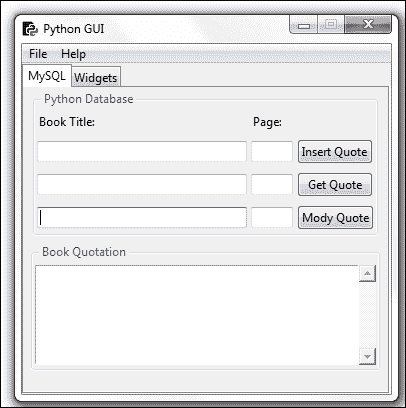

在中，为了让按钮发挥作用，我们将将它们连接到回调函数，就像我们在前面的食谱中所做的一样。

我们将在按钮下方的 ScrolledText 小部件中显示数据。

为了做到这一点，我们将导入`MySQL.py`模块，就像之前一样。与 MySQL 服务器实例和数据库通信的所有代码都驻留在这个模块中，这是一种封装代码的形式，体现了面向对象编程的精神。

我们将**插入报价**按钮连接到以下回调函数。

```py
        # Adding a Button
        self.action = ttk.Button(self.mySQL, text="Insert Quote", command=self.insertQuote)   
        self.action.grid(column=2, row=1)
    # Button callback
    def insertQuote(self):
        title = self.bookTitle.get()
        page = self.pageNumber.get()
        quote = self.quote.get(1.0, tk.END)
        print(title)
        print(quote)
        self.mySQL.insertBooks(title, page, quote)  
```

当我们现在运行代码时，我们可以将Python GUI 中的数据插入 MySQL 数据库。

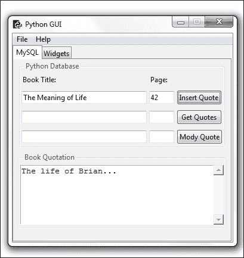

在输入书名和书页以及来自书籍或电影的引用之后，我们通过点击**插入引用**按钮将数据插入我们的数据库。

我们目前的设计允许标题、页面和报价。我们还可以插入我们最喜欢的电影语录。虽然电影没有页面，但我们可以使用页面列插入电影中引用发生的大致时间。

接下来，我们可以通过发出我们之前使用的相同命令来验证所有这些数据是否都进入了我们的数据库表。

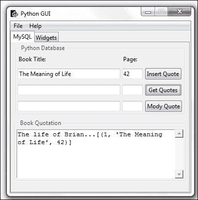

插入数据后，我们可以通过点击**获取报价**按钮来验证它是否进入了我们的两个 MySQL 表，然后显示我们插入到两个 MySQL 数据库表中的数据，如上图所示。

单击**获取报价**按钮将调用与按钮单击事件关联的回调方法。这为我们提供了在 ScrolledText 小部件中显示的数据。

```py
# Adding a Button
        self.action1 = ttk.Button(self.mySQL, text="Get Quotes", command=self.getQuote)   
        self.action1.grid(column=2, row=2)
    # Button callback
    def getQuote(self):
        allBooks = self.mySQL.showBooks()  
        print(allBooks)
        self.quote.insert(tk.INSERT, allBooks)
```

我们使用`self.mySQL`类实例变量调用的`showBooks()`方法，这是我们导入的 MySQL 类的一部分。

```py
from B04829_Ch07_MySQL import MySQL
class OOP():
    def __init__(self):
        # create MySQL instance
        self.mySQL = MySQL()

class MySQL():
    #------------------------------------------------------
    def showBooks(self):
        # connect to MySQL
        conn, cursor = self.connect()    

        self.useGuiDB(cursor)    

        # print results
        cursor.execute("SELECT * FROM Books")
        allBooks = cursor.fetchall()
        print(allBooks)

        # close cursor and connection
        self.close(cursor, conn)   

        return allBooks  
```

## 它是如何工作的…

在这个配方中，我们导入了 Python 模块，该模块包含连接到 MySQL 数据库的所有编码逻辑，并知道如何插入、更新、删除和显示数据。

现在，我们已经将 Python GUI 连接到此 SQL 逻辑。