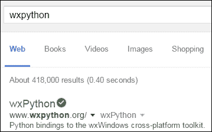
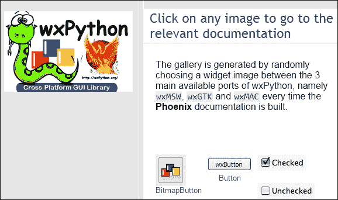
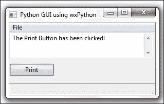
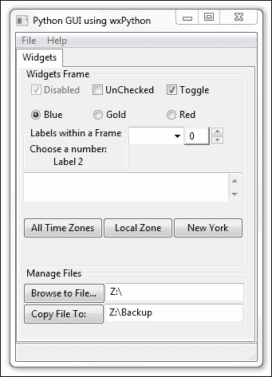
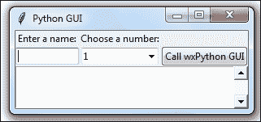
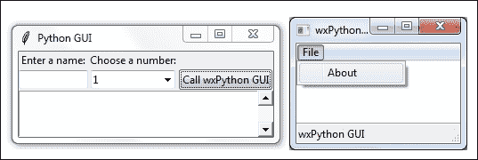
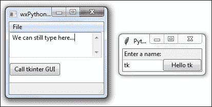
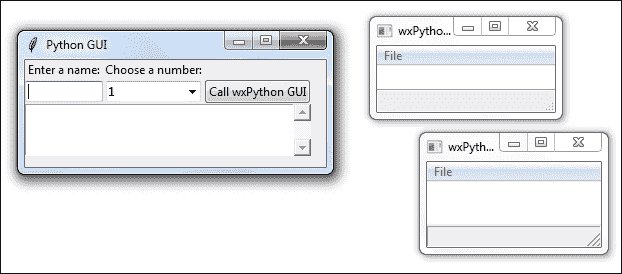
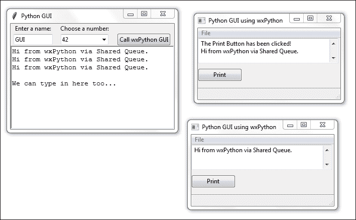

# 第 9 章。使用 wxPython 库扩展 GUI

在本章中，我们将通过使用 wxPython 库来增强 Python GUI。

*   如何安装 wxPython 库
*   如何在 wxPython 中创建 GUI
*   使用 wxPython 快速添加控件
*   正在尝试在主 tkinter 应用程序中嵌入主 wxPython 应用程序
*   试图将 tkinter GUI 代码嵌入 wxPython
*   如何使用 Python 控制两个不同的 GUI 框架
*   如何在两个连接的 GUI 之间进行通信

# 导言

在本章中，我们将介绍另一个 Python GUI 工具包，该工具包目前未随 Python 提供。它被称为 wxPython。

这个库有两个版本。原版名为 Classic，最新的名为其开发项目代码 Phoenix。

在本书中，我们仅使用 Python3 进行编程，因为新的 Phoenix 项目旨在支持 Python3，所以这是我们在本章中使用的 wxPython 版本。

首先，我们将创建一个简单的 wxpythongui，然后我们将尝试将本书中开发的基于 tkinter 的 GUI 与新的 wxPython 库连接起来。

### 注

wxPython 是与 wxWidgets 的 Python 绑定。

wxPython 中的 w 代表 Windows 操作系统，x 代表基于 Unix 的操作系统，如 Linux 和 OS x。

如果不同时使用这两个 GUI 工具包解决问题，我们将尝试使用 Python 解决任何问题，然后在 Python 中使用**进程间通信**（**IPC**），以确保我们的 Python 代码按照我们希望的方式工作。

# 如何安装 wxPython 库

wxPython 库不随 Python 提供，因此，为了使用它，我们首先必须安装它。

这个方法将告诉我们在何处以及如何找到合适的安装版本，以匹配已安装的 Python 版本和正在运行的操作系统。

### 注

wxPython 第三方库已经存在了 17 年多，这表明它是一个强大的库。

## 准备好了吗

为了在 Python3 中使用 wxPython，我们必须安装 WxpythonPhoenix 版本。

## 怎么做。。。

当在线搜索 wxPython 时，我们可能会在[www.wxPython.org](http://www.wxpython.org)找到官方网站。



如果单击 MS Windows 的下载链接，我们可以看到几个 Windows 安装程序，所有这些安装程序都仅适用于 Python2.x。


要在 Python3 中使用wxPython，我们必须安装 wxPython/Phoenix 库。我们可以在快照构建链接中找到安装程序：

[http://wxpython.org/Phoenix/snapshot-builds/](http://wxpython.org/Phoenix/snapshot-builds/)

从这里，我们可以选择与我们的 Python 版本和操作系统版本相匹配的 wxPython/Phoenix 版本。我使用的是运行在 64 位 Windows7 操作系统上的 Python 3.4。


pythonwheel（`.whl`）安装程序包有一个编号方案。

对我们来说，这个方案最重要的部分是，我们正在安装 wxPython/Phoenix 构建，它适用于 Python 3.4（安装程序名称中的 cp34）和 Windows 64 位操作系统（安装程序名称中的 win_amd64 部分）。


在成功下载 wxPython/Phoenix 包之后，我们现在可以导航到它所在的目录，并使用 pip 安装这个包。


我们的 Python`site-packages`文件夹中有一个名为`wx`的新文件夹。


### 注

`wx`是 wxPython/Phoenix 库安装到的文件夹名。我们将把这个模块导入到 Python 代码中。

我们可以通过执行官方wxPython/Phoenix 网站上的这个简单演示脚本来验证我们的安装是否有效。官方网站链接为[http://wxpython.org/Phoenix/docs/html/](http://wxpython.org/Phoenix/docs/html/) 。

```py
import wx
app = wx.App()
frame = wx.Frame(None, -1, "Hello World")
frame.Show()
app.MainLoop()
```

运行前面的 Python3 脚本将使用 wxPython/Phoenix 创建以下 GUI。


## 它是如何工作的。。。

在这个配方中，我们成功地安装了 wxPython 工具包的正确版本，我们可以使用 Python3。我们找到了这个 GUI 工具包的 Phoenix 项目，它是当前活跃的开发线。Phoenix 将及时替换经典的 wxPython 工具包，其目标尤其是与 Python3 配合良好。

成功安装 wxPython/Phoenix 工具包后，我们使用该工具包仅用五行代码创建了一个 GUI。

### 注

我们以前使用 tkinter 获得了相同的结果。

# 如何在 wxPython 中创建我们的 GUI

在这个配方中，我们将开始使用wxPython GUI 工具包创建 Python GUI。

我们将首先使用 Python 附带的 tkinter 重新创建以前创建的几个小部件。

然后，我们将探索 wxpythonguitoolkit 提供的一些小部件，这些小部件很难使用 tkinter 创建。

## 准备好了吗

前面的方法向您展示了如何安装与您的 Python 版本和您正在运行的操作系统相匹配的 wxPython 的正确版本。

## 怎么做。。。

开始探索 wxPython GUI 工具包的一个好地方是转到以下 URL:[http://wxpython.org/Phoenix/docs/html/gallery.html](http://wxpython.org/Phoenix/docs/html/gallery.html)

此网页显示许多 wxPython 小部件。单击其中任何一个，我们就可以看到它们的文档，这是一个非常好的功能，可以帮助我们快速了解 wxPython 控件。



下面的屏幕截图显示了wxPython 按钮小部件的文档。


我们可以非常快速地创建一个带有标题、菜单栏和状态栏的工作窗口。将鼠标悬停在菜单项上时，此状态栏将显示该菜单项的文本。这可以通过编写以下代码来实现：

```py
# Import wxPython GUI toolkit
import wx

# Subclass wxPython frame
class GUI(wx.Frame):
    def __init__(self, parent, title, size=(200,100)):
        # Initialize super class
        wx.Frame.__init__(self, parent, title=title, size=size)

        # Change the frame background color 
        self.SetBackgroundColour('white')

        # Create Status Bar
        self.CreateStatusBar() 

        # Create the Menu
        menu= wx.Menu()

        # Add Menu Items to the Menu
        menu.Append(wx.ID_ABOUT, "About", "wxPython GUI")
        menu.AppendSeparator()
        menu.Append(wx.ID_EXIT,"Exit"," Exit the GUI")

        # Create the MenuBar
        menuBar = wx.MenuBar()

        # Give the MenuBar a Title
        menuBar.Append(menu,"File") 

        # Connect the MenuBar to the frame
        self.SetMenuBar(menuBar)  

        # Display the frame
        self.Show()

# Create instance of wxPython application
app = wx.App()

# Call sub-classed wxPython GUI increasing default Window size
GUI(None, "Python GUI using wxPython", (300,150))

# Run the main GUI event loop
app.MainLoop()
```

这个创建了以下 GUI，它是使用 wxPython 库用 Python编写的。


在之前的代码中，我们继承了`wx.Frame`。在下面的代码中，我们从`wx.Panel`继承并将`wx.Frame`传递给我们类的`__init__()`方法。

### 注

在 wxPython 中，顶级 GUI 窗口称为框架。没有框架就不可能有 wxpythongui，框架必须作为 wxPython 应用程序的一部分创建。

我们在代码底部创建应用程序和框架。

为了将小部件添加到 GUI 中，我们必须将它们附加到面板上。面板的父级是框架（我们的顶级窗口），我们放入面板的小部件的父级是面板。

下面的代码将多行 textbox 小部件添加到其父级为框架的面板中。我们还向面板小部件添加了一个按钮小部件，当单击该小部件时，它会将一些文本打印到文本框中。

以下是完整的代码：

```py
import wx               # Import wxPython GUI toolkit
class GUI(wx.Panel):    # Subclass wxPython Panel
    def __init__(self, parent):

        # Initialize super class
        wx.Panel.__init__(self, parent)

        # Create Status Bar
        parent.CreateStatusBar() 

        # Create the Menu
        menu= wx.Menu()

        # Add Menu Items to the Menu
        menu.Append(wx.ID_ABOUT, "About", "wxPython GUI")
        menu.AppendSeparator()
        menu.Append(wx.ID_EXIT,"Exit"," Exit the GUI")

        # Create the MenuBar
        menuBar = wx.MenuBar()

        # Give the Menu a Title
        menuBar.Append(menu,"File") 

        # Connect the MenuBar to the frame
        parent.SetMenuBar(menuBar)  

        # Create a Print Button
        button = wx.Button(self, label="Print", pos=(0,60))

        # Connect Button to Click Event method 
        self.Bind(wx.EVT_BUTTON, self.printButton, button)

        # Create a Text Control widget 
        self.textBox = wx.TextCtrl(
self, size=(280,50), style=wx.TE_MULTILINE)

    def printButton(self, event):
        self.textBox.AppendText(
"The Print Button has been clicked!") 

app = wx.App()      # Create instance of wxPython application
frame = wx.Frame(None, title="Python GUI using wxPython", size=(300,180))     # Create frame
GUI(frame)          # Pass frame into GUI
frame.Show()        # Display the frame
app.MainLoop()      # Run the main GUI event loop
```

运行前面的代码并单击我们的 wxPython 按钮小部件，将得到以下 GUI 输出：



## 它是如何工作的。。。

我们已经使用成熟的wxPython GUI 工具包在此配方中创建了自己的 GUI。只需几行 Python 代码，我们就可以创建一个功能齐全的 GUI，其中包括`Minimize`、`Maximize`和`Exit`按钮。我们添加了一个菜单栏、一个多行文本控件和一个按钮。我们还创建了一个状态栏，在选择菜单项时显示文本。我们将所有这些小部件放在一个面板容器小部件中。

我们将按钮连接到文本控件进行打印。

将鼠标悬停在菜单项上时，状态栏中会显示一些文本。

# 使用 wxPython 快速添加控件

在这个配方中，我们将用 tkinter 重新创建我们在本书前面创建的 GUI，但这次我们将使用 wxPython 库。我们将看到使用 wxpythongui 工具包创建我们自己的 pythongui 是多么容易和快速。

我们不会重新创建我们在前几章中创建的全部功能。例如，我们不会国际化 wxpythongui，也不会将其连接到 MySQL 数据库。我们将重新创建 GUI 的视觉方面，并添加一些功能。

### 注

通过比较不同的库，我们可以选择在自己的 Python GUI 开发中使用哪些工具包，并且我们可以在自己的 Python 代码中组合这些工具包。

## 准备好了吗

确保已安装 wxPython 模块以遵循此方法。

## 怎么做。。。

首先，我们像之前使用 tkinter一样创建 Python`OOP`类，但这次我们继承并扩展了`wx.Frame`类。为了清楚起见，我们不再称我们的类为`OOP`，而是将其重命名为`MainFrame`。

### 注

在 wxPython 中，主 GUI 窗口称为框架。

我们还创建了一个回调方法，当我们单击`Exit`菜单项并声明浅灰色`tuple`作为 GUI 的背景色时，它会关闭 GUI。

```py
import wx
BACKGROUNDCOLOR = (240, 240, 240, 255)

class MainFrame(wx.Frame):
    def __init__(self, *args, **kwargs):
        wx.Frame.__init__(self, *args, **kwargs)

        self.createWidgets()
        self.Show()

    def exitGUI(self, event):     # callback
        self.Destroy()

    def createWidgets(self):   
        self.CreateStatusBar()      # wxPython built-in method
        self.createMenu()
       self.createNotebook()
```

接下来，我们通过创建 wxPython`Notebook`类的实例向 GUI 添加一个选项卡式控件，并将其作为父类分配给我们自己的名为`Widgets`的自定义类。

`notebook`类实例变量的父变量为`wx.Panel`。

```py
    def createNotebook(self):
        panel = wx.Panel(self)
        notebook = wx.Notebook(panel)
        widgets = Widgets(notebook) # Custom class explained below
        notebook.AddPage(widgets, "Widgets")
        notebook.SetBackgroundColour(BACKGROUNDCOLOR) 
        # layout
        boxSizer = wx.BoxSizer()
        boxSizer.Add(notebook, 1, wx.EXPAND)
        panel.SetSizerAndFit(boxSizer)  
```

### 注

在 wxPython 中，选项卡式小部件被命名为`Notebook`，就像在 tkinter 中一样。

每个`Notebook`小部件都需要一个父，为了在 wxPython 的`Notebook`中布局小部件，我们使用了不同类型的大小器。

### 注

wxPython Sizer 是布局管理器，类似于 tkinter 的网格布局管理器。

接下来，我们向笔记本页面添加控件。我们通过创建一个从`wx.Panel`继承的单独类来实现这一点。

```py
class Widgets(wx.Panel):
    def __init__(self, parent):
        wx.Panel.__init__(self, parent)
        self.createWidgetsFrame()
        self.addWidgets()
        self.layoutWidgets()
```

我们按照 pythonoop 编程的最佳实践，通过将 GUI 代码分解为小方法来模块化 GUI 代码，从而使代码易于管理和理解。

```py
    #------------------------------------------------------
    def createWidgetsFrame(self):
        self.panel = wx.Panel(self)
        staticBox = wx.StaticBox( self.panel, -1, "Widgets Frame" )    
        self.statBoxSizerV = wx.StaticBoxSizer(staticBox, 
                                               wx.VERTICAL)
    #-----------------------------------------------------
    def layoutWidgets(self):         
        boxSizerV = wx.BoxSizer( wx.VERTICAL )
        boxSizerV.Add( self.statBoxSizerV, 1, wx.ALL )
        self.panel.SetSizer( boxSizerV )
        boxSizerV.SetSizeHints( self.panel )

    #------------------------------------------------------
    def addWidgets(self):
        self.addCheckBoxes()        
        self.addRadioButtons()
        self.addStaticBoxWithLabels()
```

### 注

在使用 wxPython StaticBox 小部件时，为了成功地布局它们，我们使用了一个`StaticBoxSizer`和一个常规`BoxSizer`的组合。wxPython StaticBox 与 tkinter LabelFrame 小部件非常相似。

在 tkinter 中，将一个`StaticBox`嵌入另一个`StaticBox`很简单，但使用wxPython 有点不直观。使其工作的一种方法如下所示：

```py
    def addStaticBoxWithLabels(self):
        boxSizerH = wx.BoxSizer(wx.HORIZONTAL)
        staticBox = wx.StaticBox( self.panel, -1, 
"Labels within a Frame" )
        staticBoxSizerV = wx.StaticBoxSizer( staticBox, wx.VERTICAL )
        boxSizerV = wx.BoxSizer( wx.VERTICAL )
        staticText1 = wx.StaticText( self.panel, -1,
"Choose a number:" )
        boxSizerV.Add( staticText1, 0, wx.ALL)
        staticText2 = wx.StaticText( self.panel, -1,"Label 2")
        boxSizerV.Add( staticText2, 0, wx.ALL )
        #------------------------------------------------------
        staticBoxSizerV.Add( boxSizerV, 0, wx.ALL )
        boxSizerH.Add(staticBoxSizerV)
        #------------------------------------------------------
        boxSizerH.Add(wx.TextCtrl(self.panel))
        # Add local boxSizer to main frame
        self.statBoxSizerV.Add( boxSizerH, 1, wx.ALL )
```

首先，我们创建一个水平`BoxSizer`。接下来，我们创建一个垂直`StaticBoxSizer`，因为我们想在这个框架中以垂直布局排列两个标签。

为了将另一个小部件安排在嵌入式`StaticBox`的右侧，我们必须将嵌入式`StaticBox`及其子控件和下一个小部件分配给水平`BoxSizer`，然后将这个`BoxSizer`分配给主`StaticBox`，它现在包含我们的嵌入式`StaticBox`和我们的其他小部件。

这听起来令人困惑吗？

你只需尝试一下这些浆纱机就可以感受到如何使用它们。从这个配方的代码开始，注释掉一些代码，或者修改一些 x 和 y 坐标以查看效果。

阅读 wxPython 官方文档了解更多信息也很好。

### 注

重要的是知道在代码中的何处添加到不同的大小，以实现我们希望的布局。

为了在第一个下创建第二个`StaticBox`，我们创建单独的`StaticBoxSizers`并将它们分配给同一个面板。

```py
class Widgets(wx.Panel):
    def __init__(self, parent):
        wx.Panel.__init__(self, parent)
        self.panel = wx.Panel(self)
        self.createWidgetsFrame()
        self.createManageFilesFrame()
        self.addWidgets()
        self.addFileWidgets()
        self.layoutWidgets()

    #----------------------------------------------------------
    def createWidgetsFrame(self):
        staticBox = wx.StaticBox( 
self.panel, -1, "Widgets Frame", size=(285, -1) )   
        self.statBoxSizerV = wx.StaticBoxSizer(
staticBox, wx.VERTICAL)   

    #----------------------------------------------------------
    def createManageFilesFrame(self):
        staticBox = wx.StaticBox( 
self.panel, -1, "Manage Files", size=(285, -1) )   
        self.statBoxSizerMgrV = wx.StaticBoxSizer(
staticBox, wx.VERTICAL)

    #----------------------------------------------------------
    def layoutWidgets(self):         
        boxSizerV = wx.BoxSizer( wx.VERTICAL )
        boxSizerV.Add( self.statBoxSizerV, 1, wx.ALL )
        boxSizerV.Add( self.statBoxSizerMgrV, 1, wx.ALL )

        self.panel.SetSizer( boxSizerV )
        boxSizerV.SetSizeHints( self.panel )

    #----------------------------------------------------------
    def addFileWidgets(self):   
        boxSizerH = wx.BoxSizer(wx.HORIZONTAL)
        boxSizerH.Add(wx.Button(
self.panel, label='Browse to File...'))   
        boxSizerH.Add(wx.TextCtrl(
self.panel, size=(174, -1), value= "Z:\\" ))

        boxSizerH1 = wx.BoxSizer(wx.HORIZONTAL)
        boxSizerH1.Add(wx.Button(
self.panel, label='Copy File To:    ')) 
        boxSizerH1.Add(wx.TextCtrl(
self.panel, size=(174, -1), value= "Z:\\Backup" ))    

        boxSizerV = wx.BoxSizer(wx.VERTICAL)
        boxSizerV.Add(boxSizerH)
        boxSizerV.Add(boxSizerH1)        

        self.statBoxSizerMgrV.Add( boxSizerV, 1, wx.ALL )
```

下面的代码实例化了运行 wxPython GUI 程序的主事件循环。

```py
#======================
# Start GUI
#======================
app = wx.App()
MainFrame(None, title="Python GUI using wxPython", size=(350,450))
app.MainLoop()
```

wxPython GUI 的最终结果如下所示：



## 它是如何工作的。。。

我们将 wxPython GUI 分为几个类进行设计和布局。

一旦我们在 Python 模块的底部完成了这项工作，我们就创建了 wxPython 应用程序的一个实例。接下来，我们实例化我们的 wxpythongui 代码。

之后，我们调用主 GUI 事件循环，该循环执行在该应用程序进程中运行的所有 Python 代码。这将显示我们的 wxpythongui。

### 注

我们在创建应用程序和调用其主事件循环之间放置的任何代码都将成为我们的 wxpythongui。

要真正习惯 wxPython 库及其 API 可能需要一些时间，但一旦我们了解了如何使用它，这个库就非常有趣，是构建我们自己的 Python GUI 的强大工具。还有一个可视的设计器工具，可与 wxPython 一起使用：[http://www.cae.tntech.edu/help/programming/wxdesigner-getting-started/view](http://www.cae.tntech.edu/help/programming/wxdesigner-getting-started/view)

本食谱使用 OOP 学习如何使用 wxPython GUI 工具包。

# 正在尝试将主 wxPython 应用程序嵌入主 tkinter 应用程序中

既然我们已经使用 Python 的内置 tkinter 库和 wxWidgets 库的 wxPython 包装器创建了相同的 GUI，那么我们确实需要结合使用这些技术创建的 GUI。

### 注

wxPython 和 tkinter 库都有各自的优势。在线论坛，如[http://stackoverflow.com/](http://stackoverflow.com/) 我们经常看到这样的问题，比如，哪一个更好？我应该使用哪个 GUI 工具包？这表明我们必须做出“非此即彼”的决定。我们不必作出这样的决定。

这样做的主要挑战之一是每个 GUI 工具包都必须有自己的事件循环。

在这个配方中，我们将尝试通过从 tkinter GUI 调用来嵌入一个简单的 wxPython GUI。

## 准备好了吗

我们将重用我们在[第 1 章](01.html "Chapter 1. Creating the GUI Form and Adding Widgets")*中先前配方中构建的 tkinter GUI，创建 GUI 表单并添加小部件*。

## 怎么做。。。

我们从一个简单的 tkinter GUI 开始，如下所示：



接下来，我们将尝试调用一个简单的 wxPythonGUI，这是我们在本章前面的配方中创建的。

这是以一种简单、非面向对象的方式执行此操作的完整代码：

```py
#===========================================================
import tkinter as tk
from tkinter import ttk
from tkinter import scrolledtext

win = tk.Tk()    

win.title("Python GUI")
aLabel = ttk.Label(win, text="A Label")
aLabel.grid(column=0, row=0)    
ttk.Label(win, text="Enter a name:").grid(column=0, row=0)
name = tk.StringVar()
nameEntered = ttk.Entry(win, width=12, textvariable=name)
nameEntered.grid(column=0, row=1)
ttk.Label(win, text="Choose a number:").grid(column=1, row=0)
number = tk.StringVar()
numberChosen = ttk.Combobox(win, width=12, textvariable=number)
numberChosen['values'] = (1, 2, 4, 42, 100)
numberChosen.grid(column=1, row=1)
numberChosen.current(0)
scrolW  = 30
scrolH  =  3
scr = scrolledtext.ScrolledText(win, width=scrolW, height=scrolH, wrap=tk.WORD)
scr.grid(column=0, sticky='WE', columnspan=3)
nameEntered.focus()  

#===========================================================
def wxPythonApp():
    import wx
    app = wx.App()
    frame = wx.Frame(None, -1, "wxPython GUI", size=(200,150))
    frame.SetBackgroundColour('white')
    frame.CreateStatusBar()
    menu= wx.Menu()
    menu.Append(wx.ID_ABOUT, "About", "wxPython GUI")
    menuBar = wx.MenuBar()
    menuBar.Append(menu,"File") 
    frame.SetMenuBar(menuBar)     
    frame.Show()
    app.MainLoop()

action = ttk.Button(win, text="Call wxPython GUI", command= wxPythonApp ) 
action.grid(column=2, row=1)

#======================
# Start GUI
#======================
win.mainloop()
```

在点击 tkinter`Button`控件后，运行前面的代码从 tkinter GUI 启动 wxPython GUI。



## 它是如何工作的。。。

重要的是，我们将整个 wxPython 代码放入它自己的函数中，我们将其命名为`def wxPythonApp()`。

在 button click 事件的回调函数中，我们只调用此代码。

### 注

需要注意的一点是，在继续使用 tkinter GUI 之前，我们必须关闭 wxPython GUI。

# 试图将 tkinter GUI 代码嵌入 wxPython

在这个配方中，我们将与前面的配方相反，并尝试从 wxPython GUI 中调用我们的 tkinter GUI 代码。

## 准备好了吗

我们将重用在本章前面的配方中创建的一些 wxpythongui 代码。

## 怎么做。。。

我们将从一个简单的 wxPython GUI 开始，它如下所示：


接下来，我们将尝试调用一个简单的 tkinter GUI。

这是以一种简单、非面向对象的方式完成此操作的全部代码：

```py
#=============================================================
def tkinterApp():
    import tkinter as tk
    from tkinter import ttk
    win = tk.Tk()    
    win.title("Python GUI")
    aLabel = ttk.Label(win, text="A Label")
    aLabel.grid(column=0, row=0)    
    ttk.Label(win, text="Enter a name:").grid(column=0, row=0)
    name = tk.StringVar()
    nameEntered = ttk.Entry(win, width=12, textvariable=name)
    nameEntered.grid(column=0, row=1)
    nameEntered.focus()  
    def buttonCallback():
        action.configure(text='Hello ' + name.get())
    action = ttk.Button(win, text="Print", command=buttonCallback)
    action.grid(column=2, row=1)
    win.mainloop()

#=============================================================
import wx
app = wx.App()
frame = wx.Frame(None, -1, "wxPython GUI", size=(200,180))
frame.SetBackgroundColour('white')
frame.CreateStatusBar()
menu= wx.Menu()
menu.Append(wx.ID_ABOUT, "About", "wxPython GUI")
menuBar = wx.MenuBar()
menuBar.Append(menu,"File") 
frame.SetMenuBar(menuBar) 
textBox = wx.TextCtrl(frame, size=(180,50), style=wx.TE_MULTILINE)

def tkinterEmbed(event):
    tkinterApp()

button = wx.Button(frame, label="Call tkinter GUI", pos=(0,60)) 
frame.Bind(wx.EVT_BUTTON, tkinterEmbed, button)
frame.Show()

#======================
# Start wxPython GUI
#======================
app.MainLoop()
```

在单击 wxPython`Button`小部件后，运行前面的代码从 wxPython GUI 启动 tkinter GUI。然后我们可以在 tkinter 文本框中输入文本。通过单击按钮，按钮文本将更新为名称。



启动 tkinter 事件循环后，wxPython GUI 仍然有响应，因为我们可以在 tkinter GUI 启动并运行时输入`TextCtrl`小部件。

### 注

在上一个配方中，在关闭 wxPython GUI 之前，我们无法使用 tkinter GUI。如果我们想将这两种 Python GUI 技术结合起来，了解这一差异可以帮助我们做出设计决策。

我们还可以通过多次单击 wxpythongui 按钮来创建几个 tkintergui 实例。但是，我们不能在任何 tkinter GUI 仍在运行时关闭 wxPython GUI。我们必须先关闭它们。


## 它是如何工作的。。。

在这个配方中，我们与前面的配方相反，首先使用 wxPython 创建一个 GUI，然后使用 tkinter 创建几个 GUI 实例。

当一个或多个 tkinter GUI 运行时，wxPython GUI 保持响应。但是，单击 tkinter 按钮仅在第一个实例中更新其按钮文本。

# 如何使用 Python 控制两个不同的 GUI 框架

在这个配方中，我们将探索从 Python 控制 tkinter 和 wxPython GUI 框架的方法。在上一章中，我们已经使用了 Python 线程模块来保持 GUI 的响应性，因此这里我们将尝试使用相同的方法。

我们将看到，事情并不总是以直观的方式进行。

然而，当我们从 tkinter GUI 中调用 wxPython GUI 实例时，我们将改进 tkinter GUI 的无响应性。

## 准备好了吗

此配方将扩展本章之前的配方，在本章中，我们尝试将主 wxPython GUI 嵌入到 tkinter GUI 中。

## 怎么做。。。

当我们从 tkinter GUI 创建 wxPython GUI 实例时，在关闭 wxPython GUI 的一个实例之前，我们无法再使用 tkinter GUI 控件。现在让我们改进一下。

我们的第一次尝试可能是使用 tkinter 按钮回调函数中的线程。

例如，我们的代码可能如下所示：

```py
def wxPythonApp():
    import wx
    app = wx.App()
    frame = wx.Frame(None, -1, "wxPython GUI", size=(200,150))
    frame.SetBackgroundColour('white')
    frame.CreateStatusBar()
    menu= wx.Menu()
    menu.Append(wx.ID_ABOUT, "About", "wxPython GUI")
    menuBar = wx.MenuBar()
    menuBar.Append(menu,"File") 
    frame.SetMenuBar(menuBar)     
    frame.Show()
    app.MainLoop()

def tryRunInThread():
    runT = Thread(target=wxPythonApp)
    runT.setDaemon(True)    
    runT.start()
    print(runT)
    print('createThread():', runT.isAlive())    

action = ttk.Button(win, text="Call wxPython GUI", command=tryRunInThread)
```

首先，这似乎是可行的，这将是直观的，因为 tkinter 控件不再被禁用，我们可以通过单击按钮创建 wxPython GUI 的多个实例。我们还可以输入并选择其他 tkinter 小部件。



然而，一旦尝试关闭 GUI，wxWidgets 就会出错，Python 可执行文件就会崩溃。


为了避免这种情况，我们可以将代码更改为使 wxPython`app.MainLoop`只在线程中运行，而不是尝试在线程中运行整个 wxPython 应用程序。

```py
def wxPythonApp():
    import wx
    app = wx.App()
    frame = wx.Frame(None, -1, "wxPython GUI", size=(200,150))
    frame.SetBackgroundColour('white')
    frame.CreateStatusBar()
    menu= wx.Menu()
    menu.Append(wx.ID_ABOUT, "About", "wxPython GUI")
    menuBar = wx.MenuBar()
    menuBar.Append(menu,"File") 
    frame.SetMenuBar(menuBar)     
    frame.Show()

    runT = Thread(target=app.MainLoop)
    runT.setDaemon(True)    
    runT.start()
    print(runT)
    print('createThread():', runT.isAlive())

action = ttk.Button(win, text="Call wxPython GUI", command=wxPythonApp) 
action.grid(column=2, row=1)
```

## 它是如何工作的。。。

我们首先尝试在一个线程中运行整个 wxpythongui 应用程序，但由于 wxPython 主事件循环希望成为应用程序的主线程，因此这不起作用。

我们找到了一个解决方法，只在一个线程中运行 wxPython`app.MainLoop`，这会欺骗它相信它是主线程。

这种方法的一个副作用是，我们不能再单独关闭所有 wxpythongui 实例。只有当我们关闭将线程创建为守护进程的 wxpythongui 时，其中至少一个线程才会关闭。

我不太清楚这是为什么。直观地说，您可能希望能够关闭所有守护进程线程，而不必等待创建它们的主线程首先关闭。

这可能与主线程仍在运行时引用计数器未设置为零有关。

在务实的层面上，这就是它目前的运作方式。

# 如何在两个连接的 GUI 之间进行通信

在前面的中，我们找到了连接 wxPython GUI 和 tkinter GUI 的方法，从一个 GUI 调用另一个 GUI，反之亦然。

虽然两个 GUI 同时成功运行，但它们并没有真正相互通信，因为它们只是在彼此启动。

在本食谱中，我们将探索使两个 GUI 相互对话的方法。

## 准备好了吗

阅读之前的食谱可能是这个食谱的一个很好的准备。

在这个配方中，我们将使用一个稍微修改过的 GUI 代码，与前面的配方相比，但是大多数基本的 GUI 构建代码是相同的。

## 怎么做。。。

在前面的介绍中，我们面临的主要挑战之一是如何组合两种 GUI 技术，这两种技术被设计为应用程序唯一的 GUI 工具包。我们找到了各种简单的方法来组合它们。

我们将再次从 tkinter GUI 主事件循环启动 wxPython GUI，并在 tkinter 进程内运行的 wxPython GUI 线程中启动 wxPython GUI。

为此，我们将使用一个共享的全局多处理 Python 队列。

### 注

虽然在这个方法中避免使用全局数据通常是最好的，但它们是一个实用的解决方案，Python 全局变量实际上是它们在其中声明的模块中唯一的全局变量。

下面是使两个 GUI 在一定程度上相互通信的 Python 代码。为了节省空间，这不是纯粹的 OOP 代码。

我们也没有显示所有小部件的创建代码。该代码与以前的配方中的代码相同。

```py
# Ch09_Communicate.py
import tkinter as tk
from tkinter import ttk
from threading import Thread

win = tk.Tk()       
win.title("Python GUI")   

from multiprocessing import Queue
sharedQueue = Queue()
dataInQueue = False

def putDataIntoQueue(data):
    global dataInQueue
    dataInQueue =  True
    sharedQueue.put(data)

def readDataFromQueue():
    global dataInQueue
    dataInQueue = False
    return sharedQueue.get() 
#===========================================================
import wx               
class GUI(wx.Panel):    
    def __init__(self, parent):
        wx.Panel.__init__(self, parent)
        parent.CreateStatusBar() 
        button = wx.Button(self, label="Print", pos=(0,60))
        self.Bind(wx.EVT_BUTTON, self.writeToSharedQueue, button)

    #--------------------------------------------------------
    def writeToSharedQueue(self, event):
        self.textBox.AppendText(
                        "The Print Button has been clicked!\n") 
        putDataIntoQueue('Hi from wxPython via Shared Queue.\n')
        if dataInQueue: 
            data = readDataFromQueue()
            self.textBox.AppendText(data)

            text.insert('0.0', data) # insert data into GUI

#============================================================
def wxPythonApp():
        app = wx.App()
        frame = wx.Frame(
            None, title="Python GUI using wxPython", size=(300,180))
        GUI(frame)          
        frame.Show()        
        runT = Thread(target=app.MainLoop)
        runT.setDaemon(True)    
        runT.start()
        print(runT)
        print('createThread():', runT.isAlive())
#============================================================
action = ttk.Button(win, text="Call wxPython GUI", command=wxPythonApp) 
action.grid(column=2, row=1)

#======================
# Start GUI
#======================
win.mainloop()
```

运行前面的代码首先创建程序的 tkinter 部分，当我们单击此 GUI 中的按钮时，它运行 wxPython GUI。这两个图形用户界面都像以前一样同时运行，但这一次，两个图形用户界面之间有一个额外的通信级别。



tkinter GUI 显示在前面屏幕截图的左侧，通过单击**调用 wxPython GUI**按钮，我们调用 wxPython GUI 的一个实例。我们可以通过多次单击按钮来创建多个实例。

### 注

所有创建的 GUI 都保持响应。它们既不会崩溃也不会冻结。

单击任何 wxPython GUI 实例上的打印按钮，将一句话写入其自己的`TextCtrl`小部件，然后将另一行写入其自身以及 tkinter GUI。您必须向上滚动才能看到 wxpythongui 中的第一句话。

### 注

其工作方式是使用模块级队列和 tkinter`Text`小部件

需要注意的一个重要因素是，我们创建了一个线程来运行 wxPython`app.MainLoop`，就像我们在前面的配方中所做的那样。

```py
def wxPythonApp():
        app = wx.App()
        frame = wx.Frame(
None, title="Python GUI using wxPython", size=(300,180))
        GUI(frame)          
        frame.Show()        
        runT = Thread(target=app.MainLoop)
        runT.setDaemon(True)    
        runT.start()
```

我们创建了一个继承自`wx.Panel`的类，并将其命名为`GUI`。然后，我们在前面的代码中实例化这个类的一个实例。

我们在这个类中创建一个按钮点击事件回调方法，然后调用上面编写的过程代码。因此，该类可以访问函数并可以写入共享队列。

```py
    #------------------------------------------------------
    def writeToSharedQueue(self, event):
        self.textBox.AppendText(
"The Print Button has been clicked!\n") 
        putDataIntoQueue('Hi from wxPython via Shared Queue.\n')
        if dataInQueue: 
            data = readDataFromQueue()
            self.textBox.AppendText(data)
            text.insert('0.0', data) # insert data into tkinter
```

我们首先在前面的方法中检查数据是否已放置在共享队列中，如果是这样，则将公共数据打印到两个 GUI 中。

### 注

`putDataIntoQueue()`行将数据放入队列中，`readDataFromQueue()`将其读回并保存在`data`变量中。

`text.insert('0.0', data)`是从**打印**按钮的 wxPython 回调方法将此数据写入 tkinter GUI 的行。

下面是在代码中调用的过程函数（而不是方法，因为它们没有绑定），它们使代码正常工作。

```py
from multiprocessing import Queue
sharedQueue = Queue()
dataInQueue = False

def putDataIntoQueue(data):
    global dataInQueue
    dataInQueue =  True
    sharedQueue.put(data)

def readDataFromQueue():
    global dataInQueue
    dataInQueue = False
    return sharedQueue.get()
```

当数据在队列中可用时，我们使用一个名为`dataInQueue`的简单布尔标志进行通信。

## 它是如何工作的。。。

在这个配方中，我们成功地将我们以类似方式创建的两个 GUI 组合在一起，但以前是独立的，彼此不通信。然而，在这个方法中，我们通过使一个 GUI 启动另一个 GUI 来进一步连接它们，并且通过一个简单的多处理 Python 队列机制，我们能够使它们彼此通信，将共享队列中的数据写入两个 GUI。

有许多非常先进和复杂的技术可用于连接不同的进程、线程、池、锁、管道、TCP/IP 连接等。

本着蟒蛇精神，我们找到了一个简单的解决方案。一旦我们的代码变得更复杂，我们可能不得不重构它，但这是一个良好的开端。