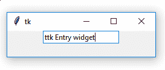
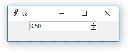
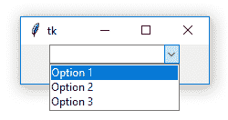
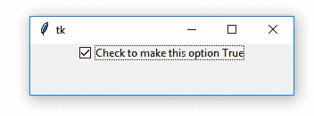
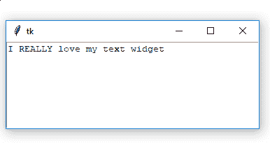
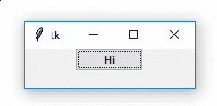
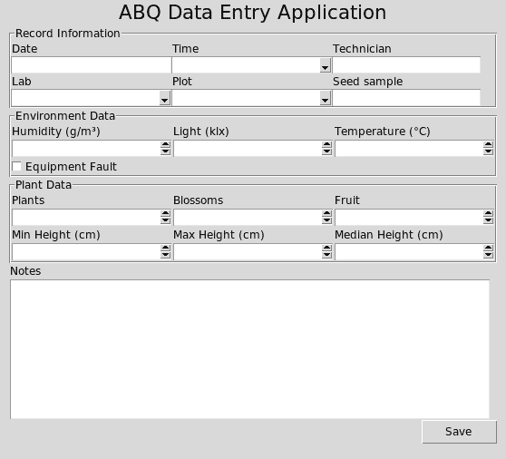

# 三、使用 Tkinter 和 ttk 小部件创建基本表单

好消息！您的设计已经过主管的审查和批准。现在是开始实施它的时候了！

在本章中，您将介绍以下主题：

*   根据设计评估您的技术选择
*   了解我们选择的 Tkinter 和`ttk`小部件
*   实现和测试表单和应用

让我们开始编码吧！

# 评估我们的技术选择

我们设计的第一个实现将是一个非常简单的应用，它提供了规范的核心功能，并且几乎没有其他功能。这被称为**最低可行产品**或**MVP**。一旦我们建立了 MVP，我们将更好地了解如何将其开发为最终产品。

在我们开始之前，让我们花一点时间来评估一下我们的技术选择。

# 选择技术

当然，我们将使用 Python 和 Tkinter 构建此表单。然而，值得一问的是，Tkinter 是否真的是应用的一种好的技术选择。在选择用于实现此表单的 GUI 工具包时，我们需要考虑以下事项：

*   **您目前的专业技能和知识**：您的专业技能是 Python，但您在创建 GUI 方面的经验很少。为了以最快的速度交付，您需要一个能够很好地与 Python 配合使用并且不难学习的选项。您还需要一些已建立且稳定的东西，因为您没有时间跟上工具包中的新开发。Tkinter在这里工作。
*   **目标平台**：您将在 Windows PC 上开发应用，但它需要在 Debian Linux 上运行，因此 GUI 的选择应该是跨平台的。它将运行的计算机既旧又慢，因此您的程序需要节省资源。Tkinter也在这里工作。
*   **应用功能**：您的应用需要能够显示基本表单字段，验证输入的数据，并将其写入 CSV。Tkinter 可以处理这些前端需求，Python 可以轻松地处理 CSV 文件。

考虑到 Python 的可用选项，Tkinter 是一个不错的选择。它有一个短的学习曲线，它是轻量级的，在您的开发平台和目标平台上都很容易获得，并且它包含表单所需的功能。

Python has other options for GUI development, including **PyQT**, **Kivy**, and **wxPython**. These have different strengths and weaknesses compared to Tkinter, but if you find Tkinter doesn't fit well for a project, one of these might be a better option.

# 探索 Tkinter 小部件

当我们设计应用时，我们选择了一个与我们需要的每个字段最匹配的小部件类。这些是`Entry`、`Spinbox`、`Combobox`、`Checkbutton`和`Text`小部件。我们还确定需要`Button`和`LabelFrame`小部件来实现应用布局。在我们开始写作之前，让我们来看一下这些小部件。

我们的一些小部件在 Tkinter 中，其他的在`ttk`主题的小部件集中，还有一些在两个库中。我们更喜欢`ttk`版本，因为它们在不同平台上看起来更好。请仔细注意我们从中导入每个小部件的库。

# 条目小部件

`ttk.Entry`小部件是一个基本的单行字符条目，如以下屏幕截图所示：



您可以通过执行以下代码来创建条目：

```py
my_entry = ttk.Entry(parent, textvariable=my_text_var)
```

在前面的代码中，`ttk.Entry`常用的参数如下：

*   `parent`：此参数为条目设置`parent`小部件。
*   `textvariable`：这是一个 Tkinter`StringVar`变量，其值将绑定到此`input`小部件。
*   `show`：此参数确定在框中键入时将显示哪个字符。默认情况下，它是您键入的字符，但可以替换（例如，对于密码输入，您可以指定`*`或显示点）。
*   `Entry`：与所有`ttk`小部件一样，此小部件支持其他格式和样式选项

在前面的所有参数中，`textvariable`参数的使用是可选的；没有它，我们可以使用`Entry`小部件中的`get()`方法提取值。然而，将变量绑定到我们的`input`小部件有一些优点。首先，我们不必保留或传递对小部件本身的引用。这将使我们更容易在后面的章节中将软件重新组织成单独的模块。此外，对输入值的更改将自动传播到变量，反之亦然。

# Spinbox 小部件

`ttk.Spinbox`小部件在常规`Entry`小部件上添加了递增和递减按钮，使其适用于数字数据。

在 Python 3.7 之前，`Spinbox`仅在 Tkinter 中可用，而不是`ttk`。如果您使用的是 Python3.6 或更早的版本，请改用`Tkinter.Spinbox`小部件。示例代码使用 Tkinter 版本以实现兼容性。

`Spinbox`小部件创建如下：

```py
my_spinbox = tk.Spinbox(
    parent,
    from_=0.5,
    to=52.0,
    increment=.01,
    textvariable=my_double_var)
```

如前面的代码所示，`Spinbox`小部件使用一些额外的构造函数参数来控制递增和递减按钮行为，如下所示：

*   **`from_`**：此参数确定箭头递减的最小值。需要结尾下划线，因为`from`是 Python 关键字；在 Tcl/`Tk`中，它只是`from`。
*   **`to`**：此参数确定箭头递增的最高值。
*   **`increment`**：此参数表示箭头递增或递减的量。
*   **`values`**：此参数获取可通过递增的字符串或数字值列表。

Note that both `from_` and `to` are required if you use either; that is, you cannot just specify a lower limit, doing so will either cause an exception or strange behavior. 

查看以下屏幕截图中的`Spinbox`小部件：



`Spinbox`小部件不仅仅用于数字，尽管这主要是我们使用它的方式。它还可以获取字符串列表，可以使用箭头按钮进行选择。因为它可以用于字符串或数字，`textvariable`参数采用`StringVar`、`IntVar`或`DoubleVar`数据类型。

Be aware that none of these parameters actually limit what can be typed into a `Spinbox` widget. It's nothing more than an `Entry` widget with buttons tacked on, and you can type not only values outside the valid range, but letters and symbols as well. Doing so can cause an exception if you've bound the widget to a non-string variable.

# 组合框小部件

`ttk.Combobox`参数是一个`Entry`小部件，它添加了一个下拉选择菜单。要填充下拉菜单，只需输入一个带有字符串列表的`values`参数，用户可以选择。

您可以执行以下代码来创建一个`Combobox`小部件：

```py
combobox = ttk.Combobox(
    parent, textvariable=my_string_var,
    values=["Option 1", "Option 2", "Option 3"])
```

前面的代码将生成以下小部件：



If you're used to HTML `<SELECT>` widgets or drop-down widgets in other toolkits, the `ttk.Combobox` widget may seem strange to you. It's really an `Entry` widget with a drop-down menu to select some preset strings. Just like the `Spinbox` widget, it doesn't limit the values that can be typed in.

# Checkbutton 小部件

`ttk.Checkbutton`小部件是用于输入布尔数据的标记复选框。与`Spinbox`和`Combobox`不同，它不是从`Entry`小部件派生的，其参数不同，如下所示：

*   `text`：此参数设置小部件的标签。
*   `variable`：此参数为`BooleanVar`，选中状态绑定到该参数。
*   `textvariable`：与基于`Entry`的小部件不同，此参数可用于将变量绑定到小部件的标签文本。您不会经常使用它，但您应该知道它的存在，以防您错误地将变量分配给它。

您可以执行以下代码来创建一个`Checkbutton`小部件：

```py
my_checkbutton = ttk.Checkbutton(
    parent, text="Check to make this option True",
    variable=my_boolean_var)
```

`Checkbox`小部件显示为一个可点击的框，旁边有一个标签，如以下屏幕截图所示：



# 文本小部件

`Text`小部件不仅仅是一个多行`Entry`小部件。它有一个强大的标签系统，允许您实现多色文本、超链接样式的可点击文本等。与其他小部件不同，它不能绑定到 Tkinter`StringVar`，因此需要通过其`get()`、`insert()`和`delete()`方法设置或检索其内容。

使用这些方法读取或修改时，需要传入一个或两个**索引**值，以选择正在操作的字符或字符范围。这些索引值是可以采用以下任何格式的字符串：

*   由点分隔的行号和字符号。行从 1 开始编号，字符从 0 开始编号，因此第一行的第一个字符是`1.0`，而第四行的第十二个字符是`4.11`。
*   `end`字符串或 Tkinter 常量`END`，表示字段结束。
*   数字索引加上单词`linestart`、`lineend`、`wordstart`和`wordend`中的一个，表示相对于数字索引的行或单词的开始或结束。例如，`6.2 wordstart`将是第 6 行包含第三个字符的单词的开头；`2.0 lineend`将是 2 号线的终点。
*   一个加号或减号运算符，以及许多字符或行。例如，`2.5 wordend - 1 chars`将是第 2 行包含第六个字符的单词末尾之前的字符。

以下示例显示了使用`Text`小部件的基本知识：

```py
# create the widget.  Make sure to save a reference.
mytext = tk.Text(parent)

# insert a string at the beginning
mytext.insert('1.0', "I love my text widget!")

# insert a string into the current text
mytext.insert('1.2', 'REALLY ')

# get the whole string
mytext.get('1.0', tk.END)

# delete the last character.
# Note that there is always a newline character
# at the end of the input, so we backup 2 chars.
mytext.delete('end - 2 chars')
```

如果运行上述代码，将获得以下输出：



对于此表单中的`Notes`字段，我们只需要一个简单的多行`Entry`；因此，我们现在只使用`Text`小部件的最基本功能。

# 按钮小部件

`ttk.Button`小部件也应该很熟悉。这只是一个简单的按钮，您可以用鼠标或空格键单击，如以下屏幕截图所示：



与`Checkbutton`小部件一样，此小部件使用`text`和`textvariable`配置选项来控制按钮上的标签。`Button`对象不接受`variable`，但它们接受`command`参数，该参数指定单击按钮时要运行的 Python 函数。

以下示例显示了`Button`对象的使用：

```py
tvar = tk.StringVar()
def swaptext():
    if tvar.get() == 'Hi':
        tvar.set('There')
    else:
        tvar.set('Hi')

my_button = ttk.Button(parent, textvariable=tvar, command=swaptext)
```

# LabelFrame 小部件

我们选择了`ttk.LabelFrame`小部件对应用中的字段进行分组。顾名思义，它是`Frame`和`Label`（通常在它周围有一个盒子）。`LabelFrame`小部件在设置标签的构造函数中使用一个`text`参数，位于框架的左上角。

Tkinter and `ttk` contain many more widgets, some of which we'll encounter later in this book. Python also ships with a `widget` library called `tix`, which contains several dozen widgets. However, `tix` is very outdated, and we won't be covering it in this book. You should know that it exists, though.

# 实现应用

要启动我们的应用脚本，请创建一个名为`ABQ data entry`的文件夹，并在其中创建一个名为`data_entry_app.py`的文件。

我们将从以下样板代码开始：

```py
import tkinter as tk
from tkinter import ttk

# Start coding here

class Application(tk.Tk):
    """Application root window"""

if __name__ == "__main__":
    app = Application()
    app.mainloop()
```

运行此脚本将为您提供一个空白 Tk 窗口。

# 通过 LabelInput 课程节省一些时间

表单上的每个`input`小部件都有一个与之关联的标签。在一个小应用中，我们只需分别创建标签和输入，然后将每个标签和输入添加到`parent`框架中，如下所示：

```py
form = Frame()
label = Label(form, text='Name')
name_input = Entry(form)
label.grid(row=0, column=0)
name_input.grid(row=1, column=0)
```

这很好，您可以用这种方式为您的应用执行，但它也会创建大量乏味、重复的代码，而移动输入意味着更改两倍的代码。由于`label`和`input`小部件属于同一类，因此创建一个小包装器类来包含这两个小部件并建立一些通用默认值是明智的。

When coding, be on the lookout for sections that contain a lot of repetitive code. You can often abstract this code into a class, function, or loop. Doing so won't just save your fingers some typing, it will ensure consistency and reduce the total amount of code you have to maintain.

让我们来看看下面的步骤：

1.  我们将调用这个类`LabelInput`，并在代码顶部`Start coding here`注释下定义它：

```py
"""Start coding here"""
class LabelInput(tk.Frame):
    """A widget containing a label and input together."""

    def __init__(self, parent, label='', input_class=ttk.Entry,
         input_var=None, input_args=None, label_args=None,
         **kwargs):
        super().__init__(parent, **kwargs)
        input_args = input_args or {}
        label_args = label_args or {}
        self.variable = input_var
```

2.  我们将以`Tkinter.Frame`为基础，就像我们对`HelloWidget`所做的一样。我们的构造函数采用以下参数：

*   `parent`：此参数是对`parent`小部件的引用；我们创建的所有小部件都将把它作为第一个参数。
*   `label`：这是小部件标签部分的文本。
*   `input_class`：这是我们要创建的小部件的类。它应该是一个实际的可调用类对象，而不是字符串。如果留空，将使用`ttk.Entry`。
*   `input_var`：这是分配给输入的 Tkinter 变量。它是可选的，因为一些小部件不使用变量。
*   `input_args`：这是`input`构造函数的任何附加参数的可选字典。
*   `label_args`：这是`label`构造函数的任何附加参数的可选字典。
*   `**kwargs`：最后，我们在`**kwargs`中捕获任何额外的关键字参数。这些将被传递给`Frame`构造函数。

3.  我们在构造函数中做的第一件事是调用`super().__init__()`并传入`parent`和额外的关键字参数。然后确保`input_args`和`label_args`都是字典，并将对输入变量的引用保存为`self.variable`。

Don't be tempted to use an empty dictionary (`{}`) as a default value for a method's keyword arguments. If you did so, a dictionary would be created when the method definition is evaluated and shared by all objects in the class. This would have some very strange effects on your code! The accepted practice is to pass `None` for mutable types like dictionaries and lists, then replacing `None` with an empty container in the method body.

4.  我们希望能够使用任何类型的`input`小部件，并在课堂上适当地处理它；不幸的是，正如我们之前所了解到的，在不同的小部件类中，构造函数参数和行为之间存在着微小的差异，例如`Combobox`和`Checkbutton`使用其`textvariable`参数的方式。目前，我们只需要区分`Button`和`Checkbutton`等按钮小部件处理变量和标签文本的方式。为此，我们将添加以下代码：

```py
        if input_class in (ttk.Checkbutton, ttk.Button, 
        ttk.Radiobutton):
            input_args["text"] = label
            input_args["variable"] = input_var
        else:
            self.label = ttk.Label(self, text=label, **label_args)
            self.label.grid(row=0, column=0, sticky=(tk.W + tk.E))
            input_args["textvariable"] = input_var
```

5.  对于按钮类型的小部件，我们以不同的方式执行以下任务：
    *   我们没有添加标签，而是设置了`text`参数。所有按钮都使用此参数向小部件添加一个`label`。
    *   我们没有将变量分配给`textvariable`，而是将其分配给`variable`。

6.  对于其他`input`类，我们设置`textvariable`并创建一个`Label`小部件，将其添加到`LabelInput`类的第一行。
7.  现在我们需要创建`input`类，如下所示：

```py
        self.input = input_class(self, **input_args)
        self.input.grid(row=1, column=0, sticky=(tk.W + tk.E))
```

8.  这非常简单：我们调用传递到构造函数中的`input_class`类，并将`input_args`字典扩展为关键字参数。然后，我们将其添加到第`1`行的网格中。
9.  最后，我们配置`grid`布局，以便在整个小部件中扩展我们的单独列，如下所示：

```py
        self.columnconfigure(0, weight=1)
```

10.  在创建自定义小部件时，我们可以做的一件好事是为其几何体管理器方法添加默认值，这将为我们节省大量编码。例如，我们想要所有的`LabelInput`对象填充它们所在的整个网格单元。我们可以通过重写方法将其作为默认值添加，而不是将`sticky=(tk.W + tk.E)`添加到每个`LabelInput.grid()`调用中：

```py
    def grid(self, sticky=(tk.E + tk.W), **kwargs):
        super().grid(sticky=sticky, **kwargs)
```

通过将其定义为默认参数，我们仍然可以像往常一样覆盖它。`input`小部件都有一个返回其当前值的`get()`方法。为了以后节省一些多余的输入，我们将在`LabelInput`类中实现一个`get()`方法，该方法将简单地将请求传递给输入或其变量。下一步添加此方法：

```py
    def get(self):
        try:
            if self.variable:
                return self.variable.get()
            elif type(self.input) == tk.Text:
                return self.input.get('1.0', tk.END)
            else:
                return self.input.get()
        except (TypeError, tk.TclError):
            # happens when numeric fields are empty.
            return ''
```

我们在这里使用了一个`try`块，因为如果在某些条件下调用`get()`，Tkinter 变量将抛出异常，例如当数值字段为空时（空白字符串无法转换为数值）。在这种情况下，我们只需从表单返回一个空值。此外，我们需要以不同的方式处理`tk.Text`小部件，因为它们需要一个范围来检索文本。我们总是想要这个表单中的所有文本，所以我们只在这里指定。作为对`get()`的补充，我们将实现一个`set()`方法，将请求传递给变量或`widget`，如下所示：

```py
    def set(self, value, *args, **kwargs):
        if type(self.variable) == tk.BooleanVar:
                self.variable.set(bool(value))
        elif self.variable:
                self.variable.set(value, *args, **kwargs)
        elif type(self.input) in (ttk.Checkbutton, 
        ttk.Radiobutton):
            if value:
                self.input.select()
            else:
                self.input.deselect()
        elif type(self.input) == tk.Text:
            self.input.delete('1.0', tk.END)
            self.input.insert('1.0', value)
        else: # input must be an Entry-type widget with no variable
            self.input.delete(0, tk.END)
            self.input.insert(0, value)
```

`.set()`方法抽象出了各种 Tkinter 小部件设置其值的方式之间的一些差异：

*   如果我们有一个类为`BooleanVar`的变量，将`value`转换为`bool`并设置它。`BooleanVar.set()`只接受`bool`，不接受其他虚假或真实的价值观。这确保了我们的变量只获得一个实际的布尔值。
*   如果我们有任何其他类型的变量，只需将`value`传递给它的`.set()`方法。
*   如果没有变量和按钮样式类，我们将使用`.select()`和`.deselect()`方法根据变量的真实值选择和取消选择按钮。
*   如果它是一个`tk.Text`类，我们可以使用它的`.delete`和`.insert`方法。
*   否则，我们使用`input`中的`.delete`和`.insert`方法，它们在`Entry`、`Spinbox`和`Combobox`类上工作。我们必须与`tk.Text`输入分开进行，因为索引值的工作方式不同。

这可能并不能解释所有可能的`input`小部件，但它涵盖了我们计划使用的小部件，以及我们以后可能需要的一些小部件。虽然构建`LabelInput`类需要做大量工作，但我们会发现现在定义表单要简单得多。

# 构建表单

我们不再直接在主应用窗口上构建表单，而是将表单构建为它自己的对象。最初，这使维护一个好的布局变得更容易，后来，这将使我们更容易扩展我们的应用。让我们执行以下步骤来构建表单：

1.  再一次，我们将子类化`Tkinter.Frame`来构建这个模块。`LabelInput`类定义完成后，开始一个新类，如下所示：

```py
class DataRecordForm(tk.Frame):
    """The input form for our widgets"""

    def __init__(self, parent, *args, **kwargs):
        super().__init__(parent, *args, **kwargs)
```

这应该已经很熟悉了。我们创建子类`Frame`，定义构造函数，并调用`super().__init__()`初始化底层`Frame`对象。

2.  现在我们将创建一个结构来保存对所有表单的`input`小部件的引用，如下所示：

```py
        # A dict to keep track of input widgets
        self.inputs = {}
```

当我们创建`input`小部件时，我们将使用字段名作为键在字典中存储对它们的引用。这将使以后更容易检索我们的所有值。

# 添加 LabelFrame 和其他小部件

我们的表单分为多个部分，每个部分都有一个标签和一个框。对于每个部分，我们将创建一个`LabelFrame`小部件，并通过执行以下步骤开始向其添加`LabelInput`小部件：

1.  让我们从记录信息框开始，执行以下代码：

```py
        recordinfo = tk.LabelFrame(self, text="Record Information")
```

Remember that the `text` argument to `LabelFrame` defines the text of the label. This widget will be passed as the `parent` widget to all the inputs in the record information group.

2.  现在，我们将添加`input`小部件的第一行，如下所示：

```py
        self.inputs['Date'] = LabelInput(recordinfo, "Date",
            input_var=tk.StringVar())
        self.inputs['Date'].grid(row=0, column=0)

        self.inputs['Time'] = LabelInput(recordinfo, "Time",
            input_class=ttk.Combobox, input_var=tk.StringVar(),
            input_args={"values": ["8:00", "12:00", "16:00", "20:00"]})
        self.inputs['Time'].grid(row=0, column=1)

        self.inputs['Technician'] = LabelInput(recordinfo, 
        "Technician",
            input_var=tk.StringVar())
        self.inputs['Technician'].grid(row=0, column=2)
```

3.  `Date`和`Technician`输入是简单的文本输入；我们只需要将`parent`、`label`和`input`变量传递给我们的`LabelInput`构造函数。对于`Time`条目，我们指定一个可能值列表，用于初始化`Combobox`小部件。
4.  让我们在第 2 行工作，如下所示：

```py
        # line 2
        self.inputs['Lab'] = LabelInput(recordinfo, "Lab",
            input_class=ttk.Combobox, input_var=tk.StringVar(),
            input_args={"values": ["A", "B", "C", "D", "E"]})
        self.inputs['Lab'].grid(row=1, column=0)

       self.inputs['Plot'] = LabelInput(recordinfo, "Plot",
            input_class=ttk.Combobox, input_var=tk.IntVar(),
           input_args={"values": list(range(1, 21))})
        self.inputs['Plot'].grid(row=1, column=1)

        self.inputs['Seed sample'] = LabelInput(
            recordinfo, "Seed sample", input_var=tk.StringVar())
        self.inputs['Seed sample'].grid(row=1, column=2)

        recordinfo.grid(row=0, column=0, sticky=tk.W + tk.E)
```

5.  这里，我们还有两个`Combobox`小部件和另一个`Entry`。它们的创建方式与第 1 行中的类似。`Plot`的值只需要是 1 到 20 之间的数字列表；我们可以使用 Python 的内置`range()`函数来创建它。完成记录信息后，我们通过调用`grid()`将其`LabelFrame`添加到表单小部件中。其余字段的定义方式基本相同。例如，我们的环境数据如下所示：

```py
        # Environment Data
        environmentinfo = tk.LabelFrame(self, text="Environment Data")
        self.inputs['Humidity'] = LabelInput(
            environmentinfo, "Humidity (g/m³)",
            input_class=tk.Spinbox, input_var=tk.DoubleVar(),
            input_args={"from_": 0.5, "to": 52.0, "increment": .01})
        self.inputs['Humidity'].grid(row=0, column=0)
```

6.  在这里，我们添加了第一个`Spinbox`小部件，指定了有效范围和增量；您可以以相同的方式添加`Light`和`Temperature`输入。请注意，我们的`grid()`坐标以`0, 0`重新开始；这是因为我们要开始一个新的父对象，所以坐标重新开始。

All of these nested grids can get confusing. Remember that whenever you call `.grid()` on a widget, the coordinates are relative to the top-left corner of the widget's parent. The parent's coordinates are relative to its parent, and so on, back up to the root window.

本节还包含单独的`Checkbutton`小部件：

```py
        self.inputs['Equipment Fault'] = LabelInput(
            environmentinfo, "Equipment Fault",
            input_class=ttk.Checkbutton,
            input_var=tk.BooleanVar())
        self.inputs['Equipment Fault'].grid(
            row=1, column=0, columnspan=3)
```

7.  `Checkbutton`没有实际参数可供使用，但请注意，我们使用`BooleanVar`来存储其值。现在，我们转到 plant data 部分：

```py
        plantinfo = tk.LabelFrame(self, text="Plant Data")

        self.inputs['Plants'] = LabelInput(
            plantinfo, "Plants",
            input_class=tk.Spinbox,
            input_var=tk.IntVar(),
            input_args={"from_": 0, "to": 20})
        self.inputs['Plants'].grid(row=0, column=0)

        self.inputs['Blossoms'] = LabelInput(
            plantinfo, "Blossoms",
            input_class=tk.Spinbox,
            input_var=tk.IntVar(),
            input_args={"from_": 0, "to": 1000})
        self.inputs['Blossoms'].grid(row=0, column=1)
```

Notice that, unlike our decimal `Spinboxes`, we're not setting the increment for the integer fields; that's because it defaults to `1.0`, which is what we want for integer fields.

8.  我们也使用`1000`作为`Blossoms`的最大值，虽然从技术上讲它不应该有最大值；我们的`Lab``Technicians`向我们保证它永远不会接近 1000。由于`Spinbox`同时需要`to`和`from_`，如果我们使用其中一个，我们将继续使用该值

You can also specify the strings `infinity` or `-infinity` as values. These can be cast to the `float` values, which behave appropriately.

9.  `Fruit`字段和三个`Height`字段与这些字段基本相同。继续创建它们，确保按照您的数据字典查找适当的`input_args`值和`input_var`类型。我们通过添加以下注释来完成表单字段：

```py
# Notes section
self.inputs['Notes'] = LabelInput(
    self, "Notes",
    input_class=tk.Text,
    input_args={"width": 75, "height": 10}
)
self.inputs['Notes'].grid(sticky="w", row=3, column=0)
```

10.  这里不需要`LabelFrame`，所以我们只是将注释的`LabelInput`框架直接添加到表单中。`Text`小部件使用`width`和`height`参数来指定框的大小。我们会给它一个很好的宽大的尺寸，以便输入便条。

# 从表单中检索数据

现在我们已经完成了表单，我们需要一种从表单中检索数据的方法，以便应用可以处理它。我们将创建一个方法，该方法返回表单数据的字典，并像我们对`LabelInput`对象所做的那样，维护调用它的 Tkinter 约定`get()`。

将以下方法添加到表单类：

```py
    def get(self):
        data = {}
        for key, widget in self.inputs.items():
            data[key] = widget.get()
        return data
```

代码很简单：我们循环遍历包含我们的`LabelInput`对象的实例`inputs`对象，并通过对每个变量调用`get()`来构建一个新的字典。

这段代码演示了 iterable 对象和一致命名方案的强大功能。如果我们将输入存储为表单的离散属性，或者忽略了规范化`get()`方法，那么我们的代码就不会那么优雅了。

# 重新设置表单

我们几乎完成了表单类，但还需要一个方法。每次保存表单后，我们都需要将其重置为空字段；因此，让我们通过执行以下步骤来添加一个方法：

1.  将此方法添加到表单类的末尾：

```py
    def reset(self):
        for widget in self.inputs.values():
            widget.set('')
```

2.  与我们的`get()`方法一样，我们正在迭代`input`字典，并将每个`widget`设置为空值
3.  为了确保我们的应用行为一致，我们应该在应用加载后立即调用`reset()`，清除我们可能不想要的任何`Tk`默认值。
4.  备份到`__init__()`的最后一行，添加以下代码行：

```py
        self.reset()
```

# 构建我们的应用类

让我们来看看下面的步骤来构建我们的应用类：

1.  在`Application`类单据字符串（读取`Application root window`的行）下方下移，并启动`Application`的`__init__()`方法，如下所示：

```py
    def __init__(self, *args, **kwargs):
        super().__init__(*args, **kwargs)

        self.title("ABQ Data Entry Application")
        self.resizable(width=False, height=False)
```

2.  我们再次对`super().__init__()`进行熟悉的调用，传递任何参数或关键字参数。

Note that we don't pass in a `parent` widget here, since `Application` is the root window.

3.  调用`.title()`设置应用的标题字符串；这不是必需的，但它肯定会帮助运行多个应用的用户在其桌面环境中快速找到我们的应用。
4.  我们还禁止通过调用`self.resizable`来调整窗口的大小。这也不是严格必要的，但它使我们暂时更容易控制布局。让我们开始添加应用组件，如下所示：

```py
        ttk.Label(
            self,
            text="ABQ Data Entry Application",
            font=("TkDefaultFont", 16)
        ).grid(row=0)
```

5.  应用将以一个`Label`对象从顶部开始，该对象以比普通字体更大的字体显示应用的名称。注意，我们在这里没有指定`column`；我们的主应用布局只有一列，因此不必严格指定`column`，因为它默认为`0`。接下来，我们将添加我们的`DataRecordForm`如下：

```py
        self.recordform = DataRecordForm(self)
        self.recordform.grid(row=1, padx=10)
```

6.  我们使用`grid`的`padx`参数在左右两侧添加 10 个像素的填充。这只是在表单的边缘添加了一点空白，使其更具可读性。
7.  接下来我们添加 save 按钮，如下所示：

```py
        self.savebutton = ttk.Button(self, text="Save", 
        command=self.on_save)
        self.savebutton.grid(sticky=tk.E, row=2, padx=10)
```

8.  我们已经给了按钮一个`command`值`self.on_save`；我们还没有编写该方法，所以在运行代码之前需要这样做。

当编写方法或函数作为 GUI 事件的回调时，通常使用格式`on_EVENTNAME`，其中`EVENTNAME`是描述触发它的事件的字符串。我们也可以将此方法命名为`on_save_button_click()`，但目前`on_save()`已足够。

9.  最后，让我们添加状态栏，如下所示：

```py
        # status bar
        self.status = tk.StringVar()
        self.statusbar = ttk.Label(self, textvariable=self.status)
        self.statusbar.grid(sticky=(tk.W + tk.E), row=3, padx=10)
```

10.  我们首先创建一个名为`self.status`的字符串变量，并将其用作`ttk.Label`的`textvariable`。我们的应用需要做的所有事情就是在类中的任何地方调用`self.status.set()`来更新状态。我们的 GUI 是通过将状态栏添加到应用小部件的底部来完成的。

# 保存到 CSV

当用户单击“保存”时，需要发生以下事件链：

1.  一个名为`abq_data_record_CURRENTDATE.csv`的文件被打开
2.  如果文件不存在，将创建该文件，并将字段标题写入第一行
3.  从`DataEntryForm`检索数据字典
4.  数据被格式化为 CSV 行并附加到文件中
5.  表单将被清除，并通知用户记录已保存

我们还需要一些 Python 库来帮助我们解决这个问题：

1.  首先，我们需要一个日期字符串作为文件名。Python 的`datetime`库可以在这里帮助我们。
2.  接下来，我们需要能够检查文件是否存在。Python 的`os`库有一个函数用于此。
3.  最后，我们需要能够写入 CSV 文件。Python 在标准库中有一个 CSV 库，这在这里非常完美。

让我们来看看下面的步骤：

1.  备份到文件顶部，并在 Tkinter 导入上方添加以下导入：

```py
from datetime import datetime
import os
import csv
```

2.  现在，回到`Application`类，启动`on_save()`方法，如下所示：

```py
   def on_save(self):
        datestring = datetime.today().strftime("%Y-%m-%d")
        filename = "abq_data_record_{}.csv".format(datestring)
        newfile = not os.path.exists(filename)
```

3.  我们要做的第一件事是创建日期字符串。`datetime.today()`方法在当天午夜返回`datetime`；然后，我们使用`strftime()`将其格式化为 ISO 日期字符串，格式为年-月-日（使用数字 01 到 12 表示月份）。这将插入我们规范中的文件名模板，并保存为`filename`。
4.  接下来，我们需要确定文件是否已经存在；`os.path.exists()`将返回一个布尔值，指示文件是否存在；我们对该值求反并将其存储为`newfile`。
5.  现在我们从`DataEntryForm`获取数据：

```py
        data = self.recordform.get()
```

6.  获取数据后，我们需要打开文件并将数据写入其中。添加以下代码：

```py
        with open(filename, 'a') as fh:
            csvwriter = csv.DictWriter(fh, fieldnames=data.keys())
            if newfile:
                csvwriter.writeheader()
            csvwriter.writerow(data)
```

`with open(filename, 'a') as fh:`语句以追加模式打开生成的文件名，并给我们一个名为`fh`的文件句柄。追加模式意味着我们不能读取或编辑文件中的任何现有行，只需添加到文件末尾，这正是我们想要的。

`with`关键字与**上下文管理器**对象一起工作，我们对`open()`的调用返回该对象。上下文管理器是一种特殊的对象，用于定义在`with`块之前和之后运行的代码。通过使用此方法打开文件，它们将在块结束时自动正确关闭。

7.  接下来，我们使用文件句柄创建一个`csv.DictWriter`对象。此对象将允许我们将数据字典写入 CSV 文件，将字典键与 CSV 的标题行标签相匹配。从长远来看，这比默认的 CSV writer 对象更适合我们，后者每次都要求字段的顺序正确。
8.  要配置它，我们必须首先将`fieldnames`参数传递给`DictWriter`构造函数。我们的字段名是从表单中获取的`data`字典的键。如果我们正在处理一个新文件，我们需要将这些字段名写入第一行，我们可以通过调用`DictWriter.writeheader()`来完成。
9.  最后，我们使用`DictWriter`对象的`.writerow()`方法将`data`字典写入新行。在代码块末尾，文件将自动关闭并保存。

# 整理和测试

此时，您应该能够运行应用、输入数据并将其保存到 CSV 文件中。试试看！您应该会看到类似于以下屏幕截图的内容：



也许您注意到的第一件事是单击“保存”没有明显的效果。表单保持填充状态，没有任何迹象表明已完成任何操作。我们应该解决这个问题。

在这里，我们将执行以下两项操作：

1.  首先，在我们的状态栏中放置一个通知，告知该记录已保存，以及此会话中已保存了多少记录。对于第一部分，在`Application`构造函数的末尾添加以下代码行，如下所示：

```py
        self.records_saved = 0
```

2.  第二，保存后清除表单，以便开始下一条记录。然后在`on_save()`方法的末尾添加以下代码行，如下所示：

```py
        self.records_saved += 1
        self.status.set(
            "{} records saved this session".format(self.records_saved))
```

这段代码设置了一个计数器变量，用于跟踪自应用启动以来我们保存的记录数。

3.  保存文件后，我们增加值，然后设置状态以指示保存了多少记录。用户将能够看到这个数字的增加，并知道他们的按钮点击做了一些事情。
4.  接下来，我们将在保存后重置表单。将此代码追加到`Application.on_save()`的末尾，如下所示：

```py
        self.recordform.reset()
```

这将使表单归零，并为下一个要输入的记录做好准备。

5.  现在，再次运行应用。它应该清除并为您提供保存记录的状态指示。

# 总结

好吧，我们在这一章已经走了很长的路！您将设计从规范和一些图形转换为一个正在运行的应用，该应用已经涵盖了所需的基本功能。您学会了使用基本的 Tkinter 和`ttk`小部件，并创建自定义小部件以节省大量重复工作。

在下一章中，我们将讨论`input`小部件的问题。我们将学习定制`input`小部件的行为，防止错误的击键，并验证数据以确保其在规范中规定的公差范围内。在此过程中，我们将深入研究 Python 类，学习更多高效优雅代码的技术。