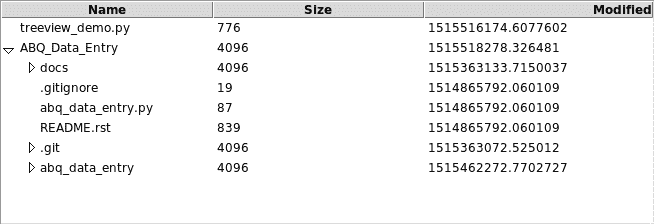
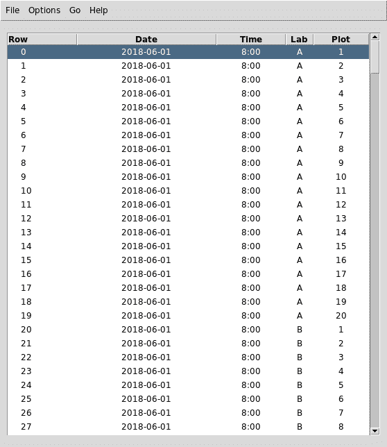

# 七、使用`Treeview`导航记录

您已收到对应用中功能的另一个请求。现在，用户可以打开任意文件，他们希望能够查看这些文件中的内容，并使用他们已经习惯的数据输入表单更正旧记录，而不必切换到电子表格。简而言之，现在终于到了在我们的应用中实现读取和更新功能的时候了。

在本章中，我们将介绍以下主题：

*   修改我们的 CSV 模型以实现读取和更新功能
*   发现 ttk`Treeview`小部件，并使用它构建记录列表
*   在数据记录表单中实现记录加载和更新
*   重新设计菜单和应用，牢记读取和更新

# 在模型中实现读取和更新

到目前为止，我们的整个设计都围绕着一个只向文件追加数据的表单进行；添加读取和更新功能是一个基本的更改，它几乎涉及应用的每个部分。这似乎是一项艰巨的任务，但通过一次只完成一个组件，我们将看到变化并不是那么势不可挡。

我们应该做的第一件事是更新我们的文档，从`Requirements`部分开始：

```py
The program must:

* Provide a UI for reading, updating, and appending data to the CSV file
* ...
```

当然，也要更新不需要的部件，如下所示：

```py
The program does not need to:

* Allow deletion of data.
```

现在，只需使代码与文档匹配即可。

# 将读取和更新添加到我们的模型中

打开 Tobe T0 并考虑从 Ty1 T1 类中缺失的内容：

*   我们需要一个方法，可以检索文件中的所有记录，以便显示它们。我们称之为`get_all_records()`。
*   我们需要一种方法来按行号从文件中提取单个记录。我们可以称之为`get_record()`。
*   我们需要以一种不仅可以追加新记录，还可以更新现有记录的方式保存记录。我们可以更新我们的`save_record()`方法来适应这一点。

# 实现获取所有记录（）

启动一个名为`get_all_records()`的新方法：

```py
    def get_all_records(self):
        if not os.path.exists(self.filename):
            return []
```

我们做的第一件事是检查模型的文件是否存在。请记住，当我们的应用启动时，它会生成一个默认文件名，指向一个可能还不存在的文件，因此`get_all_records()`需要优雅地处理这种情况。在这种情况下，返回空列表是有意义的，因为如果文件不存在，就没有数据。

如果文件确实存在，让我们以只读模式打开它并获取所有记录：

```py
        with open(self.filename, 'r') as fh:
            csvreader = csv.DictReader(fh)
            records = list(csvreader)
```

虽然效率不太高，但在我们的例子中，将整个文件拉入内存并将其转换为列表是可以接受的，因为我们知道最大的文件应该仅限于 401 行：20 个绘图乘以 5 个实验室加上一个标题行。然而，这段代码有点过于信任。我们至少应该做一些健全性检查，以确保用户实际打开了一个包含正确字段的 CSV 文件，而不是其他任意文件。

让我们检查文件是否具有正确的字段结构：

```py
        csvreader = csv.DictReader(fh)
        missing_fields = (set(self.fields.keys()) -    
                          set(csvreader.fieldnames))
        if len(missing_fields) > 0:
            raise Exception(
                "File is missing fields: {}"
                .format(', '.join(missing_fields))
            )
        else:
            records = list(csvreader)
```

在这里，我们首先通过将`fields`字典`keys`和 CSV 文件`fieldnames`的列表转换为 Python`set`对象来查找任何缺少的字段。我们可以从`keys`中减去`fieldnames`集合，并确定文件中缺少哪些字段（如果有）。如果有，我们会提出一个例外；否则，我们将 CSV 数据转换为`list`。

Python`set`对象对于比较`list`、`tuple`和其他序列对象的内容非常有用。它们提供了一种简单的方式来获取信息，例如两个集合之间的差异（在`x`中的项目不在`y`中）或交叉点（在`x`和`y`中的项目），或者允许您在不考虑顺序的情况下比较序列。

在返回`records`列表之前，我们需要更正一个问题；CSV 文件中的所有数据都存储为文本，Python 将其作为字符串读取。这大部分都不是问题，因为 Tkinter 将根据需要负责将字符串转换为`float`或`int`，但`bool`值作为字符串`True`和`False`存储在 CSV 文件中，而将这些值直接强制回`bool`并不起作用。`False`是一个非空字符串，在 Python 中所有非空字符串的计算结果都是`True`。

为了解决这个问题，我们首先定义一个字符串列表，该列表应解释为`True`：

```py
        trues = ('true', 'yes', '1')
```

本列表中未列出的任何值将被视为`False`。我们将进行不区分大小写的比较，因此列表中只有小写值。

接下来，我们使用列表理解创建一个属于`boolean`字段的字段列表，如下所示：

```py
        bool_fields = [
            key for key, meta
            in self.fields.items()
            if meta['type'] == FT.boolean]
```

我们知道`Equipment Fault`是我们唯一的布尔字段，所以技术上我们可以在这里硬编码，但是设计模型是一个好主意，这样对模式的任何更改都将由逻辑部分自动适当处理。

现在，让我们通过添加以下代码来检查每行中的这些布尔字段：

```py
        for record in records:
            for key in bool_fields:
                record[key] = record[key].lower() in trues
```

对于每个记录，我们遍历布尔字段列表，对照 truthy 字符串列表检查其值，并相应地设置项的值。

固定布尔值后，我们可以返回我们的`records`列表，如下所示：

```py
        return records
```

# 实现 get_record（）

我们的`get_record()`方法需要获取一个行号并返回一个包含该行数据的字典。

如果我们利用我们的`get_all_records()`方法，这是非常简单的，如下所示：

```py
    def get_record(self, rownum):
        return self.get_all_records()[rownum]
```

因为我们的文件很小，而且拉取所有记录的开销很小，所以我们可以简单地这样做，然后取消引用我们需要的记录。

记住，有可能通过我们记录列表中不存在的`rownum`；在这种情况下，我们会得到`IndexError`；我们的调用代码需要捕获此错误并进行适当处理。

# 添加更新以保存 _ 记录（）

要转换我们的`save_record()`方法以便更新记录，我们需要做的第一件事是提供传递行号以进行更新的功能。默认值为`None`，这将指示数据是应追加的新行。

新方法签名如下所示：

```py
    def save_record(self, data, rownum=None):
        """Save a dict of data to the CSV file"""
```

我们现有的逻辑不需要更改，但只有在`rownum`为`None`时才应该运行它。

所以，方法中首先要做的是检查`rownum`：

```py
        if rownum is not None:
            # This is an update, new code here
        else:
            # Old code goes here, indented one more level
```

对于相对较小的文件，更新单行的最简单方法是将整个文件加载到列表中，更改列表中的行，然后将整个列表写回干净的文件。

在`if`块下，我们将添加以下代码：

```py
            records = self.get_all_records()
            records[rownum] = data
            with open(self.filename, 'w') as fh:
                csvwriter = csv.DictWriter(fh,
                    fieldnames=self.fields.keys())
                csvwriter.writeheader()
                csvwriter.writerows(records)
```

我们再次利用`get_all_records()`方法将 CSV 文件的内容提取到列表中。然后，我们将请求行中的字典替换为提供的`data`字典。最后，我们以写入模式（`w`打开文件，该模式将清除其内容并替换为我们写入文件的内容，并将头和所有记录写回文件。

我们采用的方法使得两个用户同时在 save CSV 文件中工作是不安全的。创建允许多个用户编辑单个文件的软件是出了名的困难，许多程序只是选择首先使用锁定文件或其他保护机制来阻止它。

这个方法已经完成，这就是我们需要在模型中更改的所有内容，以支持更新和查看。现在，是向 GUI 添加必要功能的时候了。

# 实现记录列表视图

记录列表视图将允许我们的用户浏览文件内容，并打开记录进行查看或编辑。我们的用户习惯于在电子表格中看到这些数据，这些数据以类似表格的格式显示，因此以类似的方式设计视图是有意义的。由于我们的视图主要用于查找和选择单个记录，因此不需要显示所有信息；刚好足够让用户区分一条记录和另一条记录。

快速分析表明，我们需要 CSV 行号、`Date`、`Time`、`Lab`和`Plot`。

为了构建具有可选行的类似表格的视图，Tkinter 给我们提供了 ttk`Treeview`小部件。要构建记录列表视图，我们需要了解`Treeview`。

# ttk 树视图

`Treeview`是一个 ttk 小部件，旨在以层次结构显示数据列。

这类数据的最佳示例可能是文件系统树：

*   每行可以表示一个文件或目录
*   每个目录可以包含其他文件或目录
*   每行都可以具有其他数据属性，例如权限、大小或所有权信息

为了探索`Treeview`的工作原理，我们将在`pathlib`的帮助下创建一个简单的文件浏览器。

在前面的章节中，我们使用`os.path`处理文件路径。`pathlib`是 Python 3 标准库的新添加，它提供了一种更面向对象的路径方法。

打开一个名为`treeview_demo.py`的新文件，从该模板开始：

```py
import tkinter as tk
from tkinter import ttk
from pathlib import Path

root = tk.Tk()
# Code will go here

root.mainloop()
```

首先，我们将获得当前工作目录下所有文件路径的列表。`Path`有一个名为`glob`的方法，该方法将为我们提供如下列表：

```py
paths = Path('.').glob('**/*')
```

`glob()` expands wildcard characters like `*` and `?` against a filesystem tree. The name goes back to a very early Unix command, though the same wildcard syntax is now used across most modern operating systems.

`Path('.')`创建一个引用当前工作目录的路径对象，`**/*`是一种特殊的通配符语法，递归地抓取路径下的所有对象。结果是一个`Path`对象列表，其中包括当前目录下的每个目录和文件。

完成后，我们可以通过执行以下代码来创建和配置`Treeview`小部件：

```py
tv = ttk.Treeview(root, columns=['size', 'modified'], 
                  selectmode='None')
```

与任何 Tkinter 小部件一样，`Treeview`的第一个参数是它的`parent`小部件。`Treeview`小部件中的每一列都有一个标识字符串；默认情况下，始终有一列名为`"#0"`。此列表示树中每个项目的基本标识信息，例如名称或 ID 号。要添加更多列，我们使用`columns`参数指定它们。此列表包含用于标识后续列的任意数量的字符串。

最后，我们设置了`selectmode`，它决定了用户如何选择树中的项目。

下表显示了`selectmode`的选项：

| **值** | **行为** |
| `selectmode` | 可以进行选择 |
| `none`（作为字符串，而不是`None`对象） | 无法进行任何选择 |
| `browse` | 用户只能选择一个项目 |
| `extended` | 用户可以选择多个项目 |

在本例中，我们阻止选择，因此将其设置为`none`。

为了说明如何使用列名，我们将为列设置一些标题：

```py
tv.heading('#0', text='Name')
tv.heading('size', text='Size', anchor='center')
tv.heading('modified', text='Modified', anchor='e')
```

`Treeview`标题方法用于操作`heading`列小部件；它接受列名，然后是要分配给列的`heading`小部件的任意数量的属性。

这些属性可以包括：

*   `text`：标题显示的文本。默认情况下，它是空白的。
*   `anchor`：文本对齐；它可以是八个基本方向中的任意一个或`center`，指定为字符串或 Tkinter 常量。
*   `command`：点击标题时运行的命令。例如，这可用于按该列对行进行排序，或选择该列中的所有值。
*   `image`：要在标题中显示的图像。

最后，我们将列打包到`root`小部件中，并将其展开以填充小部件：

```py
tv.pack(expand=True, fill='both')
```

除了配置标题外，我们还可以使用`Treeview.column`方法配置列本身的一些属性。

例如，我们可以添加以下代码：

```py
tv.column('#0', stretch=True)
tv.column('size', width=200)
```

在本例中，我们将第一列中的`stretch`设置为`True`，这将导致它展开以填充可用内容；我们已经将`size`列上的`width`值设置为`200`像素。

可以设置的列参数包括：

*   `stretch`：是否扩展此列以填充可用空间。
*   `width`：以像素为单位的列的宽度。
*   `minwidth`：可以调整列大小的最小宽度，以像素为单位。
*   `anchor`：列中文本的对齐方式。可以是八个基本方向或中心中的任意一个，指定为字符串或 Tkinter 常量。

配置了树视图后，现在需要用数据填充它。使用`insert`方法一次填充一行`Treeview`数据。

`insert`方法如下：

```py
mytreeview.insert(parent, 'end', iid='item1',
          text='My Item 1', values=['12', '42'])
```

第一个参数指定插入行的`parent`项。这不是`parent`小部件，而是插入的行在层次结构中所属的`parent`行。该值是引用`parent`项的`iid`的字符串。对于顶级项，此值应为空字符串。

下一个参数指定项目应插入的位置。它是一个数字索引或`end`，将该项放在列表的末尾。

在此之后，我们指定关键字参数，包括：

*   `text`：这是第一列显示的值。
*   `values`：这是剩余列的值列表。
*   `image`：这是要显示在列最左侧的图像对象。
*   `iid`：物料 ID 字符串。如果您未指定，将自动分配此项。
*   `open`：开始时该行是否打开（显示子项）。
*   `tags`：标签字符串列表。

要将我们的路径插入到`Treeview`中，让我们迭代`paths`列表，如下所示：

```py
for path in paths:
    meta = path.stat()
    parent = str(path.parent)
    if parent == '.':
        parent = ''
```

在调用`insert`之前，我们需要从 path 对象中提取并准备一些数据。`path.stat()`将为我们提供一个包含各种文件信息的对象。`path.parent`为我们提供了包含路径；但是，我们需要将`root`路径的名称（当前为单点）更改为空字符串，这就是`Treeview`表示`root`节点的方式。

现在，我们添加`insert`调用如下：

```py
    tv.insert(parent, 'end', iid=str(path),
        text=str(path.name), values=[meta.st_size, meta.st_mtime])
```

通过使用路径字符串作为项 ID，我们可以将其指定为子对象的父对象。我们仅使用对象`name`（不包含路径）作为显示值，然后使用`st_size`和`st_mtime`填充大小和修改时间列。

运行此脚本，您将看到一个简单的文件树浏览器，其外观如下所示：



默认情况下，`Treeview`小部件不提供任何排序功能，但我们可以相当轻松地添加它

首先，我们通过添加以下代码来创建排序函数：

```py
def sort(tv, col):
    itemlist = list(tv.get_children(''))
    itemlist.sort(key=lambda x: tv.set(x, col))
    for index, iid in enumerate(itemlist):
        tv.move(iid, tv.parent(iid), index)
```

在前面的代码片段中，`sort`函数接受一个`Treeview`小部件和我们将在其中排序的列的 ID。它首先使用`Treeview`的`get_children()`方法获取所有`iid`值的列表。接下来，它使用每个项目的`col`值作为键对各种`iid`值进行排序；相当令人困惑的是，`Treeview`的`set()`方法用于检索列的值（没有`get()`方法）。最后，我们迭代列表，并使用`move()`方法将每个项移动到其父项下的新索引（使用`parent()`方法检索）。

要使列可排序，请使用`command`参数将此函数添加为对标题的回调，如下所示：

```py
tv.heading('#0', text='Name', command=lambda: sort(tv, '#0'))
tv.heading('size', text='Size', anchor='center',
           command=lambda: sort(tv, 'size'))
tv.heading('modified', text='Modified', anchor='e',
           command=lambda: sort(tv, 'modified'))
```

# 使用 Treeview 实现我们的记录列表

现在我们已经了解了如何使用`Treeview`小部件，让我们开始构建记录列表小部件。

我们将从子类化`tkinter.Frame`开始，就像我们对记录表单所做的那样：

```py
class RecordList(tk.Frame):
    """Display for CSV file contents"""
```

为了避免重复代码，我们将在类常量中定义列属性和默认值。这也使得调整它们以满足我们的需要变得更容易。

使用以下属性开始您的类：

```py
    column_defs = {
        '#0': {'label': 'Row', 'anchor': tk.W},
        'Date': {'label': 'Date', 'width': 150, 'stretch': True},
        'Time': {'label': 'Time'},
        'Lab': {'label': 'Lab', 'width': 40},
        'Plot': {'label': 'Plot', 'width': 80}
        }
    default_width = 100
    default_minwidth = 10
    default_anchor = tk.CENTER
```

回想一下，我们将要显示`Date`、`Time`、`Lab`和`Plot`。对于第一个默认列，我们将显示 CSV 行号。我们还为一些列设置了`width`和`anchor`值，并将`Date`字段配置为拉伸。在`__init__()`中配置`Treeview`小部件时，我们将使用这些值。

让我们开始我们的`__init__()`定义如下：

```py
    def __init__(self, parent, callbacks, *args, **kwargs):
        super().__init__(parent, *args, **kwargs)
        self.callbacks = callbacks
```

与其他视图一样，我们将接受来自`Application`对象的回调方法字典，并将其保存为实例属性。

# 配置 Treeview 小部件

现在，让我们通过执行以下代码片段来创建`Treeview`小部件：

```py
        self.treeview = ttk.Treeview(self,
            columns=list(self.column_defs.keys())[1:],
            selectmode='browse')
```

请注意，我们将`#0`列从`columns`列表中排除；因为它是自动创建的，所以不应该在这里指定它。我们还选择了`browse`选择模式，以便用户可以选择 CSV 文件的各个行。

让我们继续将我们的`Treeview`小部件添加到`RecordList`并使其填充小部件：

```py
        self.columnconfigure(0, weight=1)
        self.rowconfigure(0, weight=1)
        self.treeview.grid(row=0, column=0, sticky='NSEW')
```

现在，通过迭代`column_defs`字典来配置`Treeview`的列和标题：

```py
        for name, definition in self.column_defs.items():
```

对于每一组项，让我们提取所需的配置值，如下所示：

```py
            label = definition.get('label', '')
            anchor = definition.get('anchor', self.default_anchor)
            minwidth = definition.get(
                'minwidth', self.default_minwidth)
            width = definition.get('width', self.default_width)
            stretch = definition.get('stretch', False)
```

最后，我们将使用这些值来配置标题和列：

```py
            self.treeview.heading(name, text=label, anchor=anchor)
            self.treeview.column(name, anchor=anchor,
                minwidth=minwidth, width=width, stretch=stretch)
```

# 添加滚动条

ttk`Treeview`默认没有滚动条；它*可以*滚动，使用键盘或鼠标滚轮控制，但用户有理由期望在可滚动区域上有一个滚动条，以帮助他们可视化列表的大小及其当前位置。

幸运的是，ttk 为我们提供了一个可以连接到我们的`Treeview`小部件的`Scrollbar`对象：

```py
        self.scrollbar = ttk.Scrollbar(self,
            orient=tk.VERTICAL, command=self.treeview.yview)
```

在这里，`Scrollbar`采用了以下两个重要论点：

*   `orient`：此参数决定是水平滚动还是垂直滚动
*   `command`：此参数为滚动条移动事件提供回调

在这种情况下，我们将回调设置为树视图的`yview`方法，用于使`Treeview`上下滚动。另一个选项是`xview`，用于水平滚动。

我们还需要将`Treeview`连接回滚动条：

```py
        self.treeview.configure(yscrollcommand=self.scrollbar.set)
```

如果我们不这样做，我们的`Scrollbar`将不知道我们已经滚动列表到底有多远或者列表有多长，并且无法适当地设置 bar 小部件的大小或位置。

配置了`Scrollbar`之后，我们需要按常规将其放置在小部件上，就在正在滚动的小部件的右侧。

我们可以使用我们的`grid`布局管理器来完成以下任务：

```py
        self.scrollbar.grid(row=0, column=1, sticky='NSW')
```

请注意，我们将`sticky`设置为北、南和西。北部和南部确保滚动条延伸小部件的整个高度，西部确保滚动条紧贴其左侧的`Treeview`小部件。

# 填充树视图

现在我们有了`Treeview`小部件，我们将创建一个`populate()`方法来用数据填充它：

```py
    def populate(self, rows):
        """Clear the treeview & write the supplied data rows to it."""
```

`rows`参数将获取`dict`数据类型的列表，例如从`model`返回的内容。其思想是，控制器将从模型中获取一个列表，然后将其传递给此方法。

在重新填充`Treeview`之前，我们需要清空它：

```py
        for row in self.treeview.get_children():
            self.treeview.delete(row)
```

`Treeview`的`get_children()`方法返回每行`iid`的列表。我们正在迭代这个列表，将每个`iid`传递给`Treeview.delete()`方法，正如您所期望的那样，该方法会删除该行。

清除`Treeview`后，我们可以遍历`rows`列表并填充表格：

```py
        valuekeys = list(self.column_defs.keys())[1:]
        for rownum, rowdata in enumerate(rows):
            values = [rowdata[key] for key in valuekeys]
            self.treeview.insert('', 'end', iid=str(rownum),
                                 text=str(rownum), values=values)
```

我们在这里要做的第一件事是创建一个列表，列出我们实际上想要从每一行获取的所有键；这只是从`self.column_defs`减去`"#0"`列的键列表。

接下来，我们使用`enumerate()`函数对行进行迭代以生成行号。对于每一行，我们将使用列表理解以正确的顺序创建一个值列表，然后使用`insert()`方法将列表插入到`Treeview`小部件的末尾。请注意，我们只是将行号（转换为字符串）用作行的`iid`和`text`。

在这个函数中，我们需要做的最后一件事是一个小的可用性调整。为了使我们的`Treeview`键盘友好，我们需要聚焦第一项，以便键盘用户可以立即开始通过箭头键导航。

在`Treeview`小部件中执行此操作实际上需要三个方法调用，如下所示：

```py
        if len(rows) > 0:
            self.treeview.focus_set()
            self.treeview.selection_set(0)
            self.treeview.focus('0')
```

首先，`focus_set`将焦点移动到`Treeview`。接下来，`selection_set(0)`选择列表中的第一条记录。最后，`focus('0')`以`0`中的`iid`聚焦该行。当然，我们只在有行的情况下才这样做。

# 响应记录选择

此小部件的用途是供用户选择和打开记录；因此，我们需要一种方法来做到这一点。如果能够通过双击或键盘选择之类的事件触发它，那就太好了。

`Treeview`小部件有三个特殊事件，我们可以使用它们触发回调，如下表所示：

| **事件串** | 时触发 |
| `<<TreeviewSelect>>` | 选中一行，例如用鼠标单击该行 |
| `<<TreeviewOpen>>` | 双击或选择一行并点击*回车*即可打开一行 |
| `<<TreeviewClose>>` | 打开的行是关闭的 |

`<<TreeviewOpen>>`听起来像是我们想要的活动；尽管我们没有使用分层列表，但用户仍在概念上打开记录，触发动作（双击）似乎很直观。我们将此事件绑定到将打开所选记录的方法。

在`__init__()`末尾添加此代码：

```py
        self.treeview.bind('<<TreeviewOpen>>', self.on_open_record)
```

`on_open_record()`方法比较简单；将此代码添加到类：

```py
    def on_open_record(self, *args):
        selected_id = self.treeview.selection()[0]
        self.callbacks['on_open_record'](selected_id)
```

只需从`Treeview`中检索所选 ID，然后使用所选 ID 在`callbacks`字典中调用控制器提供的函数即可。这将取决于控制器在此处执行适当的操作。

`RecordList`类现在已经完成，但是我们的一些其他视图类需要注意。

# 修改记录表单以进行读取和更新

只要我们在编辑视图，我们就需要查看`DataRecordForm`视图并对其进行调整，使其能够更新记录。

花点时间考虑一下我们需要做的以下变化：

*   表单需要某种方式加载到控制器提供的记录中。
*   表单需要跟踪它正在编辑的记录，或者它是否是新记录。
*   我们的用户需要一些视觉指示来显示正在编辑的记录。
*   我们的保存按钮当前在应用中。它在除表单之外的任何上下文中都没有真正意义，因此它应该是表单的一部分。
*   这意味着当单击 save 按钮时，我们的表单将需要一个回调来调用。我们需要为它提供一个`callbacks`字典，就像我们对其他视图所做的那样。

# 正在更新 uuu init_uuuu（）

让我们用我们的`__init__()`方法开始处理这些问题：

```py
    def __init__(self, parent, fields, 
                 settings, callbacks, *args, **kwargs):
        self.callbacks = callbacks
```

我们正在添加一个新参数`callbacks`，并将其存储为实例属性。这将为控制器提供一种为视图调用提供方法的方法。

接下来，我们的`__init__()`方法应该设置一个变量来存储当前记录：

```py
        self.current_record = None
```

我们将使用`None`表示未加载任何记录，并且表单正在用于创建新记录。否则，该值将是引用 CSV 数据中的行的整数。

我们可以在这里使用 Tkinter 变量，但在这种情况下没有真正的优势，我们不能使用`None`作为值。

在表单顶部，在第一个表单字段之前，我们添加一个标签，用于跟踪正在编辑的记录：

```py
        self.record_label = ttk.Label()
        self.record_label.grid(row=0, column=0)
```

我们把它放在`0`行`0`列，但第一个`LabelFrame`也在那个位置。您需要遍历每个`LabelFrame`并在其对`grid`的调用中增加`row`值。

我们将确保在将记录加载到表单时更新此标签。

在小部件的最后，`Notes`字段之后，让我们添加新的保存按钮，如下所示：

```py
        self.savebutton = ttk.Button(self,
            text="Save", command=self.callbacks["on_save"])
        self.savebutton.grid(sticky="e", row=5, padx=10)
```

单击按钮时，将从`callbacks`字典调用`on_save()`方法。我们需要确保在`Application`中创建`DataRecordForm`时提供此方法。

# 添加 load_record（）方法

在我们的视图中，最后要添加的是加载新记录的方法。此方法需要使用控制器提供的给定行号和数据字典设置表单。

我们将其命名为`load_record()`如下：

```py
    def load_record(self, rownum, data=None):
```

我们应该做的第一件事是从提供的`rownum`中设置表单的`current_record`值：

```py
        self.current_record = rownum
```

回想一下，`rownum`可能是`None`，表示这是一个新记录。

让我们通过执行以下代码来检查这一点：

```py
        if rownum is None:
            self.reset()
            self.record_label.config(text='New Record')
```

如果要插入新记录，只需重置表单，然后设置标签以指示这是新记录。

注意我们这里的`if`条件专门检查`rownum`是否为`None`；我们不能只检查`rownum`的真值，因为`0`是更新的有效`rownum`！

如果我们确实有一个有效的`rownum`，我们需要它采取不同的行动：

```py
        else:
            self.record_label.config(text='Record #{}'.format(rownum))
            for key, widget in self.inputs.items():
                self.inputs[key].set(data.get(key, ''))
                try:
                    widget.input.trigger_focusout_validation()
                except AttributeError:
                    pass
```

在这个块中，我们首先使用正在编辑的行号适当地设置标签。

然后，我们循环使用`inputs`字典中的键和小部件，并从`data`字典中提取匹配值。我们还尝试对每个小部件的输入调用`trigger_focusout_validation()`方法，因为 CSV 文件可能包含无效数据。如果输入没有这样的方法（也就是说，如果我们使用一个常规的 Tkinter 小部件，而不是一个自定义的小部件，比如使用`Checkbutton`，我们什么也不做。

# 更新应用的其余部分

在对表单所做的更改生效之前，我们需要更新应用的其余部分以获得新功能。我们的主菜单需要一些导航项，以便用户可以在记录列表和表单之间切换，并且需要在`Application`中创建或更新控制器方法，以整合我们的新模型和视图功能。

# 主菜单更改

由于我们已经在`views.py`文件中，让我们首先用一些命令更新主菜单视图，以便在记录列表和记录表单之间切换。我们将在菜单中添加一个`Go`菜单，其中包含另外两个选项，允许在记录列表和空白记录表单之间切换。

在`Options`和`Help`菜单之间添加以下行：

```py
        go_menu = tk.Menu(self, tearoff=False)
        go_menu.add_command(label="Record List",
                         command=callbacks['show_recordlist'])
        go_menu.add_command(label="New Record",
                         command=callbacks['new_record'])
        self.add_cascade(label='Go', menu=go_menu)
```

和前面一样，我们将这些菜单命令绑定到`callbacks`字典中的函数，我们需要将其添加到`Application`类中。

# 连接应用中的部件

让我们快速评估一下`Application`课程中需要进行的以下更改：

*   我们需要添加一个`RecordList`视图的实例
*   我们需要更新我们对`CSVModel`的使用，以便我们可以从中访问数据
*   我们需要实现或重构视图使用的几个回调方法

# 添加记录列表视图

我们将通过执行以下代码片段，在`__init__()`中`DataRecordForm`之后创建`RecordList`对象：

```py
        self.recordlist = v.RecordList(self, self.callbacks)
        self.recordlist.grid(row=1, padx=10, sticky='NSEW')
```

注意，当我们调用`grid()`时，我们将`RecordList`视图添加到已经包含`DataRecordForm`的网格单元中。**这是有意的**。当我们这样做时，Tkinter 只是将第二个小部件堆叠在第一个小部件之上，就像将一张纸放在另一张纸上一样；稍后我们将添加代码，通过将一个视图或另一个视图提升到堆栈顶部来控制哪个视图可见。请注意，我们还将小部件粘贴到单元格的所有侧面。如果没有这些代码，一个小部件的位可能在另一个小部件后面可见。

同样，我们需要更新`grid`对记录表单的调用，如下所示：

```py
        self.recordform.grid(row=1, padx=10, sticky='NSEW')
```

# 移动模型

目前，我们的数据模型对象只在`on_save()`方法中创建，每次用户保存时都会重新创建。我们将要编写的其他一些回调也需要访问模型，因此我们将创建一个数据模型实例，当`Application`类启动或选择新文件名时，所有方法都可以共享该实例。让我们来看看下面的步骤：

1.  首先，在创建`default_filename`之后立即编辑`Application.__init__()`方法：

```py
        self.filename = tk.StringVar(value=default_filename)
        self.data_model = m.CSVModel(filename=self.filename.get())
```

2.  接下来，`on_file_select()`方法需要在文件名更改时重新创建`data_model`对象。
3.  将`on_file_select()`的结尾改为以下代码：

```py
        if filename:
            self.filename.set(filename)
            self.data_model = m.CSVModel(filename=self.filename.get())
```

现在，`self.data_model`总是指向当前的数据模型，我们所有的方法都可以使用它来保存或读取数据。

# 填充记录列表

`Treeview`小部件被添加到我们的应用中，但我们需要一种用数据填充它的方法。

我们将通过执行以下代码创建一个名为`populate_recordlist()`的方法：

```py
    def populate_recordlist(self):
```

逻辑非常简单：只需从模型中获取所有行并将它们发送到记录列表的`populate()`方法。

我们可以这样简单地写：

```py
        rows = self.data_model.get_all_records()
        self.recordlist.populate(rows)
```

但是请记住，如果文件出现问题，`get_all_records()`将引发一个`Exception`；我们需要捕获该异常，并让用户知道问题出在哪里。

用`try`和`except`块更新代码，如下所示：

```py
        try:
            rows = self.data_model.get_all_records()
        except Exception as e:
            messagebox.showerror(title='Error',
                message='Problem reading file',
                detail=str(e))
        else:
            self.recordlist.populate(rows)
```

在这种情况下，如果我们从`get_all_records()`获得异常，我们将显示一个错误对话框，显示`Exception`文本。

`RecordList`视图应在创建新模型时重新填充；目前，这种情况发生在`Application.__init__()`和`Application.on_file_select()`中。

创建记录列表后立即更新`__init__()`：

```py
        self.recordlist = v.RecordList(self, self.callbacks)
        self.recordlist.grid(row=1, padx=10, sticky='NSEW')
        self.populate_recordlist()
```

在`if filename:`块的最末端更新`on_file_select()`，如下所示：

```py
        if filename:
            self.filename.set(filename)
            self.data_model = m.CSVModel(filename=self.filename.get())
            self.populate_recordlist()
```

# 添加新回调

查看我们的视图代码，需要将以下回调函数添加到我们的`callbacks`字典中：

*   `show_recordlist()`：当用户点击菜单中的记录列表选项时调用此功能，应使记录列表可见
*   `new_record()`：当用户点击菜单中的新建记录时调用此功能，应显示复位`DataRecordForm`
*   `on_open_record()`：打开记录列表项时调用此函数，应显示`DataRecordForm`，填写记录的 ID 和数据
*   `on_save()`：点击保存按钮（现在是`DataRecordForm`的一部分）时调用此功能，应使记录表单中的数据更新或插入模型中

我们将从`show_recordlist()`开始：

```py
    def show_recordlist(self):
        """Show the recordform"""
        self.recordlist.tkraise()
```

请记住，当我们布置主应用时，我们将`recordlist`堆叠在数据输入表单的顶部，这样一来，一个应用就掩盖了另一个应用。可以在任何 Tkinter 小部件上调用`tkraise()`方法，将其提升到小部件堆栈的顶部。在这里调用它会将我们的`RecordList`小部件提升到顶部，并隐藏数据输入表单。

别忘了在`callbacks`字典中添加以下内容：

```py
        self.callbacks = {
             'show_recordlist': self.show_recordlist,
             ...
```

`new_record()`和`on_open_record()`回调都会导致显示`recordform`；一个调用时不带行号，另一个调用时带行号。我们可以用一种方法很容易地回答这两个问题。

我们把这个方法称为`open_record()`：

```py
    def open_record(self, rownum=None):
```

请记住，我们的`DataRecordForm.load_record()`方法需要一个行号和一个`data`字典，如果行号是`None`，它会重置表单以获得新记录。因此，我们需要做的就是设置行号并相应地记录，然后将它们传递到`load_record()`方法中。

首先，我们将处理`rownum`为`None`：

```py
        if rownum is None:
            record = None
```

没有行号，就没有记录。很简单。

现在，如果有行号，我们需要尝试从模型中获取该行，并将其用于`record`：

```py
        else:
            rownum = int(rownum)
            record = self.data_model.get_record(rownum)
```

请注意，Tkinter 可能以字符串形式传入`rownum`，因为`Treeview`的`iid`值是字符串。我们将对`int`进行安全转换，因为这是我们的模型所期望的。

请记住，如果读取文件时出现问题，模型会抛出一个`Exception`，因此我们应该抓住这个问题。

将对`get_record()`的呼叫置于`try`区块内：

```py
        try:
            record = self.data_model.get_record(rownum)
        except Exception as e:
            messagebox.showerror(title='Error',
                message='Problem reading file',
                detail=str(e))
            return
```

如果出现`Exception`，我们将显示一个错误对话框，并从函数返回，而不做任何更改。

在`rownum`和`record`设置正确后，我们现在可以将它们传递给`DataRecordForm`：

```py
        self.recordform.load_record(rownum, record)
```

最后，我们需要提升`form`小部件，使其位于记录列表的顶部：

```py
        self.recordform.tkraise()
```

现在，我们可以更新我们的`callbacks`字典，将这些键指向新方法：

```py
        self.callbacks = {
            'new_record': self.open_record,
            'on_open_record': self.open_record,
            ...
```

你可以说，我们不应该在这里两次使用相同的方法，只是让我们的观点使用相同的方法；然而，让视图在语义上引用回调是有意义的，也就是说，根据它们打算完成什么，而不是如何完成，然后让控制器确定哪段代码最符合语义需求。如果在某个时候，我们需要将它们分成两种方法，我们只需要在`Application`中这样做。

我们已经有了一个用于`on_save()`的方法，因此这非常简单，可以添加到我们的回调中：

```py
        self.callbacks = {
            ...
            'on_save': self.on_save
        }
```

然而，我们当前的`on_save()`方法只处理插入新记录。我们需要解决这个问题。

首先，我们可以删除获取文件名和创建模型的两行，因为我们可以只使用`Application`对象的`data_model`属性。

现在，将下面几行替换为：

```py
        data = self.recordform.get()
        rownum = self.recordform.current_record
        try:
            self.data_model.save_record(data, rownum)
```

我们只需要从`DataRecordForm`获取数据和当前记录，然后将它们传递给模型的`save_record()`方法。记住，如果我们发送`None`中的`rownum`，模型将插入一条新记录；否则，它将更新该行号处的记录。

因为`save_record()`可以抛出几个不同的异常，所以它位于`try`块下。

首先，如果我们试图更新一个不存在的行号，我们将得到`IndexError`，所以让我们来看一下：

```py
        except IndexError as e:
            messagebox.showerror(title='Error',
                message='Invalid row specified', detail=str(e))
            self.status.set('Tried to update invalid row')
```

如果出现问题，我们将显示一个错误对话框并更新状态文本。

`save_record()`方法也可以抛出泛型`Exception`，因为它调用模型的`get_all_records()`方法。

我们也将捕捉到这一点，并显示一个适当的错误：

```py
        except Exception as e:
            messagebox.showerror(title='Error',
                message='Problem saving record', detail=str(e))
            self.status.set('Problem saving record')
```

此方法中的其余代码应仅在未引发异常的情况下运行，因此将其移动到`else`块下：

```py
    else:
        self.records_saved += 1
        self.status.set(
            "{} records saved this session".format(self.records_saved)
        )
        self.recordform.reset()
```

由于插入或更新记录通常会导致记录列表发生更改，因此我们还应该在成功保存文件后重新填充记录列表。

在`if`块下添加以下行：

```py
            self.populate_recordlist()
```

最后，我们只想在插入新文件时重置记录表单；否则，我们就什么也不做。

将对`recordform.reset()`的调用置于`if`块下：

```py
            if self.recordform.current_record is None:
                self.recordform.reset()
```

# 清理

在退出`application.py`之前，请确保删除保存按钮代码，因为我们已将该 UI 移到`DataRecordForm`。

在`__init__()`中查找这些行以删除它们：

```py
        self.savebutton = ttk.Button(self, text="Save",
                                     command=self.on_save)
        self.savebutton.grid(sticky="e", row=2, padx=10)
```

您也可以将`statusbar`位置向上移动一行：

```py
        self.statusbar.grid(sticky="we", row=2, padx=10)
```

# 测试我们的程序

此时，您应该能够运行应用并加载到示例 CSV 文件中，如以下屏幕截图所示：



请确保尝试打开记录、编辑和保存它，以及插入新记录和打开不同的文件。

您还应测试以下错误条件：

*   尝试打开一个不是 CSV 文件的文件，或者打开一个包含错误字段的 CSV 文件。会发生什么？
*   打开有效的 CSV 文件，选择要编辑的记录，然后在单击“保存”之前，选择其他文件或空文件。会发生什么？
*   打开程序的两个副本，并将它们指向保存的 CSV 文件。尝试在程序之间交替执行编辑或更新操作。注意发生了什么。

# 总结

我们已经将我们的程序从一个只附加表单更改为一个能够从现有文件加载、查看和更新数据的应用。您学习了如何创建读写模型、使用 ttk`Treeview`以及修改现有视图和控制器以读取和更新记录。

在下一章中，我们将学习如何修改应用的外观。我们将学习如何使用小部件属性、样式和主题，以及如何使用位图图形。