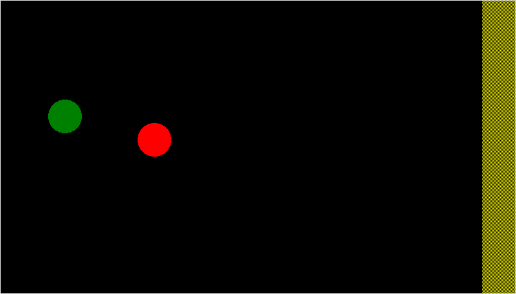
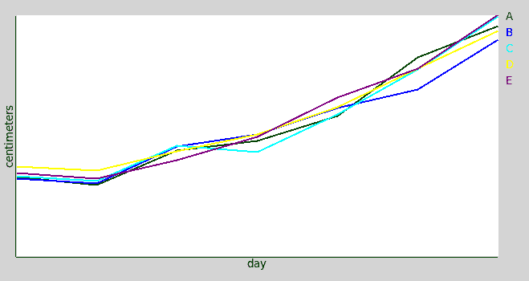
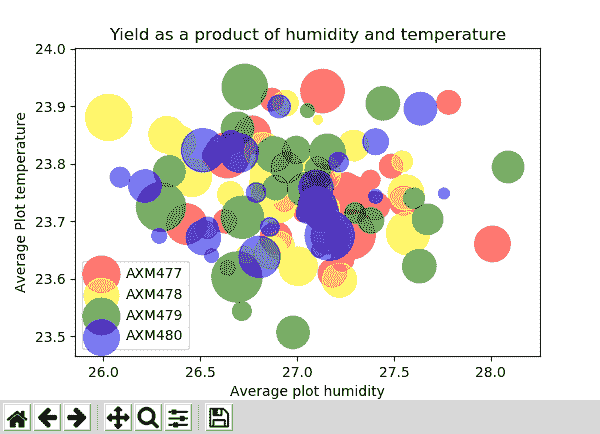

# 使用画布小部件可视化数据

随着数月的实验数据记录在数据库中，是时候开始可视化和解释它了。与其将数据导出到电子表格中以创建图表和图形，您的分析师同事还询问了该程序本身是否可以创建图形数据可视化。要实现此功能，您需要了解 Tkinter 的`Canvas`小部件。

在本章中，您将学习以下主题：

*   使用`Canvas`小部件进行绘图和动画
*   使用`Canvas`构建简单的线图
*   使用 Matplotlib 合并更高级的图形和图表

# 使用 Tkinter 的画布绘制和动画

`Canvas`小部件无疑是 Tkinter 中功能最强大的小部件。它可以用来构建任何东西，从自定义小部件和视图到完整的用户界面。顾名思义，`Canvas`是一个可以绘制图形和图像的空白区域。

`Canvas`对象可以像任何其他小部件一样创建：

```py
root = tk.Tk()
canvas = tk.Canvas(root, width=1024, height=768)
canvas.pack()
```

`Canvas`接受通常的小部件配置参数，以及用于设置其大小的`width`和`height`。一旦创建，我们就可以开始使用`canvas`的许多`create_()`方法向`canvas`添加项目。

例如，我们可以使用以下代码添加一个矩形：

```py
canvas.create_rectangle(100, 100, 200, 200, fill='orange')
```

前四个参数是画布左上角和右下角的坐标，以像素为单位。每个`create_()`方法都是这样开始的，坐标定义了形状。`fill`选项指定对象内部的颜色。

坐标也可以指定为元组对，如下所示：

```py
canvas.create_rectangle((600, 100), (700, 200), fill='#FF8800')
```

虽然这是更多的字符，但它大大提高了可读性。还要注意的是，就像 Tkinter 中其他地方的颜色一样，我们可以使用名称或十六进制代码。

我们还可以创建椭圆，如下所示：

```py
canvas.create_oval((350, 250), (450, 350), fill='blue')
```

椭圆形类似于矩形，采用其**边界框**的左上角和右下角的坐标。边框是包含一个项目的最小矩形，因此在这个椭圆形的情况下，您可以想象在一个正方形内有一个圆，角位于`(350, 250)`和`(450, 350)`。

我们可以使用`create_line()`创建行，如下所示：

```py
canvas.create_line((100, 400), (400, 500),
    (700, 400), (100, 400), width=5, fill='red')
```

线可以由任意数量的点组成，Tkinter 将在这些点之间连接点。我们已经指定了线条的宽度及其颜色（使用`fill`参数）。其他参数可以控制角点和端点的形状、直线两端箭头的存在和样式、直线是否为虚线以及虚线的方式以及直线是直线还是曲线。

以类似的方式，我们可以创建多边形，如下所示：

```py
canvas.create_polygon((400, 150), (350,  300), (450, 300),
    fill='blue', smooth=True)
```

这就像创建一条线，不同的是 Tkinter 将最后一个点连接回第一个点并填充内部。将`smooth`设置为`True`会使用贝塞尔曲线使拐角变圆。

除了简单的形状外，我们还可以在`canvas`对象上放置文本或图像，如下所示：

```py
canvas.create_text((400, 600), text='Smile!',
    fill='cyan', font='TkDefaultFont 64')
smiley = tk.PhotoImage(file='smile.gif')
image_item = canvas.create_image((400, 300), image=smiley)
```

任何`create_()`方法的返回值都是在`Canvas`对象上下文中唯一标识该项的字符串。我们可以使用该标识字符串在创建后对项目执行操作。

例如，我们可以这样绑定事件：

```py
canvas.tag_bind(image_item, '<Button-1>', lambda e: canvas.delete(image_item))
```

在这里，我们使用`tag_bind`方法将鼠标左键单击图像对象绑定到画布的`delete()`方法，该方法（在给定项目标识符时）删除项目。

# 设置画布对象的动画

Tkinter 的`Canvas`小部件没有内置的动画框架，但我们仍然可以通过将其`move()`方法与我们对事件队列的理解相结合来创建简单的动画。

为了演示这一点，我们将创建一个 bug 竞赛模拟器，其中两个 bug（由彩色圆圈表示）将随意地向屏幕另一侧的终点线竞赛。像真正的虫子一样，它们不会有任何概念，认为自己在比赛中，会随机移动，赢家是偶然击中终点线的虫子。

首先，打开一个新的 Python 文件，从基本样板开始，如下所示：

```py
import tkinter as tk

class App(tk.Tk):
    def __init__(self):
```

```py
        super().__init__()

App().mainloop()
```

# 创建我们的对象

让我们创建要在游戏中使用的对象：

1.  在`App.__init__()`中，我们将简单地创建`canvas`对象，并使用`pack()`添加它：

```py
self.canvas = tk.Canvas(self, background='black')
self.canvas.pack(fill='both', expand=1)
```

2.  接下来，我们将创建一个`setup()`方法，如下所示：

```py
   def setup(self):
       self.canvas.left = 0
       self.canvas.top = 0
       self.canvas.right = self.canvas.winfo_width()
       self.canvas.bottom = self.canvas.winfo_height()
       self.canvas.center_x = self.canvas.right // 2
       self.canvas.center_y = self.canvas.bottom // 2

       self.finish_line = self.canvas.create_rectangle(
           (self.canvas.right - 50, 0),
           (self.canvas.right, self.canvas.bottom),
           fill='yellow', stipple='gray50')
```

在前面的代码片段中，`setup()`首先计算`canvas`对象上的一些相对位置，并将它们保存为实例属性，这将简化`canvas`对象上对象的放置。终点线是一个横跨窗口右边缘的矩形，使用`stipple`参数指定一个位图，该位图将覆盖纯色，以赋予纯色一些纹理；在本例中，`gray50`是一个内置位图，交替显示黑色和透明像素。

3.  在`__init__()`末尾添加对`setup()`的调用，如下所示：

```py
self.after(200, self.setup)
```

因为`setup()`依赖于`canvas`对象的`width`和`height`值，我们需要确保在操作系统的窗口管理器绘制并调整窗口大小之前不会调用它。最简单的方法是将调用延迟几百毫秒。

4.  接下来，我们需要创造我们的球员。让我们创建一个类来表示它们，如下所示：

```py
class Racer:

    def __init__(self, canvas, color):
        self.canvas = canvas
        self.name = "{} player".format(color.title())
        size = 50
        self.id = canvas.create_oval(
            (canvas.left, canvas.center_y),
            (canvas.left + size, canvas.center_y + size),
            fill=color)
```

`Racer`类将使用对`canvas`的引用和`color`字符串创建，其颜色和名称将从中派生。我们将首先在屏幕的左中部绘制赛车手，并将其设置为`50`像素大小。最后，我们在`self.id`中保存对其 item ID 字符串的引用。

5.  现在，回到`App.setup()`，我们将通过执行以下代码创建两个 Racer：

```py
               self.racers = [
                   Racer(self.canvas, 'red'),
                   Racer(self.canvas, 'green')]
```

6.  此时，游戏中的所有对象都已设置。运行该程序，您应该会看到右侧有黄色斑点的终点线，左侧有绿色圆圈（红色圆圈将隐藏在绿色下方）。

# 为赛车手制作动画

为了让我们的赛车手充满活力，我们将使用`Canvas.move()`方法。`move()`获取一个项目 ID、若干`x`像素和若干`y`像素，并按该数量移动该项目。通过使用`random.randint()`和一些简单的逻辑，我们可以生成一系列的动作，让每个参赛者沿着蜿蜒的路径走向终点线。

一个简单的实现可能如下所示：

```py
def move_racer(self):
    x = randint(0, 100)
    y = randint(-50, 50)
    t = randint(500, 2000)
    self.canvas.after(t, self.canvas.move, self.id, x, y)
    if self.canvas.bbox(self.id)[0] < self.canvas.right:
        self.canvas.after(t, self.move_racer)
```

然而，这并不是我们真正想要的；问题是`move()`是瞬间发生的，导致错误跳过屏幕；我们希望我们的行动能够在一段时间内顺利进行。

为此，我们将采取以下方法：

1.  计算一系列线性移动，每一个都有一个到达终点线的随机增量`x`、增量`y`和`time`
2.  将每个动作分成若干步，通过将时间划分为一个固定的间隔来确定
3.  将每个移动的每个步骤添加到队列中
4.  在我们的固定时间间隔内，从队列中拉出下一步并将其传递给`move()`

让我们从定义帧间隔和创建动画队列开始：

```py
from queue import Queue
...
class Racer:
    FRAME_RES = 50

    def __init__(...):
        ...
        self.animation_queue = Queue()
```

`FRAME_RES`（帧分辨率的缩写）定义每次`Canvas.move()`调用之间的毫秒数。`50`毫秒为我们提供每秒 20 帧的帧数，应该足以实现平稳移动。

现在创建一个方法，将路线绘制到终点线：

```py
    def plot_course(self):
        start_x = self.canvas.left
        start_y = self.canvas.center_y
        total_dx, total_dy = (0, 0)

        while start_x + total_dx < self.canvas.right:
            dx = randint(0, 100)
            dy = randint(-50, 50)
            target_y = start_y + total_dy + dy
            if not (self.canvas.top < target_y < self.canvas.bottom):
                dy = -dy
            time = randint(500, 2000)
            self.queue_move(dx, dy, time)
            total_dx += dx
            total_dy += dy
```

该方法通过生成随机的`x`和`y`运动，绘制从`canvas`左中心到右侧的路线，直到总`x`大于`canvas`对象的宽度。`x`中的变化总是积极的，让我们的 bug 一直朝着终点线移动，但`y`中的变化可以是积极的，也可以是消极的。为了让我们的 bug 留在屏幕上，我们通过否定`y`中任何会使玩家超出画布顶部或底部边界的变化来限制整个`y`移动。

除了`dx`和`dy`之外，我们还为移动生成半秒到两秒之间的`time`随机量，并将生成的值发送到`queue_move()`方法。

`queue_move()`命令需要将大的移动分解为单独的帧，描述在一个`FRAME_RES`间隔内应该发生多少移动。为此，我们需要一个**配分函数**：一个将整数`n`分解为`k`近似相等整数的数学函数。例如，如果我们想将-10 分成四部分，我们的函数应该返回一个类似[-3，-3，-2，-2]的列表。

在`Racer`上创建`partition()`作为静态方法：

```py
    @staticmethod
    def partition(n, k):
        """Return a list of k integers that sum to n"""
        if n == 0:
            return [0] * k
```

我们从简单的例子开始：当`n`是`0`时，返回一个`k`零的列表。

代码的其余部分如下所示：

```py
        base_step = int(n / k)
        parts = [base_step] * k
        for i in range(n % k):
                parts[i] += n / abs(n)
        return parts
```

首先，我们创建一个长度`k`的列表，该列表由`base_step`组成，即`n`的整数部分除以`k`。我们在这里使用`int()`类型而不是楼层划分，因为它更适合负数。接下来，我们需要在列表中尽可能均匀地分配剩余部分。为此，我们将`1`或`-1`（取决于剩余部分的符号）添加到零件清单中的第一个`n % k`项目中。

使用我们的`n = -10`和`k = 4`示例，遵循这里的数学：

*   -10/4=-2.5，截断为-2。
*   我们有一个列表：[-2，-2，-2，-2]。
*   -10%4=2，因此我们在列表的前两项中添加-1（即-10/10）。
*   我们得到的答案是[-3，-3，-2，-2]。完美的

现在我们可以写`queue_move()`：

```py
    def queue_move(self, dx, dy, time):
        num_steps = time // self.FRAME_RES
        steps = zip(
            self.partition(dx, num_steps),
            self.partition(dy, num_steps))

        for step in steps:
            self.animation_queue.put(step)
```

我们首先通过使用楼层划分将时间除以`FRAME_RES`来确定此移动中的步数。通过将`dx`和`dy`分别传递给`partition()`方法，我们创建了`x`动作列表和`y`动作列表。这两个列表与`zip`组合形成`(dx, dy)`对的单个列表，然后添加到动画队列中。

为了使动画真正发生，我们将编写一个`animate()`方法：

```py
    def animate(self):
        if not self.animation_queue.empty():
            nextmove = self.animation_queue.get()
            self.canvas.move(self.id, *nextmove)
        self.canvas.after(self.FRAME_RES, self.animate)
```

`animate()`方法检查队列是否有移动。如果有的话，`canvas.move()`会被调用，并带有车手的 ID 和需要进行的动作。最后，`animate()`方法计划在`FRAME_RES`毫秒内再次运行。

设置赛车手动画的最后一步是在`__init__()`结尾处调用`self.plot_course()`和`self.animate()`。如果你现在运行游戏，你的两点应该在屏幕上从左向右移动。但是现在还没有人赢！

# 检测和处理赢的条件

为了检测获胜条件，我们将定期检查参赛者是否与终点线项目重叠。当其中一人获胜时，我们将宣布其为赢家，并提供再次比赛的选择。

使用 Tkinter`Canvas`小部件检测项目之间的冲突有点笨拙。我们必须将一组边界框坐标传递给`find_overlapping()`，它返回与边界框重叠的项目标识符元组。

让我们为我们的`Racer`类创建一个`overlapping()`方法：

```py
    def overlapping(self):
        bbox = self.canvas.bbox(self.id)
        overlappers = self.canvas.find_overlapping(*bbox)
        return [x for x in overlappers if x!=self.id]
```

此方法使用 canvas 的`bbox()`方法检索`Racer`项的边界框。然后，它使用`find_overlapping()`获取与此边界框重叠的项目元组。接下来，我们将过滤此元组以删除`Racer`项的 ID，有效地返回与`Racer`类重叠的项列表。

回到我们的`App()`方法中，我们将创建一个`check_for_winner()`方法：

```py
    def check_for_winner(self):
        for racer in self.racers:
            if self.finish_line in racer.overlapping():
                self.declare_winner(racer)
                return
        self.after(Racer.FRAME_RES, self.check_for_winner)
```

此方法迭代我们的参赛者列表，并检查`finish_line`ID 是否在参赛者的`overlapping()`方法返回的列表中。如果是，`racer`已经到达终点线，将被宣布为赢家。

如果没有玩家被宣布为赢家，我们将安排检查在`Racer.FRAME_RES`毫秒后再次运行。

我们采用`declare_winner()`方法处理赢的条件：

```py
    def declare_winner(self, racer):
        wintext = self.canvas.create_text(
            (self.canvas.center_x, self.canvas.center_y),
            text='{} wins!\nClick to play again.'.format(racer.name),
            fill='white',
            font='TkDefaultFont 32',
            activefill='violet')
        self.canvas.tag_bind(wintext, '<Button-1>', self.reset)
```

在这个方法中，我们刚刚在`canvas`的中心创建了一个`text`项目，宣布`racer.name`为获胜者。当鼠标悬停在`activefill`参数上时，`activefill`参数会使颜色显示为紫色，向用户指示此文本可单击。

点击该文本时，调用`reset()`方法：

```py
    def reset(self, *args):
        for item in self.canvas.find_all():
            self.canvas.delete(item)
        self.setup()
```

`reset()`方法需要清除画布，因此它使用`find_all()`方法检索所有项标识符的列表，然后对每个项调用`delete()`。最后，我们调用`setup()`重置游戏。

游戏现已完成，如下图所示：



虽然并不简单，但 Tkinter 中的动画可以通过一些仔细的规划和一点数学知识提供平滑和令人满意的结果。

不过，游戏已经够多了；让我们回到实验室，研究如何使用 Tkinter`Canvas`小部件来可视化数据。

# 在画布上创建简单图形

我们要制作的第一个图形是一个简单的线形图，它显示了植物随时间的生长情况。每个实验室都有不同的气候条件，我们想看看这些条件是如何影响所有植物的生长的，因此图表中每个实验室有一条线，显示实验期间实验室内所有地块的平均高度测量值。

我们将首先创建一个模型方法来返回原始数据，然后创建一个基于`Canvas`的折线图视图，最后创建一个应用程序回调来提取数据并将其发送到图表视图。

# 创建模型方法

假设我们有一个 SQL 查询，通过从`plot_checks`表中最早的日期减去其日期来确定绘图检查的天数，然后提取`lab_id`和给定实验室中所有工厂在给定日期的`median_height`平均值。

我们将在名为`get_growth_by_lab()`的新`SQLModel`方法中运行此查询：

```py
    def get_growth_by_lab(self):
        query = (
            'SELECT date - (SELECT min(date) FROM plot_checks) AS day, '
            'lab_id, avg(median_height) AS avg_height FROM plot_checks '
            'GROUP BY date, lab_id ORDER BY day, lab_id;')
        return self.query(query)
```

我们将返回一个如下所示的数据表：

| **天** | **实验室 ID** | **平均高度** |
| 0 | A. | 7.4198750000000000 |
| 0 | B | 7.3320000000000000 |
| 0 | C | 7.5377500000000000 |
| 0 | D | 8.4633750000000000 |
| 0 | E | 7.8530000000000000 |
| 1. | A. | 6.7266250000000000 |
| 1. | B | 6.8503750000000000 |

我们将使用这些数据构建图表。

# 创建图形视图

前往`views.py`，在那里我们将创建`LineChartView`类：

```py
class LineChartView(tk.Canvas):

    margin = 20

    def __init__(self, parent, chart_width, chart_height,
                 x_axis, y_axis, x_max, y_max):
        self.max_x = max_x
        self.max_y = max_y
        self.chart_width = chart_width
        self.chart_height = chart_height
```

`LineChartView`是`Canvas`的子类，因此我们可以直接在其上绘制项目。我们将接受图表部分的父窗口小部件、高度和宽度、`x`和`y`轴的标签作为参数，`x`和`y`显示的最大值。我们将保存图表尺寸和最大值供以后使用，并为边距宽度设置 20 像素的 class 属性。

让我们开始设置此`Canvas`：

```py
        view_width = chart_width + 2 * self.margin
        view_height = chart_height + 2 * self.margin
        super().__init__(
            parent, width=view_width,
            height=view_height, background='lightgrey')
```

我们通过向两边添加边距来计算视图的`width`和`height`值，然后用它们调用超类`__init__()`，并将背景设置为`lightgrey`。我们还将图表`width`和`height`保存为实例属性。

接下来，让我们绘制轴：

```py
        self.origin = (self.margin, view_height - self.margin)
        self.create_line(
            self.origin, (self.margin, self.margin), width=2)
        self.create_line(
            self.origin,
            (view_width - self.margin,
             view_height - self.margin))
```

我们的图表的原点将是从左下角开始的`self.margin`像素，我们将`x`和`y`轴绘制为简单的黑线，从它向左和向上移动到图表的边缘。

接下来，我们将标记轴：

```py
        self.create_text(
            (view_width // 2, view_height - self.margin),
            text=x_axis, anchor='n')
        # angle requires tkinter 8.6 -- macOS users take note!
        self.create_text(
            (self.margin, view_height // 2),
            text=y_axis, angle=90, anchor='s')
```

在这里，我们正在为`x`和`y`轴的标签创建`text`项集。这里使用了一些新参数：`anchor`设置文本边界框的哪一侧附着到提供的坐标，并且`angle`将文本对象旋转给定的度数。请注意，`angle`是 Tkinter 8.6 的一项功能，因此它可能是 macOS 用户的一个问题。另外，请注意，我们使用了 south 作为旋转文本的`anchor`；即使它是旋转的，但基本方向指的是未旋转的边，因此南部始终是文本的底部，因为它通常是打印的。

最后，我们需要创建第二个包含实际图表的`Canvas`：

```py
        self.chart = tk.Canvas(
            self, width=chart_width, height=chart_height,
            background='white')
        self.create_window(
            self.origin, window=self.chart, anchor='sw')
```

虽然我们可以使用`pack()`或`grid()`等几何管理器将小部件放置在`canvas`上，但`create_window()`方法使用坐标将小部件作为`Canvas`项放置在`Canvas`上。我们将图表的左下角固定到图表的原点。

各部分就绪后，我们现在将创建一个在图表上绘制数据的方法：

```py
    def plot_line(self, data, color):
        x_scale = self.chart_width / self.max_x
        y_scale = self.chart_height / self.max_y

        coords = [(round(x * x_scale),
            self.chart_height - round(y * y_scale))
            for x, y in data]

        self.chart.create_line(*coords, width=2, fill=color)
```

在`plot_line()`中，我们首先必须将原始数据转换为可以绘制的坐标。我们需要缩放我们的`data`点，使其范围从`0`到图表对象的高度和宽度。我们的方法通过将图表维度除以最大值`x`和`y`来计算`x`和`y`的比例（即每单位`x`或`y`的像素数）。然后，我们可以使用列表理解将每个数据点乘以刻度值来转换数据。

另外，数据通常用左下角的原点绘制，但坐标是从左上角测量的，因此我们需要翻转`y`坐标；这在我们的列表理解中也是通过从图表高度减去新的`y`值来实现的。现在可以将这些坐标与调用方传入的合理的`width`和`color`参数一起传递给`create_line()`。

最后我们需要的是一个**图例**，告诉用户图表上的每种颜色代表什么。如果没有传说，这张图表将毫无意义。

让我们创建一个`draw_legend()`方法：

```py
    def draw_legend(self, mapping):
        y = self.margin
        x = round(self.margin * 1.5) + self.chart_width
        for label, color in mapping.items():
              self.create_text((x, y), text=label, fill=color, 
              anchor='w')
              y += 20
```

我们的方法使用一个字典将标签映射到颜色，这将由应用程序提供。对于每一个，我们只需绘制一个包含`label`文本和相关`fill`颜色的文本项。因为我们知道我们的标签会很短（只有一个字符），所以我们可以把它放在页边空白处。

# 更新应用程序

在`Application`类中，创建显示图表的新方法：

```py
    def show_growth_chart(self):
        data = self.data_model.get_growth_by_lab()
        max_x = max([x['day'] for x in data])
        max_y = max([x['avg_height'] for x in data])
```

第一个任务是从我们的`get_growth_by_lab()`方法中获取数据，并计算`x`和`y`轴的最大值。我们通过使用列表理解将值提取到列表中，并在列表上调用内置的`max()`函数来实现这一点。

接下来，我们将构建一个小部件来保存我们的`LineChartView`对象：

```py
        popup = tk.Toplevel()
        chart = v.LineChartView(popup, 600, 300, 'day',
                                'centimeters', max_x, max_y)
        chart.pack(fill='both', expand=1)
```

在本例中，我们使用了`Toplevel`小部件，它在主应用程序窗口外创建了一个新窗口。然后我们用*x*轴和*y*轴标签创建`LineChartView`即`600`像素，并使用`pack()`将其添加到`Toplevel`。

接下来，我们将为每个实验室分配颜色并绘制`legend`：

```py
        legend = {'A': 'green', 'B': 'blue', 'C': 'cyan',
                  'D': 'yellow', 'E': 'purple'}
        chart.draw_legend(legend)
```

最后要做的是画出实际的线：

```py
        for lab, color in legend.items():
            dataxy = [(x['day'], x['avg_height'])
                for x in data
                if x['lab_id'] == lab]
            chart.plot_line(dataxy, color)
```

请记住，我们的数据包含所有实验室的值，因此我们在`legend`中对实验室进行迭代，并使用列表理解仅提取该实验室的数据。然后我们的`plot_line()`方法完成其余工作。

完成此方法后，将其添加到`callbacks`字典中，并为每个平台的工具菜单添加一个菜单项。

调用函数时，您应该看到如下内容：



The graph won't look like much without some sample data. Unless you just like doing data entry, there is a script for loading sample data in the `sql` directory.

# 使用 Matplotlib 和 Tkinter 的高级图形

我们的折线图很漂亮，但它仍然需要大量的工作才能完全发挥功能：它缺少比例、网格线和其他功能，这些功能将使它成为一个完全有用的图表。

我们可以花费大量时间使其更加完整，但在 Tkinter 应用程序中有一种更快的方法可以获得更令人满意的图形和图表：**Matplotlib**。

Matplotlib 是一个第三方库，用于生成各种类型的专业质量交互式图形。这是一个包含许多附加组件的庞大库，我们不会介绍它的实际使用情况，但我们应该看看如何将 Matplotlib 集成到 Tkinter 应用程序中。为此，我们将创建一个气泡图，显示与`humidity`和`temperature`相关的每个地块的收益率。

You should be able to install `matplotlib` using `pip` with the command `pip install --user matplotlib`.  For complete instructions on installing, please see [https://matplotlib.org/users/installing.html.](https://matplotlib.org/users/installing.html)

# 数据模型法

在制作图表之前，我们需要一种`SQLModel`方法来提取数据：

```py
    def get_yield_by_plot(self):
        query = (
            'SELECT lab_id, plot, seed_sample, MAX(fruit) AS yield, '
            'AVG(humidity) AS avg_humidity, '
            'AVG(temperature) AS avg_temperature '
            'FROM plot_checks WHERE NOT equipment_fault '
            'GROUP BY lab_id, plot, seed_sample')
        return self.query(query)
```

本图表的目的是为每个种子样本找到`temperature`和`humidity`的最佳点。因此，我们需要每`plot`一行，包括最大`fruit`测量值、`plot`列的平均湿度和温度以及`seed_sample`。因为我们不想要任何坏数据，所以我们将过滤掉包含`Equipment``Fault`的行。

# 创建气泡图视图

要将 MatplotLib 集成到 Tkinter 应用程序中，我们需要进行几个导入。

第一个是`matplotlib`本身：

```py
import matplotlib
matplotlib.use('TkAgg')
```

在`import`部分运行代码似乎有些奇怪，您的编辑甚至可能会对此抱怨。但是在我们从`matplotlib`导入任何其他内容之前，我们需要告诉它应该使用哪个后端。在这种情况下，我们需要`TkAgg`后端，它被集成到 Tkinter 中。

现在我们可以从`matplotlib`再进口一些：

```py
from matplotlib.figure import Figure
from matplotlib.backends.backend_tkagg import (
    FigureCanvasTkAgg, NavigationToolbar2TkAgg)
```

`Figure`类表示可以绘制`matplotlib`图表的基本绘图区域。`FigureCanvasTkAgg`类是`Figure`和 Tkinter`Canvas`之间的接口，`NavigationToolbar2TkAgg`允许我们在图形上放置`Figure`的预制工具栏。

为了了解它们是如何结合在一起的，让我们从`views.py`开始我们的`YieldChartView`课程：

```py
class YieldChartView(tk.Frame):
    def __init__(self, parent, x_axis, y_axis, title):
        super().__init__(parent)
        self.figure = Figure(figsize=(6, 4), dpi=100)
        self.canvas = FigureCanvasTkAgg(self.figure, master=self)
```

调用`super().__init__()`创建`Frame`对象后，我们创建一个`Figure`对象来保存图表。`Figure`对象不采用像素大小，而是采用**英寸**大小和**每英寸**（**dpi**）设置（在这种情况下，结果是 600×400 像素`Figure`）。接下来，我们创建一个`FigureCanvasTkAgg`对象，将`Figure`对象与一个 Tkinter`Canvas`连接起来。`FigureCanvasTkAgg`对象本身不是`Canvas`对象或子类，但它有一个`Canvas`对象，我们可以在应用程序中放置它。

接下来，我们将向`FigureCanvasTkAgg`对象添加工具栏和`pack()`：

```py
        self.toolbar = NavigationToolbar2TkAgg(self.canvas, self)
        self.canvas.get_tk_widget().pack(fill='both', expand=True)
```

我们的工具栏被传递给`FigureCanvasTkAgg`对象和根窗口（本例中为`self`，将其附加到我们的图形和画布上。要将`FigureCanvasTkAgg`对象放置在`Frame`对象上，我们需要调用`get_tk_widget()`来检索其 Tkinter`Canvas`小部件，然后我们可以使用`pack()`和`grid()`根据需要对其进行打包或网格化。

下一步是设置轴：

```py
        self.axes = self.figure.add_subplot(1, 1, 1)
        self.axes.set_xlabel(x_axis)
        self.axes.set_ylabel(y_axis)
        self.axes.set_title(title)
```

在 Matplotlib 中，`axes`对象表示一组可以绘制数据的`x`和`y`轴，并使用`add_subplot()`方法创建。传递给`add_subplot()`的三个整数确定这是子批次的一列中的一行中的第一组`axes`。我们的图可能包含多个子图，这些子图以类似表格的格式排列，但我们只需要一个子图。创建之后，我们在`axes`对象上设置标签。

要创建气泡图，我们将使用 Matplotlib 的**散点图**功能，但使用每个点的大小来表示水果产量。我们还将对点进行颜色编码，以表示种子样本。

让我们实现一种绘制散点图的方法：

```py
    def draw_scatter(self, data, color, label):
        x, y, s = zip(*data)
        s = [(x ** 2)//2 for x in s]
        scatter = self.axes.scatter(
            x, y, s, c=color, label=label, alpha=0.5)
```

传入的数据应该每个记录包含三列，我们将这些数据分成三个单独的列表，分别包含`x`、`y`和`size`值。接下来，我们将放大大小值之间的差异，使其更明显，方法是将每个值平方，然后将其除以一半。这并不是绝对必要的，但当差异相对较小时，它有助于使图表更具可读性。

最后，我们通过调用`scatter()`将数据绘制到`axes`对象上，同时传递点的`color`和`label`值，并使用`alpha`参数使其半透明。

`zip(*data)` is a Python idiom for breaking a list of n-length tuples into n lists of values, essentially the reverse of `zip(x, y, s)`.

要为我们的`axes`对象绘制图例，我们需要两样东西：我们的`scatter`对象列表和它们的标签列表。要获得这些，我们必须在`__init__()`中创建两个空白列表，并在调用`draw_scatter()`时附加它们。

在`__init__()`中增加一些空列表：

```py
        self.scatters = []
        self.scatter_labels = []
```

现在，在`draw_scatter()`末尾追加列表并更新`legend()`方法：

```py
        self.scatters.append(scatter)
        self.scatter_labels.append(label)
        self.axes.legend(self.scatters, self.scatter_labels)
```

我们可以反复调用`legend()`，每次它都会破坏并重新绘制传奇。

# 应用方法

回到`Application`，让我们创建一个方法来显示我们的收益率数据。

首先创建一个`Toplevel`方法并添加我们的图表视图：

```py
        popup = tk.Toplevel()
        chart = v.YieldChartView(popup,
            'Average plot humidity', 'Average Plot temperature',
            'Yield as a product of humidity and temperature')
        chart.pack(fill='both', expand=True)
```

现在，让我们为散射体设置数据：

```py
        data = self.data_model.get_yield_by_plot()
        seed_colors = {'AXM477': 'red', 'AXM478': 'yellow',
            'AXM479': 'green', 'AXM480': 'blue'}
```

我们已经从数据模型中检索到了产量`data`，并创建了一个字典，其中包含我们希望用于每个种子样本的颜色。

现在我们只需要迭代种子样本并绘制散射体：

```py
        for seed, color in seed_colors.items():
            seed_data = [
                (x['avg_humidity'], x['avg_temperature'], x['yield'])
                for x in data if x['seed_sample'] == seed]
            chart.draw_dots(seed_data, color, seed)
```

再一次，我们使用列表理解对数据进行格式化和过滤，提供`x`的平均湿度、`y`的平均温度和`s`的产量。

将该方法添加到`callbacks`字典中，并在“生长图”选项下为其创建一个菜单项。

您的气泡图应如下所示：



请花点时间使用导航工具栏播放此图表。请注意如何缩放和平移、调整图表大小以及保存图像。这些是 Matplotlib 自动提供的强大工具。

# 总结

在本章中，您了解了 Tkinter 的图形功能。您学习了如何在 Tkinter`Canvas`小部件上绘制和设置图形动画，以及如何使用这些功能可视化数据。您还学习了如何将 Matplotlib 图形集成到应用程序中，我们通过将 SQL 查询连接到图表视图，在应用程序中实现了两个图表。