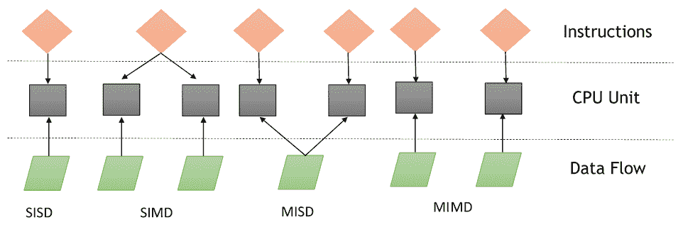
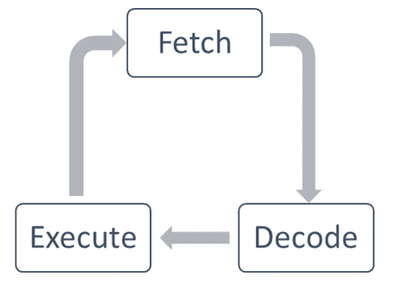
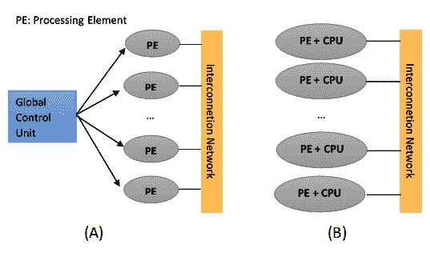
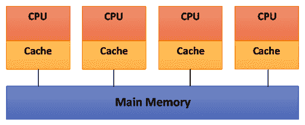
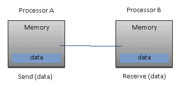
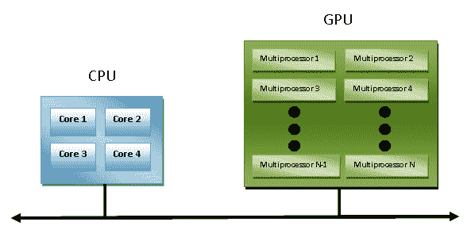
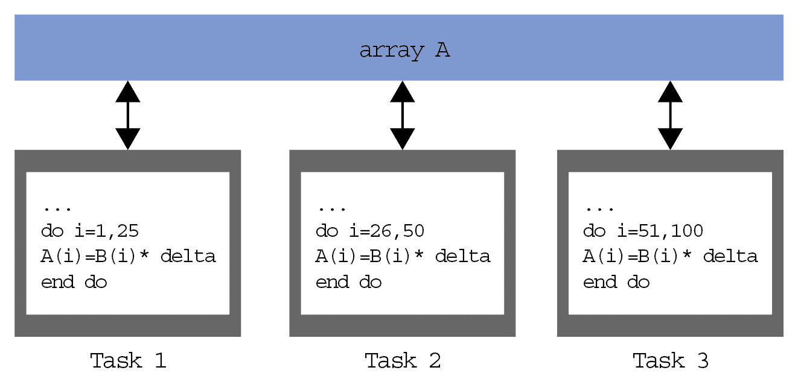
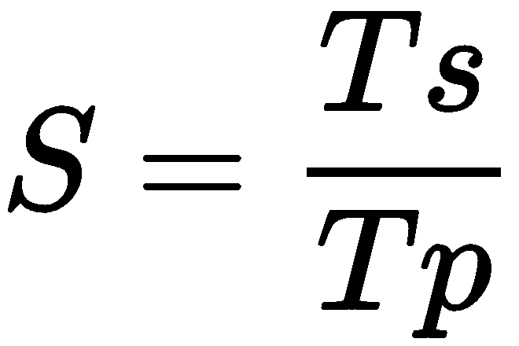
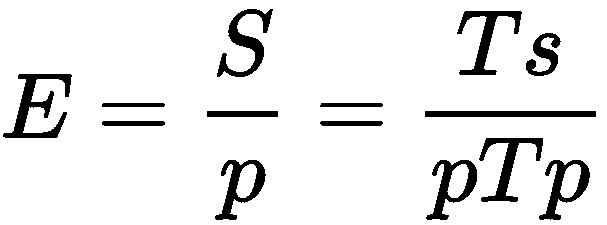
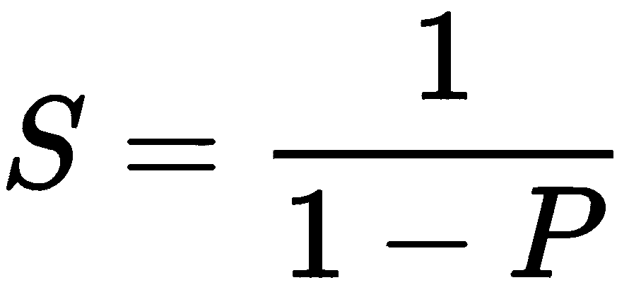

# 并行计算和 Python 入门

*并行*和*分布式计算*模型基于同时使用不同的处理单元来执行程序。虽然并行计算和分布式计算之间的区别很小，但其中一个可能的定义是将并行计算模型与共享内存计算模型相关联，将分布式计算模型与消息传递模型相关联。

从这一点开始，我们将使用术语*并行计算*来指代并行和分布式计算模型。

下一节将概述并行编程体系结构和编程模型。这些概念对于第一次接触并行编程技术的无经验程序员非常有用。此外，它还可以作为有经验的程序员的基本参考。同时给出了并行系统的对偶特征。第一个特性基于系统架构，而第二个特性基于并行编程范例。

本章最后简要介绍 Python*编程语言。该语言的特点、易用性和学习性，以及软件库和应用程序的可扩展性和丰富性，使 Python 成为任何应用程序以及并行计算的宝贵工具。介绍了线程和进程的概念及其在语言中的使用。*

 *在本章中，我们将介绍以下配方：

*   为什么我们需要并行计算？
*   费林分类法
*   记忆组织
*   并行编程模型
*   绩效评估
*   介绍 Python
*   Python 与并行编程
*   介绍进程和线程

# 为什么我们需要并行计算？

现代计算机提供的计算能力的增长导致我们在相对较短的时间内面临越来越复杂的计算问题。直到 21 世纪初，复杂性一直是通过增加晶体管数量和单处理器系统的时钟频率来解决的，其峰值为 3.5-4 GHz。然而，晶体管数量的增加导致处理器自身消耗的功率呈指数级增长。因此，本质上，存在一个物理限制，阻止单处理器系统性能的进一步提高。

因此，近年来，微处理器制造商将注意力集中在*多核*系统上。它们基于共享同一内存的多个物理处理器的核心，因此绕过了前面描述的功耗问题。近年来，*四核*和*八核*系统也已成为普通台式机和笔记本电脑配置的标准配置。

另一方面，如此重大的硬件变化也导致了软件结构的演变，软件结构一直被设计为在单个处理器上顺序执行。为了利用通过增加处理器数量而获得的更大计算资源，必须以适合 CPU 并行结构的形式重新设计现有软件，以便通过同时执行同一程序多个部分的单个单元来获得更高的效率。

# 费林分类法

Flynn 的分类法是一个对计算机体系结构进行分类的系统。它基于两个主要概念：

*   **指令流**：具有*n*CPU 的系统有*n*个程序计数器，因此有*n*条指令流，这对应于一个程序计数器。
*   **数据流**：在数据列表上计算函数的程序具有数据流。在几个不同的数据列表上计算同一函数的程序有更多的数据流。这是由一组操作数组成的。

由于指令流和数据流是独立的，所以并行机有四类：**单指令单数据**（**SISD**）、**单指令多数据**（**SIMD**）、**多指令单数据**（**MISD**）和**多指令多数据**（**MIMD**：



Flynn's taxonomy

# 单指令单数据（SISD）

SISD 计算系统类似于冯·诺依曼机器，这是一种单处理器机器。正如您在*Flynn 的分类*图中所看到的，它执行一条指令，该指令在单个数据流上运行。在 SISD 中，机器指令按顺序处理。

在时钟周期中，CPU 执行以下操作：

*   **取数**：CPU 从一个称为*寄存器*的内存区域取数和指令。
*   **解码**：CPU 对指令进行解码。
*   **执行**：对数据执行指令。操作结果存储在另一个寄存器中。

一旦执行阶段完成，CPU 将自己设置为开始另一个 CPU 周期：



The fetch, decode, and execute cycle

在这种类型的计算机上运行的算法是顺序的（或串行的），因为它们不包含任何并行性。SISD 计算机的一个例子是具有单个 CPU 的硬件系统。

这些架构（即冯·诺依曼架构）的主要元素如下：

*   **中央存储单元**：用于存储指令和程序数据。
*   **CPU**：用于从存储单元获取指令和/或数据，存储单元对指令进行解码并顺序执行。
*   **I/O 系统**：指程序的输入输出数据。

传统的单处理器计算机被分类为 SISD 系统：


The SISD architecture schema

下图具体显示了在获取、解码和执行阶段使用的 CPU 区域：


CPU components in the fetch-decode-execute phase

# 多指令单数据（MISD）

在这种型号中，*n*处理器，每个都有自己的控制单元，共享一个内存单元。在每个时钟周期中，从存储器接收的数据由所有处理器同时处理，每个处理器根据从其控制单元接收的指令进行处理。

在这种情况下，并行性（指令级并行性）是通过对同一数据段执行多个操作来获得的。在这些体系结构中可以有效解决的问题类型非常特殊，例如数据加密。由于这个原因，MISD 计算机在商业领域还没有找到空间。MISD 计算机与其说是一种实用配置，不如说是一种智力训练。

# 单指令多数据（SIMD）

SIMD 计算机由*n*个完全相同的处理器组成，每个处理器都有自己的本地内存，可以存储数据。所有处理器都在单个指令流的控制下工作。除此之外，还有*n*个数据流，每个处理器一个。处理器在每个步骤上同时工作，并在不同的数据元素上执行相同的指令。这是数据级并行性的一个示例。

SIMD 体系结构比 MISD 体系结构更通用。SIMD 计算机上的并行算法可以解决许多涉及广泛应用的问题。另一个有趣的特点是，这些计算机的算法相对容易设计、分析和实现。其局限性在于，SIMD 计算机只能解决可分为多个子问题（所有子问题都是相同的，然后通过同一组指令同时解决每个子问题）的问题。

根据这种模式开发的超级计算机，我们必须提到*连接机*（思维机，1985 年）和*MPP*（NASA，1983 年）。

正如我们将在[第 6 章](6.html)、*分布式 Python*和[第 7 章](7.html)、*云计算*中看到的那样，使用许多 SIMD 嵌入式单元构建的现代图形卡（GPU）的出现导致了这种计算范式的更广泛使用。

# 多指令多数据（MIMD）

根据弗林的分类，这类并行计算机是最通用、功能最强大的计算机。其中包含*n*处理器、*n*指令流和*n*数据流。每个处理器都有自己的控制单元和本地内存，这使得 MIMD 体系结构在计算上比 SIMD 体系结构更强大。

每个处理器在其自己的控制单元发出的指令流的控制下运行。因此，处理器可能使用不同的数据运行不同的程序，这使得它们能够解决不同的子问题，并且可以成为单个更大问题的一部分。在 MIMD 中，架构是通过线程和/或进程的并行级别来实现的。这也意味着处理器通常异步运行

如今，这种体系结构被应用于许多 PC 机、超级计算机和计算机网络。但是，您需要考虑一个计数器：异步算法很难设计、分析和实现：



The SIMD architecture (A) and the MIMD architecture (B)

Flynn 的分类法可以通过将 SIMD 机器分为两个子组来扩展：

*   数字超级计算机
*   矢量机

另一方面，MIMD 可以分为具有共享内存*的机器和具有分布式内存的机器。*

 *实际上，下一节将重点讨论 MIMD 机器内存组织的最后一个方面。

# 记忆组织

为了评估并行体系结构，我们需要考虑的另一个方面是内存组织，或者更确切地说，是访问数据的方式。无论处理单元有多快，如果内存不能以足够的速度维护和提供指令和数据，那么性能将不会有任何改善。

要使内存的响应时间与处理器的速度兼容，我们需要克服的主要问题是内存周期时间，它被定义为两个连续操作之间经过的时间。处理器的周期时间通常比内存的周期时间短得多。

当处理器开始向内存或从内存进行传输时，处理器的资源将在整个内存周期内保持占用状态；此外，在此期间，由于正在进行的传输，没有其他设备（例如，I/O 控制器、处理器，甚至发出请求的处理器）能够使用内存：


Memory organization in the MIMD architecture

内存访问问题的解决方案导致了 MIMD 架构的二分法。第一种类型的系统称为*共享内存*系统，具有高虚拟内存，所有处理器都可以平等访问该内存中的数据和指令。另一种类型的系统是***分布式内存***型号，其中每个处理器都有其他处理器无法访问的本地内存。

区别分布式内存共享的内存的是由处理单元执行的内存访问管理；这种区别对于程序员来说非常重要，因为它决定了并行程序的不同部分必须如何通信。

特别是，分布式内存机器必须在每个本地内存中复制共享数据。通过从一个处理器向另一个处理器发送包含要共享的数据的消息来创建这些副本。这种内存组织的一个缺点是，有时，这些消息可能非常大，传输需要相对较长的时间，而在共享内存系统中，没有消息交换，主要问题在于同步对共享资源的访问。

# 共享内存

共享内存多处理器系统的模式如下图所示。这里的物理连接非常简单：



Shared memory architecture schema

这里，总线结构允许共享同一信道的任意数量的设备（上图中的**CPU**+**C****ache**），如上图所示。总线协议最初设计为允许单个处理器和一个或多个磁盘或磁带控制器通过此处的共享内存进行通信。

Each processor has been associated with cache memory, as it is assumed that the probability that a processor needs to have data or instructions present in the local memory is very high.

当一个处理器修改存储在内存系统中的数据，而这些数据同时被其他处理器使用时，就会出现问题。新值将从已更改的处理器缓存传递到共享内存。但是，稍后还必须将其传递给所有其他处理器，以便它们不使用过时的值。这个问题被称为*缓存一致性*问题——内存一致性问题的一个特例，它要求硬件实现能够处理并发问题和同步，类似于线程编程。

共享内存系统的主要特点如下：

*   所有处理器的内存都是相同的。例如，与同一数据结构关联的所有处理器将使用相同的逻辑内存地址，从而访问相同的内存位置。
*   同步是通过读取不同处理器的任务并允许共享内存来实现的。事实上，处理器一次只能访问一个内存。
*   当另一个任务访问共享内存位置时，不能更改该任务的共享内存位置。
*   任务之间共享数据速度很快。通信所需的时间是其中一个设备读取单个位置所需的时间（取决于内存访问速度）。

共享内存系统中的内存访问如下所示：

*   **统一内存访问**（**UMA**）：该系统的基本特征是每个处理器和任何内存区域对内存的访问时间是恒定的。因此，这些系统也称为**对称多处理器**（**SMPs**。它们实现起来相对简单，但可扩展性不强。编码器负责通过在管理资源的程序中插入适当的控件、信号量、锁等来管理同步。
*   **非统一内存访问**（**NUMA**）：这些架构将内存划分为分配给每个处理器的高速访问区域，以及数据交换的公共区域，访问速度较慢。这些系统也称为**分布式共享内存**（**DSM**系统。它们具有很强的可扩展性，但开发起来很复杂。
*   **无远程内存访问**（**NoRMA**）：内存在处理器之间物理分布（本地内存）。所有本地内存都是专用的，只能访问本地处理器。处理器之间的通信通过用于交换消息的通信协议进行，该协议被称为*消息传递协议*。
*   **仅缓存内存架构**（**COMA**）：这些系统仅配备缓存内存。在分析 NUMA 体系结构时，注意到该体系结构将数据的本地副本保存在缓存中，并且该数据作为副本存储在主内存中。这种体系结构删除重复项，只保留缓存的内存；内存物理上分布在处理器之间（本地内存）。所有本地内存都是专用的，只能访问本地处理器。处理器之间的通信也通过消息传递协议进行。

# 分布式存储器

在具有分布式内存的系统中，内存与每个处理器关联，处理器只能寻址其自己的内存。一些作者将这种类型的系统称为多计算机，这反映了系统元素本身是处理器和内存的小型完整系统这一事实，如下图所示：


The distributed memory architecture schema

这种组织有几个优点：

*   在通信总线或交换机级别没有冲突。每个处理器都可以使用自己本地内存的全部带宽，而不会受到其他处理器的任何干扰。
*   缺少公共总线意味着处理器的数量没有内在的限制。系统的大小仅受用于连接处理器的网络的限制。
*   缓存一致性没有问题。每个处理器负责自己的数据，不必担心升级任何副本。

主要缺点是处理器之间的通信更难实现。如果一个处理器需要另一个处理器的内存中的数据，那么两个处理器不必通过消息传递协议交换消息。这带来了两个减速来源：从一个处理器到另一个处理器构建和发送消息需要时间，而且，为了管理从其他处理器接收到的消息，应该停止任何处理器。设计用于分布式内存机器的程序必须组织为一组独立任务，通过消息进行通信：



Basic message passing

分布式存储系统的主要特点如下：

*   内存在处理器之间进行物理分配；每个本地内存只能由其处理器直接访问。
*   通过在处理器之间移动数据（即使只是消息本身）来实现同步（通信）。
*   本地存储器中数据的细分会影响机器的性能。必须使细分精确，以尽量减少 CPU 之间的通信。除此之外，协调这些分解和合成操作的处理器必须与操作数据结构各个部分的处理器进行有效通信。
*   使用消息传递协议，以便 CPU 可以通过交换数据包相互通信。消息是离散的信息单元，从某种意义上说，它们具有定义良好的标识，因此始终可以将它们彼此区分开来。

# 大规模并行处理（MPP）

MPP 机器由数百个处理器组成（在某些机器中，处理器的大小可以达到数十万个），这些处理器通过通信网络连接。世界上最快的计算机都基于这些体系结构；这些架构系统的一些例子有地球模拟器、蓝色基因、ASCI 白色、ASCI 红色以及 ASCI 紫色和红色风暴。

# 工作站集群

这些处理系统基于通过通信网络连接的经典计算机。计算集群属于这一类。

在集群体系结构中，我们将节点定义为参与集群的单个计算单元。对于用户来说，集群是完全透明的，所有硬件和软件的复杂性都被屏蔽，数据和应用程序都可以访问，就好像它们都来自单个节点一样。

在这里，我们确定了三种类型的集群：

*   **故障转移集群**：在这种情况下，节点的活动被持续监控，当一台机器停止工作时，另一台机器接管这些活动。其目的是由于体系结构的冗余，确保连续服务。
*   **负载平衡集群**：在本系统中，向活动较少的节点发送作业请求。这确保了处理作业所需的时间更少。
*   **高性能计算集群**：其中每个节点配置为提供极高的性能。该过程还被划分为多个节点上的多个作业。作业是并行的，并将分配到不同的机器。

# 异构体系结构

在同质化的超级计算世界中，GPU 加速器的引入改变了现在超级计算机的使用和编程方式。尽管 GPU 提供了高性能，但它们不能被视为一个独立的处理单元，因为它们应该始终伴随着 CPU 的组合。因此，编程范例非常简单：CPU 以串行方式进行控制和计算，将任务分配给图形加速器，这些任务在计算上非常昂贵，并且具有高度并行性。

CPU 和 GPU 之间的通信不仅可以通过使用高速总线实现，还可以通过为物理或虚拟内存共享单个内存区域实现。事实上，在两个设备都没有配备它们自己的存储区域的情况下，可以使用各种编程模型提供的软件库引用公共存储区域，例如*CUDA*和*OpenCL*。

这些体系结构被称为*异构体系结构*，其中应用程序可以在单个地址空间中创建数据结构，并向设备硬件发送适合任务解决的作业。由于原子操作，多个处理任务可以在相同的区域安全运行，以避免数据一致性问题。

因此，尽管 CPU 和 GPU 似乎不能有效地协同工作，但通过使用这种新的体系结构，我们可以优化它们与并行应用程序的交互以及并行应用程序的性能：



The heterogeneous architecture schema

在下一节中，我们将介绍主要的并行编程模型。

# 并行编程模型

并行编程模型作为硬件和内存架构的抽象存在。事实上，这些模型并不具体，也不涉及任何特定类型的机器或内存架构。它们可以在任何类型的机器上实现（至少在理论上）。与前面的细分相比，这些编程模型是在更高的层次上建立的，代表了软件必须实现以执行并行计算的方式。每个模型都有自己的方式与其他处理器共享信息，以便访问内存和分配工作。

就绝对值而言，没有一种模型比另一种更好。因此，应用的最佳解决方案在很大程度上取决于程序员应该解决的问题。并行编程最广泛使用的模型如下：

*   共享内存模型
*   多线程模型
*   分布式内存/消息传递模型
*   数据并行模型

在本食谱中，我们将向您概述这些模型。

# 共享内存模型

在这个模型中，任务共享一个内存区域，我们可以在其中异步读写。存在允许编码器控制对共享内存的访问的机制；例如，锁或信号量。该模型的优点是编码人员不必澄清任务之间的通信。就性能而言，一个重要的缺点是更难理解和管理数据局部性。这是指将数据保持在处理器的本地，以保存多个处理器使用相同数据时发生的内存访问、缓存刷新和总线通信。

# 多线程模型

在这个模型中，一个流程可以有多个执行流。例如，创建一个顺序零件，然后创建一系列可以并行执行的任务。通常，这种类型的模型用于共享内存体系结构。因此，管理线程之间的同步对我们来说非常重要，因为它们在共享内存上运行，程序员必须防止多个线程同时更新相同的位置。

当前一代 CPU 在软件和硬件上都是多线程的。**POSIX**（简称**便携式操作系统接口**）线程是在软件上实现多线程的经典示例。Intel 的超线程技术通过在两个线程之间切换来实现硬件上的多线程处理，其中一个线程处于暂停状态或等待 I/O。即使数据对齐是非线性的，也可以通过此模型实现并行性。

# 消息传递模型

消息传递模型通常应用于每个处理器都有自己的内存（分布式内存系统）的情况。更多任务可以驻留在同一台物理机器上，也可以驻留在任意数量的机器上。编码器负责确定通过消息发生的并行性和数据交换，并且有必要请求和调用代码中的函数库。

其中一些例子从 20 世纪 80 年代开始出现，但直到 20 世纪 90 年代中期才创建了一个标准化模型，从而产生了一个事实上的标准，称为**消息传递接口**（**MPI**。

MPI 模型显然是用分布式内存设计的，但作为并行编程的模型，多平台模型也可用于共享内存机：


Message passing paradigm model

# 数据并行模型

在这个模型中，我们有更多的任务在相同的数据结构上运行，但每个任务在不同的数据部分上运行。在共享内存体系结构中，所有任务都可以通过共享内存和分布式内存体系结构访问数据，其中数据结构被划分并驻留在每个任务的本地内存中。

为了实现这个模型，编码人员必须开发一个指定数据分布和对齐的程序；例如，仅当数据（**任务****1**、**任务****2**、**任务****3**对齐时，当前一代 GPU 才具有高度可操作性，如下图所示：



The data-parallel paradigm model

# 设计并行程序

利用并行性的算法的设计基于一系列操作，必须执行这些操作才能使程序正确执行任务，而不会产生部分或错误的结果。正确并行算法必须执行的宏操作如下：

*   任务分解
*   任务分配
*   集聚
*   映射

# 任务分解

在第一阶段，软件程序被分成任务或一组指令，然后可以在不同的处理器上执行，以实现并行性。要执行此细分，请使用两种方法：

*   **区域分解**：这里对问题的数据进行分解。该应用程序对于处理数据不同部分的所有处理器都是通用的。当我们有大量必须处理的数据时，使用这种方法。
*   **功能分解**：在这种情况下，问题被分解为任务，每个任务将对所有可用数据执行特定的操作。

# 任务分配

在此步骤中，指定了任务在各个进程之间分配的机制。此阶段非常重要，因为它确定了工作负载在各个处理器之间的分布。负载平衡在这里至关重要；事实上，所有处理器都必须连续工作，避免长时间处于空闲状态。

为了实现这一点，编码器考虑了系统的可能异构性，该系统试图将更多任务分配给性能更好的处理器。最后，为了提高并行化的效率，有必要尽可能地限制处理器之间的通信，因为它们往往是速度减慢和资源消耗的根源。

# 集聚

集聚是将较小的任务与较大的任务相结合以提高绩效的过程。如果设计过程的前两个阶段将问题划分为大量任务，大大超过可用处理器的数量，并且计算机不是专门设计来处理大量小任务的（有些体系结构，比如 GPU，可以很好地处理这一问题，并且确实可以从运行数百万甚至数十亿个任务中获益），那么设计就会变得非常低效。

通常，这是因为任务必须与处理器或线程通信，以便它们计算所述任务。大多数通信的成本与传输的数据量不成比例，但每个通信操作都会产生固定的成本（例如延迟，这是建立 TCP 连接时固有的）。如果任务太小，那么这种固定成本很容易使设计效率低下。

# 映射

在并行算法设计过程的映射阶段，我们指定每个任务的执行位置。目标是最小化总执行时间。在这里，您必须经常进行权衡，因为两种主要策略经常相互冲突：

*   频繁通信的任务应该放在同一个处理器中以增加局部性。
*   可以并发执行的任务应该放在不同的处理器中，以增强并发性。

这被称为*映射问题*，被称为**NP 完全**。因此，一般情况下不存在问题的多项式时间解。对于大小相同的任务和具有易于识别的通信模式的任务，映射非常简单（我们也可以在此处执行聚合，以组合映射到同一处理器的任务）。然而，如果任务具有难以预测的通信模式，或者每个任务的工作量不同，那么很难设计有效的映射和聚合方案。

对于这些类型的问题，可以使用负载平衡算法在运行时确定聚合和映射策略。最困难的问题是那些在程序执行期间通信量或任务数量发生变化的问题。对于这类问题，可以使用动态负载平衡算法，该算法在执行期间定期运行。

# 动态映射

针对各种问题，存在多种负载平衡算法：

*   **全局算法**：这些算法需要执行的计算的全局知识，这通常会增加很多开销。
*   **局部算法**：这些算法仅依赖于所讨论任务的局部信息，这与全局算法相比减少了开销，但它们通常在寻找最佳聚集和映射方面较差。

然而，减少的开销可能会减少执行时间，即使映射本身更糟糕。如果任务除了在执行的开始和结束时很少通信，那么通常会使用任务调度算法，该算法只在任务空闲时将任务映射到处理器。在任务调度算法中，维护任务池。任务放置在此池中，并由工作人员从中提取。

此模型中有三种常用方法：

*   **管理者/工作者：**这是基本的动态映射方案，其中所有工作者都连接到一个集中的管理者。经理反复向工人发送任务并收集结果。对于数量相对较少的处理器来说，这种策略可能是最好的。可以通过提前获取任务来改进基本策略，从而使通信和计算相互重叠。
*   **分层管理者/工作者**：这是具有半分布式布局的管理者/工作者的变体。工人被分成小组，每个小组都有自己的经理。这些组经理与中央经理（也可能在他们之间）进行沟通，同时工人向组经理请求任务。这将在多个管理器之间分散负载，因此，如果所有工作人员都从同一个管理器请求任务，则可以处理更多的处理器。
*   **去中心化**：在这个方案中，一切都是去中心化的。每个处理器维护自己的任务池，并与其他处理器通信以请求任务。处理器选择其他处理器请求任务的方式各不相同，并根据问题确定。

# 评估并行程序的性能

并行编程的发展产生了对性能指标的需求，以决定其使用是否方便。事实上，并行计算的重点是在相对较短的时间内解决大型问题。促成这一目标的因素有，例如，所使用的硬件类型、问题的并行度以及所采用的并行编程模型。为了便于实现这一点，引入了基本概念的分析，比较了从原始序列获得的并行算法。

性能是通过分析和量化线程数量和/或使用的进程数量来实现的。为了分析这一点，让我们介绍几个性能指标：

*   **加速比**
*   **效率**
*   **缩放**

**阿姆达尔**定律引入了并行计算的局限性。为了评估序列算法并行化的*效率*，我们有**古斯塔夫森**定律。

# 加速

**加速**是显示并行解决问题好处的措施。定义为在单个处理元件（*Ts*上解决问题所需的时间与在*p*相同处理元件（*Tp*上解决相同问题所需的时间之比。

我们表示加速如下：



我们有一个线性加速，如果*S=p*，则意味着执行速度随着处理器数量的增加而增加。当然，这是一个理想的情况。当*Ts*是最佳顺序算法的执行时间时，加速比是绝对的；当*Ts*是单处理器并行算法的执行时间时，加速比是相对的。

让我们回顾一下这些情况：

*   *S=p*是线性或理想加速比。
*   *S<p*是一个真正的加速。
*   *S>p*是一种超线性加速。

# 效率

在理想情况下，具有*p*处理元素的并行系统可以给我们提供等于*p*的加速比。然而，这很少实现。通常，在空闲或通信中会浪费一些时间。效率是衡量一个处理元素花在做有用工作上的执行时间的一个指标，表示为所花费时间的一小部分。

我们用*E*表示，可以定义如下：



具有线性加速比的算法的值为*E=1*。在其他情况下，它们的值*E*小于*1*。这三起案件的认定如下：

*   当*E=1*时，为线性情况。
*   当*E<1*时，这是一个真实的案例。
*   当*E<<1*时，这是一个并行化效率低的问题。

# 缩放比例

可伸缩性定义为在并行机上高效运行的能力。它根据处理器的数量确定计算能力（执行速度）。通过增加问题的规模，同时增加处理器的数量，就不会有性能方面的损失。

根据不同因素的增量，可伸缩系统可以保持相同的效率或提高效率。

# 阿姆达尔定律

阿姆达尔定律是一种广泛使用的定律，用于设计处理器和并行算法。它指出，可实现的最大加速比受程序串行组件的限制：



*1 – P* denotes the serial component (not parallelized) of a program.

这意味着，例如，如果一个程序中 90%的代码可以并行，但 10%必须保持串行，那么即使对于无限多的处理器，最大可实现的加速比也是 9。

# 古斯塔夫森定律

古斯塔夫森定律规定如下：


在这里，正如我们在等式中指出的，以下情况适用：

*   *P*为*处理器数量。*
*   *S*为*加速*因素。
*   *α*是任何并行过程的*不可并行部分*。

Gustafson 定律与 Amdahl 定律一致，正如我们所描述的，Amdahl 定律假定程序的总体工作负载不会随着处理器数量的变化而变化。

事实上，古斯塔夫森定律建议程序员首先设置并行解决问题所允许的*时间*，然后根据该时间*来确定问题的大小。因此，并行系统的*速度越快*，在同一时间段内可以解决的问题的*越大**

古斯塔夫森定律的作用是将计算机研究的目标引导到选择或重新表述问题上，以便在相同的时间内解决更大的问题。此外，该法律将*效率*的概念重新定义为，尽管*工作量*有所增加，但仍需要*至少减少程序的顺序部分*。

# 介绍 Python

Python 是一种功能强大、动态且可解释的编程语言，可用于各种应用程序中。它的一些特点如下：

*   清晰易读的语法。
*   一个非常广泛的标准库，通过附加的软件模块，我们可以在其中添加数据类型、函数和对象。
*   易于学习，快速开发和调试。在 Python 中开发 Python 代码的速度比在 C/C++代码中快 10 倍。代码也可以作为原型，然后翻译成 C/C++。
*   基于异常的错误处理。
*   强大的内省功能。
*   丰富的文档和软件社区。

Python 可以看作是一种粘合语言。使用 Python，可以开发更好的应用程序，因为不同类型的程序员可以在一个项目中协同工作。例如，在构建科学应用程序时，C/C++程序员可以实现高效的数值算法，而同一项目的科学家可以编写测试和使用这些算法的 Python 程序。科学家不必学习低级编程语言，C/C++程序员也不需要理解所涉及的科学。

您可以从[中了解更多信息 https://www.python.org/doc/essays/omg-darpa-mcc-position](https://www.python.org/doc/essays/omg-darpa-mcc-position) 。

让我们看看一些非常基础的代码的例子来了解 Python 的特性。

The following section can be a refresher for most of you. We will use these techniques practically in [Chapter 2](2.html), *Thread-Based Parallelism*, and [Chapter 3](3.html), *Process-Based Parallelism*.

# 帮助功能

Python 解释器已经提供了一个有效的帮助系统。如果您想知道如何使用对象，只需键入`help(object)`。

例如，让我们看看如何在整数`0`上使用`help`函数：

```py
>>> help(0)
Help on int object:

class int(object)
 | int(x=0) -> integer
 | int(x, base=10) -> integer
 | 
 | Convert a number or string to an integer, or return 0 if no 
 | arguments are given. If x is a number, return x.__int__(). For 
 | floating point numbers, this truncates towards zero.
 | 
 | If x is not a number or if base is given, then x must be a string,
 | bytes, or bytearray instance representing an integer literal in the
 | given base. The literal can be preceded by '+' or '-' and be
 | surrounded by whitespace. The base defaults to 10\. Valid bases are 0 
 | and 2-36.
 | Base 0 means to interpret the base from the string as an integer 
 | literal.
>>> int('0b100', base=0)
```

`int`对象的描述后面是适用于它的方法列表。前五种方法如下：

```py
 | Methods defined here:
 | 
 | __abs__(self, /)
 | abs(self)
 | 
 | __add__(self, value, /)
 | Return self+value.
 | 
 | __and__(self, value, /)
 | Return self&value.
 | 
 | __bool__(self, /)
 | self != 0
 | 
 | __ceil__(...)
 | Ceiling of an Integral returns itself.
```

`dir(object)`也很有用，它列出了对象可用的方法：

```py
>>> dir(float)
['__abs__', '__add__', '__and__', '__bool__', '__ceil__', '__class__', '__delattr__', '__dir__', '__divmod__', '__doc__', '__eq__', '__float__', '__floor__', '__floordiv__', '__format__', '__ge__', '__getattribute__', '__getnewargs__', '__gt__', '__hash__', '__index__', '__init__', '__int__', '__invert__', '__le__', '__lshift__', '__lt__', '__mod__', '__mul__', '__ne__', '__neg__', '__new__', '__or__', '__pos__', '__pow__', '__radd__', '__rand__', '__rdivmod__', '__reduce__', '__reduce_ex__', '__repr__', '__rfloordiv__', '__rlshift__', '__rmod__', '__rmul__', '__ror__', '__round__', '__rpow__', '__rrshift__', '__rshift__', '__rsub__', '__rtruediv__', '__rxor__', '__setattr__', '__sizeof__', '__str__', '__sub__', '__subclasshook__', '__truediv__', '__trunc__', '__xor__', 'bit_length', 'conjugate', 'denominator', 'from_bytes', 'imag', 'numerator', 'real', 'to_bytes']
```

最后，`.__doc__`函数提供了一个对象的相关文档，如下例所示：

```py
>>> abs.__doc__
'Return the absolute value of the argument.'
```

# 语法

Python 不采用语句终止符，代码块是通过缩进指定的。预期缩进级别的语句必须以冒号（`:`结尾）。这导致以下情况：

*   Python 代码更清晰，可读性更强。
*   程序结构始终与缩进一致。
*   缩进的样式在任何列表中都是统一的。

错误的缩进会导致错误。

下面的示例显示了如何使用`if`构造：

```py
print("first print")
if condition:
    print(“second print”)
print(“third print”)
```

在本例中，我们可以看到以下内容：

*   以下语句：`print("first print")`、`if condition:`、`print("third print")`具有相同的缩进级别并始终执行。
*   在`if`语句之后，有一个缩进级别较高的代码块，其中包括`print ("second print")`语句。
*   如果`if`的条件为真，则执行`print ("second print")`语句。
*   如果`if`的条件为 false，则不执行`print ("second print")`语句。

因此，注意缩进非常重要，因为缩进总是在程序解析过程中进行计算。

# 评论

注释以散列符号（`#`开头，并在一行上：

```py
# single line comment
```

多行字符串用于多行注释：

```py
""" first line of a multi-line comment
second line of a multi-line comment."""
```

# 作业

使用等号（`=`）进行赋值。对于相等性测试，使用相同的量（`==`。您可以使用`+=`和`-=`运算符增加和减少一个值，然后使用附录。这适用于多种类型的数据，包括字符串。可以在同一行上分配和使用多个变量。

一些例子如下：

```py
>>> variable = 3
>>> variable += 2
>>> variable
5
>>> variable -= 1
>>> variable
4

>>> _string_ = "Hello"
>>> _string_ += " Parallel Programming CookBook Second Edition!"
>>> print (_string_) 
Hello Parallel Programming CookBook Second Edition!
```

# 数据类型

Python 中最重要的结构是*列表*、*元组*、*和*字典*。从 2.5 版开始，集合就集成到 Python 中（以前的版本在`sets`库中提供）：*

 **   **列表**：这些类似于一维数组，但您可以创建包含其他列表的列表。
*   **字典**：这些数组包含密钥对和值（哈希表）。
*   **元组**：这些是不可变的一维对象。

数组可以是任何类型，因此可以将整数和字符串等变量混合到列表、字典和元组中。

任何类型数组中第一个对象的索引始终为零。允许使用负索引，并从数组末尾开始计数；`-1`表示数组的最后一个元素：

```py
#let's play with lists
list_1 = [1, ["item_1", "item_1"], ("a", "tuple")]
list_2 = ["item_1", -10000, 5.01]

>>> list_1
[1, ['item_1', 'item_1'], ('a', 'tuple')]

>>> list_2
['item_1', -10000, 5.01]

>>> list_1[2]
('a', 'tuple')

>>>list_1[1][0]
['item_1', 'item_1']

>>> list_2[0]
item_1

>>> list_2[-1]
5.01

#build a dictionary 
dictionary = {"Key 1": "item A", "Key 2": "item B", 3: 1000}
>>> dictionary 
{'Key 1': 'item A', 'Key 2': 'item B', 3: 1000} 

>>> dictionary["Key 1"] 
item A

>>> dictionary["Key 2"]
-1

>>> dictionary[3]
1000
```

您可以使用冒号（`:`获取数组范围：

```py
list_3 = ["Hello", "Ruvika", "how" , "are" , "you?"] 
>>> list_3[0:6] 
['Hello', 'Ruvika', 'how', 'are', 'you?'] 

>>> list_3[0:1]
['Hello']

>>> list_3[2:6]
['how', 'are', 'you?']
```

# 串

Python 字符串使用单（`'`或双（`"`引号）表示，并且允许它们在由另一个分隔的字符串中使用一个符号：

```py
>>> example = "she loves ' giancarlo"
>>> example
"she loves ' giancarlo"
```

在多行中，它们用三（或三）个单引号括起来（`'''`多行字符串`'''`：

```py
>>> _string_='''I am a 
multi-line 
string'''
>>> _string_
'I am a \nmulti-line\nstring'
```

Python 还支持 Unicode；只需使用`u "This is a unicode string"`语法：

```py
>>> ustring = u"I am unicode string"
>>> ustring
'I am unicode string'
```

要在字符串中输入值，请键入`%`运算符和元组。然后，每个`%`操作符由一个元组元素替换，从左到右*：*

```py
>>> print ("My name is %s !" % ('Mr. Wolf'))
My name is Mr. Wolf!
```

# 流量控制

流量控制指令为`if`、`for`和`while`。

在下一个示例中，我们检查数字是正、负还是零，并显示结果：

```py
num = 1

if num > 0:
    print("Positive number")
elif num == 0:
    print("Zero")
else:
    print("Negative number")
```

以下代码块使用`for`循环查找列表中存储的所有数字的总和：

```py
numbers = [6, 6, 3, 8, -3, 2, 5, 44, 12]
sum = 0
for val in numbers:
    sum = sum+val
print("The sum is", sum)
```

我们将执行`while`循环来迭代代码，直到条件结果为真。我们将在`for`循环上使用这个循环，因为我们不知道会产生代码的迭代次数。在本例中，我们使用`while`将自然数相加至*总和=1+2+3+…+n*：

```py
n = 10
# initialize sum and counter
sum = 0
i = 1
while i <= n:
    sum = sum + i
    i = i+1 # update counter

# print the sum
print("The sum is", sum)
```

前三个示例的输出如下所示：

```py
Positive number
The sum is 83
The sum is 55
>>>
```

# 功能

Python 函数是用`def`关键字声明的：

```py
def my_function():
    print("this is a function")
```

要运行函数，请使用函数名，后跟括号，如下所示：

```py
>>> my_function()
this is a function
```

参数必须在函数名后的括号内指定：

```py
def my_function(x):
    print(x * 1234)

>>> my_function(7)
8638
```

多个参数必须用逗号分隔：

```py
def my_function(x,y):
    print(x*5+ 2*y)

>>> my_function(7,9)
53
```

使用等号定义默认参数。如果调用不带参数的函数，则将使用默认值：

```py
def my_function(x,y=10):
    print(x*5+ 2*y)

>>> my_function(1)
25

>>> my_function(1,100)
205
```

函数的参数可以是任何类型的数据（如字符串、数字、列表和字典）。这里，以下列表`lcities`用作`my_function`的参数：

```py
def my_function(cities):
    for x in cities:
        print(x)

>>> lcities=["Napoli","Mumbai","Amsterdam"]
>>> my_function(lcities)
Napoli
Mumbai
Amsterdam
```

使用`return`语句从函数返回值：

```py
def my_function(x,y):
    return x*y >>> my_function(6,29)
174 
```

Python 支持一种有趣的语法，允许您动态定义小的单行函数。这些 lambda 函数源于 Lisp 编程语言，可以在任何需要函数的地方使用。

lambda 函数的示例`functionvar`如下所示：

```py
# lambda definition equivalent to def f(x): return x + 1

functionvar = lambda x: x * 5
>>> print(functionvar(10))
50
```

# 班级

Python 支持类的多个继承。按照惯例（不是语言规则），私有变量和方法在声明前加上两个下划线（`__`。我们可以将任意属性（属性）分配给类的实例，如下例所示：

```py
class FirstClass:
    common_value = 10
    def __init__ (self):
        self.my_value = 100
    def my_func (self, arg1, arg2):
        return self.my_value*arg1*arg2

# Build a first instance
>>> first_instance = FirstClass()
>>> first_instance.my_func(1, 2)
200

# Build a second instance of FirstClass
>>> second_instance = FirstClass()

#check the common values for both the instances
>>> first_instance.common_value
10

>>> second_instance.common_value
10

#Change common_value for the first_instance
>>> first_instance.common_value = 1500
>>> first_instance.common_value
1500

#As you can note the common_value for second_instance is not changed
>>> second_instance.common_value
10

# SecondClass inherits from FirstClass. 
# multiple inheritance is declared as follows:
# class SecondClass (FirstClass1, FirstClass2, FirstClassN)

class SecondClass (FirstClass):
    # The "self" argument is passed automatically
    # and refers to the class's instance
    def __init__ (self, arg1):
        self.my_value = 764
        print (arg1)

>>> first_instance = SecondClass ("hello PACKT!!!!")
hello PACKT!!!!

>>> first_instance.my_func (1, 2)
1528
```

# 例外情况

Python 中的异常由`try-except`块（`exception_name`块）管理：

```py
def one_function():
     try:
         # Division by zero causes one exception
         10/0
     except ZeroDivisionError:
         print("Oops, error.")
     else:
         # There was no exception, we can continue.
         pass
     finally:
         # This code is executed when the block
         # try..except is already executed and all exceptions
         # have been managed, even if a new one occurs
         # exception directly in the block.
         print("We finished.")

>>> one_function()
Oops, error.
We finished
```

# 导入库

外部库与`import [library name]`一起导入。或者，您可以使用`from [library name] import [function name]`语法导入特定函数。以下是一个例子：

```py
import random
randomint = random.randint(1, 101)

>>> print(randomint)
65

from random import randint
randomint = random.randint(1, 102)

>>> print(randomint)
46
```

# 管理文件

为了允许我们与文件系统进行交互，Python 为我们提供了内置的`open`函数。可以调用该函数打开文件并返回对象文件。后者允许我们对文件执行各种操作，例如读取和写入。当我们完成与文件的交互后，我们必须记住使用`file.close`方法关闭它：

```py
>>> f = open ('test.txt', 'w') # open the file for writing
>>> f.write ('first line of file \ n') # write a line in file
>>> f.write ('second line of file \ n') # write another line in file
>>> f.close () # we close the file
>>> f = open ('test.txt') # reopen the file for reading
>>> content = f.read () # read all the contents of the file
>>> print (content)
first line of the file
second line of the file
>>> f.close () # close the file
```

# 列表解析

列表理解是创建和操作列表的强大工具。它们由一个表达式组成，该表达式后跟一个`for`子句，然后后跟零个或多个`if`子句。列表理解的语法如下所示：

```py
[expression for item in list]
```

然后，执行以下操作：

```py
#list comprehensions using strings
>>> list_comprehension_1 = [ x for x in 'python parallel programming cookbook!' ]
>>> print( list_comprehension_1)

['p', 'y', 't', 'h', 'o', 'n', ' ', 'p', 'a', 'r', 'a', 'l', 'l', 'e', 'l', ' ', 'p', 'r', 'o', 'g', 'r', 'a', 'm', 'm', 'i', 'n', 'g', ' ', 'c', 'o', 'o', 'k', 'b', 'o', 'o', 'k', '!']

#list comprehensions using numbers
>>> l1 = [1,2,3,4,5,6,7,8,9,10]
>>> list_comprehension_2 = [ x*10 for x in l1 ]
>>> print( list_comprehension_2)

[10, 20, 30, 40, 50, 60, 70, 80, 90, 100]
```

# 运行 Python 脚本

要执行 Python 脚本，只需调用 Python 解释器，后跟脚本名称，在本例中为`my_pythonscript.py`。或者，如果我们在不同的工作目录中，则使用其完整地址：

```py
> python my_pythonscript.py 
```

From now on, for every invocation of a Python script, we will use the preceding notation; that is, `python`, followed by `script_name.py`, assuming that the directory from which the Python interpreter is launched is the one where the script to be execu*ted* resides.

# 使用 pip 安装 Python 包

`pip`是一个允许我们搜索、下载和安装 Python 包索引中的 Python 包的工具，Python 包索引是一个包含数以万计用 Python 编写的包的存储库。这也允许我们管理我们已经下载的包，允许我们更新或删除它们。

# 安装 pip

`pip`已包含在 Python 版本中≥ 3.4 和≥ 2.7.9\. 要检查此工具是否已安装，可以运行以下命令：

```py
C:\>pip
```

如果`pip`已安装，则此命令将向我们显示已安装的版本。

# 更新 pip

还建议检查您使用的`pip`版本是否始终为最新版本。要更新它，我们可以使用以下命令：

```py
 C:\>pip install -U pip
```

# 使用 pip

`pip`支持一系列命令，允许我们*搜索、下载、安装、更新、*和*删除*软件包。

要安装`PACKAGE`，只需运行以下命令：

```py
C:\>pip install PACKAGE 
```

# 介绍 Python 并行编程

Python 提供了许多库和框架来促进高性能计算。然而，由于**全局解释器锁**（**GIL**），使用 Python 进行并行编程可能相当危险

事实上，最广泛使用的 Python 解释器**CPython**是用 C 编程语言开发的。CPython 解释器需要 GIL 来执行线程安全操作。GIL 的使用意味着，当您试图访问线程中包含的任何 Python 对象时，将遇到全局锁。一次只有一个线程可以获取 Python 对象或 C API 的锁

幸运的是，事情并没有那么严重，因为在 GIL 领域之外，我们可以自由地使用并行。该类别包括我们将在下一章中讨论的所有主题，包括多处理、分布式计算和 GPU 计算。

因此，Python 并不是真正的多线程。但是什么是线呢？什么是过程？在下面的小节中，我们将介绍这两个基本概念，以及 Python 编程语言如何处理它们。

# 进程和线程

*线程*可以与轻进程相比较，因为它们提供了与进程类似的优势，但是不需要进程的典型通信技术。线程允许您将程序的主控制流划分为多个并发运行的控制流。相反，进程有自己的*地址空间**地址空间*和资源*。*因此，在不同进程上运行的部分代码之间的通信只能通过适当的管理机制进行，包括管道、代码 FIFO、邮箱、共享内存区域和消息传递。另一方面，线程允许创建程序的并发部分，其中每个部分都可以访问相同的地址空间、变量和常量。

下表总结了线程和进程之间的主要差异：

| **螺纹** | **流程** |
| --- | --- |
| 共享内存。 | 不要共享内存。 |
| 开始/更改的计算成本较低。 | 启动/更改在计算上非常昂贵。 |
| 需要更少的资源（轻流程）。 | 需要更多的计算资源。 |
| 需要同步机制来正确处理数据。 | 不需要内存同步。 |

在简要介绍之后，我们终于可以展示进程和线程是如何操作的。

特别是，我们希望比较以下函数`do_something`的串行、多线程和多进程执行时间，该函数执行一些基本计算，包括构建随机选择的整数列表（一个`do_something.py`文件）：

```py
import random

def do_something(count, out_list):
  for i in range(count):
    out_list.append(random.random())
```

接下来是串行（`serial_test.py`实现，我们从相关导入开始：

```py
from do_something import *
import time 
```

注意在本例中导入模块时间，用于评估执行时间，`do_something`函数的串行实现。要构建的列表的`size`等于`10000000`，而`do_something`函数将执行`10`次：

```py
if __name__ == "__main__":
    start_time = time.time()
    size = 10000000 
    n_exec = 10
    for i in range(0, exec):
        out_list = list()
        do_something(size, out_list)

    print ("List processing complete.")
    end_time = time.time()
    print("serial time=", end_time - start_time)   
```

接下来是多线程实现（`multithreading_test.py`。

导入相关库：

```py
from do_something import *
import time
import threading
```

注意，`threading`模块的导入，以便使用 Python 的多线程功能进行操作。

这里有`do_something`函数的多线程执行。我们不会对以下代码中的指令进行深入评论，因为它们将在[第 2 章](2.html)、*基于线程的并行性*中进行更详细的讨论。

但是，在这种情况下也应该注意，列表的长度显然与串行情况下的相同，`size = 10000000`，而定义的线程数为 10，`threads = 10`，这也是必须执行`do_something`功能的次数：

```py
if __name__ == "__main__":
    start_time = time.time()
    size = 10000000
    threads = 10 
    jobs = []
    for i in range(0, threads):
```

通过`threading.Thread`方法，还应注意单螺纹的结构：

```py
out_list = list()
thread = threading.Thread(target=list_append(size,out_list))
jobs.append(thread)
```

我们开始执行线程，然后立即停止线程的循环顺序如下：

```py
    for j in jobs:
        j.start()
    for j in jobs:
        j.join()

    print ("List processing complete.")
    end_time = time.time()
    print("multithreading time=", end_time - start_time)
```

最后是多处理实现（`multiprocessing_test.py`。

我们首先导入必要的模块，尤其是`multiprocessing`库，其功能将在[第 3 章](3.html)、*基于流程的并行性*中进行深入解释：

```py
from do_something import *
import time
import multiprocessing
```

与前面的情况一样，`do_something`函数要构建的列表的长度、大小和执行次数保持不变（`procs = 10`：

```py
if __name__ == "__main__":
    start_time = time.time()
    size = 10000000 
    procs = 10 
    jobs = []
    for i in range(0, procs):
        out_list = list()
```

这里，通过`multiprocessing.Process`方法调用实现单个流程会受到如下影响：

```py
        process = multiprocessing.Process\
                  (target=do_something,args=(size,out_list))
        jobs.append(process)
```

接下来，我们开始执行流程，然后立即停止流程的循环序列执行如下：

```py
    for j in jobs:
        j.start()

    for j in jobs:
        j.join()

    print ("List processing complete.")
    end_time = time.time()
    print("multiprocesses time=", end_time - start_time)
```

然后，我们打开命令 shell 并运行前面描述的三个函数

转到已复制功能的文件夹，然后键入以下内容：

```py
> python serial_test.py
```

在具有以下功能的机器上获得的结果如下：

```py
List processing complete.
serial time= 25.428767204284668
```

在`multithreading`实施的情况下，我们有以下内容：

```py
> python multithreading_test.py
```

结果如下：

```py
List processing complete.
multithreading time= 26.168917179107666
```

最后是**多处理**实现：

```py
> python multiprocessing_test.py
```

其结果如下：

```py
List processing complete.
multiprocesses time= 18.929869890213013
```

可以看出，串行实现（即使用`serial_test.py`）的结果与多线程实现（使用`multithreading_test.py`）的结果类似，其中线程基本上是一个接一个地启动的，在结束之前优先于另一个线程，虽然我们在使用 Python 多处理功能（使用`multiprocessing_test.py`）的执行时间方面有优势。***