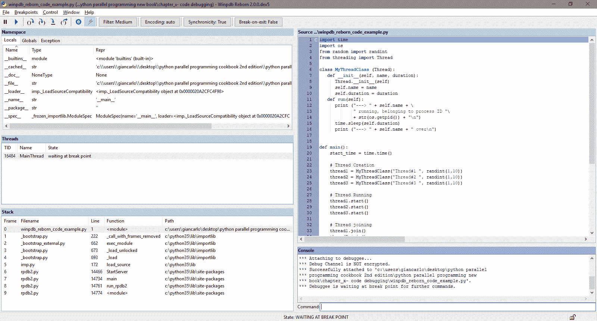
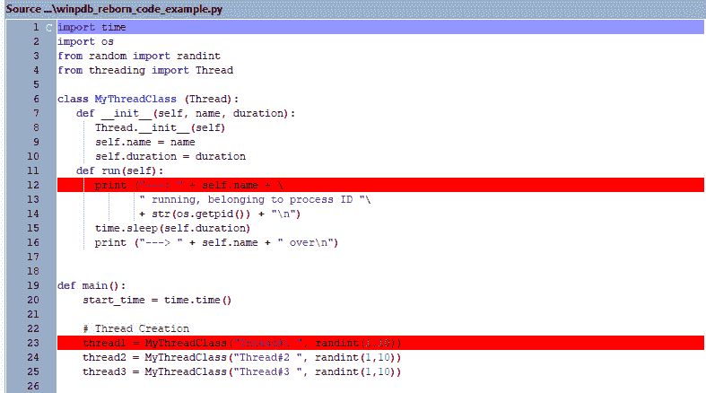
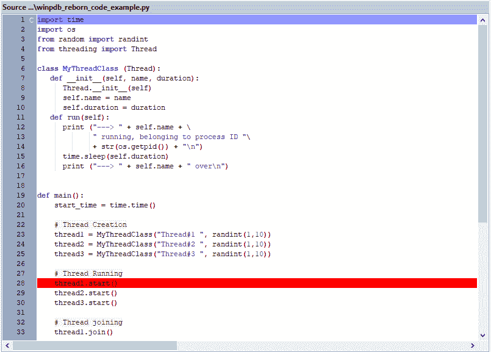
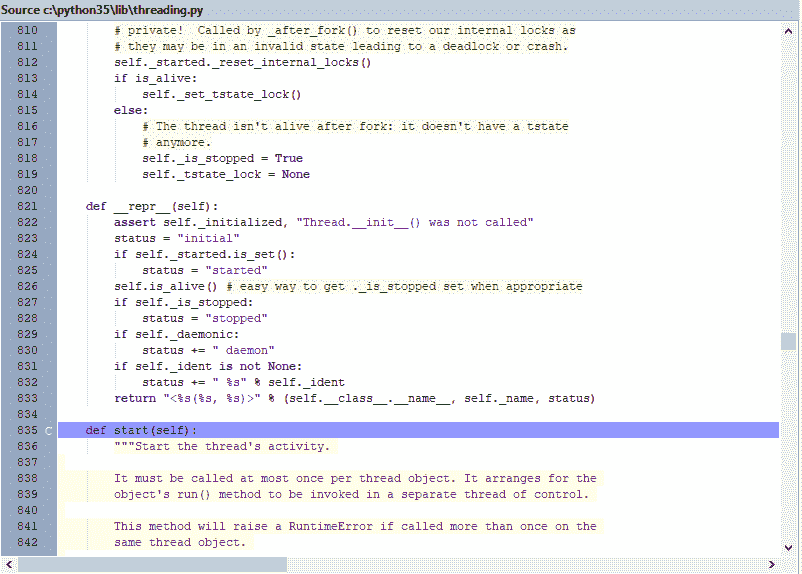
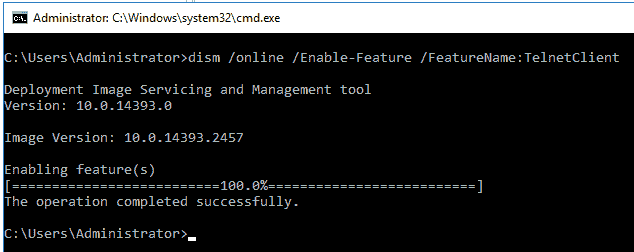
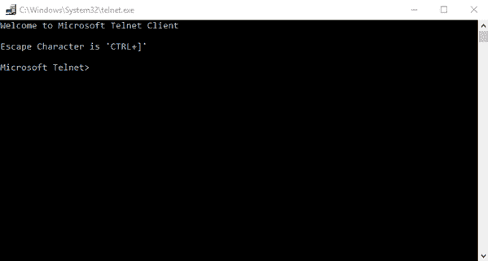

# 九、Python 调试和测试

最后一章将介绍两个重要的软件工程主题调试和测试，它们是软件开发过程中的重要步骤

本章的第一部分主要介绍代码调试。bug 是程序中的一个错误，可能会导致不同的问题，根据情况的不同，这些问题的严重程度不同。为了鼓励程序员搜索 bug，使用了特殊的软件工具，称为**调试器***；*通过使用这些软件工具，我们能够利用特定的调试功能，发现程序中的错误或故障，这是一项专门用于识别受缺陷影响的软件部分的活动。

在第二部分中，主要主题是*软件测试：*是一个用于识别正在开发的软件产品中*正确性*、*完整性*和*可靠性*缺陷的过程

因此，在本文中，我们将研究用于调试实际代码的三个最重要的 Python 工具。它们是`winpdb-reborn`，涉及使用可视化工具进行调试；`pdb`，Python 标准库中的调试器；和`rpdb`，其中`r`表示远程，表示从远程机器*进行代码调试。*

关于软件测试，我们将检查以下工具：`unittest`和`nose`。

这些是开发单元测试的框架，单元是独立操作中程序的最小组件。

在本章中，我们将介绍以下主题：

*   什么是调试？
*   什么是软件测试？
*   使用 Winpdb 重新启动进行调试
*   与`pdb`互动
*   执行`rpdb`进行调试
*   处理`unittest`
*   使用`nose`进行应用程序测试

# 什么是调试？

术语*调试*表示在软件使用后识别代码中检测到一个或多个错误（Bug）的部分的活动。

错误可以在程序的测试阶段定位；也就是说，它仍处于开发阶段，尚未准备好供最终用户使用，或者在最终用户使用程序的过程中。找到错误后，调试阶段接着进行，并确定错误所在的软件部分，这有时非常复杂。

现在，这种活动由特定的应用程序和调试器支持，它们使用逐步的软件指令向程序员显示执行情况，允许同时查看和分析程序本身的输入和输出。

在这些工具用于识别和纠正错误之前（甚至现在，在没有这些工具的情况下），最简单（但也是最不有效）的代码检查技术是打印文件或在程序正在执行的屏幕上打印指令。

调试是程序开发中最重要的操作之一。由于正在开发的软件的复杂性，这通常非常困难。由于存在引入新错误或行为的风险，而这些错误或行为与试图纠正活动所针对的错误或行为所期望的不一致，因此这一点更为微妙。

尽管使用调试来完善软件的任务每次都是独特的，并且本身就是一个故事，但一些一般原则总是适用的。特别是，在软件应用程序的上下文中，可以识别以下四个*调试阶段*，如下图所示：


Debugging phases Of course, Python offers the developer numerous debugging tools (see [https://wiki.python.org/moin/PythonDebuggingTools](https://wiki.python.org/moin/PythonDebuggingTools) for a list of Python debuggers). In this chapter, we will consider Winpdb Reborn, `rpdb`, and `pdb`.

# 什么是软件测试？

如本章导言所述，软件测试是一个用于识别正在开发的软件产品的正确性、完整性和可靠性缺陷的过程。

因此，通过这项活动，我们希望通过搜索缺陷或一系列指令和程序来确保产品质量，这些指令和程序在使用特定输入数据和特定操作环境执行时会产生故障；因此，它不同于规范以及为此类应用定义的隐式或显式需求

因此，测试的目的是通过故障来检测缺陷，从而将软件产品正常使用过程中发生此类故障的可能性降至最低。测试不能确定产品在所有可能的执行条件下都能正确运行，但它可以突出特定条件下的缺陷。

事实上，鉴于无法测试所有输入组合以及应用程序可能运行的可能软件和硬件环境，故障概率不能降低到零，但必须将其降低到最小，以便用户可以接受。

一种特殊类型的软件测试是单元测试（我们将在本章中学习），其目的是隔离程序的每个部分，并在实现中显示其正确性和完整性。它还可以迅速地指出任何缺陷，以便在集成之前能够轻松地纠正这些缺陷。

此外，与在整个应用程序上执行测试以获得相同的结果相比，单元测试降低了识别和纠正缺陷的时间和资源成本。

# 使用 Winpdb 重新启动进行调试

**Winpdb Reborn**是最重要、最知名的 Python 调试器之一。此调试器的主要优点是管理基于线程的代码的调试。

Winpdb Reborn is based on the RPDB2 debugger, while Winpdb is the GUI frontend to RPDB2 (see: [https://github.com/bluebird75/winpdb/blob/master/rpdb2.py](https://github.com/bluebird75/winpdb/blob/master/rpdb2.py)).

# 准备

安装 Winpdb Reborn（*版本 2.0.0 dev5*最常用的方式是通过`pip`，因此您需要在控制台中键入以下内容：

```py
C:\>pip install winpdb-reborn
```

另外，如果您还没有在 Python 发行版中安装 wxPython，那么您需要这样做。wxPython 是一个用于 Python 语言的跨平台 GUI 工具包。

For Python Version 2.x, please refer to [https://sourceforge.net/projects/wxpython/files/wxPython/](https://sourceforge.net/projects/wxpython/files/wxPython/). For Python Version 3.x, wxPython is automatically installed as a dependency via `pip`.

在下一节中，我们将通过一个简单的使用示例来研究 Winpdb Reborn 的主要特性和图形界面。

# 怎么做。。。

假设我们要分析下面的 Python 应用程序，它使用线程库。在[第 2 章](2.html)*基于线程的并行性*的*如何定义线程子类*一节中已经描述了一个非常类似于下面示例的示例。在下面的示例中，我们使用`MyThreadClass`类来创建和管理三个线程的执行。以下是要调试的完整代码：

```py
import time
import os
from random import randint
from threading import Thread

class MyThreadClass (Thread):
   def __init__(self, name, duration):
      Thread.__init__(self)
      self.name = name
      self.duration = duration
   def run(self):
      print ("---> " + self.name + \
             " running, belonging to process ID "\
             + str(os.getpid()) + "\n")
      time.sleep(self.duration)
      print ("---> " + self.name + " over\n")
def main():
    start_time = time.time()

    # Thread Creation
    thread1 = MyThreadClass("Thread#1 ", randint(1,10))
    thread2 = MyThreadClass("Thread#2 ", randint(1,10))
    thread3 = MyThreadClass("Thread#3 ", randint(1,10))

    # Thread Running
    thread1.start()
    thread2.start()
    thread3.start()

    # Thread joining
    thread1.join()
    thread2.join()
    thread3.join()

    # End 
    print("End")

    #Execution Time
    print("--- %s seconds ---" % (time.time() - start_time))

if __name__ == "__main__":
    main()
```

让我们看一下以下步骤：

1.  打开控制台并键入包含示例文件`winpdb_reborn_code_example.py`的文件夹名称：

```py
 python -m winpdb .\winpdb_reborn_code_example.py
```

This works on macOS as well, but you have to use a framework build of Python. If you are using Winpdb Reborn with Anaconda, simply use `pythonw` instead of `python` to launch a Winpdb Reborn session.

2.  如果安装成功，则 Winpdb 重新启动的 GUI 应打开：



Windpdb Reborn GUI

3.  正如您在下面的屏幕截图中所看到的，我们在第 12 行和第 23 行（以红色突出显示）中插入了两个断点（使用断点菜单）：

****** 

Code breakpoints To learn about what a breakpoint is, move on to the *There's more...* section of this recipe.

4.  在源窗口中，我们将鼠标放在第 23 行，在那里我们插入了第二个断点，然后按*F8*键，然后按*F5*键。断点允许代码一直执行到所选行。如您所见，Namespace 表示我们正在考虑`MyThreadClass`类的实例，并将`thread#1`作为参数：


Namespace

5.  调试器的另一个基本功能是进入功能的**步骤，即不仅可以检查正在调试的代码，还可以检查库函数和调用执行的子例程。**
6.  在开始删除以前的断点（菜单|断点|全部清除）之前，请在第 28 行插入新断点：



Line 28 breakpoint

7.  最后，按下*F5*键，应用程序将执行到**28**行断点。
8.  然后，按*F7*。在这里，源代码窗口不再显示我们的示例代码，而是显示我们正在使用的`threading`库（参见下一个屏幕截图）。
9.  因此，断点功能与 Step Into 功能一起，不仅允许调试相关代码，还允许检查所有库函数和使用的任何其他子例程：



Line 28 Source window after executing Step Into

# 它是如何工作的。。。

在第一个示例中，我们已经熟悉 Winpdb Reborn 工具。这个调试环境（和一般的每个环境一样）允许您在精确的点停止程序执行，检查执行堆栈、变量的内容、创建的对象的状态等等。

要使用 Winpdb Reborn，只需注意以下基本步骤：

1.  在源代码（源窗口）中设置一些断点。
2.  通过“进入功能”步骤检查功能。
3.  查看变量（名称空间窗口）和执行堆栈（堆栈窗口）的状态。

只需用鼠标左键双击所需行即可设置断点（您将看到所选行以红色下划线）。作为一般警告，不宜在同一行上使用多个命令；否则，将无法将断点与其中一些断点相关联。

当您使用鼠标右键时，您可以有选择地*禁用断点*而不删除它们（红色高亮显示将消失）。如前所述，要删除所有断点，请使用“断点”菜单中的“全部清除”命令。

当到达第一个断点时，最好在正在分析的程序点上关注以下视图：

*   堆栈视图显示执行堆栈的内容，其中显示当前挂起的各种方法的所有实例。通常，堆栈底部的方法是主方法，堆栈顶部的方法是包含已到达断点的方法。
*   Namespace 视图显示方法的局部变量，并允许您检查值。如果变量引用对象，则可以找到对象的唯一标识符并检查其状态。

通常，可以使用与 Winpdb Reborn 命令栏上的图标（或*Fx*键）相关联的不同模式来管理程序的执行。

最后，我们将指出以下重要的执行方法：

*   单步执行（*F7*键）：一次一行恢复程序的执行，并调用库方法或子例程。
*   Return（*F12*键）：这允许您在激活“步进”功能的确切位置恢复执行。
*   Next（*F6*键）：每次一行恢复程序的执行，而不会在调用的任何方法中停止。
*   运行到第行（*F8*键）此操作将运行程序，直到程序在指定行停止（等待新命令）。

# 还有更多。。。

正如您在 Winpdb Reborn GUI 屏幕截图中看到的，GUI 分为五个主要窗口：

*   名称空间：在此窗口中，显示实体的名称，这些名称是由程序定义并在源文件中使用的各种变量和标识符。
*   线程：显示当前执行的线程，其特征为**TID**（简称**T**线程**ID**标识）字段、线程名称、线程状态。
*   堆栈：显示待分析程序的执行堆栈。堆栈也称为***后进先出****（**后进先出**）数据结构，因为插入的最后一个元素是第一个要删除的元素。当程序调用函数时，被调用函数必须知道如何返回调用控件，因此调用函数的返回地址被输入到程序执行堆栈中。程序执行堆栈还包含每次调用函数时使用的局部变量的内存。*
**   控制台：这是一个命令行界面，因此允许用户和 Winpdb 之间的文本交互。*   来源：**此窗口显示要调试的源代码。通过沿代码行滚动，在感兴趣的代码行上按*F9*也可以插入断点。***

 ***断点是一个非常基本的调试工具。事实上，它允许您运行程序，但有可能在所需点或某些情况发生时中断程序，以获取有关运行程序***的信息。***

有多种调试策略。在这里，我们列出了其中一些：

*   **重现错误**：识别导致错误的输入数据。
*   **简化错误**：找出导致错误的最简单数据。
*   **除法和****规则**：以分步模式执行主程序，直到异常发生。导致该问题的方法是在可能发现问题之前最后一次执行的方法，因此我们可以通过在该特定调用中执行步骤重新调试，然后按照该方法的说明再次执行步骤。
*   **有意识地继续**：在调试过程中，您不断地将变量的当前值与您期望的值进行比较。
*   **检查所有细节**：调试时不要忽略细节。如果您注意到源代码中的任何差异，最好做一个注释。
*   **纠正错误**：只有在确信自己已经很好地理解了问题的情况下，才能纠正错误。

# 另见

一个好的 Winpdb 重生教程可以在[找到 http://heather.cs.ucdavis.edu/~matloff/winpdb.html#usewin](http://heather.cs.ucdavis.edu/~matloff/winpdb.html#usewin)。

# 与 pdb 交互

`pdb`是执行交互调试的 Python 模块。

`pdb`的主要特点如下：

*   断点的使用
*   逐行交互处理源代码
*   堆栈框架分析

调试器是通过`pdb`类实现的。因此，它可以很容易地用新特性进行扩展。

# 准备

不需要安装`pdb`，因为它是 Python 标准库的一部分。它可以通过以下主要使用模式启动：

*   与命令行交互
*   使用 Python 解释器
*   在要调试的代码中插入指令（即`pdb`语句）

# 与命令行交互

最简单的方法是将程序名作为输入传递。例如，对于`pdb_test.py`程序，如下所示：

```py
class Pdb_test(object):
    def __init__(self, parameter):
    self.counter = parameter

    def go(self):
        for j in range(self.counter):
             print ("--->",j)
        return

if __name__ == '__main__':
    Pdb_test(10).go()
```

通过从命令行执行，`pdb`加载要分析的源文件，并在找到第一条语句时停止执行。在这种情况下，调试停止在`1`行（即在*`Pdb_test`类的定义处）：*

 *```py
python -m pdb pdb_test.py
> .../pdb_test.py(1)<module>()
-> class Pdb_test(object):
(Pdb)
```

# 使用 Python 解释器

`pdb`模块可以通过`run()`命令在交互模式下使用：

```py
>>> import pdb_test
>>> import pdb
>>> pdb.run('pdb_test.Pdb_test(10).go()')
> <string>(1)<module>()
(Pdb)
```

在这种情况下，`run()`语句来自调试器，将在计算第一个表达式之前停止执行。

# 在代码中插入要调试的指令

对于长时间运行的进程，如果问题发生在程序执行的晚些时候，则使用`pdb set_trace()`指令在程序内启动调试器会更方便：

```py
import pdb

class Pdb_test(object):
    def __init__(self, parameter):
        self.counter = parameter
    def go(self):
        for j in range(self.counter):
            pdb.set_trace()
            print ("--->",j)
        return

if __name__ == '__main__':
    Pdb_test(10).go()
```

可以在程序中的任意点调用`set_trace()`进行调试。例如，可以根据条件、异常处理程序或控制指令的特定分支调用它。

在这种情况下，输出如下：

```py
-> print ("--->",j)
(Pdb) 
```

代码运行在`pdb.set_trace()`语句完成后停止。

# 怎么做。。。

要与`pdb`交互，您需要使用其语言，该语言允许您在代码中移动、检查和修改变量值、插入断点或通过堆栈调用移动：

1.  使用`where`命令（或者使用压缩表单`w`查看正在运行的代码行和调用堆栈。在这种情况下，这是在`pdb_test.py`模块的`go()`方法的第 17 行：

```py
> python -m pdb pdb_test.py
-> class Pdb_test(object):
(Pdb) where
 c:\python35\lib\bdb.py(431)run()
-> exec(cmd, globals, locals)
 <string>(1)<module>()
(Pdb)
```

2.  使用`list`检查当前位置（箭头指示）附近的代码行。默认模式下，在当前位置周围列出`11`行（前五行，后五行）：

```py
 (Pdb) list
 1 -> class Pdb_test(object):
 2 def __init__(self, parameter):
 3 self.counter = parameter
 4
 5 def go(self):
 6 for j in range(self.counter):
 7 print ("--->",j)
 8 return
 9
 10 if __name__ == '__main__':
 11 Pdb_test(10).go()
```

3.  如果`list`接收到两个参数，则它们被解释为要显示的第一行和最后一行：

```py
 (Pdb) list 3,9
 3 self.counter = parameter
 4
 5 def go(self):
 6 for j in range(self.counter):
 7 print ("--->",j)
 8 return
 9
```

4.  使用`up`（或`u`移动到堆栈上较旧的帧，`down`（或`d`移动到较新的堆栈帧：

```py
(Pdb) up
> <string>(1)<module>()
(Pdb) up
> c:\python35\lib\bdb.py(431)run()
-> exec(cmd, globals, locals)
(Pdb) down
> <string>(1)<module>()
(Pdb) down
>....\pdb_test.py(1)<module>()
-> class Pdb_test(object):
(Pdb)
```

# 它是如何工作的。。。

调试活动按照运行程序的流程（跟踪）执行。在每行代码中，编码器实时显示指令执行的操作以及变量中记录的值。通过这种方式，开发人员可以检查一切是否正常工作，或者确定故障的原因。

每种编程语言都有自己的调试器。但是，没有适用于所有编程语言的有效调试器，因为每种语言都有自己的语法和语法。调试器执行逐步的源代码。因此，调试器必须知道语言的规则，就像编译器一样。

# 还有更多。。。

在使用 Python 调试器时，需要记住的最有用的`pdb`命令及其简短形式如下：

| **命令** | **动作** |
| `args` | 打印当前函数的参数列表 |
| `break` | 创建断点（需要参数） |
| `continue` | 继续执行程序 |
| `help` | 列出命令（作为参数）的命令（或帮助） |
| `jump` | 设置要执行的下一行 |
| `list` | 围绕当前行打印源代码 |
| `next` | 继续执行，直到到达或返回当前函数中的下一行 |
| `step` | 执行当前行，在第一个可能的场合停止 |
| `pp` | Pretty 打印表达式的值 |
| **`quit`**或**`exit`** | 从`pdb`中止 |
| `return` | 继续执行，直到当前函数返回 |

# 另见

您可以通过观看这个有趣的视频教程[了解更多关于`pdb`的信息 https://www.youtube.com/watch?v=bZZTeKPRSLQ](https://www.youtube.com/watch?v=bZZTeKPRSLQ) 。

# 实现 rpdb 进行调试

在某些情况下，在远程位置调试代码是合适的；也就是说，一个位置不在运行调试器的同一台计算机上。为此，开发了`rpdb`。这是`pdb`上的一个包装器，它使用 TCP 套接字与外部世界通信。

# 准备

安装`rpdb`首先需要使用`pip`的主要步骤，对于 Windows 操作系统，只需键入以下内容：

```py
C:\>pip install rpdb
```

然后，您需要确保在您的机器上启用了一个工作的**telnet**客户端。在 Windows 10 中，如果打开命令提示符并键入`telnet`，则操作系统将响应错误，因为默认情况下安装中不存在该错误。

让我们通过几个简单的步骤来了解如何安装它：

1.  在管理员模式下打开命令提示符。
2.  点击 Cortana 按钮并键入`cmd`。
3.  在显示的列表中，右键单击命令提示符项，然后选择以管理员身份运行。

4.  然后，以管理员身份运行命令提示符时，键入以下命令：

```py
dism /online /Enable-Feature /FeatureName:TelnetClient
```

5.  等待几分钟，直到安装完成。如果该过程成功，您将看到：



6.  现在，您可以直接从提示符处使用 telnet。通过键入`telnet`，应出现以下窗口：



在下面的示例中，让我们看看如何使用`rpdb`运行远程调试。

# 怎么做。。。

让我们执行以下步骤：

1.  考虑下面的示例代码：

```py
import threading

def my_func(thread_number):
    return print('my_func called by thread N°
        {}'.format(thread_number))

def main():
    threads = []
    for i in range(10):
        t = threading.Thread(target=my_func, args=(i,))
        threads.append(t)
        t.start()
        t.join()

if __name__ == "__main__":
    main()
```

2.  要使用`rpdb`，您需要插入以下代码行（就在`import threading`语句之后）。事实上，这三行代码允许通过 IP 地址为`127.0.0.1`的端口`4444`上的远程客户端使用`rpdb`：

```py
import rpdb
debugger = rpdb.Rpdb(port=4444)
rpdb.Rpdb().set_trace()
```

3.  如果您在插入这三行代码后运行示例代码以启用`rpdb`的使用，那么您应该在 Python 命令提示符上看到以下消息：

```py
pdb is running on 127.0.0.1:4444
```

4.  然后，通过建立以下 telnet 连接，可以切换到远程调试示例代码：

```py
telnet localhost 4444
```

5.  应打开以下窗口：


6.  在示例代码中，注意第 7 行中的箭头。代码没有运行，只是在等待指令执行：


7.  例如，在这里，我们执行代码并重复键入`next`语句：

```py
 (Pdb) next
> c:\users\giancarlo\desktop\python parallel programming cookbook 2nd edition\python parallel programming new book\chapter_x- code debugging\rpdb_code_example.py(10)<module>()
-> def main():
(Pdb) next
> c:\users\giancarlo\desktop\python parallel programming cookbook 2nd edition\python parallel programming new book\chapter_x- code debugging\rpdb_code_example.py(18)<module>()
-> if __name__ == "__main__":
(Pdb) next
> c:\users\giancarlo\desktop\python parallel programming cookbook 2nd edition\python parallel programming new book\chapter_x- code debugging\rpdb_code_example.py(20)<module>()
-> main()
(Pdb) next
my_func called by thread N 0
my_func called by thread N 1
my_func called by thread N 2
my_func called by thread N 3
my_func called by thread N 4
my_func called by thread N 5
my_func called by thread N 6
my_func called by thread N 7
my_func called by thread N 8
my_func called by thread N 9
--Return--
> c:\users\giancarlo\desktop\python parallel programming cookbook 2nd edition\python parallel programming new book\chapter_x- code debugging\rpdb_code_example.py(20)<module>()->None
-> main()
(Pdb)
```

程序完成后，仍然可以运行新的调试部分。现在，让我们在下一节中看看`rpdp`是如何工作的。

# 它是如何工作的。。。

在本节中，我们将看到如何使用`next`语句简单地遍历代码，该语句将继续执行，直到到达或返回当前函数中的下一行。

要使用`rpdb`，请执行以下步骤：

1.  导入相关的`rpdb`库：

```py
import rpdb
```

2.  设置`debugger`参数，该参数指定要连接到的 telnet 端口，以便运行调试器：

```py
debugger = rpdb.Rpdb(port=4444)
```

3.  调用`set_trace()`指令，进入调试模式：

```py
rpdb.Rpdb().set_trace()
```

在本例中，我们将`set_trace()`指令放在`debugger`实例之后。实际上，我们可以把它放在代码的任何地方；例如，如果满足条件，或在由异常管理的节内。

第二步是打开命令提示符，通过在示例代码中设置`debugger`参数定义中指定的相同端口值来启动`telnet`：

```py
telnet localhost 4444
```

可以使用一种允许在堆栈调用之间移动的小型命令语言与`rpdb`调试器交互，以检查和修改变量的值，并控制调试器执行自己程序的方式。

# 还有更多。。。

通过在`Pdb`提示符中键入`help`命令，可以显示`rpdb`中可与之交互的命令列表：

```py
> c:\users\giancarlo\desktop\python parallel programming cookbook 2nd edition\python parallel programming new book\chapter_x- code debugging\rpdb_code_example.py(7)<module>()
-> def my_func(thread_number):
(Pdb) help

Documented commands (type help <topic>):
========================================
EOF   c   d   h list q rv undisplay
a cl debug help ll quit s unt
alias clear disable ignore longlist r source until
args commands display interact n restart step up
b condition down j next return tbreak w
break cont enable jump p retval u whatis
bt continue exit l pp run unalias where

Miscellaneous help topics:
==========================
pdb exec

(Pdb)
```

在最有用的命令中，以下是我们在代码中插入断点的方式：

1.  键入`b`和行号*设置断点。此处在`5`和`10`行中设置断点：*

 *```py
 (Pdb) b 5
Breakpoint 1 at c:\users\giancarlo\desktop\python parallel programming cookbook 2nd edition\python parallel programming new book\chapter_x- code debugging\rpdb_code_example.py:5
(Pdb) b 10
Breakpoint 2 at c:\users\giancarlo\desktop\python parallel programming cookbook 2nd edition\python parallel programming new book\chapter_x- code debugging\rpdb_code_example.py:10
```

2.  键入`b`命令即可显示已实现的断点列表：

```py
 (Pdb) b
Num Type Disp Enb Where
1 breakpoint keep yes at c:\users\giancarlo\desktop\python parallel programming cookbook 2nd edition\python parallel programming new book\chapter_x- code debugging\rpdb_code_example.py:5
2 breakpoint keep yes at c:\users\giancarlo\desktop\python parallel programming cookbook 2nd edition\python parallel programming new book\chapter_x- code debugging\rpdb_code_example.py:10
(Pdb)
```

在添加的每个新断点处，都会分配一个数字标识符。这些标识符用于启用、禁用和以交互方式删除断点。要禁用断点，请使用`disable`命令，该命令告诉调试器在到达该行时不要停止。断点不会被忘记，但会被忽略。

# 另见

你可以在`pdb`上找到很多信息，然后在`rpdb`上找到很多信息，在这个网站上：[https://github.com/spiside/pdb-tutorial](https://github.com/spiside/pdb-tutorial) 。

在接下来的两部分中，我们将介绍一些用于实现单元测试的 Python 工具：

*   `unittest`
*   `nose`

# 处理单元测试

`unittest`模块提供标准 Python 库。它有一套广泛的工具和程序来执行单元测试。在本节中，我们将简要了解`unittest`模块的工作原理

单元测试由两部分组成：

*   管理所谓的*测试系统*的代码
*   测试本身

# 准备

最简单的`unittest`模块可以通过`TestCase`子类获得，必须重写或添加适当的方法。

一个简单的`unittest`模块可以组成如下：

```py
import unittest

class SimpleUnitTest(unittest.TestCase):

    def test(self):
        self.assertTrue(True)

if __name__ == '__main__':
    unittest.main()
```

要运行`unittest`模块，您需要包含`unittest.main ()`，而我们只有一个方法`test()`，如果`True`是`False`，则会失败。

通过执行前面的示例，您将得到以下结果：

```py
-----------------------------------------------------------
Ran 1 test in 0.005s

OK
```

测试成功，结果为`OK`。

在下一节中，我们将更详细地介绍`unittest`模块的工作原理。特别是，我们想研究单元测试的可能结果。

# 怎么做。。。

让我们看看如何用这个例子来描述测试结果：

1.  导入相关模块：

```py
import unittest
```

2.  定义`outcomesTest`类，其参数为`TestCase`子类：

```py
class OutcomesTest(unittest.TestCase):
```

3.  我们定义的第一种方法是`testPass`：

```py
    def testPass(self):
        return
```

4.  以下是`TestFail`方法：

```py
    def testFail(self):
        self.failIf(True)
```

5.  接下来我们有`TestError`方法：

```py
    def testError(self):
        raise RuntimeError('test error!')
```

6.  最后，我们有`main`功能，通过它我们可以回忆我们的过程：

```py
if __name__ == '__main__':
    unittest.main()
```

# 它是如何工作的。。。

在本例中，显示了通过`unittest`进行单元测试的可能结果。

可能的结果如下：

*   `ERROR`：测试引发`AssertionError`以外的异常。没有明确的方法通过测试，因此测试状态取决于是否存在异常。

*   `FAILED`：测试未通过，出现`AssertionError`异常。
*   `OK`：测试通过。

结果如下：

```py
===========================================================
ERROR: testError (__main__.OutcomesTest)
-----------------------------------------------------------
Traceback (most recent call last):
 File "unittest_outcomes.py", line 15, in testError
 raise RuntimeError('Errore nel test!')
RuntimeError: Errore nel test!

===========================================================
FAIL: testFail (__main__.OutcomesTest)
-----------------------------------------------------------
Traceback (most recent call last):
 File "unittest_outcomes.py", line 12, in testFail
 self.failIf(True)
AssertionError

-----------------------------------------------------------
Ran 3 tests in 0.000s

FAILED (failures=1, errors=1)
```

大多数测试都确认了一个条件的真实性。根据测试作者的观点以及代码的预期结果是否得到验证，编写验证真理的测试有不同的方法。如果代码生成的值可以评估为 true，则应使用`failUnless ()`和`assertTrue ()`方法。如果代码产生假值，则使用`failIf ()`和`assertFalse ()`方法更有意义：

```py
import unittest

class TruthTest(unittest.TestCase):

    def testFailUnless(self):
        self.failUnless(True)

    def testAssertTrue(self):
        self.assertTrue(True)

    def testFailIf(self):
        self.assertFalse(False)

    def testAssertFalse(self):
        self.assertFalse(False)

if __name__ == '__main__':
    unittest.main()
```

结果如下：

```py
> python unittest_failwithmessage.py -v
testFail (__main__.FailureMessageTest) ... FAIL

===========================================================
FAIL: testFail (__main__.FailureMessageTest)
-----------------------------------------------------------
Traceback (most recent call last):
 File "unittest_failwithmessage.py", line 9, in testFail
 self.failIf(True, 'Il messaggio di fallimento va qui')
AssertionError: Il messaggio di fallimento va qui

-----------------------------------------------------------
Ran 1 test in 0.000s

FAILED (failures=1)
robby@robby-desktop:~/pydev/pymotw-it/dumpscripts$ python unittest_truth.py -v
testAssertFalse (__main__.TruthTest) ... ok
testAssertTrue (__main__.TruthTest) ... ok
testFailIf (__main__.TruthTest) ... ok
testFailUnless (__main__.TruthTest) ... ok

-----------------------------------------------------------
Ran 4 tests in 0.000s

OK
```

# 还有更多。。。

如前所述，如果测试引发除`AssertionError`之外的异常，则将其视为错误。这对于发现在编辑已存在匹配测试的代码时发生的错误非常有用。

但是，在某些情况下，您可能希望运行测试来验证某些代码是否实际生成异常。例如，当无效值作为对象的属性传递时。在这种情况下，`failUnlessRaises()`使代码比捕获代码中的异常更清晰：

```py
import unittest

def raises_error(*args, **kwds):
    print (args, kwds)
    raise ValueError\
        ('Valore non valido:'+ str(args)+ str(kwds))

class ExceptionTest(unittest.TestCase):
    def testTrapLocally(self):
        try:
            raises_error('a', b='c')
        except ValueError:
            pass
        else:
            self.fail('Non si vede ValueError')

    def testFailUnlessRaises(self):
       self.assertRaises\
               (ValueError, raises_error, 'a', b='c')

if __name__ == '__main__':
    unittest.main()
```

两者的结果是相同的。但是，使用`failUnlessRaises()`的第二次测试的结果较短：

```py
> python unittest_exception.py -v
testFailUnlessRaises (__main__.ExceptionTest) ... ('a',) {'b': 'c'}
ok
testTrapLocally (__main__.ExceptionTest) ...('a',) {'b': 'c'}
ok

-----------------------------------------------------------
Ran 2 tests in 0.000s

OK
```

# 另见

有关 Python 测试的更多信息，请参见[https://realpython.com/python-testing/](https://realpython.com/python-testing/) 。

# 使用 nose 进行应用程序测试

`nose`是定义单元测试的重要 Python 模块。它允许我们使用`unittest.TestCase`的子类编写简单的测试函数，但也允许使用*而不是`unittest.TestCase`的子类*的测试类。

# 准备

使用`pip`安装`nose`：

```py
C:\>pip install nose
```

可在[下载并安装源程序包 https://pypi.org/project/nose/](https://pypi.org/project/nose/) 通过以下步骤：

1.  解压缩源程序包。
2.  `cd`到新目录。

然后，输入以下命令：

```py
C:\>python setup.py install
```

`nose`的优点之一是自动从以下方面收集测试：

*   Python 源文件
*   在工作目录中找到的目录和包

要指定要运行的测试，请在命令行上传递相关的测试名称：

```py
C:\>nosetests only_test_this.py
```

指定的测试名称可以是文件名或模块名，也可以通过用冒号将模块或文件名与测试用例名分开来指示要运行的测试用例。文件名可以是相对的，也可以是绝对的。

一些例子如下：

```py
C:\>nosetests test.module
C:\>nosetests another.test:TestCase.test_method
C:\>nosetests a.test:TestCase
C:\>nosetests /path/to/test/file.py:test_function
```

您还可以使用`-w`开关更改`nose`查找测试的工作目录：

```py
C:\>nosetests -w /path/to/tests
```

但是，请注意，对多个`-w`参数的支持现在已被弃用，并将在将来的版本中删除。但是，通过在不使用`-w`开关的情况下指定目标目录，可以获得相同的行为：

```py
C:\>nosetests /path/to/tests /another/path/to/tests
```

通过使用插件，可以进一步定制测试选择和加载。

测试结果输出与`unittest`相同，除了额外的特性，如错误类，以及插件提供的特性，如输出捕获和断言内省。

在下一节中，我们将使用`nose`*测试一个类。*

# 怎么做。。。

让我们执行以下步骤：

1.  导入相关的`nose.tools`

 *```py
from nose.tools import eq_ 
```

2.  然后，设置`TestSuite`类。这里，*类的方法通过`eq_`函数进行测试：*

 *```py
class TestSuite:
    def test_mult(self):
        eq_(2*2,4)

    def ignored(self):
        eq_(2*2,3)
```

# 它是如何工作的。。。

单元测试可以由开发人员独立开发，但最好有一个标准产品，如`unittest`并遵循通用测试实践

从下面的示例中可以看出，测试方法是使用`eq_`函数设置的。这与`unittest`中的`assertEquals`类似，验证两个参数相等：

```py
    def test_mult(self):
        eq_(2*2,4)

    def ignored(self):
        eq_(2*2,3)
```

这种测试实践尽管意图良好，但具有明显的局限性，例如不能随着时间的推移（例如，当软件模块发生变化时）重复所谓的**回归测试**。

以下是输出：

```py
C:\>nosetests -v testset.py
testset.TestSuite.test_mult ... ok

-----------------------------------------------------------
Ran 1 tests in 0.001s

OK
```

一般来说，测试无法识别程序中的所有错误，单元测试也是如此，通过定义分析单个单元，单元测试无法识别集成错误、性能问题和其他系统相关问题。一般来说，当与其他软件测试技术结合使用时，单元测试更有效。

与任何形式的测试一样，即使是单元测试也不能证明没有错误，但只能*强调*错误的存在。

# 还有更多。。。

软件测试是一个组合数学问题。例如，每个布尔测试至少需要两个测试，一个用于真条件，一个用于假条件。可以看出，对于每个功能代码行，测试需要三到五行代码。因此，如果没有专用的测试用例生成工具，测试任何非平凡代码的所有可能输入组合是不现实的。

为了从单元测试中获得预期的好处，在整个开发过程中需要严格的纪律性。不仅要跟踪已开发和执行的测试，而且要跟踪对相关装置和所有其他装置的功能代码所做的所有更改。版本控制系统的使用至关重要。如果某个单元的较新版本未能通过之前通过的测试，则版本控制系统允许您突出显示在此期间发生的代码更改。

# 另见

有关`nose`的有效教程，请访问[https://nose.readthedocs.io/en/latest/index.html](https://nose.readthedocs.io/en/latest/index.html) 。*******