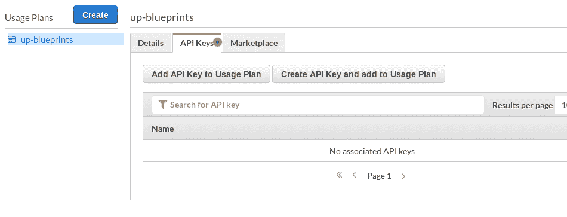
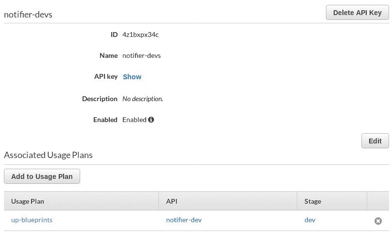
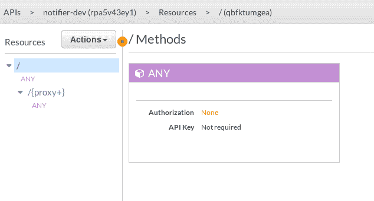
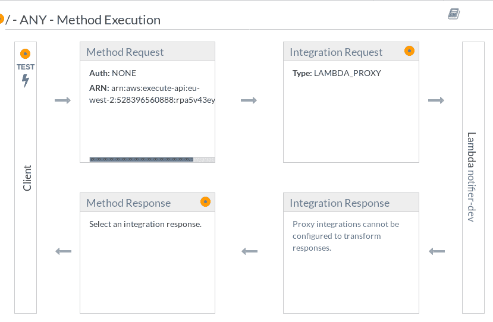
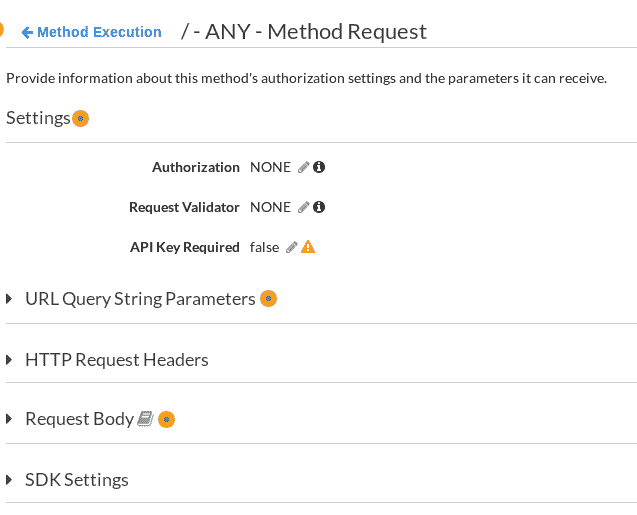
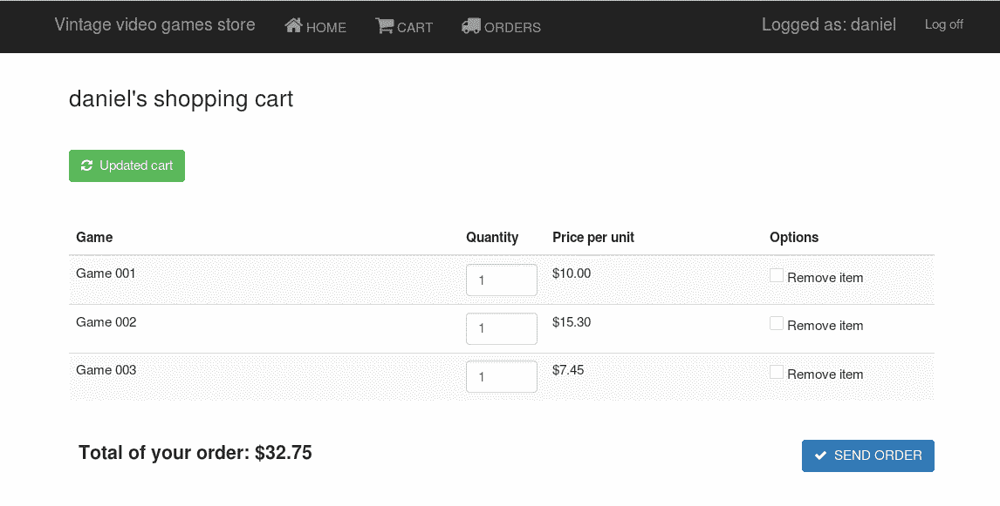
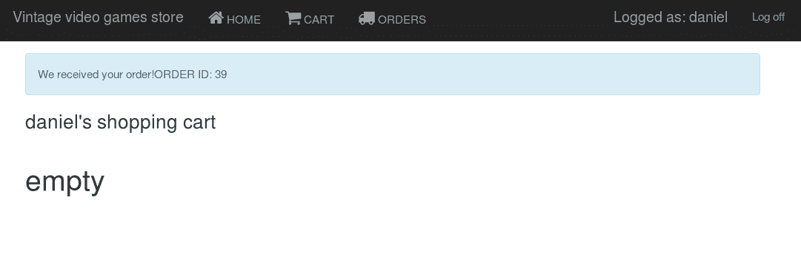
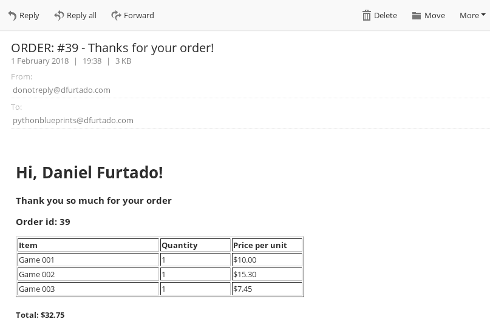
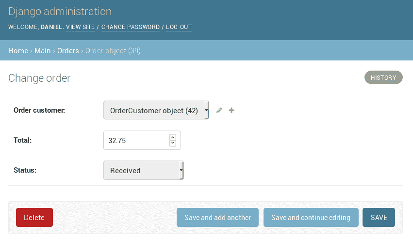
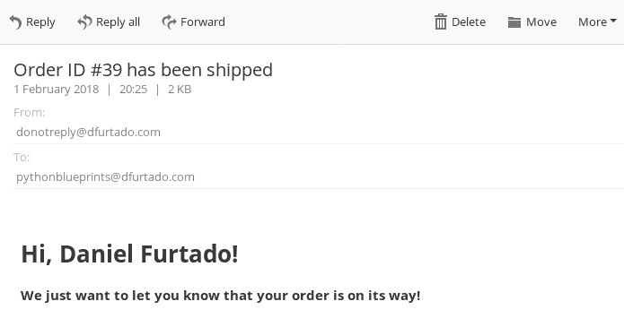

# 通知无服务器应用程序

在本章中，我们将探讨 AWS Lambda 函数和 AWS API 网关。AWS Lambda 使我们能够创建无服务器函数。*无服务器*并不意味着没有服务器；实际上，这意味着这些函数不需要 DevOps 开销，而如果您在 EC2 实例上运行应用程序，则需要 DevOps 开销。

无服务器体系结构不是解决所有问题的灵丹妙药或解决方案，但它有许多优点，例如定价、几乎不需要 DevOps 以及支持不同的编程语言。

就 Python 而言，Zappa 和 AWS Chalice 的微框架（也是由 Amazon 开发的）等工具使创建和部署无服务器功能变得极其简单。

在本章中，您将学习如何：

*   使用 Flask 框架创建服务
*   安装并配置 AWS CLI
*   使用 CLI 创建 S3 存储桶并上载文件
*   安装和配置 Zappa
*   使用 Zappa 部署应用程序

所以，不要再麻烦了，让我们直接开始吧！

# 建立环境

让我们从创建文件夹开始，我们将在其中放置应用程序文件。首先，创建一个名为`notifier`的目录并进入该目录，以便我们可以创建虚拟环境：

```py
mkdir notifier && cd notifier
```

我们使用`pipenv`创建虚拟环境：

```py
pipenv --python ~/Installs/Python3.6/bin/python3.6
```

请记住，如果 Python 3 在我们的`path`中，您只需调用：

```py
pipenv --three
```

要构建此服务，我们将使用 micro web framework Flask，因此让我们安装它：

```py
pipenv install flask
```

我们还将安装 requests 软件包，该软件包将在向订单服务发送请求时使用：

```py
pipenv install requests
```

这应该是我们现在所需要的一切。接下来，我们将了解如何使用 AWS 简单电子邮件服务从我们的应用程序发送电子邮件。

# 设置 Amazon Web 服务 CLI

我们还需要安装 AWS 命令行界面，这将在部署无服务器功能和创建 S3 存储桶时节省大量时间。

安装非常简单，因为它可以通过`pip`安装，AWS CLI 支持 Python 2 和 Python 3，并在不同的操作系统上运行，如 Linux、macOS 和 Windows。

打开终端并键入命令：

```py
pip install awscli --upgrade --user
```

升级选项将告诉 pip 更新所有已安装的需求，`--user`选项意味着 pip 将在本地目录中安装 AWS CLI，因此它不会触及系统上全局安装的任何库。在 Linux 系统上，当使用`--user`选项安装 Python 包时，该包将安装在目录`.local/bin`中，因此请确保您的`path`中有该目录。

要验证安装是否正常工作，请键入以下命令：

```py
aws --version
```

您应该会看到类似以下内容的输出：

```py
aws-cli/1.14.30 Python/3.6.2 Linux/4.9.0-3-amd64 botocore/1.8.34
```

在这里，您可以看到 AWS CLI 版本，以及操作系统版本、Python 版本以及当前使用的`botocore`版本。`botocore`是 AWS CLI 使用的核心库。此外，boto 是 Python 的 SDK，它允许开发人员编写软件来与 Amazon 服务（如 EC2 和 S3）一起工作。

现在我们需要配置 CLI，并且需要手头有一些信息。首先，我们需要`aws_access_key_id`和`aws_secret_access_key`，以及您喜欢的区域和输出。最常见的值，输出选项是 JSON。

要创建访问密钥，请单击 AWS 控制台页面右上角带有用户名的下拉菜单，然后选择我的安全凭据。您将登陆此页面：


在这里，您可以配置不同的帐户安全设置，例如更改密码或启用多因素身份验证，但您现在应该选择的是访问密钥（访问密钥 ID 和机密访问密钥）。然后单击“创建新访问密钥”，将打开一个包含密钥的对话框。您还可以选择下载密钥。我建议你下载并保存在安全的地方。

到这里[https://docs.aws.amazon.com/general/latest/gr/rande.html](https://docs.aws.amazon.com/general/latest/gr/rande.html) 查看 AWS 区域和端点。

现在我们可以`configure`CLI 了。在命令行中，键入：

```py
aws configure
```

系统将要求您提供访问密钥、秘密访问密钥、区域和默认输出格式。

# 配置简单的电子邮件服务

Amazon 已经有一个名为 Simple Email service 的服务，我们可以使用它通过我们的应用程序发送电子邮件。我们将在沙箱模式下运行该服务，这意味着我们也将能够向已验证的电子邮件地址发送电子邮件。如果您计划在生产环境中使用该服务，则可以对其进行更改，但就本书而言，只需在沙箱模式下运行即可。

If you plan to have this application running in production and wish to move out of the Amazon SES sandbox, you can easily open a support case for increasing the email limit. To send the request, you can go to the SES home page, and on the left-hand menu, under the section *Email Sending*, you will find the link `Dedicated IPs`. There, you will find more information and also a link where you can apply to increase your email limit.

为了让它工作，我们需要有两个电子邮件帐户，我们可以使用。就我而言，我有自己的领域。我还创建了两个电子邮件帐户-`donotreply@dfurtado.com`，这是我用来发送电子邮件的电子邮件；`pythonblueprints@dfurtado.com`，这是接收电子邮件的电子邮件。在线（视频）游戏商店应用程序中的用户将使用此电子邮件地址，我们将下一些订单，以便稍后测试通知。

# 注册电子邮件

让我们开始添加电子邮件。我们先注册`donotreply@dfurtado.com`。登录 AWS 控制台并在搜索栏中搜索简单电子邮件服务。在左侧，您将看到一些选项。在“身份管理”下，单击电子邮件地址。您将看到如下屏幕：


如您所见，列表是空的，所以让我们继续添加两封电子邮件。单击验证新电子邮件地址，将出现一个对话框，您可以在其中输入电子邮件地址。只需输入您希望使用的电子邮件，然后单击“验证此电子邮件地址”按钮。通过这样做，验证电子邮件将发送到您指定的电子邮件地址，您将在其中找到验证链接

对第二封电子邮件重复相同的步骤，该电子邮件将接收消息。

现在，再次转到左侧菜单并单击电子邮件发送下的 SMTP 设置。

在那里，您将看到发送电子邮件所需的所有配置，并且您还必须创建 SMTP 凭据。因此，单击“创建我的 SMTP 凭据”按钮，将打开一个新页面，您可以在其中输入所需的 IAM 用户名。在我的例子中，我添加了`python-blueprints`。完成此操作后，单击“创建”按钮。创建凭据后，将显示一个页面，您可以在其中查看 SMTP 用户名和密码。如果愿意，您可以选择下载这些凭据。

# 创建 S3 存储桶

为了向用户发送模板电子邮件，我们需要将模板复制到 S3 存储桶中。我们可以通过 web 轻松实现这一点，也可以使用我们刚刚安装的 AWS CLI。在`es-west-2`区域创建 S3 bucket 的命令如下：

```py
aws s3api create-bucket \
--bucket python-blueprints \
--region eu-west-2 \
--create-bucket-configuration LocationConstraint=eu-west-2
```

这里我们使用命令`s3api`，它将为我们提供与 AWS S3 服务交互的不同子命令。我们调用 sub 命令`create-bucket`，顾名思义，它将创建一个新的 S3 bucket。对于这个子命令，我们指定三个参数。首先，`--bucket`，指定 S3 bucket 的名称，然后，`--region`指定将创建 bucket 的区域——在本例中，我们将在`eu-west-2`中创建 bucket。最后，区域`us-east-1`之外的位置请求设置`LocationConstraint`，以便可以在我们希望的区域中创建 bucket。

# 实现通知服务

现在我们已经设置好了所有内容，并且我们将用作模板向在线（视频）游戏商店的客户发送电子邮件的文件已经在`python-blueprints`S3 存储桶中就位，现在是开始实施通知服务的时候了。

让我们继续在`notifier`目录中创建一个名为`app.py`的文件，首先，让我们添加一些导入：

```py
import smtplib
from http import HTTPStatus
from smtplib import SMTPAuthenticationError, SMTPRecipientsRefused

from email.mime.text import MIMEText
from email.mime.multipart import MIMEMultipart

import boto3
from botocore.exceptions import ClientError

from flask import Flask
from flask import request, Response

from jinja2 import Template
import json
```

首先，我们导入 JSON 模块，以便可以序列化和反序列化数据。我们从 HTTP 模块导入`HTTPStatus`，以便在从服务端点发送响应时使用 HTTP 状态常量。

然后我们导入发送电子邮件所需的模块。我们首先导入`smtplib`和一些我们想要处理的异常。

我们还导入了`MIMEText`，用于从电子邮件内容中创建`MIME`对象，以及`MIMEMultipart`，用于创建我们要发送的消息。

接下来，我们导入`boto3`包，以便可以使用*AWS*服务。我们将处理一些例外情况；在这种情况下，这两个异常都与*S3*存储桶相关。

接下来是一些与烧瓶相关的导入，最后但并非最不重要的一点是，我们导入`Jinja2`包来模板我们的电子邮件。

继续处理`app.py`文件，让我们定义将保存名称的常量或我们创建的*S3*bucket：

```py
S3_BUCKET_NAME = 'python-blueprints'
```

然后我们创建 Flask 应用程序：

```py
app = Flask(__name__)
```

我们还将添加一个名为`S3Error`的自定义异常：

```py
class S3Error(Exception):
    pass
```

然后我们将定义两个辅助函数。第一种是发送电子邮件：

```py
def _send_message(message):

    smtp = smtplib.SMTP_SSL('email-smtp.eu-west-1.amazonaws.com', 
     465)

    try:
        smtp.login(
            user='DJ********DER*****RGTQ',
            password='Ajf0u*****44N6**ciTY4*****CeQ*****4V')
    except SMTPAuthenticationError:
        return Response('Authentication failed',
                        status=HTTPStatus.UNAUTHORIZED)

    try:
        smtp.sendmail(message['From'], message['To'], 
         message.as_string())
    except SMTPRecipientsRefused as e:
        return Response(f'Recipient refused {e}',
                        status=HTTPStatus.INTERNAL_SERVER_ERROR)
    finally:
        smtp.quit()

    return Response('Email sent', status=HTTPStatus.OK)
```

这里，我们定义函数`_send_message`，它只得到一个参数`message`。我们通过创建一个封装 SMTP 连接的对象来启动此函数。我们使用`SMTP_SSL`是因为 AWS 简单电子邮件服务需要 TLS。第一个参数是 SMTP 主机，它是我们在 AWS 简单电子邮件服务中创建的，第二个参数是端口，当需要 SSL 上的 SMTP 连接时，它将被设置为`456`。

然后我们调用 login 方法，传递用户名和密码，这也可以在 AWS 简单电子邮件服务中找到。在抛出`SMTPAuthenticationError`异常的情况下，我们将`UNAUTHORIZED`响应发送回客户端。

如果成功登录 SMTP 服务器，我们将调用`sendmail`方法，传递发送邮件的电子邮件、目标收件人和邮件。我们处理一些收件人拒绝我们的消息的情况，即我们返回一个`INTERNAL SERVER ERROR`响应，然后我们只是退出连接。

最后，我们返回`OK`响应，说明消息已成功发送。

现在，我们创建一个 helper 函数来从 S3 bucket 加载模板文件，并为我们返回一个呈现的模板：

```py
def _prepare_template(template_name, context_data):

    s3_client = boto3.client('s3')

    try:
        file = s3_client.get_object(Bucket=S3_BUCKET_NAME, 
        Key=template_name)
    except ClientError as ex:
        error = ex.response.get('Error')
        error_code = error.get('Code')

        if error_code == 'NoSuchBucket':
            raise S3Error(
             f'The bucket {S3_BUCKET_NAME} does not exist') from ex
        elif error_code == 'NoSuchKey':
            raise S3Error((f'Could not find the file "
               {template_name}" '
               f'in the S3 bucket {S3_BUCKET_NAME}')) from ex
        else:
            raise ex

    content = file['Body'].read().decode('utf-8')
    template = Template(content)

    return template.render(context_data)
```

这里我们定义函数`_prepare_template`并取两个参数；`template_name`是我们存储在 S3 bucket 中的文件名，`context_data`是包含我们将在模板中呈现的数据的字典。

首先，我们创建一个 S3 客户端，然后使用`get_object`方法传递 bucket 名称和`Key`。我们将 bucket 关键字参数设置为`S3_BUCKET_NAME`，我们在该文件顶部定义了该参数，其值为`python-blueprints`。`Key`关键字参数是文件名；我们将其设置为参数`template_name`中指定的值。

接下来，我们访问 S3 bucket 返回的对象中的 key`Body`，并调用方法`read`。这将返回一个包含文件内容的字符串。然后，我们创建一个传递模板文件内容的 Jinja2 模板对象，最后，我们调用传递`context_data`的 render 方法。

现在，让我们实现端点，该端点将被调用以向我们收到订单的客户发送确认电子邮件：

```py
@app.route("/notify/order-received/", methods=['POST'])
def notify_order_received():
    data = json.loads(request.data)

    order_items = data.get('items')

    customer = data.get('order_customer')
    customer_email = customer.get('email')
    customer_name = customer.get('name')

    order_id = data.get('id')
    total_purchased = data.get('total')

    message = MIMEMultipart('alternative')

    context = {
        'order_items': order_items,
        'customer_name': customer_name,
        'order_id': order_id,
        'total_purchased': total_purchased
    }

    try:
        email_content = _prepare_template(
            'order_received_template.html',
            context
        )
    except S3Error as ex:
        return Response(str(ex), 
       status=HTTPStatus.INTERNAL_SERVER_ERROR)

    message.attach(MIMEText(email_content, 'html'))

    message['Subject'] = f'ORDER: #{order_id} - Thanks for your 
    order!'
    message['From'] = 'donotreply@dfurtado.com'
    message['To'] = customer_email

    return _send_message(message)
```

在这里，定义一个名为`notify_order_received`的函数，我们用`@app.route`来修饰它，以定义调用该端点时允许的路由和方法。路由被定义为`/notify/order-received/`，并且`methods`关键字参数获取一个包含允许的 HTTP 方法的列表。在这种情况下，我们只允许 POST 请求。

我们通过获取请求中传递的所有数据来启动此函数。在烧瓶应用程序中，可在`request.data`上访问该数据；我们使用`json.loads`方法将`request.data`作为参数传递，因此它将 JSON 对象反序列化为 Python 对象。然后我们得到项目，这是一个包含订单中所有项目的列表，我们得到属性`order_customer`的值，这样我们就可以得到客户的电子邮件和客户的姓名。

然后，我们得到订单 ID，可以通过属性`id`访问，最后，我们得到发送到此端点的数据的属性`total`中的总购买价值。

然后我们创建一个作为参数`alternative`传递的`MIMEMultiPart`实例，这意味着我们将创建一条`MIME`类型设置为 multipart/alternative 的消息。之后，我们配置一个将被传递到电子邮件模板的上下文，并使用`_prepare_template`函数传递我们想要呈现的模板和将在电子邮件中显示的数据的上下文。渲染模板的值将存储在变量`email_content`中。

最后，我们为我们的电子邮件做最后的设置；我们将呈现的模板附加到消息，设置主题、发送者和目的地，并调用`_send_message`函数来发送消息。

接下来，我们将添加端点，当用户的订单状态更改为`Shipping`时，该端点将通知用户：

```py
@app.route("/notify/order-shipped/", methods=['POST'])
def notify_order_shipped():
    data = json.loads(request.data)

    customer = data.get('order_customer')

    customer_email = customer.get('email')
    customer_name = customer.get('name')

    order_id = data.get('id')

    message = MIMEMultipart('alternative')

    try:
        email_content = _prepare_template(
            'order_shipped_template.html',
            {'customer_name': customer_name}
        )
    except S3Error as ex:
        return Response(ex, status=HTTPStatus.INTERNAL_SERVER_ERROR)

    message.attach(MIMEText(email_content, 'html'))

    message['Subject'] = f'Order ID #{order_id} has been shipped'
    message['From'] = 'donotreply@dfurtado.com'
    message['To'] = customer_email

    return _send_message(message)
```

在这里，我们定义了一个名为`notify_order_shipped`的函数，并用`@app.route`装饰符对其进行装饰，传递两个参数和路由（设置为`/notify/order-shipped/`），并定义在该端点中接受的方法是`POST`方法。

我们首先获取请求中传递的数据-基本上与前面的函数`notify_order_received`相同。我们还创建了一个`MIMEMultipart`实例，将`MIME`类型设置为 multipart/alternative。接下来，我们使用`_prepare_template`函数加载模板，并使用我们在第二个参数中传递的上下文进行渲染；在这种情况下，我们只传递客户的名称。

然后，我们将模板附加到消息并进行最终设置，设置主题、发送和目的地。最后，我们致电`_send_message`发送消息。

接下来，我们将创建两个电子邮件模板，一个用于向用户发送订单确认通知，另一个用于发送订单。

# 电子邮件模板

现在，我们将创建将在向在线（视频）游戏商店的客户发送通知电子邮件时使用的模板。

在应用程序的`root`目录中，创建一个名为`templates`的目录，创建一个名为`order_received_template.html`的文件，内容如下：

```py
<html>
  <head>
  </head>
  <body>
    <h1>Hi, {{customer_name}}!</h1>
    <h3>Thank you so much for your order</h3>
    <p>
      <h3>Order id: {{order_id}}</h3>
    </p>
    <table border="1">
      <thead>
        <tr>
          <th align="left" width="40%">Item</th>
          <th align="left" width="20%">Quantity</th>
          <th align="left" width="20%">Price per unit</th>
        </tr>
      </thead>
      <tbody>
        
        <tr>
          <td>{{item.name}}</td>
          <td>{{item.quantity}}</td>
          <td>${{item.price_per_unit}}</td>
        </tr>
        
      </tbody>
    </table>
    <div style="margin-top:20px;">
      <strong>Total: ${{total_purchased}}</strong>
    </div>
  </body>
</html>
```

现在我们在同一目录下创建另一个模板`order_shipped_template.html`，内容如下：

```py
<html>
  <head>
  </head>
  <body>
    <h1>Hi, {{customer_name}}!</h1>
    <h3>We just want to let you know that your order is on its way! 
    </h3>
  </body>
</html>
```

如果您已经阅读了[第 7 章](7.html)、*与 Django*的在线视频游戏商店，您应该熟悉此语法。与 Django 模板语言相比，Jinja2 语法有很多相似之处。

现在我们可以将模板复制到之前创建的 S3 bucket 中。打开终端并运行以下命令：

```py
aws s3 cp ./templates s3://python-blueprints --recursive
```

完美的接下来，我们将部署我们的项目。

# 使用 Zappa 部署应用程序

现在我们来看看这一章中非常有趣的部分。我们将部署使用名为**Zappa**（[的工具创建的 Flask 应用程序 https://github.com/Miserlou/Zappa](https://github.com/Miserlou/Zappa) ）。Zappa 是一个用 Python 开发的工具（由 Zappa 的主要作者**Rich Jones**开发），它使构建和部署无服务器 Python 应用程序变得非常容易。

安装非常简单。在我们开发本项目所使用的虚拟环境中，您只需运行`pipenv`命令：

```py
pipenv install zappa
```

安装完成后，您可以开始配置。您只需确保您拥有有效的 AWS 帐户，并且 AWS 凭据文件已准备就绪。如果您从一开始就遵循本章，并安装和配置了 AWS CLI，您应该已经完全准备好了。

要为我们的项目配置 Zappa，您可以运行：

```py
zappa init
```

您将看到 ASCII Zappa 徽标（非常漂亮的 BTW），它将开始询问一些问题。第一个是：

```py
Your Zappa configuration can support multiple production stages, like 'dev', 'staging', and 'production'.
What do you want to call this environment (default 'dev'):
```

您只需点击*输入*即可默认为`dev`。接下来，Zappa 将询问 AWS S3 存储桶的名称：

```py
Your Zappa deployments will need to be uploaded to a private S3 bucket.
If you don't have a bucket yet, we'll create one for you too.
What do you want call your bucket? (default 'zappa-uc40h2hnc'):
```

在这里，您可以指定一个现有的或创建一个新的。然后，Zappa 将尝试检测我们正在尝试部署的应用程序：

```py
It looks like this is a Flask application.
What's the modular path to your app's function?
This will likely be something like 'your_module.app'.
We discovered: notify-service.app
Where is your app's function? (default 'notify-service.app'):
```

如您所见，Zappa 自动找到了`notify-service.py`文件中定义的 Flask 应用程序。您只需点击*输入*即可设置默认值。

接下来，Zappa 将询问您是否希望在全球部署应用程序；我们可以保留默认值并回答`n`。因为我们是在开发环境中部署这个应用程序，所以实际上不需要全局部署它。当应用程序投入生产时，您可以评估是否需要在全球范围内部署它。

最后，将显示完整的配置，在这里您必须更改审查，并根据需要进行任何修改。您不必太担心是否保存配置，因为 Zappa 设置文件只是一个文本文件，带有 JSON 格式的设置。您可以随时编辑该文件并手动更改它。

如果一切顺利，您应该会在应用程序的根目录中看到一个名为`zappa_settings.json`的文件，其内容类似于如下所示：

```py
{
    "dev": {
        "app_function": "notify-service.app",
        "aws_region": "eu-west-2",
        "project_name": "notifier",
        "runtime": "python3.6",
        "s3_bucket": "zappa-43ivixfl0"
    }
}
```

在这里您可以看到`dev`环境设置。`app_function`指定了我在`notify-service.py`文件上创建的 Flask 应用程序，`aws_region`指定了应用程序将部署在哪个区域——在我的例子中，因为我在瑞典，所以我选择了`eu-west-2`*（*伦敦*）*，这是离我最近的区域。默认情况下，`project_name`将获取运行命令`zappa init`的目录的名称

然后是运行时，它指的是与应用程序一起运行的 Python 版本。因为我们为这个项目创建的虚拟环境使用了 Python 3*，*这个属性的值应该是 Python 3*-*的一个版本。在我的例子中，我已经安装了 3.6.2。最后，我们有一个 AWS S3 bucket 的名称，Zappa 将使用它来上传项目文件。

现在，让我们部署刚刚创建的应用程序！在终端上，只需运行以下命令：

```py
zappa deploy dev
```

Zappa 将为您执行许多任务，最后它将显示应用程序部署的 URL。就我而言，我有：

```py
https://rpa5v43ey1.execute-api.eu-west-2.amazonaws.com/dev
```

你的看起来会略有不同。因此，我们在 Flask 应用程序中定义了两个端点，`/notify/order-received`和`/notify/order-shipped`。可以使用以下 URL 调用这些端点：

```py
https://rpa5v43ey1.execute-api.eu-west-2.amazonaws.com/dev/notify/order-received
https://rpa5v43ey1.execute-api.eu-west-2.amazonaws.com/dev/notify/order-shipped
```

如果您想查看有关部署的更多信息，可以使用 Zappa 命令：`zappa status`。

在下一节中，我们将学习如何限制对这些端点的访问，并创建可用于进行 API 调用的访问密钥。

# 限制对 API 端点的访问

我们的 Flask 应用程序已经部署，此时任何人都可以向 AWS API 网关上配置的端点发出请求。我们要做的是将访问权限限制为仅包含访问密钥的请求。

为此，请在 AWS 控制台上登录我们的帐户，并在“服务”菜单上搜索并选择亚马逊 API 网关*。*在左侧菜单的 API 下，您将看到通知程序开发：


伟大的这里我们将定义一个使用计划。单击使用计划，然后单击创建按钮，您将看到一个用于创建新使用计划的表单。输入名称`up-blueprints`，取消选中启用节流和启用配额*、*复选框，点击下一步按钮。

下一步是关联 API 阶段。到目前为止，我们只有 dev，所以让我们添加 stage dev；单击 AddAPI 阶段按钮，并在下拉列表中选择通知程序开发和阶段开发。确保单击复选按钮，与下拉菜单的行相同，否则，下一步按钮将无法启用。

单击“下一步”后，您必须将 API 密钥添加到我们刚刚创建的使用计划中。这里你有两个选择；添加新的或拾取现有的：



让我们添加一个新的。单击标有“创建 API 密钥并添加到使用计划”的按钮。将显示 API 密钥创建对话框，因此只需输入名称`notifiers-devs`并单击保存。

伟大的现在，如果您选择左侧菜单上的 API 键，您应该会在列表上看到新创建的 API 键。如果您选择了它，您将能够看到有关密钥的所有详细信息：



现在，在左侧菜单上，选择 API->notifier dev->Resources，并在选项卡 Resources 上选择根路由/。在右侧面板上，您可以看到/Methods：



请注意，任何授权都表示“无”，并且 API 密钥设置为“不需要”。让我们将其更改为需要 API 密钥。在 Resources 面板上，单击 ANY，您现在应该会看到一个类似于屏幕截图的面板，如下所示：



点击方法请求：



单击 API Key Required 旁边的笔图标，并在下拉菜单上选择值 true*。*

伟大的现在，对 stage dev 的 API 调用应该限制为请求头中包含 API 密钥通知程序 dev 的请求。

最后，转到 API 键并单击通知键。在右侧面板上，在 API`Key`中，点击链接 show，将为您显示 API 密钥。复制该键，因为我们将在下一节中使用它。

# 修改订单服务

现在我们已经部署了 notifier 应用程序，我们必须修改以前的项目 order microservice，以便在新订单到达以及订单状态更改为 shipped 时使用 notifier 应用程序并发送通知。

我们要做的第一件事是将 notifier service API 密钥及其基本 URL 包含在订单的`root`目录中名为`order`的`settings.py`文件中，并在文件末尾包含以下内容：

```py
NOTIFIER_BASEURL = 'https://rpa5v43ey1.execute-api.eu-west-2.amazonaws.com/dev'

NOTIFIER_API_KEY = 'WQk********P7JR2******kI1K*****r'
```

用环境中相应的值替换这些值。如果您没有`NOTIFIER_BASEURL`的值，可以通过以下命令获取：

```py
zappa status
```

您需要的值是 API 网关 URL。

现在，我们将创建两个文件。第一个是`order/main`目录中名为`notification_type.py`的文件。在此文件中，我们将定义一个枚举，其中包含我们希望在服务中可用的通知类型：

```py
from enum import Enum, auto

class NotificationType(Enum):
    ORDER_RECEIVED = auto()
    ORDER_SHIPPED = auto()
```

接下来，我们将创建一个带有 helper 函数的文件，该函数将调用通知服务。在`order/main/`目录下创建一个名为`notifier.py`的文件，内容如下：

```py
import requests
import json

from order import settings

from .notification_type import NotificationType

def notify(order, notification_type):
    endpoint = ('notify/order-received/'
                if notification_type is NotificationType.ORDER_RECEIVED
                else 'notify/order-shipped/')

    header = {
        'X-API-Key': settings.NOTIFIER_API_KEY
    }

    response = requests.post(
        f'{settings.NOTIFIER_BASEURL}/{endpoint}',
        json.dumps(order.data),
        headers=header
    )

    return response
```

从顶部开始，我们包含了一些导入语句；我们正在将执行请求的请求导入到 notifier 服务，因此我们导入模块 json，以便可以序列化要发送到 notifier 服务的数据。然后我们导入这些设置，这样我们就可以获得我们用通知服务的基本 URL 和 API 密钥定义的常量。最后，我们导入通知类型枚举。

我们在这里定义的函数`notify`有两个参数，order 和 notification type，它们是枚举`NotificationType`中定义的值。

我们首先根据通知的类型决定要使用哪个端点。然后，我们使用 API 键将条目`X-API-KEY`添加到请求的`HEADER`中。

之后，我们提出一个`POST`请求，传递一些参数。第一个参数是端点的 URL，第二个参数是我们要发送到通知服务的数据（我们使用`json.dumps`函数，因此数据以 JSON 格式发送），第三个参数是带有头数据的字典。

最后，当我们得到回复时，我们只是返回它。

现在我们需要修改负责处理`POST`请求以创建新订单的视图，以便在数据库中创建订单时调用 notify 函数。让我们继续打开`order/main`目录中的文件`view.py`并添加两条导入语句：

```py
from .notifier import notify
from .notification_type import NotificationType
```

这两行可以添加到文件中第一个类之前。

很好，现在我们需要更改`CreateOrderView`类中的方法 post。在该方法的第一个 return 语句之前，我们返回一个`201`（`CREATED`）响应，包括如下代码：

```py
 notify(OrderSerializer(order),
        NotificationType.ORDER_RECEIVED)
```

因此，这里我们调用 notify 函数，在第一个参数上使用`OrderSerializer`和通知类型传递序列化顺序——在本例中，我们希望发送一个`ORDER_RECEIVED`通知。

我们将允许 order 服务应用程序的用户使用 Django 管理员更新订单。例如，在那里，他们将能够更新订单的状态，因此我们需要实现一些代码来处理用户使用 Django Admin 进行的数据更改。

为此，我们需要在`order/main`目录中的`admin.py`文件中创建一个`ModelAdmin`类。首先，我们添加一些导入语句：

```py
from .notifier import notify
from .notification_type import NotificationType
from .serializers import OrderSerializer
from .status import Status
```

然后我们添加以下类：

```py
class OrderAdmin(admin.ModelAdmin):

    def save_model(self, request, obj, form, change):
        order_current_status = Status(obj.status)
        status_changed = 'status' in form.changed_data

        if (status_changed and order_current_status is 
           Status.Shipping):
            notify(OrderSerializer(obj), 
            NotificationType.ORDER_SHIPPED)

        super(OrderAdmin, self).save_model(request, obj, form,  
        change)
```

在这里，我们创建了一个名为`OrderAdmin`的类，该类继承自`admin.ModelAdmin`，并重写了方法`save_model`，因此我们有机会在保存数据之前执行一些操作。首先，我们获取订单当前状态，然后检查字段`status`是否在已更改的字段列表之间。

if 语句检查 status 字段是否已更改，如果订单的当前状态等于`Status.Shipping`，则调用 notify 函数，传递序列化的订单对象和通知类型`NotificationType.ORDER_SHIPPED`。

最后，我们调用超类上的`save_model`方法来保存对象。

这个拼图的最后一块是替换这个：

```py
admin.site.register(Order)
```

相反，请这样说：

```py
admin.site.register(Order, OrderAdmin)
```

这将注册`Order`模型的管理模型`OrderAdmin`。现在，当用户在 Django 管理 UI 中保存订单时，它将调用`OrderAdmin`类中的`save_model`。

# 一起测试所有部件

现在我们已经部署了 notifier 应用程序，并且对 order 服务进行了所有必要的修改，现在是时候测试所有应用程序是否都在一起工作了。

打开终端，切换到实现在线（视频）游戏商店的目录，并执行以下命令以启动 Django 开发服务器：

```py
python manage.py runserver
```

此命令将启动在默认端口`8000`上运行的 Django 开发服务器。

现在，让我们开始订购微服务。打开另一个终端窗口，切换到实现 order microserver 的目录，然后运行以下命令：

```py
python manage.py runserver 127.0.0.1:8001
```

现在我们可以浏览到`http://127.0.0.1:8000`，登录到应用程序并将一些项目添加到购物车中：



如你所见，我添加了三个项目，该订单的总金额为 32.75 美元。单击“发送订单”按钮，您将在页面上收到订单已发送的通知。



伟大的到目前为止，一切正常。现在我们检查用户的电子邮件，以验证通知服务是否确实发送了订单确认电子邮件。

很公平，用户刚刚收到电子邮件：



请注意，发件人和目标收件人是我在 AWS 简单电子邮件服务中注册的电子邮件。

现在，让我们登录订单服务的 Django admin 并更改同一订单的状态，以验证订单已发货的确认电子邮件是否会发送给用户。请记住，只有订单的状态字段更改为已发货时，才会发送电子邮件。

浏览至`http://localhost:8001/admin/`并使用管理员凭据登录。您将看到一个页面，其菜单如下所示：


单击订单，然后选择我们刚刚提交的订单：



在下拉菜单状态中，将值更改为 Shipping，然后单击 SAVE 按钮

现在，如果我们再次验证订单客户的电子邮件，我们应该会收到另一封确认订单已发货的电子邮件：



# 总结

在本章中，您了解了有关无服务器功能体系结构的更多信息，了解了如何使用 web 框架 Flask 构建通知服务，以及如何使用伟大的项目 Zappa 将最终应用程序部署到 AWS Lambda。

然后，您学习了如何安装、配置和使用 AWS CLI 工具，并使用它将文件上载到 AWS S3 存储桶。

我们还学习了如何将我们在[第 7 章](7.html)*中开发的 web 应用程序、在线游戏商店与 Django*、*和*我们在[第 8 章](8.html)*、**订单微服务*中开发的订单微服务进行集成，使用无服务器通知应用程序。**