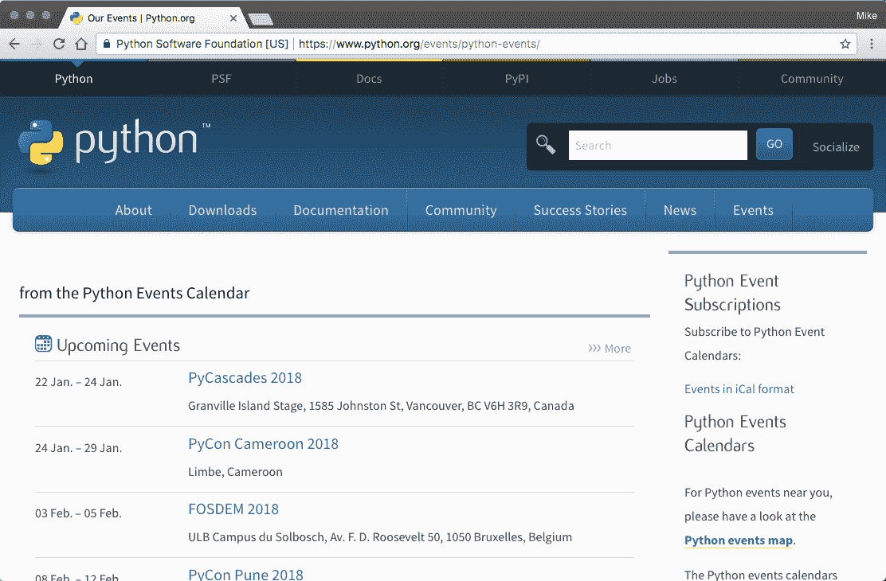
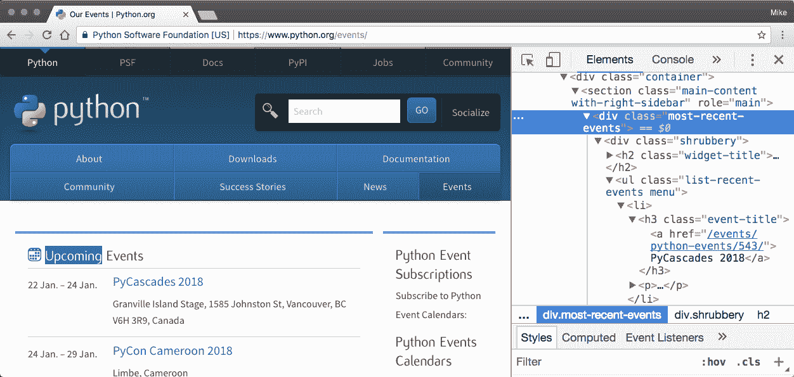
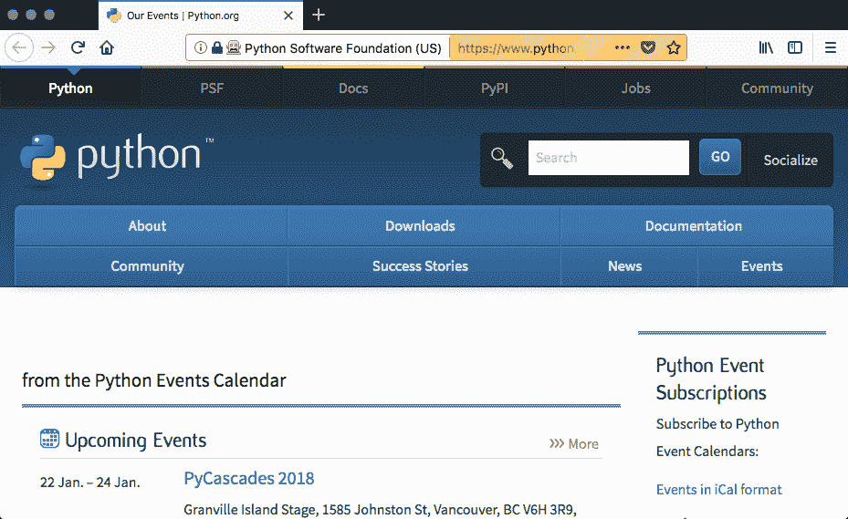

# 从刮削开始

在本章中，我们将介绍以下主题：

*   设置 Python 开发环境
*   在 Python.org 上添加请求和靓汤
*   在 Python.org 上添加 urllib3 和靓汤
*   用 Scrapy 删除 Python.org
*   使用 Selenium 和 PhantomJs 删除 Python.org

# 介绍

web 上可用的数据量在数量和形式上都在不断增长。企业需要这些数据来做出决策，特别是随着机器学习工具的爆炸式增长，这些工具需要大量数据用于培训。这些数据中的大部分可通过应用程序编程接口获得，但与此同时，许多有价值的数据仍然只能通过网页抓取过程获得。

本章将重点介绍设置刮取环境的几个基本原理，以及使用一些行业工具执行数据的基本请求。Python 是本书的首选编程语言，它是一种易于使用的编程语言，拥有用于许多任务的非常丰富的工具生态系统。如果你用其他语言编程，你会发现它很容易学习，你可能再也不会回去了！

# 设置 Python 开发环境

如果您以前没有使用过 Python，那么拥有一个工作的开发环境是很重要的。本书中的方法都是 Python，是交互式示例的混合，但主要是作为脚本实现的，由 Python 解释器进行解释。本方法将向您展示如何使用`virtualenv`设置一个独立的开发环境，以及如何使用`pip`管理项目依赖关系。我们还获取了该书的代码，并将其安装到 Python 虚拟环境中。

# 准备

我们将专门使用 Python3.x，特别是在我的案例 3.6.1 中。而 Mac 和 Linux 通常安装 Python2 版，Windows 系统则不安装。因此，在任何情况下都可能需要安装 Python 3。您可以在 www.Python.org 上找到 Python 安装程序的参考资料。

您可以使用`python --version` 检查 Python 的版本


`pip` comes installed with Python 3.x, so we will omit instructions on its installation.  Additionally, all command line examples in this book are run on a Mac.  For Linux users the commands should be identical.  On Windows, there are alternate commands (like dir instead of ls), but these alternatives will not be covered.

# 怎么做。。。

我们将安装大量带有`pip`的软件包。这些软件包安装在 Python 环境中。通常会与其他软件包发生版本冲突，因此，遵循本书中的方法的一个良好实践是创建一个新的虚拟 Python 环境，在这个环境中，我们将使用的包将确保正常工作。

虚拟 Python 环境使用`virtualenv`工具进行管理。可使用以下命令进行安装：

```py
~ $ pip install virtualenv
Collecting virtualenv
 Using cached virtualenv-15.1.0-py2.py3-none-any.whl
Installing collected packages: virtualenv
Successfully installed virtualenv-15.1.0
```

现在我们可以使用`virtualenv`，但在此之前，让我们简单地看一下`pip`。此命令从 PyPI 安装 Python 软件包，PyPI 是一个软件包存储库，有成千上万个软件包。我们刚刚看到使用 install 子命令安装到 pip，这确保安装了一个软件包。我们还可以通过`pip list`查看所有当前安装的软件包：

```py
~ $ pip list
alabaster (0.7.9)
amqp (1.4.9)
anaconda-client (1.6.0)
anaconda-navigator (1.5.3)
anaconda-project (0.4.1)
aniso8601 (1.3.0)
```

我已经截短到了前几行，因为有很多。对我来说，已经安装了 222 个软件包。

也可以使用`pip uninstall`和软件包名称来卸载软件包。我将让您尝试一下。

现在回到`virtualenv`。使用`virtualenv`非常简单。让我们使用它来创建一个环境并从 github 安装代码。让我们完成以下步骤：

1.  创建一个代表项目的目录并输入该目录。

```py
~ $ mkdir pywscb
~ $ cd pywscb
```

2.  初始化名为 env 的虚拟环境文件夹：

```py
pywscb $ virtualenv env
Using base prefix '/Users/michaelheydt/anaconda'
New python executable in /Users/michaelheydt/pywscb/env/bin/python
copying /Users/michaelheydt/anaconda/bin/python => /Users/michaelheydt/pywscb/env/bin/python
copying /Users/michaelheydt/anaconda/bin/../lib/libpython3.6m.dylib => /Users/michaelheydt/pywscb/env/lib/libpython3.6m.dylib
Installing setuptools, pip, wheel...done.
```

3.  这就创建了一个 Env 文件夹。让我们看看安装了什么。

```py
pywscb $ ls -la env
total 8
drwxr-xr-x 6  michaelheydt staff 204 Jan 18 15:38 .
drwxr-xr-x 3  michaelheydt staff 102 Jan 18 15:35 ..
drwxr-xr-x 16 michaelheydt staff 544 Jan 18 15:38 bin
drwxr-xr-x 3  michaelheydt staff 102 Jan 18 15:35 include
drwxr-xr-x 4  michaelheydt staff 136 Jan 18 15:38 lib
-rw-r--r-- 1  michaelheydt staff 60 Jan 18 15:38  pip-selfcheck.json
```

4.  新建我们激活虚拟环境。此命令使用`env`文件夹中的内容来配置 Python。在此之后，所有 python 活动都与此虚拟环境相关。

```py
pywscb $ source env/bin/activate
(env) pywscb $
```

5.  我们可以使用以下命令检查 python 是否确实在使用此虚拟环境：

```py
(env) pywscb $ which python
/Users/michaelheydt/pywscb/env/bin/python
```

创建了虚拟环境后，让我们克隆图书示例代码并查看其结构

```py
(env) pywscb $ git clone https://github.com/PacktBooks/PythonWebScrapingCookbook.git
 Cloning into 'PythonWebScrapingCookbook'...
 remote: Counting objects: 420, done.
 remote: Compressing objects: 100% (316/316), done.
 remote: Total 420 (delta 164), reused 344 (delta 88), pack-reused 0
 Receiving objects: 100% (420/420), 1.15 MiB | 250.00 KiB/s, done.
 Resolving deltas: 100% (164/164), done.
 Checking connectivity... done.
```

这创建了一个`PythonWebScrapingCookbook`目录

```py
(env) pywscb $ ls -l
 total 0
 drwxr-xr-x 9 michaelheydt staff 306 Jan 18 16:21 PythonWebScrapingCookbook
 drwxr-xr-x 6 michaelheydt staff 204 Jan 18 15:38 env
```

让我们换个话题，看看内容。

```py
(env) PythonWebScrapingCookbook $ ls -l
 total 0
 drwxr-xr-x 15 michaelheydt staff 510 Jan 18 16:21 py
 drwxr-xr-x 14 michaelheydt staff 476 Jan 18 16:21 www
```

有两个目录，Python 代码中最多的是`py`目录。`www`包含一些我们将不时使用本地 web 服务器使用的 web 内容。让我们看看`py`目录的内容：

```py
(env) py $ ls -l
 total 0
 drwxr-xr-x 9  michaelheydt staff 306 Jan 18 16:21 01
 drwxr-xr-x 25 michaelheydt staff 850 Jan 18 16:21 03
 drwxr-xr-x 21 michaelheydt staff 714 Jan 18 16:21 04
 drwxr-xr-x 10 michaelheydt staff 340 Jan 18 16:21 05
 drwxr-xr-x 14 michaelheydt staff 476 Jan 18 16:21 06
 drwxr-xr-x 25 michaelheydt staff 850 Jan 18 16:21 07
 drwxr-xr-x 14 michaelheydt staff 476 Jan 18 16:21 08
 drwxr-xr-x 7  michaelheydt staff 238 Jan 18 16:21 09
 drwxr-xr-x 7  michaelheydt staff 238 Jan 18 16:21 10
 drwxr-xr-x 9  michaelheydt staff 306 Jan 18 16:21 11
 drwxr-xr-x 8  michaelheydt staff 272 Jan 18 16:21 modules
```

每个章节的代码都在与章节匹配的编号文件夹中（第 2 章没有代码，因为它都是交互式 Python）。

请注意，有一个`modules`文件夹。本书中的一些配方使用这些模块中的代码。请确保您的 Python 路径指向此文件夹。在 Mac 和 Linux 上，您可以在`.bash_profile`文件（以及 Windows 上的“环境变量”对话框）中设置此文件夹：

```py
export PYTHONPATH="/users/michaelheydt/dropbox/packt/books/pywebscrcookbook/code/py/modules"
export PYTHONPATH
```

每个文件夹中的内容通常遵循与本章配方顺序相匹配的编号方案。以下是第 6 章文件夹的内容：

```py
(env) py $ ls -la 06
 total 96
 drwxr-xr-x 14 michaelheydt staff 476 Jan 18 16:21 .
 drwxr-xr-x 14 michaelheydt staff 476 Jan 18 16:26 ..
 -rw-r--r-- 1  michaelheydt staff 902 Jan 18 16:21  01_scrapy_retry.py
 -rw-r--r-- 1  michaelheydt staff 656 Jan 18 16:21  02_scrapy_redirects.py
 -rw-r--r-- 1  michaelheydt staff 1129 Jan 18 16:21 03_scrapy_pagination.py
 -rw-r--r-- 1  michaelheydt staff 488 Jan 18 16:21  04_press_and_wait.py
 -rw-r--r-- 1  michaelheydt staff 580 Jan 18 16:21  05_allowed_domains.py
 -rw-r--r-- 1  michaelheydt staff 826 Jan 18 16:21  06_scrapy_continuous.py
 -rw-r--r-- 1  michaelheydt staff 704 Jan 18 16:21  07_scrape_continuous_twitter.py
 -rw-r--r-- 1  michaelheydt staff 1409 Jan 18 16:21 08_limit_depth.py
 -rw-r--r-- 1  michaelheydt staff 526 Jan 18 16:21  09_limit_length.py
 -rw-r--r-- 1  michaelheydt staff 1537 Jan 18 16:21 10_forms_auth.py
 -rw-r--r-- 1  michaelheydt staff 597 Jan 18 16:21  11_file_cache.py
 -rw-r--r-- 1  michaelheydt staff 1279 Jan 18 16:21 12_parse_differently_based_on_rules.py
```

在食谱中，我将说明我们将使用`<chapter directory>`/`<recipe filename>`中的脚本。

Congratulations, you've now got a Python environment configured with the books code! 

现在，请完成以下步骤，如果您想退出 Python 虚拟环境，可以使用以下命令退出：

```py
(env) py $ deactivate
 py $
```

并检查我们可以看到的 python 已切换回：

```py
py $ which python
 /Users/michaelheydt/anaconda/bin/python
```

I won't be using the virtual environment for the rest of the book. When you see command prompts they will be either of the form "<directory> $" or simply "$".

现在，让我们继续做一些刮擦。

# 在 Python.org 上添加请求和靓汤

在本食谱中，我们将安装 Requests 和 Beautiful Soup，并从 www.python.org 获取一些内容。我们将安装这两个库，并对它们有一些基本的了解。我们将在后面的章节中回到这两个库，并深入研究它们。

# 准备好了。。。

在本食谱中，我们将从[中删除即将到来的 Python 事件 https://www.python.org/events/pythonevents](https://www.python.org/events/pythonevents) 。以下是`The Python.org Events Page`的一个示例（它经常变化，因此您的体验会有所不同）：



我们需要确保安装了 Requests 和 Beauty Soup。我们可以通过以下方式完成此操作：

```py
pywscb $ pip install requests
Downloading/unpacking requests
 Downloading requests-2.18.4-py2.py3-none-any.whl (88kB): 88kB downloaded
Downloading/unpacking certifi>=2017.4.17 (from requests)
 Downloading certifi-2018.1.18-py2.py3-none-any.whl (151kB): 151kB downloaded
Downloading/unpacking idna>=2.5,<2.7 (from requests)
 Downloading idna-2.6-py2.py3-none-any.whl (56kB): 56kB downloaded
Downloading/unpacking chardet>=3.0.2,<3.1.0 (from requests)
 Downloading chardet-3.0.4-py2.py3-none-any.whl (133kB): 133kB downloaded
Downloading/unpacking urllib3>=1.21.1,<1.23 (from requests)
 Downloading urllib3-1.22-py2.py3-none-any.whl (132kB): 132kB downloaded
Installing collected packages: requests, certifi, idna, chardet, urllib3
Successfully installed requests certifi idna chardet urllib3
Cleaning up...
pywscb $ pip install bs4
Downloading/unpacking bs4
 Downloading bs4-0.0.1.tar.gz
 Running setup.py (path:/Users/michaelheydt/pywscb/env/build/bs4/setup.py) egg_info for package bs4
```

# 怎么做。。。

现在，让我们去学习如何处理一些事件。对于这个配方，我们将从使用交互式 python 开始。

1.  用`ipython`命令启动：

```py
$ ipython
Python 3.6.1 |Anaconda custom (x86_64)| (default, Mar 22 2017, 19:25:17)
Type "copyright", "credits" or "license" for more information.
IPython 5.1.0 -- An enhanced Interactive Python.
? -> Introduction and overview of IPython's features.
%quickref -> Quick reference.
help -> Python's own help system.
object? -> Details about 'object', use 'object??' for extra details.
In [1]:
```

2.  接下来我们导入请求

```py
In [1]: import requests
```

3.  我们现在使用请求为以下 url 发出 GET HTTP 请求：[https://www.python.org/events/python-events/](https://www.python.org/events/python-events/) 提出`GET`请求：

```py
In [2]: url = 'https://www.python.org/events/python-events/'
In [3]: req = requests.get(url)
```

4.  下载了页面内容，但它存储在我们的请求对象 req 中。我们可以使用`.text`属性检索内容。这将打印前 200 个字符。

```py
req.text[:200]
Out[4]: '<!doctype html>\n<!--[if lt IE 7]> <html class="no-js ie6 lt-ie7 lt-ie8 lt-ie9"> <![endif]-->\n<!--[if IE 7]> <html class="no-js ie7 lt-ie8 lt-ie9"> <![endif]-->\n<!--[if IE 8]> <h'
```

我们现在有了页面的原始 HTML。我们现在可以使用 Beauty soup 解析 HTML 并检索事件数据

1.  第一进口靓汤

```py
In [5]: from bs4 import BeautifulSoup
```

2.  现在我们创建一个`BeautifulSoup`对象并将其传递给 HTML。

```py
In [6]: soup = BeautifulSoup(req.text, 'lxml')
```

3.  现在，我们告诉 Beauty Soup 找到最近事件的主`<ul>`标签，然后在下面找到所有`<li>`标签。

```py
In [7]: events = soup.find('ul', {'class': 'list-recent-events'}).findAll('li')
```

4.  最后，我们可以循环遍历每个`<li>`元素，提取事件细节，并将每个元素打印到控制台：

```py
In [13]: for event in events:
 ...: event_details = dict()
 ...: event_details['name'] = event_details['name'] = event.find('h3').find("a").text
 ...: event_details['location'] = event.find('span', {'class', 'event-location'}).text
 ...: event_details['time'] = event.find('time').text
 ...: print(event_details)
 ...:
{'name': 'PyCascades 2018', 'location': 'Granville Island Stage, 1585 Johnston St, Vancouver, BC V6H 3R9, Canada', 'time': '22 Jan. – 24 Jan. 2018'}
{'name': 'PyCon Cameroon 2018', 'location': 'Limbe, Cameroon', 'time': '24 Jan. – 29 Jan. 2018'}
{'name': 'FOSDEM 2018', 'location': 'ULB Campus du Solbosch, Av. F. D. Roosevelt 50, 1050 Bruxelles, Belgium', 'time': '03 Feb. – 05 Feb. 2018'}
{'name': 'PyCon Pune 2018', 'location': 'Pune, India', 'time': '08 Feb. – 12 Feb. 2018'}
{'name': 'PyCon Colombia 2018', 'location': 'Medellin, Colombia', 'time': '09 Feb. – 12 Feb. 2018'}
{'name': 'PyTennessee 2018', 'location': 'Nashville, TN, USA', 'time': '10 Feb. – 12 Feb. 2018'}
```

`01/01_events_with_requests.py`脚本文件中提供了整个示例。以下是它的内容，它将我们刚才一步一步地做的所有事情汇总在一起：

```py
import requests
from bs4 import BeautifulSoup

def get_upcoming_events(url):
    req = requests.get(url)

    soup = BeautifulSoup(req.text, 'lxml')

    events = soup.find('ul', {'class': 'list-recent-events'}).findAll('li')

    for event in events:
        event_details = dict()
        event_details['name'] = event.find('h3').find("a").text
        event_details['location'] = event.find('span', {'class', 'event-location'}).text
        event_details['time'] = event.find('time').text
        print(event_details)

get_upcoming_events('https://www.python.org/events/python-events/')
```

您可以从终端使用以下命令运行此操作：

```py
$ python 01_events_with_requests.py
{'name': 'PyCascades 2018', 'location': 'Granville Island Stage, 1585 Johnston St, Vancouver, BC V6H 3R9, Canada', 'time': '22 Jan. – 24 Jan. 2018'}
{'name': 'PyCon Cameroon 2018', 'location': 'Limbe, Cameroon', 'time': '24 Jan. – 29 Jan. 2018'}
{'name': 'FOSDEM 2018', 'location': 'ULB Campus du Solbosch, Av. F. D. Roosevelt 50, 1050 Bruxelles, Belgium', 'time': '03 Feb. – 05 Feb. 2018'}
{'name': 'PyCon Pune 2018', 'location': 'Pune, India', 'time': '08 Feb. – 12 Feb. 2018'}
{'name': 'PyCon Colombia 2018', 'location': 'Medellin, Colombia', 'time': '09 Feb. – 12 Feb. 2018'}
{'name': 'PyTennessee 2018', 'location': 'Nashville, TN, USA', 'time': '10 Feb. – 12 Feb. 2018'}
```

# 它是如何工作的。。。

在下一章中，我们将深入探讨请求和 Beautiful Soup 的细节，但现在让我们总结一下这一过程的几个关键点。以下是关于请求的要点：

*   请求用于执行 HTTP 请求。我们使用它为事件页面的 URL 发出 GET 谓词请求。
*   Requests 对象保存请求的结果。这不仅是页面内容，还有许多其他关于结果的项目，如 HTTP 状态代码和标题。
*   请求仅用于获取页面，而不进行解析。

我们使用 BeautifulSoup 来解析 HTML，并在 HTML 中查找内容

为了了解这是如何工作的，页面内容包含以下 HTML 以启动即将到来的事件部分：



我们利用靓汤的力量：

*   查找表示该节的`<ul>`元素，该元素通过查找具有`class`属性且值为`list-recent-events`的`<ul>`找到。
*   从这个物体上，我们找到了所有的`<li>`元素

这些`<li>`标记中的每一个都代表一个不同的事件。我们通过在子 HTML 标记中找到的事件数据，对每个标记进行迭代，生成一个字典：

*   该名称是从`<h3>`标记的子项`<a>`标记中提取的
*   位置为`<span>`的文本内容，类为`event-location`
*   从<时间>标签的`datetime`属性中提取时间。

# 在 urllib3 和靓汤中抓取 Python.org

在这个配方中，我们交换了对另一个库`urllib3`的请求。这是另一个公共库，用于从 URL 检索数据，以及用于涉及 URL 的其他功能，例如解析实际 URL 的部分并处理各种编码。

# 准备好了。。。

此配方需要安装`urllib3`，所以请使用`pip`进行安装：

```py
$ pip install urllib3
Collecting urllib3
 Using cached urllib3-1.22-py2.py3-none-any.whl
Installing collected packages: urllib3
Successfully installed urllib3-1.22
```

# 怎么做。。。

配方在`01/02_events_with_urllib3.py`中实现，代码如下：

```py
import urllib3
from bs4 import BeautifulSoup

def get_upcoming_events(url):
    req = urllib3.PoolManager()
    res = req.request('GET', url)

    soup = BeautifulSoup(res.data, 'html.parser')

    events = soup.find('ul', {'class': 'list-recent-events'}).findAll('li')

    for event in events:
        event_details = dict()
        event_details['name'] = event.find('h3').find("a").text
        event_details['location'] = event.find('span', {'class', 'event-location'}).text
        event_details['time'] = event.find('time').text
        print(event_details)

get_upcoming_events('https://www.python.org/events/python-events/')
```

使用 python 解释器运行它。您将获得与前面配方相同的输出。

# 工作原理

此配方的唯一区别在于我们获取资源的方式：

```py
req = urllib3.PoolManager()
res = req.request('GET', url)
```

与`Requests`不同，`urllib3`不会自动应用头编码。在前面的示例中，代码段之所以能够工作，是因为 BS4 处理编码非常出色。但您应该记住，编码是刮取的一个重要部分。如果您决定使用自己的框架或使用其他库，请确保编码处理得当。

# 还有更多。。。

请求和 urllib3 在功能上非常相似。在进行 HTTP 请求时，通常建议使用请求。以下代码示例演示了一些高级功能：

```py
import requests

# builds on top of urllib3's connection pooling
# session reuses the same TCP connection if 
# requests are made to the same host
# see https://en.wikipedia.org/wiki/HTTP_persistent_connection for details
session = requests.Session()

# You may pass in custom cookie
r = session.get('http://httpbin.org/get', cookies={'my-cookie': 'browser'})
print(r.text)
# '{"cookies": {"my-cookie": "test cookie"}}'

# Streaming is another nifty feature
# From http://docs.python-requests.org/en/master/user/advanced/#streaming-requests
# copyright belongs to reques.org
r = requests.get('http://httpbin.org/stream/20', stream=True)

```

```py
for line in r.iter_lines():
  # filter out keep-alive new lines
  if line:
     decoded_line = line.decode('utf-8')
     print(json.loads(decoded_line))
```

# 用 Scrapy 删除 Python.org

**Scrapy**是一个非常流行的用于提取数据的开源 Python 抓取框架。它最初只是为抓取而设计的，但现在已经发展成为一个强大的 web 爬行解决方案。

在我们以前的方法中，我们使用请求和 urllib2 获取数据，使用 Beauty Soup 提取数据。Scrapy 与许多其他内置模块和扩展一起提供了所有这些功能。在使用 Python 进行刮片时，它也是我们的首选工具

Scrapy 提供了许多值得一提的强大功能：

*   内置扩展，用于发出 HTTP 请求并处理压缩、身份验证、缓存、操作用户代理和 HTTP 头
*   内置支持使用选择器语言（如 CSS 和 XPath）选择和提取数据，以及支持使用正则表达式选择内容和链接
*   编码支持处理语言和非标准编码声明
*   灵活的 API 可重用和编写自定义中间件和管道，这为实现自动下载资产（例如，图像或媒体）和将数据存储在文件系统、S3、数据库等存储器中等任务提供了一种干净、简单的方法

# 准备好了。。。

使用 Scrapy 创建 scraper 有几种方法。一种是编程模式，我们在代码中创建爬虫和爬行器。也可以从模板或生成器配置 Scrapy 项目，然后使用`scrapy`从命令行运行 scraper 这本书将遵循编程模式，因为它将代码更有效地包含在单个文件中。这将有助于我们将特定的、有针对性的食谱与 Scrapy 结合起来

这并不一定是比使用命令行执行更好的运行 Scrapy scraper 的方法，这只是本书的一个设计决策。最终，本书不是关于 Scrapy 的（还有其他关于 Scrapy 的书），而是更多地阐述了在执行 Scrapy 时可能需要做的各种事情，最终在云中创建一个功能性的 scraper 作为服务。

# 怎么做。。。

这个食谱的脚本是`01/03_events_with_scrapy.py`。代码如下：

```py
import scrapy
from scrapy.crawler import CrawlerProcess

class PythonEventsSpider(scrapy.Spider):
    name = 'pythoneventsspider'

    start_urls = ['https://www.python.org/events/python-events/',]
    found_events = []

    def parse(self, response):
        for event in response.xpath('//ul[contains(@class, "list-recent-events")]/li'):
            event_details = dict()
            event_details['name'] = event.xpath('h3[@class="event-title"]/a/text()').extract_first()
            event_details['location'] = event.xpath('p/span[@class="event-location"]/text()').extract_first()
            event_details['time'] = event.xpath('p/time/text()').extract_first()
            self.found_events.append(event_details)

if __name__ == "__main__":
    process = CrawlerProcess({ 'LOG_LEVEL': 'ERROR'})
    process.crawl(PythonEventsSpider)
    spider = next(iter(process.crawlers)).spider
    process.start()

    for event in spider.found_events: print(event)
```

下面运行脚本并显示输出：

```py
~ $ python 03_events_with_scrapy.py
{'name': 'PyCascades 2018', 'location': 'Granville Island Stage, 1585 Johnston St, Vancouver, BC V6H 3R9, Canada', 'time': '22 Jan. – 24 Jan. '}
{'name': 'PyCon Cameroon 2018', 'location': 'Limbe, Cameroon', 'time': '24 Jan. – 29 Jan. '}
{'name': 'FOSDEM 2018', 'location': 'ULB Campus du Solbosch, Av. F. D. Roosevelt 50, 1050 Bruxelles, Belgium', 'time': '03 Feb. – 05 Feb. '}
{'name': 'PyCon Pune 2018', 'location': 'Pune, India', 'time': '08 Feb. – 12 Feb. '}
{'name': 'PyCon Colombia 2018', 'location': 'Medellin, Colombia', 'time': '09 Feb. – 12 Feb. '}
{'name': 'PyTennessee 2018', 'location': 'Nashville, TN, USA', 'time': '10 Feb. – 12 Feb. '}
{'name': 'PyCon Pakistan', 'location': 'Lahore, Pakistan', 'time': '16 Dec. – 17 Dec. '}
{'name': 'PyCon Indonesia 2017', 'location': 'Surabaya, Indonesia', 'time': '09 Dec. – 10 Dec. '}
```

同样的结果，但是使用另一个工具。让我们快速回顾一下它是如何工作的。

# 工作原理

我们将在后面的章节中详细介绍 Scrapy，但让我们快速浏览一下这段代码，以了解它是如何完成这项工作的。Scrapy 中的所有内容都围绕着创建一个**蜘蛛**.爬行器根据我们提供的规则在 Internet 上的页面中爬行。此爬行器仅处理一个页面，因此它不是真正的爬行器。但它显示了我们将在稍后的示例中使用的模式。

spider 是用一个派生自 Scrapy spider 类的类定义创建的。我们的类派生自`scrapy.Spider`类。

```py
class PythonEventsSpider(scrapy.Spider):
    name = 'pythoneventsspider'

    start_urls = ['https://www.python.org/events/python-events/',]
```

每个蜘蛛都有一个`name`，还有一个或多个`start_urls`，告诉它从哪里开始爬行。

此爬行器有一个字段来存储我们找到的所有事件：

```py
    found_events = []
```

然后，spider 有一个方法名 parse，它将为 spider 收集的每个页面调用。

```py
def parse(self, response):
        for event in response.xpath('//ul[contains(@class, "list-recent-events")]/li'):
            event_details = dict()
            event_details['name'] = event.xpath('h3[@class="event-title"]/a/text()').extract_first()
            event_details['location'] = event.xpath('p/span[@class="event-location"]/text()').extract_first()
            event_details['time'] = event.xpath('p/time/text()').extract_first()
            self.found_events.append(event_details)
```

此方法的实现使用和 XPath 选择从页面获取事件（XPath 是在 Scrapy 中导航 HTML 的内置方法）。它与其他示例类似地构建`event_details`字典对象，然后将其添加到`found_events`列表中。

剩下的代码执行 Scrapy crawler 的编程执行。

```py
    process = CrawlerProcess({ 'LOG_LEVEL': 'ERROR'})
    process.crawl(PythonEventsSpider)
    spider = next(iter(process.crawlers)).spider
    process.start()
```

它首先创建一个 CrawlerProcess，它执行实际的爬网和许多其他任务。我们向它传递一个日志级别的错误，以防止大量的碎片输出。将此更改为 DEBUG，然后重新运行以查看差异。

接下来，我们告诉爬虫程序进程使用我们的爬行器实现。我们从爬虫程序中获取实际的爬行器对象，这样我们就可以在爬虫完成时获取项目。然后我们通过调用`process.start()`来启动整个过程。

当爬网完成后，我们可以迭代并打印出找到的项目。

```py
    for event in spider.found_events: print(event)
```

This example really didn't touch any of the power of Scrapy.  We will look more into some of the more advanced features later in the book.

# 使用 Selenium 和 PhantomJS 删除 Python.org

这个配方将介绍 Selenium 和 PhantomJS，这两个框架与前面配方中的框架非常不同。事实上，Selenium 和 PhantomJ 通常用于功能/验收测试。我们想展示这些工具，因为它们从刮削的角度提供了独特的好处。我们将在本书后面介绍的几个功能是填写表单、按下按钮以及等待下载并执行动态 JavaScript。

Selenium 本身是一个与编程语言无关的框架。它提供了许多编程语言绑定，如 Python、Java、C#和 PHP（以及其他）。该框架还提供了许多侧重于测试的组件。三个常用组件是：

*   用于记录和重放测试的 IDE
*   Webdriver，它通过发送命令并将结果发送到所选浏览器来启动 web 浏览器（如 Firefox、Chrome 或 Internet Explorer）
*   网格服务器使用远程服务器上的 web 浏览器执行测试。它可以并行运行多个测试用例。

# 准备

首先，我们需要安装 Selenium。我们通过可靠的`pip`来实现这一点：

```py
~ $ pip install selenium
Collecting selenium
 Downloading selenium-3.8.1-py2.py3-none-any.whl (942kB)
 100% |████████████████████████████████| 952kB 236kB/s
Installing collected packages: selenium
Successfully installed selenium-3.8.1
```

这将安装用于 Python 的 Selenium 客户端驱动程序（语言绑定）。您可以在[找到更多关于它的信息 https://github.com/SeleniumHQ/selenium/blob/master/py/docs/source/index.rst](https://github.com/SeleniumHQ/selenium/blob/master/py/docs/source/index.rst) 如果你想在将来。

对于这个配方，我们还需要在目录中有 Firefox 的驱动程序（名为`geckodriver`）。这个文件是特定于操作系统的。我已经在文件夹中包含了 Mac 的文件。要获取其他版本，请访问[https://github.com/mozilla/geckodriver/releases](https://github.com/mozilla/geckodriver/releases) 。

但是，运行此示例时，可能会出现以下错误：

```py
FileNotFoundError: [Errno 2] No such file or directory: 'geckodriver'
```

如果这样做，请将 geckodriver 文件放在系统路径上的某个位置，或者将`01`文件夹添加到您的路径中。哦，你需要安装 Firefox。

最后，需要安装 PhantomJS。您可以在[下载并找到安装说明 http://phantomjs.org/](http://phantomjs.org/)

# 怎么做。。。

这个食谱的脚本是`01/04_events_with_selenium.py`。

1.  代码如下：

```py
from selenium import webdriver

def get_upcoming_events(url):
    driver = webdriver.Firefox()
    driver.get(url)

    events = driver.find_elements_by_xpath('//ul[contains(@class, "list-recent-events")]/li')

    for event in events:
        event_details = dict()
        event_details['name'] = event.find_element_by_xpath('h3[@class="event-title"]/a').text
        event_details['location'] = event.find_element_by_xpath('p/span[@class="event-location"]').text
        event_details['time'] = event.find_element_by_xpath('p/time').text
        print(event_details)

    driver.close()

get_upcoming_events('https://www.python.org/events/python-events/')
```

2.  并使用 Python 运行脚本。您将看到熟悉的输出：

```py
~ $ python 04_events_with_selenium.py
{'name': 'PyCascades 2018', 'location': 'Granville Island Stage, 1585 Johnston St, Vancouver, BC V6H 3R9, Canada', 'time': '22 Jan. – 24 Jan.'}
{'name': 'PyCon Cameroon 2018', 'location': 'Limbe, Cameroon', 'time': '24 Jan. – 29 Jan.'}
{'name': 'FOSDEM 2018', 'location': 'ULB Campus du Solbosch, Av. F. D. Roosevelt 50, 1050 Bruxelles, Belgium', 'time': '03 Feb. – 05 Feb.'}
{'name': 'PyCon Pune 2018', 'location': 'Pune, India', 'time': '08 Feb. – 12 Feb.'}
{'name': 'PyCon Colombia 2018', 'location': 'Medellin, Colombia', 'time': '09 Feb. – 12 Feb.'}
{'name': 'PyTennessee 2018', 'location': 'Nashville, TN, USA', 'time': '10 Feb. – 12 Feb.'}
```

在此过程中，Firefox 将弹出并打开页面。我们重复使用了以前的配方并采用了 Selenium



The Window Popped up by Firefox

# 工作原理

此配方的主要区别在于以下代码：

```py
driver = webdriver.Firefox()
driver.get(url)
```

这将获取 Firefox 驱动程序，并使用它获取指定 URL 的内容。其工作原理是启动 Firefox 并将其自动转到页面，然后 Firefox 将页面内容返回到我们的应用程序。这就是 Firefox 弹出的原因。另一个区别是，要找到我们需要调用`find_element_by_xpath`来搜索结果 HTML 的内容。

# 还有更多。。。

幻影在许多方面与硒非常相似。它具有对各种 web 标准的快速和本机支持，具有 DOM 处理、CSS 选择器、JSON、画布和 SVG 等功能。它通常用于 web 测试、页面自动化、屏幕捕获和网络监控。

Selenium 和 PhantomJS 之间有一个关键区别：PhantomJS 是**无头**并使用 WebKit。正如我们所看到的，Selenium 打开并自动化浏览器。如果我们处于一个不安装浏览器的持续集成或测试环境中，这不是很好，同时，我们也不希望打开成千上万的浏览器窗口或标签。由于无头，这会使速度更快、效率更高。

PhantomJS 的示例在`01/05_events_with_phantomjs.py`文件中。只有一行更改：

```py
driver = webdriver.PhantomJS('phantomjs')
```

运行该脚本会产生与 Selenium/Firefox 示例类似的输出，但不会弹出浏览器，而且完成所需的时间更少。