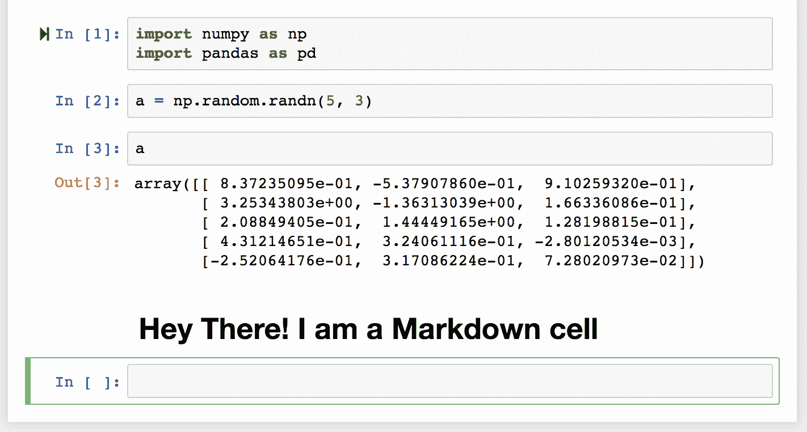

# 序言

# 关于这本书

您是否希望开始开发人工智能应用程序？你需要复习一下关键的数学概念吗？*统计与微积分与 Python 研讨会*将向您展示如何将您对高等数学的理解应用到 Python 环境中，其中包含大量引人入胜的实践练习。

本书首先从较高的层次概述了在使用 Python 执行统计时将使用的库。随着您的进步，您将使用 Python 编程语言执行各种数学任务，例如使用 Python 从基本函数开始求解代数函数，然后进行转换和求解方程。本书后面的章节将介绍统计学和微积分的概念，以及如何使用它们来解决问题并获得有用的见解。最后，您将学习微分方程，重点是数值方法，并学习直接计算函数值的算法。

在本书的结尾，您将学习如何应用基本的统计和微积分概念来开发解决业务挑战的健壮 Python 应用程序。

## 观众

如果您是一名 Python 程序员，希望开发解决具有挑战性的业务问题的智能解决方案，那么本书适合您。为了更好地掌握本书中解释的概念，您必须对高级数学概念有透彻的理解，例如马尔可夫链、欧拉公式和龙格库塔方法，因为本书仅解释了如何在 Python 中实现这些技术和概念。

## 关于章节

*第一章**Python 基础*向您介绍 Python 语言。您将学习如何使用 Python 最完整的数据结构和控制流，以及如何为调试、测试和版本控制等编程特定任务选择最佳实践。

*第 2 章**Python 的主要统计工具*介绍了 Python 中科学计算和可视化的生态系统。这些讨论将围绕促进这些任务的特定 Python 库展开，如 NumPy、pandas 和 Matplotlib。动手练习将帮助你练习它们的用法。

*第三章**Python 统计工具箱*描述了统计分析的理论基础。您将了解统计领域的基本组成部分，即各种类型的统计数据和统计变量。本章还简要概述了各种不同的 Python 库和工具，这些库和工具有助于简化专门任务，如 Symphy、PyMC3 和 Bokeh。

第 4 章第 1 章，第 2 章，函数和代数与 Python AutoT3，讨论了数学函数和代数方程的理论基础。这些讨论还伴随着交互式练习，这些练习用 Python 展示了相应的工具，这些工具可以简化和/或自动化各种过程，例如绘制函数图、求解方程和方程组。

*第 5 章**更多 Python 数学*，教你序列、数列、三角学和复数的基础知识。虽然这些可以证明是具有挑战性的理论课题，但我们将从不同的实际角度考虑它们，特别是通过实际应用，如财务分析和 401（k）/退休计算。

*第 6 章*、*矩阵和马尔可夫链与 Python*一起介绍矩阵和马尔可夫链的概念。这些是一些最流行的数学应用中常用的数学对象，如人工智能和机器学习。本章与开发单词预测器的实践活动相结合。

*第 7 章**使用 Python*进行基本统计，这标志着本书的开始部分，我们特别关注统计和统计分析。本章介绍探索性数据分析的过程，以及通常使用简单的统计技术来解释数据集的过程。

*第 8 章**基础概率概念及其应用*深入研究了复杂的统计概念，如随机性、随机变量，并将模拟作为分析随机性的技术。本章将帮助您更轻松地处理涉及随机性的统计问题。

*第 9 章*、*中间统计与 Python*一起，通过迭代该领域最重要的理论，如大数定律和中心极限定理，以及常用的技术，包括置信区间、假设检验、，线性回归。有了在本章中获得的知识，您将准备好使用 Python 解决许多实际的统计问题。

*第 10 章**Python 基础微积分*通过讨论更多涉及的概念开始微积分主题，如函数的斜率、曲线下面积、优化和旋转实体。通常被认为是数学中的复杂问题，这些概念在 Python 的帮助下以直观和实际的方式进行解释。

*第 11 章**用 Python 进行更多演算*处理演算中更复杂的主题，即弧长和表面积的计算、偏导数和级数展开。再一次，我们将能够看到 Python 在帮助我们处理这些高级主题方面的威力，这通常对许多学生来说都是相当具有挑战性的。

*第 12 章*、*中级微积分与 Python*将微积分中一些最有趣的主题作为本书的结尾，如微分方程、Euler 方法和 Runge-Kutta 方法。这些方法提供了一种求解微分方程的算法方法，尤其适用于 Python 作为计算工具。

## 公约

文本中的码字、数据库表名、文件夹名、文件名、文件扩展名、路径名、虚拟 URL、用户输入和 Twitter 句柄如下所示：

“为此，我们可以使用`with`关键字和`open()`函数与文本文件交互。”

代码块设置如下：

```py
if x % 6 == 0:
    print('x is divisible by 6')
```

在某些情况下，一行代码后面紧跟着它的输出。这些案例如下：

```py
>>> find_sum([1, 2, 3]) 
6 
```

在本例中，执行的代码是以`>>>`开头的行，输出是第二行（`6`。

在其他情况下，输出与代码块分开显示，以便于阅读。

您在屏幕上看到的文字（例如，在菜单或对话框中）也会出现在文本中，如下所示：“当您单击`Fetch Images`按钮时，图像会显示作者姓名。”

新术语和重要词语如下所示：“将返回的列表以相同的**逗号分隔值**（**CSV**格式）换行写入同一输入文件”。

## 代码呈现

跨越多行的代码行使用反斜杠（`\`）拆分。执行代码时，Python 将忽略反斜杠，并将下一行的代码视为当前行的直接延续。

例如：

```py
history = model.fit(X, y, epochs=100, batch_size=5, verbose=1, \
                   validation_split=0.2, shuffle=False)
```

注释被添加到代码中，以帮助解释特定的逻辑位。单行注释使用`#`符号表示，如下所示：

```py
# Print the sizes of the dataset
print("Number of Examples in the Dataset = ", X.shape[0])
print("Number of Features for each example = ", X.shape[1])
```

多行注释用三个引号括起来，如下所示：

```py
"""
Define a seed for the random number generator to ensure the 
result will be reproducible
"""
seed = 1
np.random.seed(seed)
random.set_seed(seed)
```

## 设置您的环境

在详细阅读本书之前，我们需要设置特定的软件和工具。在下一节中，我们将看到如何做到这一点。

## 软件需求

您还需要提前安装以下软件：

*   操作系统：Windows 7 SP1 64 位、Windows 8.1 64 位或 Windows 10 64 位、macOS 或 Linux
*   浏览器：最新版本的 Google Chrome、Firefox 或 Microsoft Edge
*   Python 3.7
*   Jupyter 笔记本

## 安装和设置

在开始本书之前，您需要安装 Python（3.7 或更高版本）和 Jupyter，这是我们将在本章中使用的主要工具。

## 安装 Python

安装 Python 的最佳方法是通过 environment manager Anaconda，可从[下载 https://docs.anaconda.com/anaconda/install/](https://docs.anaconda.com/anaconda/install/) 。成功安装 Anaconda 后，您可以按照[上的说明进行操作 https://docs.conda.io/projects/conda/en/latest/user-guide/tasks/manage-environments.html](https://docs.conda.io/projects/conda/en/latest/user-guide/tasks/manage-environments.html) 为本项目创建一个可以运行 Python 的虚拟环境。

与其他安装 Python 的方法不同，Anaconda 提供了一个易于导航的界面，在安装 Python 及其库时，该界面还负责大多数低级进程。

按照上面的说明，您可以使用命令`conda create -n workshop python=3.7`创建一个名为`workshop`的新环境。要激活新环境，请运行`conda activate workshop`。在接下来的步骤中，每次需要测试代码时都需要激活此环境。

在此车间中，每次使用尚未安装的新库时，都可以使用`pip install [library_name]`或`conda install [library_name]`命令安装该库。

## Jupyter 项目

Jupyter 项目是一个开源的免费软件，它使您能够从一个特殊的笔记本上以交互方式运行用 Python 和其他一些语言编写的代码，类似于浏览器界面。它诞生于 2014 年，源于**IPython**项目，此后成为整个数据科学工作者的默认选择。

要在`workshop`环境中安装 Jupyter 笔记本，只需运行`conda install -c conda-forge notebook`。有关 Jupyter 安装的更多信息，请点击此处：[https://jupyter.org/install](https://jupyter.org/install) 。

在[https://jupyterlab.readthedocs.io/en/stable/getting_started/starting.html](https://jupyterlab.readthedocs.io/en/stable/getting_started/starting.html) ，您将找到如何启动 Jupyter 笔记本服务器所需的所有详细信息。在本书中，我们使用经典的笔记本电脑界面。

通常，我们使用`jupyter notebook`命令从 Anaconda 提示符启动笔记本。

在下面的*安装代码包*部分中，从您选择下载代码文件的目录启动笔记本。

例如，如果您已将文件安装在 macOS 目录`/Users/YourUserName/Documents/``The-Statistics-and-Calculus-with-Python-Workshop`中，则可以在 CLI 中键入`cd /Users/YourUserName/Documents/The-Statistics-and-Calculus-with-Python-Workshop`并运行`jupyter notebook`命令。Jupyter 服务器将启动，您将看到 Jupyter 浏览器控制台：


图 0.1:Jupyter 浏览器控制台

运行 Jupyter 服务器后，单击`New`并选择`Python 3`。将打开一个新的浏览器选项卡，其中有一个新的空笔记本。重命名 Jupyter 文件：


图 0.2:Jupyter 服务器界面

Jupyter 笔记本电脑的主要组成部分是电池。有两种类型的单元格：`In`（输入的缩写）和`Out`（输出的缩写）。您可以在`In`单元格中写入代码、普通文本和标记，按*Shift*+*Enter*（或*Shift*+*Return*），在该特定`In`单元格中写入的代码将被执行。结果将显示在一个`Out`单元格中，您将进入一个新的`In`单元格，为下一个代码块做好准备。一旦你习惯了这个界面，你会慢慢发现它提供的强大和灵活性。

默认情况下，启动新单元格时，假定您将在其中编写代码。但是，如果要编写文本，则必须更改类型。您可以使用以下按键顺序执行此操作：*Esc**M**输入*。这会将所选单元格转换为**标记**（**M**单元格类型：



图 0.3:Jupyter 笔记本

当你写完一些文本后，使用*Shift*+*Enter*执行它。与代码单元格的情况不同，编译标记的结果将显示在与`In`单元格相同的位置。

要获取 Jupyter 中所有快捷键的*备忘表*，请转到[https://packt.live/33sJuB6](https://packt.live/33sJuB6) 。有了这个基本的介绍，我们准备开始一个激动人心和启发性的旅程。

## 安装库

`pip`预装有蟒蛇。在您的计算机上安装 Anaconda 后，可以使用`pip`安装所有必需的库，例如`pip install numpy`。或者，您可以使用`pip install –r requirements.txt`安装所有必需的库。您可以在[找到`requirements.txt`文件 https://packt.live/3gv0zhb](https://packt.live/3gv0zhb) 。

练习和活动将在 Jupyter 笔记本中执行。Jupyter 是一个 Python 库，可以用与其他 Python 库相同的方式安装，即使用`pip install jupyter`，但幸运的是，它是与 Anaconda 一起预装的。要打开笔记本，只需在终端或命令提示符中运行命令`jupyter notebook`。

## 访问代码文件

您可以在[找到本书的完整代码文件 https://packt.live/3kcWZe6](https://packt.live/3kcWZe6) 。您还可以使用位于[的交互式实验室环境，直接在 web 浏览器中运行许多活动和练习 https://packt.live/2PpqDOX](https://packt.live/2PpqDOX) 。

我们已尝试支持所有活动和练习的交互式版本，但对于无法提供此支持的实例，我们建议也在本地安装。

如果您对安装有任何问题，请发送电子邮件至`workshops@packt.com`。