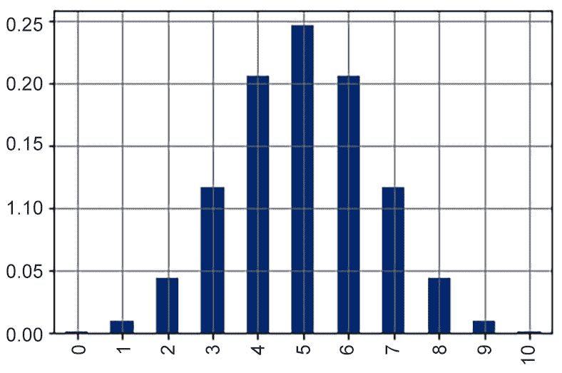
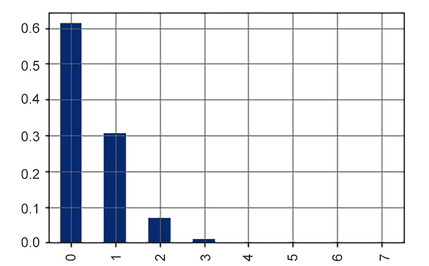
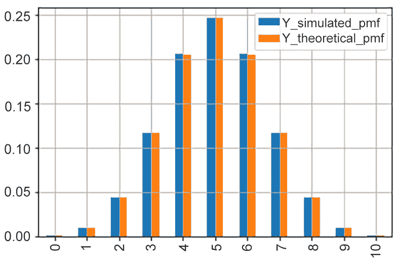
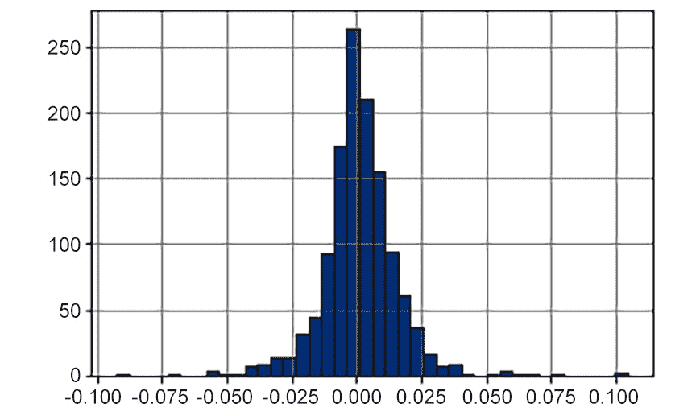

# 8。基本概率概念及其应用

概述

本章结束时，您将熟悉概率论中的基本概念。您将学习如何使用 NumPy 和 SciPy 模块执行模拟，并通过使用模拟计算概率来解决问题。本章还介绍了如何使用模拟和理论概率分布计算事件的概率。除此之外，我们还将在概念上定义和使用 scipy.stats 模块中包含的随机变量。我们还将了解正态分布的主要特征，并通过计算概率分布曲线下的面积来计算概率。

# 导言

在上一章中，我们学习了如何执行任何统计分析的第一步。给定一个商业或科学问题以及一个相关的数据集，我们学习了如何加载数据集并为分析做好准备。然后，我们学习了如何计算和使用描述性统计来理解变量。最后，我们进行 EDA 以补充我们从描述性统计中收集的信息，并更好地理解变量及其可能的关系。在对分析问题有了基本了解之后，您可能需要更进一步，使用更复杂的定量工具，其中一些工具用于以下领域：

*   推断统计
*   机器学习
*   规定性分析
*   优化

所有这些领域有什么共同点？很多事情：例如，他们具有数学性质，他们大量使用计算工具，并且在某种程度上，他们使用概率 T0 概率理论 T1，这是应用数学中最有用的分支之一，并且为其他学科提供基础和工具，例如前面提到的那些。

在这一章中，我们将对概率论做一个非常简单的介绍。与传统的统计书籍不同，在本章中，我们将大量使用模拟将理论概念付诸实践，并使其更加具体。为此，我们将广泛使用 NumPy 和 SciPy 的随机数生成功能，并将学习如何使用模拟来解决问题。在介绍了必需的基本概念之后，我们将向您展示如何使用 NumPy 生成随机数，并使用这些功能计算概率。完成后，我们将定义随机变量的概念。

在本章后面，我们将深入研究两种类型的随机变量：离散和连续，对于每种类型，我们将学习如何使用 SciPy 创建随机变量，以及如何使用这些分布计算精确概率。

# 随机性、概率和随机变量

这是一个密集的部分，有许多理论概念需要学习。虽然内容很繁重，但在结束本节时，您将很好地掌握概率论中一些最基本和基本的概念。我们还将介绍非常有用的方法，您可以使用 NumPy 执行模拟，以便您可以使用一些代码。通过使用模拟，我们希望向您展示如何将理论概念转化为实际数字，以及使用这些工具可以解决的问题。最后，我们将定义**随机变量**和**概率分布**，这是在现实世界中使用统计学解决问题时需要了解的两个最重要的概念。

## 随机性与概率性

我们对随机性的概念都有一个直观的概念，并在日常生活中使用这个术语。随机性意味着某些事件的发生不可预测或没有规律。

关于随机事件的一个自相矛盾的事实是，尽管根据定义，单个随机事件是不可预测的，但在考虑许多此类事件时，有可能以非常高的置信度预测某些结果。例如，当掷硬币*一次*时，我们无法知道我们将看到两种可能结果中的哪一种（正面或反面）。另一方面，当掷硬币*1000*次时，我们几乎可以肯定我们将得到 450 到 550 个人头。

我们如何从单个不可预测的事件转变为能够预测这些事件集合中有意义的事情？关键是概率论，这是数学的一个分支，它将随机性的研究和某些结果的可能性的计算形式化。概率可以理解为不确定性的一种度量，概率论为我们提供了理解和分析不确定性事件的数学工具。这就是概率论作为决策工具如此有用的原因：通过严格和逻辑地分析不确定事件，我们可以做出更好的决策，尽管存在不确定性。

不确定性既可能来自无知，也可能来自纯粹的随机性。如果你知道硬币的质量、手指的准确位置、投掷硬币时施加的准确力、准确的引力等等，那么抛硬币就不是一个真正的随机过程。有了这些信息，原则上你可以预测结果，但在实践中，我们不知道所有这些变量或方程，实际上无法做出准确的预测。另一个例子可能是足球比赛的结果，总统选举的结果，或者一周后是否会下雨。

考虑到我们对未来会发生什么一无所知，分配一个概率是我们可以做的，从而得出一个*最佳猜测*。

概率论也是一门大生意。整个行业，如彩票、赌博和保险业，都是围绕概率定律以及如何将我们可以从中做出的预测货币化而建立起来的。赌场不知道玩轮盘赌的人是否会在下一场游戏中获胜，但由于概率定律，赌场老板完全确定轮盘赌是一种有利可图的游戏。保险公司不知道客户明天是否会发生车祸，但他们确信有足够的汽车保险客户支付保费是一项有利可图的业务。

虽然下面的部分会让人觉得有点理论性，但在我们使用它们解决分析问题之前，有必要了解最重要的概念。

## 基本概率概念

我们将从基本术语开始，您将在本主题的大多数处理中找到这些术语。我们必须学习这些概念，以便能够严格地解决问题，并以技术上正确的方式传达我们的结果。

我们将从**实验**的概念开始：一种在受控条件下发生的情况，我们从中得到观察结果。我们观察到的结果称为实验的**结果**。下表列出了一些实验示例，以及一些可能的结果：


图 8.1：示例实验和结果

实验的**样本空间**由所有可能结果的*数学集合*组成。最后，**事件**是样本空间的任何子集。样本空间的每个元素称为**简单事件**，因为它由单个元素组成。我们现在有四个相互关联的术语，它们是概率论的基础：实验、样本空间、事件和结果。为了继续上表中的示例，下表列出了实验的样本空间和事件示例：


图 8.2：示例实验、样本空间和事件

笔记

请注意，上表中的详细信息假设每分钟最多发生 1 笔交易。

值得注意的是，我们将样本空间定义为数学意义上的*集*。因此，我们可以使用从集合论知道的所有数学运算，包括获取子集（即事件）。由于事件是更大集合的子集，所以它们本身就是集合，我们可以使用并集、交集等。事件的传统表示法是使用大写字母，如 A、B 和 C。

当实验结果属于某个事件时，我们说该事件已经发生。例如，在实验*掷骰子*中，如果我们对事件*获得奇数*感兴趣，并且我们观察到任何结果，即 1、3 或 5，那么我们可以说事件已经发生。

当进行随机实验时，我们不知道会得到什么结果。我们在概率论中所做的是给所有与实验相关的可能事件分配一个数字。这个数字就是我们所知道的事件的*概率*。

我们如何分配事件的概率？有两种选择。然而，不管我们用什么方法来分配事件的概率，如果我们分配事件概率的方法满足以下四个条件，概率理论及其结果都成立。给定事件*A*和*B*及其概率，表示为*P（A）*和*P（B）*：

1.  ：事件发生的概率始终是一个介于 0 和 1 之间的数字。越接近 1，事件发生的可能性越大。对于不可能发生的事件，极端值为 0；对于肯定会发生的事件，极端值为 1。
2.  ：如果 A 为空集，则概率必须为 0。例如，对于实验*抛骰子*，不存在*得到大于 10*的事件，因此这是空集，概率为 0。
3.  ：这基本上是说，当进行一个实验时，一定会有一定的结果。
4.  对于不相交的事件 A 和 B：如果我们有一组不重叠的事件 A 和 B，那么可以通过添加单个概率来获得该事件的概率（A U B），也称为*A 或 B*。这些规则也适用于两个以上的事件。

这一小节在概念和理论方面都很重，但现在理解这些内容很重要，以避免以后出现错误。幸运的是，Python 和 NumPy 具有强大的数值功能，这将帮助我们将这一理论付诸实践。

笔记

关于所有练习和相关测试脚本的简要说明：如果您使用 CLI（如 Windows 的命令提示符或 Mac 的终端）运行测试脚本，它将抛出错误，如`Implement enable_gui in a subclass`。这与笔记本中使用的一些命令有关（例如，`%matplotlib`内联）。因此，如果您想运行测试脚本，请使用 ipythonshell。本书中练习的代码最好在 Jupyter 笔记本上运行。

## NumPy 模拟简介

为了开始将所有这些理论付诸实践，让我们从加载本章中使用的库开始：

```py
import pandas as pd
import numpy as np
import matplotlib.pyplot as plt
import seaborn as sns
# line to allow the plots to be shown in the Jupyter Notebook
%matplotlib inline
```

我们将广泛使用 NumPy 的随机数生成功能。我们将使用随机模块（`np.random`，它能够生成遵循许多最重要概率分布的随机数（稍后将详细介绍概率分布）。

让我们开始模拟一个随机实验：*投掷一个普通模具*。

让我们学习如何使用 NumPy 执行此实验。有不同的方法可以做到这一点。我们将使用来自`random`模块的函数`randint`，该函数在`low`（包含）和`high`（排除）参数之间生成随机整数。由于我们希望生成 1 到 6 之间的数字，因此我们的函数如下所示：

```py
def toss_die():
    outcome = np.random.randint(1, 7)
    return outcome
```

让我们连续十次使用我们的函数来观察它是如何工作的：

```py
for x in range(10):
    print(toss_die())
```

以下是一个示例输出：

```py
6, 2, 6, 5, 1, 3, 3, 6, 6, 5 
```

由于这些数字是随机生成的，您很可能会得到不同的值。

对于此函数以及几乎所有其他生成随机数（或其他随机结果）的函数，有时需要生成随机数，以便任何人在任何时候运行代码都能获得相同的结果。为此，我们需要使用`seed`。

让我们添加一行来创建种子，然后连续十次使用我们的函数来观察它是如何工作的：

```py
np.random.seed(123)
for x in range(10):
    print(toss_die(), end=', ')
```

结果如下：

```py
6, 3, 5, 3, 2, 4, 3, 4, 2, 2
```

只要在 seed 函数中运行包含数字 123 的第一行，任何运行此代码（使用相同的 NumPy 版本）的人都将获得相同的输出数字。

`numpy.random`模块的另一个有用功能是`np.random.choice`，它可以从向量中采样元素。假设我们班有 30 名学生，我们想随机选择其中的四名。首先，我们生成虚构的学生列表：

```py
students = ['student_' + str(i) for i in range(1,31)]
```

现在，可以使用`np.random.choice`随机选择其中四个：

```py
sample_students = np.random.choice(a=students, size=4,\
                                   replace=False)
sample_students
```

以下是输出：

```py
array(['student_16', 'student_11', 'student_19', \
       'student_26'], dtype='<U10')
```

`replace=False`参数确保一旦选择了一个元素，就不能再选择它。这称为不替换的**采样**。

相比之下，**替换取样**意味着在生成每个样本时考虑了向量的所有元素。假设向量的所有元素都在一个袋子里。我们为每个样品随机挑选一种元素，然后在抽取下一个样品之前将我们得到的元素放入袋子中。这一点的应用可以如下：假设我们每周给小组中的一名学生进行一次突击测验，持续 12 周。所有的学生都是可以参加测验的科目，即使该学生是在前一周被选中的。为此，我们可以使用`replace=True`，如下所示：

```py
sample_students2 = np.random.choice(a=students, \
                                    size=12, replace=True)
for i, s in enumerate(sample_students2):
    print(f'Week {i+1}: {s}')
```

结果如下：

```py
Week 1: student_6
Week 2: student_23
Week 3: student_4
Week 4: student_26
Week 5: student_5
Week 6: student_30
Week 7: student_23
Week 8: student_30
Week 9: student_11
Week 10: student_6
Week 11: student_13
Week 12: student_5
```

如你所见，可怜的学生 6 在第 1 周和第 10 周被选中，学生 30 在第 6 周和第 8 周被选中。

现在我们知道了如何使用 NumPy 生成骰子结果并获取样本（有无替换），我们可以使用它来练习概率。

## 练习 8.01：有无更换的取样

在本练习中，我们将使用`random.choice`生成随机样本，包括替换样本和不替换样本。按照以下步骤完成此练习：

1.  导入 NumPy 库：

    ```py
    import numpy as np
    ```

2.  创建两个列表，其中包含标准卡集中的四种不同套装和 13 种不同等级：

    ```py
    suits = ['hearts', 'diamonds', 'spades', 'clubs']
    ranks = ['Ace', '2', '3', '4', '5', '6', '7', '8', \
             '9', '10', 'Jack', 'Queen', 'King']
    ```

3.  创建一个名为`cards`的列表，其中包含标准牌组的 52 张牌：

    ```py
    cards = [rank + '-' + suit for rank in ranks for suit in suits]
    ```

4.  Use the `np.random.choice` function to draw a hand (five cards) from the deck. Use `replace=False` so that each card gets selected only once:

    ```py
    print(np.random.choice(cards, size=5, replace=False)) 
    ```

    结果应该是这样的（您可能会得到不同的卡片）：

    ```py
    ['Ace-clubs' '5-clubs' '7-clubs' '9-clubs' '6-clubs']
    ```

5.  Now, create a function named `deal_hands` that returns two lists, each with five cards drawn from the same deck. Use `replace=False` in the `np.random.choice` function. This function will perform sampling *without* replacement:

    ```py
    def deal_hands():
        drawn_cards = np.random.choice(cards, size=10, \
                                       replace=False)
        hand_1 = drawn_cards[:5].tolist()
        hand_2 = drawn_cards[5:].tolist()
        return hand_1, hand_2
    ```

    要打印输出，请按如下方式运行函数：

    ```py
    deal_hands()
    ```

    你应该得到这样的东西：

    ```py
    (['9-spades', 'Ace-clubs', 'Queen-diamonds', '2-diamonds', 
      '9-diamonds'],
     ['Jack-hearts', '8-clubs', '10-clubs', '4-spades', 
      'Queen-hearts'])
    ```

6.  创建第二个名为`deal_hands2`的函数，该函数与上一个函数相同，但在`np.random.choice`函数中有`replace=True`参数。此功能将执行采样*，并将*替换为

    ```py
    def deal_hands2():
        drawn_cards = np.random.choice(cards, size=10, \
                                       replace=True)
        hand_1 = drawn_cards[:5].tolist()
        hand_2 = drawn_cards[5:].tolist()
        return hand_1, hand_2
    ```

7.  Finally, run the following code:

    ```py
    np.random.seed(2)
    deal_hands2()
    ```

    结果如下：

    ```py
    (['Jack-hearts', '4-clubs', 'Queen-diamonds', '3-hearts', 
      '6-spades'],
     ['Jack-clubs', '5-spades', '3-clubs', 'Jack-hearts', '2-clubs'])
    ```

如您所见，通过允许采样*和替换*，双手抽取`Jack-hearts`卡，这意味着在对每张卡进行采样时，所有 52 张卡都被考虑在内。

在本练习中，我们练习了带替换和不带替换的采样概念，并学习了如何使用`np.random.choice`函数应用它。

笔记

要访问此特定部分的源代码，请参考[https://packt.live/2Zs7RuY](https://packt.live/2Zs7RuY) 。

您也可以在[在线运行此示例 https://packt.live/2Bm7A4Y](https://packt.live/2Bm7A4Y) 。

## 作为相对频率的概率

让我们回到概念部分的问题：我们如何分配事件的概率？在*相对频率*方法下，我们做的是大量重复实验，然后将事件发生的概率定义为*相对频率*，即我们观察事件发生的次数除以我们进行实验的次数：


图 8.3：计算概率的公式

让我们用一个实际的例子来研究这个概念。首先，我们将进行掷骰子 100 万次的实验：

```py
np.random.seed(81)
one_million_tosses = np.random.randint(low=1, \
                                       high=7, size=int(1e6))
```

我们可以从数组中获得前 10 个值：

```py
one_million_tosses[:10]
```

这个看起来像这样：

```py
array([4, 2, 1, 4, 4, 4, 2, 2, 6, 3])
```

记住，这个实验的样本空间是 S={1,2,3,4,5,6}。让我们定义一些事件，并使用相对频率方法为它们分配概率。首先，让我们使用两个简单事件：

*   `A`：观察数字 2
*   `B`：观察数字 6

我们可以使用 NumPy 的矢量化功能，通过对执行比较操作得到的布尔向量求和来计算发生的*简单事件*的数量：

```py
N_A_occurs = (one_million_tosses == 2).sum()
Prob_A = N_A_occurs/one_million_tosses.shape[0]
print(f'P(A)={Prob_A}')
```

结果如下：

```py
P(A)=0.16595
```

按照完全相同的程序，我们可以计算事件`B`的概率：

```py
N_B_occurs = (one_million_tosses == 6).sum()
Prob_B = N_B_occurs/one_million_tosses.shape[0]
print(f'P(B)={Prob_B}')
```

结果如下：

```py
P(B)=0.166809
```

现在，我们将尝试几个复合事件（它们有多个可能的结果）：

*   `C`：观察奇数（或{1,3,5}）
*   `D`：观察小于 5 的数字（或{1,2,3,4}）

因为如果我们得到 1*或*3*或*5，观察奇数的事件*就会发生，我们可以将我们在口语中使用的*或*转换为数学`OR`操作符。在 Python 中，这是`|`操作符：*

```py
N_odd_number = (
    (one_million_tosses == 1) | 
    (one_million_tosses == 3) | 
    (one_million_tosses == 5)).sum()
Prob_C = N_odd_number/one_million_tosses.shape[0]
print(f'P(C)={Prob_C}')
```

结果如下：

```py
P(C)=0.501162
```

最后，我们来计算`D`的概率：

```py
N_D_occurs = (one_million_tosses < 5).sum()
Prob_D = N_D_occurs/one_million_tosses.shape[0]
print(f'P(D)={Prob_D}')
```

我们得到以下值：

```py
P(D)=0.666004
```

在此，我们使用相对频率法来计算以下事件的概率：

*   `A`：观察数字 2:0.16595
*   `B`：观察数字 6:0.166809
*   `C`：观察奇数：0.501162
*   `D`：观察一个小于 5 的数字：0.666004

总之，在相对频率法下，当我们有一组重复实验的结果时，我们计算事件发生概率的方法是计算事件发生的次数，并将该次数除以实验总数。就这么简单。

在其他情况下，概率的分配可能基于定义。这就是我们所说的**理论概率**。例如，一枚*公平的*硬币*根据定义*，显示两种结果中任何一种的概率相等，比如正面或反面。因为这个实验只有两个结果{正面，反面}，概率加起来必须是 1，每个简单事件发生的概率必须是 0.5。

另一个例子如下：*公平*骰子是六个数字发生概率相同的骰子，因此投掷任何数字的概率必须等于*1/6=0.1666666*。事实上，`numpy.randint`函数的默认行为是模拟选择的整数，每个整数的出现概率相同。

使用理论定义，并且知道我们已经用 NumPy 模拟了一个*公平*死亡，我们可以得出我们前面介绍的事件的概率：

*   `A`：观察数字 2，P（A）=1/6=0.1666666
*   `B`：观察数字 6，P（B）=1/6=0.1666666
*   `C`：观察奇数：P（观察 1*或*观察 3*或*观察 5）=P（观察 1）+或 P（观察 3）+P（观察 5）=1/6+1/6+1/6=3/6=0.5
*   `D`：观察一个小于 5 的数字：P（观察 1*或*观察 2*或*观察 3*或*观察 4）=P（观察 1）+或 P（观察 2）+P（观察 3）+P（观察 4）=1/6+1/6+1/6+1/6=4/6=0.666666

注意这里的两件事：

*   这些数字与我们使用相对频率法得到的结果惊人地接近（或者，如果你已经知道这一点的话，也不足为奇）。
*   我们可以分解`C`和`D`之和，因为*基本概率概念*部分的规则 4。

## 定义随机变量

通常，您会发现其值是（或似乎是）随机过程的结果的数量。以下是一些例子：

*   两个骰子的结果之和
*   投掷十枚硬币时的人头数
*   一周后 IBM 的股票价格
*   网站的访问者数量
*   一个人一天摄入的卡路里的数量

所有这些都是可以变化的量的例子，这意味着它们是*变量*。此外，由于它们的取值部分或全部取决于随机性，我们称之为*随机变量*：其值由随机过程确定的量。随机变量的典型符号是字母表末尾的大写字母，如*X*、*Y*和*Z*。相应的小写字母用于表示它们采用的值。例如，如果*X*是*两个骰子*的结果之和，下面是一些如何读取符号的示例：

*   *P（X=10）**X*取 10 的概率
*   *P（X>5】*：*X*取值大于 5 的概率
*   *P（X=X）*：*X*取*X*值的概率（我们在做一般性陈述时）

由于*X*是两个骰子中两个数字的总和，*X*可以取以下值：{2,3,4,5,6,7,8,9,10,11,12}。利用我们在上一节学到的知识，我们可以模拟随机变量*X*的大量值，如下所示：

```py
np.random.seed(55)
number_of_tosses = int(1e5)
die_1 = np.random.randint(1,7, size=number_of_tosses)
die_2 = np.random.randint(1,7, size=number_of_tosses)
X = die_1 + die_2
```

我们模拟了两个骰子的 100000 次掷骰，得到了*X*的相应值。以下是向量的第一个值：

```py
print(die_1[:10])
print(die_2[:10])
print(X[:10])
```

结果如下：

```py
[6 3 1 6 6 6 6 6 4 2]
[1 2 3 5 1 3 3 6 3 1]
[7  5  4 11  7  9  9 12  7  3]
```

因此，在第一个模拟辊中，我们在第一个模具上得到了`6`，在第二个模具上得到了`1`，因此*X*的第一个值是`7`。

就像实验一样，我们可以定义随机变量上的事件，并计算这些事件各自的概率。例如，我们可以使用相对频率定义来计算以下事件的概率：

*   *X=10**X*取 10 的概率
*   *X>5**X*取值大于 5 的概率

获得这些事件概率的计算与我们之前的计算基本相同：

```py
Prob_X_is_10 = (X == 10).sum()/X.shape[0]
print(f'P(X = 10) = {Prob_X_is_10}')
```

结果如下：

```py
P(X = 10) = 0.08329
```

对于第二个事件，我们有以下内容：

```py
Prob_X_is_gt_5 = (X > 5).sum()/X.shape[0]
print(f'P(X > 5) = {Prob_X_is_gt_5}')
```

结果如下：

```py
P(X > 5) = 0.72197
```

我们可以使用条形图来可视化每个可能值在模拟中出现的次数。这将使我们能够更好地了解随机变量：

```py
X = pd.Series(X)
# counts the occurrences of each value
freq_of_X_values = X.value_counts()
freq_of_X_values.sort_index().plot(kind='bar')
plt.grid();
```

生成的绘图如下所示：


图 8.4:X 值的频率

我们可以看到，在*X*的 10 万次中，值 3 约为 5800 次，值 6 略小于 14000 次，这也非常接近值 8 出现的次数。我们还可以观察到，最常见的结果是数字 7。

按照概率的相对频率定义，如果我们将频率除以*X*的值的个数，我们可以得到观察*X*每个值的概率：

```py
Prob_of_X_values = freq_of_X_values/X.shape[0]
Prob_of_X_values.sort_index().plot(kind='bar')
plt.grid();
```

这为我们提供了以下曲线图：


图 8.5:X 值的概率分布

这个图看起来几乎和上一个一模一样，但是在这个例子中，我们可以看到观察到所有可能的*X*值的概率。这就是我们所说的随机变量的*概率分布*（或简单的分布）：观察随机变量可以取的每个值的概率。

让我们用另一个例子来说明这两个概念，随机变量和概率分布。首先，我们将定义随机变量：

*Y：投掷 10 枚普通硬币时的人头数。*

现在，我们的任务是估计概率分布。我们知道这个随机变量可以取 11 个可能的值：{0,1,2,3,4,5,6,7,8,9,10}。对于每一个值，*Y*变量都有相应的概率取该值。直觉上，我们知道不太可能观察到变量的极值：获得 10 个头部（*Y=10*）或 10 个尾部（*Y=0*）是非常不可能的。我们还希望*Y*变量在大多数情况下采用 4、5 和 6 等值。我们可以计算概率分布来验证我们的直觉。

再一次，让我们模拟投掷 10 枚硬币的实验。从那里，我们可以观察这个随机变量的值。让我们先模拟 100 万次投掷 10 枚普通硬币：

```py
np.random.seed(97)
ten_coins_a_million_times = np.random.randint(0, 2, \
                                              size=int(10e6))\
                                              .reshape(-1,10) 
```

前面的代码将生成一个 1000000 x 10 的矩阵，每行表示投掷 10 枚硬币的实验。我们可以把“0”当作“尾巴”，把“1”看成“头”。这里，我们有前 12 行：

```py
ten_coins_a_million_times[:12, :]
```

结果如下：

```py
array([[0, 1, 1, 1, 1, 1, 0, 1, 1, 0],
       [0, 0, 1, 1, 1, 0, 1, 0, 0, 0],
       [0, 1, 0, 1, 1, 0, 0, 0, 0, 1],
       [1, 0, 1, 1, 0, 1, 0, 0, 1, 1],
       [1, 0, 1, 0, 1, 0, 1, 0, 0, 0],
       [0, 1, 1, 1, 0, 1, 1, 1, 1, 0],
       [1, 1, 1, 1, 0, 1, 0, 1, 0, 1],
       [0, 1, 0, 0, 1, 1, 1, 0, 0, 0],
       [1, 0, 0, 1, 1, 1, 0, 0, 0, 0],
       [0, 1, 0, 1, 0, 1, 0, 1, 0, 1],
       [1, 0, 1, 1, 1, 0, 0, 0, 1, 0],
       [0, 0, 0, 0, 1, 1, 1, 0, 1, 1]])
```

要产生*Y*的不同值，我们需要添加每一行，如下所示：

```py
Y = ten_coins_a_million_times.sum(axis=1)
```

现在，我们可以使用前面的计算对象（`Y`）来计算某些事件的概率，例如获得零水头的概率：

```py
Prob_Y_is_0 = (Y == 0).sum() / Y.shape[0]
print(f'P(Y = 0) = {Prob_Y_is_0}')
```

结果如下：

```py
P(Y = 0) = 0.000986
```

这是一个非常小的数字，符合我们的直觉：不太可能有 10 条尾巴。事实上，这在 100 万次实验中只发生了 986 次。

正如我们之前所做的，我们可以绘制*Y*的概率分布图：

```py
Y = pd.Series(Y)
# counts the occurrences of each value
freq_of_Y_values = Y.value_counts()
Prob_of_Y_values = freq_of_Y_values/Y.shape[0]
Prob_of_Y_values.sort_index().plot(kind='bar')
plt.grid();
```

这是输出：



图 8.6:Y 的概率分布

获得 5 个人头的概率约为 0.25，因此大约 25%的时间，我们可以预期获得 5 个人头。获得4 或 6 个头的机会也相对较高。获得 4 个、5 个或 6 个人头的概率是多少？我们可以使用`Prob_of_Y_values`简单地计算得到 4、5 或 6 个头的概率：

```py
print(Prob_of_Y_values.loc[[4,5,6]])
print(f'P(4<=Y<=6) = {Prob_of_Y_values.loc[[4,5,6]].sum()}')
```

结果如下：

```py
4    0.205283
5    0.246114
6    0.205761
dtype: float64
P(4<=Y<=6) = 0.657158
```

所以，大约有 2/3（~66%）的时间，我们会在投掷 10 枚普通硬币时观察到 4、5 或 6 个头。回到概率作为不确定性度量的定义，我们可以说，我们有 66%的信心，在投掷 10 枚普通硬币时，我们会看到 4 到 6 个人头。

## 练习 8.02：计算轮盘赌的平均赢款

在本练习中，我们将学习如何使用`np.random.choice`模拟真实世界的随机过程。然后，我们将进行此模拟，并计算如果我们玩了大量游戏，平均会获得/损失多少钱。

我们将模拟去赌场玩轮盘赌。欧洲轮盘赌由一个球随机落在 0 到 36 之间的任意整数上，落在任意整数上的几率相等。许多投注方式都是允许的，但我们将只使用一种方式（这相当于著名的红色或黑色投注方式）。规则如下:

*   在 19 到 36 的数字上下注*m*单位（您最喜欢的货币）。
*   如果轮盘赌的结果是所选的任何一个数字，那么您将赢得*m*个单位。
*   如果轮盘赌的结果是 0 到 18（含）之间的任何数字，那么您将损失*m*个单位。

为了简化这一点，假设赌注为 1 个单位。让我们开始：

1.  导入 NumPy 库：

    ```py
    import numpy as np
    ```

2.  使用`np.random.choice`函数编写一个名为`roulette`的函数，该函数模拟欧洲轮盘赌中任意数量的游戏：

    ```py
    def roulette(number_of_games=1):

        # generate the Roulette numbers
        roulette_numbers = np.arange(0, 37)

        outcome = np.random.choice(a = roulette_numbers, \
                                   size = number_of_games,\
                                   replace = True)
        return outcome
    ```

3.  编写一个名为`payoff`的函数，对前面的支付逻辑进行编码。它接收两个参数：`outcome`，一个来自轮盘赌的数字（0 到 36 的整数）；和`units`以默认值 1 下注：

    ```py
    def payoff(outcome, units=1):
        # 1\. Bet m units on the numbers from 19 to 36
        # 2\. If the outcome of the roulette is any of the 
        #    selected numbers, then you win m units
        if outcome > 18:
            pay = units
        else:
        # 3\. If the outcome of the roulette is any number 
        #    between 0 and 18 (inclusive) then you lose m units
            pay = -units
        return pay
    ```

4.  使用`np.vectorize`对函数进行向量化，这样它也可以接受轮盘赌结果向量。这将允许您传递结果向量并获得相应的回报：

    ```py
    payoff = np.vectorize(payoff)
    ```

5.  Now, simulate playing roulette 20 times (betting one unit). Use the `payoff` function to get the vector of outcomes:

    ```py
    outcomes = roulette(20)
    payoffs = payoff(outcomes)
    print(outcomes)
    print(payoffs)
    ```

    结果如下：

    ```py
    [29 36 11  6 11  6  1 24 30 13  0 35  7 34 30  7 36 32 12 10]
    [ 1  1 -1 -1 -1 -1 -1  1  1 -1 -1  1 -1  1  1 -1  1  1 -1 -1]
    ```

6.  模拟 100 万轮盘赌游戏，并使用结果获得相应的回报。将支付保存在名为`payoffs`：

    ```py
    number_of_games = int(1e6)
    outcomes = roulette(number_of_games)
    payoffs = payoff(outcomes)
    ```

    的向量中
7.  使用`np.mean`函数计算支付向量的平均值。您将获得的值应接近-0.027027:

    ```py
    np.mean(payoffs)
    ```

负数意味着，平均而言，你每下注一个单位，就会损失-0.027027。记住，你的损失就是赌场的利润。那是他们的事。

在本练习中，我们学习了如何使用 NumPy 生成随机数的功能模拟真实世界的进程。我们还模拟了大量事件以获得长期平均值。

笔记

要访问此特定部分的源代码，请参考[https://packt.live/2AoiyGp](https://packt.live/2AoiyGp) 。

您也可以在[在线运行此示例 https://packt.live/3irX6Si](https://packt.live/3irX6Si) 。

有了这些，我们学会了如何通过分配概率来量化不确定性来理解随机事件。然后，我们定义了概率论中一些最重要的概念。我们还学习了如何使用相对频率定义为事件分配概率。此外，我们还介绍了随机变量的重要概念。在计算方面，我们学习了如何使用 NumPy 模拟值和样本，以及如何使用模拟回答有关特定事件概率的问题。

根据随机变量可以采用的值的类型，我们可以有两种类型：

*   离散随机变量
*   连续随机变量

我们将在以下两个部分中提供这两方面的一些示例。

# 离散随机变量

在本节中，我们将继续学习和使用随机变量。我们将研究一种特殊类型的随机变量：**离散随机变量**。这些类型的变量出现在各种应用领域，如医学、教育、制造业等，因此了解如何使用它们非常有用。我们将学习可能是最重要的，当然也是最常见的离散分布之一：二项式分布。

## 定义离散随机变量

离散随机变量是那些只能取特定数量的值的变量（从技术上讲，是一个*可数*数量的值）。通常，它们可以接受的值是特定的整数值，尽管这不是必需的。例如，如果一个随机变量可以取一组值{1.25,3.75,9.15}，那么它也将被视为离散随机变量。我们在上一节中介绍的两个随机变量是离散随机变量的示例。

举个例子，你是一家生产汽车零部件的工厂的经理。生产零件的机器平均有 4%的时间会生产出有缺陷的零件。我们可以将这 4%解释为生产缺陷零件的概率。这些汽车零件包装在包含 12 个单元的盒子中，因此，原则上，每个盒子可以包含 0 到 12 个缺陷零件。假设我们不知道哪一件是有缺陷的（直到它被使用），也不知道什么时候会生产出有缺陷的产品。因此，我们有一个随机变量。首先，让我们正式定义它：

*Z：12 箱包装中有缺陷的汽车零件数量。*

作为工厂经理，您最大的客户之一向您提出以下问题：

*   箱子中有 12 件无缺陷（零缺陷）的百分比是多少？
*   有 3 件或 3 件以上缺陷的箱子的百分比是多少？

如果您知道变量的概率分布，您可以回答这两个问题，因此您可以问自己以下问题：

*Z 的概率分布是什么样的？*

为了回答这个问题，我们可以再次使用模拟。要模拟单个盒子，我们可以使用`np.random.choice`并通过`p`参数提供概率：

```py
np.random.seed(977)
np.random.choice(['defective', 'good'], \
                 size=12, p=(0.04, 0.96))
```

结果如下：

```py
array(['good', 'good', 'good', 'good', 'good', 'good', 'good', \
       'defective', 'good', 'good', 'good', 'good'], dtype='<U9')
```

我们可以看到这个盒子里有一个有缺陷的部分。请注意，函数中使用的概率向量必须加起来为 1：由于观察到缺陷工件的概率为 4%（0.04），因此观察到良好工件的概率为*100%–4%=96%*（0.96），这是传递给 p 参数的值。

现在我们知道了如何模拟单个盒子，为了估计随机变量的分布，让我们模拟大量盒子；一百万就够了。为了使我们的计算更简单更快，让我们使用 1 和 0 分别表示有缺陷和良好的零件。要模拟 100 万个盒子，将大小参数更改为大小为*12 x 1000000*的元组就足够了：

```py
np.random.seed(10)
n_boxes = int(1e6)
parts_per_box = 12
one_million_boxes = np.random.choice\
                    ([1, 0], \
                     size=(n_boxes, parts_per_box), \
                     p=(0.04, 0.96))
```

使用以下公式可以找到前五个方框：

```py
one_million_boxes[:5,:]
```

输出结果如下：

```py
array([[0, 1, 0, 0, 0, 0, 0, 0, 0, 0, 0, 0],
       [1, 0, 0, 0, 0, 0, 0, 0, 0, 0, 0, 0],
       [0, 0, 0, 0, 0, 0, 0, 0, 0, 0, 0, 0],
       [0, 0, 0, 0, 0, 0, 0, 0, 0, 0, 0, 0],
       [0, 0, 0, 0, 0, 0, 0, 0, 0, 0, 0, 0]])
```

输出中的每个零表示一个无缺陷工件，一个表示一个有缺陷工件。现在，我们计算每个盒子有多少个缺陷，然后我们可以计算我们观察到 0，1，2，…，12 个缺陷的次数，然后我们可以绘制 Z 的概率分布：

```py
# count defective pieces per box
defective_pieces_per_box = one_million_boxes.sum(axis=1)
# count how many times we observed 0, 1,…, 12 defective pieces
defective_pieces_per_box = pd.Series(defective_pieces_per_box)
frequencies = defective_pieces_per_box.value_counts()
# probability distribution
probs_Z = frequencies/n_boxes
```

最后，让我们设想一下：

```py
print(probs_Z.sort_index())
probs_Z.sort_index().plot(kind='bar')
plt.grid()
```

输出结果如下：

```py
0    0.612402
1    0.306383
2    0.070584
3    0.009630
4    0.000940
5    0.000056
6    0.000004
7    0.000001
```

概率分布如下所示：



图 8.7:Z 的概率分布

从这个模拟中，我们可以得出结论，大约 61%的箱子将装运零缺陷零件，大约 30%的箱子将包含一个缺陷零件。我们还可以看到，在一个盒子里观察到三个或更多有缺陷的零件是非常非常不可能的。现在，您可以回答客户提出的问题：

*   箱子中有 12 个无缺陷零件的百分比是多少？*答案：61%的包装箱将包含 12 个无缺陷零件。*
*   有 3 件或 3 件以上缺陷的箱子的百分比是多少？*答案：只有约 1%的盒子会包含 3 个或更多的缺陷零件。*

## 二项分布

结果表明，在一定条件下，我们可以求出某些离散随机变量的精确概率分布。*二项分布*是一种适用于随机变量的理论分布，满足以下三个特征：

*   **条件 1**：对于个体观察，只有*两种可能的结果*，通常表示为*成功*和*失败*。如果成功概率为*p*，则失败概率必须为*1–p*。
*   **条件 2**：实验以*固定次数*进行，通常以*n*表示。
*   **条件 3**：所有实验都是*独立的*，这意味着知道一个实验的结果不会改变下一个实验的概率。因此，成功（和失败）的概率保持不变。

如果满足这些条件，那么我们说随机变量服从二项分布，或者说随机变量是一个*二项随机变量*。我们可以使用以下公式得到二项随机变量*X*的精确概率分布：


图 8.8：计算 X 的概率分布的公式

从技术上讲，取离散随机变量（*x*的可能值并返回相应概率的*数学函数*称为**概率质量函数**。注意，一旦我们从前面的方程中知道了*n*和*p*的值，概率只取决于*x*值，因此前面的方程定义了二项随机变量的概率质量函数。

好的，这听起来和看起来都非常理论和抽象（因为它是）。然而，我们已经引入了两个遵循二项分布的随机变量。让我们验证以下条件：

*Y：投掷 10 枚普通硬币时的人头数。*

*   **条件 1**：对于每一枚硬币，只有两种可能的结果，*头*或*尾*，每种结果的固定概率为 0.5。由于我们对*头数*感兴趣，*头*可以被认为是我们的*成功*和*尾*我们的*失败*。
*   **条件 2**：硬币数量固定为 10 枚。
*   **条件 3**：每次抛硬币都是独立的：我们隐含（逻辑上）假设一枚硬币的结果不会影响任何其他硬币的结果。

因此，我们有需要在前面公式中使用的数字：

*   *p=0.5*
*   *n=10*

如果我们想要得到五个头的概率，那么我们只需要将公式中的*x=5*替换为已知的*p*和*n*：


图 8.9：替换概率分布公式中的 x、p 和 n 值

现在，让我们用 Python 进行这些理论计算。现在是时候介绍另一个 Python 模块了，我们将在本章和下一章中大量使用它。`scipy.stats`模块包含许多统计功能。其中，有许多可以用来创建随机变量，这些随机变量遵循许多最常用的概率分布。让我们使用这个模块创建一个遵循理论二项分布的随机变量。首先，我们用适当的参数实例化随机变量：

```py
import scipy.stats as stats
Y_rv = stats.binom(
    n = 10, # number of coins
    p = 0.5 # probability of heads (success)
)
```

一旦创建，我们就可以使用该对象的`pmf`方法来计算*Y*可以取的每个可能值的精确理论概率。首先，让我们创建一个包含*Y*可以接受的所有值（从 0 到 10 的整数）的向量：

```py
y_values = np.arange(0, 11)
```

现在，我们可以简单地使用`pmf`（代表**概率质量函数**的方法）来获得前面每个值的相应概率：

```py
Y_probs = Y_rv.pmf(y_values) 
```

我们可以想象得到这样的`pmf`：

```py
fig, ax = plt.subplots()
ax.bar(y_values, Y_probs)
ax.set_xticks(y_values)
ax.grid()
```

我们得到的结果如下：


图 8.10:Y 的 pmf

这看起来非常类似于我们使用模拟得到的结果。现在，让我们比较两个图。我们将创建一个数据框，以简化绘图过程：

```py
Y_rv_df = pd.DataFrame({'Y_simulated_pmf': Prob_of_Y_values,\
                        'Y_theoretical_pmf':  Y_probs},\
                        index=y_values)
Y_rv_df.plot(kind='bar')
plt.grid();
```

结果如下：



图 8.11:Y 的 pmf 与模拟结果

这两组钢筋实际上是相同的；我们从模拟中得到的概率与理论值非常接近。这显示了模拟的威力。

## 练习 8.03：检查随机变量是否服从二项分布

在本练习中，我们将练习如何验证随机变量是否遵循二项分布。我们还将使用`scipy.stats`创建一个随机变量，并绘制分布图。这将主要是一个概念性的练习。

在这里，我们将检查随机变量，AUT0T.Z：Z：12 箱包 AUT1 的缺陷汽车零件的数量，遵循二项式分布（记住，我们认为 4%的汽车零件是有缺陷的）。按照以下步骤完成此练习：

1.  按照通常的惯例导入 NumPy、Matplotlib 和`scipy.stats`：

    ```py
    import numpy as np
    import scipy.stats as stats
    import matplotlib.pyplot as plt
    %matplotlib inline
    ```

2.  Just as we did in the *Defining Discrete Random Variables* section, try to conceptually check if *Z* fulfills the three characteristics given for a binomial random variable:

    A.**条件 1**：对于每个单独的汽车零件，只有两种可能的结果，*缺陷*或*良好*。由于我们对*缺陷*零件感兴趣，因此该结果可视为*成功*，固定概率为 0.04（4%）。

    B**条件 2**：每个盒子的零件数固定为 12，因此每个盒子的实验次数固定。

    C**条件 3**：我们假设缺陷零件之间没有关系，因为机器随机产生平均 4%的缺陷零件。

3.  确定该变量分布的*p*和*n*参数，即*p=0.04*和*n=12*。
4.  Use the theoretical formula with the former parameters to get the exact theoretical probability of getting exactly one defective piece per box (using *x = 1*):

    

    图 8.12：在概率分布公式中替换 x、p 和 n 的值

5.  使用`scipy.stats`模块生成*Z*随机变量的一个实例。命名为`Z_rv`：

    ```py
    # number of parts per box
    parts_per_box = 12
    Z_rv = stats.binom\
           (n = parts_per_box,\
            p = 0.04 # probability of defective piece (success)
            )
    ```

6.  Plot the probability mass function of *Z*:

    ```py
    z_possible_values = np.arange(0, parts_per_box + 1)
    Z_probs = Z_rv.pmf(z_possible_values)
    fig, ax = plt.subplots()
    ax.bar(z_possible_values, Z_probs)
    ax.set_xticks(z_possible_values)
    ax.grid();
    ```

    结果如下所示：


图 8.13:Z 的 pmf

在本练习中，我们学习了如何检查离散随机变量具有二项式分布所需的三个条件。我们得出结论，我们分析的变量确实具有二项分布。我们还能够计算其参数，并使用它们创建一个二项式随机变量，使用`scipy.stats`并绘制分布图。

笔记

要访问此特定部分的源代码，请参考[https://packt.live/3gbTm5k](https://packt.live/3gbTm5k) 。

您也可以在[在线运行此示例 https://packt.live/2Anhx1k](https://packt.live/2Anhx1k) 。

在本节中，我们重点讨论离散随机变量。现在，我们知道它们是一种随机变量，可以接受特定数量的值。通常，这些是整数值。通常，这些类型的变量与计数有关：通过考试的学生人数、过桥的汽车数量等等。我们还学习了离散随机变量最重要的分布，即二项式分布，以及如何使用 Python 获得二项式随机变量的精确理论概率。

在下一节中，我们将重点讨论连续随机变量。

# 连续随机变量

在本节中，我们将继续使用随机变量。这里，我们将讨论连续随机变量。我们将学习连续和离散概率分布之间的关键区别。此外，我们将介绍所有分布之母：著名的**正态分布**。我们将学习如何使用`scipy.stats`处理此分布，并回顾其最重要的特性。

## 定义连续随机变量

有一些随机量，原则上可以取区间内的任何实数。一些例子如下：

*   一周后 IBM 股票的价格
*   一个人一天摄入的卡路里数量
*   英镑和欧元之间的收盘汇率
*   从特定群体中随机选择的男性的身高

由于其性质，这些变量被称为*连续*随机变量。与离散随机变量一样，有许多理论分布可用于模拟真实世界的现象。

为了介绍这种类型的随机变量，让我们看一个我们已经熟悉的示例。再次，让我们加载我们在*第 7 章*中介绍的游戏数据集，*使用 Python*进行基本统计：

```py
games = pd.read_csv('./data/appstore_games.csv')
original_colums_dict = {x: x.lower().replace(' ','_') \
                        for x in games.columns}
# renaming columns
games.rename(columns = original_colums_dict, inplace = True)
```

数据集中的一个变量是游戏的大小（以字节为单位）。在可视化此变量的分布之前，我们将其转换为兆字节：

```py
games['size'] = games['size']/(1e6)
# replacing the one missing value with the median
games['size'] = games['size'].fillna(games['size'].median())
games['size'].hist(bins = 50, ec='k');
```

结果如下：


图 8.14：游戏规模的分布

让我们定义我们的随机变量*X*，如下所示：

*X：应用商店中随机选择的策略游戏的大小。*

定义了这个随机变量后，我们可以开始询问关于某些事件概率的问题：

*   *P（X>100】*：*X*严格大于 100MB 的概率
*   *P（100）≤ X≤ 400）*：*X*在 100-400MB 之间的概率
*   *P（X=152.53）*：*X*正是 152.53MB 的概率

现在，您已经知道如何使用概率的相对频率定义来估计这些概率：计算事件发生的次数，并将其除以事件总数（本例中为游戏）：

```py
# get the number of games to use as denominator
number_of_games = games['size'].size
# calculate probabilities
prob_X_gt_100 = (games['size'] > 100).sum()/number_of_games
prob_X_bt_100_and_400 = ((games['size'] >= 100) & \
                         (games['size'] <= 400))\
                         .sum()/number_of_games
prob_X_eq_152_53 = (games['size'] == 152.53).sum()/number_of_games
# print the results
print(f'P(X > 100) = {prob_X_gt_100:0.5f}')
print(f'P(100 <= X <= 400) = {prob_X_bt_100_and_400:0.5f}')
print(f'P(X = 152.53) = {prob_X_eq_152_53:0.5f}')
```

结果如下：

```py
P(X > 100) = 0.33098
P(100 <= X <= 400) = 0.28306
P(X = 152.53) = 0.00000
```

注意我们最后计算的概率，*P（X=152.53）*。随机变量采用*特定*值（如 152.53）的估计概率为零。对于任何连续随机变量，情况总是如此。由于这些类型的变量原则上可以取无穷多的值，因此取*精确的*特定值的概率必须为零。

前面的例子表明，当我们有足够的关于连续随机变量的数据点时，我们可以使用这些数据来估计随机变量在一定间隔内取值的概率。然而，对一个变量进行大量观察可能并不总是如此。考虑到这个事实，让我们考虑以下问题：

*   如果我们根本没有数据呢？
*   如果我们没有足够的数据怎么办？
*   我们是否可以进行模拟来估计某些事件的概率（就像我们对离散随机变量所做的那样）？

这些都是合理的问题，我们可以通过进一步了解**理论连续连续概率分布**来回答这些问题：

*   如果我们根本没有数据呢？*我们可以对变量做出一些合理的假设，然后使用许多理论连续概率分布中的一种对其进行建模。*
*   如果我们没有足够的数据怎么办？*我们可以对变量做出一些合理的假设，用数据支持这些假设，并使用估计技术（下一章的主题）来估计所选理论连续概率分布的参数。*
*   我们是否可以进行模拟来估计某些事件的概率（就像我们对离散随机变量所做的那样）？*对。一旦我们选择了概率分布及其参数，我们就可以使用模拟来回答复杂的问题。*

为了明确前面的答案，在下面的小节中，我们将介绍最重要的连续概率分布：正态分布。

值得注意的是，对于连续随机变量，概率分布也称为**概率密度函数**或**pdf**。

## 正态分布

让我们介绍一下概率论中最著名也是最重要的分布：正态分布。n正态分布的 pdf 由以下等式定义：


图 8.15：正态分布的 pdf

这里，*π*和*e*是众所周知的数学常数。不要试图去理解这个等式；你只需要知道两件事：首先，当我们有两个参数时，分布是完全确定的：

*   *µ*：分布的平均值
*   *σ*：分布的标准差

其次，如果*X*是服从正态分布的随机变量，那么对于可能的值*X*，前面的公式将给出一个与直接相关的值，该值与变量*在 X*附近取值的概率有关。与二项式分布的公式不同，在二项式分布中，我们通过直接将值*x*插入到公式中来获得概率，在连续随机变量的情况下，它是不同的：公式给出的值没有直接的解释。下面的示例将阐明这一点。

我们将使用`scipy.stats`模块创建一个服从正态分布的随机变量。让我们假设某个男性群体的身高由正态分布描述，平均值为 170 厘米，标准偏差为 10 厘米。要使用`scipy.stats`创建此随机变量，我们需要使用以下代码：

```py
# set the mu and sigma parameters of the distribution
heights_mean = 170
heights_sd = 10
# instantiate the random variable object
heights_rv = stats.norm(
        loc = heights_mean, # mean of the distribution
        scale = heights_sd  # standard deviation
)
```

前面的代码创建正态分布随机变量，其 pdf 如下所示：


图 8.16：正态分布随机变量的 pdf

对于每一个值，*x*，比如`175`，我们可以使用`pdf`方法得到 pdf 的值，如下所示：

```py
heights_rv.pdf(175)
```

结果如下：

```py
0.03520653267642
```

如果您将前面公式中的*x*替换为`175`，您将得到该数字：


图 8.17 替换 x=175 的值

明确地说，这*不是*观察身高为 175 厘米的男性的概率（记住，这个变量取特定值的概率应该为零），因为这个数字没有简单的直接解释。然而，如果我们绘制整个密度曲线，那么我们就可以开始了解随机变量的分布。为了绘制整个概率密度函数，我们必须创建一个向量，其中包含该变量可以采用的可能值的集合。根据男性身高的上下文，假设我们想要绘制介于 130 厘米和 210 厘米之间的 pdf 值，这是健康男性成年人的可能值。首先，我们使用`np.linspace`创建值向量，在本例中，它将创建 200 个 120 到 210（包括 120 和 210）之间的等距数字：

```py
values = np.linspace(130, 210, num=200)
```

现在，我们可以生成 pdf 并根据创建的值进行绘图：

```py
heights_rv_pdf = heights_rv.pdf(values)
plt.plot(values, heights_rv_pdf)
plt.grid();
```

曲线如下所示：


图 8.18：平均值为 170，标准差为 10 的正态分布示例

曲线越高，在相应的*x*轴值周围观察这些值的可能性越大。例如，我们可以看到，我们更可能观察到男性身高在 160 厘米到 170 厘米之间，而不是 140 厘米到 150 厘米之间。

既然我们已经定义了这个正态分布的随机变量，我们可以用模拟来回答一些关于它的问题吗？绝对地事实上，现在，我们将学习如何使用已经定义的随机变量来模拟样本值。我们可以使用`rvs`方法，根据概率分布生成随机样本：

```py
sample_heighs = heights_rv.rvs\
                (size = 5, \
                 random_state = 998 # similar to np.seed)
for i, h in enumerate(sample_heighs):
    print(f'Men {i + 1} height: {h:0.1f}')
```

结果如下：

```py
Men 1 height: 171.2
Men 2 height: 173.3
Men 3 height: 157.1
Men 4 height: 164.9
Men 5 height: 179.1
```

在这里，我们模拟从人群中随机抽取五名男性，测量他们的身高。请注意，我们使用了`random_state`参数，其作用与`numpy.seed`类似：它确保运行相同代码的任何人都将获得相同的随机值。

正如我们之前所做的，我们可以使用模拟来回答与此随机变量相关的事件概率问题。例如，找到身高超过 190 厘米的男性的概率是多少？以下代码使用之前定义的随机变量计算此模拟：

```py
# size of the simulation
sim_size = int(1e5)
# simulate the random samples
sample_heights = heights_rv.rvs\
                 (size = sim_size,\
                  random_state = 88 # similar to np.seed)
Prob_event = (sample_heights > 190).sum()/sim_size
print(f'Probability of a male > 190 cm: {Prob_event:0.5f} \
 (or {100*Prob_event:0.2f}%)')
```

结果是：

```py
Probability of a male > 190 cm: 0.02303 (or 2.30%)
```

正如我们将在下一节中看到的，有一种方法可以从`density`函数中获得准确的概率，而无需模拟值，这有时可能会在计算上很昂贵且不必要。

## 正态分布的一些性质

关于宇宙和数学的一个令人印象深刻的事实是，现实世界中的许多变量遵循正态分布：

*   人类身高
*   大多数哺乳动物成员的体重
*   标准化考试成绩
*   制造过程中与产品规范的偏差
*   医学测量，如舒张压、胆固醇和睡眠时间
*   金融变量，如某些证券的回报

正态分布描述了许多现象，在概率论和统计学中得到了广泛的应用，因此有必要了解两个关键特性：

*   正态分布完全由其两个参数决定：均值和标准差。
*   正态分布随机变量的*经验规则*告诉我们，根据偏离平均值的标准偏差的数量，我们将发现多少比例的观测值。

让我们了解这两个关键属性。首先，我们将说明分布参数如何决定其形状：

*   平均值决定了分布的中心。
*   标准偏差确定分布的宽度（或分布）。

为了说明这一特性，假设我们有以下三个男性身高群体。每个人口对应不同的国家：

*   **A 国**：平均值=170cm，标准差=10cm
*   **B 国**：平均值=170cm，标准差=5cm
*   **C 国**：平均值=175 厘米，标准差=10 厘米

有了这些参数，我们可以直观地对比这三个不同国家的分布情况。在可视化之前，让我们创建随机变量：

```py
# parameters of distributions
heights_means = [170, 170, 175]
heights_sds = [10, 5, 10]
countries = ['Country A', 'Country B', 'Country C']
heights_rvs = {}
plotting_values = {}
# creating the random variables
for i, country in enumerate(countries):
    heights_rvs[country] = stats.norm(
        loc = heights_means[i], # mean of the distribution
        scale = heights_sds[i]  # standard deviation
    )
```

创建这些对象后，我们可以继续进行可视化：

```py
# getting x and y values for plotting the distributions
for i, country in enumerate(countries):
    x_values = np.linspace(heights_means[i] - 4*heights_sds[i], \
                           heights_means[i] + 4*heights_sds[i])
    y_values = heights_rvs[country].pdf(x_values)
    plotting_values[country] = (x_values, y_values)

# plotting the three distributions
fig, ax = plt.subplots(figsize = (8, 4))
for i, country in enumerate(countries):
    ax.plot(plotting_values[country][0], \
            plotting_values[country][1], \
            label=country, lw = 2)

ax.set_xticks(np.arange(130, 220, 5))
plt.legend()
plt.grid();
```

情节如下所示：


图 8.19：不同参数的正态分布比较

尽管**国家 A**和**国家 B**的人口平均数相同（170 厘米），但标准差的差异表明**国家 B**的分布更集中在 170 厘米左右。我们可以说这个国家的男性身高趋于同质化。**国家 A**和**国家 C**的曲线基本相同；唯一的区别是**国家 C**的曲线*向右移动*5 厘米，这意味着**国家 C**比**国家 A**或**国家 B**更可能发现身高在 190 厘米左右的男性（绿色曲线在*x=190*及以上位置的*y*轴值大于其他两条）。

正态分布的第二个重要特征称为**经验规则**。让我们以男性身高为例，其正态分布的平均值为 170 厘米，标准偏差为 10 厘米：

*   *~68%的观察值位于区间：平均值±1 sd*。至于男性的身高，我们会发现大约 68%的男性身高在 160 厘米到 180 厘米（170±10）之间。
*   *~95%的观察值将位于区间：平均值±2 sd*。至于男性的身高，我们会发现大约 95%的男性身高在 150 厘米到 190 厘米（170±20）之间。
*   *99%以上的观察值将位于区间：平均值±3 sd*。实际上，所有观测值与平均值之间的距离小于三个标准差。至于男性的身高，我们会发现大约 99.7%的男性身高在 150 厘米到 200 厘米（170±30）之间。

经验法则可以用来快速地告诉我们当我们考虑一些标准偏差的平均值时，我们期望看到的比例。

为了完成本节和本章，您应该了解关于任何连续随机变量的一个非常重要的事实，即概率分布下的**区域将给出变量处于某个范围内的概率。让我们用正态分布来说明这一点，并将其与经验法则联系起来。假设我们有一个正态分布的随机变量，*平均值=170*和*标准偏差=10*。*x=160*和*x=180*之间的概率分布下的面积是多少（距离平均值一个标准偏差）？经验法则告诉我们，68%的观测值将位于该区间，因此我们预计，它将与区间内曲线下方的区域相对应[160，180]。我们可以使用 matplotlib 可视化此绘图。生成绘图的代码有点长，因此我们将其分为两部分。首先，我们将创建绘图函数，确定*x*轴上的绘图限制，并定义要绘图的向量：**

```py
from matplotlib.patches import Polygon
def func(x):
    return heights_rv.pdf(x)
lower_lim = 160
upper_lim = 180
x = np.linspace(130, 210)
y = func(x)
```

现在，我们将创建带有阴影区域的图形：

```py
fig, ax = plt.subplots(figsize=(8,4))
ax.plot(x, y, 'blue', linewidth=2)
ax.set_ylim(bottom=0)
# Make the shaded region
ix = np.linspace(lower_lim, upper_lim)
iy = func(ix)
verts = [(lower_lim, 0), *zip(ix, iy), (upper_lim, 0)]
poly = Polygon(verts, facecolor='0.9', edgecolor='0.5')
ax.add_patch(poly)
ax.text(0.5 * (lower_lim + upper_lim), 0.01, \
        r"$\int_{160}^{180} f(x)\mathrm{d}x$", \
        horizontalalignment='center', fontsize=15)
fig.text(0.85, 0.05, '$height$')
fig.text(0.08, 0.85, '$f(x)$')
ax.spines['right'].set_visible(False)
ax.spines['top'].set_visible(False)
ax.xaxis.set_ticks_position('bottom')
ax.set_xticks((lower_lim, upper_lim))
ax.set_xticklabels(('$160$', '$180$'))
ax.set_yticks([]);
```

输出结果如下：


图 8.20:pdf 下的区域作为事件概率

我们如何计算曲线下面积的积分？`scipy.stats`模块将使这变得非常容易。使用随机变量的`cdf`（**累积分布函数**）方法（本质上是 pdf 的积分），我们可以通过减去下限和上限来轻松计算积分（记住微积分的基本定理）：

```py
# limits of the integral
lower_lim = 160
upper_lim = 180
# calculating the area under the curve
Prob_X_in_160_180 = heights_rv.cdf(upper_lim) - \
                    heights_rv.cdf(lower_lim)
# print the result
print(f'Prob(160 <= X <= 180) = {Prob_X_in_160_180:0.4f}')
```

结果如下：

```py
Prob(160 <= X <= 180) = 0.6827
```

这就是我们如何从`pdf`中获得概率，而不需要进行模拟。让我们看最后一个例子，通过将其与前面的结果联系起来来说明这一点。几页之前，对于同一人群，我们问，*发现男性身高超过 190 厘米的概率是多少？*我们通过模拟得到了答案。现在，我们可以得到精确的概率，如下所示：

```py
# limits of the integral
lower_lim = 190
upper_lim = np.Inf # since we are asking X > 190
# calculating the area under the curve
Prob_X_gt_190 = heights_rv.cdf(upper_lim) - \
                heights_rv.cdf(lower_lim)
# print the result
print(f'Probability of a male > 190 cm: {Prob_X_gt_190:0.5f} \
      (or {100*Prob_X_gt_190:0.2f}%)')
```

结果如下：

```py
Probability of a male > 190 cm: 0.02275 (or 2.28%)
```

如果你将这个结果与我们之前得到的结果进行比较，你会发现它实际上是相同的。然而，这种方法更好，因为它是精确的，并且不需要我们执行任何计算繁重或消耗内存的模拟。

## 练习 8.04：在教育中使用正态分布

在本练习中，我们将使用一个来自`scipy.stats`和`cdf`的正态分布对象及其逆`ppf`来回答有关教育的问题。

在心理测量学和教育学中，许多与教育政策相关的变量是正态分布的，这是众所周知的事实。例如，标准化数学考试的分数服从正态分布。在本练习中，我们将探索这一现象：在某个国家，高中生参加标准化数学考试，其分数遵循以下参数的正态分布：*平均值=100*、*标准偏差=15*。按照以下步骤完成此练习：

1.  按照通常的惯例导入 NumPy、Matplotlib 和`scipy.stats`：

    ```py
    import numpy as np
    import scipy.stats as stats
    import matplotlib.pyplot as plt
    %matplotlib inline
    ```

2.  使用`scipy.stats`模块生成一个名为`X_rv`的正态分布随机变量实例，其*均值=100*且*标准差=15*：

    ```py
    # producing the normal distribution
    X_mean = 100
    X_sd = 15
    # create the random variable
    X_rv = stats.norm(loc = X_mean, scale = X_sd)
    ```

3.  Plot the probability distribution of *X*:

    ```py
    x_values = np.linspace(X_mean - 4 * X_sd, X_mean + 4 * X_sd)
    y_values = X_rv.pdf(x_values)
    plt.plot(x_values, y_values, lw=2)
    plt.grid();
    ```

    输出结果如下：

    

    图 8.21：测试分数的概率分布

4.  The Ministry of Education has decided that the minimum score for someone to be considered *competent* in mathematics is 80\. Use the `cdf` method to calculate the proportion of students that will get a score above that score:

    ```py
    Prob_X_gt_80 = X_rv.cdf(np.Inf) - X_rv.cdf(80)
    print(f'Prob(X >= 80): {Prob_X_gt_80:0.5f} \
    (or {100*Prob_X_gt_80:0.2f}%)')
    ```

    结果如下：

    ```py
    Prob(X >= 80): 0.90879 (or 90.88%)
    ```

    大约 91%的学生被认为在数学方面有能力。

5.  A very selective university wants to set very high standards for high school students that are admitted to their programs. The policy of the university is to only admit students with mathematics scores in the top 2% of the population. Use the `ppf` method (which is essentially the inverse function of the `cdf` method) with an argument of *1 - 0.02 = 0.98* to get the cut-off score for admission:

    ```py
    proportion_of_admitted = 0.02
    cut_off = X_rv.ppf(1-proportion_of_admitted)
    print(f'To admit the top {100*proportion_of_admitted:0.0f}%, \
    the cut-off score should be {cut_off:0.1f}')
    top_percents = np.arange(0.9, 1, 0.01)
    ```

    结果如下：

    ```py
    To admit the top 2%, the cut-off score should be 130.8
    ```

在本练习中，我们使用正态分布和`cdf`和`ppf`方法来回答有关教育政策的现实问题。

笔记

要访问此特定部分的源代码，请参考[https://packt.live/3eUizB4](https://packt.live/3eUizB4) 。

您也可以在[在线运行此示例 https://packt.live/2VFyF9X](https://packt.live/2VFyF9X) 。

在本节中，我们学习了连续随机变量，以及这些变量类型中最重要的分布：正态分布。本节的要点是，连续随机变量由其概率密度函数决定，而概率密度函数又由其参数决定。在正态分布的情况下，它的两个参数是平均值和标准偏差。我们用一个例子来说明这些参数如何影响分布的形状。

另一个重要的收获是，您可以使用 pdf 下面的区域来计算某些事件的概率。这对于任何连续的随机变量都是正确的，当然包括那些服从正态分布的随机变量。

最后，我们还了解了正态分布的经验规则，如果您想快速了解距离分布平均值*k*标准偏差的值的比例，这是一个很好的*经验规则*。

既然您已经熟悉了这个重要的分布，我们将在下一章中继续使用它，当我们在**中心极限定理**的上下文中再次遇到它时。

## 活动 8.01：在金融中使用正态分布

在本次活动中，我们将探讨使用正态分布来了解股票价格每日收益的可能性。在本活动结束时，您应该对正态分布是否是股票每日收益的合适模型有一个看法。

在本例中，我们将使用雅虎提供的有关微软股票的每日信息！资金按照以下步骤完成此活动：

笔记

完成此活动所需的数据集可在[找到 https://packt.live/3imSZqr](https://packt.live/3imSZqr) 。

1.  使用 pandas 从`data`文件夹中读取名为`MSFT.csv`的 CSV 文件。
2.  （可选）重命名列，使其易于使用。
3.  将`date`列转换为合适的`datetime`列。
4.  将`date`列设置为数据帧的索引。
5.  在金融学中，股票的日收益率定义为每日收盘价的百分比变化。通过计算`adj close`列的百分比变化，在 MSFT 数据帧中创建`returns`列。使用`pct_change`系列熊猫方法进行此操作。
6.  将分析周期限制在`2014-01-01`至`2018-12-31`（含）之间。
7.  Use a histogram to visualize the distribution of the returns column, using 40 bins. Does it look like a normal distribution?

    输出应如下所示：

    

    图 8.22:MSFT 股票收益直方图

8.  计算`returns`列的描述性统计：

    ```py
    count    1258.000000
    mean        0.000996
    std         0.014591
    min        -0.092534
    25%        -0.005956
    50%         0.000651
    75%         0.007830
    max         0.104522
    Name: returns, dtype: float64
    ```

9.  创建一个名为`R_rv`的随机变量，该变量将表示 MSFT 股票的*每日收益。使用返回列的平均值和标准偏差作为此分布的参数。*
10.  Plot the distribution of `R_rv` and the histogram of the actual data. Then, use the `plt.hist()` function with the `density=True` parameter so that both the real data and the theoretical distribution appear in the same scale:

    

    图 8.23:MSFT 股票收益直方图

11.  在看了前面的图之后，*您认为正态分布为微软股票的日收益率提供了一个精确的模型吗？*
12.  其他活动：对包含宝洁股票信息的`PG.csv`文件重复上述步骤。

这项活动是关于观察真实世界的数据，并试图用理论分布来描述它。这一点很重要，因为通过建立一个理论模型，我们可以利用它的已知特性得出现实世界的结论和含义。例如，你可以用*经验法则*来说明一家公司的每日收益率，或者你可以计算出一天损失一定数额资金的概率。

笔记

有关此活动的解决方案，请参见第 684 页。

# 总结

本章简要介绍了与概率论有关的数学分支。

我们定义了概率的概念，以及一些最重要的规则和相关概念，如实验、样本空间和事件。我们还定义了随机变量的非常重要的概念，并提供了两个主要的离散和连续随机变量的示例。在本章后面，我们学习了如何使用`scipy.stats`模块创建随机变量，我们还使用该模块生成概率质量函数和概率密度函数。我们还讨论了宇宙中两个最重要的随机变量：正态分布和二项式分布。它们被用于许多应用领域来解决实际问题。

当然，这是对本主题的简要介绍，目的是介绍并使您熟悉概率论中的一些基本概念，尤其是那些对于理解和使用推断统计（下一章的主题）至关重要且必要的概念。

WUE84

JNP97